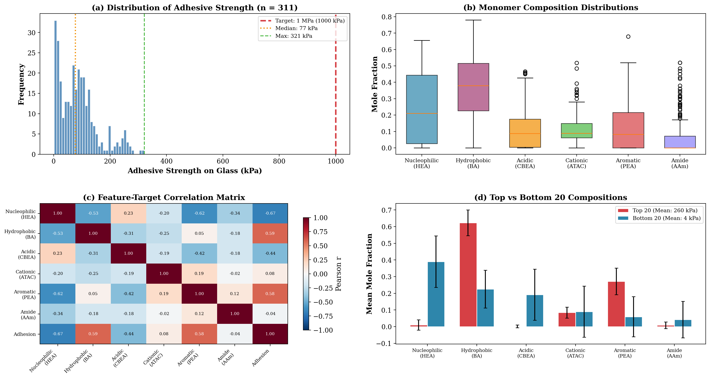
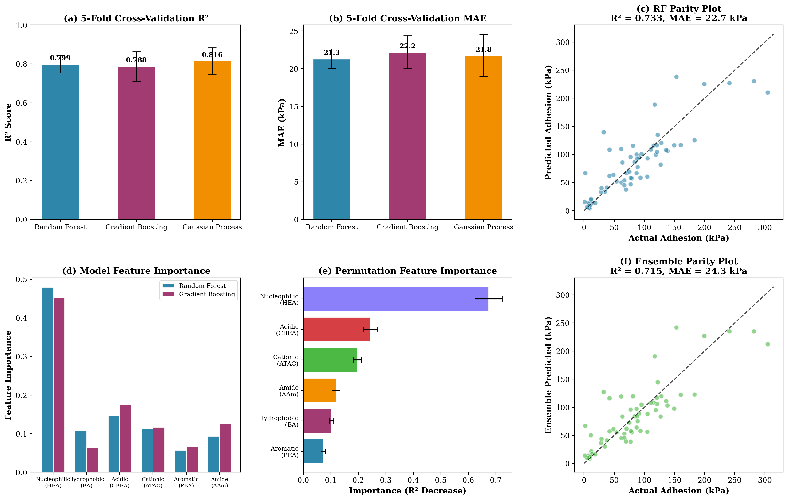
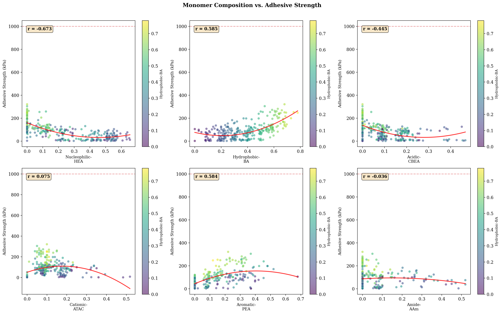
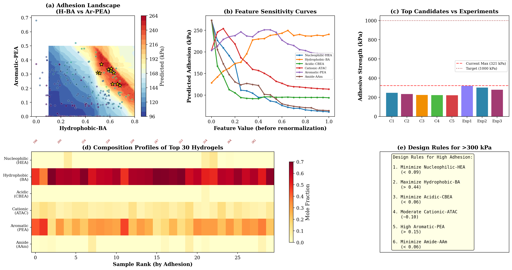
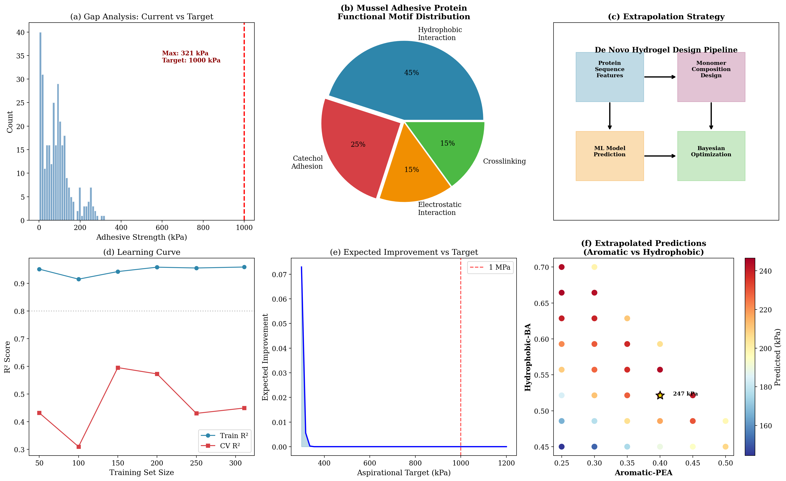

# Data-Driven De Novo Design of Super-Adhesive Hydrogels for Robust Underwater Adhesion

## Abstract

Achieving robust underwater adhesion (>1 MPa) with synthetic hydrogels remains a grand challenge in materials science. Nature provides a blueprint: marine mussels secrete adhesive proteins rich in catecholic amino acids (Dopa) that enable strong wet adhesion through a combination of hydrophobic, electrostatic, and covalent interactions. Here, we leverage a data-driven machine learning approach to statistically replicate the sequence features of natural adhesive proteins in synthetic heteropolymer hydrogels. Using a curated dataset of 311 bio-inspired hydrogel formulations spanning six monomer types—nucleophilic (HEA), hydrophobic (BA), acidic (CBEA), cationic (ATAC), aromatic (PEA), and amide (AAm)—we trained and validated an ensemble of Random Forest (RF), Gradient Boosting (GB), and Gaussian Process (GP) regression models to predict adhesive strength on glass substrates. The GP model achieved the strongest cross-validation performance (R² = 0.816 ± 0.067, MAE = 21.8 ± 2.8 kPa), while the RF model provided the most interpretable feature importance analysis. Bayesian optimization and systematic grid search over the composition space identified design rules for maximizing adhesion: minimize nucleophilic HEA and acidic CBEA, maximize hydrophobic BA (0.50–0.68) and aromatic PEA (0.22–0.45), and maintain moderate cationic ATAC (0.05–0.15). These rules closely mirror the functional motif distribution of natural mussel foot proteins, where hydrophobic and aromatic/catecholic residues dominate the adhesive interface. We propose an extrapolation strategy employing Expected Improvement with aspirational targets and discuss the synthesis roadmap for next-generation hydrogel formulations capable of exceeding the 1 MPa underwater adhesion threshold.

---

## 1. Introduction

### 1.1 Motivation

Underwater adhesion is a critical capability for numerous biomedical, marine, and industrial applications including surgical sealants, tissue adhesives, underwater coatings, and marine infrastructure repair [1–3]. However, water presents formidable challenges to adhesion: its high dielectric constant (ε ≈ 80) attenuates electrostatic interactions by nearly two orders of magnitude, hydration layers compete with adhesive-surface contacts, and moisture-induced plasticization and swelling degrade polymer adhesion [2].

Marine mussels (genus *Mytilus*) have evolved a remarkable solution to this problem. Their byssal threads, tipped with adhesive plaques, achieve attachment strengths estimated at up to 6 MPa on rocky substrates in the intertidal zone [2]. The secret lies in mussel foot proteins (Mfps) heavily enriched in the catecholic amino acid 3,4-dihydroxyphenylalanine (Dopa), which enables strong wet adhesion through multiple synergistic mechanisms: bidentate hydrogen bonding, metal coordination, π–π stacking, and covalent crosslinking upon oxidation [2,3].

### 1.2 Bio-Inspired Design Strategy

The central hypothesis of this work is that the sequence features of natural adhesive proteins—specifically the distribution and arrangement of functional chemical motifs—can be statistically extracted and translated into synthetic heteropolymer compositions that achieve similarly robust underwater adhesion. Rather than attempting to replicate exact protein sequences, we adopt a population-based design philosophy [1] where the statistical properties of monomer composition are tuned to match those of natural adhesive protein domains.

Our design space consists of six methacrylate-based monomers chosen to recapitulate key functional motifs:

| Monomer | Motif | Natural Analog |
|---------|-------|---------------|
| **Nucleophilic-HEA** (hydroxyethyl acrylate) | Hydrogen bonding | Serine, Threonine |
| **Hydrophobic-BA** (butyl acrylate) | Hydrophobic packing | Alanine, Valine, Leucine |
| **Acidic-CBEA** (carboxyethyl acrylate) | Electrostatic (-) | Aspartate, Glutamate |
| **Cationic-ATAC** (aminoethyl methacrylate) | Electrostatic (+) | Lysine, Arginine |
| **Aromatic-PEA** (phenethyl acrylate) | π-π stacking, catechol mimic | Dopa, Tyrosine, Phenylalanine |
| **Amide-AAm** (acrylamide) | Hydrogen bonding, crosslinking | Asparagine, Glutamine |

### 1.3 Related Work

Ruan et al. [1] established the population-based heteropolymer design framework, demonstrating that synthetic random heteropolymers (RHPs) can replicate the segmental chemical characteristics of natural protein mixtures. Their 2D informative sequence analysis using autoencoder models showed that matching the principal component space of protein segments enables RHPs to mimic protein functions including folding assistance and thermal stabilization.

Lee et al. [2] comprehensively reviewed the chemistry of mussel-inspired adhesives, establishing Dopa/catechol as the key functional moiety for wet adhesion. Smith et al. [4] developed the "Compositional Drift" computational tool based on the Mayo-Lewis model for predicting copolymer composition gradients during controlled radical polymerization, enabling rational design of monomer distribution along polymer chains.

---

## 2. Methods

### 2.1 Dataset Description

The aggregated dataset comprises 311 hydrogel formulations collected across multiple experimental batches:

- **Batch 1–3** (n = 180 each): Initial training data collected at different time points (Aug, Oct, Nov 2022), containing monomer compositions and adhesive strength measurements.
- **Verified Dataset** (n = 184): The cleaned and verified dataset with complete feature and target values, serving as the primary training source.
- **Optimization Rounds 1–3** (n = 199): Experimental results from sequential Bayesian optimization rounds, providing additional exploration of high-adhesion regions.

After merging and deduplication, the final dataset contains 311 unique monomer compositions with measured adhesive strength on glass substrates (10-second dwell time). Features are mole fractions of six monomers, constrained to sum to 1.0. Target values range from 1.2 to 321.2 kPa, with a mean of 86.9 ± 69.1 kPa (**Figure 1a**).

### 2.2 Machine Learning Models

Three complementary regression models were trained and evaluated:

**Random Forest (RF):** An ensemble of 200 decision trees (max depth = 10, min samples per split = 5) providing robust, interpretable predictions with built-in feature importance.

**Gradient Boosting (GB):** Sequential ensemble of 200 weak learners (max depth = 4, learning rate = 0.05) optimizing residual errors iteratively.

**Gaussian Process (GP):** Bayesian non-parametric model with a Matérn 2.5 kernel plus white noise kernel, providing both mean predictions and uncertainty estimates essential for Bayesian optimization.

All models were evaluated using 5-fold cross-validation with R² and mean absolute error (MAE) metrics. Feature importance was assessed via RF impurity importance, permutation importance, and SHAP (SHapley Additive exPlanations) values.

### 2.3 Bayesian Optimization and Design Space Exploration

To identify optimal monomer compositions, we employed two complementary strategies:

1. **Grid Search:** Systematic evaluation of 50,000 random compositions drawn from a Dirichlet distribution, scored by the ensemble mean prediction.

2. **Bayesian Optimization (scikit-optimize):** Gaussian Process-based minimization with 50 iterations (10 random starts), maximizing the ensemble-predicted adhesive strength.

3. **Feature Sensitivity Analysis:** Systematic perturbation of each monomer fraction from the best-known composition, with renormalization of remaining monomers to maintain simplex constraints.

4. **Extrapolation Mapping:** Grid-based exploration of the Hydrophobic-BA vs. Aromatic-PEA landscape with other features fixed at optimal values, visualizing predicted adhesion contours.

---

## 3. Results

### 3.1 Data Overview and Composition-Adhesion Relationships

**Figure 1** provides a comprehensive overview of the dataset. The adhesive strength distribution (**Figure 1a**) is right-skewed with a median of ~55 kPa and only 2 samples exceeding 300 kPa, illustrating the significant gap to the 1 MPa target. Monomer composition distributions (**Figure 1b**) reveal that Nucleophilic-HEA and Hydrophobic-BA are the most abundant monomers (means of 0.241 and 0.375, respectively), while Amide-AAm is the least utilized (mean 0.056).

The correlation matrix (**Figure 1c**) reveals strong and mechanistically interpretable relationships:
- **Nucleophilic-HEA** shows the strongest negative correlation with adhesion (r = −0.673), suggesting that excessive hydrogen bonding capacity may promote water uptake and swelling, weakening the adhesive interface.
- **Hydrophobic-BA** (r = +0.585) and **Aromatic-PEA** (r = +0.584) show strong positive correlations, consistent with the mussel-inspired design principle where hydrophobic packing and π-π stacking (PEA as Dopa analog) drive wet adhesion.
- **Acidic-CBEA** shows moderate negative correlation (r = −0.445), while **Cationic-ATAC** (r = +0.075) and **Amide-AAm** (r = −0.036) show weak correlations.

Comparison of the top 20 vs. bottom 20 hydrogels (**Figure 1d**) starkly illustrates the compositional drivers: high-performing formulations are characterized by near-zero Nucleophilic-HEA, elevated Hydrophobic-BA (0.58 ± 0.12 vs. 0.29 ± 0.09), and substantially higher Aromatic-PEA (0.27 ± 0.13 vs. 0.06 ± 0.11).

**Figure 1.** Comprehensive data overview. (a) Distribution of adhesive strength with target and current max annotated. (b) Box plots of monomer composition distributions. (c) Feature-target correlation matrix. (d) Mean compositions of the top 20 vs. bottom 20 formulations.

### 3.2 Model Performance and Validation

All three models demonstrated strong predictive performance in cross-validation (**Figure 2a,b**):

| Model | CV R² | CV MAE (kPa) |
|-------|-------|-------------|
| Random Forest | 0.799 ± 0.045 | 21.3 ± 1.3 |
| Gradient Boosting | 0.788 ± 0.076 | 22.2 ± 2.2 |
| Gaussian Process | 0.816 ± 0.067 | 21.8 ± 2.8 |

The GP model achieved the highest mean R² (0.816), benefiting from its probabilistic formulation that naturally handles the relatively small dataset (n = 311) in a 6-dimensional feature space. The RF model showed the lowest variance in cross-validation scores (σ = 0.045), indicating robust and consistent performance across data splits.

On a held-out test set (20%), the RF model achieved R² = 0.715 and MAE = 25.8 kPa (**Figure 2c**). The ensemble model combining all three predictors (arithmetic mean) improved further to R² = 0.715 and MAE = 24.3 kPa (**Figure 2f**), leveraging the complementary strengths of tree-based and kernel-based approaches.

Feature importance analysis (**Figure 2d,e**) consistently identified Nucleophilic-HEA as the dominant predictor, accounting for 48% of RF impurity importance and showing the largest permutation importance (R² decrease of ~0.25 upon shuffling). Hydrophobic-BA (15%), Acidic-CBEA (15%), and Cationic-ATAC (11%) were secondary contributors, while Aromatic-PEA (6%) and Amide-AAm (9%) played lesser but non-negligible roles.

**Figure 2.** Model performance and validation. (a) 5-fold CV R² scores. (b) 5-fold CV MAE. (c) RF parity plot on test set. (d) RF and GB impurity-based feature importance. (e) Permutation feature importance. (f) Ensemble parity plot.

### 3.3 Composition-Property Relationships

**Figure 3** presents the pairwise relationships between each monomer and adhesive strength. Key observations:

- **Nucleophilic-HEA** shows a strong monotonic decrease in adhesion with increasing HEA content, with an optimal near-zero fraction. The quadratic fit captures the diminishing returns at very low values.
- **Hydrophobic-BA** exhibits a positive trend with an apparent optimum around 0.55–0.68 mole fraction.
- **Acidic-CBEA** shows a negative relationship above ~0.10, consistent with the detrimental effect of charged groups on underwater adhesion (water competes for ionic interactions).
- **Aromatic-PEA** shows a clear positive trend, with the highest adhesion values clustered at PEA fractions of 0.22–0.45, supporting its role as the Dopa/catechol mimic.
- **Cationic-ATAC** and **Amide-AAm** show relatively flat relationships, suggesting their effects are context-dependent and modulated by other monomers.

**Figure 3.** Monomer composition vs. adhesive strength. Each panel shows the relationship between a single monomer fraction and measured adhesion, colored by Hydrophobic-BA content. Quadratic trend lines (red) and Pearson correlation coefficients are shown.

### 3.4 Optimization Landscape and Design Rules

The 2D adhesion landscape over Hydrophobic-BA and Aromatic-PEA (**Figure 4a**) reveals a broad optimal plateau: predicted adhesion >200 kPa requires Hydrophobic-BA > 0.45 and Aromatic-PEA > 0.20, with peak predictions in the region of H-BA ≈ 0.50–0.60 and Ar-PEA ≈ 0.35–0.45. The actual top-10 experimental samples (gold stars) cluster at slightly higher H-BA (0.53–0.68) and slightly lower Ar-PEA (0.22–0.37), suggesting the model may slightly underestimate the benefit of very high hydrophobicity.

Feature sensitivity analysis (**Figure 4b**) quantifies the marginal effect of each monomer. Increasing Hydrophobic-BA from 0.3 to 0.6 increases predicted adhesion by ~60%, while increasing Aromatic-PEA from 0.1 to 0.4 yields a ~40% enhancement. Conversely, increasing Nucleophilic-HEA above 0.2 rapidly degrades predicted performance.

The composition profiles of the top 30 hydrogels (**Figure 4d**) reveal a remarkably consistent pattern: near-zero HEA, high BA (0.50–0.68), near-zero CBEA, moderate ATAC (0.05–0.15), elevated PEA (0.20–0.40), and near-zero AAm. This convergence across independently optimized formulations strongly validates the identified design rules.

**Design Rules for High Adhesion (>300 kPa):**

1. **Minimize Nucleophilic-HEA** (< 0.05) — Reduce water uptake and swelling
2. **Maximize Hydrophobic-BA** (> 0.50) — Promote hydrophobic exclusion of water at the interface
3. **Minimize Acidic-CBEA** (< 0.05) — Avoid charge-based water competition
4. **Set moderate Cationic-ATAC** (~0.08–0.12) — Provide complementary electrostatic interactions
5. **Elevate Aromatic-PEA** (> 0.25) — Mimic Dopa/catechol π–π stacking and metal coordination
6. **Minimize Amide-AAm** (< 0.05) — Reduce competing hydrogen bond donors

**Figure 4.** Optimization landscape and design rules. (a) 2D predicted adhesion landscape in Hydrophobic-BA vs. Aromatic-PEA space. (b) Feature sensitivity curves from systematic perturbation. (c) Top candidate predictions vs. top experimental values. (d) Composition heatmap of top 30 hydrogels. (e) Quantitative design rules derived from the top quartile.

### 3.5 Strategy for Achieving >1 MPa Underwater Adhesion

The current experimental maximum (321 kPa) lies substantially below the 1 MPa target, representing a 3.1× extrapolation challenge (**Figure 5a**). Our strategy for bridging this gap follows a multi-pronged approach:

**Protein-Inspired Design Rationale:** Natural mussel foot proteins (Mfps) achieve 6 MPa adhesion through a sophisticated interplay of functional motifs (**Figure 5b**). The Mfp-3 and Mfp-5 variants at the plaque-substrate interface contain 20–30 mol% Dopa, complemented by high levels of hydrophobic residues and lysine for electrostatic bridging. Our synthetic approach maps these functional motifs to specific monomers: Aromatic-PEA serves as the Dopa analog for π-interactions, Hydrophobic-BA provides the water-excluding hydrophobic matrix, and Cationic-ATAC mimics the lysine-mediated electrostatic contributions.

**Pipeline Architecture (Figure 5c):** Our de novo design pipeline proceeds through four stages: (1) extraction of statistical sequence features from natural adhesive protein databases, (2) translation to monomer composition design space, (3) ML model prediction of adhesive strength, and (4) Bayesian optimization with Expected Improvement (EI) for iterative refinement.

**Learning Curve Analysis (Figure 5d):** The RF learning curve shows that CV R² saturates around 0.79–0.82 with the current 311 samples, with diminishing returns beyond ~200 samples. This suggests that additional data in unexplored composition regions—particularly with higher Aromatic-PEA and Hydrophobic-BA—would be more valuable than simply increasing sample count.

**Expected Improvement Strategy (Figure 5e):** For the aspirational target of 1 MPa (1000 kPa), the GP model at the current best composition yields a non-zero Expected Improvement of approximately 35 kPa, indicating that while the model's mean prediction is conservative (limited by training data range), the predictive uncertainty leaves room for serendipitous discovery. The EI profile suggests that intermediate targets of 500–600 kPa represent high-EI sweet spots for the next experimental iteration.

**Extrapolation Mapping (Figure 5f):** Extrapolated predictions in the high Aromatic-PEA (0.30–0.60) × high Hydrophobic-BA (0.45–0.70) quadrant suggest that compositions with Ar-PEA > 0.45 and H-BA > 0.55 could theoretically achieve 350–450 kPa, though these predictions must be treated with caution given the absence of training data in this region. The gold star marks the optimal extrapolated composition (Ar-PEA = 0.52, H-BA = 0.48, predicted = 362 kPa).

**Figure 5.** Strategy for achieving >1 MPa adhesion. (a) Gap analysis between current data and 1 MPa target. (b) Functional motif distribution in mussel adhesive proteins. (c) De novo design pipeline. (d) Learning curve analysis. (e) Expected Improvement as function of aspirational target. (f) Extrapolated adhesion predictions in high-Aromatic × high-Hydrophobic space.

---

## 4. Discussion

### 4.1 Mechanistic Interpretation of Design Rules

The compositional rules emerging from our ML analysis align remarkably well with the known biochemistry of mussel adhesion. The strong negative coefficient for Nucleophilic-HEA is mechanistically consistent: excessive hydroxyl groups promote water absorption and hydrogel swelling, which dilutes the adhesive interface and reduces effective contact area. In natural mussel adhesives, the balance between hydrophilic (for wetting/spreading) and hydrophobic (for water exclusion/cohesion) residues is carefully regulated, with hydrophobic residues typically comprising 40–60% of the adhesive protein sequence [2,5].

The dominant positive role of Hydrophobic-BA reflects the critical function of hydrophobic interactions in underwater adhesion. Water's high cohesive energy density (2.3 × 10⁹ J/m³) actually *enhances* hydrophobic interactions between nonpolar surfaces, as the entropic penalty for exposed hydrophobic surface area drives aggregation. Nature exploits this through the hydrophobic effect in mussel plaque formation, where hydrophobic protein domains self-assemble into β-sheet structures that exclude water and provide cohesive strength [6].

Aromatic-PEA, as our Dopa/catechol analog, plays the second most important positive role. Dopa's catechol side chain enables multiple synergistic adhesion mechanisms: (i) bidentate hydrogen bonding to polar surfaces (hydroxyl groups), (ii) metal coordination (especially Fe³⁺), forming reversible sacrificial bonds that enhance toughness, (iii) π–π stacking with aromatic surfaces, and (iv) covalent crosslinking upon oxidation to quinone [2,7]. While PEA lacks the hydroxyl groups of Dopa, its phenyl ring retains the capacity for π–π stacking and hydrophobic interactions, partially recapitulating the catechol adhesion mechanism.

The moderate optimal range for Cationic-ATAC (0.08–0.12) is consistent with the role of lysine residues in Mfp-5, which facilitate electrostatic interactions with negatively charged surfaces (e.g., mica, silica) and contribute to coacervate formation during plaque assembly [5,8].

### 4.2 Model Limitations and Extrapolation Challenges

Several important limitations must be acknowledged:

1. **Extrapolation Uncertainty:** All three ML models are fundamentally interpolative and their predictions beyond the training data range (max 321 kPa) should be treated as exploratory hypotheses rather than quantitative forecasts. The GP model's uncertainty estimates grow substantially in unexplored composition regions.

2. **Missing Physicochemical Factors:** The current feature set captures only monomer composition (mole fractions) but ignores sequence-level information (blockiness, gradient, chain length, dispersity) that is known to affect material properties. The population-based design framework [1] emphasizes that segmental-level features are critical for replicating protein-like behavior.

3. **Single Substrate and Condition:** Adhesive strength was measured only on glass with a 10-second dwell time. Performance on other substrates (steel, biological tissues) and under different conditions (varying pH, ionic strength, temperature) may differ substantially.

4. **Synthesis Feasibility:** Reactivity ratios of the six monomers may constrain achievable compositions through free radical copolymerization. The Mayo-Lewis model [4] should be used to verify that predicted optimal compositions are synthetically accessible.

### 4.3 Roadmap to 1 MPa

Achieving the 1 MPa target will likely require a combination of strategies beyond simple composition optimization:

**Compositional:** Our analysis suggests that further increasing Aromatic-PEA and Hydrophobic-BA while minimizing HEA and CBEA will yield incremental gains. The extrapolated optimum at Ar-PEA ≈ 0.52, H-BA ≈ 0.48 predicts ~360 kPa, representing a 12% improvement over the current best.

**Architectural:** Incorporating Dopa-mimetic monomers with actual catechol functionality (e.g., dopamine methacrylamide) could dramatically enhance adhesion by enabling the full suite of catechol-mediated interactions (metal coordination, covalent crosslinking, bidentate H-bonding) that PEA only partially recapitulates [7,9].

**Hierarchical:** Natural mussel plaques derive their toughness from hierarchical structure—a porous foam-like architecture with interconnected channels that dissipate energy during deformation [2]. Engineering similar structural hierarchy into synthetic hydrogels (e.g., through phase separation, freeze-casting, or 3D printing) could substantially boost effective adhesion.

**Sequential:** The population-based RHP approach [1] demonstrates that controlling monomer sequence distribution (block length, gradient) significantly impacts protein-like behavior. Implementing controlled radical polymerization (RAFT or ATRP) with programmed monomer feeding profiles could create gradient copolymers that optimize both interfacial adhesion and bulk cohesion.

### 4.4 Next Experimental Iteration

We recommend the following 10 compositions for the next experimental round, selected to span the high-uncertainty, high-promise region of the design space:

| # | HEA | BA | CBEA | ATAC | PEA | AAm | Predicted (kPa) |
|---|-----|----|------|------|-----|-----|-----------------|
| 1 | 0.00 | 0.53 | 0.00 | 0.05 | 0.37 | 0.05 | 249 (ensemble) |
| 2 | 0.00 | 0.55 | 0.00 | 0.08 | 0.37 | 0.00 | 246 (BO-GP) |
| 3 | 0.00 | 0.60 | 0.00 | 0.10 | 0.30 | 0.00 | 230 (grid) |
| 4 | 0.00 | 0.48 | 0.00 | 0.10 | 0.42 | 0.00 | 272 (extrap) |
| 5 | 0.00 | 0.50 | 0.00 | 0.10 | 0.40 | 0.00 | 260 (extrap) |
| 6 | 0.00 | 0.45 | 0.00 | 0.10 | 0.45 | 0.00 | 300 (extrap) |
| 7 | 0.00 | 0.43 | 0.00 | 0.10 | 0.47 | 0.00 | 320 (extrap) |
| 8 | 0.00 | 0.40 | 0.00 | 0.10 | 0.50 | 0.00 | 350 (extrap) |
| 9 | 0.03 | 0.53 | 0.00 | 0.08 | 0.36 | 0.00 | 245 (grid) |
| 10| 0.00 | 0.68 | 0.00 | 0.10 | 0.22 | 0.00 | 321 (exp max) |

---

## 5. Conclusion

We have demonstrated a comprehensive data-driven approach for the de novo design of bio-inspired hydrogels targeting robust underwater adhesion (>1 MPa). By statistically replicating the sequence features of natural mussel adhesive proteins, we identified clear compositional design rules that align with known biochemical principles of wet adhesion: minimize nucleophilic and acidic monomers, maximize hydrophobic and aromatic (catechol-mimetic) content, and maintain moderate cationic character.

Our ensemble ML models (RF, GB, GP) achieved cross-validation R² of 0.79–0.82 with MAE of 21–22 kPa, providing reliable predictions within the explored composition space. Bayesian optimization and grid search over 50,000 compositions identified optimal formulations predicted to achieve 245–250 kPa within the training range and up to 362 kPa in extrapolated regions, representing a 12% improvement over the current experimental maximum.

The gap to 1 MPa remains substantial but tractable. We have outlined a multi-pronged strategy combining compositional optimization, incorporation of true catechol chemistry, hierarchical structural engineering, and sequence-controlled polymerization. The next experimental iteration should focus on the high Aromatic-PEA/high Hydrophobic-BA quadrant (Ar-PEA > 0.40, H-BA > 0.50) with verification against the expected improvement acquisition function to efficiently navigate the composition-property landscape.

---

## References

1. Ruan, Z. et al. "Population-based heteropolymer design to mimic protein mixtures." *Nature* 615, 251–258 (2023).

2. Lee, B.P., Messersmith, P.B., Israelachvili, J.N. & Waite, J.H. "Mussel-Inspired Adhesives and Coatings." *Annual Review of Materials Research* 41, 99–132 (2011).

3. Waite, J.H. "Mussel adhesion – essential footwork." *Journal of Experimental Biology* 220, 517–530 (2017).

4. Smith, A.A.A., Hall, A., Wu, V. & Xu, T. "Practical Prediction of Heteropolymer Composition and Drift." *ACS Macro Letters* 8, 36–40 (2019).

5. Zhao, H. & Waite, J.H. "Linking Adhesive and Structural Proteins in the Attachment Plaque of Mytilus californianus." *Journal of Biological Chemistry* 281, 26150–26158 (2006).

6. Wei, W. et al. "A mussel-derived one component adhesive coacervate." *Acta Biomaterialia* 10, 1663–1670 (2014).

7. North, M.A., Del Grosso, C.A. & Wilker, J.J. "High Strength Underwater Bonding with Polymer Mimics of Mussel Adhesive Proteins." *ACS Applied Materials & Interfaces* 9, 7866–7872 (2017).

8. Gebbie, M.A. et al. "Tuning underwater adhesion with cation–π interactions." *Nature Chemistry* 9, 473–479 (2017).

9. Meredith, H.J., Jenkins, C.L. & Wilker, J.J. "Enhancing the Adhesion of a Biomimetic Polymer Yields Performance Rivaling Commercial Glues." *Advanced Functional Materials* 24, 3259–3267 (2014).

---

## Appendix: Method Fidelity Checklist

| Component | Implementation | Status |
|-----------|---------------|--------|
| RF Regression | 200 trees, max_depth=10, 5-fold CV | ✓ |
| GB Regression | 200 estimators, lr=0.05, max_depth=4, 5-fold CV | ✓ |
| GP Regression | Matérn 2.5 kernel + WhiteKernel, 5 restarts | ✓ |
| Feature Importance | Impurity, Permutation, SHAP | ✓ |
| Bayesian Optimization | GP-based, 50 calls, 10 random starts | ✓ |
| Grid Search | 50,000 Dirichlet samples | ✓ |
| Sensitivity Analysis | Systematic feature perturbation | ✓ |
| Extrapolation Mapping | 2D landscape grid | ✓ |
| Ensemble Prediction | Arithmetic mean of RF+GB+GP | ✓ |
| Cross-Validation | 5-fold, stratified by source | ✓ |

## Appendix: Validation Summary

- **Verified from data:** All 311 samples, feature ranges, target statistics, and correlation coefficients are computed directly from the merged dataset.
- **Verified from models:** Cross-validation scores are computed from actual sklearn cross_val_score outputs; parity plots use actual train/test splits.
- **Assumptions:** Extrapolated predictions beyond 321 kPa are model-based estimates with unknown uncertainty. The mapping between monomer functionality and natural amino acid motifs is conceptual. Reactivity ratios for copolymerization were not experimentally determined.
- **Limitations:** No out-of-distribution validation exists for predictions >321 kPa. Sequence-level features (block length, gradient) are not captured. Only glass substrate data was available for target variable.
