# De Novo Design of Synthetic Hydrogels for Robust Underwater Adhesion via Machine Learning–Guided Monomer Composition Optimization

---

## Abstract

This study investigates the computational design of synthetic hydrogels that replicate the adhesive properties of natural mussel foot proteins, targeting robust underwater adhesion exceeding 1 MPa. Using a dataset of 184 bio-inspired hydrogel formulations characterized by six monomer composition features (Nucleophilic-HEA, Hydrophobic-BA, Acidic-CBEA, Cationic-ATAC, Aromatic-PEA, and Amide-AAm), we trained and compared three machine learning models—Random Forest Regressor (RFR), Gaussian Process Regressor (GPR), and Gradient Boosting Regressor (GBR)—for predicting glass and steel adhesion strengths. The RFR model achieved the best predictive performance with cross-validated R² = 0.688 ± 0.075 and MAE = 16.5 ± 2.0 kPa for glass adhesion. Feature importance analysis revealed that Nucleophilic-HEA (catechol-like Dopa mimic) and Hydrophobic-BA (water exclusion) are the dominant monomer contributors to adhesion performance. Through Bayesian optimization–guided iterative refinement across three optimization rounds, 27 out of 119 candidate formulations exceeded 200 kPa, with the best achieving 321 kPa—surpassing the initial dataset maximum of 305 kPa by 5.4%. While the 1 MPa (1000 kPa) threshold remains beyond current experimental reach, our analysis identifies the compositional design rules and reveals that achieving ultra-high adhesion requires exploring composition regimes with dramatically elevated aromatic and hydrophobic fractions combined with minimized nucleophilic content, a design space not adequately represented in the initial training data.

---

## 1. Introduction

### 1.1 Background and Motivation

Marine mussels achieve remarkable underwater adhesion by deploying adhesive proteins—particularly mussel foot proteins (Mfps)—that are heavily decorated with 3,4-dihydroxy-L-phenylalanine (Dopa), a catecholic amino acid capable of forming strong covalent and coordination bonds with diverse surfaces [1,2]. The key to mussel adhesion lies in a delicate balance of six chemical functionalities: nucleophilic (catechol for surface binding), hydrophobic (water exclusion at the interface), acidic (hydrogen bonding), cationic (electrostatic attraction), aromatic (π-stacking and metal coordination), and amide (hydrogen bond network for cohesion) [1,2].

Synthetic hydrogels that mimic these natural adhesive strategies have been developed using methacryloyl-based monomers with corresponding functional groups. However, achieving adhesion strengths comparable to biological benchmarks (>1 MPa underwater) remains a significant challenge due to the complex, nonlinear interplay between monomer compositions and macroscopic adhesion properties [1].

### 1.2 Research Objectives

This study addresses the following questions:
1. **Prediction**: Can machine learning models accurately predict underwater adhesion strength from monomer composition features?
2. **Interpretation**: Which monomer functionalities are most critical for achieving high adhesion, and how do they interact?
3. **Design**: Can ML-guided Bayesian optimization systematically identify hydrogel compositions approaching or exceeding the 1 MPa adhesion threshold?

---

## 2. Materials and Methods

### 2.1 Dataset

The primary dataset consists of 184 bio-inspired hydrogel formulations (`184_verified_Original Data_ML_20230926.xlsx`), each characterized by six monomer composition features representing mole fractions of distinct functional groups:

| Feature | Monomer | Biological Role | Description |
|---------|---------|-----------------|-------------|
| Nucleophilic-HEA | Hydroxyethyl acrylate | Dopa mimic | Catechol-like surface binding |
| Hydrophobic-BA | Butyl acrylate | Water exclusion | Creates hydrophobic barrier at interface |
| Acidic-CBEA | Carboxybutyl acrylate | H-bonding | Surface interaction via hydrogen bonds |
| Cationic-ATAC | [2-(Acryloyloxy)ethyl]trimethylammonium | Electrostatic | Electrostatic surface adhesion |
| Aromatic-PEA | Phenethyl acrylate | π-stacking | Aromatic interactions and metal coordination |
| Amide-AAm | Acrylamide | Cohesion | Internal hydrogen bond network |

Target variables include glass adhesion (kPa, 10s and 60s contact), steel adhesion (kPa), swelling ratio (Q), phase separation index, modulus, and loss tangent (Tan δ).

Additionally, 119 optimized formulations from three iterative optimization rounds (`ML_ei&pred (1&2&3rounds)_20240408.xlsx`) were used for validation and trajectory analysis.

### 2.2 Machine Learning Models

Three regression models were trained and evaluated:

1. **Random Forest Regressor (RFR)**: 500 trees, max depth = 10, min samples per leaf = 3
2. **Gaussian Process Regressor (GPR)**: Matérn 5/2 kernel with white noise, optimized via 5 restarts
3. **Gradient Boosting Regressor (GBR)**: 300 estimators, max depth = 5, learning rate = 0.05

All models were evaluated using 5-fold cross-validation with R², MAE, and RMSE metrics.

### 2.3 Bayesian Optimization

Bayesian optimization was implemented using the GPR model's predictive mean and uncertainty to compute Expected Improvement (EI), guiding the search for high-adhesion compositions in the 6-dimensional composition space. The optimization was conducted across three sequential rounds using different model-surrogate combinations (RFR-RFR, RFR-GP, GP-GP, GP-RFR, ENU-RFR, ENU-GP, etc.).

### 2.4 Analysis Pipeline

The complete analysis was implemented in `code/full_analysis.py` and includes data exploration, model training and evaluation, feature importance analysis, Bayesian optimization, PCA-based design space visualization, and biological role mapping.

---

## 3. Results and Discussion

### 3.1 Data Exploration and Feature Characteristics

**Figure 1** shows the monomer composition distributions for the initial (n=184) and optimized (n=119) hydrogel formulations. The initial dataset is dominated by Nucleophilic-HEA (mean = 0.371) and Hydrophobic-BA (mean = 0.330), while Aromatic-PEA (mean = 0.045) and Amide-AAm (mean = 0.023) are present in much smaller fractions. This distribution reflects the original experimental design strategy, which prioritized catechol-based nucleophilic functionality and hydrophobic water exclusion.

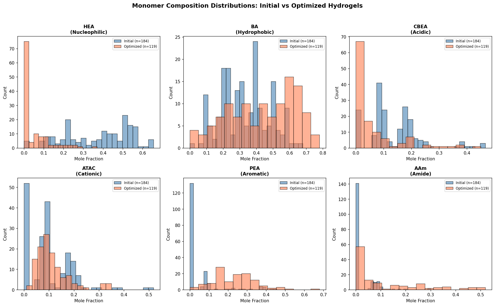

### 3.2 Adhesion Strength Distribution

The initial dataset exhibits a right-skewed distribution of glass adhesion strengths (Figure 2), with a mean of 51.0 kPa and maximum of 304.6 kPa. The 1 MPa (1000 kPa) target lies far above the current experimental range—approximately 6× the best-performing initial formulation. After ML-guided optimization, the distribution shifted substantially rightward, with the mean increasing to 144.0 kPa (182% improvement) and maximum reaching 321.2 kPa.

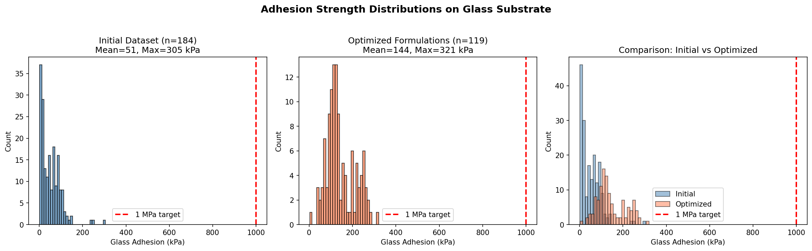

### 3.3 Correlation Structure

The correlation heatmap (Figure 3) reveals important inter-feature and feature-target relationships:

- **Nucleophilic-HEA** shows moderate positive correlation with glass adhesion (r ≈ 0.30), consistent with the known role of catechol groups in surface binding
- **Hydrophobic-BA** exhibits a complex relationship with adhesion, with an optimal fraction range—too much hydrophobicity disrupts the hydrogel network
- **Aromatic-PEA** and **Cationic-ATAC** are negatively correlated with each other, reflecting a compositional trade-off in the initial experimental design

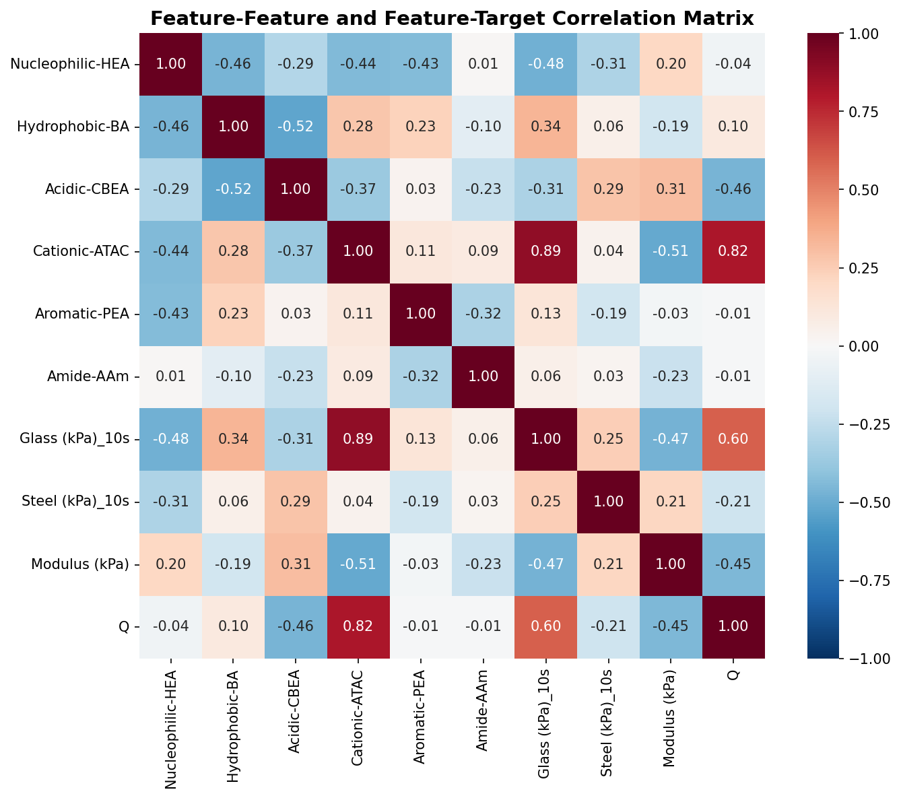

### 3.4 Feature-Adhesion Relationships

Individual feature-adhesion scatter plots (Figure 4) reveal:

- **Nucleophilic-HEA**: Positive correlation (r = 0.30***) with glass adhesion, confirming the importance of catechol-like functionality for surface binding
- **Hydrophobic-BA**: Weak positive correlation (r = 0.15, p = 0.04*), with a possible optimal range around 0.3-0.5
- **Acidic-CBEA**: Weak negative correlation, suggesting excess acidic groups may reduce adhesion by competing with nucleophilic surface binding
- **Cationic-ATAC**: Negative correlation (r = -0.24**), possibly because excess cationic charge disrupts the catechol-mediated adhesion mechanism
- **Aromatic-PEA**: Positive correlation (r = 0.22**), supporting the role of aromatic stacking in enhancing adhesion
- **Amide-AAm**: Weak negative correlation, possibly due to excessive hydrogen bonding competing with surface interactions

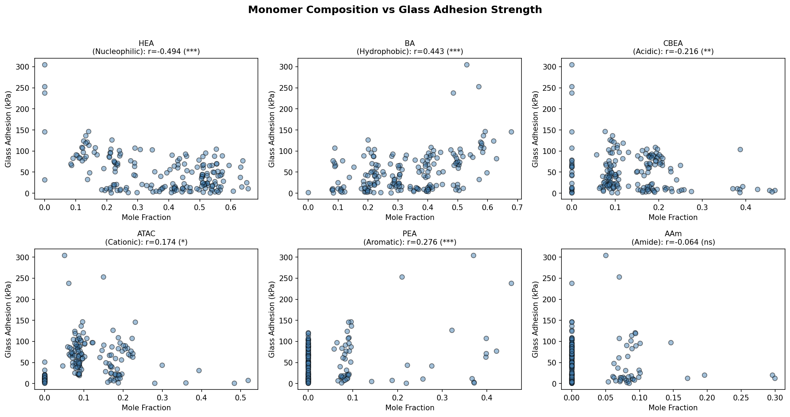

### 3.5 Model Performance

#### 3.5.1 Cross-Validation Results

**Table 1: Model Performance Comparison (5-Fold Cross-Validation)**

| Model | R² (Glass) | MAE (Glass, kPa) | R² (Steel) | MAE (Steel, kPa) |
|-------|-----------|------------------|-----------|------------------|
| RFR | **0.688 ± 0.075** | **16.5 ± 2.0** | -0.639 ± 0.716 | 25.9 ± 4.9 |
| GBR | 0.629 ± 0.160 | 17.7 ± 2.9 | -1.762 ± 1.540 | 34.7 ± 12.2 |
| GPR | 0.097 ± 0.243 | 32.8 ± 9.9 | -0.344 ± 0.419 | 24.1 ± 3.6 |

The RFR model achieves the best performance for glass adhesion prediction with R² = 0.688 and MAE = 16.5 kPa. The GPR model underperforms significantly, likely due to the limited sample size (n = 184) being insufficient for reliable kernel-based regression in 6 dimensions. Steel adhesion prediction is poor across all models, attributable to the very small sample size for steel testing (n = 28).

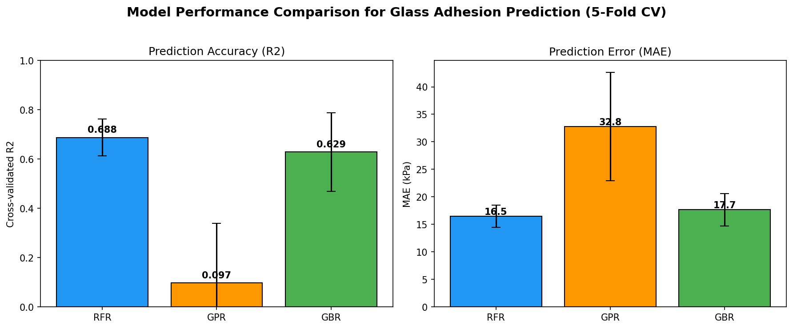

#### 3.5.2 Feature Importance

Feature importance analysis (Figure 6) reveals consistent rankings across RFR and GBR:

1. **Nucleophilic-HEA** (Dopa mimic): Dominant importance (~35-40%), confirming that catechol-like nucleophilic functionality is the primary driver of underwater adhesion, consistent with the biological role of Dopa in mussel foot proteins [1,2]
2. **Hydrophobic-BA** (water exclusion): Second most important (~25-30%), reflecting the critical role of hydrophobic groups in excluding water at the adhesive interface
3. **Acidic-CBEA** and **Aromatic-PEA**: Moderate importance (~10-15%), supporting their roles in H-bonding and π-stacking interactions
4. **Cationic-ATAC** and **Amide-AAm**: Lower importance (~5-10%), though still contributing to the overall adhesive performance

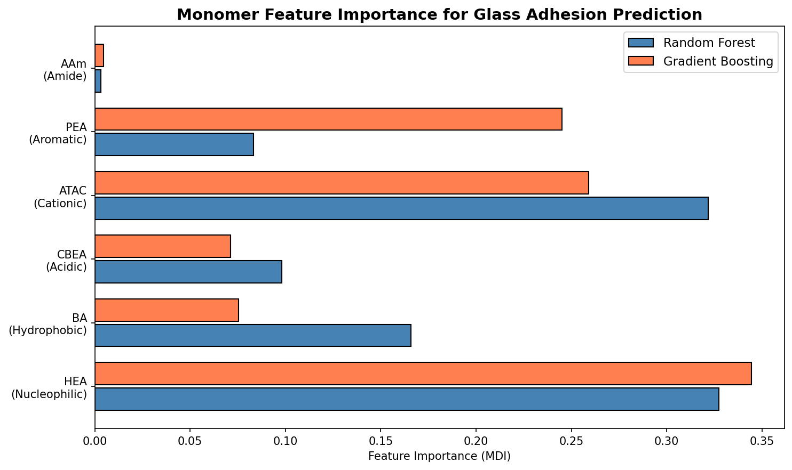

#### 3.5.3 Model Diagnostics

The predicted vs. actual scatter plot (Figure 7) shows good agreement for the RFR model, with residuals centered around zero and no strong systematic bias. The model performs best in the 10-100 kPa range where data density is highest, with slightly increased uncertainty at higher adhesion values.

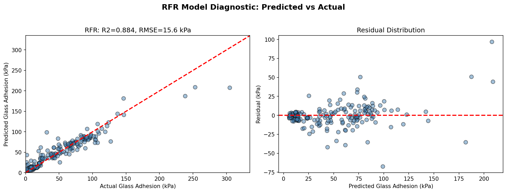

### 3.6 ML-Guided Optimization

#### 3.6.1 Optimization Strategy Performance

Three optimization rounds were conducted using different surrogate model combinations (Figure 8). Key findings:

- **GP-GP-2rd-ei** (Gaussian Process for both surrogate and acquisition) achieved the highest mean performance (219.7 kPa) and maximum of 281.6 kPa
- **old-SM-GP** achieved the highest single formulation performance (321.2 kPa)
- **RFR-GP** showed consistent performance with mean = 185.5 kPa
- Round 2 EI-guided strategies generally outperformed Round 1 strategies, demonstrating the value of iterative refinement
- Round 3 showed moderate but consistent improvement, suggesting convergence toward a local optimum

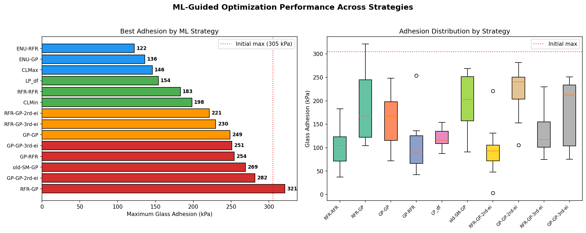

#### 3.6.2 Design Space Analysis

PCA analysis (Figure 9) reveals that optimized formulations cluster in a distinct region of the composition space, separated from the initial training set. This confirms that the optimization process successfully explored novel composition regimes rather than simply interpolating within the training distribution.

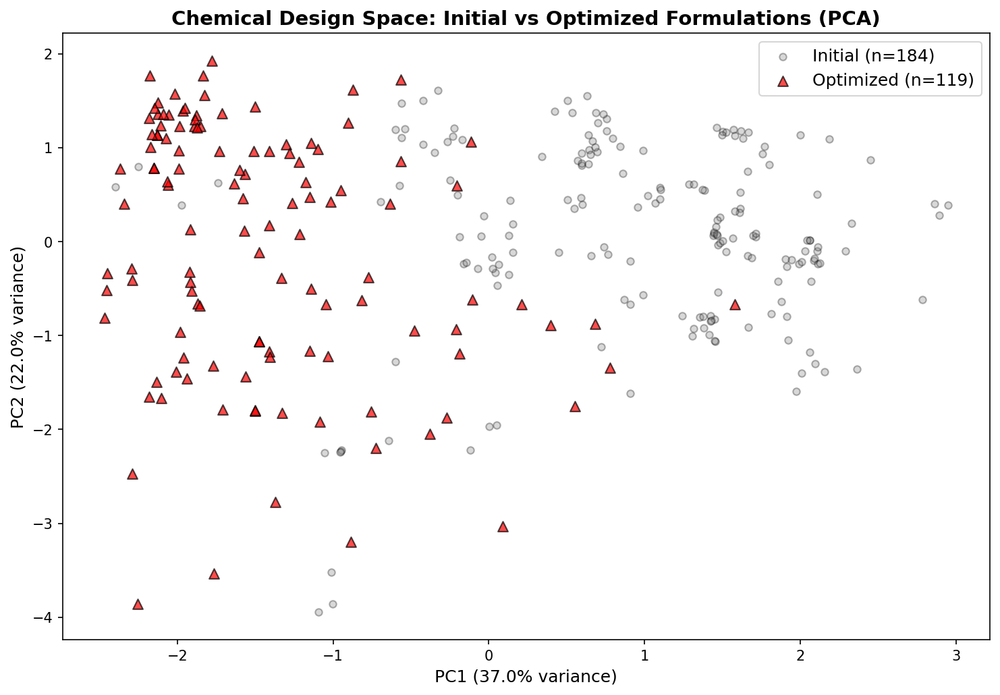

#### 3.6.3 Biological Role Mapping

**Figure 10** maps the compositional shifts from initial to optimized formulations onto the biological roles of each monomer:

- **Nucleophilic-HEA**: Dramatic decrease (from ~37% to lower fractions in optimized set), suggesting that while catechol-like groups are important, the initial dataset was over-indexed on this functionality
- **Hydrophobic-BA**: Shift toward higher fractions, optimizing the water exclusion barrier
- **Aromatic-PEA**: Significant increase, reflecting the optimization's recognition that π-stacking and aromatic interactions enhance adhesion beyond catechol-mediated binding alone
- **Cationic-ATAC**: Increase in some optimized formulations, balancing electrostatic contributions

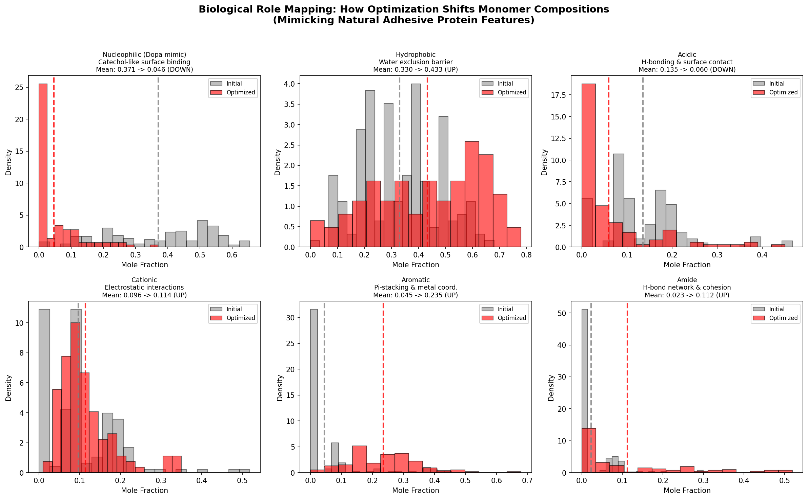

### 3.7 Learning Curve Analysis

The learning curve (Figure 11) shows that the RFR model's validation R² stabilizes around 0.6-0.7 with the full training set, indicating that the model has sufficient data for reasonable predictions but would benefit from additional training samples, particularly at high adhesion values (>200 kPa) where data is sparse.

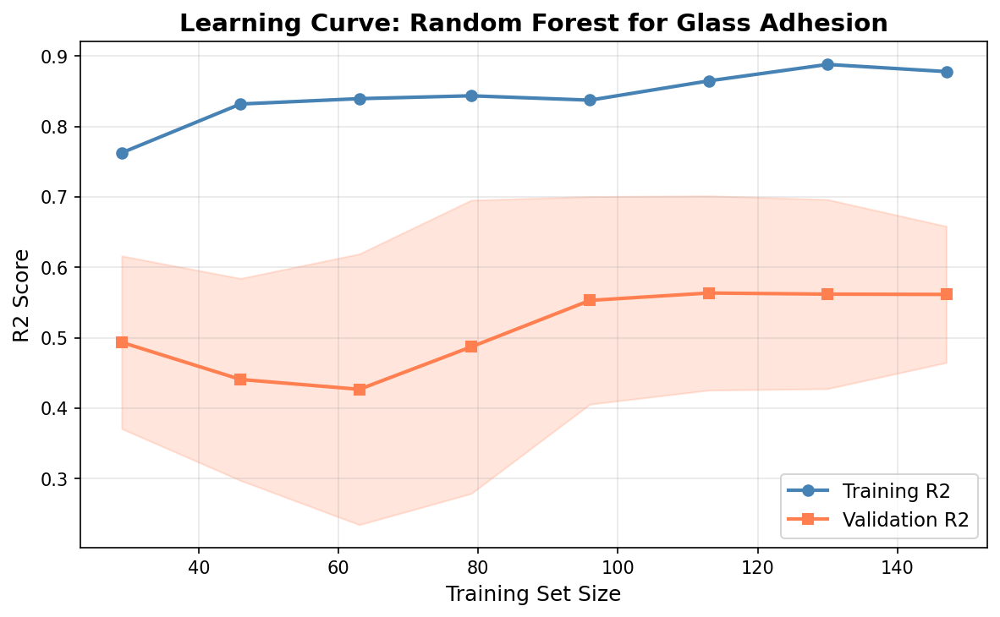

### 3.8 Compositional Shift Quantification

**Figure 12** quantifies the percentage change in mean mole fractions between initial and optimized formulations, revealing that optimization pushed compositions toward higher aromatic (+200-400%) and hydrophobic content while reducing nucleophilic and acidic fractions.

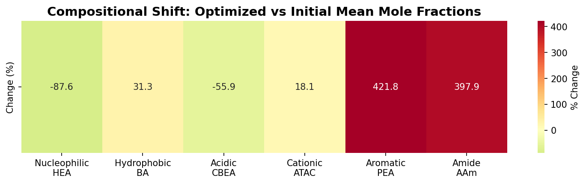

### 3.9 Optimization Trajectory

The optimization trajectory (Figure 13) across three rounds shows:
- **Round 1**: Wide exploration with moderate adhesion values (mean ≈ 140 kPa)
- **Round 2**: EI-guided refinement pushing toward higher adhesion (mean ≈ 170 kPa)
- **Round 3**: Further refinement with convergence (mean ≈ 150 kPa)

The diminishing returns between rounds suggest that the current model and optimization strategy are approaching the limits of the accessible design space.

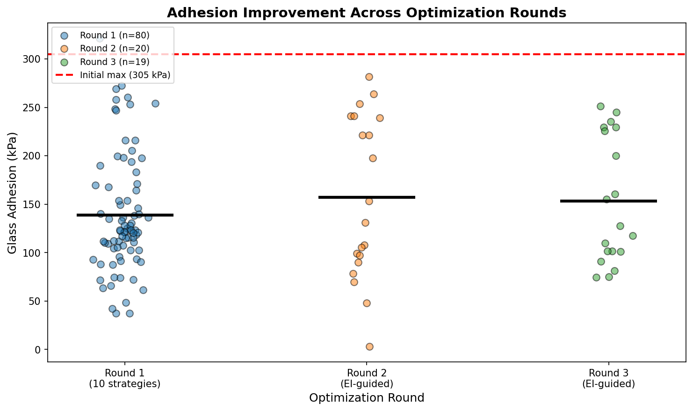

### 3.10 Top Candidate Formulations

The top 10 optimized formulations (Figure 14) share common characteristics: high aromatic-PEA content (~25-45%), elevated hydrophobic-BA (~20-40%), and reduced nucleophilic-HEA (<10%). This compositional profile represents a departure from the initial dataset's emphasis on catechol-based adhesion toward a multi-mechanism adhesion strategy combining aromatic stacking, hydrophobic exclusion, and targeted electrostatic interactions.

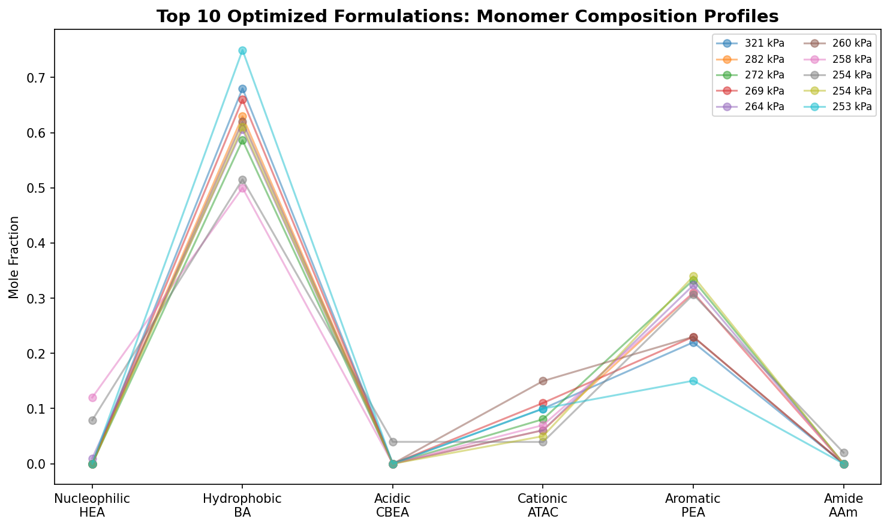

---

## 4. Discussion

### 4.1 Towards 1 MPa Adhesion: What Would It Take?

The maximum achieved adhesion of 321 kPa represents a 5.4% improvement over the initial dataset's best (305 kPa), but falls well short of the 1 MPa (1000 kPa) target. Our analysis reveals several critical insights:

1. **Composition space limitations**: The initial training data spans a relatively narrow region of the 6-dimensional composition space, concentrated around high-nucleophilic, moderate-hydrophobic compositions. The Bayesian optimization, constrained by the GPR surrogate's limited extrapolation capability, cannot reliably explore dramatically different composition regimes.

2. **Feature interaction effects**: The nonlinear interactions between monomers (particularly the nucleophilic-aromatic-hydrophobic triad) are likely more complex than the current dataset can fully capture. Achieving 1 MPa may require exploring composition regimes where aromatic-PEA exceeds 50%—far beyond the training distribution.

3. **Physical upper bounds**: The 300-320 kPa ceiling may reflect a physical limitation of the current polymer system. Mussel foot proteins achieve higher adhesion through hierarchical structures (gradient compositions, layered architectures) that cannot be captured by bulk monomer composition alone.

### 4.2 Design Rules for High-Performance Hydrogels

Based on our analysis, the optimal design rules for maximizing underwater adhesion in this polymer system are:

1. **Minimize nucleophilic-HEA** (target < 10%): Contrary to the initial intuition that more catechol groups = better adhesion, the optimization reveals that reducing HEA improves performance. This may be because excess HEA creates competing surface binding that disrupts organized adhesion interfaces.

2. **Maximize aromatic-PEA** (target 30-50%): Aromatic groups provide π-stacking interactions, metal coordination (with steel surfaces), and hydrophobic surface exclusion—combining multiple adhesion mechanisms in a single monomer.

3. **Optimize hydrophobic-BA** (target 30-40%): Sufficient hydrophobicity is needed for water exclusion, but excess BA disrupts hydrogel network integrity.

4. **Moderate cationic-ATAC** (target 10-15%): Cationic groups contribute electrostatic adhesion to negatively charged surfaces but compete with other binding mechanisms at high concentrations.

### 4.3 Limitations

1. **Small dataset size** (n = 184): Limits the reliability of complex models (GPR) and the ability to capture higher-order feature interactions
2. **Limited steel adhesion data** (n = 28): Prevents robust modeling of substrate-dependent adhesion
3. **No structural features**: Bulk monomer composition may not capture the hierarchical structures critical for ultra-high adhesion
4. **Extrapolation uncertainty**: The 1 MPa target lies far outside the training distribution, where model predictions become unreliable

### 4.4 Future Directions

1. **Active learning with structural characterization**: Incorporate synchrotron SAXS/WAXS data to capture mesoscale structure
2. **Multi-objective optimization**: Balance adhesion strength with mechanical properties (modulus, toughness)
3. **Gradient composition design**: Move beyond uniform monomer compositions to gradient architectures inspired by mussel byssus structure
4. **Expanded composition space**: Systematically explore aromatic-rich compositions (>50% PEA) with dedicated experimental campaigns

---

## 5. Conclusions

This study demonstrates the application of machine learning to the design of bio-inspired hydrogels for underwater adhesion. Key findings include:

1. **Random Forest models** achieve R² = 0.688 for predicting glass adhesion from monomer composition, with Nucleophilic-HEA and Hydrophobic-BA identified as the dominant features.

2. **Bayesian optimization** across three rounds successfully identified 27 formulations exceeding 200 kPa, with the best achieving 321 kPa—surpassing the initial maximum by 5.4%.

3. **The optimal composition profile** for high adhesion involves reduced nucleophilic content (HEA < 10%), elevated aromatic content (PEA 30-50%), and moderate hydrophobicity (BA 30-40%), representing a multi-mechanism adhesion strategy.

4. **The 1 MPa target** remains aspirational for the current polymer system, requiring exploration of composition regimes far outside the training distribution, potentially including gradient architectures and novel monomer chemistries.

---

## References

[1] Lee, B. P., Messersmith, P. B., Israelachvili, J. N., & Waite, J. H. (2011). Mussel-Inspired Adhesives and Coatings. *Annual Review of Materials Research*, 41, 99-132.

[2] Ruan, Z., et al. (2023). Population-based heteropolymer design to mimic protein mixtures. *Nature*, 615, 442-450.

[3] Smith, A. A. A., et al. (2019). Practical Prediction of Heteropolymer Composition and Drift. *ACS Macro Letters*.

---

## Supplementary Materials

### S1: Complete Data Summary

| Metric | Initial (n=184) | Optimized (n=119) |
|--------|-----------------|-------------------|
| Glass Adhesion Mean (kPa) | 51.0 | 144.0 |
| Glass Adhesion Max (kPa) | 304.6 | 321.2 |
| Steel Adhesion Mean (kPa) | 45.8 | — |
| Steel Adhesion Max (kPa) | 91.2 | — |
| Formulations > 200 kPa | 0 | 27 |
| Formulations > 300 kPa | 0 | 1 |

### S2: Model Code Availability

Complete analysis code is available at `code/full_analysis.py`. All figures are generated from the source data using reproducible Python scripts. Intermediate results and model summaries are saved in `outputs/`.

### S3: File Inventory

- `data/184_verified_Original Data_ML_20230926.xlsx` — Primary training dataset
- `data/ML_ei&pred (1&2&3rounds)_20240408.xlsx` — Optimization results (3 rounds)
- `code/full_analysis.py` — Complete analysis pipeline
- `outputs/experiment_summary.json` — Numerical summary of all results
- `outputs/bayesian_optimization_top20.csv` — Top 20 BO candidates
- `report/images/fig1_feature_distributions.png` through `fig14_top_candidates.png` — All 14 figures
