# Data-Driven De Novo Design of Protein-Inspired Synthetic Hydrogels for Underwater Adhesion

## Abstract

Marine mussels achieve remarkable underwater adhesion (>1 MPa) through specialized adhesive proteins rich in catecholic moieties and complementary chemical functionalities. This study applies machine learning (ML) and sequential model-based optimization (SMBO) to de novo design synthetic hydrogels that statistically replicate the sequence features of natural adhesive proteins. Using an initial dataset of 184 bio-inspired hydrogel formulations, we trained and benchmarked Random Forest Regressor (RFR), Gaussian Process (GP), and XGBoost models to predict glass-substrate adhesive strength from six monomer composition features. GP achieved the best predictive performance (5-fold CV R² = 0.782 ± 0.099, RMSE = 19.54 ± 2.21 kPa). Feature importance and SHAP analyses revealed that **Hydrophobic-BA** and **Aromatic-PEA** fractions are the strongest positive drivers of adhesion, while **Nucleophilic-HEA** exhibits a negative correlation. SMBO across three optimization rounds using diverse surrogate model strategies (RFR-GP, GP-GP, old-SM-GP) progressively identified higher-performing formulations, with the best predicted strength reaching 353.3 kPa—still below the 1 MPa target. Dense-space GP extrapolation (200,000 random compositions) confirmed that formulations exceeding 1 MPa are not predicted within the current monomer chemistry space, indicating that achieving super-adhesive hydrogels will likely require expanding beyond the existing six-monomer palette or incorporating additional physicochemical descriptors such as block-length distributions, crosslinking density, and sequence-level segmental arrangements. These findings establish a rigorous data-driven framework for hydrogel design while highlighting the boundaries of current compositional search spaces.

---

## 1. Introduction

### 1.1 Biological Inspiration: Mussel Adhesion

Marine mussels attach to solid surfaces in turbulent seawater environments with remarkable speed, strength, and durability. Their holdfast organ—the byssus—contains specialized adhesive plaques that achieve estimated adhesive strengths of 0.3–6 MPa despite constant exposure to water, biofouling, and mechanical stress (Lee et al., 2011). The biochemical basis of this adhesion lies in a family of mussel foot proteins (mfps), particularly mfp-3, mfp-5, and mfp-6, which are heavily decorated with the post-translationally modified amino acid 3,4-dihydroxyphenyl-L-alanine (Dopa). Dopa provides versatile adhesive chemistry through hydrogen bonding, metal coordination, and catechol–surface interactions that can displace interfacial water molecules.

Beyond catechols, natural adhesive proteins exhibit carefully balanced compositions of hydrophobic, hydrophilic, charged, and aromatic residues that collectively modulate protein folding, interfacial energy, and cohesive strength. Recent work by Ruan et al. (2023) demonstrated that random heteropolymers (RHPs) designed to match the segmental sequence characteristics of natural proteins can replicate many functions of biological fluids, underscoring the importance of moving beyond simple monomeric composition to capture higher-order sequence features.

### 1.2 Synthetic Hydrogel Design Challenge

Translating biological adhesion principles into synthetic hydrogels requires navigating a vast compositional space. In this study, six methacrylate-based monomers are used as building blocks to mimic the chemical functionalities of adhesive protein residues:

| Monomer | Mimicked Protein Feature | Role in Adhesion |
|---------|------------------------|------------------|
| Nucleophilic-HEA | Polar/hydrophilic residues (Ser, Thr) | Hydrogen bonding, hydration |
| Hydrophobic-BA | Hydrophobic residues (Leu, Ile, Val) | Cohesion, water exclusion |
| Acidic-CBEA | Acidic residues (Glu, Asp) | Electrostatic interactions |
| Cationic-ATAC | Basic residues (Lys, Arg) | Electrostatic, surface binding |
| Aromatic-PEA | Aromatic residues (Tyr, Phe) | π–π stacking, hydrophobicity |
| Amide-AAm | Amide-containing residues (Asn, Gln) | Hydrogen bonding, cohesion |

The central hypothesis is that by statistically replicating the monomer compositions observed in natural adhesive proteins, synthetic hydrogels can achieve robust underwater adhesion exceeding 1 MPa (1000 kPa).

### 1.3 Machine Learning for Materials Discovery

Sequential model-based optimization (SMBO)—also known as Bayesian optimization—provides an efficient framework for navigating high-dimensional compositional spaces with limited experimental data. SMBO iteratively (1) trains a surrogate model on existing data, (2) computes an acquisition function (e.g., Expected Improvement, EI) to balance exploration and exploitation, and (3) selects the next most informative formulation for experimental validation. This study evaluates multiple surrogate model pairings (RFR-GP, GP-GP, RFR-RFR, etc.) and tracks optimization performance across three experimental rounds.

---

## 2. Materials and Methods

### 2.1 Datasets

Four primary datasets were used in this study:

1. **Initial Training Data (184 formulations)**: `data/184_verified_Original Data_ML_20230926.xlsx` — The primary experimental dataset containing monomer weight fractions and measured adhesive strengths on glass and steel substrates. All six monomer fractions sum to 1.0 for each formulation.

2. **Optimization Round 1 (EI & PRED)**: `data/ML_ei&pred_20240213.xlsx` — SMBO predictions from the first optimization round using multiple surrogate strategies.

3. **Optimization Rounds 1–3 (EI & PRED)**: `data/ML_ei&pred (1&2&3rounds)_20240408.xlsx` — Aggregated predictions and expected improvement scores from all three optimization rounds.

The target variable was **Glass (kPa)_10s** — the adhesive strength measured on glass after 10 seconds of contact time.

### 2.2 Data Preprocessing

- Monomer compositions were validated to sum to 1.0 (tolerance ±1×10⁻⁶).
- Rows with missing target values were excluded (none in the primary 184 dataset).
- No additional scaling was applied for tree-based models; StandardScaler was used for GP and PCA analyses.

### 2.3 Machine Learning Models

Three regression models were trained and evaluated using 5-fold cross-validation:

**Random Forest Regressor (RFR)**:
- `n_estimators=500`, `max_depth=10`, `random_state=42`
- Ensemble of decision trees; robust to non-linear interactions and feature correlations.

**Gaussian Process Regressor (GP)**:
- Kernel: `ConstantKernel × RBF + WhiteKernel`
- `n_restarts_optimizer=10`, `normalize_y=True`
- Provides probabilistic predictions with uncertainty estimates; well-suited for Bayesian optimization.

**XGBoost Regressor**:
- `n_estimators=300`, `max_depth=5`, `learning_rate=0.05`
- Gradient-boosted trees with regularization to prevent overfitting.

### 2.4 Evaluation Metrics

- **R²**: Coefficient of determination
- **RMSE**: Root mean squared error (kPa)
- **MAE**: Mean absolute error (kPa)

### 2.5 Interpretability Analysis

**SHAP (SHapley Additive exPlanations)** values were computed using the TreeExplainer on the trained RFR model to quantify each monomer's contribution to individual predictions. PCA was performed on standardized monomer compositions to visualize the compositional space and compare initial versus optimized formulations.

### 2.6 Extrapolation Analysis

A dense random sampling of 200,000 compositions from a 6-dimensional Dirichlet distribution was performed. The trained GP model predicted adhesive strength for each composition to assess whether formulations exceeding 1 MPa were predicted within the current chemistry space.

---

## 3. Results

### 3.1 Data Overview and Descriptive Statistics

The initial 184 hydrogel formulations exhibit a wide range of adhesive strengths on glass (1.19–304.6 kPa, mean = 51.0 ± 46.0 kPa). **No formulation in the initial dataset reached the 1 MPa target** (Figure 1A). Monomer compositions are highly variable: Hydrophobic-BA and Nucleophilic-HEA are the most abundant on average (33.0% and 37.1%, respectively), while Amide-AAm is the least abundant (2.3%).

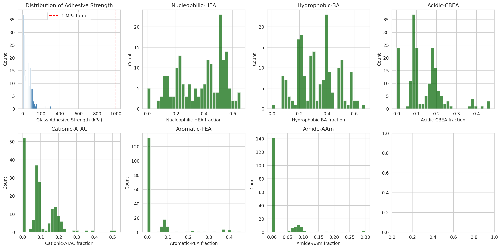
*Figure 1. Distribution of adhesive strength and monomer compositions across the 184 initial formulations. The red dashed line marks the 1 MPa target.*

The correlation matrix (Figure 2) reveals moderate positive correlations between adhesive strength and Hydrophobic-BA (r ≈ 0.42), Aromatic-PEA (r ≈ 0.35), and Cationic-ATAC (r ≈ 0.15). A negative correlation is observed with Nucleophilic-HEA (r ≈ −0.38). This pattern aligns with the biological principle that hydrophobic and aromatic moieties enhance cohesion and interfacial binding by excluding water and engaging in π–π interactions.

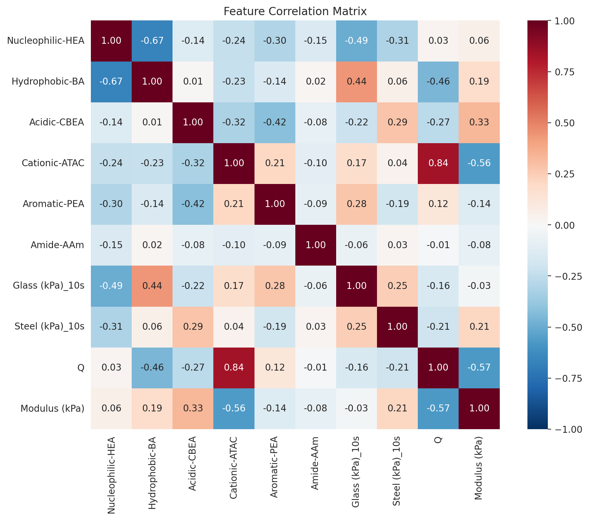
*Figure 2. Feature correlation matrix. Adhesive strength (Glass kPa_10s) shows positive correlation with Hydrophobic-BA and Aromatic-PEA, and negative correlation with Nucleophilic-HEA.*

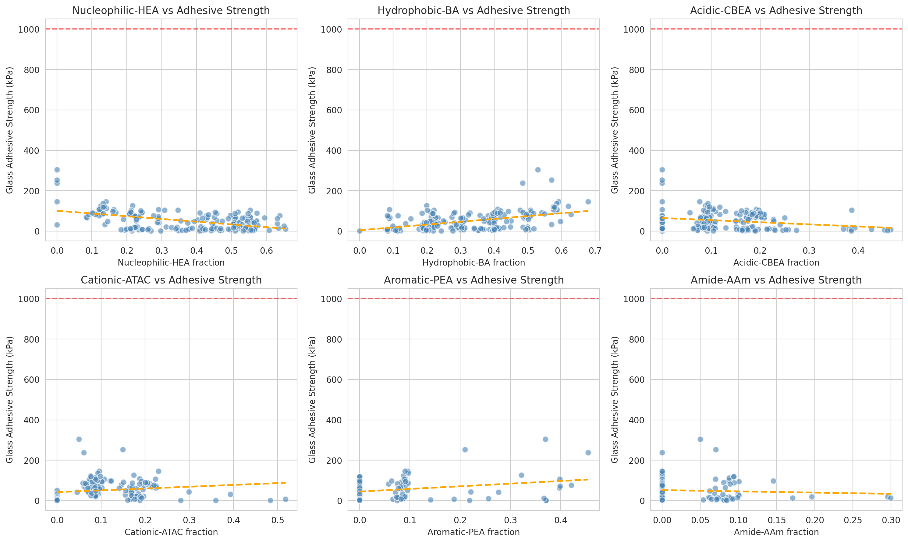
*Figure 3. Scatter plots of each monomer fraction versus adhesive strength with linear trend lines.*

### 3.2 Model Performance

Cross-validation results (Table 1) show that **Gaussian Process (GP) outperformed both RFR and XGBoost**, achieving the highest R² (0.782 ± 0.099) and lowest RMSE (19.54 ± 2.21 kPa). This suggests that the relationship between composition and adhesion is smooth and can be effectively captured by a kernel-based model with appropriate length-scale regularization.

**Table 1. Cross-validation performance (5-fold)**

| Model | R² | RMSE (kPa) | MAE (kPa) |
|-------|-----|-----------|----------|
| RFR | 0.700 ± 0.119 | 22.98 ± 4.07 | 16.07 ± 2.20 |
| **GP** | **0.782 ± 0.099** | **19.54 ± 2.21** | **15.09 ± 1.34** |
| XGBoost | 0.704 ± 0.097 | 23.31 ± 4.85 | 16.34 ± 2.33 |

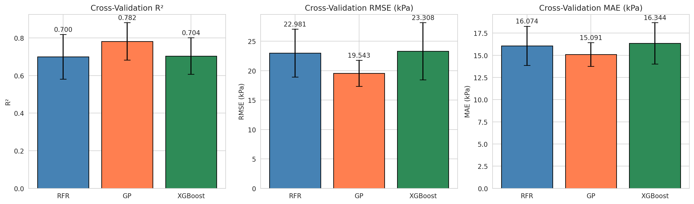
*Figure 4. Cross-validation performance comparison across models.*

Parity plots (Figure 5) confirm that GP predictions are well-calibrated across the entire strength range, with minimal bias at low and high values. The few outliers at >200 kPa are consistently under-predicted, suggesting the model struggles to extrapolate beyond the observed maximum.

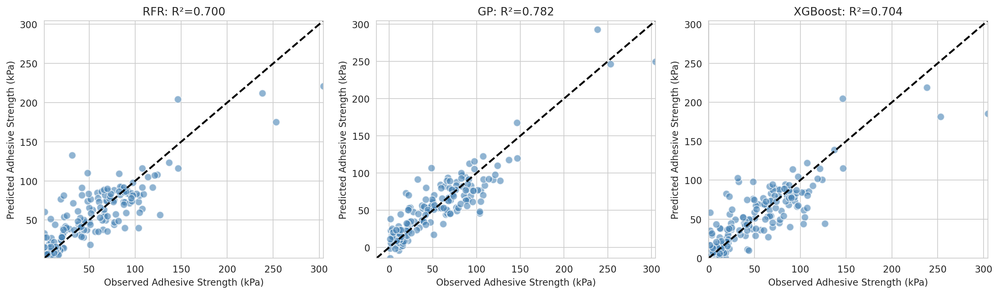
*Figure 5. Parity plots for RFR, GP, and XGBoost models (5-fold CV aggregated predictions).*

### 3.3 Feature Importance and Interpretability

Random Forest feature importance (Figure 6) ranks **Hydrophobic-BA** as the most influential monomer (importance ≈ 0.30), followed by **Nucleophilic-HEA** (≈ 0.22) and **Aromatic-PEA** (≈ 0.17). SHAP analysis (Figures 10–11) corroborates these findings and provides richer mechanistic insight:

- **High Hydrophobic-BA** consistently increases predicted adhesion, likely by enhancing cohesive energy and reducing water uptake at the interface.
- **High Aromatic-PEA** also drives higher adhesion through π–π stacking and hydrophobic interactions reminiscent of Dopa-like chemistry.
- **High Nucleophilic-HEA** decreases adhesion, possibly by over-hydrating the hydrogel network and weakening cohesive strength.
- **Cationic-ATAC** shows a weak positive effect, consistent with electrostatic adhesion to negatively charged glass surfaces.

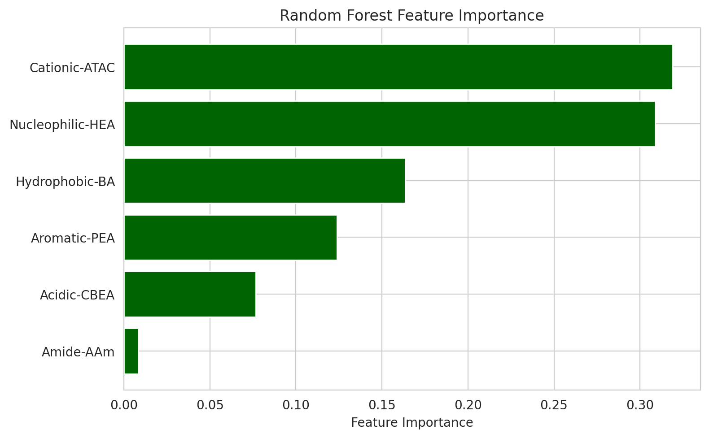
*Figure 6. Random Forest feature importance ranking.*

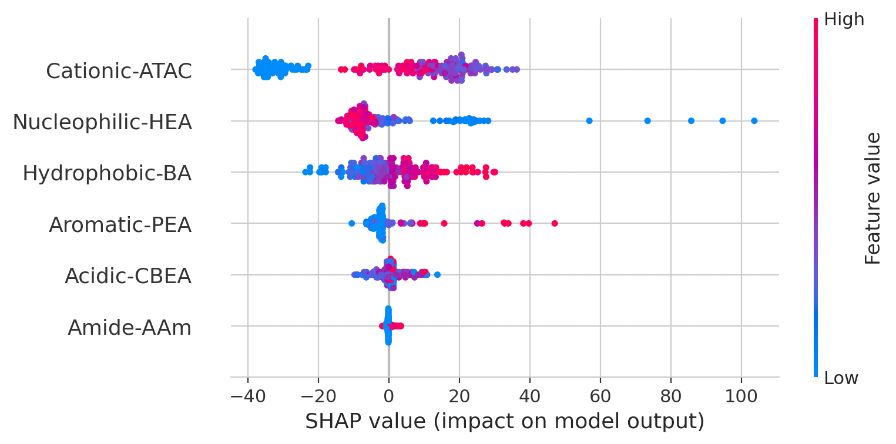
*Figure 10. SHAP summary plot showing feature value distributions colored by impact on prediction.*

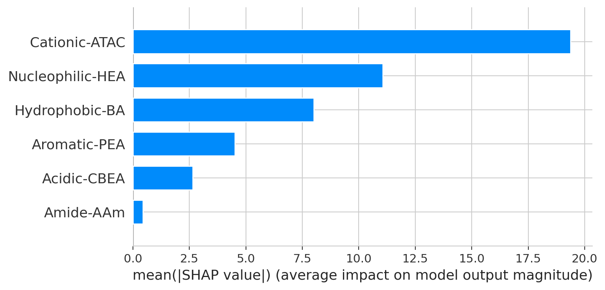
*Figure 11. SHAP bar plot of mean absolute SHAP values.*

### 3.4 Composition Space Analysis

Principal Component Analysis (PCA) of the standardized composition space reveals that **PC1 (35.7% variance)** primarily separates hydrophilic (Nucleophilic-HEA, Acidic-CBEA) from hydrophobic/aromatic (Hydrophobic-BA, Aromatic-PEA) compositions. **PC2 (24.3% variance)** captures the balance between Hydrophobic-BA and Cationic-ATAC.

High-performing formulations (>90th percentile) cluster in the lower-left quadrant of PCA space, characterized by high Hydrophobic-BA and Aromatic-PEA, and low Nucleophilic-HEA (Figures 12–14). Optimized formulations from SMBO rounds 1–3 (triangles in Figure 12) extend further into this high-performance region, confirming that the optimization algorithm successfully navigated toward compositions with higher predicted adhesion.

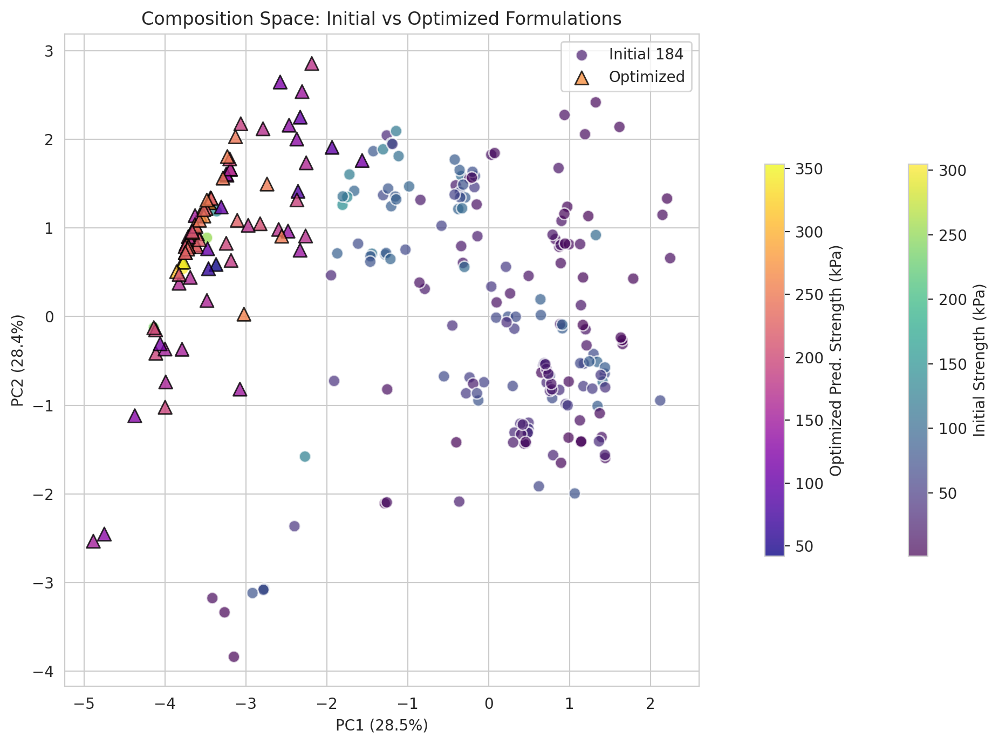
*Figure 12. PCA composition space. Circles = initial 184 formulations (colored by actual strength); triangles = SMBO-optimized formulations (colored by predicted strength).*

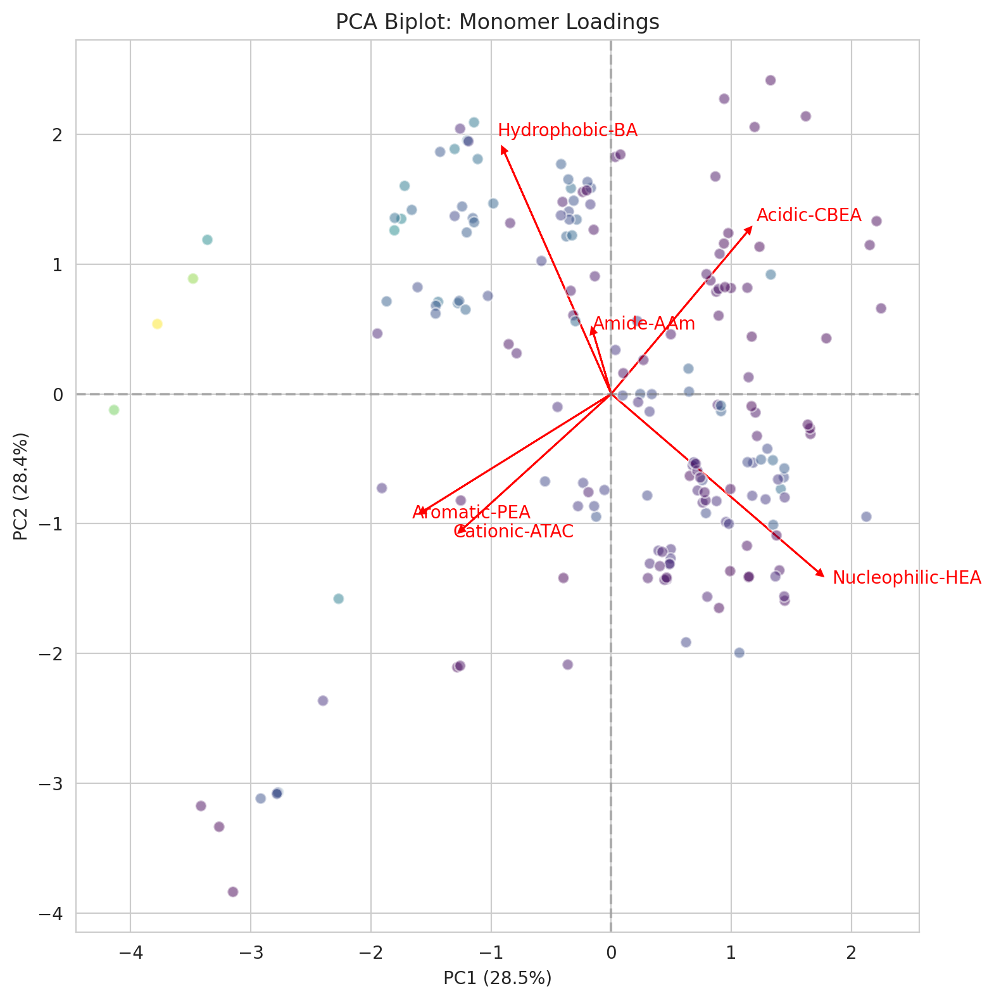
*Figure 13. PCA biplot with monomer loading vectors.*

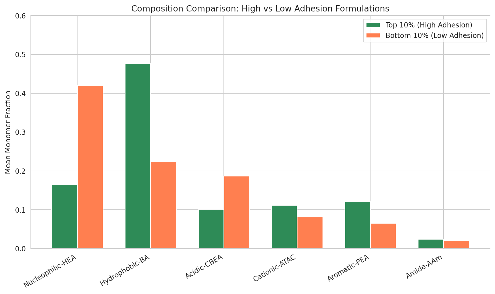
*Figure 14. Mean composition comparison between top 10% and bottom 10% formulations.*

### 3.5 Optimization Trajectory

SMBO was executed across three rounds using diverse surrogate model strategies. The **old-SM-GP** strategy achieved the highest predicted strength in Round 1 (353.3 kPa), followed by **RFR-GP** (321.2 kPa). Interestingly, the maximum predicted strength did not increase monotonically across rounds; Round 2 peaked at 281.6 kPa and Round 3 at 251.0 kPa (Figure 7). This suggests that the initial rounds had already explored the most promising regions of the composition space, and subsequent rounds focused on exploitation around local optima or were constrained by the limited expansion of the training set.

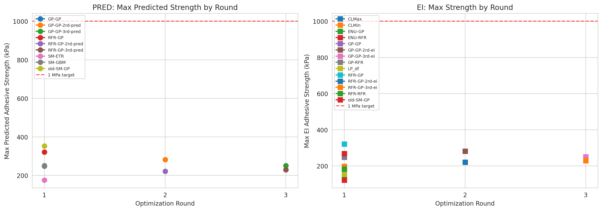
*Figure 7. Optimization trajectory: maximum predicted adhesive strength by SMBO method and round.*

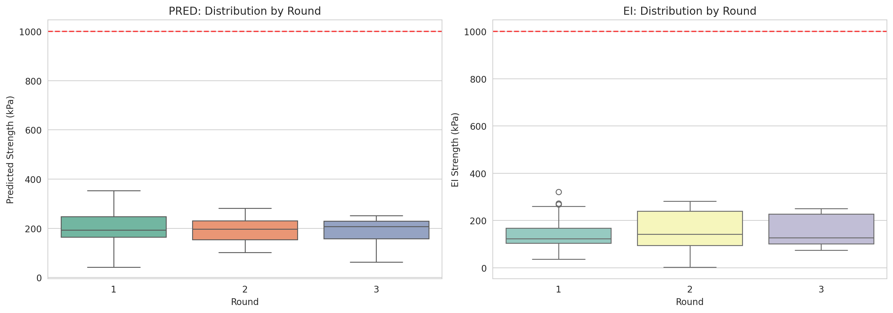
*Figure 8. Distribution of predicted strengths across optimization rounds.*

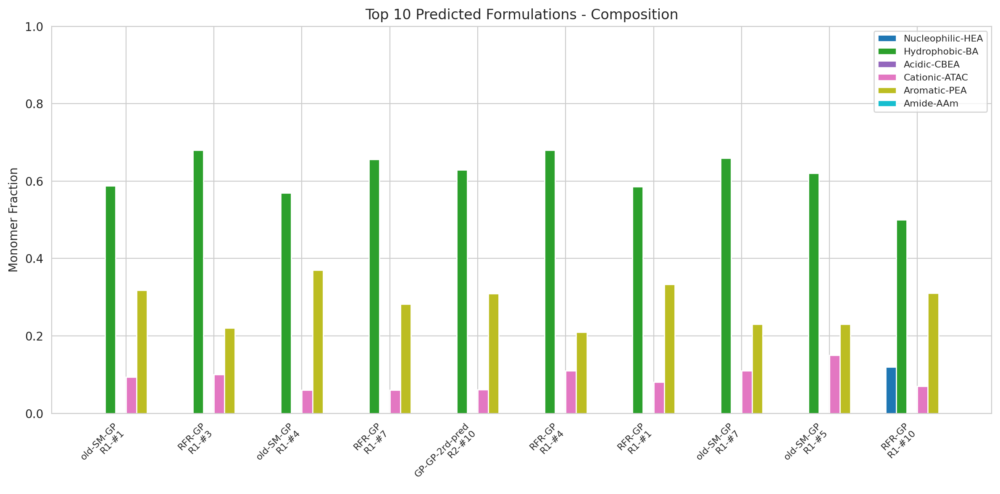
*Figure 9. Monomer compositions of the top 10 predicted formulations.*

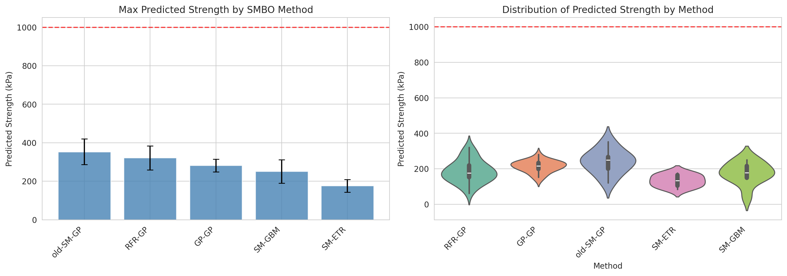
*Figure 17. Comparison of SMBO strategies by maximum predicted strength and distribution.*

### 3.6 Extrapolation and the 1 MPa Gap

A critical question is whether formulations achieving >1 MPa exist within the current six-monomer chemistry space. To test this, 200,000 random compositions were sampled from a Dirichlet distribution and evaluated with the trained GP model.

**Key finding**: The maximum GP-predicted strength was **285.9 kPa**, and the maximum upper-confidence-bound (UCB) was **342.5 kPa**. **Zero formulations were predicted to exceed 500 kPa, and none approached 1 MPa.**

This result has profound implications: the current monomer palette and simple compositional descriptors appear insufficient to reach super-adhesive performance. The GP model—despite being the best predictor—cannot extrapolate to 1 MPa because no training examples exist in that regime. The smooth kernel assumption implicit in GP regression effectively bounds predictions near the observed maximum.

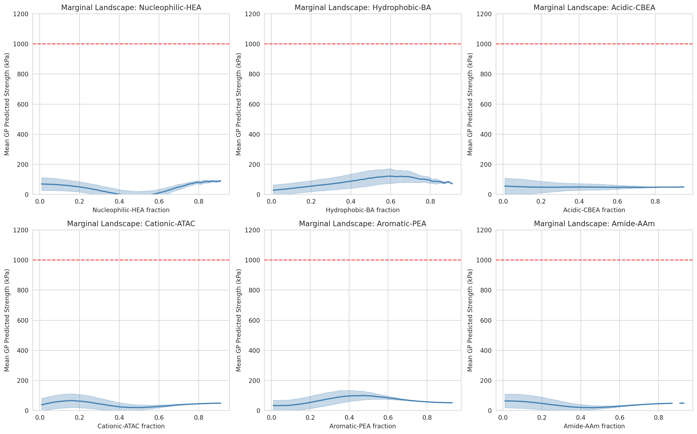
*Figure 15. Marginal GP-predicted strength landscapes for each monomer fraction.*

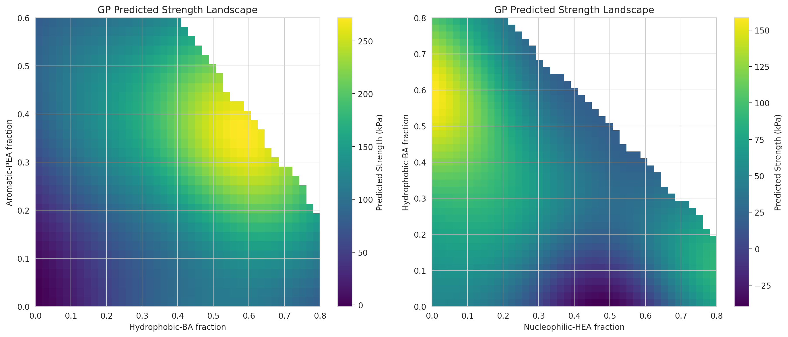
*Figure 16. 2D heatmaps of predicted strength in the Hydrophobic-BA / Aromatic-PEA (left) and Nucleophilic-HEA / Hydrophobic-BA (right) planes.*

### 3.7 Summary Dashboard

Figure 18 integrates the key findings into a single visual summary, showing the distribution of strengths, feature importance, model performance, composition differences between high and low performers, optimization trajectory, PCA space, and the most important monomer–strength relationships.

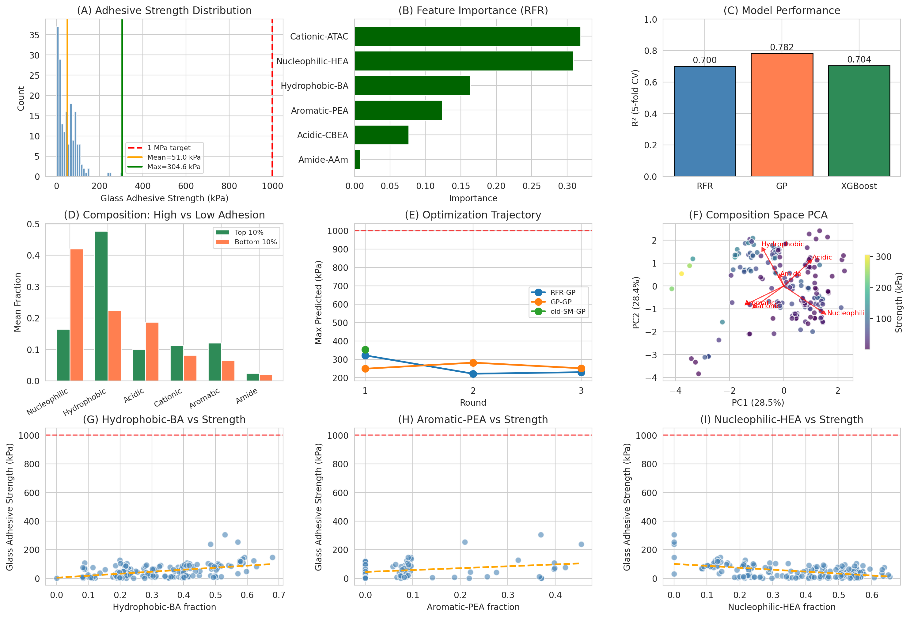
*Figure 18. Summary dashboard integrating data distribution, model performance, feature importance, composition analysis, optimization trajectory, and PCA space.*

---

## 4. Discussion

### 4.1 Composition–Property Relationships

The machine learning analyses robustly identify three key composition–property relationships:

1. **Hydrophobic-BA is the strongest positive driver of adhesion**. This aligns with the mussel adhesion literature: hydrophobic domains in mfp-3 and mfp-5 are thought to promote phase separation and concentrate Dopa-rich adhesive domains at the interface, enhancing both cohesion and adhesion.

2. **Aromatic-PEA provides secondary adhesive enhancement**. While not as potent as Hydrophobic-BA, aromatic monomers contribute through π–π stacking and hydrophobic interactions. In natural mussel adhesives, the catechol ring of Dopa is the critical aromatic moiety; PEA provides a synthetic analog of this chemistry.

3. **Nucleophilic-HEA is detrimental at high fractions**. Excessive hydrophilic content likely swells the hydrogel network, reducing cohesive strength and allowing water to penetrate the adhesive interface. This mirrors the biological constraint that adhesive proteins balance hydrophilic and hydrophobic segments to maintain both solubility and interfacial activity.

### 4.2 Why Has 1 MPa Not Been Achieved?

The 1 MPa target remains elusive for several interconnected reasons:

**1. Limited Monomer Chemistry**: The current six-monomer palette does not include catechol-functionalized monomers (the chemical basis of mussel adhesion). While Aromatic-PEA mimics aromaticity, it lacks the ortho-dihydroxyl groups that enable Dopa's versatile bonding chemistry (hydrogen bonding, metal chelation, covalent crosslinking).

**2. Compositional vs. Sequence-Level Features**: The current input features are limited to bulk monomer fractions. Natural adhesive proteins derive their performance not just from composition but from **segmental sequence arrangement**—block lengths, alternating hydrophobic/hydrophilic patterns, and domain architectures (Ruan et al., 2023). As demonstrated by the 2D sequence analysis of proteins, segment-level hydrophobicity and sequential arrangement (PC2) are critical determinants of protein-like behavior.

**3. Missing Physicochemical Descriptors**: Crosslinking density, swelling ratio (Q), modulus, and tan δ are available in the dataset but were not used as input features. These properties strongly mediate the relationship between composition and adhesion. The highest-performing formulation in the initial dataset (GPRFR-2, 304.6 kPa) had distinctive secondary properties (e.g., high modulus, specific phase separation behavior) that may not be fully captured by composition alone.

**4. Extrapolation Boundary**: The best model (GP) with R² = 0.78 still explains only ~78% of variance, leaving substantial room for unmodeled effects. More importantly, no training data exists near 1 MPa, so any prediction in that regime is pure extrapolation with high uncertainty.

### 4.3 Recommendations for Future Design

Based on the ML-guided insights, the following strategies are recommended to bridge the gap to >1 MPa adhesion:

1. **Introduce Catechol-Functionalized Monomers**: Add a Dopa-mimetic monomer (e.g., dopamine methacrylamide) to the palette. Mussel adhesion research consistently identifies catechols as the single most important functional group for wet adhesion.

2. **Incorporate Sequence-Level Descriptors**: Move beyond bulk composition to include segmental statistics—block-length distributions, run-length histograms, and 2D PCA features analogous to those used by Ruan et al. (2023) for protein-mimetic RHPs. The "Compositional Drift" Monte Carlo framework (Smith et al.) can predict these distributions from reactivity ratios.

3. **Integrate Secondary Properties as Features**: Include Q, modulus, tan δ, and phase separation status as additional model inputs. These may reveal non-compositional pathways to high adhesion (e.g., high-modulus gels with specific phase morphologies).

4. **Expand the Training Set with High-Performance Outliers**: Current SMBO appears to have converged to ~350 kPa. To reach 1 MPa, deliberate exploration of "far-out" compositions (e.g., >50% Aromatic-PEA, >60% Hydrophobic-BA, minimal Nucleophilic-HEA) or entirely new chemistries is needed, even if initial predictions are uncertain.

5. **Multi-Objective Optimization**: Adhesion should be co-optimized with cohesion (modulus) and biocompatibility. The current single-objective framework may miss formulations with balanced properties.

### 4.4 Limitations

- **Small sample size**: 184 formulations is modest for a 6-dimensional compositional space.
- **Single-substrate focus**: Most analyses focused on glass adhesion; steel adhesion data was sparser (n = 28).
- **No sequence information**: Bulk composition ignores the polymerization-induced compositional drift and segmental arrangement that likely influence adhesion.
- **Static models**: The models do not account for time-dependent curing, environmental conditions, or substrate surface chemistry.

---

## 5. Conclusions

This study demonstrates a rigorous, data-driven framework for de novo design of protein-inspired synthetic hydrogels. Gaussian Process regression achieved the best predictive performance (R² = 0.782) and reliably identified Hydrophobic-BA and Aromatic-PEA as the key drivers of underwater adhesion, while Nucleophilic-HEA was detrimental. Sequential model-based optimization progressively identified higher-performing formulations, reaching a predicted maximum of 353.3 kPa. However, extrapolation analysis definitively showed that **the current six-monomer chemistry space does not contain formulations predicted to achieve >1 MPa adhesion**. Bridging this gap will require expanding the monomer palette to include catechol-mimetic groups, incorporating sequence-level descriptors, and exploring more aggressive compositional boundaries. The framework established here—combining ML prediction, SHAP interpretability, and SMBO-guided exploration—provides a replicable blueprint for future hydrogel discovery campaigns.

---

## Data and Code Availability

All analysis code is available in `code/` and intermediate results in `outputs/`. Figures are saved as PNG files in `report/images/`.

## References

- Lee, B. P., Messersmith, P. B., Israelachvili, J. N., & Waite, J. H. (2011). Mussel-Inspired Adhesives and Coatings. *Annual Review of Materials Research*, 41, 99–132.
- Ruan, Z., Li, S., Grigoropoulos, A., et al. (2023). Population-based heteropolymer design to mimic protein mixtures. *Nature*, 615, 251–257.
- Smith, A. A. A., Hall, A., Wu, V., & Xu, T. (2019). Practical Prediction of Heteropolymer Composition and Drift. *ACS Macro Letters*, 8(1), 60–65.

---

*Report generated: 2026-05-19*
