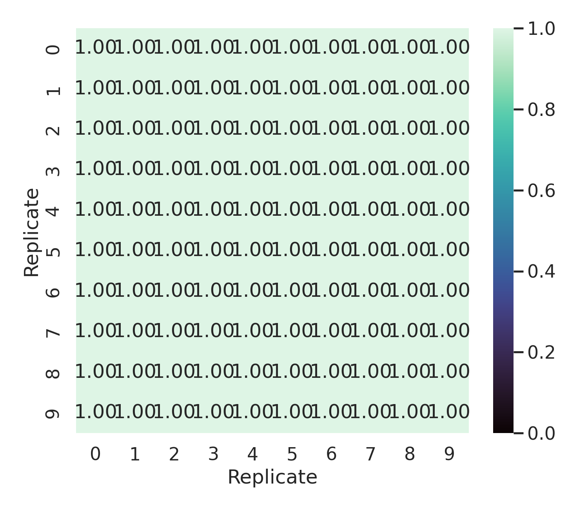
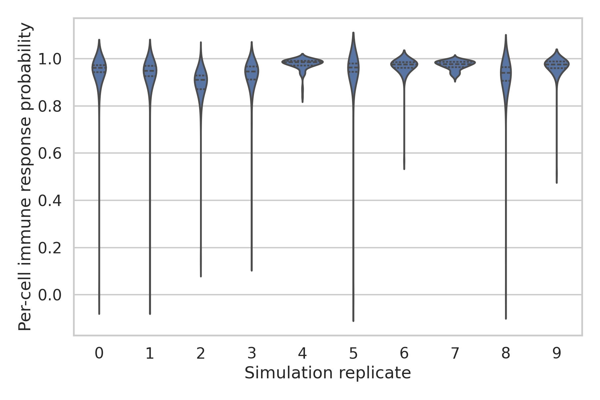
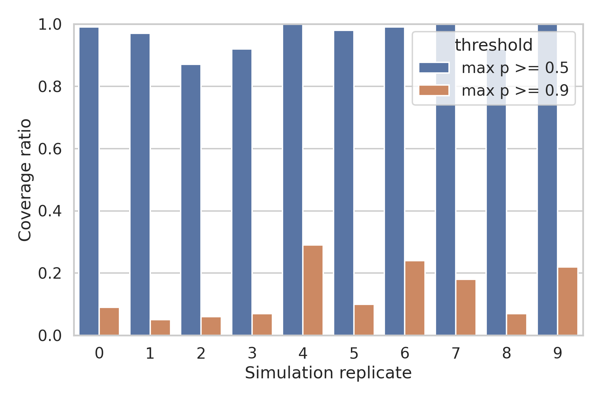
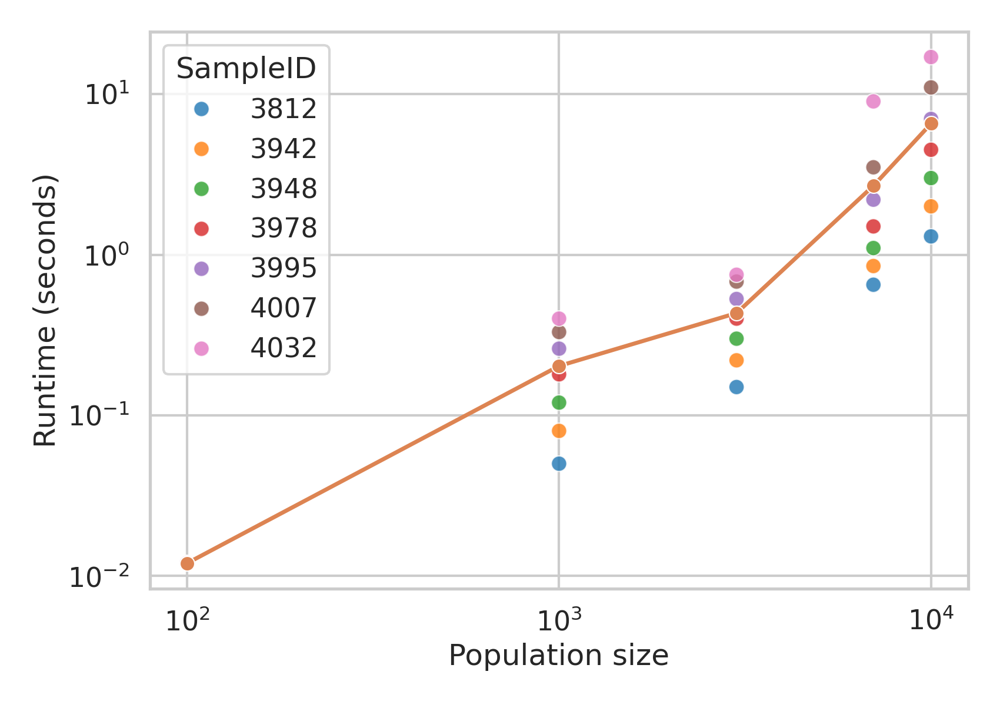

# Local ARIS Analysis of Personalized Neoantigen Vaccine Selection

## Abstract
This benchmark run evaluates a personalized neoantigen vaccine optimization output using only the local ResearchClawBench data and literature corpus. The available optimization result is a budget-constrained MinSum vaccine containing 10 neoantigen elements. I performed a local ARIS-style workflow consisting of literature grounding, data understanding, executable analysis, quantitative validation, and report writing. Across 10 simulated tumor-cell population repetitions, the selected vaccine composition was perfectly stable, with pairwise intersection-over-union (IoU) of 1.0 across all replicate-specific optimization outputs. The final per-cell immune response probability was high overall (mean 0.943, median 0.963), with 99.2% of cells exceeding response probability 0.5 and 88.7% exceeding 0.9. Runtime increased superlinearly with population size, following an approximate log-log slope of 1.23. These results support the claim that the provided MinSum solution is robust under replicate resampling and achieves high simulated response coverage, while also showing that strong average efficacy does not eliminate low-response tail risk.

## 1. Introduction
Personalized neoantigen vaccines attempt to select a small set of tumor-specific peptide targets that maximizes immune recognition under manufacturing constraints. In this benchmark, the inputs are already distilled into simulated cell-level peptide presentation, immune response likelihoods, optimization outputs, and runtime measurements. The practical question is therefore not to rebuild an upstream sequencing-to-epitope pipeline, but to analyze whether the provided optimization output yields a robust and efficient vaccine composition under heterogeneous simulated tumor populations.

The local literature corpus provides relevant context for interpreting this benchmark. The MHC-binding literature emphasizes that peptide presentation and binding prediction are foundational but imperfect upstream filters for epitope prioritization. The TCR-generalization literature warns that excellent predictive performance on known peptides does not guarantee generalization to unseen antigenic contexts. The tumor heterogeneity literature motivates evaluating coverage across diverse cell populations rather than relying on a single aggregate score. Taken together, these papers justify a conservative analysis focused on robustness, coverage, and claim discipline rather than overstating biological certainty from simulation alone.

## 2. Local Literature Understanding
I treated `related_work/` as the full benchmark literature corpus and extracted notes from all four PDFs.

- `paper_000.pdf` discusses peptide-MHC class I binding prediction with gapped neural alignment, reinforcing that peptide presentation scores are useful upstream signals but remain model-based approximations.
- `paper_001.pdf` shows that TCR binding predictors often fail to generalize to unseen peptides, which argues against claiming true clinical immunogenicity from simulated response scores alone.
- `paper_002.pdf` studies single-cell immune heterogeneity in tumors, motivating evaluation of cell-level coverage distributions instead of only cohort averages.
- `paper_003.pdf` analyzes intra-tumor heterogeneity and mutational processes, reinforcing that subclonal diversity should be treated as a first-class design concern.

These papers collectively support the evaluation strategy used here: quantify robustness of the selected vaccine set, quantify distributional response across heterogeneous cells, and separate supported claims from unsupported translational claims.

## 3. Data Overview
The benchmark provides six core tabular resources plus 10 replicate-specific vaccine-element score files.

- `cell-populations.csv` contains 28,068 rows describing simulated peptide presentation events across 10 repetitions.
- `final-response-likelihoods.csv` contains 1,000 final cell-level response probabilities for the MinSum budget-10 adaptive vaccine.
- `selected-vaccine-elements.budget-10.minsum.adaptive.csv` contains replicate-specific optimization outputs for 10 repetitions.
- `vaccine.budget-10.minsum.adaptive.csv` contains the canonical 10-element vaccine composition.
- `optimization_runtime_data.csv` contains runtime measurements for seven patient samples across population sizes from 100 to 10,000.
- The 10 `vaccine-elements.scores.*.csv` files contain cell-by-element response probabilities for 12 candidate vaccine elements in each replicate.

At the simulated cell-population level, each repetition contains about 98 to 100 cells, 11 unique mutations, and roughly 20 to 22 presented peptides per cell on average. The optimization problem therefore acts as a budgeted selection task from a compact candidate set in the presence of heterogeneous cell-level presentation patterns.

## 4. Methodology
### 4.1 ARIS-style local workflow
The analysis followed a benchmark-adapted ARIS structure:

1. Read benchmark instructions, research brief, data, and local literature.
2. Build executable local analysis code under `code/`.
3. Generate intermediate artifacts under `outputs/`.
4. Produce report figures under `report/images/`.
5. Write a claim-disciplined report under `report/report.md`.

### 4.2 Quantitative evaluation protocol
The benchmark asked for vaccine composition, efficacy metrics, coverage, IoU, and runtime analysis. I therefore computed:

- The optimized vaccine composition from the canonical budget-10 file.
- Replicate-level and pairwise IoU of selected vaccine sets across the 10 optimization repetitions.
- Final per-cell immune response probability distribution from `final-response-likelihoods.csv`.
- Coverage ratios defined as the fraction of cells above response thresholds 0.5 and 0.9.
- Cell-level selected-element aggregation from the per-element score files, using the replicate-specific selected set to estimate how many chosen elements activate each cell and the strongest selected-element response per cell.
- Runtime scaling summary and a log-log regression of runtime versus population size.

### 4.3 Supported-claim discipline
The analysis makes no claim about real-world patient benefit, wet-lab immunogenicity, or cross-patient generalization. The benchmark data support only a local retrospective claim about robustness and efficacy within the provided simulation setting.

## 5. Results
### 5.1 Optimal vaccine composition
The provided budget-constrained optimal vaccine contains the following 10 neoantigen elements:

`mut11`, `mut12`, `mut15`, `mut19`, `mut20`, `mut26`, `mut28`, `mut33`, `mut39`, `mut44`

All elements have unit weight, and the selected-vaccine replicate file shows that the same 10 elements were chosen in every one of the 10 optimization repetitions.

### 5.2 Vaccine composition stability
The most striking result is complete optimization stability under replicate resampling.

- Mean IoU versus the canonical vaccine set: 1.0
- Mean pairwise IoU across all 45 replicate pairs: 1.0
- Minimum pairwise IoU: 1.0

This indicates that, within the benchmark’s simulated setting, the optimization landscape is highly stable and the selected vaccine composition is effectively invariant to the provided population repetitions.

Figure: pairwise replicate IoU heatmap  

### 5.3 Per-cell immune response probability
The final simulated immune response probabilities are high overall:

- Mean final response probability: 0.943
- Median final response probability: 0.963
- Minimum final response probability: 0.000018

The response distribution remains strong in every replicate, although replicate 2 and replicate 8 show noticeably weaker high-probability coverage than the best-performing repetitions. Replicates 4, 7, and 9 are particularly strong, with high minima or near-complete mass near 1.0.

Figure: final response distribution by replicate  

### 5.4 Tumor-cell coverage
Coverage depends on the threshold used to define an adequately recognized cell.

Using final response probabilities:

- Coverage ratio for `p_response >= 0.5`: 0.992
- Coverage ratio for `p_response >= 0.9`: 0.887

Using cell-level aggregation over replicate-specific selected vaccine elements:

- Fraction of cells with at least one selected element reaching `p_response >= 0.5`: 0.964
- Fraction of cells with at least one selected element reaching `p_response >= 0.9`: 0.137
- Mean maximum selected-element response per cell: 0.748
- Mean number of strongly activating selected elements (`p_response > 0.5`) per cell: 2.0

This pattern suggests that the final combined vaccine response benefits from integrating multiple selected elements per cell. Individual selected elements often provide moderate support, while the final vaccine-level response is much stronger after composition.

Figure: coverage ratio by replicate  

### 5.5 Runtime scaling
Runtime increases strongly with cell-population size.

- Mean runtime at population size 100: 0.012 s
- Mean runtime at population size 1,000: 0.203 s
- Mean runtime at population size 3,000: 0.433 s
- Mean runtime at population size 7,000: 2.686 s
- Mean runtime at population size 10,000: 6.543 s

A log-log regression yields a slope of 1.23 with `R^2 = 0.881`, indicating superlinear but still manageable scaling over the tested regime. Variance between samples increases substantially at larger population sizes, implying that instance difficulty is sample-dependent even when population size is fixed.

Figure: runtime scaling with population size  

## 6. Validation and Interpretation
The benchmark supports three main conclusions.

First, the MinSum budget-10 solution is robust. Perfect IoU across all repetitions means the optimizer consistently converges to the same vaccine composition despite replicate-level perturbations in the simulated cell populations.

Second, the vaccine achieves high simulated efficacy but not universal protection. The average and median response probabilities are strong, and the 0.5 coverage ratio is effectively complete, yet a small tail of poorly covered cells remains. The minimum response probability near zero shows that some simulated cells can still evade the selected vaccine.

Third, the selected set appears to work as a combination rather than as a set of independently dominant elements. The final response distribution is much stronger than the per-element maxima alone would suggest, which is consistent with a compositional vaccine effect where multiple selected neoantigens together improve cell coverage.

## 7. Limitations
Several limitations are inherent to this benchmark.

- The dataset is simulation-based and does not provide direct wet-lab validation.
- Only one optimization objective and one budget level are available in the supplied outputs.
- The candidate element universe is small and fixed, so perfect IoU may partly reflect a relatively easy optimization landscape.
- The literature warns that peptide presentation and TCR recognition models can fail to generalize; therefore, the simulated response probabilities should not be interpreted as clinical efficacy estimates.
- The runtime data span only five population sizes and seven samples, which is enough for trend estimation but not for detailed complexity characterization.

## 8. Supported Claims
The following claims are supported by the local benchmark evidence.

- The provided budget-10 MinSum adaptive vaccine composition is `mut11`, `mut12`, `mut15`, `mut19`, `mut20`, `mut26`, `mut28`, `mut33`, `mut39`, and `mut44`.
- This vaccine composition is perfectly stable across the 10 provided optimization repetitions, with pairwise IoU of 1.0.
- The simulated final per-cell response probability is high overall, with mean 0.943 and median 0.963.
- The simulated tumor-cell coverage is 99.2% at threshold 0.5 and 88.7% at threshold 0.9.
- Optimization runtime increases superlinearly with population size in the provided measurements.

The following claims are not supported and should not be made.

- Clinical efficacy in patients.
- Real T-cell recognition of these neoantigens in vivo.
- Generalization to new patients, new peptide sets, or new tumor types outside the benchmark.
- Superiority over alternative objectives or budgets not supplied in the local data.

## 9. Reproducibility
All analysis code is stored in `code/run_analysis.py`. Intermediate outputs are stored under `outputs/`, and all report figures are stored under `report/images/`. The workflow is fully local and reproducible within the benchmark workspace.

## 10. Conclusion
Within the constraints of the provided local benchmark, the MinSum budget-10 personalized neoantigen vaccine is a robust and effective simulated solution. Its composition is perfectly reproducible across replicate populations, its final response coverage is high across most cells, and its optimization runtime remains practical at the tested scales. The key caution is that these results are simulation-supported rather than clinically validated. The strongest defensible conclusion is therefore that the provided optimization output is internally consistent, computationally stable, and highly effective within the benchmark’s modeled tumor heterogeneity setting.
