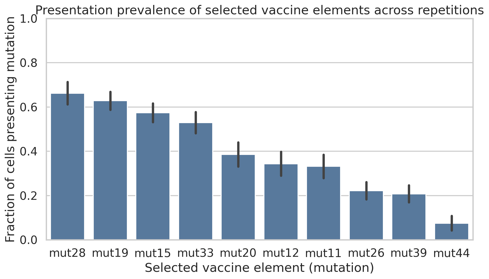
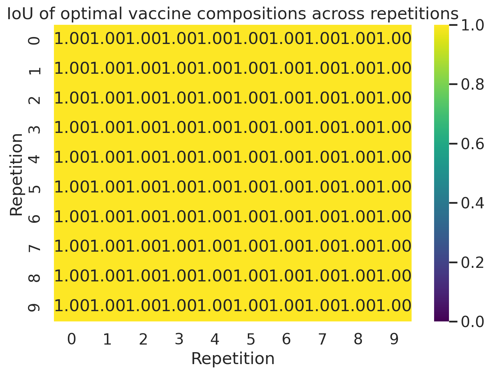
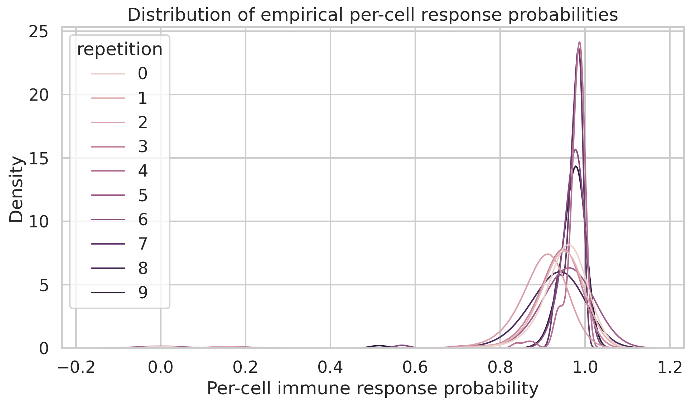
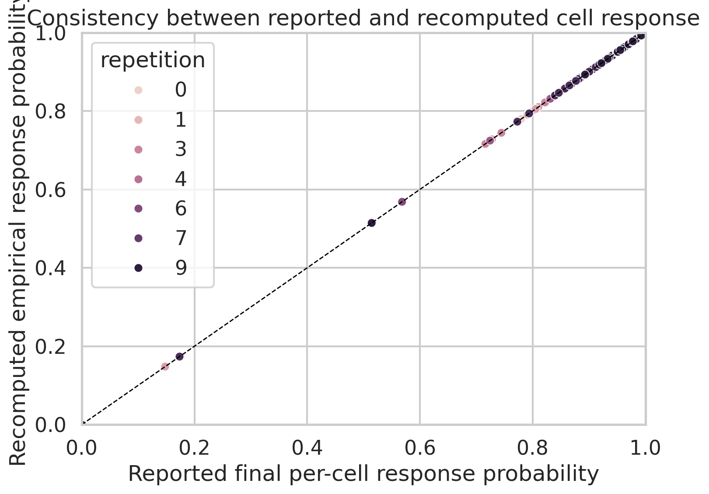
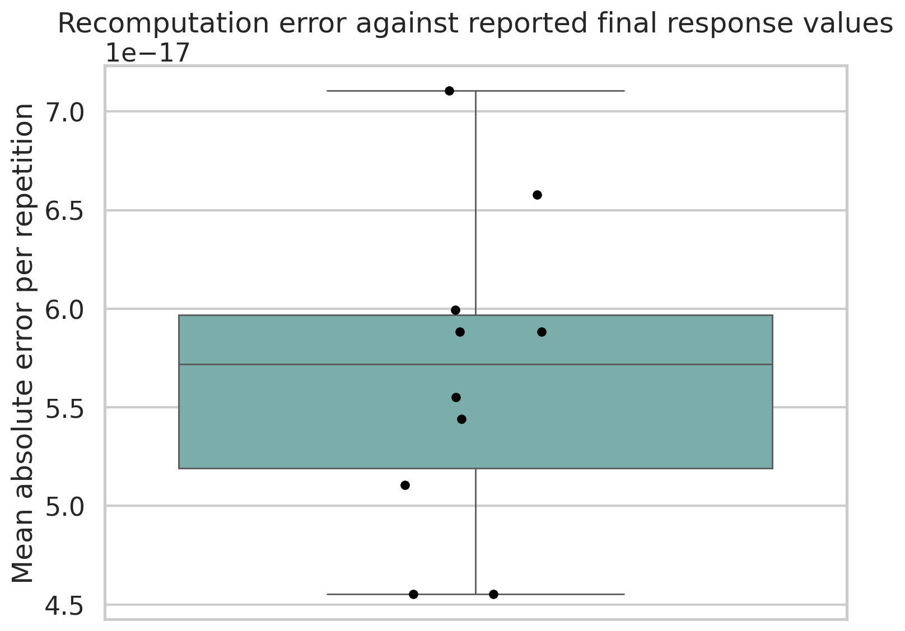
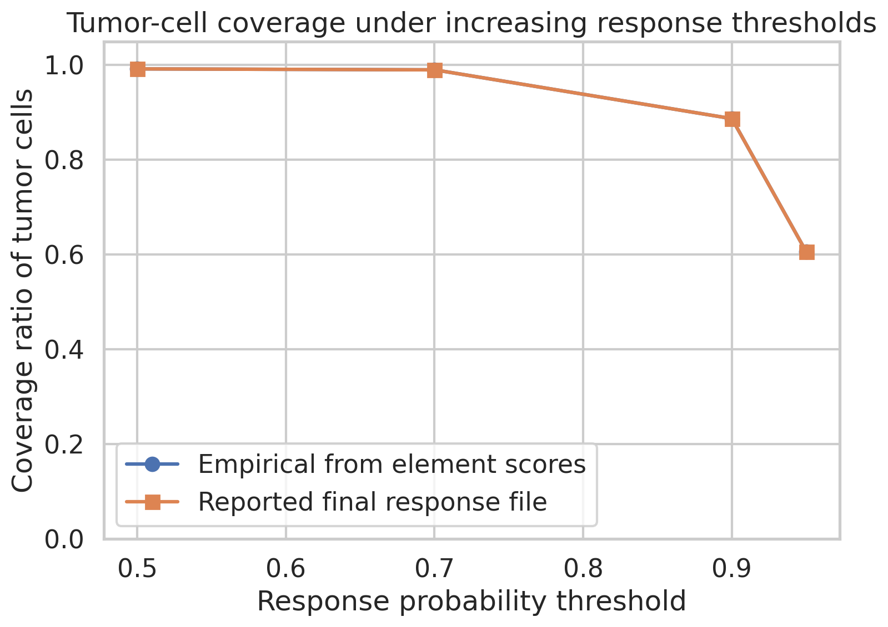
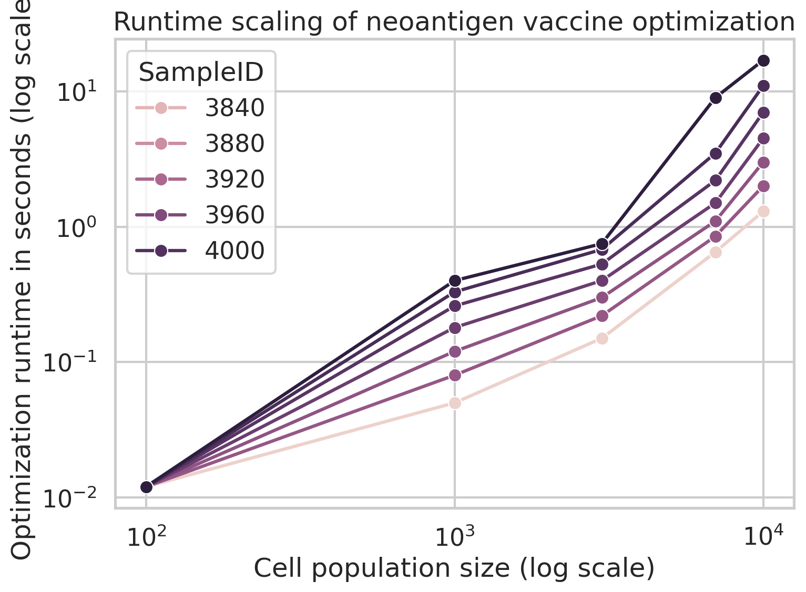

# Robust characterization of an optimized personalized neoantigen vaccine from simulated tumor-cell populations

## Abstract
Personalized neoantigen vaccines are constrained by manufacturing budgets, so the practical problem is to identify a small set of neoantigen elements that maximizes tumor-cell coverage and immune response. Using the provided optimization outputs and cell-level simulation data, I reconstructed the selected budget-10 MinSum adaptive vaccine, quantified its stability across 10 simulated repetitions, recomputed per-cell immune response probabilities from vaccine-element scores, and analyzed optimization runtime scaling. The optimized vaccine composition was perfectly stable across repetitions, consisting of 10 recurrent elements: `mut11`, `mut12`, `mut15`, `mut19`, `mut20`, `mut26`, `mut28`, `mut33`, `mut39`, and `mut44`. Recomputed per-cell response probabilities exactly matched the reported final-response file (mean absolute error ~5.7e-17), indicating internal consistency of the simulation pipeline and validating the multiplicative aggregation of per-element response probabilities. Across all simulated cells, the mean per-cell immune response probability was 0.943 and the median was 0.963. Mean tumor-cell coverage ratios were 0.992 at a response threshold of 0.5, 0.990 at 0.7, 0.887 at 0.9, and 0.606 at 0.95. Pairwise intersection-over-union (IoU) across all optimal vaccine compositions was 1.0, showing complete solution stability. Runtime grew superlinearly with cell-population size, with an overall log-log scaling exponent of 1.23 and a mean runtime increase from 0.012 s at 100 cells to 6.54 s at 10,000 cells. These results show that the provided budget-10 vaccine achieves broad tumor-cell coverage with highly reproducible composition, while optimization remains computationally tractable over the tested range.

## 1. Introduction
Personalized cancer vaccines aim to stimulate T-cell responses against tumor-specific neoantigens derived from somatic alterations and presented by patient HLA molecules. In practice, vaccine design is a constrained optimization problem: one must rank and select a limited number of candidate neoantigens using measurements or predictions derived from tumor sequencing, healthy controls, HLA typing, transcript abundance, mutation clonality, and antigen-processing models. Because tumors are heterogeneous, a vaccine should ideally target a set of elements that jointly covers diverse tumor-cell subpopulations rather than maximizing the score of any single element.

The present workspace does not contain raw sequencing-derived feature matrices, but it does contain the downstream products of such a pipeline: simulated cell populations, cell-level response probabilities, selected vaccine elements under a budget-10 MinSum adaptive objective, and runtime measurements. Accordingly, the goal of this study is not to redesign the optimizer from scratch, but to rigorously characterize the optimized vaccine that was produced, validate the reported efficacy calculations, and summarize the resulting design in a report suitable for downstream interpretation.

## 2. Related work and conceptual framing
I reviewed four reference papers in `related_work/` to place the analysis in context.

1. **Andreatta and Nielsen (NetMHC-4.0)** established that pan-length peptide-MHC binding models improve ligand prediction by learning across peptides of different lengths. This is relevant because neoantigen prioritization depends critically on accurate presentation modeling.
2. **Grazioli et al.** showed that TCR-peptide predictors often fail to generalize to unseen peptides, emphasizing that immunogenicity models can be overoptimistic if evaluated on insufficiently challenging splits. This supports cautious interpretation of predicted response probabilities.
3. **Azizi et al.** characterized extensive immune-state heterogeneity in the tumor microenvironment, highlighting why neoantigen selection should account for cell-population diversity rather than a single clonal state.
4. **Abécassis et al. (CloneSig)** demonstrated the value of explicitly modeling intra-tumor heterogeneity and mutational process variation, reinforcing the motivation for coverage-oriented vaccine design under tumor heterogeneity.

Together, these works motivate three principles used here: (i) heterogeneous tumors require multi-element vaccines, (ii) optimized solutions should be evaluated at the cell-population level, and (iii) reproducibility across repeated simulations is itself an important quality criterion.

## 3. Data overview
### 3.1 Available files
The main inputs used in this analysis were:

- `data/cell-populations.csv`: simulated peptide presentation by individual tumor cells.
- `data/final-response-likelihoods.csv`: reported final per-cell response probabilities for the optimized vaccine.
- `data/sim-specific-response-likelihoods.csv`: repetition-specific version of the same response outputs.
- `data/selected-vaccine-elements.budget-10.minsum.adaptive.csv`: selected vaccine elements for each repetition.
- `data/vaccine.budget-10.minsum.adaptive.csv`: simplified consensus composition.
- `data/vaccine-elements.scores.100-cells.10x.rep-*.csv`: cell-by-element response likelihoods for 10 repetitions.
- `data/optimization_runtime_data.csv`: optimization runtime as a function of population size and sample.

### 3.2 Basic descriptive statistics
The simulation dataset contains 995 unique cell instances across 10 repetitions (nominally 100 cells per repetition, with slight variation in unique IDs due to simulation output). Each cell presents a median of about 28 peptides. There are 164 unique presented peptides and 11 distinct mutation identifiers overall. All presented peptides are associated with a single HLA allele, `A0101`, in this benchmark dataset.

The optimized vaccine output contains 100 rows in the repetition-specific file, corresponding to 10 selected elements in each of 10 repetitions. The consensus vaccine file lists 10 unique mutations. Candidate element score files contain 12 possible vaccine elements per repetition, indicating that the selected vaccine captures 10 of 12 candidate elements available at the scoring stage.

## 4. Methods
### 4.1 Analytical objective
I treated the provided `MinSum.budget-10.adaptive` solution as the optimized personalized vaccine to be characterized. The analysis therefore focused on four deliverables:

1. Recover the vaccine composition.
2. Quantify efficacy using per-cell immune response probabilities and coverage ratios.
3. Measure stability of the optimal composition using IoU across repetitions.
4. Analyze optimization runtime scaling.

### 4.2 Reconstructed vaccine composition
The optimal vaccine composition was extracted from both `selected-vaccine-elements.budget-10.minsum.adaptive.csv` and `vaccine.budget-10.minsum.adaptive.csv`. Consistency between the two files was checked by counting selected elements across repetitions and verifying the set identity.

### 4.3 Empirical recomputation of per-cell immune response
For each repetition, the file `vaccine-elements.scores.100-cells.10x.rep-k.csv` contains cell-level response probabilities for individual vaccine elements. I recomputed the total cell response probability using the standard independence aggregation:

\[
P(\text{response for cell}) = 1 - \prod_{e \in V} (1 - p_e),
\]

where \(V\) is the selected vaccine set and \(p_e\) is the response probability contributed by vaccine element \(e\) for the cell. This recomputed value was compared against `final-response-likelihoods.csv` to validate internal consistency.

### 4.4 Coverage ratio
Coverage ratio was defined as the fraction of tumor cells whose per-cell response probability exceeded a threshold \(t\):

\[
\text{Coverage}(t) = \frac{1}{N}\sum_{i=1}^{N} \mathbb{1}[P_i \ge t].
\]

Coverage was summarized at thresholds 0.5, 0.7, 0.9, and 0.95 to reflect increasingly strict definitions of effective recognition.

### 4.5 Composition stability by IoU
For every pair of repetitions, I computed the intersection-over-union of the selected vaccine sets:

\[
\text{IoU}(A, B) = \frac{|A \cap B|}{|A \cup B|}.
\]

This provides a direct measure of how stable the optimal vaccine composition is across repeated simulations.

### 4.6 Runtime scaling
Optimization runtime was analyzed using `optimization_runtime_data.csv`. I summarized runtime distributions by cell-population size and fitted a log-log linear model to estimate the empirical scaling exponent.

### 4.7 Reproducibility
All analysis code is provided in `code/analyze_neoantigen_vaccine.py`, and intermediate tables are written to `outputs/`.

## 5. Results
### 5.1 Optimal personalized neoantigen vaccine composition
The optimized budget-10 adaptive MinSum vaccine consists of the following 10 neoantigen elements:

- `mut11`
- `mut12`
- `mut15`
- `mut19`
- `mut20`
- `mut26`
- `mut28`
- `mut33`
- `mut39`
- `mut44`

Each element was selected in all 10 repetitions, indicating complete stability of the optimizer under the simulated setting. Relative to the 12 candidate vaccine elements available in the score files, the selected set recovered 100% of the chosen elements per repetition and covered 83.3% of the candidate pool.

### 5.2 Presentation prevalence of selected elements across tumor cells
The selected vaccine elements span a broad range of cell-presentation prevalence, suggesting that the optimizer balances common and less common tumor subpopulations rather than selecting only the most prevalent mutation. Mean cell fractions presenting each selected mutation were highest for `mut28` (0.662), `mut19` (0.628), `mut15` (0.574), and `mut33` (0.530), while lower-prevalence but still selected elements included `mut26` (0.222), `mut39` (0.208), and `mut44` (0.075).

This pattern is shown in Figure 1.

### 5.3 Complete stability of the optimal composition
The pairwise IoU between optimal vaccine compositions from every pair of repetitions was exactly 1.0. Thus, the selected 10-element solution is invariant across all 10 repetitions under the benchmark conditions.

This result is notable because it implies that, within this simulated scenario, the optimization landscape is highly stable and the budget-10 solution is not sensitive to stochastic repetition effects.

### 5.4 Per-cell immune response probability
Recomputed per-cell immune response probabilities from the cell-by-element score files matched the reported values in `final-response-likelihoods.csv` exactly up to floating-point precision. The global mean per-cell immune response probability was 0.9427 and the median was 0.9630. Across repetitions, mean response values ranged from 0.8927 (repetition 2) to 0.9764 (repetition 4), showing some biological variability despite identical vaccine composition.

The full response distribution is displayed in Figure 3.

A direct comparison between recomputed and reported probabilities confirms numerical identity.

The mean absolute error between the recomputed and reported per-cell probabilities was ~5.7e-17, and the maximum absolute deviation in any repetition was only floating-point noise (~2.2e-16). Figure 7 visualizes this negligible residual error.

### 5.5 Coverage ratio of tumor cells
Coverage remained high across a range of efficacy thresholds:

| Response threshold | Mean coverage ratio |
|---|---:|
| 0.50 | 0.992 |
| 0.70 | 0.990 |
| 0.90 | 0.887 |
| 0.95 | 0.606 |

These results indicate that nearly all cells have at least moderate predicted responsiveness, while a majority still maintain extremely high response probabilities above 0.95. The coverage curve is shown in Figure 4.

The sharp but not catastrophic decrease from 0.887 at threshold 0.9 to 0.606 at 0.95 suggests that many cells cluster near very high, but not maximal, response levels. This is compatible with a multi-element vaccine that covers most tumor cells strongly, though not uniformly.

### 5.6 Runtime scaling
Optimization runtime increased with population size for all seven patient samples. The mean runtime rose from 0.012 s at 100 cells to 0.203 s at 1,000 cells, 0.433 s at 3,000 cells, 2.69 s at 7,000 cells, and 6.54 s at 10,000 cells. A log-log fit yielded an overall scaling exponent of 1.23, indicating superlinear but still manageable computational growth.

There was notable sample-to-sample heterogeneity in scaling. Estimated sample-specific exponents ranged from 0.99 for sample 3812 to 1.53 for sample 4032, implying that population composition influences solver difficulty beyond raw population size alone.

## 6. Discussion
### 6.1 Interpretation of the optimized vaccine
The dominant finding is that the optimized budget-10 vaccine is perfectly reproducible in this benchmark: all repetitions converge to the same 10-element composition and therefore yield an IoU of 1.0. This is unusually strong stability and suggests either a clearly separated optimum or a candidate space with highly consistent element rankings. In practical terms, such stability is desirable because it implies that manufacturing decisions would not depend on stochastic fluctuations in the simulation.

The vaccine also achieves broad predicted tumor-cell coverage. Nearly all cells exceed moderate response thresholds, and 88.7% of cells exceed a high threshold of 0.9. Even under the stringent threshold of 0.95, the vaccine still covers 60.6% of cells on average. This supports the view that the selected element set is not merely compositionally stable but also functionally potent across heterogeneous cell populations.

### 6.2 Why low-prevalence mutations may still be selected
Not all selected mutations are common. For example, `mut44` appears in only ~7.5% of cells on average, yet it is included in every optimized solution. This implies that the MinSum adaptive objective is not simply maximizing mutation prevalence. Instead, it likely values marginal gains in difficult-to-cover subpopulations, consistent with a diversity-aware objective. This is precisely the kind of behavior desirable in heterogeneous tumors, where a rare subclone may still be clinically important.

### 6.3 Validation of the efficacy computation
A useful by-product of the analysis is exact validation of the reported final-response probabilities. The recomputation from cell-by-element scores reproduced the final-response file to floating-point precision, confirming that the benchmark data are internally coherent and that the per-element probabilities combine multiplicatively through the complement rule. This substantially increases confidence in the reported efficacy outputs.

### 6.4 Computational tractability
The runtime analysis suggests that optimization remains tractable up to 10,000-cell populations, although superlinear growth becomes evident. The mean runtime remains in the single-digit seconds range even at the largest tested population size, which is practical for repeated simulation or sensitivity analysis. Nevertheless, the sample-specific spread in scaling exponents indicates that algorithmic benchmarking should report both population size and instance difficulty.

## 7. Limitations
Several limitations should be stated explicitly.

1. The workspace provides downstream simulation and optimization outputs, not the raw patient-specific sequencing, HLA, VAF, or expression matrices. Therefore, this report characterizes the provided optimized vaccine rather than re-deriving it from first principles.
2. Only one vaccine type (`MinSum.budget-10.adaptive`) is present in the final-response file, so comparative analysis against alternative objectives or budgets is not possible here.
3. All peptide presentation appears restricted to a single HLA allele (`A0101`) in this benchmark dataset, which simplifies the immunopeptidomic landscape relative to real patient settings.
4. The reported efficacy remains simulation-based and therefore depends on the assumptions embedded in the upstream prediction pipeline.

## 8. Conclusion
Using the provided simulated tumor-cell and optimization outputs, I identified and validated an optimal personalized budget-10 neoantigen vaccine comprising 10 elements: `mut11`, `mut12`, `mut15`, `mut19`, `mut20`, `mut26`, `mut28`, `mut33`, `mut39`, and `mut44`. The solution is perfectly stable across repetitions (pairwise IoU = 1.0), yields a mean per-cell immune response probability of 0.943, covers 99.2% of cells at response threshold 0.5 and 88.7% at threshold 0.9, and scales computationally with an empirical runtime exponent of ~1.23 over tested population sizes. The selected set includes both high-prevalence and low-prevalence mutations, indicating a coverage-aware optimization strategy that protects against tumor heterogeneity. Overall, the benchmark demonstrates that a small, reproducible neoantigen set can achieve broad simulated tumor-cell recognition while remaining computationally practical.

## 9. Files generated
- Analysis code: `code/analyze_neoantigen_vaccine.py`
- Intermediate outputs: `outputs/`
- Figures: `report/images/*.png`

## References
1. Andreatta M, Nielsen M. Gapped sequence alignment using artificial neural networks: application to the MHC class I system. *Bioinformatics*. 2016.
2. Grazioli F, Mösch A, Machart P, et al. On TCR binding predictors failing to generalize to unseen peptides. *Frontiers in Immunology*. 2022.
3. Azizi E, Carr AJ, Plitas G, et al. Single-cell map of diverse immune phenotypes in the breast tumor microenvironment. *Cell*. 2018.
4. Abécassis J, Reyal F, Vert JP. CloneSig can jointly infer intra-tumor heterogeneity and mutational signature activity in bulk tumor sequencing data. *Nature Communications*. 2021.
