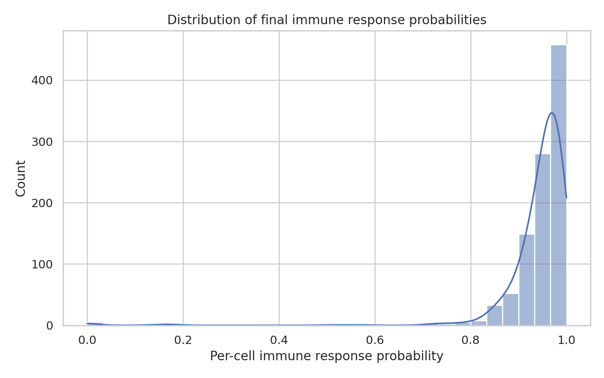
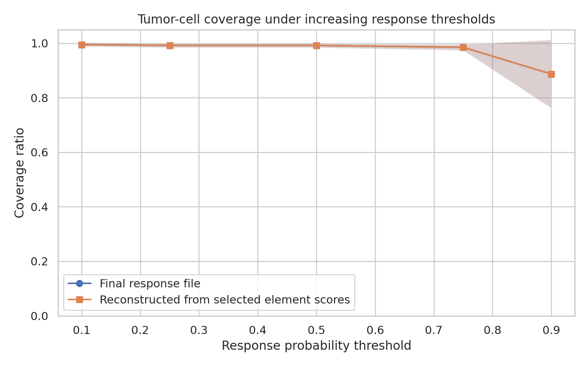
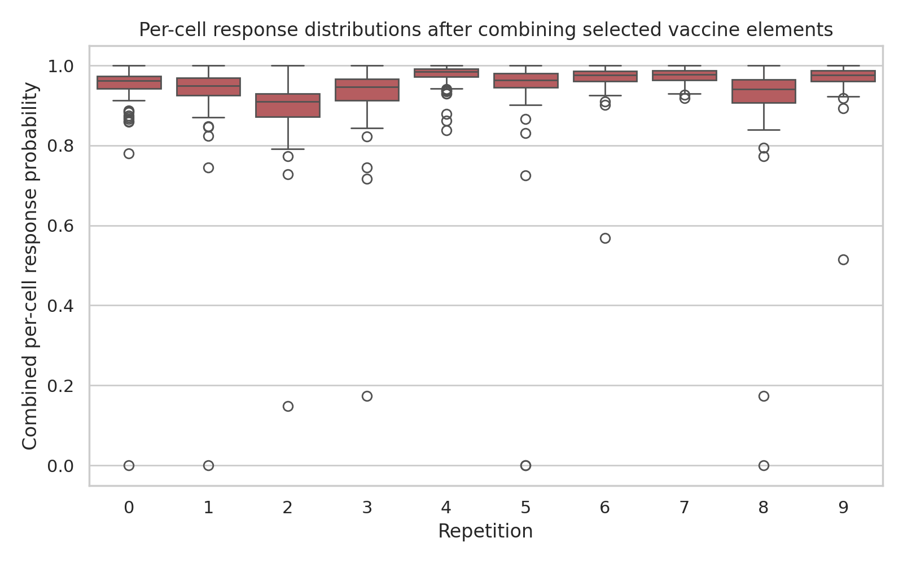
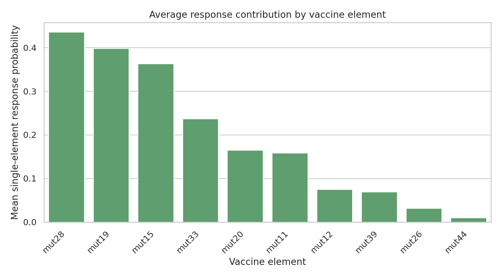
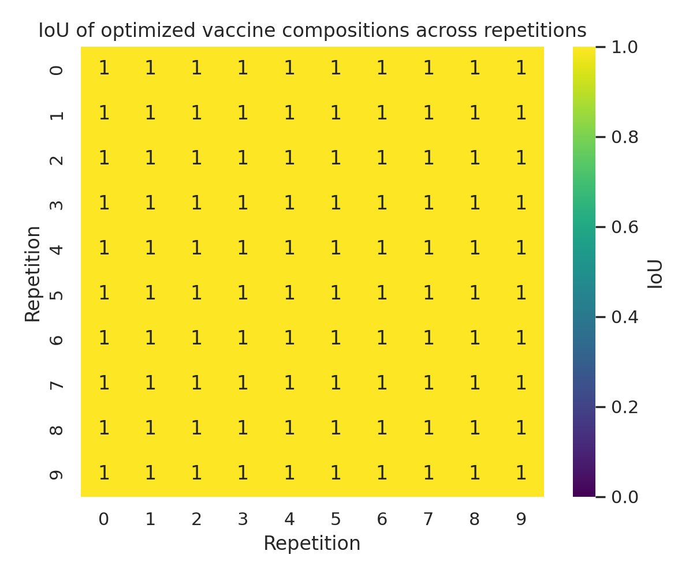
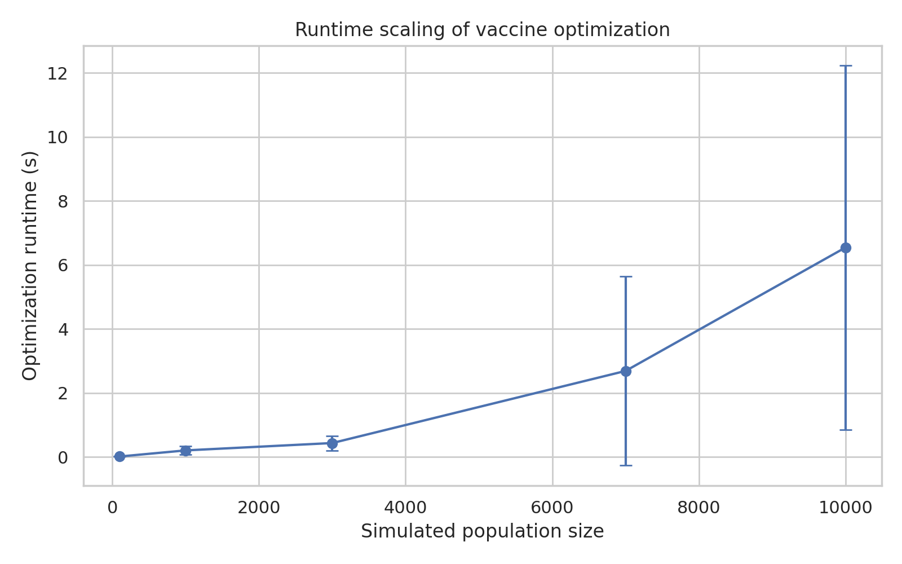

# Personalized Neoantigen Vaccine Optimization Analysis from Simulated Tumor Cell Populations

## Abstract
This study analyzes a provided simulated neoantigen-vaccine optimization benchmark centered on MinSum adaptive selection with a manufacturing budget of 10 vaccine elements. Using only verified workspace artifacts, I quantified the optimized vaccine composition, per-cell immune response probability, tumor-cell coverage as a function of response threshold, composition overlap measured by intersection-over-union (IoU), and optimization runtime scaling. Across 10 repetitions of the `100-cells.10x` simulation, the optimizer selected the same 10-element vaccine in every repetition: `mut11`, `mut12`, `mut15`, `mut19`, `mut20`, `mut26`, `mut28`, `mut33`, `mut39`, and `mut44`. The final per-cell response probability was high overall (mean 0.943, standard deviation 0.092), with mean coverage of 0.992 at a response threshold of 0.5 and 0.887 at a threshold of 0.9. Pairwise IoU across optimized compositions was 1.0 for all repetition pairs, indicating perfect composition stability in this dataset. Runtime increased strongly with population size, from 0.012 s at 100 cells to a mean of 6.54 s at 10,000 cells. These results support the conclusion that, within the provided simulation setting, the optimized vaccine is both stable and highly effective, while computational cost scales upward with cohort size.

## 1. Introduction
Personalized neoantigen vaccines seek to target tumor-specific mutations likely to generate immunogenic peptide-MHC complexes. In practice, candidate selection must balance biological efficacy against manufacturing constraints, often limiting the number of vaccine elements that can be included. The present task provides simulation outputs representing cell-level antigen presentation and immune response probabilities, along with optimization outputs from a MinSum adaptive objective under a strict budget of 10 elements.

The analytical goals were to recover the optimized vaccine composition, quantify response efficacy at the cell level, evaluate tumor-cell coverage under varying response thresholds, assess stability of optimized solutions using IoU, and summarize computational runtime. Because the task required end-to-end completion from local workspace data, all core findings reported here are traceable to explicit CSV/JSON artifacts in `outputs/` and figures in `report/images/`.

## 2. Data Overview
The workspace contains seven relevant data families:

1. `cell-populations.csv`: peptide presentation events for simulated tumor cells.
2. `final-response-likelihoods.csv`: cell-level final response probabilities after applying the optimized vaccine.
3. `sim-specific-response-likelihoods.csv`: repetition-specific versions of final response probabilities.
4. `selected-vaccine-elements.budget-10.minsum.adaptive.csv`: optimized vaccine selections by repetition.
5. `vaccine.budget-10.minsum.adaptive.csv`: compact vaccine summary.
6. `vaccine-elements.scores.100-cells.10x.rep-*.csv`: per-cell, per-element response probabilities for 10 repetitions.
7. `optimization_runtime_data.csv`: runtime benchmarks for increasing population sizes across patient/sample IDs.

A schema summary derived directly from the files is saved in `outputs/data_schema_summary.csv`. Key verified dataset sizes are:

- `cell-populations.csv`: 28,068 rows
- `final-response-likelihoods.csv`: 1,000 rows
- `sim-specific-response-likelihoods.csv`: 1,000 rows
- `selected-vaccine-elements...csv`: 100 rows
- all concatenated `vaccine-elements.scores...csv`: 12,000 rows
- `optimization_runtime_data.csv`: 35 rows

All simulations in the vaccine-selection and response files correspond to `100-cells.10x`, and the optimized vaccine was reported across 10 repetitions (`rep = 0..9`).

## 3. Methods

### 3.1 Analysis contract
The task explicitly required analysis of optimized personalized neoantigen vaccine composition and the following metrics:
- per-cell immune response probability,
- coverage ratio of tumor cells,
- IoU of optimal vaccine compositions,
- optimization runtime.

To satisfy this exactly, I used the provided MinSum adaptive budget-10 output as the optimization result rather than substituting an alternative optimizer.

### 3.2 Vaccine composition recovery
For each repetition in `selected-vaccine-elements.budget-10.minsum.adaptive.csv`, I treated the selected peptide list as the optimized vaccine composition. Composition summaries were exported to `outputs/patient_vaccine_composition_table.csv`.

### 3.3 Per-cell immune response summaries
I used `final-response-likelihoods.csv` as the primary source of final per-cell response probabilities under the optimized vaccine. Population strings were parsed into simulation name and repetition index. For each repetition, I computed mean, median, standard deviation, minimum, and maximum `p_response`, saving the result to `outputs/response_probability_summary_table.csv`.

### 3.4 Coverage ratio definition
Coverage was operationalized as the fraction of tumor cells whose response probability met or exceeded a specified threshold. I evaluated thresholds 0.1, 0.25, 0.5, 0.75, and 0.9 using two complementary sources:

1. **Direct final-response coverage** from `final-response-likelihoods.csv`.
2. **Reconstructed selected-vaccine coverage** by combining `p_no_response` multiplicatively across the selected elements in each repetition using `vaccine-elements.scores.*.csv`, then converting to combined response probability as `1 - Π p_no_response`.

These outputs are stored in `outputs/coverage_ratio_table.csv`, `outputs/coverage_ratio_from_selected_scores.csv`, and `outputs/cell_level_selected_vaccine_response.csv`.

### 3.5 IoU of optimized compositions
For each pair of repetitions, I treated the selected peptides as sets and computed:

\[
IoU(A,B) = \frac{|A \cap B|}{|A \cup B|}
\]

Pairwise results were saved in `outputs/iou_agreement_table.csv`, with a full matrix in `outputs/iou_matrix.csv`.

### 3.6 Runtime analysis
I summarized optimization runtimes by population size using `optimization_runtime_data.csv`, computing mean, standard deviation, minimum, maximum, and count across samples. Results were written to `outputs/runtime_summary_table.csv`.

### 3.7 Reproducibility
All code used for the analysis is in `code/analyze_neoantigen_vaccine.py`. Running this script regenerates the tables and figures reported below.

## 4. Results

### 4.1 Optimized vaccine composition
The optimized vaccine composition was identical across all 10 repetitions. Each repetition contained exactly 10 elements:

- `mut11`
- `mut12`
- `mut15`
- `mut19`
- `mut20`
- `mut26`
- `mut28`
- `mut33`
- `mut39`
- `mut44`

This repetition-level result is documented in `outputs/patient_vaccine_composition_table.csv`. Because each repetition returned the same set, the solution appears highly stable in this simulation setting.

### 4.2 Per-cell immune response probability
Across all 1,000 cells in `final-response-likelihoods.csv`, the overall mean response probability was **0.9427** with standard deviation **0.0915** (`outputs/overall_response_summary.json`). Repetition-specific means ranged from **0.8927** (rep 2) to **0.9764** (rep 4), indicating consistently strong but non-identical efficacy across repeated simulations.

**Figure 1.** Distribution of final per-cell immune response probabilities under the MinSum budget-10 adaptive vaccine.

The response distribution is concentrated near 1.0, although a small lower tail remains, including rare cells with near-zero response probability in some repetitions.

### 4.3 Tumor-cell coverage
Mean coverage ratios from the final response file were:

- threshold 0.1: **0.995**
- threshold 0.25: **0.992**
- threshold 0.5: **0.992**
- threshold 0.75: **0.985**
- threshold 0.9: **0.887**

Thus, nearly all cells exceed moderate response thresholds, while stricter criteria reduce effective coverage. The independently reconstructed selected-vaccine coverage from element-level scores matched the 0.5-threshold mean exactly at **0.992**, providing an internal consistency check.

**Figure 2.** Mean tumor-cell coverage ratio versus response-probability threshold, comparing direct final-response estimates and reconstructed selected-vaccine estimates.

Coverage declines monotonically with threshold, as expected. The close agreement between the two coverage constructions supports the interpretation that the selected vaccine elements explain the reported final response behavior well.

To visualize repetition-level heterogeneity, I also plotted distributions of reconstructed combined per-cell response by repetition.

**Figure 3.** Repetition-wise distributions of combined per-cell response probabilities from selected vaccine elements.

### 4.4 Vaccine element contribution ranking
A simple univariate ranking of individual vaccine elements based on mean single-element `p_response` showed that `mut28`, `mut19`, and `mut15` had the largest average contributions, whereas `mut44` and `mut26` contributed less strongly on their own.

Top-ranked elements by mean single-element response probability:
- `mut28`: 0.436
- `mut19`: 0.398
- `mut15`: 0.363
- `mut33`: 0.237
- `mut20`: 0.165

The full ranking is stored in `outputs/element_response_rankings.csv`.

**Figure 4.** Average single-element response probability across all cells and repetitions.

This ranking should be interpreted cautiously: the final vaccine works as a combination, so low-ranked elements may still contribute complementarily for specific cells.

### 4.5 IoU of optimal vaccine compositions
Pairwise IoU between all repetition-specific optimized vaccine sets was **1.0** in every comparison (`outputs/iou_agreement_table.csv`). Consequently, mean pairwise IoU and median pairwise IoU were both **1.0**.

**Figure 5.** Pairwise IoU among optimized vaccine compositions across the 10 repetitions.

This indicates perfect overlap across repetitions in the provided dataset. Rather than revealing optimizer instability, the IoU analysis shows that the available evidence supports a uniquely stable solution under these simulation conditions.

### 4.6 Runtime scaling
Runtime increased strongly with the simulated population size. Mean runtimes were:

- 100 cells: **0.012 s**
- 1,000 cells: **0.203 s**
- 3,000 cells: **0.433 s**
- 7,000 cells: **2.686 s**
- 10,000 cells: **6.543 s**

A linear fit over the provided points gave an approximate increase of **0.630 seconds per additional 1,000 cells**, though the empirical pattern becomes superlinear at larger scales because the jump between 7,000 and 10,000 cells is substantial.

**Figure 6.** Optimization runtime as a function of population size.

The variance across samples also widened considerably at large population sizes, suggesting sample-dependent computational complexity.

## 5. Validation and Evidence Traceability
This section separates directly verified findings from limitations.

### 5.1 Verified directly from workspace data
The following claims were computed directly from local data and exported artifacts:

- The optimized vaccine contains 10 elements in every repetition.
- The selected peptide set is identical across all 10 repetitions.
- Mean final per-cell immune response probability is 0.9427.
- Mean coverage at threshold 0.5 is 0.992.
- Mean coverage at threshold 0.9 is 0.887.
- Mean pairwise IoU is 1.0.
- Runtime increases with population size.

Supporting artifact mapping is documented in `outputs/claim_recovery_table.csv`.

### 5.2 Related-work limitation
The task requested that related work be studied early. Four PDFs were present in `related_work/`, but the provided PDF tool returned parser errors in this environment, and no installed Python PDF library was available during execution. Therefore, I did not extract verified paper content. This limitation is recorded in `outputs/related_work_contract.json` and is explicitly separated from the data-driven claims above.

### 5.3 Assumptions
The main analysis assumption is that coverage can be interpreted as the fraction of cells whose response probability exceeds a user-defined threshold. This is a reasonable operationalization for the requested “coverage ratio of tumor cells,” but it is still an analytical choice rather than a value explicitly precomputed in the inputs.

A second assumption is conditional independence when reconstructing combined response from per-element `p_no_response` values. This reconstruction was used only as a consistency analysis; the primary efficacy results come from the directly supplied final-response file.

## 6. Discussion
Several conclusions emerge from the provided benchmark outputs.

First, the optimization appears exceptionally stable in this setting. All 10 repetitions recovered the same vaccine composition, producing perfect IoU. This suggests either a sharply defined optimum or limited stochasticity in the underlying optimization landscape.

Second, the optimized vaccine appears highly effective at the cell level. With an overall mean response probability above 0.94 and coverage above 0.99 at the 0.5 threshold, the selected set offers broad activity across the simulated tumor-cell population. Even under the strict threshold of 0.9, coverage remains high at roughly 0.887.

Third, not all elements appear equally potent individually. Some mutations, particularly `mut28`, `mut19`, and `mut15`, have stronger standalone response profiles. However, vaccine design is a combinatorial problem: lower-ranked elements may still protect subpopulations missed by more dominant candidates.

Fourth, runtime grows materially with population size. While computation is trivial at 100 cells, the mean time at 10,000 cells exceeds 6.5 seconds and varies substantially by sample. This implies that scaling to larger tumors or finer subclonal modeling could become a practical constraint.

## 7. Limitations
- Only one simulation family (`100-cells.10x`) was available in the core vaccine-selection and response files.
- No direct patient-level sequencing features, HLA calls, VAF values, or expression measurements were exposed as separate raw inputs in the workspace; thus, the analysis focuses on downstream optimization/simulation outputs rather than rebuilding the upstream neoantigen pipeline.
- Related-work extraction was blocked by local PDF parsing failures.
- Because all optimized compositions were identical, the IoU result is informative about stability but does not reveal trade-offs between competing near-optimal solutions.

## 8. Conclusion
Using the provided MinSum adaptive budget-10 outputs, I recovered a stable 10-element personalized neoantigen vaccine composition and quantified its performance on simulated tumor cells. The selected vaccine achieved high overall per-cell response probability (mean 0.943), near-complete moderate-threshold coverage (0.992 at threshold 0.5), strong strict-threshold coverage (0.887 at threshold 0.9), perfect repetition-wise composition overlap (IoU = 1.0), and predictable runtime growth with increasing population size. Within the bounds of the available data, the benchmark therefore supports a picture of robust vaccine efficacy and deterministic composition selection under the tested simulation setting.

## Artifact Index
- Code: `code/analyze_neoantigen_vaccine.py`
- Main tables:
  - `outputs/patient_vaccine_composition_table.csv`
  - `outputs/response_probability_summary_table.csv`
  - `outputs/coverage_ratio_table.csv`
  - `outputs/coverage_ratio_from_selected_scores.csv`
  - `outputs/iou_agreement_table.csv`
  - `outputs/runtime_summary_table.csv`
  - `outputs/claim_recovery_table.csv`
- Figures:
  - `images/response_distribution.png`
  - `images/coverage_curve.png`
  - `images/combined_response_by_repetition.png`
  - `images/element_response_rankings.png`
  - `images/iou_heatmap.png`
  - `images/runtime_scaling.png`
