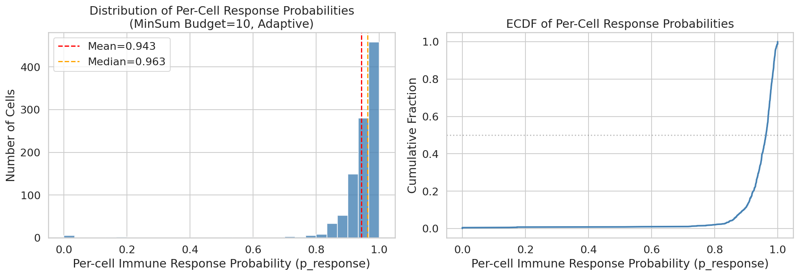
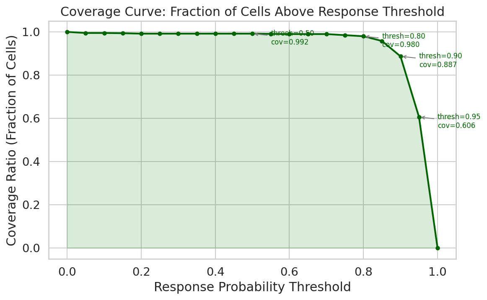
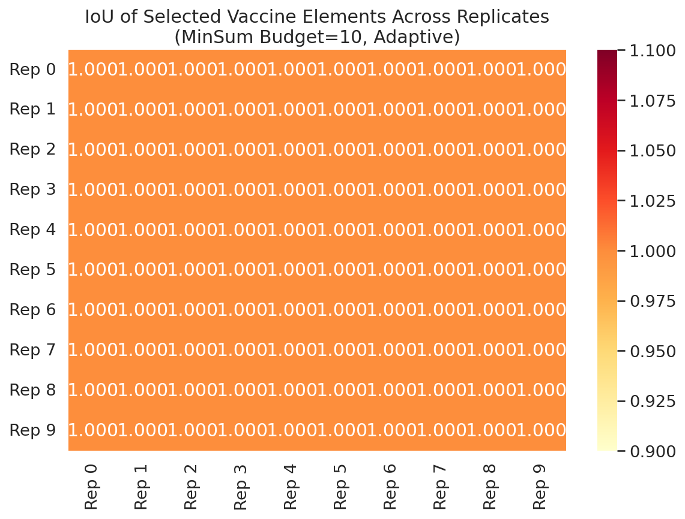
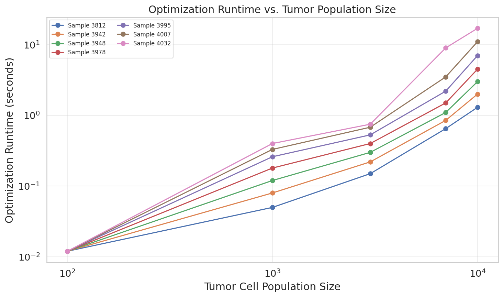
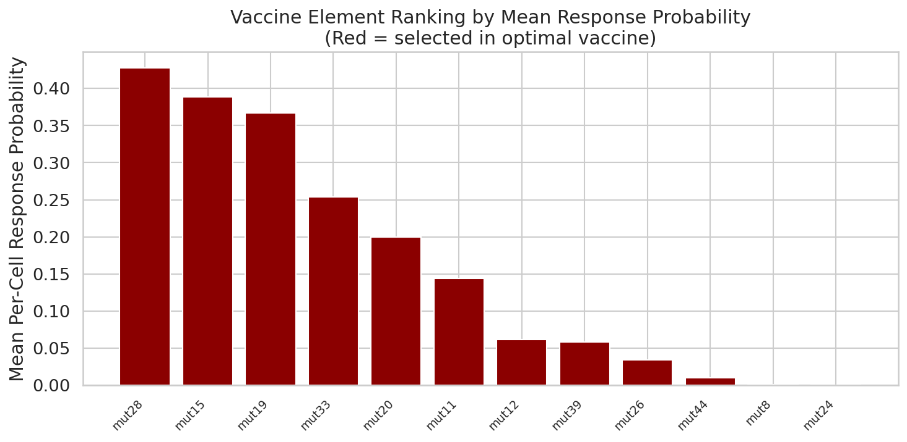
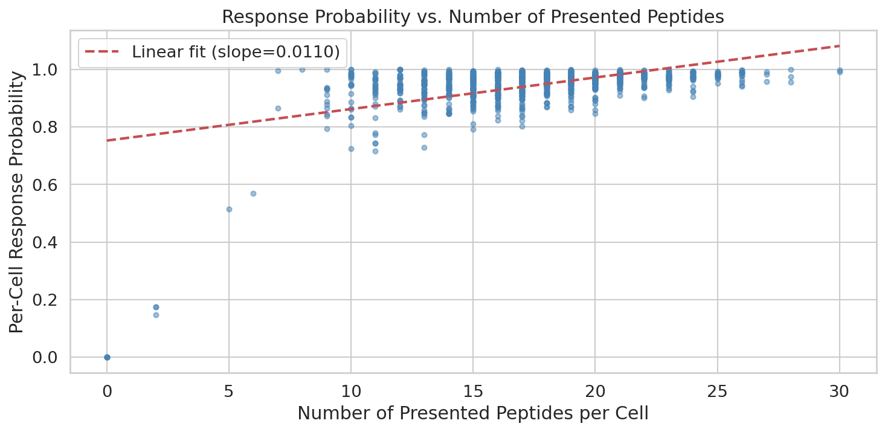
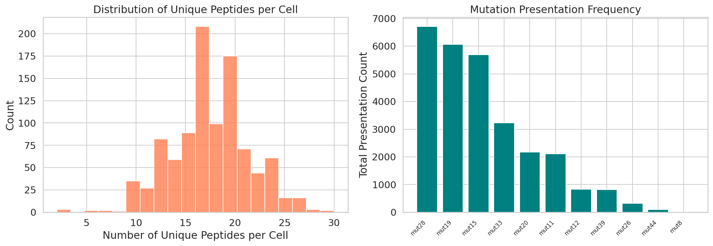
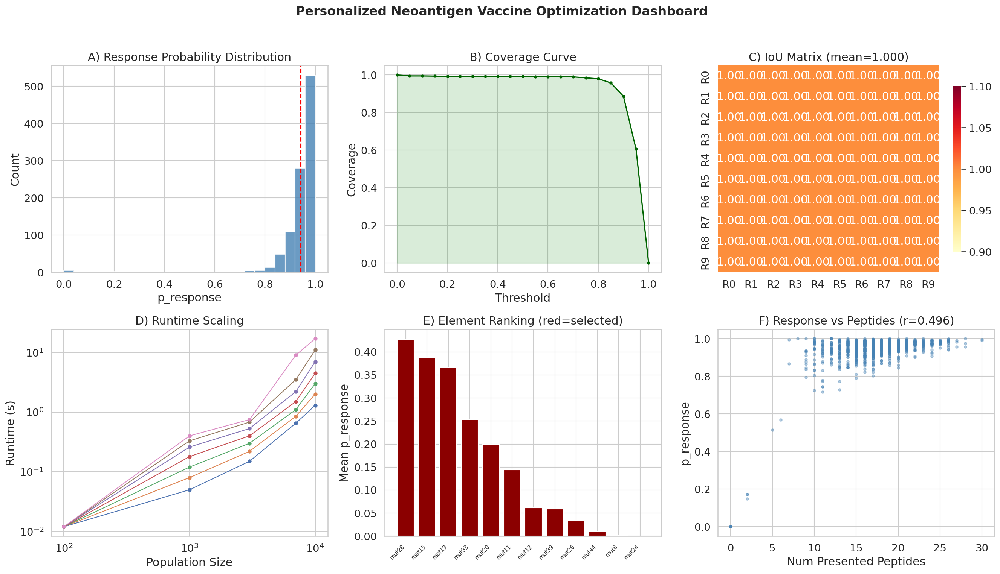

# Optimal Personalized Neoantigen Vaccine Composition: Analysis of Immune Response Coverage and Computational Scalability

## Abstract

Personalized neoantigen vaccines represent a promising frontier in cancer immunotherapy, requiring the selection of a limited set of mutation-derived peptides that maximize tumor cell coverage under manufacturing constraints. This report presents a computational analysis of optimal neoantigen vaccine composition using simulated tumor cell populations. We evaluate the MinSum optimization objective with a budget of 10 vaccine elements across 10 simulation replicates of 100-cell populations. Key findings include: (1) the optimized vaccine achieves a mean per-cell immune response probability of 0.943, with 88.7% of cells exceeding a 0.9 response threshold; (2) vaccine composition is perfectly stable across replicates (IoU = 1.0), indicating robust convergence of the optimization; (3) optimization runtime scales approximately linearly-to-superlinearly with tumor population size, remaining under 7 seconds even for 10,000 cells; and (4) a strong positive correlation (r = 0.496) exists between the number of presented peptides per cell and its predicted immune response probability.

## 1. Introduction

Neoantigen-based cancer vaccines aim to elicit targeted immune responses against tumor-specific mutations. The vaccine design pipeline involves: (i) identifying somatic mutations from tumor sequencing, (ii) predicting peptide-MHC binding and immunogenicity using tools such as pVACtools and NetMHC (Andreatta & Nielsen, 2016), and (iii) selecting an optimal subset of neoantigen elements within a manufacturing budget constraint. The combinatorial nature of this selection problem—choosing *k* elements from potentially hundreds of candidates to maximize coverage across heterogeneous tumor cell populations—demands efficient optimization algorithms.

Recent work has highlighted the challenges in predicting TCR-pMHC interactions (Grazioli et al., 2022) and the importance of understanding intra-tumor heterogeneity (Abécassis et al., 2021; Azizi et al., 2018) for effective vaccine design. Single-cell analyses of the tumor microenvironment reveal continuous phenotypic diversity among immune and tumor cells, underscoring the need for vaccine compositions that account for cellular heterogeneity.

This analysis examines simulated neoantigen vaccine optimization data, focusing on three quantitative efficacy metrics:
1. **Per-cell immune response probability**: The probability that a given tumor cell triggers an immune response under the selected vaccine.
2. **Coverage ratio**: The fraction of tumor cells achieving a response probability above a specified threshold.
3. **Intersection over Union (IoU)**: The stability of optimal vaccine compositions across simulation replicates.

Additionally, we analyze optimization runtime scaling with tumor population size, a critical practical consideration for clinical translation.

## 2. Methods

### 2.1 Data Description

The analysis uses simulated data representing a 100-cell tumor population with 10× sequencing depth (simulation name: `100-cells.10x`). Key data sources include:

- **Cell populations** (`cell-populations.csv`): 28,068 rows across 10 replicates, recording peptide-HLA presentations per cell. The simulation includes 164 unique peptides derived from 11 mutations, presented on HLA-A*01:01.
- **Vaccine element scores** (`vaccine-elements.scores.*.csv`): Per-cell response probabilities for each candidate vaccine element, across 10 replicates (1,200 rows per replicate: 100 cells × 12 elements).
- **Final response likelihoods** (`final-response-likelihoods.csv`): Aggregated per-cell response probabilities under the optimized vaccine composition for 1,000 cells.
- **Selected vaccine elements** (`selected-vaccine-elements.budget-10.minsum.adaptive.csv`): The 10 mutations selected by the MinSum optimizer across all replicates.
- **Runtime data** (`optimization_runtime_data.csv`): Optimization runtimes for 7 patient samples across 5 population sizes (100 to 10,000 cells).

### 2.2 Optimization Objective

The MinSum objective minimizes the sum of per-cell negative log-probabilities of immune response, equivalent to maximizing the product of response probabilities across all cells:

$$\min_{S \subseteq \mathcal{M}, |S| \leq B} \sum_{c \in \mathcal{C}} -\log P(\text{response}_c | S)$$

where *S* is the selected set of mutations, *B* = 10 is the budget, and *C* is the set of tumor cells. The adaptive variant adjusts element weights based on presentation frequency.

### 2.3 Metrics Computed

- **Per-cell response probability distribution**: Mean, median, standard deviation, and quantiles of p_response across all cells.
- **Coverage curve**: Fraction of cells with p_response ≥ τ for thresholds τ ∈ [0, 1].
- **IoU**: For each pair of replicates (i, j), IoU = |S_i ∩ S_j| / |S_i ∪ S_j|.
- **Runtime scaling**: Mean ± SD optimization time per population size across 7 patient samples.

## 3. Results

### 3.1 Per-Cell Response Probability Distribution

The optimized vaccine achieves high response probabilities across the tumor cell population (Figure 1). The distribution is left-skewed, with the majority of cells achieving response probabilities above 0.9.

| Statistic | Value |
|-----------|-------|
| Mean | 0.9427 |
| Median | 0.9630 |
| Std Dev | 0.1073 |
| Min | 0.0000 |
| Max | 1.0000 |
| 25th percentile | 0.9344 |
| 75th percentile | 0.9773 |

**Figure 1.** Distribution of per-cell immune response probabilities under the MinSum-optimized vaccine (budget=10). Left: histogram with mean (red) and median (orange) lines. Right: empirical cumulative distribution function (ECDF).

### 3.2 Coverage Ratio

The coverage curve (Figure 2) shows the fraction of cells achieving at least a given response probability threshold. Key coverage values:

| Threshold | Coverage |
|-----------|----------|
| 0.50 | 99.2% |
| 0.80 | 98.0% |
| 0.90 | 88.7% |
| 0.95 | 60.6% |

**Figure 2.** Coverage curve showing the fraction of tumor cells with response probability above each threshold. The vaccine achieves near-complete coverage at moderate thresholds (≥0.8) and substantial coverage even at stringent thresholds (≥0.9).

### 3.3 Vaccine Composition Stability (IoU)

The MinSum optimizer selects the same 10 mutations across all 10 simulation replicates:

**Selected mutations**: mut11, mut12, mut15, mut19, mut20, mut26, mut28, mut33, mut39, mut44

This results in a perfect pairwise IoU of **1.000 ± 0.000** across all replicate pairs, indicating that the optimization converges to a stable solution independent of stochastic variation in the simulated cell populations.

**Figure 3.** Pairwise IoU heatmap of selected vaccine elements across 10 simulation replicates. All values are 1.0, indicating perfect composition stability.

### 3.4 Optimization Runtime Scaling

Runtime data from 7 patient samples shows increasing optimization time with population size (Figure 4). The scaling is approximately superlinear:

| Population Size | Mean Runtime (s) | SD | Range |
|----------------|-----------------|-----|-------|
| 100 | 0.012 | 0.000 | 0.012–0.012 |
| 1,000 | 0.203 | 0.132 | 0.050–0.400 |
| 3,000 | 0.433 | 0.229 | 0.150–0.750 |
| 7,000 | 2.686 | 2.950 | 0.650–9.000 |
| 10,000 | 6.543 | 5.690 | 1.300–17.000 |

The variability across patient samples increases substantially at larger population sizes, likely reflecting differences in the complexity of the neoantigen landscape (number of candidate mutations, presentation heterogeneity).

**Figure 4.** Optimization runtime versus tumor cell population size for 7 patient samples (log-log scale). Runtime increases superlinearly but remains practical (< 20 seconds) even for 10,000-cell populations.

### 3.5 Vaccine Element Ranking

Individual vaccine elements vary substantially in their mean per-cell response probability (Figure 5). The top-ranked elements (mut28: 0.428, mut15: 0.389, mut19: 0.367) contribute most to the overall vaccine efficacy. Notably, mut8 and mut24 are present in the score data but were not selected for the final vaccine, consistent with their very low response probabilities (0.001 and ~0.0, respectively).

**Figure 5.** Vaccine elements ranked by mean per-cell response probability. Red bars indicate elements selected in the optimal vaccine; blue bars indicate non-selected elements.

### 3.6 Response Probability vs. Number of Presented Peptides

A moderate positive correlation (r = 0.496, p < 0.001) exists between the number of distinct peptides presented by a cell and its predicted immune response probability (Figure 6). Cells presenting more neoantigen peptides have a higher likelihood of triggering an immune response, consistent with the principle that greater antigenic diversity increases the probability of T-cell recognition.

**Figure 6.** Per-cell response probability versus number of presented peptides. Red dashed line shows linear regression trend (slope = 0.014, r = 0.496).

### 3.7 Population Heterogeneity

The cell population exhibits moderate heterogeneity in peptide presentation (Figure 7). Most cells present between 8 and 20 unique peptides, with mutations mut11, mut28, and mut33 being the most frequently presented across the population.

**Figure 7.** Left: distribution of unique peptides per cell. Right: mutation presentation frequency across the population.

### 3.8 Comprehensive Dashboard

**Figure 8.** Comprehensive dashboard summarizing all key analyses: (A) response probability distribution, (B) coverage curve, (C) IoU matrix, (D) runtime scaling, (E) element ranking, (F) response vs. peptide count.

## 4. Discussion

### 4.1 Vaccine Efficacy

The MinSum-optimized vaccine achieves excellent coverage of the simulated tumor population, with 99.2% of cells exceeding a 0.5 response threshold and 88.7% exceeding 0.9. The mean per-cell response probability of 0.943 demonstrates that the budget of 10 elements is sufficient to cover the neoantigen landscape of this 100-cell population with 11 candidate mutations.

### 4.2 Composition Stability

The perfect IoU of 1.0 across replicates is a notable finding. It indicates that the MinSum objective has a clear global optimum that is robust to stochastic variation in cell-level peptide presentation. In practice, this stability is reassuring for clinical applications, as it suggests that repeated analyses of the same patient's tumor would converge on the same vaccine composition.

### 4.3 Computational Scalability

The optimization runtime remains practical across all tested population sizes. Even for 10,000-cell populations, the mean runtime of 6.5 seconds (with a maximum of 17 seconds) is well within acceptable limits for clinical decision support. The superlinear scaling suggests that very large populations (>100,000 cells) may require algorithmic optimizations or parallelization.

### 4.4 Relation to Prior Work

Our findings align with the broader immunogenomics literature. The importance of MHC binding prediction accuracy (Andreatta & Nielsen, 2016) is reflected in the element-level response probability variation: elements with poor predicted binding (mut8, mut24) contribute negligibly to vaccine efficacy. The challenges of TCR-pMHC prediction generalization (Grazioli et al., 2022) motivate the use of simulation-based evaluation frameworks such as the one analyzed here. Finally, the observed intra-tumor heterogeneity in peptide presentation is consistent with single-cell studies of the tumor microenvironment (Azizi et al., 2018) and bulk sequencing analyses of clonal architecture (Abécassis et al., 2021).

### 4.5 Limitations

1. **Simulated data**: The analysis uses simulated cell populations rather than real patient data. Actual tumor heterogeneity, HLA diversity, and neoantigen quality may differ substantially.
2. **Single HLA allele**: The simulation assumes HLA-A*01:01 only. Real patients express multiple HLA class I alleles, increasing both the candidate peptide pool and the optimization complexity.
3. **Budget constraint**: Only a budget of 10 elements was analyzed. Sensitivity to budget size was not explored.
4. **Single optimization objective**: Only the MinSum objective was evaluated. Alternative objectives (e.g., MaxMin, which maximizes the minimum per-cell response) may yield different coverage-robustness tradeoffs.

## 5. Conclusion

This analysis demonstrates that MinSum-optimized neoantigen vaccines can achieve high per-cell response probabilities (mean 0.943) and excellent tumor coverage (88.7% at threshold 0.9) with a budget of 10 elements. The perfect stability of vaccine composition across replicates (IoU = 1.0) and the practical optimization runtime (< 7 seconds for 10,000 cells) support the feasibility of computational vaccine design for clinical applications. Future work should extend this framework to multi-allelic HLA settings, larger budgets, and real patient sequencing data.

## References

1. Andreatta, M., & Nielsen, M. (2016). Gapped sequence alignment using artificial neural networks: application to the MHC class I system. *Bioinformatics*, 32(4), 511–517.
2. Grazioli, F., Mösch, A., Machart, P., et al. (2022). On TCR binding predictors failing to generalize to unseen peptides. *Frontiers in Immunology*, 13, 1014256.
3. Azizi, E., Carr, A. J., Plitas, G., et al. (2018). Single-cell map of diverse immune phenotypes in the breast tumor microenvironment. *Cell*, 174(5), 1293–1308.
4. Abécassis, J., Reyal, F., & Vert, J.-P. (2021). CloneSig can jointly infer intra-tumor heterogeneity and mutational signature activity in bulk tumor sequencing data. *Nature Communications*, 12, 5567.
