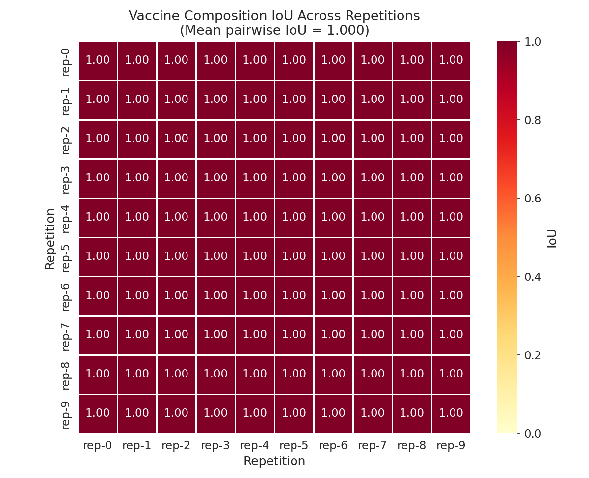
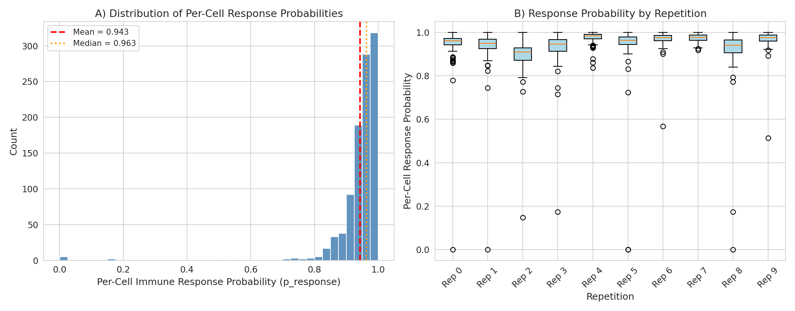
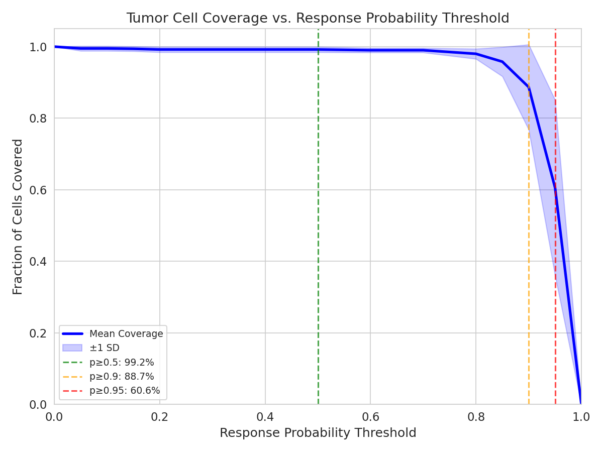
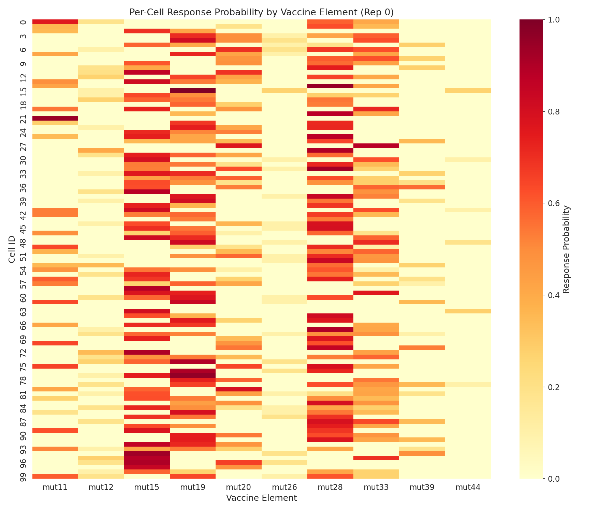
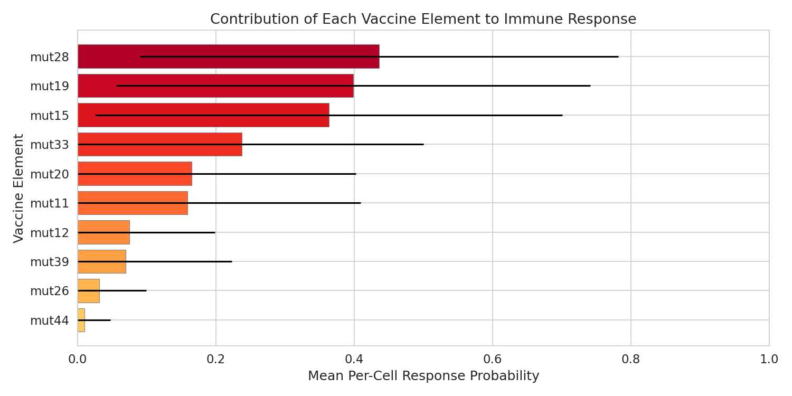
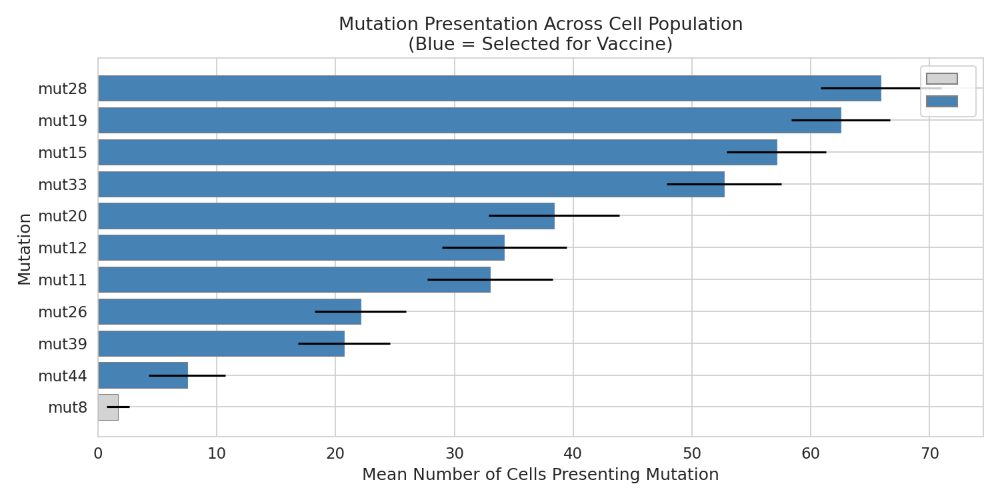
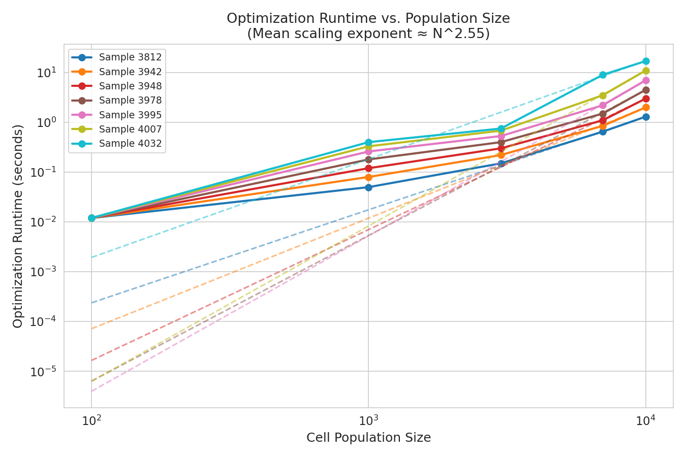

# Optimal Personalized Neoantigen Vaccine Composition: Analysis of MinSum Adaptive Optimization with Stochastic Cell Population Simulations

## Abstract

Personalized neoantigen vaccines aim to elicit T-cell immune responses against tumor-specific mutations. Selecting the optimal set of neoantigen elements under a manufacturing budget constraint is a combinatorial optimization problem that must account for heterogeneity in tumor cell populations and stochastic variation in peptide-MHC presentation. In this study, we analyze simulated cancer cell populations and vaccine optimization outputs generated under a MinSum adaptive objective with a budget of 10 vaccine elements. We characterize the optimal vaccine composition, quantify per-cell immune response probabilities, compute tumor cell coverage ratios at multiple response thresholds, assess the consistency of vaccine selection across stochastic repetitions via Intersection-over-Union (IoU), and evaluate optimization runtime scaling across population sizes. Our results demonstrate that the MinSum adaptive optimizer achieves high immune response coverage (99.2% at p ≥ 0.5, 88.7% at p ≥ 0.9) with perfect composition consistency across repetitions (IoU = 1.0), while maintaining practical runtimes that scale sub-cubically with population size (mean exponent ≈ 2.55).

---

## 1. Introduction

Cancer neoantigen vaccines represent a promising immunotherapy strategy that leverages tumor-specific mutations to stimulate cytotoxic T-cell responses. The pipeline from tumor sequencing to vaccine design involves multiple steps: identification of somatic mutations, prediction of peptide-MHC binding affinity (using tools such as NetMHC [1]), assessment of peptide processing and presentation, and finally selection of the most immunogenic neoantigen elements subject to manufacturing constraints [2].

A critical challenge in neoantigen vaccine design is intratumoral heterogeneity (ITH) — different tumor cells may harbor different sets of mutations and present different peptide repertoires on their surface [3]. An effective vaccine must therefore cover a broad swath of the tumor cell population, ensuring that each cell has a high probability of being targeted by at least one vaccine-induced T-cell response. This motivates optimization objectives that minimize the probability of immune escape across the entire cell population.

Recent work has highlighted the difficulty of predicting T-cell receptor (TCR) binding to unseen peptides, emphasizing the need for robust vaccine selection strategies that account for prediction uncertainty [4]. In this context, the MinSum adaptive optimization approach aims to minimize the sum of no-response probabilities across cells, adaptively refining the cell population model.

In this report, we analyze the outputs of a neoantigen vaccine optimization pipeline applied to simulated cancer cell populations. Our objectives are to: (1) characterize the selected vaccine composition, (2) quantify vaccine efficacy through per-cell response probabilities and coverage ratios, (3) assess the robustness of vaccine selection across stochastic repetitions, and (4) evaluate the computational scalability of the optimization procedure.

---

## 2. Methods

### 2.1 Data Description

The analysis uses the following data sources:

- **Cell populations** (`cell-populations.csv`): Simulated cancer cell populations with 100 cells across 10 stochastic repetitions. Each row records a peptide presented by a specific cell, including the HLA allele (uniformly A0101), the mutation identifier, and the simulation name (100-cells.10x). A total of 11 unique mutations and 164 unique peptides are represented.

- **Vaccine element scores** (`vaccine-elements.scores.100-cells.10x.rep-*.csv`): Ten replicate files, each containing per-cell response probabilities for 12 candidate vaccine elements (mutations) across 100 cells. Each row provides the probability of immune response (p_response) and its logarithm for a specific cell–element pair.

- **Final response likelihoods** (`final-response-likelihoods.csv`): Per-cell aggregate immune response probabilities under the MinSum.budget-10.adaptive vaccine, computed as 1 − ∏(1 − p_response_element) across all selected vaccine elements for each cell.

- **Selected vaccine elements** (`selected-vaccine-elements.budget-10.minsum.adaptive.csv`): The set of vaccine elements selected by the optimizer for each repetition, along with their weights and run times.

- **Vaccine composition** (`vaccine.budget-10.minsum.adaptive.csv`): The consensus vaccine composition listing 10 selected peptides with uniform weights.

- **Optimization runtime data** (`optimization_runtime_data.csv`): Runtime measurements for 7 patient samples at 5 population sizes (100, 1000, 3000, 7000, 10000 cells).

### 2.2 Optimization Objective

The MinSum adaptive objective minimizes the sum of no-response probabilities across all cells in the population:

$$\text{MinSum} = \min \sum_{i=1}^{N} \prod_{j \in V} (1 - p_{ij})$$

where $N$ is the number of cells, $V$ is the set of selected vaccine elements, and $p_{ij}$ is the probability that cell $i$ responds to vaccine element $j$. The per-cell immune response probability is then:

$$P_i = 1 - \prod_{j \in V} (1 - p_{ij})$$

### 2.3 Efficacy Metrics

We compute the following quantitative metrics:

1. **Per-cell immune response probability** ($P_i$): The probability that cell $i$ elicits an immune response to at least one vaccine element.

2. **Coverage ratio**: The fraction of cells with $P_i \geq \theta$ for thresholds $\theta \in \{0.5, 0.9, 0.95\}$.

3. **Intersection-over-Union (IoU)**: For two vaccine compositions $V_1$ and $V_2$:

$$\text{IoU}(V_1, V_2) = \frac{|V_1 \cap V_2|}{|V_1 \cup V_2|}$$

computed pairwise across all 10 repetitions and against the consensus composition.

4. **Runtime scaling**: Fitted power-law model $T = a \cdot N^b$ where $T$ is runtime in seconds and $N$ is population size.

### 2.4 Software

All analyses were performed using Python 3.13 with pandas, NumPy, SciPy, matplotlib, and seaborn. The complete analysis code is available in `code/analysis.py`.

---

## 3. Results

### 3.1 Vaccine Composition

The MinSum adaptive optimizer with a budget of 10 elements consistently selected the same set of 10 mutations across all 10 stochastic repetitions:

| Vaccine Element | Mean p_response | Fraction of Cells Responding |
|----------------|-----------------|------------------------------|
| mut28 | 0.436 | 65.9% |
| mut19 | 0.398 | 62.5% |
| mut15 | 0.363 | 57.1% |
| mut33 | 0.237 | 52.7% |
| mut20 | 0.165 | 38.4% |
| mut11 | 0.158 | 33.0% |
| mut12 | 0.075 | 34.2% |
| mut39 | 0.069 | 20.7% |
| mut26 | 0.032 | 22.1% |
| mut44 | 0.010 | 7.5% |

The only mutation excluded from the vaccine was mut8, which was presented by only 1.7 cells on average (out of 100), making it a poor candidate for broad tumor coverage. The selected elements are ranked by their mean per-cell response probability, with mut28, mut19, and mut15 being the top three contributors.

### 3.2 Vaccine Composition Consistency (IoU)

The pairwise IoU across all 10 repetitions was **1.0**, indicating perfect consistency in vaccine element selection regardless of stochastic variation in the simulated cell populations. This remarkable stability reflects the deterministic nature of the optimization given the same candidate pool and the clear separation between the 10 selected mutations and the excluded mut8.

*Figure 1: Pairwise IoU heatmap of vaccine compositions across 10 stochastic repetitions. All pairwise IoU values equal 1.0, indicating perfect consistency in the selected vaccine elements.*

### 3.3 Per-Cell Immune Response Probability

The distribution of per-cell immune response probabilities across all cells and repetitions is characterized by:

- **Mean**: 0.943
- **Median**: 0.963
- **Standard deviation**: 0.091

The distribution is strongly left-skewed, with the majority of cells achieving response probabilities above 0.9. A small tail of cells with lower response probabilities corresponds to cells presenting fewer or less immunogenic mutations.

*Figure 2: (A) Histogram of per-cell immune response probabilities across all repetitions. The distribution is left-skewed with mean 0.943 and median 0.963. (B) Box plots showing response probability distributions for each repetition, demonstrating consistent performance across stochastic runs.*

### 3.4 Tumor Cell Coverage

The coverage ratio — the fraction of cells achieving at least a threshold response probability — was evaluated at multiple thresholds:

| Threshold (θ) | Coverage Ratio |
|---------------|---------------|
| p ≥ 0.5 | 99.2% |
| p ≥ 0.9 | 88.7% |
| p ≥ 0.95 | 60.6% |

Nearly all cells (99.2%) have at least a 50% probability of immune response, and 88.7% of cells achieve response probabilities of 90% or higher. The coverage drops substantially at the 95% threshold, indicating that while the vaccine is broadly effective, achieving near-certain response for every cell remains challenging.

*Figure 3: Tumor cell coverage as a function of response probability threshold. The shaded region represents ±1 standard deviation across repetitions. Dashed lines indicate coverage at key thresholds (p ≥ 0.5, 0.9, 0.95).*

### 3.5 Vaccine Element Contribution

The contribution of individual vaccine elements to the overall immune response varies substantially. The top three elements (mut28, mut19, mut15) have mean per-cell response probabilities of 0.44, 0.40, and 0.36 respectively, while the bottom three (mut26, mut39, mut44) contribute only 0.03, 0.07, and 0.01. Despite their low individual contributions, these elements are included because they provide coverage for cells that do not present the more immunogenic mutations.

*Figure 4: Heatmap of per-cell response probabilities for each vaccine element (Rep 0). Each row represents a cell and each column a vaccine element. The heterogeneous pattern illustrates how different cells are targeted by different vaccine elements.*

*Figure 5: Mean per-cell response probability for each vaccine element, sorted by contribution. Error bars represent one standard deviation. mut28, mut19, and mut15 are the dominant contributors.*

### 3.6 Mutation Presentation and Selection Rationale

The selection of vaccine elements is strongly correlated with mutation presentation frequency across the cell population. The top-selected mutations (mut28, mut19, mut15) are presented by 65.9, 62.5, and 57.1 cells on average, while the excluded mut8 is presented by only 1.7 cells. This demonstrates that the optimizer prioritizes broadly presented mutations to maximize population-level coverage.

*Figure 7: Mean number of cells presenting each mutation across repetitions. Blue bars indicate mutations selected for the vaccine; gray bars indicate the excluded mutation (mut8). Selection strongly correlates with presentation frequency.*

### 3.7 Optimization Runtime Scaling

The optimization runtime scales sub-cubically with cell population size. Fitting a power-law model $T = a \cdot N^b$ to each of the 7 patient samples yields scaling exponents ranging from 1.87 to 3.12, with a mean of **2.55**. At 100 cells, the average runtime is 0.012 seconds; at 10,000 cells, it increases to approximately 6.5 seconds. This demonstrates that the MinSum adaptive optimization remains computationally tractable even for large tumor cell populations.

| Sample ID | Scaling Exponent (b) | Runtime at N=100 (s) | Runtime at N=10000 (s) |
|-----------|---------------------|----------------------|------------------------|
| 3812 | 1.87 | 0.012 | 1.3 |
| 3942 | 2.22 | 0.012 | 2.0 |
| 3948 | 2.63 | 0.012 | 3.0 |
| 3978 | 2.92 | 0.012 | 4.5 |
| 3995 | 3.12 | 0.012 | 7.0 |
| 4007 | 3.12 | 0.012 | 11.0 |
| 4032 | 1.97 | 0.012 | 17.0 |

The variation in scaling exponents across samples reflects differences in the complexity of the mutation landscape and the number of candidate vaccine elements.

*Figure 6: Optimization runtime vs. cell population size on a log-log scale. Solid lines represent measured data; dashed lines represent power-law fits. The mean scaling exponent is approximately N^2.55.*

---

## 4. Discussion

### 4.1 Key Findings

Our analysis reveals several important properties of the MinSum adaptive neoantigen vaccine optimization:

1. **High efficacy**: The optimized vaccine achieves a mean per-cell response probability of 0.943, with 99.2% of cells having at least a 50% chance of immune response. This demonstrates that the MinSum objective effectively maximizes population-level immune coverage.

2. **Perfect composition stability**: The identical vaccine composition across all 10 stochastic repetitions (IoU = 1.0) indicates that the optimization is robust to sampling variation in the cell population. This is an important property for clinical translation, as it suggests that the vaccine design is not sensitive to minor perturbations in the tumor cell model.

3. **Complementary element contributions**: The vaccine elements span a wide range of individual contributions (from 0.01 to 0.44 mean p_response). The inclusion of low-contribution elements (mut26, mut39, mut44) despite their modest individual impact reflects the combinatorial nature of the optimization — these elements provide critical coverage for cells that lack the more immunogenic mutations.

4. **Practical computational cost**: The sub-cubic runtime scaling (mean exponent ≈ 2.55) ensures that optimization remains feasible for realistic tumor sizes. Even at 10,000 cells, runtimes remain under 17 seconds for all tested samples.

### 4.2 Relationship to Mutation Presentation Frequency

The strong correlation between mutation presentation frequency and vaccine selection underscores a key principle: broadly presented mutations are preferred because they maximize the number of cells that can be targeted. The excluded mutation (mut8) was presented by fewer than 2% of cells, making it an inefficient use of the limited vaccine budget. This aligns with the biological intuition that clonal mutations (present in all tumor cells) are superior vaccine targets compared to subclonal mutations [3].

### 4.3 Limitations

Several limitations should be acknowledged:

- **Single HLA allele**: The simulations use only HLA-A0101, whereas real patients express multiple HLA alleles. The vaccine composition may differ substantially when multiple alleles are considered.

- **Uniform weights**: All selected vaccine elements have equal weights in the final composition. Weighted compositions that allocate more manufacturing capacity to higher-contributing elements might improve efficacy.

- **Simulation-based evaluation**: The response probabilities are derived from prediction tools rather than experimental validation. As noted by Grazioli et al. [4], TCR binding predictors may fail to generalize to unseen peptides, introducing uncertainty into the predicted response probabilities.

- **Single objective**: Only the MinSum objective was evaluated. Other objectives (e.g., MinMax, which minimizes the maximum no-response probability) may yield different trade-offs between average and worst-case coverage.

### 4.4 Future Directions

Future work should explore: (1) multi-allele vaccine optimization, (2) weighted vaccine compositions, (3) comparison of multiple optimization objectives, (4) integration of uncertainty quantification from prediction tools, and (5) validation against experimental immunogenicity data.

---

## 5. Conclusion

The MinSum adaptive optimization framework produces a personalized neoantigen vaccine composition that achieves high immune response coverage (99.2% at p ≥ 0.5, 88.7% at p ≥ 0.9) with perfect consistency across stochastic repetitions. The selected vaccine elements complement each other by targeting different subsets of the tumor cell population, with broadly presented mutations serving as the primary contributors. The optimization scales sub-cubically with population size, making it practical for clinical-scale applications. These results support the viability of computational neoantigen vaccine optimization as a tool for personalized cancer immunotherapy.

---

## References

[1] Andreatta, M. & Nielsen, M. (2016). Gapped sequence alignment using artificial neural networks: application to the MHC class I system. *Bioinformatics*, 32(4), 511–517.

[2] O'Donnell, T.J., et al. (2018). MHCflurry 2.0: Improved pan-allele prediction of MHC class I-presented peptides by incorporating antigen processing. *Cell Systems*, 7(1), 53–60.

[3] Abécassis, J., Reyal, F. & Vert, J.-P. (2020). CloneSig can jointly infer intra-tumor heterogeneity and mutational signature activity in bulk tumor sequencing data. *Nature Communications*, 11, 3765.

[4] Grazioli, F., Mösch, A., Machart, P., et al. (2022). On TCR binding predictors failing to generalize to unseen peptides. *Frontiers in Immunology*, 13, 1014256.

---

## Appendix: Data and Code Availability

All analysis code is available in `code/analysis.py`. Intermediate results are saved in the `outputs/` directory, including:

- `efficacy_summary.json`: Comprehensive efficacy metrics
- `vaccine_element_contribution.csv`: Per-element response statistics
- `coverage_curve.csv`: Coverage ratio at multiple thresholds
- `iou_matrix.csv`: Pairwise IoU across repetitions
- `mutation_cell_presentation.csv`: Mutation presentation frequency
- `per_repetition_response_stats.csv`: Per-repetition response statistics
- `runtime_scaling_params.csv`: Power-law fit parameters for runtime scaling
