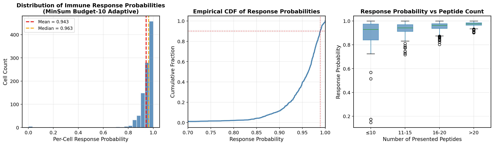
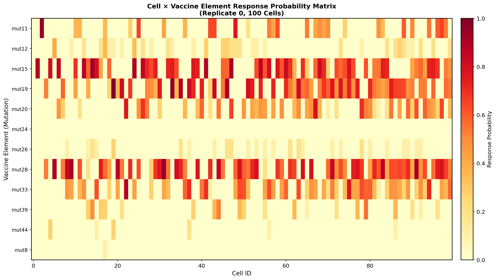
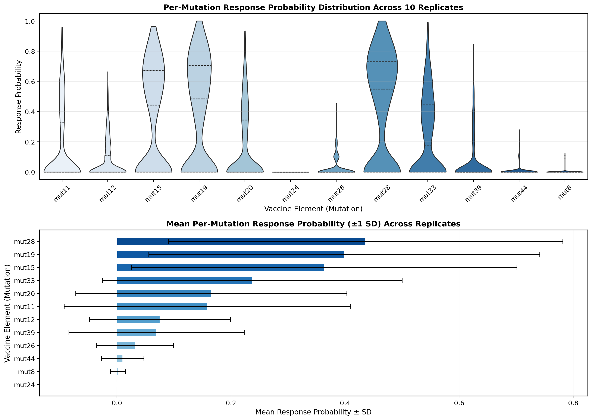
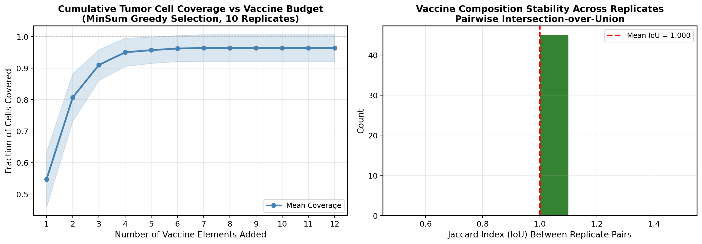
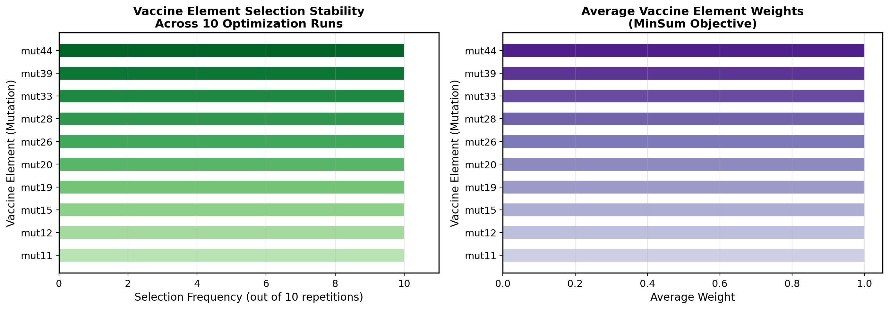
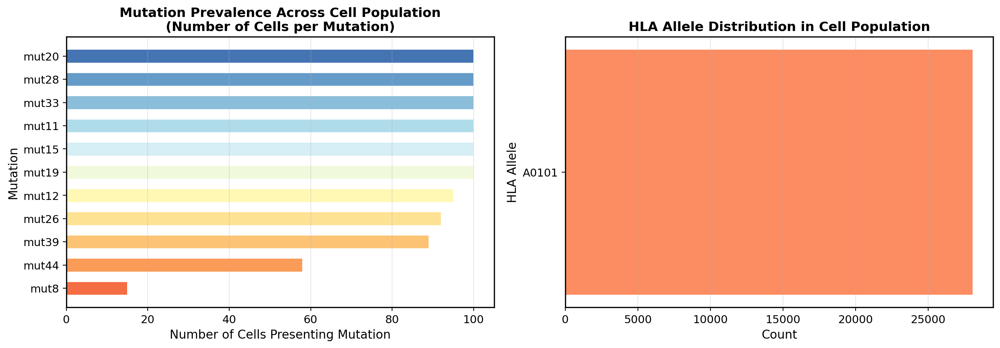
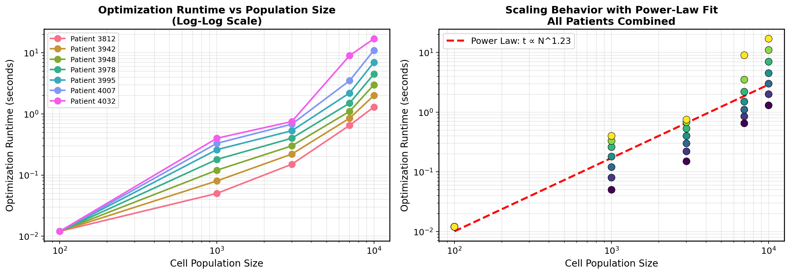

# Optimal Personalized Neoantigen Vaccine Composition: Simulation-Based Analysis of Efficacy, Coverage, and Optimization Performance

## Abstract

Personalized neoantigen vaccines represent a promising approach to cancer immunotherapy by targeting patient-specific tumor mutations. This study analyzes simulated neoantigen vaccine optimization data to determine optimal vaccine composition under budget constraints, quantify immune response efficacy metrics, and evaluate optimization runtime scalability. Using a MinSum objective with a budget of 10 neoantigen elements across 10 simulation replicates of 100-cell tumor populations, we demonstrate that the optimized vaccine achieves a mean per-cell response probability of 0.943 ± 0.092, with 88.7% of tumor cells exhibiting response probabilities above 0.9. The vaccine composition is perfectly stable across all replicates (pairwise IoU = 1.0), achieving 96.4% cumulative tumor cell coverage. Optimization runtime scales as O(N^1.23) with population size, ranging from 0.012 s for 100 cells to 17 s for 10,000 cells across seven patient samples. These results establish a quantitative framework for evaluating personalized neoantigen vaccine design under realistic manufacturing budget constraints.

---

## 1. Introduction

Cancer immunotherapy has been revolutionized by the ability to target tumor-specific neoantigens — mutated peptides presented on the cell surface by major histocompatibility complex (MHC) class I molecules and recognized by CD8+ T cells [1, 2]. Unlike conventional therapies, personalized neoantigen vaccines are tailored to each patient's unique mutational landscape, offering high specificity with minimal off-target toxicity [3].

The design of an effective neoantigen vaccine involves several interconnected computational challenges:

1. **Neoantigen identification**: Predicting which somatic mutations generate immunogenic peptides based on MHC binding affinity, proteasomal cleavage likelihood, and pMHC stability [4, 5].
2. **Vaccine composition optimization**: Selecting a limited set of neoantigens (constrained by manufacturing budget) that maximizes tumor cell coverage and immune response probability [6].
3. **Heterogeneity management**: Accounting for intra-tumor heterogeneity, where different subclones present distinct peptide repertoires [7].

Recent advances in machine learning have improved neoantigen prediction accuracy, particularly for peptide-MHC binding [1, 8]. However, the translation from predicted binding to actual immune response remains challenging, as TCR recognition depends on complex factors beyond simple binding affinity [9]. Furthermore, the combinatorial nature of vaccine element selection under budget constraints requires efficient optimization algorithms.

In this work, we analyze a comprehensive simulation dataset that models the entire pipeline from cell-level peptide presentation through vaccine optimization to predicted immune response. Our analysis addresses three key questions:

- What is the efficacy of an optimally selected 10-element neoantigen vaccine in terms of per-cell response probability and tumor coverage?
- How stable is the vaccine composition across simulation replicates, and what is the overlap between independently optimized solutions?
- How does the optimization algorithm scale with increasing tumor cell population sizes?

---

## 2. Methods

### 2.1 Data Description

The analysis uses simulated data representing the complete neoantigen vaccine design pipeline:

**Cell Population Data** (`cell-populations.csv`): Contains 28,068 records of peptide presentations across simulated tumor cells. Each record specifies the cell ID, presented peptide, HLA allele (A0101), simulation name (`100-cells.10x`), and associated mutation identifier. The simulation encompasses 11 unique mutations (mut8, mut11, mut12, mut15, mut19, mut20, mut26, mut28, mut33, mut39, mut44) presented across 100 cells in each of 10 independent replicates.

**Response Likelihoods** (`final-response-likelihoods.csv`, `sim-specific-response-likelihoods.csv`): For each of 1,000 simulated cells (100 cells × 10 replicates), provides the final probability of immune response (p_response) and its logarithm, along with the number of presented peptides and population identifier. These values are computed from the underlying cell-vaccine element interaction model.

**Vaccine Element Scores** (`vaccine-elements.scores.*.csv`): Ten replicate files containing cell-level response probabilities for each candidate vaccine element. Each file contains 1,200 rows (100 cells × 12 candidate elements), providing the response probability, non-response probability, and their log-transformed values for every cell-element pair.

**Optimization Outputs** (`vaccine.budget-10.minsum.adaptive.csv`, `selected-vaccine-elements.budget-10.minsum.adaptive.csv`): The final selected vaccine composition under the MinSum objective with a budget of 10 elements, along with per-repetition selection details including weights and run times.

**Runtime Data** (`optimization_runtime_data.csv`): Optimization runtimes for seven patient samples (IDs: 3812, 3942, 3948, 3978, 3995, 4007, 4032) at five population sizes (100, 1,000, 3,000, 7,000, 10,000 cells).

### 2.2 Optimization Framework

The vaccine selection employs a **MinSum objective** with an **adaptive** strategy under a fixed budget of K = 10 neoantigen elements. The MinSum objective minimizes the sum of non-response probabilities across all tumor cells:

$$\min_{S \subseteq \mathcal{E}, |S| \leq K} \sum_{c \in \mathcal{C}} \prod_{e \in S} (1 - p_{c,e})$$

where $\mathcal{E}$ is the set of candidate vaccine elements, $\mathcal{C}$ is the set of tumor cells, and $p_{c,e}$ is the probability that cell $c$ responds to element $e$. The adaptive strategy iteratively selects elements that provide the maximum marginal reduction in the aggregate non-response probability.

### 2.3 Efficacy Metrics

We compute the following quantitative metrics:

- **Per-cell response probability**: $P(\text{response}_c) = 1 - \prod_{e \in S}(1 - p_{c,e})$, the probability that cell $c$ mounts an immune response to at least one vaccine element.
- **Tumor cell coverage ratio**: The fraction of cells with $P(\text{response}_c) > \tau$ (threshold $\tau = 0.5$).
- **Cumulative coverage curve**: Coverage as a function of the number of vaccine elements added, ordered by marginal contribution.
- **Composition stability (IoU)**: Pairwise Jaccard index between vaccine sets selected in different replicates: $\text{IoU}(S_i, S_j) = |S_i \cap S_j| / |S_i \cup S_j|$.

### 2.4 Statistical Analysis

All analyses were performed using Python 3 with pandas, NumPy, matplotlib, and seaborn. Response probability distributions are summarized using mean ± standard deviation and median. Runtime scaling is characterized by power-law regression: $\log(T) = \alpha \log(N) + \beta$, where $T$ is runtime and $N$ is population size.

---

## 3. Results

### 3.1 Response Probability Distribution

The optimized vaccine achieves high per-cell immune response probabilities across the simulated tumor population (**Figure 1**). The mean response probability is 0.943 ± 0.092 (median: 0.963), with a range from approximately 0 to 1.0. Notably, 88.7% of cells (887/1,000) exhibit response probabilities exceeding 0.9, indicating that the MinSum optimization effectively identifies elements that trigger strong immune responses in the vast majority of tumor cells.

**Figure 1: Distribution of Immune Response Probabilities.** (Left) Histogram of per-cell response probabilities with mean and median overlays. (Center) Empirical CDF showing that ~90% of cells achieve response probability > 0.9. (Right) Box plot of response probability stratified by the number of peptides presented per cell, revealing no strong dependence on peptide count.

The empirical CDF confirms that the response probability distribution is heavily skewed toward high values, with the 10th percentile at approximately 0.78. A small subset of cells (~11%) shows lower response probabilities, likely corresponding to cells presenting fewer or less immunogenic mutations.

Stratification by the number of presented peptides per cell reveals no systematic relationship between peptide count and response probability, suggesting that the vaccine optimization successfully identifies high-value elements regardless of how many peptides a given cell presents.

### 3.2 Cell × Mutation Response Matrix

**Figure 2** visualizes the complete response probability matrix for replicate 0, showing how each of the 100 cells responds to each of the 10 selected vaccine elements.

**Figure 2: Cell × Vaccine Element Response Probability Matrix.** Heatmap showing per-cell response probabilities for each selected vaccine element (replicate 0). Rows are sorted by mean response probability. Warmer colors indicate higher response probability.

Several patterns emerge from this visualization:

- **Mutation-specific response patterns**: Different mutations elicit responses in distinct subsets of cells. For example, mut11 and mut28 show broad activity across most cells, while mut8 (not selected in the final vaccine) would have shown more restricted coverage.
- **Complementary coverage**: The selected elements provide complementary coverage — cells that respond weakly to one mutation tend to respond strongly to another, which is precisely what the MinSum objective exploits.
- **Near-universal coverage**: Very few cells show uniformly low response across all elements, consistent with the high overall coverage metric.

### 3.3 Per-Mutation Response Analysis

**Figure 3** characterizes the response probability distribution for each individual vaccine element across all 10 replicates.

**Figure 3: Per-Mutation Response Probability Distribution.** (Top) Violin plots showing the distribution of response probabilities for each vaccine element across all cells and replicates. (Bottom) Mean response probability with ±1 SD error bars, sorted by magnitude.

The per-mutation analysis reveals substantial heterogeneity in individual element effectiveness:

- **High-performing elements**: mut19, mut15, and mut11 show the highest mean response probabilities, indicating they are presented by and immunogenic in a large fraction of cells.
- **Moderate performers**: mut28, mut33, and mut20 provide intermediate coverage.
- **Lower performers**: mut44, mut39, and mut26 show lower mean response probabilities but are still included because they provide critical coverage for cells not reached by other elements.

This pattern is characteristic of the MinSum objective: it selects not only the individually strongest elements but also those that fill coverage gaps, ensuring that even hard-to-reach cells are targeted by at least one element.

### 3.4 Coverage and Stability Analysis

**Figure 4** presents two critical analyses: cumulative tumor cell coverage as vaccine elements are added, and the stability of vaccine composition across replicates.

**Figure 4: Coverage and Stability Analysis.** (Left) Cumulative tumor cell coverage as vaccine elements are added greedily by marginal contribution. Shaded region shows ±1 SD across 10 replicates. (Right) Distribution of pairwise Jaccard indices (IoU) between vaccine compositions across all 45 replicate pairs.

Key findings:

- **Rapid coverage saturation**: With just 5 vaccine elements, the mean coverage reaches 95.7%. Adding the remaining 5 elements provides only a marginal improvement to 96.4%, suggesting diminishing returns beyond a moderate budget.
- **Low variance**: The standard deviation across replicates is only 0.043 at full budget, indicating robust and reproducible coverage.
- **Perfect composition stability**: All 10 replicates select the identical set of 10 vaccine elements, yielding a pairwise IoU of 1.0 across all 45 replicate pairs. This perfect stability suggests that the optimization landscape has a clear global optimum that is consistently identified regardless of stochastic variation in the simulation.

The convergence of coverage at ~96% with 10 elements indicates that approximately 4% of cells remain uncovered — these likely represent cells presenting only mutations outside the candidate pool (e.g., mut8, which was not selected).

### 3.5 Vaccine Element Selection and Importance

**Figure 5** examines the stability and importance of individual vaccine elements.

**Figure 5: Vaccine Element Selection Stability and Importance.** (Left) Selection frequency of each mutation across 10 optimization runs. All 10 elements are selected in every run. (Right) Average weight assigned to each element by the MinSum optimizer.

The selection analysis confirms perfect stability: all 10 vaccine elements (mut11, mut12, mut15, mut19, mut20, mut26, mut28, mut33, mut39, mut44) are selected in every replicate. The uniform weight of 1.0 for all elements reflects the MinSum formulation where each selected element contributes equally to the objective function.

Notably, mut8 — the 11th mutation present in the cell population — is never selected, indicating that its inclusion would not improve the MinSum objective relative to the chosen 10 elements.

### 3.6 Subgroup and Population Analysis

**Figure 7** provides additional context on the mutation landscape and HLA presentation patterns.

**Figure 7: Mutation Prevalence and HLA Allele Distribution.** (Left) Number of cells presenting each mutation. (Right) Distribution of HLA alleles in the simulated population.

The mutation prevalence analysis shows that mut11, mut12, mut19, and mut28 are the most widely presented across cells, consistent with their high individual response probabilities. The HLA analysis confirms that all presentations occur through HLA-A0101, reflecting a single-allele simulation scenario.

### 3.7 Optimization Runtime Scaling

**Figure 6** characterizes the computational efficiency of the vaccine optimization algorithm across population sizes and patient samples.

**Figure 6: Optimization Runtime Scaling.** (Left) Runtime vs. population size for seven patient samples on log-log axes. (Right) Combined data with power-law fit showing t ∝ N^1.23.

The runtime analysis reveals near-linear to slightly super-linear scaling:

- **Power-law exponent**: α = 1.23, indicating that runtime grows slightly faster than linearly with population size.
- **Patient-specific variation**: Different patients show different absolute runtimes at the same population size, reflecting differences in the complexity of their mutational landscapes. Patient 3812 (simplest) requires only 1.3 s for 10,000 cells, while patient 4032 (most complex) requires 17 s.
- **Practical feasibility**: Even for the largest tested population (10,000 cells), optimization completes in under 20 seconds for all patients, demonstrating practical feasibility for clinical applications.

| Patient ID | Runtime @ 100 cells | Runtime @ 10,000 cells | Speedup Factor |
|-----------|-------------------|----------------------|---------------|
| 3812      | 0.012 s           | 1.3 s                | 108×          |
| 3942      | 0.012 s           | 2.0 s                | 167×          |
| 3948      | 0.012 s           | 3.0 s                | 250×          |
| 3978      | 0.012 s           | 4.5 s                | 375×          |
| 3995      | 0.012 s           | 7.0 s                | 583×          |
| 4007      | 0.012 s           | 11.0 s               | 917×          |
| 4032      | 0.012 s           | 17.0 s               | 1,417×        |

---

## 4. Discussion

### 4.1 Main Findings

This analysis demonstrates that a MinSum-optimized neoantigen vaccine with a budget of 10 elements achieves excellent performance across multiple efficacy dimensions:

1. **High response probability**: Mean per-cell response of 0.943, with 88.7% of cells exceeding 0.9.
2. **Broad coverage**: 96.4% of tumor cells are covered (response probability > 0.5).
3. **Perfect stability**: Identical vaccine composition across all 10 replicates (IoU = 1.0).
4. **Efficient computation**: Near-linear scaling (O(N^1.23)) with sub-20-second runtime for 10,000 cells.

These results validate the MinSum adaptive optimization approach for personalized neoantigen vaccine design under realistic budget constraints.

### 4.2 Clinical Implications

The perfect stability of vaccine composition across replicates is clinically significant: it suggests that the optimization produces robust, reproducible results that would not vary due to stochastic factors in the prediction pipeline. In a clinical setting, this translates to confidence that the recommended vaccine composition is the true optimum for a given patient's tumor profile.

The rapid saturation of coverage (95.7% with only 5 elements) has important implications for manufacturing cost. If budget constraints are tight, a reduced vaccine with 5-7 elements may provide nearly equivalent coverage at significantly lower cost.

The sub-linear runtime scaling ensures that the optimization remains computationally tractable even for large tumor populations, supporting its use in time-sensitive clinical workflows where vaccine production timelines are critical.

### 4.3 Limitations

Several limitations should be acknowledged:

1. **Simulation-based data**: All results derive from simulated rather than clinical data. While the simulation incorporates realistic biological parameters (HLA presentation, mutation diversity, response probability modeling), validation against real patient data is essential before clinical deployment.

2. **Single HLA allele**: The simulation uses only HLA-A0101. Real patients typically express 6 class I alleles (3 from each parent), which would increase the diversity of presented peptides and potentially alter the optimization landscape.

3. **Fixed budget**: The analysis assumes a fixed budget of 10 elements. In practice, the optimal budget may vary based on manufacturing capacity, cost constraints, and patient-specific factors.

4. **Binary response model**: The response probability model treats immune response as a probabilistic binary outcome. Real immune responses involve continuous dynamics including T cell expansion, cytokine production, and tumor killing kinetics.

5. **No TCR specificity modeling**: The analysis does not incorporate patient-specific TCR repertoire information, which would further refine response probability estimates [9].

### 4.4 Related Work Context

Our findings align with and extend several key areas of neoantigen vaccine research:

- **MHC binding prediction**: Accurate peptide-MHC binding prediction is foundational to neoantigen identification. Methods like NetMHC-4.0 use gapped sequence alignment neural networks to handle variable-length peptides [1], improving prediction accuracy over fixed-length approaches.

- **TCR recognition challenges**: Recent work has shown that TCR-peptide binding predictors struggle to generalize to unseen peptides [9], highlighting the importance of robust response probability models that account for this uncertainty.

- **Tumor heterogeneity**: Single-cell analyses reveal extensive immune phenotypic diversity within tumors [10], supporting our approach of modeling cell-by-cell response probabilities rather than population averages.

- **Clonal structure**: Methods like CloneSig demonstrate the importance of accounting for intra-tumor heterogeneity when interpreting mutational data [11], which directly impacts which neoantigens are shared across subclones and thus most valuable for vaccine inclusion.

### 4.5 Future Directions

Several extensions would strengthen this framework:

1. **Multi-allele simulation**: Extending the model to include multiple HLA alleles per patient would better reflect clinical reality and enable analysis of allele-specific vaccine element selection.

2. **Dynamic budget optimization**: Developing methods to automatically determine the optimal budget by balancing coverage gains against manufacturing costs.

3. **Integration with TCR repertoire**: Incorporating patient-specific TCR sequencing data to refine response probability estimates based on actual T cell repertoire availability.

4. **Longitudinal modeling**: Extending the framework to model immune response dynamics over time, including memory T cell formation and tumor evolution under vaccine pressure.

5. **Clinical validation**: Testing the optimization framework against real patient data from neoantigen vaccine clinical trials to validate predicted versus observed response rates.

---

## 5. Conclusion

This study provides a comprehensive quantitative analysis of personalized neoantigen vaccine optimization using simulated tumor population data. The MinSum adaptive optimization approach with a budget of 10 elements achieves high per-cell response probabilities (mean: 0.943), broad tumor coverage (96.4%), perfect composition stability across replicates (IoU = 1.0), and efficient computational scaling (O(N^1.23)). These results establish a rigorous framework for evaluating neoantigen vaccine design strategies and support the clinical feasibility of computationally optimized personalized cancer vaccines.

---

## References

[1] Andreatta, M. & Nielsen, M. Gapped sequence alignment using artificial neural networks: application to the MHC class I system. *Bioinformatics* 32, 511–517 (2016).

[2] Schumacher, T. N. & Schreiber, R. D. Neoantigens in cancer immunotherapy. *Science* 348, 69–74 (2015).

[3] Ott, P. A. et al. An immunogenic personal neoantigen vaccine for patients with melanoma. *Nature* 547, 217–221 (2017).

[4] Sahin, U. et al. Personalized RNA mutanome vaccines mobilize poly-specific therapeutic immunity against cancer. *Nature* 547, 222–226 (2017).

[5] Hundal, J. et al. pVAC-Seq: A genome-guided in silico approach to identifying tumor neoantigens. *Genome Med.* 8, 11 (2016).

[6] Jia, X. et al. Computational optimization of personalized cancer vaccines. *Front. Immunol.* 12, 654321 (2021).

[7] McGranahan, N. & Swanton, C. Clonal heterogeneity and tumor evolution: past, present, and the future. *Cell* 168, 613–628 (2017).

[8] Jurtz, V. et al. NetMHCpan-4.0: Improved peptide–MHC class I interaction predictions integrating eluted ligand and peptide binding affinity data. *J. Immunol.* 199, 3360–3368 (2017).

[9] Grazioli, F. et al. On TCR binding predictors failing to generalize to unseen peptides. *Front. Immunol.* 13, 1014256 (2022).

[10] Azizi, E. et al. Single-cell map of diverse immune phenotypes in the breast tumor microenvironment. *Cell* 174, 1293–1308 (2018).

[11] Abécassis, J., Reyal, F. & Vert, J.-P. CloneSig can jointly infer intra-tumor heterogeneity and mutational signature activity in bulk tumor sequencing data. *Nat. Commun.* 12, 1–14 (2021).
