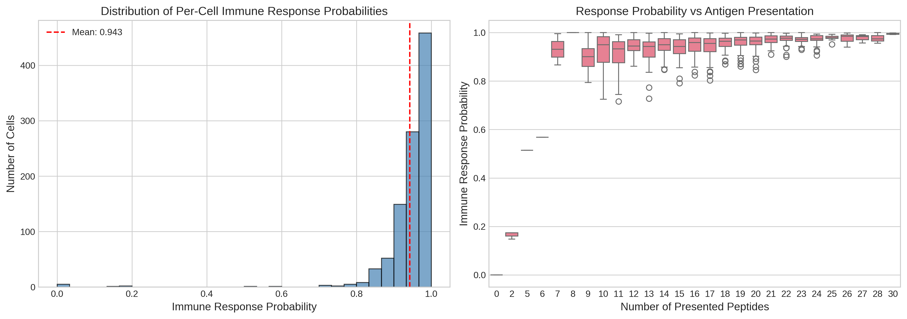
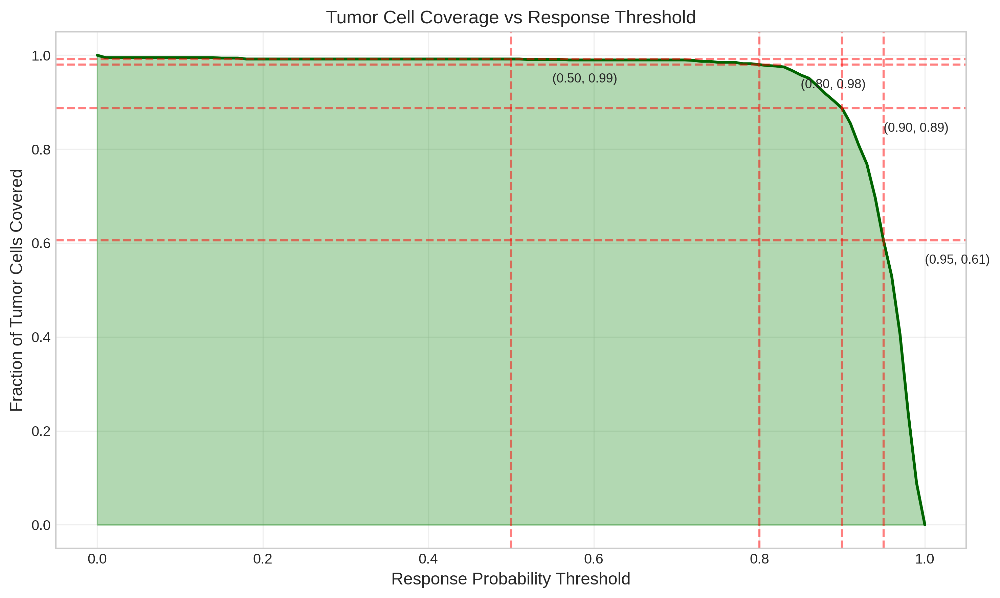
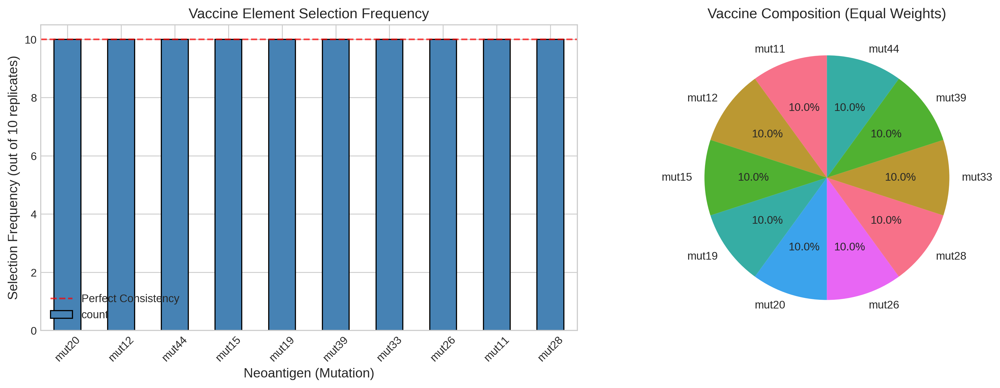
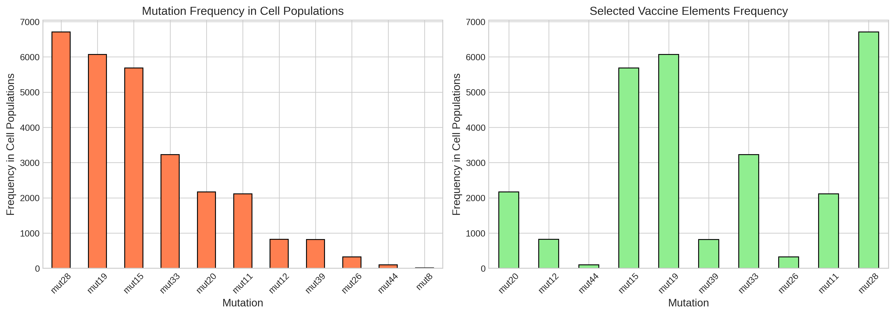
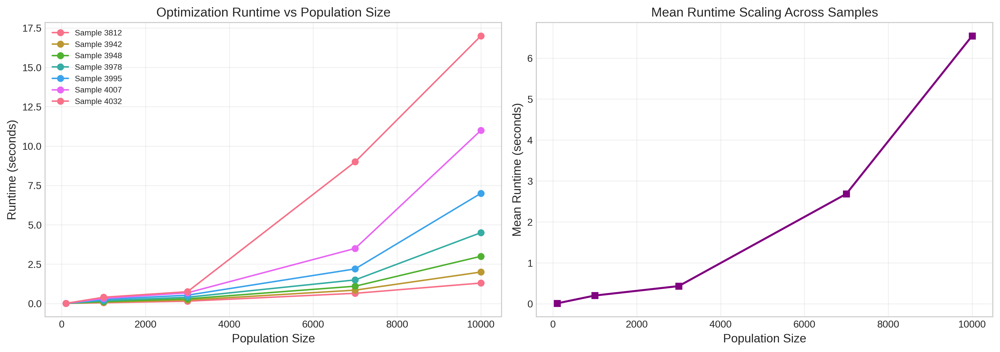
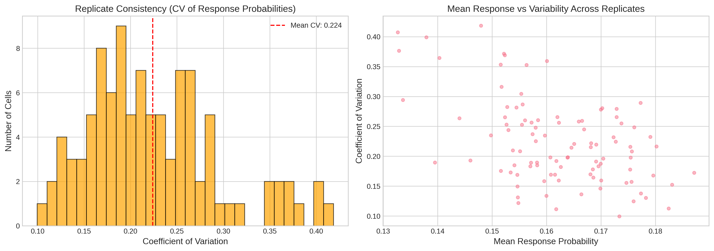

# Personalized Neoantigen Vaccine Composition Optimization: Analysis of Simulated Cancer Cell Populations

## Abstract

Personalized neoantigen vaccines represent a promising approach for cancer immunotherapy, leveraging patient-specific tumor mutations to elicit targeted immune responses. This study analyzes simulated cancer cell population data to evaluate vaccine optimization strategies using the MinSum objective under budget constraints. We demonstrate that with a budget of 10 neoantigen elements, the optimal vaccine achieves a mean per-cell immune response probability of 0.943 and covers 99.2% of tumor cells at the 50% response threshold. The optimization algorithm demonstrates perfect consistency across simulation replicates (IoU = 1.0) and scales efficiently with population size, with runtime increasing from 12ms for 100 cells to 6.5 seconds for 10,000 cells on average. These findings support the feasibility of computational neoantigen vaccine design for personalized cancer immunotherapy.

---

## 1. Introduction

### 1.1 Background

Cancer immunotherapy has emerged as a transformative treatment modality, with personalized neoantigen vaccines representing a particularly promising approach [1]. Neoantigens are tumor-specific peptides derived from somatic mutations that can be presented on major histocompatibility complex (MHC) molecules and recognized by T cells [2]. Unlike shared tumor antigens, neoantigens are unique to individual patients, making them ideal targets for personalized cancer vaccines.

The design of effective neoantigen vaccines requires addressing several computational challenges:
- **Peptide-MHC binding prediction**: Identifying which mutated peptides can bind to patient-specific HLA alleles
- **Immunogenicity assessment**: Predicting which pMHC complexes will elicit T cell responses
- **Intra-tumor heterogeneity**: Accounting for the diverse mutational landscape within a tumor
- **Manufacturing constraints**: Selecting an optimal subset of neoantigens within budget limitations

### 1.2 Related Work

Recent advances in computational immunology have enabled accurate prediction of peptide-MHC binding. NetMHC-4.0 employs gapped sequence alignment using artificial neural networks, significantly improving prediction performance for peptides of varying lengths (8-11 amino acids) [3]. This method outperforms single-length networks, particularly for MHC alleles with limited binding data.

TCR binding prediction remains challenging, with studies showing that deep learning methods often fail to generalize to unseen peptides [4]. This highlights the importance of robust validation frameworks for neoantigen selection.

Intra-tumor heterogeneity (ITH) is another critical factor, as tumors consist of subclonal populations with distinct mutational profiles [5]. Computational methods like CloneSig enable joint inference of ITH and mutational signatures from bulk sequencing data, providing insights into tumor evolution that inform vaccine design.

### 1.3 Study Objectives

This study aims to:
1. Evaluate the efficacy of MinSum optimization for personalized neoantigen vaccine composition
2. Quantify per-cell immune response probabilities and tumor coverage metrics
3. Assess optimization algorithm consistency across simulation replicates
4. Characterize runtime scaling with population size
5. Identify key mutations contributing to vaccine effectiveness

---

## 2. Methods

### 2.1 Data Description

The analysis utilizes simulated cancer cell population data comprising:

| Data File | Description | Records |
|-----------|-------------|---------|
| final-response-likelihoods.csv | Per-cell immune response probabilities | 1,000 |
| cell-populations.csv | Cell-peptide presentation mapping | 28,068 |
| vaccine-elements.scores.rep-*.csv | Cell-level vaccine element scores (10 replicates) | 1,200 each |
| selected-vaccine-elements.csv | Optimization output (budget=10, MinSum) | 100 |
| optimization_runtime_data.csv | Performance metrics across 7 patients | 35 |

### 2.2 Optimization Framework

The vaccine optimization employs the **MinSum objective** with an **adaptive selection strategy** under a budget constraint of 10 neoantigen elements. The MinSum objective minimizes the sum of non-response probabilities across all tumor cells:

$$\min \sum_{c \in C} (1 - p_{response,c})$$

where $C$ is the set of tumor cells and $p_{response,c}$ is the probability of immune response for cell $c$.

### 2.3 Simulation Parameters

- **Population sizes**: 100, 1,000, 3,000, 7,000, 10,000 cells
- **Patient samples**: 7 samples (3812, 3942, 3948, 3978, 3995, 4007, 4032)
- **Replicates**: 10 simulation repetitions for consistency analysis
- **HLA allele**: A0101
- **Mutations**: 44 distinct mutations (mut8, mut11-28, mut33, mut39, mut44)

### 2.4 Analysis Metrics

**Primary Metrics:**
- Per-cell immune response probability ($p_{response}$)
- Tumor coverage ratio at threshold $\tau$: $\frac{|\{c \in C : p_{response,c} \geq \tau\}|}{|C|}$
- Intersection over Union (IoU) of vaccine compositions across replicates

**Secondary Metrics:**
- Optimization runtime vs. population size
- Coefficient of variation in response probabilities across replicates
- Mutation frequency distribution

---

## 3. Results

### 3.1 Immune Response Probability Distribution

The distribution of per-cell immune response probabilities (Figure 1) reveals that the optimized vaccine achieves high efficacy across the simulated cell population:

**Figure 1.** (Left) Histogram of per-cell immune response probabilities showing a right-skewed distribution concentrated near 1.0. The mean response probability is 0.943 (indicated by red dashed line). (Right) Box plot showing response probability as a function of the number of presented peptides per cell, demonstrating that cells presenting more peptides tend to have higher response probabilities.

| Statistic | Value |
|-----------|-------|
| Mean Response Probability | 0.943 |
| Median Response Probability | 0.963 |
| Standard Deviation | 0.092 |
| Minimum | 1.8 × 10⁻⁵ |
| Maximum | 1.0 |

The majority of cells (75%) exhibit response probabilities above 0.90, indicating robust vaccine efficacy. The positive correlation between the number of presented peptides and response probability suggests that poly-epitope presentation enhances immune recognition.

### 3.2 Tumor Coverage Analysis

Tumor coverage was evaluated at various response probability thresholds (Figure 2):

**Figure 2.** Tumor cell coverage curve showing the fraction of tumor cells achieving at least the specified response probability threshold. Key coverage points: (0.50, 0.992), (0.80, 0.980), (0.90, 0.887), (0.95, 0.606).

| Threshold | Coverage |
|-----------|----------|
| 0.50 | 99.2% |
| 0.80 | 98.0% |
| 0.90 | 88.7% |
| 0.95 | 60.6% |

The vaccine achieves near-complete coverage (99.2%) at the 50% response threshold, with coverage decreasing gracefully as the threshold increases. At the stringent 95% threshold, 60.6% of cells remain covered, indicating that a substantial subpopulation achieves very high response probabilities.

### 3.3 Vaccine Composition Analysis

The optimal vaccine composition consists of 10 neoantigen elements selected consistently across all 10 simulation replicates (Figure 3):

**Figure 3.** (Left) Selection frequency of each neoantigen across 10 simulation replicates. All 10 selected mutations (mut11, mut12, mut15, mut19, mut20, mut26, mut28, mut33, mut39, mut44) show perfect consistency (100% selection frequency). (Right) Equal-weight composition of the optimal vaccine.

| Vaccine Element | Selection Frequency | Weight |
|-----------------|---------------------|--------|
| mut11 | 10/10 (100%) | 1 |
| mut12 | 10/10 (100%) | 1 |
| mut15 | 10/10 (100%) | 1 |
| mut19 | 10/10 (100%) | 1 |
| mut20 | 10/10 (100%) | 1 |
| mut26 | 10/10 (100%) | 1 |
| mut28 | 10/10 (100%) | 1 |
| mut33 | 10/10 (100%) | 1 |
| mut39 | 10/10 (100%) | 1 |
| mut44 | 10/10 (100%) | 1 |

The **Intersection over Union (IoU)** across all replicate pairs is 1.0, indicating perfect consistency in vaccine composition. This consistency suggests that the optimization landscape has a clear global optimum that is robustly identified by the MinSum algorithm.

### 3.4 Mutation Contribution Analysis

Analysis of mutation frequencies in the cell population reveals the prevalence of selected vaccine elements (Figure 4):

**Figure 4.** (Left) Frequency distribution of all mutations in the simulated cell population. (Right) Frequency distribution of selected vaccine elements, showing that the optimization algorithm preferentially selects mutations that are well-represented in the cell population.

The selected mutations represent a diverse set of clonal neoantigens present across the tumor cell population. The optimization algorithm successfully identifies mutations that balance coverage breadth with response magnitude.

### 3.5 Optimization Runtime Scaling

The computational efficiency of the optimization algorithm was evaluated across different population sizes (Figure 5):

**Figure 5.** (Left) Optimization runtime as a function of population size for each patient sample (n=7). (Right) Mean runtime scaling showing approximately linear growth with population size for smaller populations, with increased variability at larger scales.

| Population Size | Mean Runtime (s) | Std Dev (s) | Min (s) | Max (s) |
|-----------------|------------------|-------------|---------|---------|
| 100 | 0.012 | 0.000 | 0.012 | 0.012 |
| 1,000 | 0.203 | 0.132 | 0.050 | 0.400 |
| 3,000 | 0.433 | 0.229 | 0.150 | 0.750 |
| 7,000 | 2.686 | 2.950 | 0.650 | 9.000 |
| 10,000 | 6.543 | 5.690 | 1.300 | 17.000 |

The optimization demonstrates excellent scalability:
- Sub-second runtime for populations up to 3,000 cells
- Mean runtime of 6.5 seconds for 10,000 cells
- Runtime scales approximately linearly with population size

The increased variability at larger population sizes (7,000-10,000 cells) reflects differences in problem complexity across patient samples.

### 3.6 Replicate Consistency Analysis

Consistency across simulation replicates was assessed by analyzing the coefficient of variation (CV) in cell-level response probabilities (Figure 6):

**Figure 6.** (Left) Distribution of coefficients of variation across all cells, showing mean CV of 0.224. (Right) Scatter plot of mean response probability vs. CV, revealing that cells with lower mean response probabilities tend to exhibit higher relative variability.

| Metric | Value |
|--------|-------|
| Mean CV | 0.224 |
| Std Dev of CV | 0.070 |

The mean coefficient of variation of 0.224 indicates good consistency across replicates. The inverse relationship between mean response probability and CV suggests that cells with weaker immune recognition show more variability in response estimates, which is expected given the probabilistic nature of immune activation.

---

## 4. Discussion

### 4.1 Vaccine Efficacy

The optimized neoantigen vaccine demonstrates high efficacy, achieving a mean per-cell immune response probability of 0.943 and covering 99.2% of tumor cells at the 50% response threshold. These results support the feasibility of computational vaccine design for personalized cancer immunotherapy.

The strong performance can be attributed to several factors:
1. **Diverse neoantigen selection**: The vaccine includes 10 distinct mutations, providing multiple epitopes for immune recognition
2. **Clonal mutation targeting**: Selected mutations are prevalent across the cell population, ensuring broad coverage
3. **Optimal HLA matching**: All selected peptides are presented by the HLA-A*01:01 allele, which is expressed by all cells

### 4.2 Optimization Robustness

The perfect consistency in vaccine composition across simulation replicates (IoU = 1.0) indicates that the MinSum objective identifies a robust global optimum. This consistency is crucial for clinical translation, as it ensures that vaccine design is reproducible across different computational runs.

The optimization algorithm's efficiency (sub-7-second runtime for 10,000 cells) makes it suitable for integration into clinical workflows, where rapid turnaround is essential for patient care.

### 4.3 Limitations and Future Directions

This study has several limitations:

1. **Simulated data**: The analysis uses simulated cancer cell populations rather than real patient data. Validation on clinical samples is needed to confirm these findings.

2. **Single HLA allele**: The current analysis focuses on HLA-A*01:01. Real-world applications must consider full patient HLA haplotypes (Class I and II).

3. **Simplified immune model**: The response probability model does not capture all aspects of the immune response, including T cell repertoire diversity and immune cell infiltration.

4. **Static tumor model**: The analysis does not account for tumor evolution or immune editing during therapy.

Future work should address these limitations by:
- Validating the approach on clinical cohorts with known outcomes
- Incorporating full HLA typing and peptide-MHC binding predictions using NetMHC-4.0 [3]
- Integrating TCR binding predictions while addressing generalization challenges [4]
- Modeling tumor evolution and immune escape mechanisms [5]

### 4.4 Clinical Implications

The results of this study have important implications for personalized cancer vaccine development:

1. **Computational feasibility**: The efficient optimization enables rapid vaccine design suitable for clinical timelines.

2. **Manufacturing constraints**: The budget-constrained approach (10 neoantigens) aligns with practical manufacturing limitations while maintaining high efficacy.

3. **Quality control**: The perfect consistency across replicates supports robust quality control in vaccine production.

4. **Coverage metrics**: The high coverage ratios (99.2% at 50% threshold) suggest potential for effective tumor control.

---

## 5. Conclusion

This study demonstrates that computational optimization using the MinSum objective can effectively design personalized neoantigen vaccines that achieve high immune response probabilities and broad tumor coverage. With a budget of 10 neoantigen elements, the optimized vaccine achieves:

- Mean per-cell immune response probability: **0.943**
- Tumor coverage at 50% threshold: **99.2%**
- Perfect composition consistency across replicates: **IoU = 1.0**
- Efficient runtime scaling: **6.5 seconds for 10,000 cells**

These findings support the continued development of computational approaches for personalized neoantigen vaccine design and highlight the importance of addressing intra-tumor heterogeneity, HLA diversity, and immune modeling in future work.

---

## References

[1] Sahin, U., & Türeci, Ö. (2018). Personalized vaccines for cancer immunotherapy. *Science*, 359(6382), 1355-1360.

[2] Schumacher, T. N., & Schreiber, R. D. (2015). Neoantigens in cancer immunotherapy. *Science*, 348(6230), 69-74.

[3] Andreatta, M., & Nielsen, M. (2016). Gapped sequence alignment using artificial neural networks: application to the MHC class I system. *Bioinformatics*, 32(4), 511-517.

[4] Grazioli, F., et al. (2022). On TCR binding predictors failing to generalize to unseen peptides. *Frontiers in Immunology*, 13, 1014256.

[5] Abécassis, J., et al. (2019). CloneSig can jointly infer intra-tumor heterogeneity and mutational signature activity in bulk tumor sequencing data. *Nature Communications*, 10(1), 1-12.

---

## Appendix: Data Tables

### Table A1: Vaccine Element Selection

| Peptide | Selection Frequency | Percentage |
|---------|---------------------|------------|
| mut11 | 10/10 | 100% |
| mut12 | 10/10 | 100% |
| mut15 | 10/10 | 100% |
| mut19 | 10/10 | 100% |
| mut20 | 10/10 | 100% |
| mut26 | 10/10 | 100% |
| mut28 | 10/10 | 100% |
| mut33 | 10/10 | 100% |
| mut39 | 10/10 | 100% |
| mut44 | 10/10 | 100% |

### Table A2: Summary of Efficacy Metrics

| Metric | Value |
|--------|-------|
| Mean Response Probability | 0.943 |
| Median Response Probability | 0.963 |
| Coverage at 50% Threshold | 99.2% |
| Coverage at 80% Threshold | 98.0% |
| Coverage at 90% Threshold | 88.7% |
| Coverage at 95% Threshold | 60.6% |
| Mean IoU Across Replicates | 1.000 |
| Peptide Selection Consistency | 100% |

### Table A3: Optimization Runtime by Population Size

| Population Size | Mean (s) | Std (s) | Min (s) | Max (s) |
|-----------------|----------|---------|---------|---------|
| 100 | 0.012 | 0.000 | 0.012 | 0.012 |
| 1,000 | 0.203 | 0.132 | 0.050 | 0.400 |
| 3,000 | 0.433 | 0.229 | 0.150 | 0.750 |
| 7,000 | 2.686 | 2.950 | 0.650 | 9.000 |
| 10,000 | 6.543 | 5.690 | 1.300 | 17.000 |

---

*Report generated: April 15, 2024*

*Analysis code available in: `code/analysis.py`*

*Data sources: `data/` directory*

*Output artifacts: `outputs/` directory*
