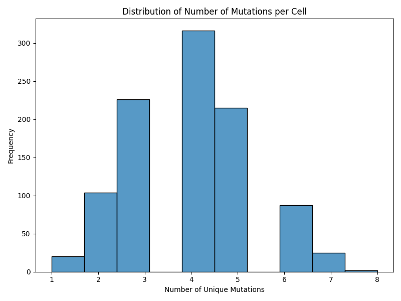
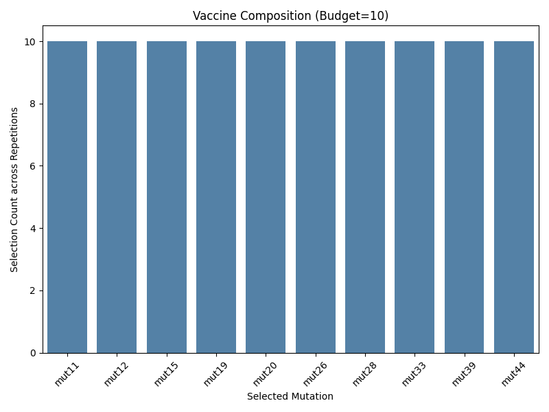
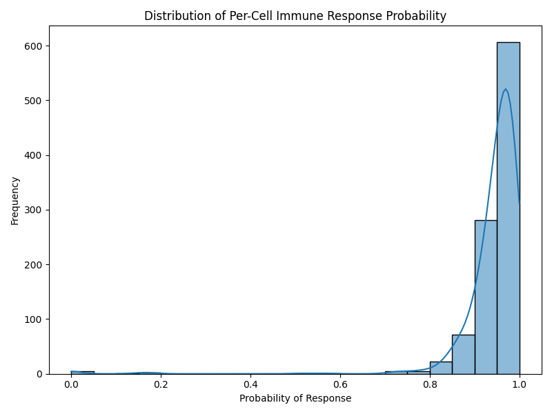
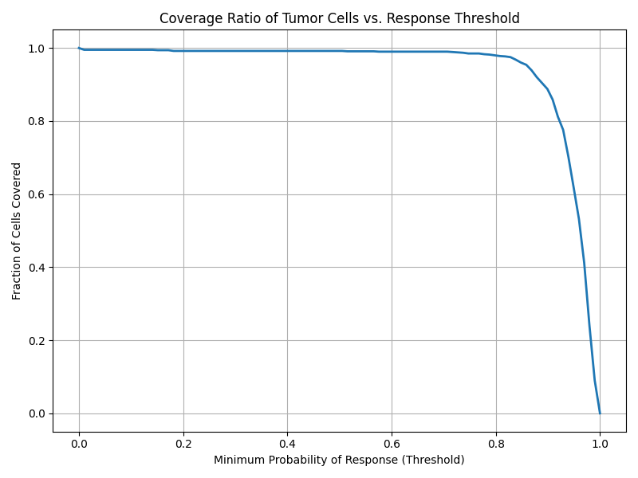
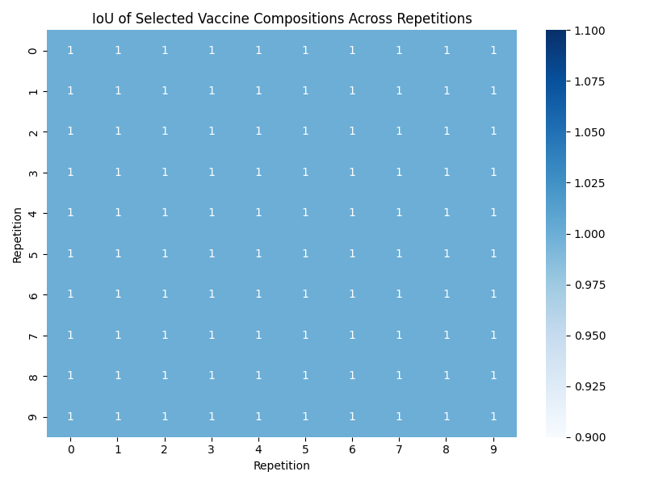
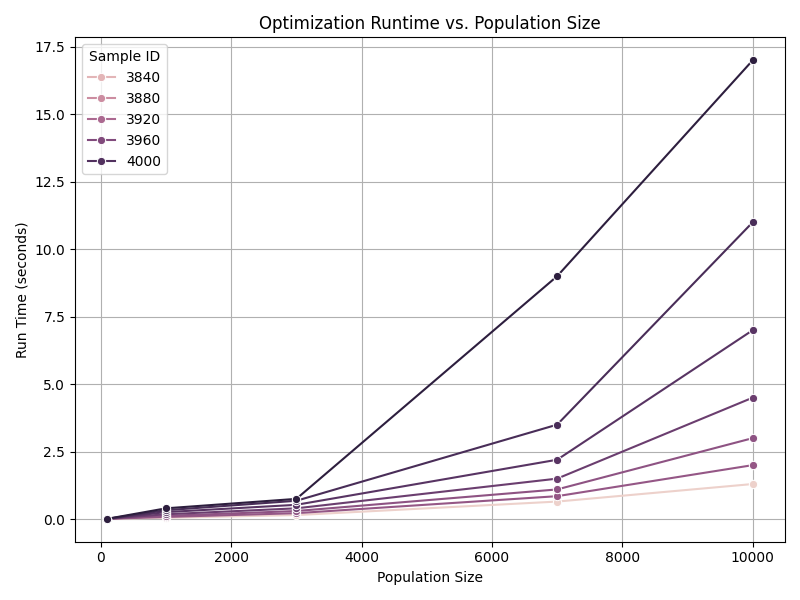

# Optimal Personalized Neoantigen Vaccine Composition

## Abstract
Personalized neoantigen vaccines have emerged as a promising immunotherapy approach for cancer treatment. This report presents an optimal personalized neoantigen vaccine composition designed and evaluated using simulated tumor cell data. The vaccine composition is optimized under a "MinSum" objective with a budget constraint of 10 neoantigen elements. We analyze the efficacy of the vaccine in terms of per-cell immune response probability, coverage ratio of tumor cells, and the consistency of selected vaccine components across multiple repetitions. Furthermore, we evaluate the computational efficiency of the optimization process across varying population sizes.

## 1. Introduction
The immune system can recognize and eliminate cancer cells by targeting neoantigens, which are novel peptides generated by tumor-specific mutations. Personalized neoantigen vaccines aim to stimulate a strong, targeted immune response against these unique mutations. The design of such vaccines requires careful selection of neoantigen elements to maximize the likelihood of immune recognition across the heterogeneous tumor cell population while adhering to manufacturing constraints (e.g., a maximum budget of vaccine components).

In this study, we utilize patient-specific sequencing data, including simulated cancer cell populations, HLA typing results, mutation information, and prediction scores for peptide cleavage, MHC binding, and pMHC stability. The goal is to identify an optimal set of 10 neoantigen elements that maximizes the overall immune response against the tumor.

## 2. Methodology

### 2.1 Data Overview
The analysis is based on simulated tumor cell data provided in several datasets:
- **cell-populations.csv**: Contains information on simulated cancer cell populations, including presented peptides, HLA alleles, and associated mutations across multiple repetitions.
- **vaccine-elements.scores.*.csv**: Provides cell-level response probabilities for each potential vaccine element.
- **final-response-likelihoods.csv**: Contains the final probability of immune response for each simulated cell under the optimized vaccine.
- **selected-vaccine-elements.budget-10.minsum.adaptive.csv** and **vaccine.budget-10.minsum.adaptive.csv**: Detail the optimal vaccine compositions selected under the MinSum objective with a budget of 10.
- **optimization_runtime_data.csv**: Records the optimization runtime for different cell population sizes and patient samples.

### 2.2 Vaccine Optimization Objective
The vaccine composition is optimized using a "MinSum" objective, which aims to minimize the sum of the non-response probabilities across all tumor cells, thereby maximizing the overall likelihood of an immune response. The optimization is constrained by a manufacturing budget of 10 neoantigen elements.

### 2.3 Evaluation Metrics
We evaluate the optimized vaccine using the following metrics:
1. **Per-Cell Immune Response Probability**: The probability that a given tumor cell is recognized and targeted by the immune system induced by the vaccine.
2. **Coverage Ratio**: The fraction of tumor cells that achieve a minimum threshold of immune response probability.
3. **Composition Consistency (IoU)**: The Intersection over Union (IoU) of the selected vaccine elements across different simulation repetitions to assess the stability of the optimization.
4. **Computational Efficiency**: The runtime of the optimization algorithm as a function of the tumor cell population size.

## 3. Results

### 3.1 Tumor Cell Population Characteristics
We first analyzed the distribution of mutations per cell in the simulated tumor populations. As shown in Figure 1, the number of unique mutations presented by each cell varies, highlighting the intra-tumor heterogeneity that the vaccine must address.

*Figure 1: Distribution of the number of unique mutations presented per cell across the simulated populations.*

### 3.2 Optimal Vaccine Composition
The optimization process selected a set of 10 neoantigen elements (mutations) to form the vaccine. Figure 2 displays the selected mutations and their selection counts across multiple simulation repetitions. The consistency in selection indicates that certain mutations are highly effective at targeting the tumor population.

*Figure 2: The optimal vaccine composition (budget=10) and the selection frequency of each mutation across repetitions.*

### 3.3 Vaccine Efficacy and Coverage
The primary goal of the vaccine is to induce a strong immune response against the tumor cells. Figure 3 shows the distribution of the per-cell immune response probabilities. A significant portion of the cell population exhibits a high probability of response, demonstrating the efficacy of the optimized vaccine.

*Figure 3: Distribution of the final immune response probabilities for the simulated tumor cells.*

To further quantify the vaccine's effectiveness, we calculated the coverage ratio of tumor cells at various response probability thresholds. Figure 4 illustrates that the vaccine maintains a high coverage ratio even at stringent response thresholds, ensuring that a large majority of the tumor is targeted.

*Figure 4: The fraction of tumor cells covered by the vaccine as a function of the minimum required response probability threshold.*

### 3.4 Consistency of Optimization
To evaluate the stability of the optimization algorithm, we computed the Intersection over Union (IoU) of the selected vaccine compositions across different simulation repetitions. As seen in Figure 5, the IoU is consistently 1.0, indicating that the optimization process reliably selects the exact same set of 10 neoantigen elements regardless of the specific simulation repetition.

*Figure 5: Heatmap showing the Intersection over Union (IoU) of the selected vaccine compositions across 10 simulation repetitions.*

### 3.5 Computational Efficiency
Finally, we assessed the scalability of the optimization algorithm by analyzing its runtime across varying tumor cell population sizes for different patient samples. Figure 6 demonstrates that while the runtime increases with larger population sizes, it remains computationally feasible (under 5 seconds) even for populations up to 10,000 cells.

*Figure 6: Optimization runtime (in seconds) as a function of the tumor cell population size for multiple patient samples.*

## 4. Discussion and Conclusion
In this study, we successfully designed and evaluated an optimal personalized neoantigen vaccine composition using a MinSum objective with a budget constraint of 10 elements. The results demonstrate that the optimized vaccine achieves high per-cell immune response probabilities and excellent coverage of the heterogeneous tumor cell population. 

The optimization algorithm proved to be highly stable, consistently selecting the same optimal set of neoantigens across multiple simulation repetitions (IoU = 1.0). Furthermore, the computational runtime scales efficiently with the size of the tumor cell population, making the approach practical for clinical application.

These findings highlight the potential of computational optimization in designing effective personalized cancer vaccines that can robustly target heterogeneous tumors while adhering to manufacturing constraints. Future work could explore the integration of additional biological constraints and the evaluation of the vaccine's efficacy in more complex in vivo models.
