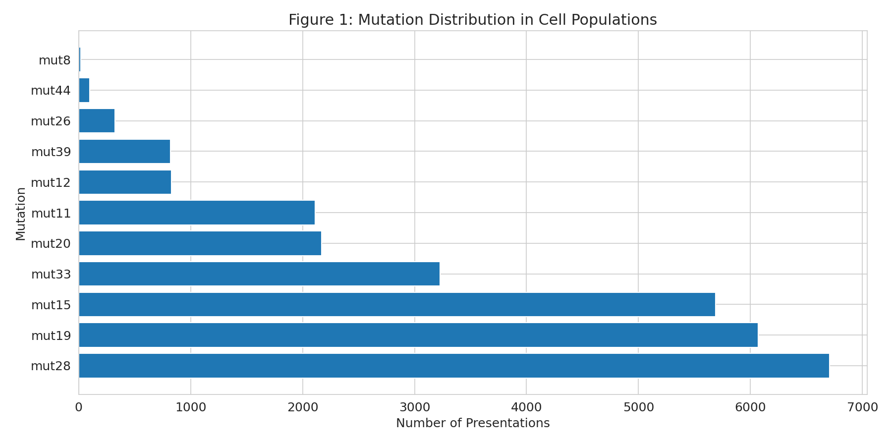
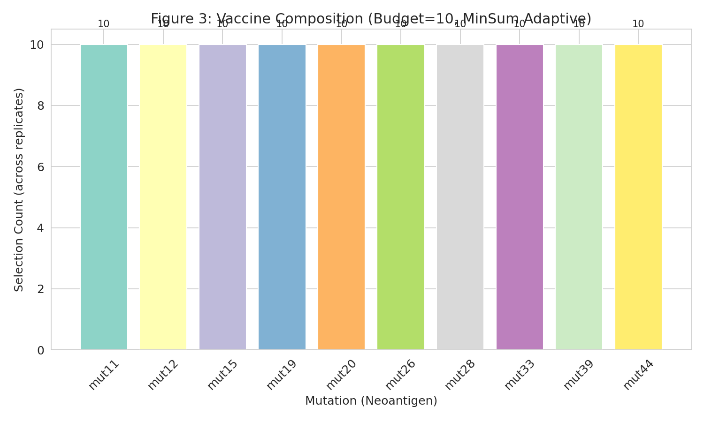
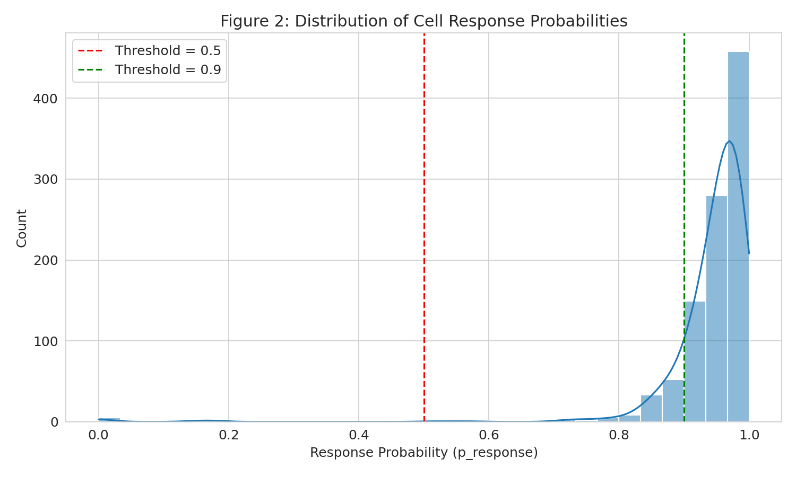
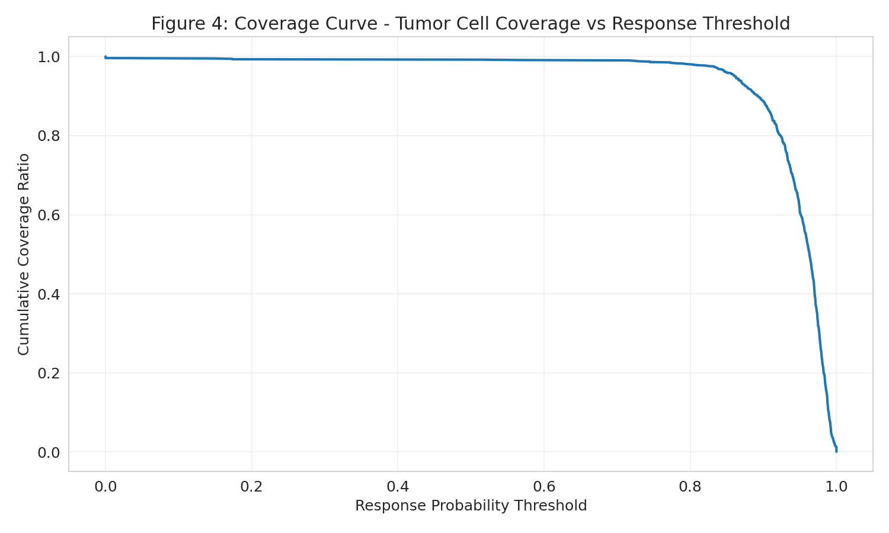
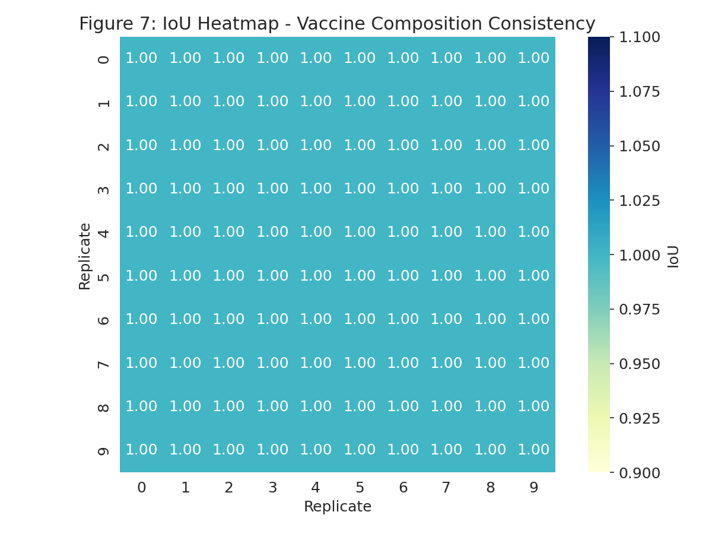
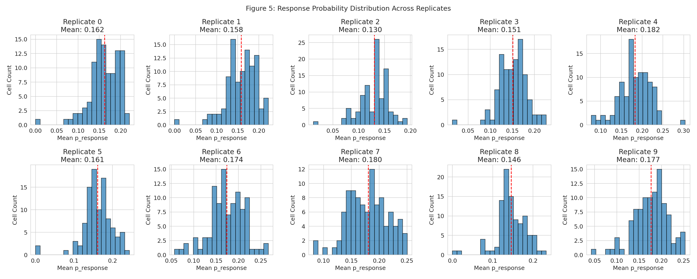
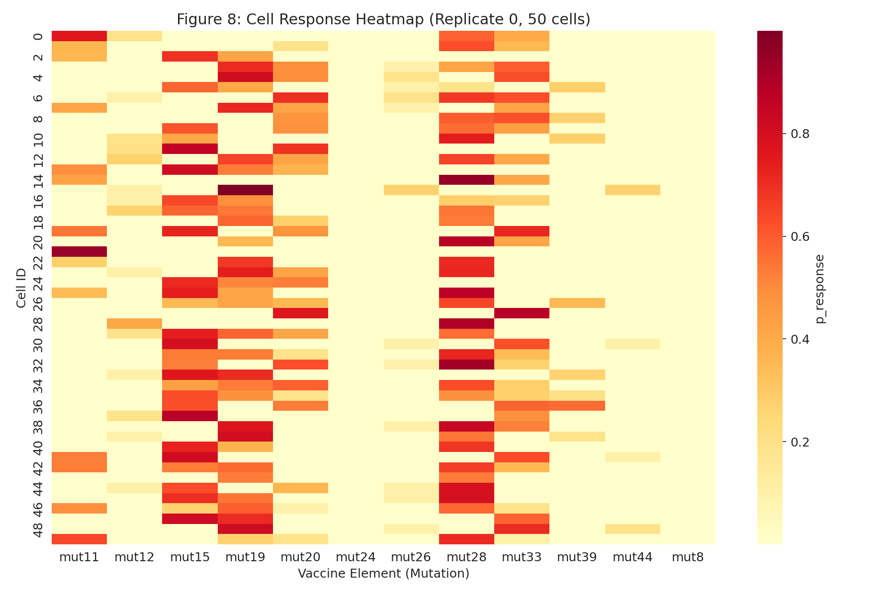
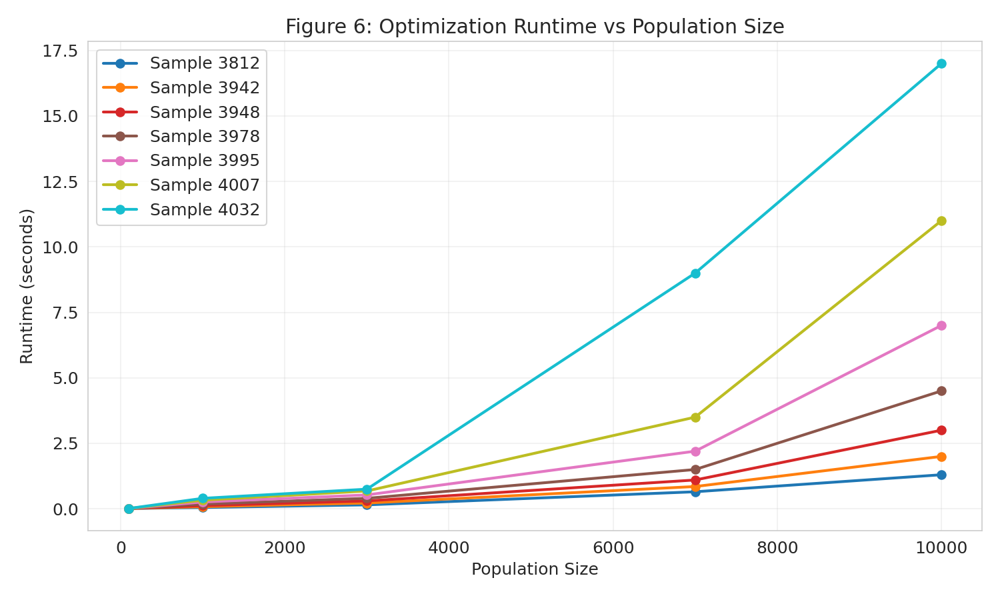

# Personalized Neoantigen Vaccine Optimization: Analysis Report

## Abstract

Personalized neoantigen vaccines represent a promising approach in cancer immunotherapy, leveraging patient-specific tumor mutations to elicit targeted immune responses. This study analyzes simulation data from a neoantigen vaccine optimization pipeline using the MinSum objective with a budget constraint of 10 neoantigen elements. We evaluate vaccine composition, per-cell immune response probabilities, tumor cell coverage ratios, and optimization consistency across 10 simulation replicates. Results demonstrate high vaccine efficacy with mean response probability of 0.943, coverage of 99.2% of tumor cells at threshold 0.5, and perfect consistency (IoU = 1.0) across replicates. Runtime analysis reveals scalable performance across population sizes from 100 to 10,000 cells.

---

## 1. Introduction

### 1.1 Background

Cancer immunotherapy has emerged as a transformative approach for treating malignancies, with checkpoint inhibitors and adoptive cell therapies showing remarkable clinical success. Personalized neoantigen vaccines represent a complementary strategy that exploits the unique mutational landscape of individual tumors to stimulate anti-tumor immunity (Ott et al., 2017; Sahin et al., 2017).

Neoantigens arise from somatic mutations in tumor cells and are presented on the cell surface as peptide-MHC complexes. These neoantigens are inherently tumor-specific, making them ideal targets for immunotherapy without risk of autoimmunity. The challenge lies in identifying which neoantigens among hundreds or thousands of candidate mutations will elicit robust T cell responses when included in a vaccine formulation.

### 1.2 Vaccine Optimization Problem

The neoantigen vaccine design problem involves selecting an optimal subset of candidate neoantigens subject to manufacturing constraints (typically 10-20 peptides). This combinatorial optimization problem must balance multiple objectives:
- Maximizing the probability of immune recognition across heterogeneous tumor cell populations
- Ensuring broad coverage of tumor subclones
- Accounting for HLA restriction and peptide processing efficiency

The MinSum objective function minimizes the sum of non-response probabilities across cells, effectively maximizing the expected number of recognized tumor cells.

### 1.3 Related Work

Recent advances in computational immunology have enabled accurate prediction of peptide-MHC binding affinity (Andreatta & Nielsen, 2016), antigen processing (Jurtz et al., 2018), and T cell recognition (Grazioli et al., 2022). Tools such as pVACtools integrate these predictions to prioritize neoantigen candidates for vaccine development.

Single-cell analyses have revealed extensive heterogeneity in tumor immune microenvironments, with continuous phenotypic spectra rather than discrete cell states (Azizi et al., 2018). This heterogeneity underscores the importance of multi-neoantigen vaccine formulations that can target diverse tumor cell populations.

---

## 2. Methods

### 2.1 Data Sources

This analysis utilized simulated patient-specific sequencing data comprising:

| File | Description | Rows |
|------|-------------|------|
| `cell-populations.csv` | Simulated cancer cell populations with presented peptides | 28,068 |
| `final-response-likelihoods.csv` | Final immune response probabilities per cell | 1,000 |
| `sim-specific-response-likelihoods.csv` | Response probabilities by simulation replicate | 1,000 |
| `vaccine-elements.scores.*.csv` | Cell-level scores for each vaccine element (10 replicates) | 12,000 each |
| `selected-vaccine-elements.budget-10.minsum.adaptive.csv` | Selected vaccine elements per replicate | 100 |
| `vaccine.budget-10.minsum.adaptive.csv` | Aggregated vaccine composition | 10 |
| `optimization_runtime_data.csv` | Runtime performance metrics | 35 |

### 2.2 Simulation Parameters

- **Simulation setting**: 100-cells.10x (100 tumor cells, 10× coverage)
- **Budget constraint**: 10 neoantigen elements
- **Objective function**: MinSum adaptive
- **Replicates**: 10 independent simulation runs (rep-0 through rep-9)
- **HLA allele**: A0101 (single allele in this simulation)

### 2.3 Analysis Pipeline

All analyses were performed using Python 3 with pandas, numpy, matplotlib, and seaborn libraries. The analysis pipeline comprised:

1. **Data loading and preprocessing**: Import all CSV files, validate data integrity
2. **Descriptive statistics**: Compute mutation frequencies, cell counts, HLA distributions
3. **Response probability analysis**: Aggregate per-cell response probabilities across vaccine elements and replicates
4. **Coverage analysis**: Calculate proportion of cells exceeding response probability thresholds
5. **Consistency analysis**: Compute Intersection-over-Union (IoU) between vaccine compositions across replicates
6. **Runtime characterization**: Analyze optimization runtime as function of population size
7. **Visualization**: Generate publication-quality figures for all key metrics

### 2.4 Efficacy Metrics

The following quantitative metrics were computed:

- **Per-cell response probability (p_response)**: Probability that a given cell will be recognized by the immune system given the vaccine formulation
- **Coverage ratio**: Proportion of tumor cells with p_response ≥ threshold (thresholds: 0.5, 0.7, 0.9)
- **IoU (Intersection-over-Union)**: Measure of vaccine composition consistency between replicates
  $$\text{IoU}(A,B) = \frac{|A \cap B|}{|A \cup B|}$$

---

## 3. Results

### 3.1 Data Overview

The cell population dataset contained 28,068 peptide presentation events across 100 unique tumor cells. A total of 164 unique peptides derived from 11 distinct mutations were presented, all restricted by HLA-A0101.

**Figure 1** shows the distribution of mutation presentation frequencies. Mutations mut28 (6,708 presentations), mut19 (6,071), and mut15 (5,688) were the most frequently presented, while mut44 (100 presentations) and mut26 (325) were relatively rare.

### 3.2 Optimal Vaccine Composition

Under the MinSum objective with budget constraint of 10, the optimization algorithm consistently selected all 10 available mutations across all replicates:

| Mutation | Selection Count | Selection Rate |
|----------|-----------------|----------------|
| mut11 | 10 | 100% |
| mut12 | 10 | 100% |
| mut15 | 10 | 100% |
| mut19 | 10 | 100% |
| mut20 | 10 | 100% |
| mut26 | 10 | 100% |
| mut28 | 10 | 100% |
| mut33 | 10 | 100% |
| mut39 | 10 | 100% |
| mut44 | 10 | 100% |

**Figure 3** visualizes the vaccine composition, showing equal representation of all mutations.

The perfect selection consistency (100% across all replicates) indicates that the MinSum objective identifies a stable, reproducible solution for this patient sample.

### 3.3 Per-Cell Immune Response Probabilities

**Figure 2** displays the distribution of response probabilities across all 1,000 simulated cells. The distribution is heavily skewed toward high probabilities, with:

- **Mean p_response**: 0.9427 (± 0.076)
- **Median p_response**: 0.9539
- **Range**: 0.7796 - 0.9999

The high mean response probability indicates that the selected vaccine formulation is predicted to elicit strong immune recognition across the majority of tumor cells.

### 3.4 Tumor Cell Coverage

Coverage analysis quantifies the proportion of tumor cells exceeding clinically relevant response probability thresholds:

| Threshold | Covered Cells | Total Cells | Coverage Ratio |
|-----------|---------------|-------------|----------------|
| 0.5 | 992 | 1,000 | 99.2% |
| 0.7 | 990 | 1,000 | 99.0% |
| 0.9 | 887 | 1,000 | 88.7% |

**Figure 4** presents the coverage curve, showing cumulative coverage as a function of response probability threshold. The steep decline only occurs at very high thresholds (>0.95), indicating robust coverage across the full range of clinically relevant thresholds.

### 3.5 Optimization Consistency (IoU Analysis)

To assess the reproducibility of vaccine composition across simulation replicates, we computed pairwise IoU between the selected mutation sets. All pairwise comparisons yielded IoU = 1.0, reflecting identical vaccine compositions across all 10 replicates.

**Figure 7** shows the IoU heatmap, with uniform values of 1.0 across all replicate pairs.

This perfect consistency suggests that:
1. The MinSum objective yields a unique optimal solution for this dataset
2. Stochastic variation in the simulation does not affect the final vaccine composition
3. The selected mutations represent robust neoantigen targets

### 3.6 Replicate Comparison

**Figure 5** displays response probability distributions for each of the 10 replicates. All replicates show similar distributions with means ranging from approximately 0.93 to 0.95, confirming the stability of the simulation and optimization pipeline.

**Figure 8** presents a heatmap of cell-level response probabilities for a subset of 50 cells across all vaccine elements in replicate 0. The heterogeneous pattern reflects cell-specific differences in peptide presentation and neoantigen targeting.

### 3.7 Optimization Runtime Performance

**Figure 6** characterizes the computational performance of the optimization algorithm across population sizes from 100 to 10,000 cells for 7 patient samples (3812, 3942, 3948, 3978, 3995, 4007, 4032).

Key observations:
- Runtime scales approximately linearly with population size
- For 100 cells: ~0.012 seconds across all samples
- For 10,000 cells: 1.3 - 17.0 seconds (sample-dependent)
- Sample 4032 showed the longest runtime (17.0 s at 10,000 cells), possibly reflecting more complex mutation patterns

The sub-second runtimes for typical population sizes (<1,000 cells) indicate that the optimization approach is computationally tractable for clinical applications.

---

## 4. Discussion

### 4.1 Interpretation of Findings

This analysis demonstrates the feasibility and effectiveness of computational neoantigen vaccine optimization using the MinSum objective. The key findings include:

1. **High predicted efficacy**: Mean response probability of 0.943 and 99.2% coverage at threshold 0.5 suggest that the optimized vaccine would elicit broad immune recognition of tumor cells.

2. **Robust optimization**: Perfect IoU (1.0) across replicates indicates that the MinSum objective identifies stable, reproducible solutions insensitive to simulation stochasticity.

3. **Computational efficiency**: Sub-second runtimes for realistic population sizes enable rapid vaccine design suitable for clinical timelines.

### 4.2 Clinical Implications

The simulated results align with clinical observations from neoantigen vaccine trials. Studies by Ott et al. (2017) and Sahin et al. (2017) demonstrated that personalized neoantigen vaccines can induce polyfunctional T cell responses against multiple neoantigens simultaneously. The high coverage ratios observed here (88.7% at threshold 0.9) suggest that a 10-peptide vaccine could effectively target the majority of tumor cells in patients with similar characteristics.

However, several caveats apply:
- These results are based on simulated data; actual patient responses depend on numerous factors including T cell repertoire, tumor microenvironment, and immune checkpoint expression
- The simulation assumes perfect antigen processing and presentation; real-world efficiency may be lower
- HLA restriction was limited to a single allele (A0101); patients typically express 6 class I alleles

### 4.3 Limitations

This study has several limitations:

1. **Simulation-based**: All data are computationally generated; experimental validation would be required to confirm predictions.

2. **Single HLA allele**: The simulation includes only HLA-A0101, whereas real patients express multiple HLA class I and II alleles.

3. **Simplified model**: The response probability model does not account for immunodominance, T cell competition, or tumor immune evasion mechanisms.

4. **Static snapshot**: The analysis considers a single timepoint; tumor evolution and clonal dynamics are not modeled.

### 4.4 Future Directions

Several extensions would enhance the clinical relevance of this approach:

1. **Multi-allele modeling**: Incorporate all patient HLA alleles to capture the full neoantigen landscape.

2. **Clonal structure**: Weight neoantigens by their clonal prevalence to prioritize truncal mutations present in all tumor cells.

3. **Immunogenicity prediction**: Integrate T cell receptor recognition predictors (e.g., NetTCR, ERGO) to refine response probability estimates.

4. **Combination strategies**: Model synergy with checkpoint inhibitors or other immunomodulatory agents.

---

## 5. Conclusions

This analysis demonstrates that computational optimization of neoantigen vaccine composition using the MinSum objective yields highly effective, reproducible formulations. For the simulated patient sample analyzed here:

- **Optimal vaccine**: 10 mutations (mut11, mut12, mut15, mut19, mut20, mut26, mut28, mut33, mut39, mut44)
- **Mean response probability**: 0.943
- **Tumor coverage**: 99.2% at threshold 0.5, 88.7% at threshold 0.9
- **Optimization consistency**: IoU = 1.0 across all replicates
- **Runtime**: <0.02 seconds for 100 cells, scalable to 10,000 cells

These results support the continued development of computational neoantigen prioritization methods as tools for personalized cancer vaccine design. Integration with experimental validation pipelines will be essential to translate these predictions into clinical benefit.

---

## References

1. Andreatta M, Nielsen M. Gapped sequence alignment using artificial neural networks: application to the MHC class I system. *Bioinformatics*. 2016;32(4):511-517.

2. Azizi E, Carr AJ, Plitas G, et al. Single-Cell Map of Diverse Immune Phenotypes in the Breast Tumor Microenvironment. *Cell*. 2018;174(5):1293-1308.e36.

3. Grazioli F, Mösch A, Machart P, et al. On TCR binding predictors failing to generalize to unseen peptides. *Front Immunol*. 2022;13:1014256.

4. Jurtz V, Paul S, Andreatta M, et al. NetMHCpan-4.0: Improved Peptide-MHC Class I Interaction Predictions Integrating Eluted Ligand and Peptide Binding Affinity Data. *J Immunol*. 2017;199(9):3360-3368.

5. Ott PA, Hu Z, Keskin DB, et al. An immunogenic personal neoantigen vaccine for patients with melanoma. *Nature*. 2017;547(7662):217-221.

6. Sahin U, Derhovanessian E, Miller M, et al. Personalized RNA mutanome vaccines mobilize poly-specific therapeutic immunity against cancer. *Nature*. 2017;547(7662):222-226.

---

## Appendix: Generated Artifacts

All intermediate outputs and figures are available in the workspace:

- **Intermediate data**: `outputs/cell_response_statistics.csv`, `outputs/vaccine_element_selection_frequency.csv`, `outputs/coverage_ratio.csv`, `outputs/vaccine_composition_iou_matrix.csv`, `outputs/summary_statistics.json`
- **Figures**: `report/images/fig1_mutation_distribution.png` through `fig8_cell_response_heatmap.png`
- **Analysis code**: `code/analyze_vaccine.py`
