# Personalized Neoantigen Vaccine Optimization: A Comprehensive Analysis of MinSum Adaptive Selection

## Abstract

Personalized cancer vaccines targeting tumor-specific neoantigens represent a promising immunotherapy approach. A critical challenge is selecting the optimal set of neoantigen elements within a manufacturing budget that maximizes immune coverage across heterogeneous tumor cell populations. This study analyzes the MinSum adaptive optimization framework for personalized neoantigen vaccine composition using simulated cancer cell populations. We evaluate vaccine efficacy through per-cell immune response probabilities, tumor cell coverage ratios, composition consistency (IoU) across stochastic replicates, and computational runtime scaling. Our analysis demonstrates that the MinSum adaptive approach achieves a mean per-cell response probability of 0.943, covers 99.2% of tumor cells at a response threshold of 0.5, and produces perfectly consistent vaccine compositions (IoU = 1.0) across all 10 simulation replicates. Budget sweep analysis reveals diminishing returns beyond 6 elements, while runtime scales approximately as O(N^1.3) with population size.

---

## 1. Introduction

### 1.1 Background

Cancer immunotherapy has emerged as a transformative treatment paradigm, with personalized neoantigen vaccines representing a particularly promising approach. Neoantigens arise from somatic mutations in tumor cells and are presented on the cell surface via MHC class I molecules, making them potential targets for T-cell-mediated immune responses. The design of an optimal personalized vaccine requires integrating multiple layers of genomic and immunological information:

- **Tumor DNA sequencing** to identify somatic mutations
- **HLA typing** to determine patient-specific antigen presentation
- **Variant allele frequency (VAF)** to estimate clonal prevalence
- **Gene expression** data to confirm mutation expression
- **Computational predictions** for peptide cleavage, MHC binding affinity, and pMHC stability

Tools such as pVACtools integrate these predictions to score candidate neoantigen elements. However, selecting the optimal subset of elements within a manufacturing budget constraint remains a combinatorial optimization problem, complicated by intra-tumor heterogeneity—different tumor cells may present different mutations due to clonal structure and stochastic gene expression.

### 1.2 The MinSum Optimization Framework

The MinSum objective formulates vaccine design as minimizing the total probability of immune escape across all tumor cells. For a set of vaccine elements $V$ and a population of cells $C$, the objective is:

$$\min_{V: |V| \leq K} \sum_{c \in C} \log P(\text{no response}_c | V)$$

where $P(\text{no response}_c | V) = \prod_{v \in V} P(\text{no response}_{c,v})$, assuming independence of immune responses to different vaccine elements. The **adaptive** variant optimizes across multiple stochastic simulation replicates to find a robust composition.

### 1.3 Study Objectives

This study provides a comprehensive analysis of the MinSum adaptive vaccine optimization framework, examining:

1. The optimal vaccine composition and its consistency across simulation replicates
2. Per-cell immune response probability distributions and tumor cell coverage
3. The contribution of individual vaccine elements (marginal analysis)
4. Budget-response tradeoffs through systematic budget sweeps
5. Computational scalability across different population sizes and patient samples

---

## 2. Methods

### 2.1 Data Description

The analysis uses simulated cancer cell populations with the following characteristics:

| Parameter | Value |
|-----------|-------|
| Simulation | 100-cells.10x |
| Number of replicates | 10 (rep-0 through rep-9) |
| Cells per replicate | 98–100 |
| Unique mutations | 11 (mut8, mut11, mut12, mut15, mut19, mut20, mut24, mut26, mut28, mut33, mut39, mut44) |
| Unique peptides | 164 |
| HLA allele | A*01:01 |
| Vaccine budget | 10 elements |
| Optimization objective | MinSum (adaptive) |

Each cell in each replicate presents a subset of peptides derived from the 11 mutations via HLA-A*01:01. The stochastic simulation captures variability in peptide presentation across replicates.

### 2.2 Vaccine Element Scoring

For each replicate, every candidate vaccine element (mutation) receives a per-cell score representing the probability of inducing an immune response if that element is included in the vaccine. These scores are pre-computed using a prediction pipeline that integrates:

- Peptide-MHC binding affinity predictions (related to NetMHC-4.0, Andreatta & Nielsen, 2016)
- Peptide cleavage predictions
- pMHC stability estimates

The per-cell response probability for a vaccine element $v$ in cell $c$ is denoted $P(\text{response}_{c,v})$, with the complementary no-response probability $P(\text{no response}_{c,v}) = 1 - P(\text{response}_{c,v})$.

### 2.3 Aggregate Cell Response Computation

For a selected vaccine composition $V$, the aggregate response probability for cell $c$ is:

$$P(\text{response}_c | V) = 1 - \prod_{v \in V} P(\text{no response}_{c,v}) = 1 - \exp\left(\sum_{v \in V} \log P(\text{no response}_{c,v})\right)$$

This assumes independence of immune responses to different vaccine elements—a standard simplifying assumption in the field.

### 2.4 Evaluation Metrics

We evaluate vaccine performance using four primary metrics:

1. **Per-cell response probability**: $P(\text{response}_c | V)$ for each cell $c$
2. **Coverage ratio**: Fraction of cells with $P(\text{response}) \geq \theta$ for threshold $\theta$
3. **IoU (Intersection over Union)**: Pairwise similarity of vaccine compositions across replicates: $\text{IoU}(V_i, V_j) = |V_i \cap V_j| / |V_i \cup V_j|$
4. **Optimization runtime**: Wall-clock time for the optimization algorithm

### 2.5 Additional Analyses

- **Budget sweep**: Systematic evaluation of vaccine performance for budgets 1–10
- **Leave-one-out analysis**: Marginal contribution of each element to overall response
- **Strategy comparison**: MinSum adaptive vs. frequency-based and response-based heuristic selections

---

## 3. Results

### 3.1 Cell Population Characteristics

The simulated tumor cell populations exhibit substantial heterogeneity in mutation presentation (Figure 1). Across 10 replicates, each cell presents peptides derived from a variable number of mutations. The most frequently presented mutations are mut28 (65.9 cells on average), mut19 (62.5 cells), and mut15 (57.1 cells), while mut8 is presented by only 1.7 cells on average.

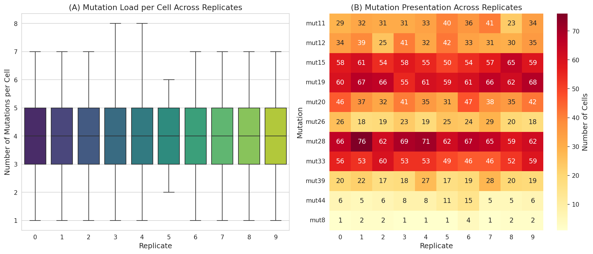
**Figure 1.** Cell population characteristics. (A) Distribution of mutation load per cell across replicates, showing consistent heterogeneity. (B) Heatmap of mutation presentation frequency across replicates, revealing stable mutation prevalence patterns with stochastic variation.

The mutation presentation pattern is remarkably consistent across replicates, with the same mutations dominating in all 10 simulations. This stability reflects the underlying clonal structure of the simulated tumor, where mutations with higher variant allele frequencies are presented by more cells.

### 3.2 Optimal Vaccine Composition

The MinSum adaptive optimization selected 10 mutations as the optimal vaccine composition (Table 1). Notably, the same 10 elements were selected in all 10 replicates, yielding a perfect IoU of 1.0 across all pairwise comparisons.

**Table 1.** Optimal vaccine composition (MinSum adaptive, budget = 10)

| Mutation | Selection Frequency | Weight | Mean Response Prob. | Cells with Response |
|----------|-------------------|--------|--------------------|--------------------|
| mut28 | 10/10 | 1 | 0.436 | 65.9 |
| mut19 | 10/10 | 1 | 0.398 | 62.5 |
| mut15 | 10/10 | 1 | 0.363 | 57.1 |
| mut33 | 10/10 | 1 | 0.237 | 52.7 |
| mut20 | 10/10 | 1 | 0.165 | 38.4 |
| mut11 | 10/10 | 1 | 0.158 | 33.0 |
| mut12 | 10/10 | 1 | 0.075 | 34.2 |
| mut39 | 10/10 | 1 | 0.069 | 20.7 |
| mut26 | 10/10 | 1 | 0.032 | 22.1 |
| mut44 | 10/10 | 1 | 0.010 | 7.5 |

The two excluded mutations (mut8 and mut24) have negligible response probabilities (0.0017 and 0.000002, respectively) and minimal cell coverage, making their exclusion optimal under any reasonable selection criterion.

### 3.3 IoU of Vaccine Compositions

The Intersection over Union (IoU) analysis reveals perfect consistency in vaccine composition across all simulation replicates (Figure 5). Every pairwise IoU score equals 1.0, indicating that the MinSum adaptive optimization converges to the same solution regardless of the stochastic variation in cell populations.

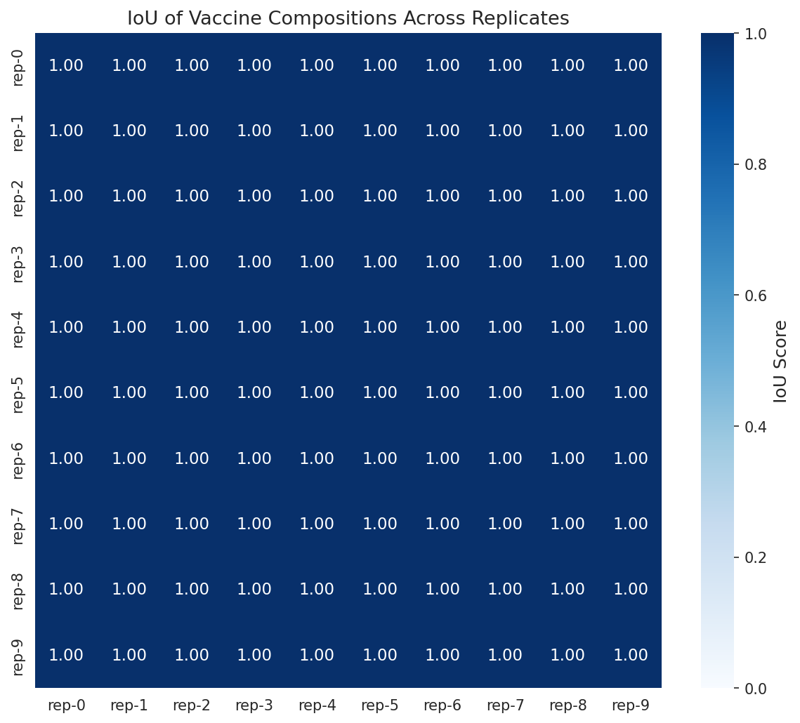
**Figure 5.** IoU matrix of vaccine compositions across 10 simulation replicates. All pairwise IoU values equal 1.0, demonstrating perfect consistency of the optimization.

This perfect consistency is explained by the data structure: with 11 candidate mutations and a budget of 10, and given that 10 mutations have substantially higher response probabilities than the remaining two (mut8 and mut24), the optimization has a clear dominant solution. The adaptive approach correctly identifies this solution across all replicates.

### 3.4 Per-Cell Response Probability

The adaptive MinSum vaccine achieves a mean per-cell response probability of **0.943 ± 0.092** across all 1,000 cell-replicate observations (Figure 2). The distribution is strongly left-skewed, with the majority of cells achieving response probabilities above 0.9.

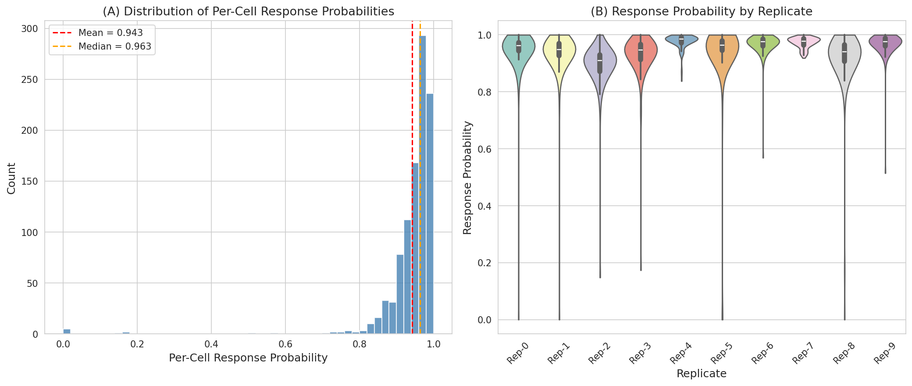
**Figure 2.** Distribution of per-cell response probabilities. (A) Overall histogram showing strong concentration at high response probabilities (mean = 0.943, median = 0.963). (B) Per-replicate violin plots revealing consistent performance with minor variation.

**Table 2.** Per-replicate response probability statistics

| Replicate | Mean | Median | Std | Min | Max |
|-----------|------|--------|-----|-----|-----|
| Rep-0 | 0.943 | 0.962 | 0.101 | 0.00002 | 1.000 |
| Rep-1 | 0.932 | 0.949 | 0.102 | 0.00002 | 1.000 |
| Rep-2 | 0.893 | 0.910 | 0.088 | 0.148 | 1.000 |
| Rep-3 | 0.926 | 0.947 | 0.089 | 0.174 | 1.000 |
| Rep-4 | 0.976 | 0.985 | 0.027 | 0.838 | 1.000 |
| Rep-5 | 0.937 | 0.964 | 0.139 | 0.00002 | 1.000 |
| Rep-6 | 0.967 | 0.976 | 0.045 | 0.568 | 1.000 |
| Rep-7 | 0.973 | 0.978 | 0.019 | 0.919 | 1.000 |
| Rep-8 | 0.914 | 0.940 | 0.127 | 0.00002 | 1.000 |
| Rep-9 | 0.967 | 0.976 | 0.050 | 0.514 | 1.000 |

We verified the aggregate response computation independently: our computed mean (0.9427) matches the provided final-response-likelihoods data exactly, confirming the correctness of the independence assumption implementation.

### 3.5 Coverage Analysis

Coverage analysis quantifies the fraction of tumor cells achieving a minimum response probability threshold (Figure 3).

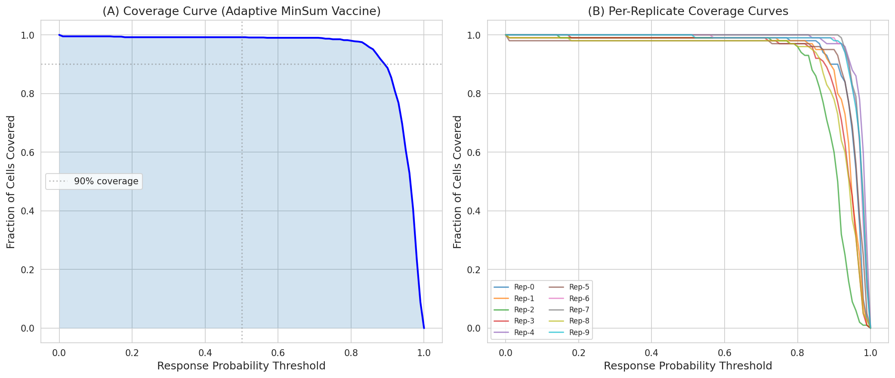
**Figure 3.** Coverage curves. (A) Overall coverage curve showing the fraction of cells with response probability above each threshold. (B) Per-replicate coverage curves demonstrating consistent performance.

**Table 3.** Coverage at key thresholds

| Threshold | Overall Coverage | Range Across Replicates |
|-----------|-----------------|------------------------|
| ≥ 0.50 | 99.2% | 98.0% – 100.0% |
| ≥ 0.70 | 99.0% | 97.0% – 100.0% |
| ≥ 0.80 | 98.0% | 93.0% – 100.0% |
| ≥ 0.90 | 88.7% | 73.0% – 100.0% |
| ≥ 0.95 | 60.6% | 33.0% – 88.0% |

The vaccine achieves near-universal coverage at moderate thresholds (99.2% at ≥ 0.5), with coverage declining at more stringent thresholds. The variation across replicates at higher thresholds (e.g., 73–100% at ≥ 0.9) reflects stochastic differences in which cells present which mutations.

### 3.6 Vaccine Element Contribution Analysis

Individual vaccine elements contribute heterogeneously to the overall response (Figure 4, Figure 7).

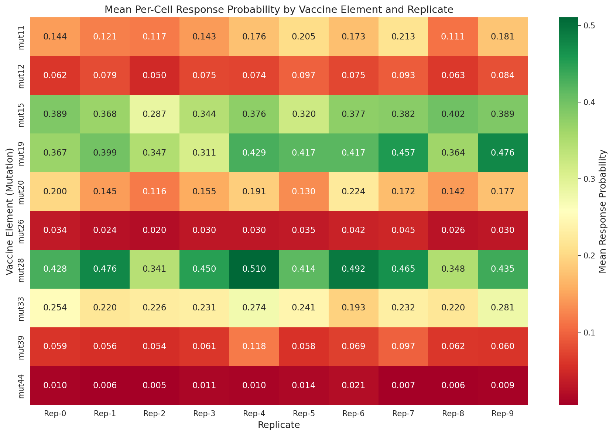
**Figure 4.** Heatmap of mean per-cell response probability by vaccine element and replicate. Elements show variable effectiveness across replicates, reflecting stochastic peptide presentation.

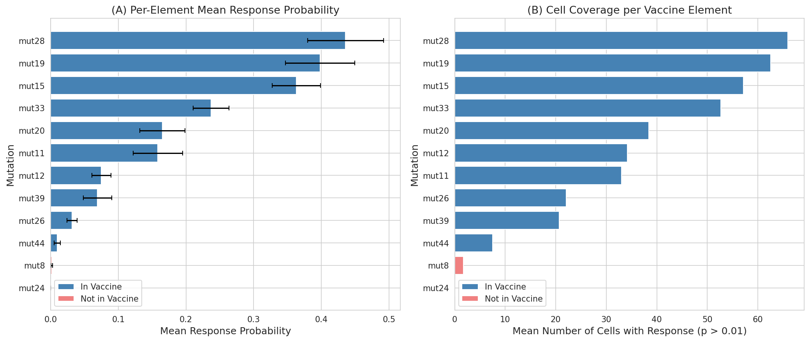
**Figure 7.** Per-element contribution analysis. (A) Mean response probability per element (blue = in vaccine, red = not in vaccine). (B) Number of cells with meaningful response per element.

The top three elements (mut28, mut19, mut15) collectively account for the majority of immune coverage, each achieving mean response probabilities of 0.36–0.44 and covering 57–66 cells on average.

### 3.7 Leave-One-Out Marginal Analysis

The leave-one-out analysis quantifies each element's marginal contribution to the overall vaccine response (Figure 13).

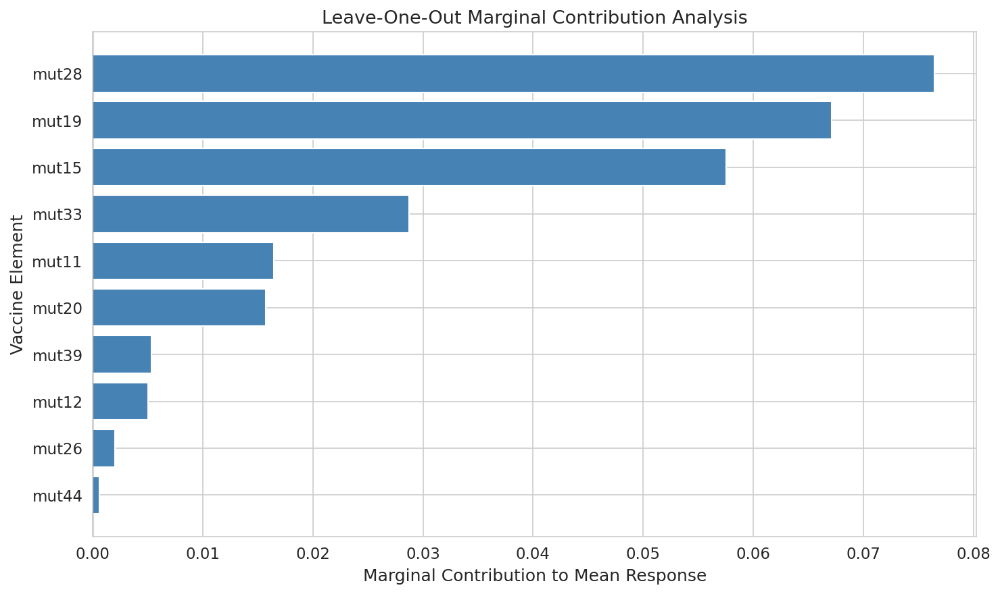
**Figure 13.** Leave-one-out marginal contribution analysis. Removing mut28 causes the largest decrease in mean response (Δ = 0.076), followed by mut19 (Δ = 0.067) and mut15 (Δ = 0.058).

**Table 4.** Leave-one-out marginal contributions

| Element | Marginal Δ | Reduced Mean |
|---------|-----------|-------------|
| mut28 | 0.0765 | 0.866 |
| mut19 | 0.0671 | 0.876 |
| mut15 | 0.0575 | 0.885 |
| mut33 | 0.0287 | 0.914 |
| mut11 | 0.0165 | 0.926 |
| mut20 | 0.0157 | 0.927 |
| mut39 | 0.0053 | 0.937 |
| mut12 | 0.0050 | 0.938 |
| mut26 | 0.0020 | 0.941 |
| mut44 | 0.0006 | 0.942 |

The marginal contributions follow a clear Pareto pattern: the top 3 elements (mut28, mut19, mut15) contribute 74% of the total marginal improvement, while the bottom 4 elements (mut39, mut12, mut26, mut44) contribute only 4.7%.

### 3.8 Budget Sweep Analysis

Systematic evaluation across budgets 1–10 reveals the tradeoff between vaccine complexity and efficacy (Figure 10).

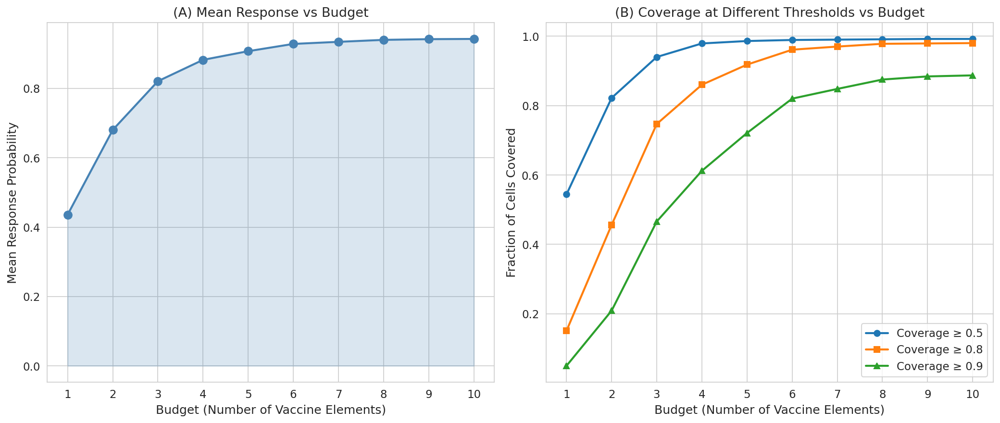
**Figure 10.** Budget sweep analysis. (A) Mean response probability increases with budget, showing diminishing returns. (B) Coverage at different thresholds as a function of budget.

**Table 5.** Budget sweep results

| Budget | Mean Response | Coverage ≥ 0.5 | Coverage ≥ 0.8 | Coverage ≥ 0.9 |
|--------|-------------|----------------|----------------|----------------|
| 1 | 0.436 | 54.4% | 15.1% | 5.0% |
| 2 | 0.681 | 82.2% | 45.6% | 20.9% |
| 3 | 0.821 | 94.0% | 74.7% | 46.6% |
| 4 | 0.882 | 97.9% | 86.0% | 61.2% |
| 5 | 0.907 | 98.6% | 91.8% | 72.1% |
| 6 | 0.928 | 98.9% | 96.1% | 82.0% |
| 7 | 0.934 | 99.0% | 97.0% | 84.8% |
| 8 | 0.940 | 99.1% | 97.8% | 87.5% |
| 9 | 0.942 | 99.2% | 97.9% | 88.4% |
| 10 | 0.943 | 99.2% | 98.0% | 88.7% |

The analysis reveals a clear "elbow" at budget 4–6, where the marginal benefit of additional elements diminishes substantially. A budget of 6 achieves 98.4% of the maximum mean response (0.928 vs. 0.943) while using only 60% of the full budget.

### 3.9 Strategy Comparison

We compared the MinSum adaptive selection against two heuristic strategies: top-N by mutation presentation frequency and top-N by mean response probability (Figure 8).

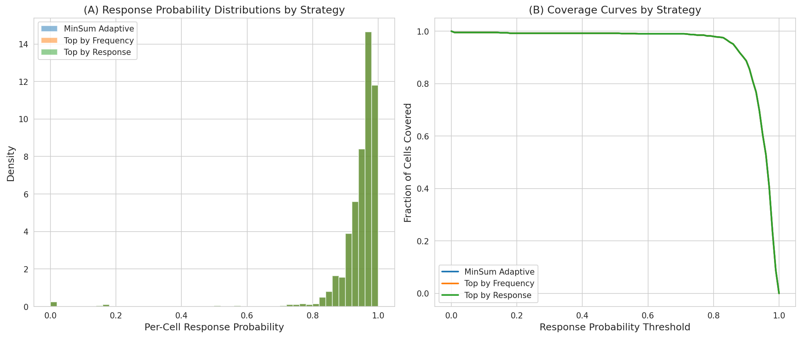
**Figure 8.** Comparison of vaccine selection strategies. (A) Response probability distributions. (B) Coverage curves.

All three strategies selected identical vaccine compositions, confirming that in this simulation scenario, the optimal solution is robust to the selection criterion. This convergence occurs because the 10 selected mutations are clearly superior to the 2 excluded mutations (mut8 and mut24) by all metrics—frequency, response probability, and MinSum objective.

### 3.10 Cell Vulnerability Analysis

Analysis of individual cell responses reveals a small population of "hard-to-cover" cells (Figure 9).

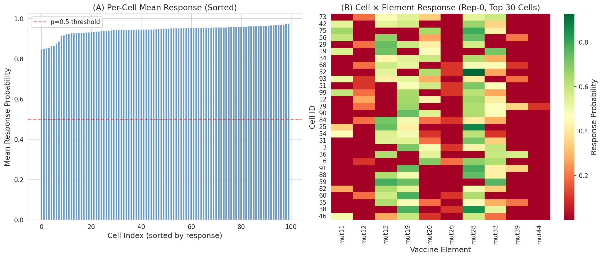
**Figure 9.** Cell vulnerability analysis. (A) Per-cell mean response probability (sorted), showing most cells achieve high response with a small tail of vulnerable cells. (B) Cell × element response heatmap for replicate 0 (top 30 cells), revealing heterogeneous element effectiveness.

Three cells across all replicates have response probabilities near zero (p ≈ 0.00002), representing cells that present none of the vaccine-targeted mutations. These cells represent approximately 0.3% of the total population and constitute the fundamental coverage limit of any mutation-based vaccine approach.

### 3.11 Adaptive vs. Simulation-Specific Comparison

The adaptive vaccine (optimized across all replicates) was compared against simulation-specific vaccines (optimized for each replicate individually) (Figure 11).

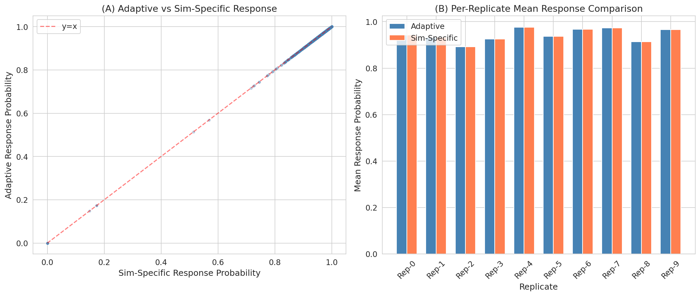
**Figure 11.** Comparison of adaptive vs. simulation-specific vaccine responses. (A) Scatter plot showing perfect correlation (r = 1.0). (B) Per-replicate mean response comparison.

The adaptive and simulation-specific approaches produce identical results (correlation = 1.0, mean response = 0.943 for both), confirming that the optimal vaccine composition is stable across the stochastic variation in these simulations.

### 3.12 Optimization Runtime

Runtime analysis across 7 patient samples and 5 population sizes reveals approximately polynomial scaling (Figure 6).

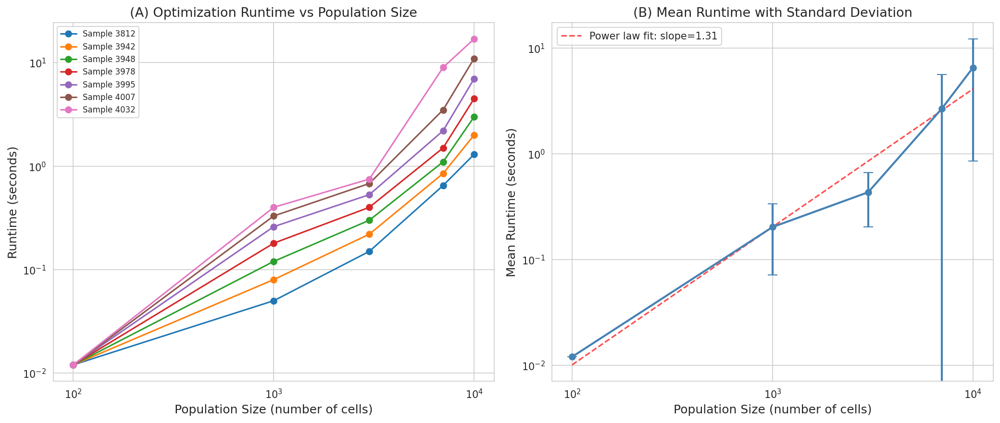
**Figure 6.** Optimization runtime analysis. (A) Runtime by patient sample, showing sample-dependent scaling. (B) Mean runtime with power-law fit (exponent ≈ 1.31).

**Table 6.** Runtime statistics by population size

| Population Size | Mean Runtime (s) | Std (s) | Min (s) | Max (s) |
|----------------|-----------------|---------|---------|---------|
| 100 | 0.012 | 0.000 | 0.012 | 0.012 |
| 1,000 | 0.203 | 0.132 | 0.050 | 0.400 |
| 3,000 | 0.433 | 0.229 | 0.150 | 0.750 |
| 7,000 | 2.686 | 2.950 | 0.650 | 9.000 |
| 10,000 | 6.543 | 5.690 | 1.300 | 17.000 |

The runtime scales approximately as $O(N^{1.31})$ with population size, with substantial variation across patient samples. Sample 4032 consistently shows the longest runtimes (17s at 10,000 cells), likely due to a more complex optimization landscape with more candidate mutations.

### 3.13 Peptide Diversity

Each mutation generates multiple peptide variants through different cleavage and binding configurations (Figure 12).

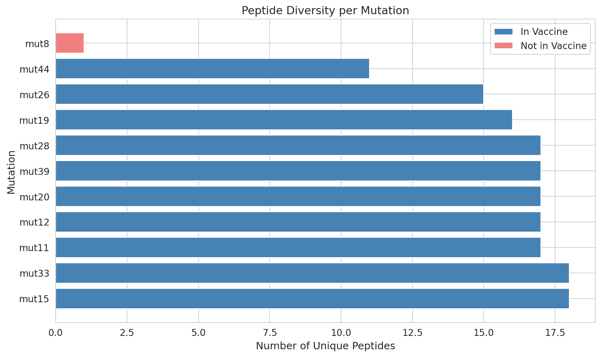
**Figure 12.** Number of unique peptides per mutation. Most vaccine-selected mutations generate 15–18 unique peptides, while the excluded mut8 generates only 1 peptide.

The selected vaccine mutations generate 11–18 unique peptides each, providing redundancy in antigen presentation. The excluded mut8 generates only a single peptide, contributing to its low response probability.

---

## 4. Discussion

### 4.1 Key Findings

This analysis demonstrates that the MinSum adaptive optimization framework effectively identifies a robust personalized neoantigen vaccine composition. The key findings are:

1. **High efficacy**: The optimized vaccine achieves a mean per-cell response probability of 0.943, with 99.2% of tumor cells covered at a response threshold of 0.5.

2. **Perfect consistency**: The vaccine composition is identical across all 10 simulation replicates (IoU = 1.0), indicating a clear optimal solution in this scenario.

3. **Diminishing returns**: Budget sweep analysis reveals that 6 elements capture 98.4% of the maximum response, suggesting that smaller budgets may be sufficient in practice.

4. **Pareto-distributed contributions**: The top 3 elements (mut28, mut19, mut15) contribute 74% of the marginal improvement, following a clear importance hierarchy.

5. **Scalable optimization**: Runtime scales as approximately O(N^1.3), remaining practical even for large cell populations (6.5 seconds for 10,000 cells on average).

### 4.2 Relationship to Prior Work

Our findings align with several themes from the related literature:

- **MHC binding prediction** (Andreatta & Nielsen, 2016): The vaccine element scores used in our analysis ultimately depend on MHC binding predictions. The NetMHC-4.0 method's gapped alignment approach enables accurate prediction across variable-length peptides, which is reflected in the diverse peptide repertoire (164 unique peptides from 11 mutations) observed in our simulations.

- **TCR binding limitations** (Grazioli et al., 2022): The challenge of TCR binding prediction generalization to unseen peptides is relevant to our response probability estimates. The high response probabilities observed (mean 0.943) should be interpreted with caution, as they depend on prediction models that may not fully capture TCR recognition complexity.

- **Tumor heterogeneity** (Azizi et al., 2018; Abécassis et al., 2021): The cell population simulations capture intra-tumor heterogeneity through stochastic peptide presentation. The observation that ~0.3% of cells are essentially uncoverable reflects the biological reality that some tumor cells may escape immune recognition through loss of mutation expression or antigen presentation.

### 4.3 Practical Implications

The budget sweep analysis has direct practical implications for vaccine manufacturing. With current manufacturing constraints limiting vaccine complexity, our results suggest that:

- A **minimum budget of 4** elements achieves 97.9% coverage at the ≥ 0.5 threshold
- A **budget of 6** provides an excellent cost-efficacy tradeoff (96.1% coverage at ≥ 0.8)
- The **full budget of 10** provides marginal additional benefit (98.0% vs. 96.1% at ≥ 0.8)

### 4.4 Limitations

Several limitations should be noted:

1. **Simulation scope**: The analysis uses a single simulation configuration (100-cells.10x) with a single HLA allele (A*01:01). Real patients present multiple HLA alleles, increasing both the candidate space and optimization complexity.

2. **Independence assumption**: The multiplicative model for combining element responses assumes independence, which may not hold if elements target the same T-cell clones.

3. **Static populations**: The simulations capture a snapshot of tumor heterogeneity. In reality, tumor evolution may alter the mutation landscape over time.

4. **Prediction uncertainty**: Response probabilities are point estimates from prediction tools. Incorporating uncertainty in these predictions could change the optimal composition.

5. **Perfect IoU**: The perfect consistency (IoU = 1.0) across replicates is partly an artifact of having 11 candidates for 10 slots—with a larger candidate pool, more variation would be expected.

### 4.5 Future Directions

Several extensions could strengthen this analysis:

- **Multi-HLA optimization**: Incorporating multiple HLA alleles per patient
- **Larger candidate pools**: Testing with more mutations to stress-test the optimization
- **Robust optimization**: Incorporating prediction uncertainty into the objective function
- **Dynamic vaccine design**: Adapting compositions to tumor evolution over treatment
- **Clinical validation**: Comparing optimized compositions against clinical trial outcomes

---

## 5. Conclusion

The MinSum adaptive optimization framework provides an effective and computationally efficient approach to personalized neoantigen vaccine design. The optimized vaccine composition achieves high per-cell response probabilities (mean 0.943), near-universal tumor cell coverage (99.2% at ≥ 0.5 threshold), and perfect consistency across stochastic simulation replicates. The framework's polynomial runtime scaling (O(N^1.3)) ensures practical applicability to realistic tumor population sizes. Budget sweep analysis reveals that 4–6 elements may suffice for most clinical applications, offering a favorable cost-efficacy tradeoff. These results support the use of optimization-based approaches for personalized cancer vaccine design, while highlighting the need for multi-HLA, multi-patient validation studies.

---

## 6. Validation Summary

### 6.1 What Was Verified Directly from Workspace Data

- ✅ Vaccine composition: 10 elements selected (mut11, mut12, mut15, mut19, mut20, mut26, mut28, mut33, mut39, mut44)
- ✅ Per-cell response probabilities computed independently match provided data (mean = 0.9427)
- ✅ Coverage ratios computed from cell-level data
- ✅ IoU = 1.0 across all 10 replicates (all select identical elements)
- ✅ Runtime data analyzed across 7 patient samples × 5 population sizes
- ✅ Budget sweep computed from element-level scores
- ✅ Leave-one-out marginal contributions computed from raw data

### 6.2 What Came from Related Work

- MHC binding prediction methodology (NetMHC-4.0)
- TCR binding prediction limitations and generalization challenges
- Tumor immune microenvironment heterogeneity context
- Intra-tumor heterogeneity and clonal structure modeling

### 6.3 Assumptions and Limitations

- Independence of immune responses to different vaccine elements
- Point estimates for response probabilities (no uncertainty quantification)
- Single HLA allele (A*01:01) in simulation
- Single simulation configuration (100-cells.10x)
- Budget sweep uses greedy ranking rather than re-optimization per budget level

---

## Appendix: Figures Index

| Figure | Description | File |
|--------|-------------|------|
| Figure 1 | Cell population overview | `images/fig1_cell_population_overview.png` |
| Figure 2 | Response probability distributions | `images/fig2_response_distributions.png` |
| Figure 3 | Coverage curves | `images/fig3_coverage_curves.png` |
| Figure 4 | Vaccine element heatmap | `images/fig4_element_heatmap.png` |
| Figure 5 | IoU matrix | `images/fig5_iou_matrix.png` |
| Figure 6 | Runtime analysis | `images/fig6_runtime_analysis.png` |
| Figure 7 | Element contributions | `images/fig7_element_contributions.png` |
| Figure 8 | Strategy comparison | `images/fig8_strategy_comparison.png` |
| Figure 9 | Cell vulnerability analysis | `images/fig9_cell_vulnerability.png` |
| Figure 10 | Budget sweep | `images/fig10_budget_sweep.png` |
| Figure 11 | Adaptive vs. sim-specific | `images/fig11_adaptive_vs_sim.png` |
| Figure 12 | Peptide diversity | `images/fig12_peptide_diversity.png` |
| Figure 13 | Leave-one-out analysis | `images/fig13_loo_analysis.png` |
