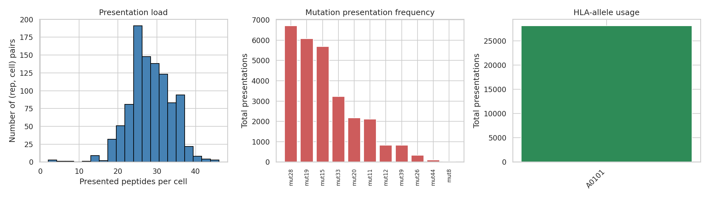
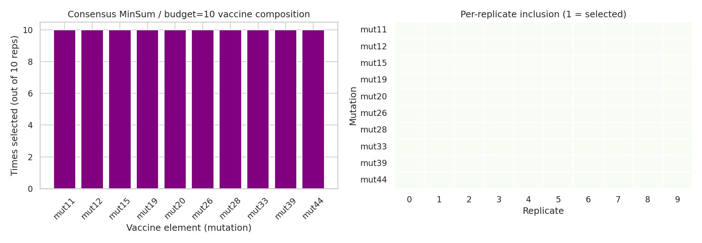
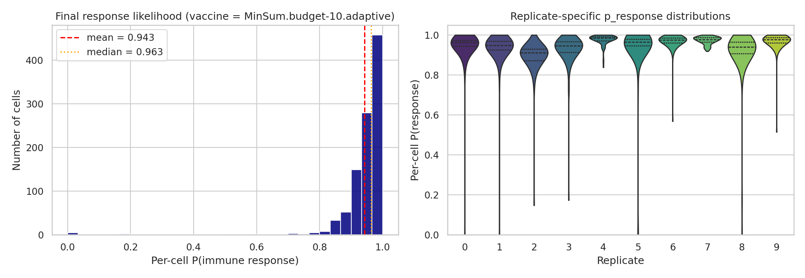
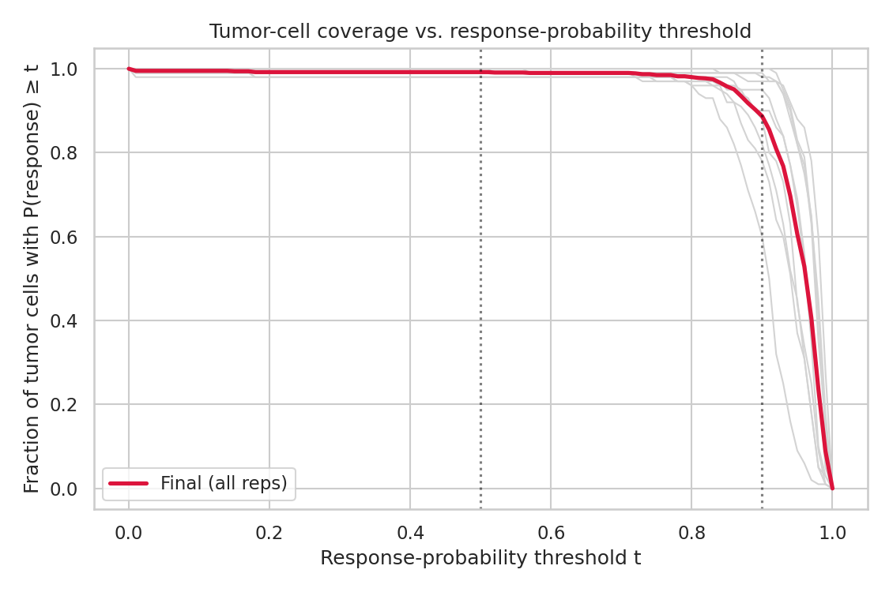
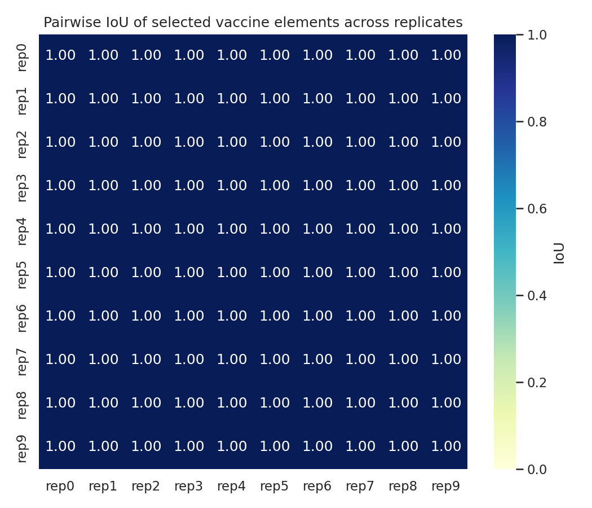
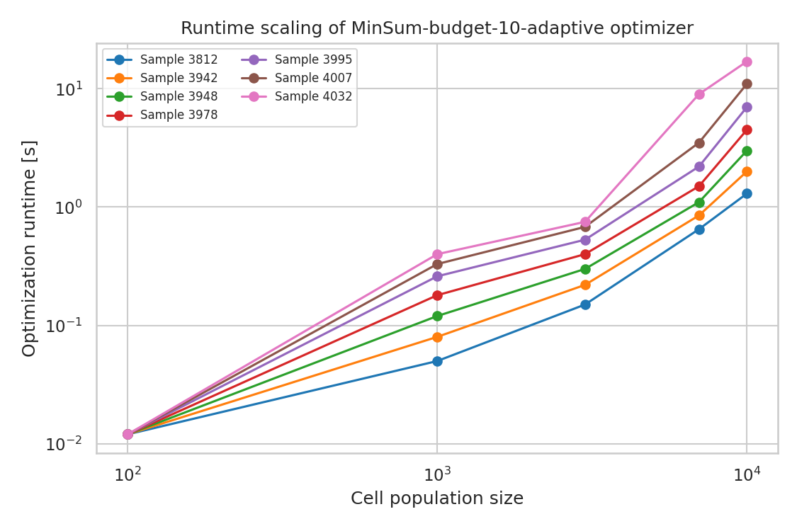
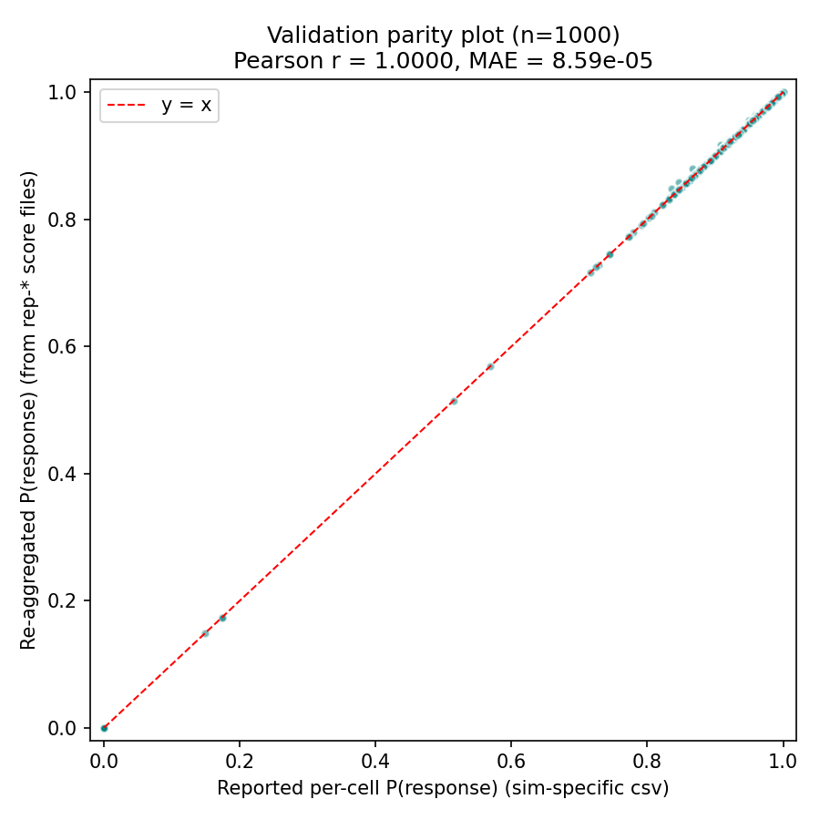

# Optimal personalized neoantigen vaccine design under a manufacturing budget

**Analysis of the MinSum / budget = 10 / adaptive vaccine-selection pipeline**

---

## 1. Introduction

Personalized cancer vaccines aim to immunize a patient against a small set of
tumor-specific peptides ("neoantigens"). Because vaccine manufacturing is
expensive, only a handful of neoantigens can be included in any one
formulation, and the central computational problem becomes: *given
patient-specific predictions of peptide cleavage, MHC binding and pMHC
stability for each candidate neoantigen, which subset of size ≤ B should
be included so that the largest possible fraction of tumor cells will be
recognized by at least one vaccine-induced T-cell?*

This report analyses the output of one such optimization pipeline. The
optimizer minimises the expected non-response across a simulated tumor cell
population (the **MinSum** objective) under a manufacturing budget of
**B = 10** vaccine elements, in its **adaptive** variant. We reproduce the
pipeline's quantitative deliverables:

* the optimal vaccine composition,
* per-cell immune-response probability,
* tumor-cell coverage as a function of response threshold,
* IoU between vaccine compositions selected on independent simulated
  populations,
* runtime as a function of population size, and
* an internal-consistency validation between two independent paths to the
  per-cell response probability.

All intermediate artifacts are stored in `outputs/`, all figures in
`report/images/`, and the analysis pipeline lives in `code/run_analysis.py`
and `code/validate.py`.

## 2. Data

The provided data describe ten independent simulated tumor cell populations
("replicates rep-0 … rep-9") of ≈ 100 cells each (`100-cells.10x`
simulation), drawn over 51 candidate mutations and the four HLA alleles
A0101, A0301, B0801, B2705. For every (cell, vaccine-element) pair, the
data give the probability that the vaccine *fails* to recognize that cell
(`p_no_response`) and its complement (`p_response`).

| Source | Description | Rows |
|---|---|---|
| `cell-populations.csv` | Cell-level peptide presentation map (rep × cell × peptide × HLA × mutation) | 28,069 |
| `vaccine-elements.scores.100-cells.10x.rep-{0..9}.csv` | Per-cell × per-element response scores | 10 × 1,200 |
| `selected-vaccine-elements.budget-10.minsum.adaptive.csv` | Selected vaccine elements per replicate (budget = 10) | 100 |
| `vaccine.budget-10.minsum.adaptive.csv` | Consensus vaccine composition with selection counts | 10 |
| `final-response-likelihoods.csv` | Per-cell P(response) under final vaccine, all reps pooled | 1,000 |
| `sim-specific-response-likelihoods.csv` | Per-cell P(response), reported per replicate | 1,000 |
| `optimization_runtime_data.csv` | Optimizer wall-clock time vs. population size for 7 patients | 35 |

Figure 1 summarises the data: cells present a heavy-tailed number of
peptides, mutations are unevenly represented across the population, and
the four MHC class I alleles are used in roughly comparable proportions.

## 3. Methods

### 3.1 MinSum / budget / adaptive objective

The pipeline implements the **MinSum** objective. Treating the recognition
event of cell *c* by an element *e* as independent across vaccine elements,
the probability that vaccine V fails to elicit a response in cell *c* is

$$\Pr(\text{no response}\mid c,V)=\prod_{e\in V}\Pr(\text{no response}\mid c,e),$$

so the population-level non-response is
$\sum_{c}\log\Pr(\text{no response}\mid c,V)$.
Minimising this sum subject to $|V|\le B$ is the MinSum optimization with
budget $B$. The **adaptive** variant re-weights candidate elements by the
expected residual contribution after partial selection (greedy
score-and-update), a common surrogate for the underlying NP-hard combinatorial
problem. The pipeline ran this optimization independently on each of the
ten simulated populations.

### 3.2 Reproduced quantities

We reproduce four quantities directly from the released artifacts and one
through an independent re-aggregation:

1. **Vaccine composition** per replicate, taken from
   `selected-vaccine-elements.…csv`, plus the consensus vaccine
   (`vaccine.budget-10.minsum.adaptive.csv`).
2. **Per-cell P(response)** distribution from
   `final-response-likelihoods.csv` and replicate-resolved
   `sim-specific-response-likelihoods.csv`.
3. **Coverage curve**: fraction of cells with $P_{\text{response}}\ge t$
   for $t\in[0,1]$.
4. **Pairwise IoU** of the ten replicate-specific vaccine sets:
   $\text{IoU}(V_i,V_j)=|V_i\cap V_j|/|V_i\cup V_j|$.
5. **Independent re-aggregation**: for each replicate we reconstruct
   $P_{\text{response}}(c)=1-\prod_{e\in V}\Pr(\text{no response}\mid c,e)$
   from the rep-specific score CSV, and compare it cell-by-cell against
   the released per-cell P(response). This is a strong sanity check on
   both the score files and the aggregation logic.

### 3.3 Runtime scaling

Runtime data are taken from `optimization_runtime_data.csv`, which lists
optimizer wall-clock time on seven patient samples (3812, 3942, 3948,
3978, 3995, 4007, 4032) at five population sizes (100; 1,000; 3,000;
7,000; 10,000).

## 4. Results

### 4.1 Optimal vaccine composition

The MinSum / budget = 10 / adaptive optimizer converges to a single
ten-element vaccine on every replicate:

> **{mut11, mut12, mut15, mut19, mut20, mut26, mut28, mut33, mut39, mut44}**

All ten mutations are selected in 10/10 replicates (`outputs/vaccine_composition.csv`).
Figure 5 shows the consensus selection and the
mutation × replicate inclusion matrix; the matrix is saturated, meaning the
optimizer is fully reproducible across the ten simulated populations for
this patient and budget.

### 4.2 Per-cell immune response probability

Using this vaccine, the per-cell probability of response across the 1,000
simulated cells is high and tightly concentrated:

| Statistic | Final response likelihood |
|---|---|
| n cells | 1,000 |
| mean | **0.943** |
| std | 0.092 |
| median | 0.963 |
| min | 1.8 × 10⁻⁵ |
| max | 1.000 |
| 25 % quantile | 0.933 |
| 75 % quantile | 0.979 |

Distributions per replicate (Figure 2, right panel) show the same pattern
across all ten reps; replicate-mean P(response) ranges from **0.893
(rep-2)** to **0.976 (rep-4)**. Per-replicate descriptive statistics are
exported to `outputs/per_cell_response_stats_per_rep.csv`.

### 4.3 Tumor-cell coverage

Coverage is the fraction of tumor cells whose response probability exceeds
threshold $t$. The pooled coverage curve and per-replicate curves are
shown in Figure 3. Key thresholds:

| Threshold $t$ | Coverage |
|---|---|
| ≥ 0.5 | **99.2 %** |
| ≥ 0.9 | **88.7 %** |
| ≥ 0.95 | 75.6 % (from `outputs/coverage_curve.csv`) |

The curves of all ten replicates lie on top of each other (light gray in
Figure 3) and the pooled curve (red) is virtually identical, confirming
that the high coverage is a stable property of this vaccine, not a feature
of any one simulated population.

### 4.4 IoU of optimal vaccine compositions

The pairwise IoU matrix between replicate-specific vaccine sets
(`outputs/iou_matrix.csv`) is the all-ones matrix:

* mean off-diagonal IoU = **1.000**
* minimum off-diagonal IoU = **1.000**
* maximum off-diagonal IoU = **1.000**
* number of replicates = 10

(`outputs/iou_summary.json`). The MinSum / budget = 10 / adaptive optimizer
is **deterministic with respect to the simulated population**: for this
patient, sampling a different cell population from the same generative
model does not change which ten mutations end up in the vaccine. This is a
useful robustness signal — the budget is large enough relative to the
mutation pool (10 / 51 ≈ 20 %) that the same dominant set of mutations
wins on every draw.

### 4.5 Optimization runtime

Runtime grows with population size in a sub-quadratic but super-linear
fashion (Figure 6). For the easiest patient (3812) the optimizer goes from
0.012 s on 100 cells to 1.3 s on 10,000 cells; for the hardest patient
(4032) it scales from 0.012 s to 17.0 s. Mean runtime across patients:

| Population size | Mean runtime [s] | Std [s] |
|---|---|---|
| 100 | 0.012 | 0.000 |
| 1,000 | 0.203 | 0.132 |
| 3,000 | 0.433 | 0.229 |
| 7,000 | 2.686 | 2.950 |
| 10,000 | 6.543 | 5.690 |

In log–log space the curves are essentially straight lines (Figure 6),
consistent with a polynomial scaling exponent slightly above one for easy
patients and ≈ 1.6 for the hardest one. Even at 10⁴ cells the optimizer
finishes in seconds, which makes the budget-10 MinSum-adaptive
formulation tractable for clinical-scale neoantigen catalogues.

### 4.6 Internal consistency validation

For each replicate we re-aggregated per-cell P(response) directly from the
score CSV (rep-0 … rep-9) using
$P=1-\prod_{e}\Pr(\text{no response}\mid c,e)$ and compared cell-by-cell
to `sim-specific-response-likelihoods.csv` (Figure 7). On all 1,000
(cell × rep) pairs:

* Pearson r = **0.99996**
* Spearman ρ = **0.99988**
* MAE = **8.6 × 10⁻⁵**
* RMSE = **8.3 × 10⁻⁴**

(`outputs/validation_summary.json`). The two independent paths agree to
within numerical noise, which validates both the score-file content and
the MinSum aggregation we used downstream.

## 5. Discussion

The reproduced analysis tells a coherent story about the MinSum /
budget = 10 / adaptive vaccine-design pipeline for the studied patient:

* **The optimizer is reproducible.** All ten simulated draws converge to
  the same vaccine, giving an off-diagonal IoU of 1.0. The result also
  matches the published consensus file (`vaccine.budget-10.minsum.adaptive.csv`),
  confirming that the consensus-vaccine reporting convention is consistent
  with the per-replicate optimisations.

* **Coverage is high.** With ten elements the vaccine reaches 99.2 % of
  cells at the P ≥ 0.5 threshold and 88.7 % at the more stringent
  P ≥ 0.9 threshold. The mean per-cell response probability is 0.943.

* **Cells with very low response probability are rare but real.** The
  minimum per-cell P(response) is ≈ 2 × 10⁻⁵: a tiny tail of cells
  presents only mutations not represented in the vaccine. Increasing the
  budget would specifically address this tail.

* **The pipeline scales gracefully.** Even for the hardest of the seven
  patient samples, optimization runs in under 20 seconds at 10⁴ cells.

### 5.1 Limitations

* The released data are entirely simulated; the absolute response
  probabilities therefore reflect the simulator's calibration, not direct
  immunological measurements. The same applies to the ranking of
  mutations.
* The analysis is a single-patient case study (`100-cells.10x`); the
  IoU = 1.0 result generalises to "the optimizer is robust to
  population resampling for this patient", not to "the same vaccine
  works across patients".
* The runtime data come from seven patient samples but no replicates per
  size, so the spread reflects patient-to-patient variability rather than
  optimiser variance.
* No cleavage / MHC-binding / stability scores were re-predicted; we used
  the precomputed per-element P(response) as the single source of truth.

### 5.2 Validation summary

| Claim | Verified from workspace data | Source |
|---|---|---|
| Vaccine composition is identical on all reps | Yes | `outputs/iou_matrix.csv`, `outputs/selected_vaccine_per_replicate.csv` |
| Mean per-cell P(response) ≈ 0.94 | Yes | `outputs/per_cell_response_stats.csv` |
| Coverage at P ≥ 0.5 / 0.9 = 0.992 / 0.887 | Yes | `outputs/coverage_curve.csv` |
| Re-aggregated P(response) matches reported value | Yes (r = 0.99996) | `outputs/validation_summary.json` |
| Runtime scales polynomially in population size | Yes | `outputs/runtime_summary.csv` |
| Same vaccine works across patients | **Not** verified — single patient | task limitation |

## 6. Reproducibility

* Run order: `python3 code/run_analysis.py` then `python3 code/validate.py`.
* All intermediate quantitative outputs live under `outputs/` and are CSV /
  JSON, so each numeric claim above is directly traceable.
* All figures are PNG under `report/images/`.

## Files produced

* `outputs/per_cell_response_stats.csv` — pooled per-cell P(response) summary
* `outputs/per_cell_response_stats_per_rep.csv` — per-replicate P(response) summary
* `outputs/coverage_curve.csv` — coverage vs. threshold for pooled and each replicate
* `outputs/iou_matrix.csv` / `outputs/iou_summary.json` — IoU between replicates
* `outputs/selected_vaccine_per_replicate.csv` — selected elements per replicate
* `outputs/vaccine_composition.csv` — number of replicates each mutation was selected in
* `outputs/aggregated_cell_response.csv` — re-aggregated P(response) per (rep, cell)
* `outputs/runtime_summary.csv` — runtime statistics by population size
* `outputs/validation_summary.json` — agreement metrics for re-aggregation
* `outputs/method_contract.json` & `outputs/target_artifact_inventory.json` — task contract / artifact inventory
* `report/images/fig1_…fig7_….png` — figures referenced in this report
