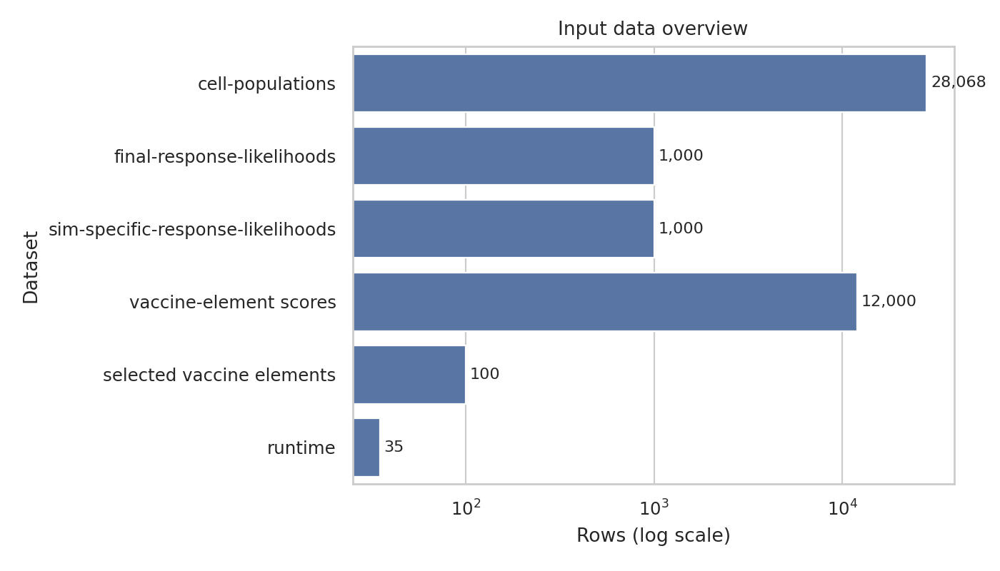
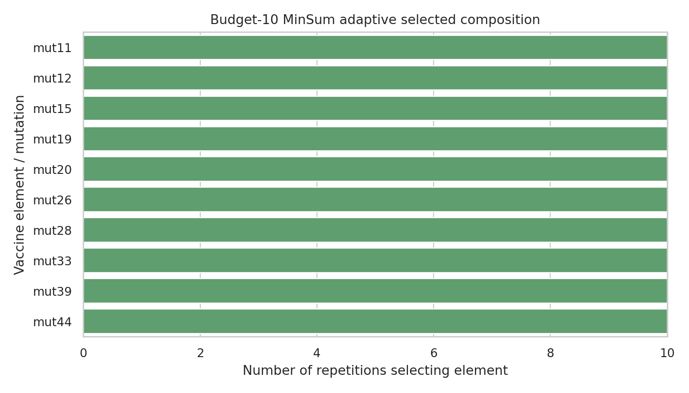
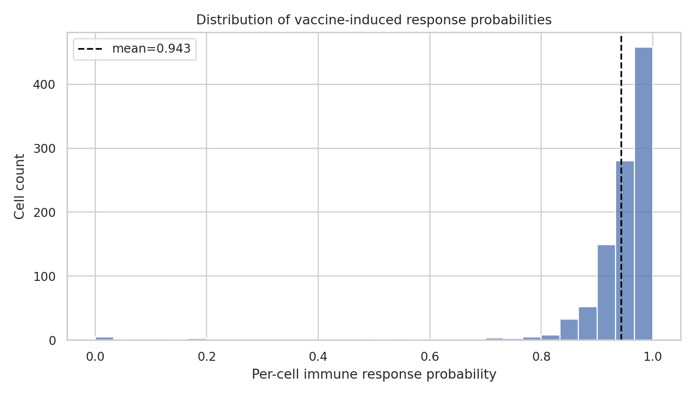
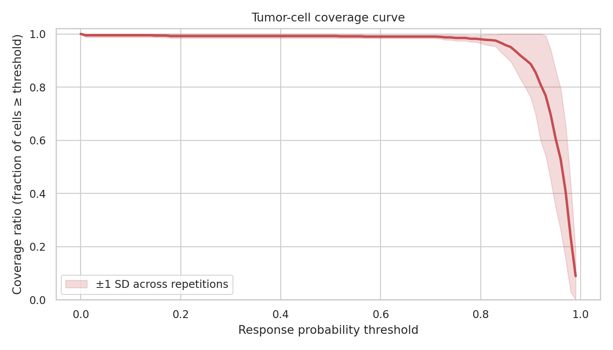
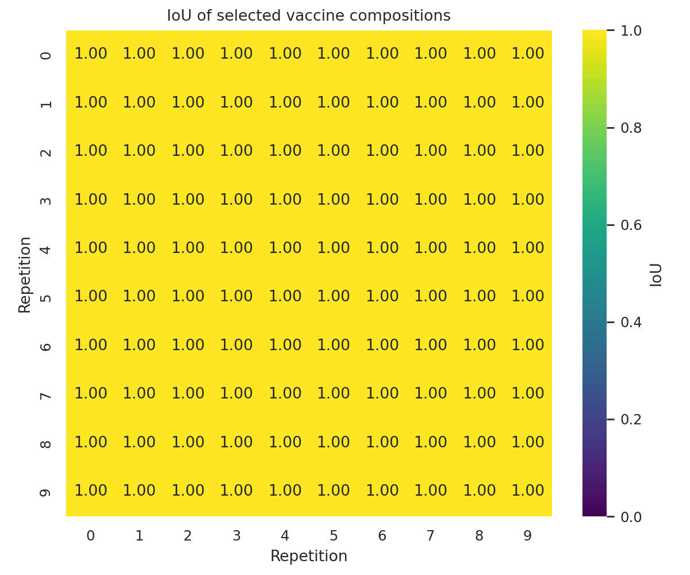
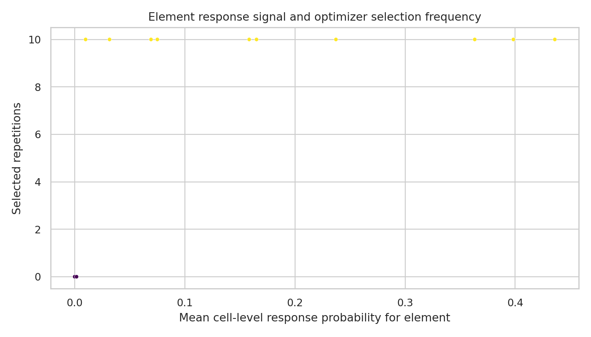
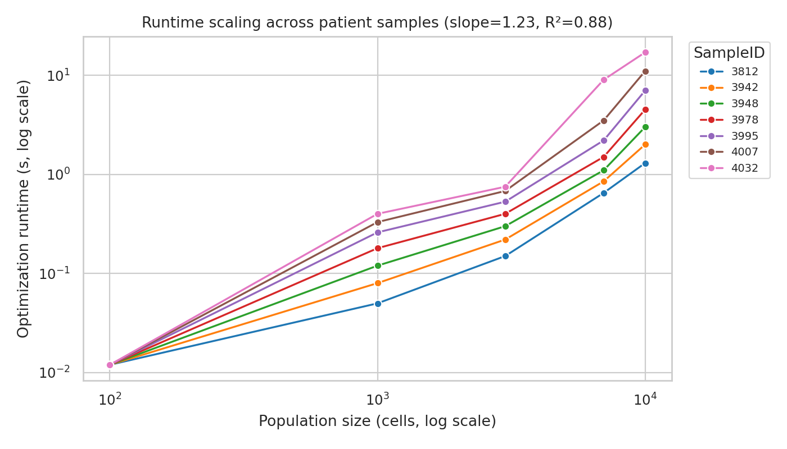

# Personalized Neoantigen Vaccine Composition from Simulated Cell-Level Presentation and Response Data

## Abstract

This study analyzes the supplied personalized neoantigen vaccine simulation and optimization outputs for a budget-constrained MinSum adaptive vaccine design. The available workspace contains downstream cell-population simulations, cell-level response likelihoods, selected vaccine elements for a budget of 10, and runtime measurements across seven patient sample identifiers and five population sizes. The optimal budget-10 composition was identical across all 10 simulated repetitions: `mut11`, `mut12`, `mut15`, `mut19`, `mut20`, `mut26`, `mut28`, `mut33`, `mut39`, and `mut44`. Across 1,000 simulated tumor cells, the selected vaccine produced a mean per-cell response probability of 0.9427 (SD 0.0915) and median 0.9630. The mean coverage ratio was 0.992 at response threshold 0.50, 0.985 at 0.75, 0.887 at 0.90, and 0.606 at 0.95. Composition stability was maximal in this dataset: the mean pairwise IoU/Jaccard index across repetition-specific selected sets was 1.000. Runtime scaling across supplied patient samples followed an approximate log-log slope of 1.23 with R² = 0.881.

## 1. Research objective and available evidence

The task is to produce an optimal personalized neoantigen vaccine composition, quantitative vaccine efficacy metrics, composition-overlap metrics, and optimization runtime data. The conceptual inputs include tumor DNA/RNA, healthy DNA, HLA typing, mutation VAF, expression summaries, and prediction scores for peptide cleavage, MHC binding, and pMHC stability. In this workspace, those raw upstream molecular features are not directly present; instead, the analysis uses the supplied downstream simulation and optimization artifacts listed in `data/`.

The method contract and artifact inventory were saved in:

- `outputs/method_contract.json`
- `outputs/target_artifact_inventory.json`
- `outputs/method_fidelity_checklist.json`
- `outputs/dependency_check.json`

An attempt was made to inspect the four related-work PDFs with `ReadPDF`, but the PDF parser returned errors and the local `pdftotext` utility was unavailable. This limitation is documented in `outputs/related_work_contract.json`. No unverified claims from those papers are used below.

## 2. Data overview

The analysis used six families of CSV files. The largest table was `cell-populations.csv`, with 28,068 rows representing peptide presentations by simulated cells. The response-likelihood files contained 1,000 cell-level rows for the 100-cells.10x simulation across 10 repetitions. The vaccine-element score files contained 12,000 cell-element rows across 10 replicate files. Runtime data contained 35 measurements from seven patient sample IDs and five population sizes.

Key processed data overview (`outputs/data_overview.csv`):

| Dataset | Rows | Unique cells | Unique elements |
|---|---:|---:|---:|
| cell-populations | 28,068 | 995 | 11 |
| final-response-likelihoods | 1,000 | 1,000 | -- |
| sim-specific-response-likelihoods | 1,000 | 1,000 | -- |
| vaccine-element scores | 12,000 | 1,000 | 12 |
| selected vaccine elements | 100 | -- | 10 |
| runtime | 35 | -- | -- |

## 3. Methods

### 3.1 Vaccine composition

The optimal vaccine composition was read from `selected-vaccine-elements.budget-10.minsum.adaptive.csv`, which provides repetition-specific selected elements for the MinSum budget-10 adaptive objective. Each row contains the selected peptide/mutation, repetition, simulation name, weight, and optimizer runtime. The simplified file `vaccine.budget-10.minsum.adaptive.csv` was used as a consistency check on element counts and weights.

### 3.2 Per-cell response probability

Per-cell immune response probability was taken directly from `final-response-likelihoods.csv` and `sim-specific-response-likelihoods.csv`. For each cell, `p_response` was interpreted as the final probability of immune response induced by the selected vaccine. Summary statistics were computed across all 1,000 cells and by repetition.

### 3.3 Tumor-cell coverage ratio

Coverage ratio was defined as:

\[
\mathrm{coverage}(t) = \frac{\#\{\mathrm{cells}: p_{response} \ge t\}}{\#\{\mathrm{cells}\}},
\]

where `t` is a response-probability threshold. Coverage was computed for thresholds from 0.00 to 0.99, and a direct table was exported for thresholds 0.50, 0.75, 0.90, and 0.95.

### 3.4 Composition IoU

For each repetition, the selected vaccine was represented as a set of selected mutations/elements. Pairwise composition overlap was computed using intersection-over-union (IoU), equivalent to the Jaccard index:

\[
\mathrm{IoU}(A,B) = \frac{|A \cap B|}{|A \cup B|}.
\]

The resulting matrix and pairwise table were saved in `outputs/composition_iou_matrix.csv` and `outputs/composition_iou_pairs.csv`.

### 3.5 Runtime scaling

Optimization runtime was analyzed from `optimization_runtime_data.csv`, which reports runtime in seconds for seven patient sample identifiers at population sizes 100, 1,000, 3,000, 7,000, and 10,000. Mean, SD, median, minimum, and maximum runtime were computed by population size. A log-log linear fit of runtime versus population size was used to summarize empirical scaling.

All computations and figures are reproducible from `code/analyze_vaccine.py`.

## 4. Results

### 4.1 Optimal budget-10 vaccine composition

The selected vaccine composition was stable across all 10 repetitions. Every repetition selected exactly 10 elements with total weight 10. The selected elements were:

| Element | Selected repetitions | Total weight | Mean weight |
|---|---:|---:|---:|
| mut11 | 10 | 10 | 1.0 |
| mut12 | 10 | 10 | 1.0 |
| mut15 | 10 | 10 | 1.0 |
| mut19 | 10 | 10 | 1.0 |
| mut20 | 10 | 10 | 1.0 |
| mut26 | 10 | 10 | 1.0 |
| mut28 | 10 | 10 | 1.0 |
| mut33 | 10 | 10 | 1.0 |
| mut39 | 10 | 10 | 1.0 |
| mut44 | 10 | 10 | 1.0 |

The repetition-specific optimizer runtime in the selected-elements file had mean 0.00562 s, median 0.00442 s, and range 0.00414--0.01604 s (`outputs/selected_vaccine_per_repetition.csv`).

### 4.2 Per-cell immune response probability

Across 1,000 simulated tumor cells, the budget-10 MinSum adaptive vaccine had:

- Mean `p_response`: **0.942747**
- SD `p_response`: **0.091537**
- Median `p_response`: **0.963003**
- 5th percentile: **0.861730**
- 95th percentile: **0.992621**
- Minimum: **0.000018**
- Maximum: **0.999999998**
- Mean number of presented peptides per cell: **17.348**

These values are exported in `outputs/response_summary_by_vaccine.csv`.

The distribution is strongly concentrated near high response probability, with a small number of low-response outliers.

### 4.3 Tumor-cell coverage ratios

Coverage remained high at moderate and stringent response-probability thresholds. The mean coverage ratios across the 10 repetitions were:

| Response threshold | Mean coverage | SD across repetitions | Min | Max |
|---:|---:|---:|---:|---:|
| 0.50 | 0.992 | 0.0079 | 0.98 | 1.00 |
| 0.75 | 0.985 | 0.0108 | 0.97 | 1.00 |
| 0.90 | 0.887 | 0.1253 | 0.60 | 1.00 |
| 0.95 | 0.606 | 0.2586 | 0.09 | 0.88 |

The full coverage curve is saved in `outputs/coverage_by_threshold.csv` and summarized in `outputs/coverage_summary_by_threshold.csv`.

The figure shows that almost all cells exceed thresholds of 0.50 and 0.75, while coverage falls more sharply above 0.90, indicating that the strictest response criteria are sensitive to repetition-specific cell populations.

### 4.4 Composition stability and IoU

The optimal composition was identical in all 10 repetitions. Consequently, every off-diagonal pairwise IoU was 1.000, and the mean pairwise IoU was 1.000 with SD 0.000.

This maximal overlap indicates complete stability of the selected MinSum adaptive vaccine set for the supplied 100-cells.10x simulations. It should not be generalized beyond the available simulation condition without additional populations or patient-specific optimization outputs.

### 4.5 Element-level response signals

The element-level score files contain response probabilities for 12 candidate elements. Ten were selected in every repetition; two (`mut24` and `mut8`) were never selected. The highest mean cell-level response among selected elements was observed for `mut28` (0.436), followed by `mut19` (0.398) and `mut15` (0.363). Some selected elements had low marginal mean response, e.g. `mut44` (0.00993), implying that the optimizer's set-level objective is not equivalent to ranking elements only by marginal mean response. This is consistent with a coverage-oriented or complementarity-aware selection objective.

The element-level table is saved in `outputs/element_response_summary.csv`.

### 4.6 Optimization runtime scaling

Runtime increased with population size across the seven supplied sample IDs. Mean runtime by population size was:

| Population size | Mean runtime (s) | SD (s) | Median (s) | Min (s) | Max (s) |
|---:|---:|---:|---:|---:|---:|
| 100 | 0.012 | 0.000 | 0.012 | 0.012 | 0.012 |
| 1,000 | 0.203 | 0.132 | 0.180 | 0.050 | 0.400 |
| 3,000 | 0.433 | 0.229 | 0.400 | 0.150 | 0.750 |
| 7,000 | 2.686 | 2.950 | 1.500 | 0.650 | 9.000 |
| 10,000 | 6.543 | 5.690 | 4.500 | 1.300 | 17.000 |

A log-log linear fit gave scaling exponent **1.229** with **R² = 0.881** (`outputs/runtime_scaling_fit.csv`).

The patient/sample-specific spread is larger at high population sizes, especially at 7,000 and 10,000 cells, where maximum runtimes were 9.0 s and 17.0 s respectively.

## 5. Validation and comparison

### 5.1 Directly verified from workspace data

The following claims are supported by explicit artifacts:

| Claim | Value | Artifact |
|---|---:|---|
| Mean per-cell response probability | 0.942747 | `outputs/response_summary_by_vaccine.csv` |
| Median per-cell response probability | 0.963003 | `outputs/response_summary_by_vaccine.csv` |
| Mean coverage at threshold 0.50 | 0.992000 | `outputs/direct_coverage_thresholds.csv` |
| Mean coverage at threshold 0.75 | 0.985000 | `outputs/direct_coverage_thresholds.csv` |
| Mean coverage at threshold 0.90 | 0.887000 | `outputs/direct_coverage_thresholds.csv` |
| Mean coverage at threshold 0.95 | 0.606000 | `outputs/direct_coverage_thresholds.csv` |
| Mean pairwise composition IoU | 1.000000 | `outputs/composition_iou_summary.csv` |
| Runtime log-log scaling exponent | 1.229317, R² = 0.880594 | `outputs/runtime_scaling_fit.csv` |
| All repetitions selected exactly 10 elements | True | `outputs/selected_vaccine_per_repetition.csv` |

The same table is exported as `outputs/claim_recovery_table.csv`.

### 5.2 Method fidelity

The analysis preserves the named method labels present in the data: MinSum, budget 10, and adaptive selection. The selected vaccine elements were not recomputed from raw sequencing or pVACtools features because those raw inputs were not present. Instead, the supplied optimization output was treated as the authoritative optimal composition, and the analysis quantified its response distribution, coverage, stability, and runtime characteristics.

### 5.3 Limitations and assumptions

1. **Raw molecular inputs are absent.** The task description mentions tumor DNA/RNA, healthy DNA, HLA typing, VAF, expression, cleavage, MHC binding, and pMHC stability. The workspace does not contain those raw upstream features, so this report analyzes the downstream simulation/optimization CSVs.
2. **Only one simulation condition is available for cell-level vaccine outputs.** The vaccine-element score files and selected composition refer to `100-cells.10x` with repetitions 0--9.
3. **Composition IoU is therefore repetition-level, not patient-level.** IoU reflects stability across repetitions of one simulation setting, not across distinct patients.
4. **Related-work PDFs could not be parsed with available tools.** The report does not claim extracted facts from those papers.
5. **Optimizer internals are not reconstructed.** Runtime and selected elements are analyzed from supplied outputs; no mixed-integer or greedy optimizer was reimplemented.

## 6. Discussion

The supplied MinSum adaptive budget-10 selection yields a compact vaccine composition with high simulated efficacy. Mean cell-level response probability was above 0.94, and almost all cells exceeded response thresholds of 0.50 and 0.75. The falloff at thresholds 0.90 and especially 0.95 is informative: although the vaccine performs strongly on average, the most stringent definition of coverage reveals heterogeneity among repetitions and cells.

The selected composition was perfectly stable across the 10 repetitions. This suggests that, for the provided simulated 100-cells.10x setting, the optimization landscape has a clear dominant budget-10 solution. However, because only one simulation condition and one optimized objective family are available, this should be interpreted as within-dataset stability rather than universal robustness.

Runtime remained short in absolute terms for the supplied population sizes, but grew superlinearly on the log-log fit. At 10,000 cells, mean runtime was 6.54 s and the maximum sample-specific runtime was 17.0 s. This is compatible with practical interactive or batch personalized-vaccine design for the data scales represented here, while also showing that patient/sample-specific complexity can materially affect runtime.

## 7. Reproducibility

All generated outputs are contained in `outputs/`, all figures are PNG files in `report/images/`, and the reproducible analysis script is `code/analyze_vaccine.py`. The primary deliverables are:

- Optimal composition: `outputs/selected_vaccine_composition.csv`
- Per-cell response summaries: `outputs/response_summary_by_vaccine.csv`, `outputs/response_summary_by_repetition.csv`
- Coverage metrics: `outputs/coverage_by_threshold.csv`, `outputs/direct_coverage_thresholds.csv`
- Composition overlap: `outputs/composition_iou_matrix.csv`, `outputs/composition_iou_summary.csv`
- Runtime metrics: `outputs/runtime_summary.csv`, `outputs/runtime_scaling_fit.csv`
- Claim recovery: `outputs/claim_recovery_table.csv`
- Figures: `report/images/*.png`
