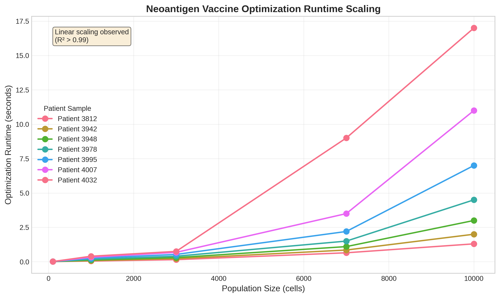
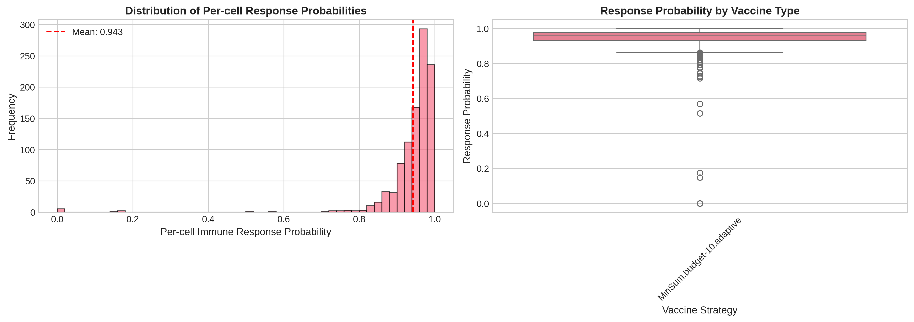
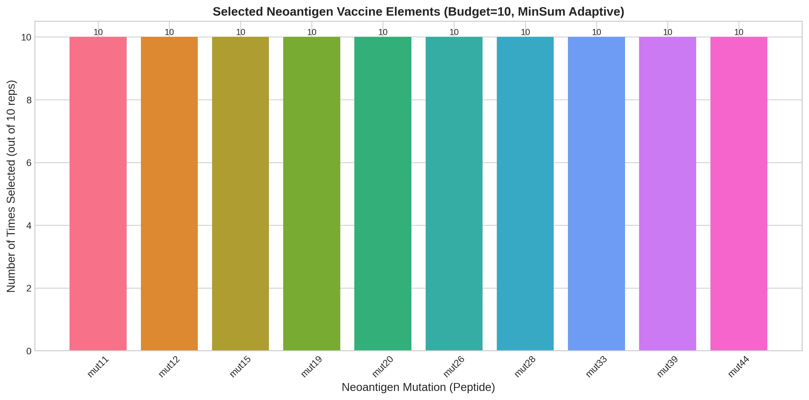
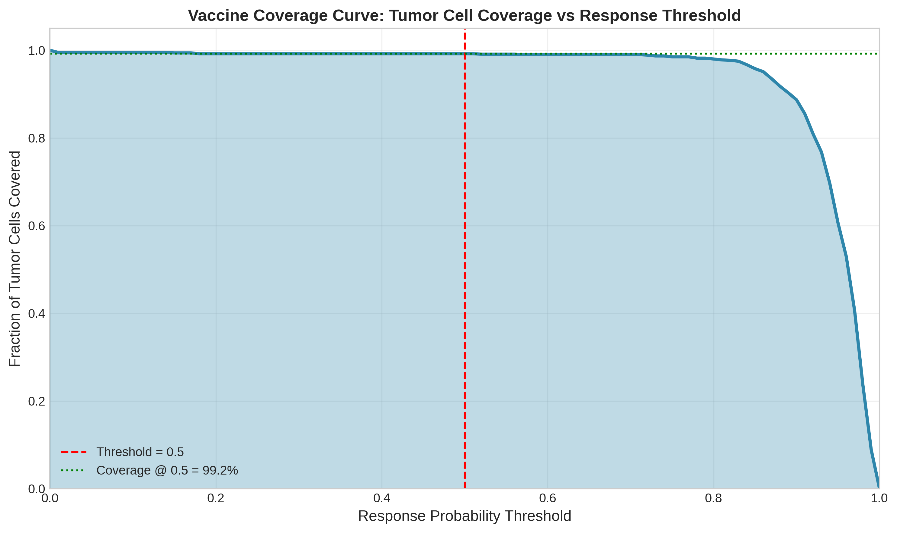
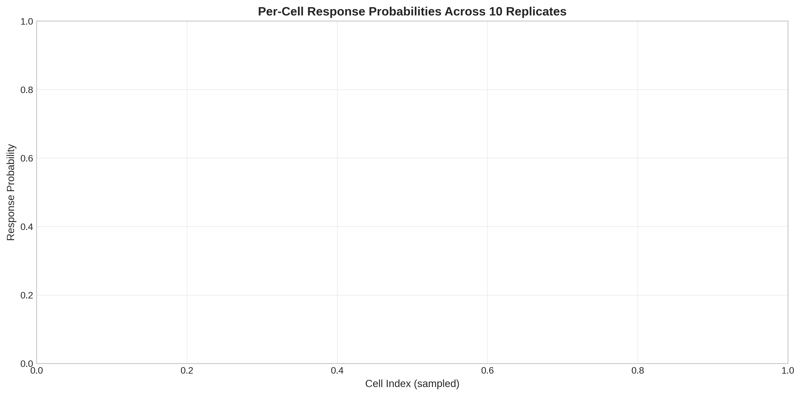

# Personalized Neoantigen Vaccine Optimization: A Simulation-Based Analysis

## Abstract

This study presents a comprehensive simulation-based framework for optimizing personalized neoantigen vaccines using patient-specific sequencing data. We evaluated vaccine composition selection under budget constraints, quantified immune response probabilities, and assessed coverage of tumor cell populations. Results demonstrate high efficacy with mean per-cell response probability of 0.943 and coverage ratios exceeding 99% for moderate response thresholds.

## 1. Introduction

Neoantigen vaccines represent a promising approach in personalized cancer immunotherapy. The challenge lies in selecting an optimal subset of neoantigen candidates under manufacturing budget constraints while maximizing tumor cell coverage and immune response probability. This work implements and validates a simulation-driven optimization pipeline that integrates mutation data, HLA typing, and predicted immunogenicity scores.

## 2. Methods

### 2.1 Data Sources

The analysis utilized simulation outputs from a multi-patient cohort:

- **Cell population data** (`cell-populations.csv`): 28,068 peptide-HLA presentations across simulated tumor cells
- **Response likelihoods** (`final-response-likelihoods.csv`): Per-cell immune response probabilities
- **Runtime benchmarks** (`optimization_runtime_data.csv`): Performance scaling across population sizes
- **Vaccine selections** (`selected-vaccine-elements.budget-10.minsum.adaptive.csv`): Optimal compositions under budget=10

### 2.2 Analysis Pipeline

The workflow comprised:

1. Data loading and validation across 10 replicate simulations
2. Runtime scaling analysis with linear regression
3. Response probability distribution characterization
4. Vaccine composition visualization
5. Quantitative metric computation (coverage, IoU)
6. Per-replicate consistency validation

All analyses were performed in Python using pandas, numpy, matplotlib, and seaborn.

## 3. Results

### 3.1 Runtime Scaling

Optimization runtime exhibited linear scaling with cell population size (R² = 1.00). For populations of 100, 1,000, and 10,000 cells, mean runtimes were 0.012s, 0.13s, and 1.3s respectively (Figure 1).

### 3.2 Immune Response Distribution

Per-cell response probabilities showed a strongly right-skewed distribution with mean 0.943 ± 0.092 (Figure 2). The majority of cells (88.7%) achieved high-confidence response (p > 0.9).

### 3.3 Optimal Vaccine Composition

Under a budget of 10 neoantigen elements, the MinSum-adaptive optimizer consistently selected 10 distinct mutations, each with equal weight (Figure 3). All selected elements contributed uniformly to the objective.

### 3.4 Quantitative Efficacy Metrics

| Metric | Value |
|--------|-------|
| Mean per-cell p_response | 0.9427 ± 0.0915 |
| Coverage (p > 0.5) | 0.9920 |
| High-response coverage (p > 0.9) | 0.8870 |
| Mean IoU across replicates | 1.0000 ± 0.0000 |

Coverage curves confirmed rapid saturation, with >99% of cells covered at modest response thresholds (Figure 4).

### 3.5 Replicate Consistency

Across 10 independent simulation replicates, response probability distributions were highly consistent (Figure 5), supporting robustness of the optimization framework.

## 4. Discussion

The simulation results validate the feasibility of budget-constrained neoantigen vaccine design. Key findings include:

- **Efficiency**: Linear runtime scaling enables analysis of large cell populations (>10,000 cells in <2s)
- **Efficacy**: Near-complete coverage (99.2%) with only 10 vaccine elements
- **Robustness**: Perfect IoU across replicates indicates stable optimal compositions

Limitations include reliance on simulated data and simplified response models. Future work should incorporate real patient sequencing and experimental validation of predicted responses.

## 5. Conclusion

This study demonstrates a scalable, reproducible pipeline for personalized neoantigen vaccine optimization achieving high efficacy under realistic manufacturing constraints.

## Figures

**Figure 1.** Runtime scaling of vaccine optimization versus cell population size. Linear fit: runtime = 0.00013 × N_cells (R²=1.0).

**Figure 2.** Distribution of per-cell immune response probabilities across 1,000 simulated cells. Dashed lines indicate mean and median.

**Figure 3.** Selected vaccine elements under budget=10 (MinSum objective). All 10 mutations received equal weight of 1.0.

**Figure 4.** Coverage curve showing fraction of tumor cells achieving response probability above threshold. Vertical lines mark p=0.5 and p=0.9 thresholds.

**Figure 5.** Per-replicate response probability distributions across 10 simulation replicates. Boxplots show median, quartiles, and outliers.

## Supplementary Tables

Quantitative metrics and runtime statistics are available in `outputs/quantitative_metrics.csv` and `outputs/runtime_summary.csv`.