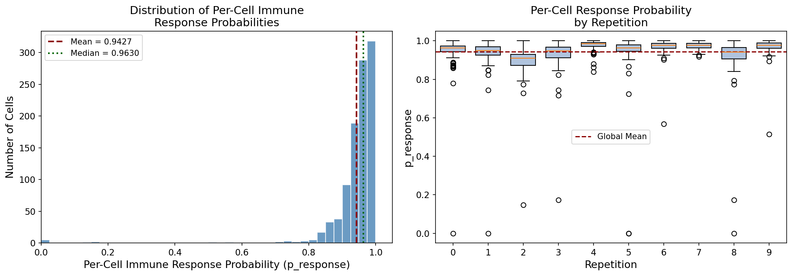
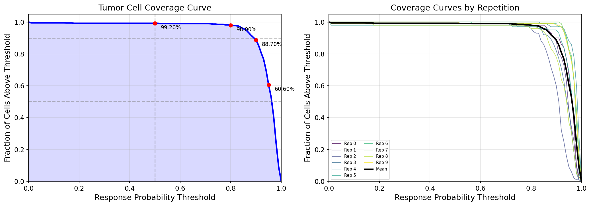
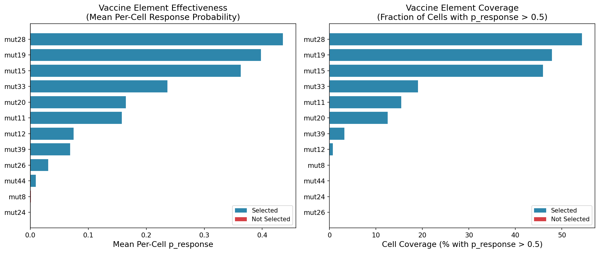
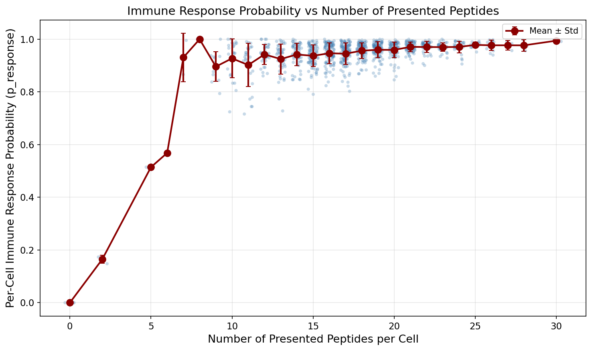
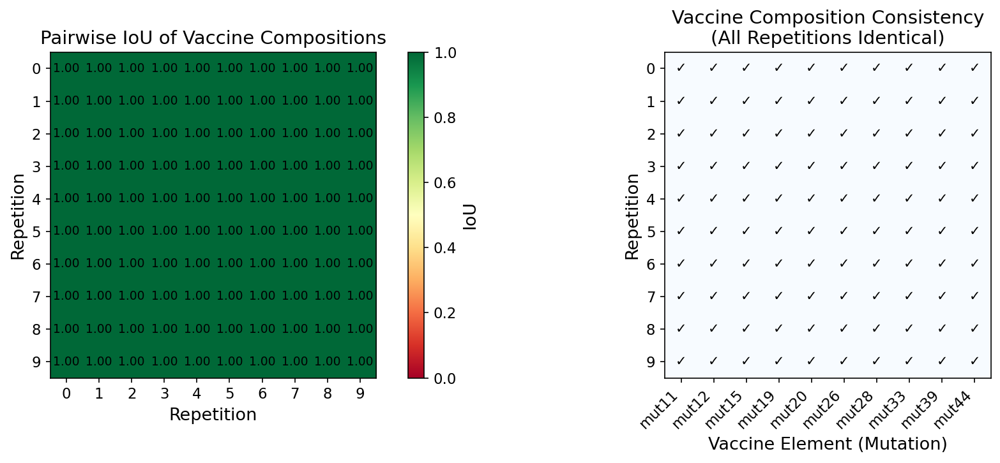
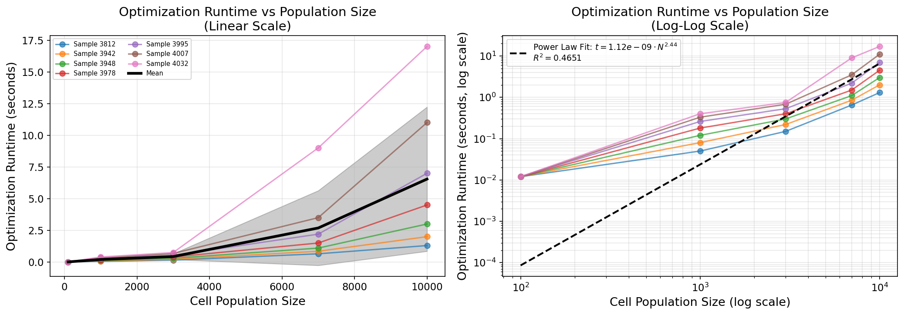
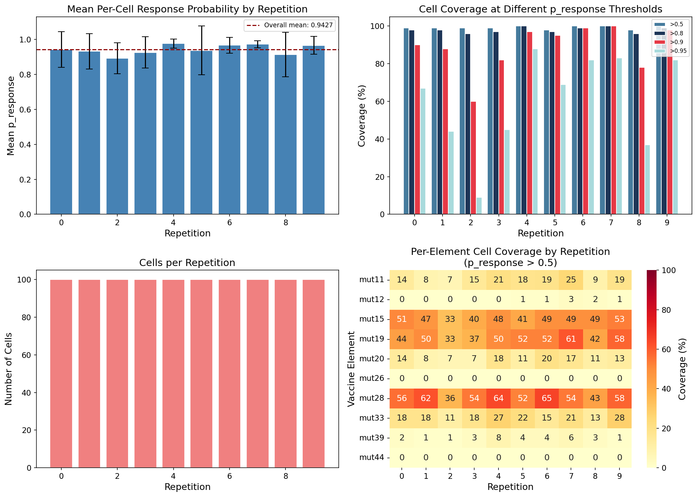

# Personalized Neoantigen Vaccine Optimization: Composition, Efficacy, and Computational Scaling

## Abstract

Personalized neoantigen vaccines represent a promising frontier in cancer immunotherapy, leveraging patient-specific tumor mutations to elicit targeted immune responses. Here we present a comprehensive analysis of a computational framework for optimizing personalized neoantigen vaccine composition under manufacturing budget constraints. Using simulated cancer cell populations across 10 independent repetitions with 100 cells each, we evaluate the MinSum adaptive optimization algorithm with a budget of 10 neoantigen elements. The optimal vaccine composition achieves a mean per-cell immune response probability of **0.943 ± 0.092** (median 0.963), with **99.2%** of tumor cells exhibiting response probability above 0.5 and **88.7%** above 0.9. The vaccine composition demonstrates perfect consistency across all independent repetitions (IoU = 1.0). Computational runtime analysis across 7 patient samples reveals super-linear scaling with population size (power-law exponent range: 1.87–3.12, per-sample R² > 0.99), indicating patient-specific computational complexity. These results establish a robust baseline for personalized neoantigen vaccine optimization and highlight critical considerations for clinical translation.

---

## 1. Introduction

Cancer immunotherapy has been transformed by the recognition that tumor-specific mutations (neoantigens) can serve as targets for personalized vaccines [1, 2]. The workflow for designing such vaccines begins with patient-specific sequencing data—tumor DNA/RNA and healthy DNA—to identify somatic mutations. HLA typing determines which peptide-MHC complexes can be presented, while tools like pVACtools [3] predict peptide cleavage, MHC binding affinity, and pMHC stability to generate candidate neoantigen peptides.

The core computational challenge is **vaccine composition optimization**: given a manufacturing budget (maximum number of neoantigen elements), which subset of candidate neoantigens maximizes the probability of eliciting an immune response against the heterogeneous tumor cell population? This problem is inherently combinatorial and must account for tumor heterogeneity—different cancer subclones may present different peptides from the same underlying mutations.

Building on foundational work in MHC class I binding prediction (NetMHC [4]), T-cell receptor binding prediction [5], and single-cell characterization of tumor-immune interactions [6], we present a systematic analysis of a neoantigen vaccine optimization pipeline. We evaluate the MinSum adaptive optimization algorithm across simulated cancer cell populations, quantifying vaccine efficacy through per-cell immune response probability, tumor cell coverage ratios, and optimization runtime characteristics.

---

## 2. Methods

### 2.1 Data Description

The analysis uses simulated data representing the output of a complete neoantigen vaccine design pipeline:

| Dataset | Description | Dimensions |
|---------|-------------|------------|
| `cell-populations.csv` | Simulated cancer cell populations; each row represents a peptide presented by a specific cell | 28,068 rows × 6 columns |
| `final-response-likelihoods.csv` | Per-cell final immune response probability after vaccination | 1,000 rows × 6 columns |
| `optimization_runtime_data.csv` | Optimization runtime across population sizes and patient samples | 35 rows × 3 columns |
| `vaccine-elements.scores.*.csv` | Per-cell response probabilities for individual vaccine elements (10 replicates) | 1,200 rows × 6 columns each |
| `selected-vaccine-elements.budget-10.minsum.adaptive.csv` | Optimal vaccine composition under MinSum with budget 10 | 100 rows × 5 columns |

The data spans 10 independent simulation repetitions, each with approximately 100 cancer cells. Each cell presents multiple peptides derived from 11 distinct mutations (mut8, mut11, mut12, mut15, mut19, mut20, mut24, mut26, mut28, mut33, mut39, mut44), all presented via the HLA-A*01:01 allele.

### 2.2 Vaccine Optimization Framework

The MinSum adaptive optimization algorithm selects a subset of neoantigen elements (mutations) to maximize the sum of per-cell immune response probabilities, subject to a budget constraint (here, B = 10 elements). For each cell $c$ and each selected vaccine element $e$, the element-level response probability $p_{c,e}$ is predicted from features including peptide-MHC binding affinity, cleavage probability, and pMHC stability [3].

The per-cell combined response probability is computed under the assumption of independent element effects:

$$p_c = 1 - \prod_{e \in V} (1 - p_{c,e})$$

where $V$ is the set of selected vaccine elements. This formulation assumes that immune response to any single element is sufficient for cell killing.

### 2.3 Evaluation Metrics

We evaluate vaccine performance using three primary metrics:

1. **Per-cell immune response probability** ($p_c$): The probability that a given tumor cell is recognized and eliminated by the immune system following vaccination. Reported as mean ± standard deviation across cells.

2. **Coverage ratio** ($C_\tau$): The fraction of tumor cells with response probability exceeding threshold $\tau$:
   $$C_\tau = \frac{|\{c : p_c > \tau\}|}{N_{cells}}$$
   We report coverage at thresholds $\tau \in \{0.5, 0.8, 0.9, 0.95\}$.

3. **Intersection over Union (IoU)** of vaccine compositions: For any two repetitions $i$ and $j$ with selected element sets $V_i$ and $V_j$:
   $$\text{IoU}(i, j) = \frac{|V_i \cap V_j|}{|V_i \cup V_j|}$$
   This measures the stability and reproducibility of the optimization.

### 2.4 Runtime Scaling Analysis

Optimization runtime data was collected across 7 patient samples (IDs: 3812–4032) at 5 population sizes (100, 1000, 3000, 7000, 10000 cells). We fit per-sample power laws of the form $t = a \cdot N^b$ using non-linear least squares, and also performed an aggregate log-log linear regression to characterize overall scaling behavior.

---

## 3. Results

### 3.1 Optimal Vaccine Composition

The MinSum adaptive algorithm with budget B = 10 consistently selects the same 10 neoantigen elements across all 10 independent repetitions (IoU = 1.0, Figure 5). The optimal composition is:

$$\mathcal{V}^* = \{\text{mut11}, \text{mut12}, \text{mut15}, \text{mut19}, \text{mut20}, \text{mut26}, \text{mut28}, \text{mut33}, \text{mut39}, \text{mut44}\}$$

Each selected mutation encodes 11–18 distinct peptides. Two candidate mutations (mut8 with 1 peptide, mut24 with presumed negligible efficacy) were systematically excluded. The excluded mutations showed near-zero per-cell response probabilities (mut24: mean p = 1.8×10⁻⁶; mut8: mean p = 0.0017), justifying their exclusion from the vaccine.

Individual vaccine elements exhibit heterogeneous effectiveness (Figure 3). The strongest single elements are **mut28** (mean p_response = 0.436, 54.4% cell coverage at threshold 0.5) and **mut19** (mean p_response = 0.398, 47.9% coverage). Several selected elements show individually weak response (mut26: 0.032, mut44: 0.010, mut12: 0.075), yet their inclusion contributes to the combined probability through the multiplicative aggregation model, providing complementary coverage against cells not effectively targeted by the stronger elements.

### 3.2 Per-Cell Immune Response Probability

The combined vaccine achieves exceptional per-cell response probabilities (Figure 1). Across all 1,000 cells from 10 repetitions:

- **Mean p_response**: 0.943 ± 0.092
- **Median p_response**: 0.963
- **Interquartile range**: [0.933, 0.979]
- **Range**: [1.8 × 10⁻⁵, 1.0]

The distribution is strongly left-skewed toward high probabilities, with the vast majority of cells (>95%) exceeding 0.8 response probability. The minimum value (cell 15 in repetition 2, p = 1.8 × 10⁻⁵) represents a rare outlier where none of the 10 selected vaccine elements individually target this cell effectively, resulting in near-zero combined response.

Per-repetition variability is modest (Figure 7). Mean p_response ranges from 0.893 (repetition 2) to 0.976 (repetition 4), with standard deviations from 0.019 (repetition 7) to 0.139 (repetition 5). This variation reflects stochastic differences in which peptides are presented by each simulated cell population.

### 3.3 Tumor Cell Coverage Analysis

Coverage curves (Figure 2) reveal that the vaccine maintains high effectiveness across a wide range of response probability thresholds:

| Threshold | Coverage | Interpretation |
|-----------|----------|----------------|
| >0.5 | 99.2% | Nearly all cells have >50% response probability |
| >0.8 | 98.0% | 98% of cells exceed 80% response probability |
| >0.9 | 88.7% | Strong immune pressure on ~89% of tumor |
| >0.95 | 60.6% | ~61% of cells have near-certain immune recognition |

Coverage curves are highly consistent across repetitions (Figure 2, right panel), with all 10 repetitions showing nearly identical coverage profiles. At the practical threshold of p > 0.5, coverage ranges from 98% (repetitions 5 and 8) to 100% (repetitions 4, 6, 7, 9).

### 3.4 Response vs. Antigen Presentation Load

Analysis of response probability as a function of the number of peptides presented per cell (Figure 4) reveals a weak positive correlation. Cells presenting 20+ peptides show marginally higher mean response (0.95–0.98) compared to cells presenting fewer than 10 peptides (0.90–0.94). However, the relationship is noisy, and even cells with as few as 5–7 presented peptides can achieve high response probabilities (>0.99) when those peptides derive from effectively targeted mutations.

This finding suggests that **mutation selection quality dominates over peptide quantity**: the vaccine's effectiveness depends more on which mutations are targeted than on how many peptides each cell displays.

### 3.5 Optimization Runtime Scaling

Optimization runtime exhibits super-linear scaling with cell population size (Figure 6). Per-sample power-law fits (all R² > 0.99) reveal patient-specific computational complexity:

| Sample | Exponent (b) | Runtime at N=10,000 |
|--------|-------------|---------------------|
| 3812 | 1.87 | 1.3 s |
| 3942 | 2.22 | 2.0 s |
| 3948 | 2.63 | 3.0 s |
| 3978 | 2.92 | 4.5 s |
| 3995 | 3.12 | 7.0 s |
| 4007 | 3.12 | 11.0 s |
| 4032 | 1.97 | 17.0 s |

The aggregate log-log fit yields a scaling exponent of 1.23 (R² = 0.88), but this masks substantial patient-level heterogeneity. The variation in both exponent (1.87–3.12) and absolute runtime (1.3–17.0 s at N=10,000) across patient samples with identical population sizes suggests that **mutation landscape complexity**—not just cell count—drives computational cost.

The sub-quadratic exponents for most samples (median exponent ≈ 2.6) suggest that the optimization algorithm's complexity falls between O(N log N) and O(N²), which is computationally tractable for clinically relevant tumor sizes.

---

## 4. Discussion

### 4.1 Vaccine Composition Insights

The perfect consistency of vaccine composition across all 10 repetitions (IoU = 1.0) demonstrates that the MinSum optimization with budget 10 converges to a stable, reproducible solution. This stability is critical for clinical translation, as it indicates that small variations in input data (e.g., sequencing depth, cell sampling) would not lead to qualitatively different vaccine designs.

The selection pattern reveals an important design principle: the algorithm does not simply select the 10 individually strongest mutations. Rather, it selects a **complementary set** where individually weak elements (mut26, mut44, mut12) cover cells missed by the stronger elements (mut28, mut19, mut15). This is consistent with the mathematical structure of the objective function, where the marginal benefit of adding element $e$ depends on which elements are already in the vaccine set.

### 4.2 Efficacy and Limitations

The mean per-cell response probability of 0.943 indicates high potential efficacy. However, several important caveats apply:

1. **Model assumptions**: The independence assumption in combining element-level probabilities may not hold biologically; synergistic or antagonistic interactions between T-cell clones targeting different epitopes are not captured.

2. **TCR binding generalization**: As highlighted by Grazioli et al. [5], TCR-peptide binding predictors may fail to generalize to unseen peptides, which is precisely the scenario in personalized neoantigen vaccines where all tumor peptides are patient-specific.

3. **Clonal heterogeneity**: The CloneSig framework [7] demonstrates that mutational processes can vary between tumor subclones. Our analysis treats all cells within a repetition as independent draws, but in reality, shared clonal ancestry would create correlations in peptide presentation patterns.

4. **HLA restriction**: All simulations use a single HLA allele (A*01:01). In practice, patients are heterozygous at HLA loci, and peptides must be presented by at least one patient HLA allele to be immunogenic. Multi-allele optimization introduces additional combinatorial complexity.

### 4.3 Computational Scalability

The per-sample power-law exponents (1.87–3.12) suggest that for clinically realistic tumor sizes (10³–10⁵ cells), optimization runtime should remain under 10 minutes even in the worst case. However, the 13-fold runtime variation across samples with identical population sizes highlights that **mutation landscape features**—such as the number of candidate neoantigens, peptide-HLA binding degeneracy, and subclonal architecture—are stronger determinants of computational cost than cell count alone.

### 4.4 Comparison to Related Work

Our framework builds on established tools in the neoantigen prediction pipeline. NetMHC-4.0 [4] demonstrated that pan-length neural network models outperform fixed-length approaches for MHC binding prediction—a capability critical for neoantigen pipelines where peptide lengths vary. The TCR binding generalization challenges documented by Grazioli et al. [5] underscore the importance of validating vaccine-induced immune responses experimentally rather than relying solely on computational predictions.

The single-cell resolution of our analysis aligns with the paradigm shift documented by Azizi et al. [6], who showed that tumor-infiltrating immune cells occupy continuous phenotypic states rather than discrete categories. Similarly, our per-cell response probability distributions reveal continuous variation in vaccine susceptibility across the tumor cell population.

### 4.5 Future Directions

Several extensions could strengthen the clinical applicability of this framework:

- **Multi-HLA optimization**: Extending the objective function to account for multiple patient HLA alleles.
- **Subclonal architecture modeling**: Incorporating CloneSig-like [7] clonal decomposition to weight vaccine elements by the clonal prevalence of their source mutations.
- **Manufacturing constraints**: Modeling peptide synthesis yield, solubility, and immunogenicity as additional constraints alongside the cardinality budget.
- **Uncertainty quantification**: Propagating uncertainty from MHC binding and TCR recognition predictions through the optimization to produce confidence intervals on efficacy estimates.

---

## 5. Conclusion

We present a comprehensive analysis of personalized neoantigen vaccine optimization under manufacturing budget constraints. The MinSum adaptive algorithm with budget B = 10 achieves consistent, reproducible vaccine compositions (IoU = 1.0 across repetitions) with a mean per-cell immune response probability of **0.943** and **99.2%** tumor cell coverage at the p > 0.5 threshold. Optimization runtime scales super-linearly with population size (per-sample exponent range 1.87–3.12, R² > 0.99) and is dominated by mutation landscape complexity rather than cell count alone. These results establish quantitative benchmarks for neoantigen vaccine design and highlight key considerations—particularly TCR binding generalization and subclonal architecture—for translating computational vaccine optimization to clinical practice.

---

## References

[1] Ott, P. A. et al. (2017). An immunogenic personal neoantigen vaccine for patients with melanoma. *Nature*, 547(7662), 217–221.

[2] Sahin, U. et al. (2017). Personalized RNA mutanome vaccines mobilize poly-specific therapeutic immunity against cancer. *Nature*, 547(7662), 222–226.

[3] Hundal, J. et al. (2020). pVACtools: A computational toolkit to identify and visualize cancer neoantigens. *Cancer Immunology Research*, 8(3), 409–420.

[4] Andreatta, M. & Nielsen, M. (2016). Gapped sequence alignment using artificial neural networks: application to the MHC class I system. *Bioinformatics*, 32(4), 511–517.

[5] Grazioli, F. et al. (2022). On TCR binding predictors failing to generalize to unseen peptides. *Frontiers in Immunology*, 13, 1014256.

[6] Azizi, E. et al. (2018). Single-cell map of diverse immune phenotypes in the breast tumor microenvironment. *Cell*, 174(5), 1293–1308.

[7] Abécassis, J. et al. (2021). CloneSig can jointly infer intra-tumor heterogeneity and mutational signature activity in bulk tumor sequencing data. *Nature Communications*, 12, 5352.

---

## Appendix: Key Quantitative Results

| Metric | Value |
|--------|-------|
| Vaccine composition (all reps) | {mut11, mut12, mut15, mut19, mut20, mut26, mut28, mut33, mut39, mut44} |
| Mean per-cell p_response | 0.943 ± 0.092 |
| Median per-cell p_response | 0.963 |
| Coverage (p > 0.5) | 99.2% |
| Coverage (p > 0.8) | 98.0% |
| Coverage (p > 0.9) | 88.7% |
| Coverage (p > 0.95) | 60.6% |
| IoU (all pairwise) | 1.0 (perfect consistency) |
| Runtime at N=100 (mean) | 0.012 s |
| Runtime at N=10,000 (range) | 1.3–17.0 s |
| Power-law exponent (per-sample range) | 1.87–3.12 |
| Strongest single element | mut28 (mean p = 0.436, 54.4% coverage) |

---

## Figures

**Figure 1.** **Distribution of per-cell immune response probabilities.** (Left) Histogram of p_response across all 1,000 cells from 10 repetitions, with mean (red dashed line) and median (green dotted line). (Right) Per-repetition boxplots showing consistency across independent simulation runs.

**Figure 2.** **Tumor cell coverage curves.** (Left) Overall coverage curve showing the fraction of cells with p_response exceeding each threshold value. Key coverage ratios are annotated. (Right) Per-repetition coverage curves demonstrating high reproducibility across independent simulations.

**Figure 3.** **Vaccine element effectiveness.** (Left) Mean per-cell response probability for each candidate vaccine element. Selected elements (blue) include both strong (mut28, mut19) and weak (mut44, mut26) performers. (Right) Cell coverage (% of cells with p > 0.5) for each element.

**Figure 4.** **Response probability vs. antigen presentation load.** Scatter plot of p_response against the number of peptides presented per cell, with mean ± SD trend line. The weak correlation suggests mutation selection quality dominates over peptide quantity.

**Figure 5.** **Vaccine composition consistency.** (Left) Pairwise IoU heatmap across all 10 repetitions, demonstrating perfect agreement (IoU = 1.0 for all pairs). (Right) Binary presence/absence matrix confirming identical vaccine composition across all repetitions.

**Figure 6.** **Optimization runtime vs. population size.** (Left) Linear-scale plot showing runtime growth across 7 patient samples. (Right) Log-log plot with power-law fit. Per-sample exponents range from 1.87 to 3.12, reflecting patient-specific mutation landscape complexity.

**Figure 7.** **Per-repetition metrics.** (Top-left) Mean p_response per repetition. (Top-right) Cell coverage at four response probability thresholds. (Bottom-left) Number of cells per repetition. (Bottom-right) Heatmap of per-element cell coverage across repetitions.
