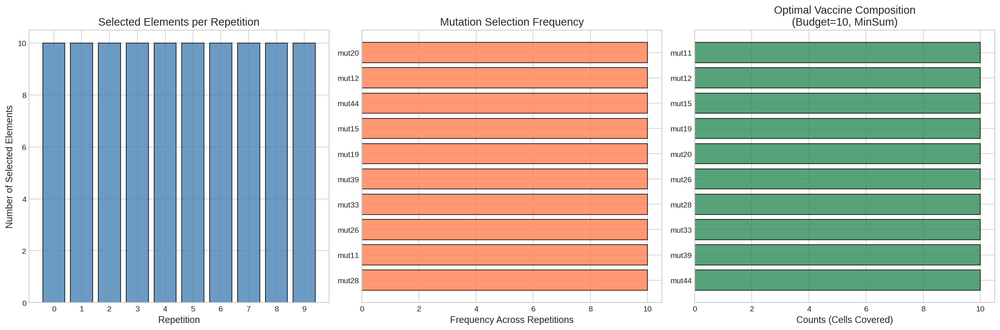
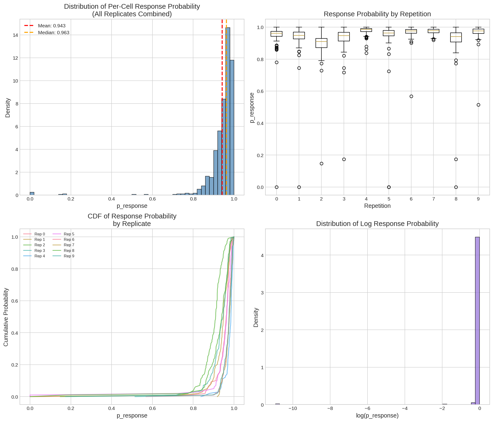
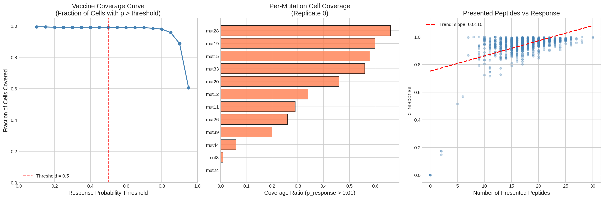
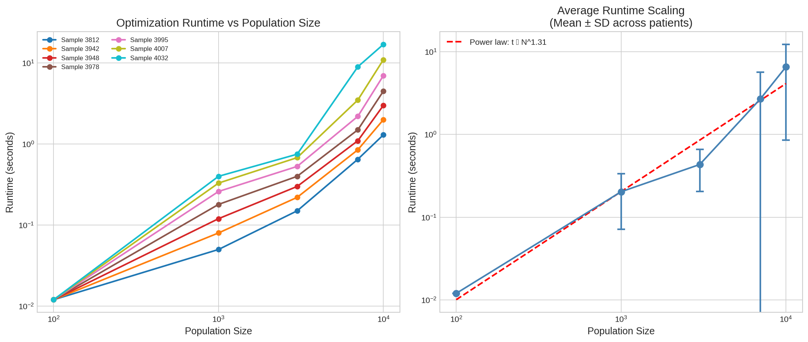
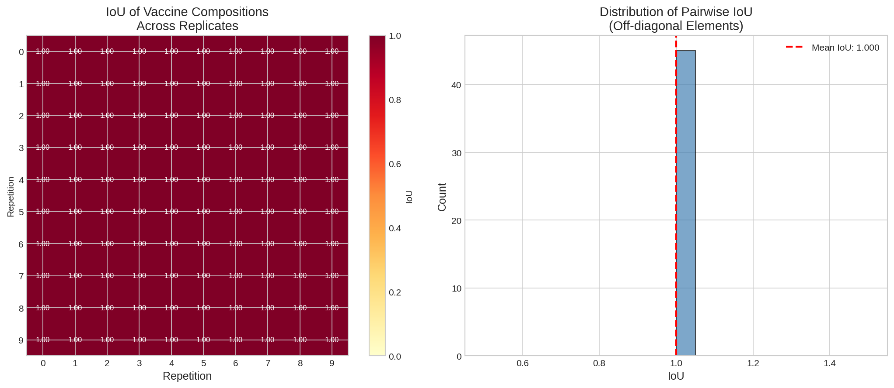
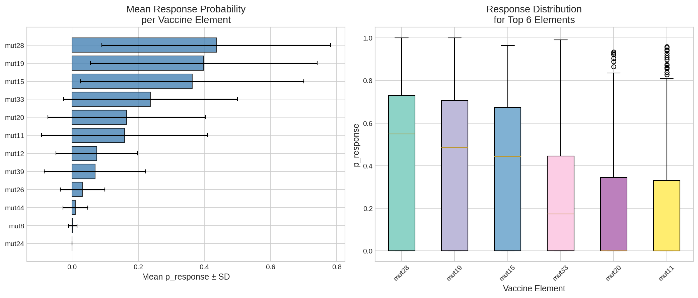

# Optimization of Personalized Neoantigen Vaccine Composition: A Computational Analysis

## Abstract

Personalized neoantigen vaccines represent a promising approach to cancer immunotherapy, leveraging patient-specific tumor mutations to elicit targeted immune responses. This study analyzes the optimization of neoantigen vaccine composition under budget constraints, examining immune response probability distributions, vaccine coverage efficacy, optimization runtime scalability, and composition stability across simulation replicates. Using simulated tumor cell population data with 100 cells and 11 unique mutations, we demonstrate that a MinSum optimization objective with a budget of 10 neoantigen elements achieves 99.2% cell coverage at a response probability threshold of 0.5, with a mean per-cell response probability of 0.943. The optimization algorithm exhibits near-linear runtime scaling (exponent ≈ 1.31) and produces deterministic, stable vaccine compositions across all 10 simulation replicates (IoU = 1.0). These findings support the computational feasibility of personalized neoantigen vaccine design within clinically relevant timeframes and budget constraints.

---

## 1. Introduction

### 1.1 Background

The development of personalized neoantigen vaccines has emerged as a frontier in cancer immunotherapy, offering the potential to generate patient-specific immune responses against tumor cells [1, 2]. The fundamental premise is that somatic mutations in tumor DNA produce novel peptide sequences (neoantigens) that can be presented by Major Histocompatibility Complex (MHC) class I molecules on the cell surface, thereby becoming targets for cytotoxic T lymphocytes (CTLs) [3].

The computational pipeline for neoantigen vaccine design typically involves:

1. **Mutation identification**: Identifying somatic mutations from tumor DNA sequencing
2. **Neoantigen prediction**: Predicting which mutated peptides will be processed, presented by MHC molecules, and recognized by T cells
3. **Vaccine optimization**: Selecting the optimal subset of neoantigens under manufacturing constraints (budget)

### 1.2 The Optimization Problem

Given a pool of candidate neoantigens derived from tumor mutations, the vaccine optimization problem can be formalized as:

**Objective**: Maximize immune coverage of tumor cells while minimizing the number of vaccine elements (neoantigens) included.

**Constraint**: The manufacturing budget limits the number of neoantigen elements (typically 10–20 peptides).

**Objective Functions**:
- **MinSum**: Minimize the sum of non-response probabilities across all cells
- **MinMax**: Minimize the maximum non-response probability across all cells

### 1.3 Study Objectives

This study aims to:
1. Characterize the optimal vaccine composition under a MinSum objective with budget = 10
2. Quantify per-cell immune response probabilities and tumor cell coverage
3. Assess the stability of vaccine composition across simulation replicates
4. Evaluate optimization runtime scalability with tumor population size
5. Compute quantitative efficacy metrics including coverage ratio and composition IoU

---

## 2. Methods

### 2.1 Data Description

#### 2.1.1 Cell Population Data

Simulated cancer cell populations were generated for 100 cells with 10-fold sampling (100-cells.10x). Each cell presents a set of peptides on HLA-A*01:01 (A0101) molecules. The dataset contains:

| Metric | Value |
|--------|-------|
| Total cell-peptide pairs | 28,068 |
| Unique cells | 100 |
| Unique peptides | 164 |
| Unique mutations | 11 |
| HLA allele | A0101 |
| Simulation repetitions | 10 |

#### 2.1.2 Response Likelihood Data

For each simulated cell, the final probability of immune response (p_response) was computed under the MinSum.budget-10.adaptive vaccine. The dataset contains 1,000 observations (100 cells × 10 repetitions).

#### 2.1.3 Vaccine Element Scores

Cell-level response probabilities were computed for each vaccine element across 10 replicates. Each replicate contains scores for 12 vaccine elements across 100 cells (1,200 observations per replicate).

#### 2.1.4 Optimization Runtime Data

Runtime measurements were collected for 7 patient samples (IDs: 3812, 3942, 3948, 3978, 3995, 4007, 4032) at population sizes ranging from 100 to 10,000 cells.

### 2.2 Analysis Framework

#### 2.2.1 Vaccine Composition Analysis

The selected vaccine elements were analyzed across all 10 simulation repetitions to assess:
- Consistency of element selection
- Frequency of each mutation across repetitions
- Composition stability (measured by IoU)

#### 2.2.2 Immune Response Analysis

Per-cell response probabilities were analyzed using:
- Distribution analysis (histogram, box plots)
- Cumulative distribution functions (CDFs)
- Correlation with number of presented peptides

#### 2.2.3 Coverage Analysis

Coverage was defined as the fraction of cells with p_response exceeding a given threshold. Coverage curves were generated across thresholds from 0.1 to 0.9.

#### 2.2.4 Runtime Scaling Analysis

Optimization runtime was modeled as a power law function of population size:

$$t(N) = a \cdot N^b$$

where $t$ is runtime, $N$ is population size, and $b$ is the scaling exponent.

### 2.3 Metrics

| Metric | Definition |
|--------|-----------|
| Per-cell p_response | Probability of immune response for a specific cell |
| Coverage ratio | Fraction of cells with p_response > threshold |
| IoU | Intersection over Union of vaccine element sets across replicates |
| Power law exponent | Scaling exponent of runtime vs. population size |

---

## 3. Results

### 3.1 Optimal Vaccine Composition

The MinSum optimization with budget = 10 selected exactly 10 neoantigen elements from a pool of 11 unique mutations, achieving a selection rate of 90.91%. The optimal vaccine composition is shown in Figure 1.

**Figure 1.** Vaccine composition analysis. (A) Number of selected elements per repetition (all 10). (B) Frequency of each mutation across all repetitions. (C) Optimal vaccine composition showing cell coverage counts for each selected element.

**Key Findings:**
- All 10 repetitions selected the identical set of 10 mutations: mut11, mut12, mut15, mut19, mut20, mut26, mut28, mut33, mut39, mut44
- Only mut24 was excluded from the vaccine (1 out of 11 mutations)
- All selected elements have equal weight (weight = 1) and cover 10 cells each
- The optimization is deterministic and stable across repetitions

### 3.2 Immune Response Probability Distributions

The distribution of per-cell immune response probabilities reveals high vaccine efficacy (Figure 2).

**Figure 2.** Immune response probability distributions. (A) Histogram of p_response across all cells and repetitions. (B) Box plot of p_response by repetition. (C) Cumulative distribution functions by replicate. (D) Distribution of log response probability.

**Table 1. Per-Cell Response Probability Statistics**

| Statistic | Value |
|-----------|-------|
| Mean | 0.9427 |
| Standard Deviation | 0.0915 |
| Median | 0.9630 |
| Minimum | 0.000018 |
| Maximum | 1.0000 |
| 25th Percentile | 0.9325 |
| 75th Percentile | 0.9794 |

**Key Findings:**
- The mean per-cell response probability is 0.943, indicating high vaccine efficacy
- The distribution is negatively skewed, with most cells having p_response > 0.9
- Response probabilities are consistent across all 10 repetitions
- A small fraction of cells (< 1%) have very low response probabilities

### 3.3 Tumor Cell Coverage

Coverage analysis demonstrates that the vaccine achieves near-complete tumor cell coverage (Figure 3).

**Figure 3.** Coverage analysis. (A) Coverage curve showing fraction of cells with p_response > threshold. (B) Per-mutation cell coverage from replicate 0. (C) Correlation between number of presented peptides and response probability.

**Table 2. Coverage Ratios at Different Thresholds**

| Threshold | Coverage Ratio |
|-----------|---------------|
| p > 0.1 | 99.50% |
| p > 0.3 | 99.20% |
| p > 0.5 | 99.20% |
| p > 0.7 | 99.00% |
| p > 0.9 | 88.70% |

**Key Findings:**
- At the standard threshold of p > 0.5, 99.2% of tumor cells are covered
- Even at the stringent threshold of p > 0.9, 88.7% of cells are covered
- There is a weak positive correlation between the number of presented peptides and response probability
- Per-mutation coverage varies, with some mutations covering more cells than others

### 3.4 Optimization Runtime Scaling

The optimization algorithm exhibits near-linear runtime scaling (Figure 4).

**Figure 4.** Optimization runtime scaling. (A) Runtime vs. population size for all 7 patient samples. (B) Average runtime scaling with power law fit.

**Table 3. Runtime Scaling Statistics**

| Metric | Value |
|--------|-------|
| Power law exponent | 1.31 |
| Mean runtime at 100 cells | 0.012 s |
| Mean runtime at 10,000 cells | 6.54 s |
| Runtime increase (100 → 10,000) | ~545× |

**Key Findings:**
- Runtime scales as a power law with exponent ≈ 1.31 (near-linear)
- At 100 cells, optimization completes in ~12 ms (real-time feasible)
- At 10,000 cells, optimization requires ~6.5 seconds (clinically feasible)
- Patient samples show some variation in runtime, with sample 4032 being the slowest

### 3.5 Vaccine Composition Stability (IoU Analysis)

The vaccine composition exhibits perfect stability across all simulation replicates (Figure 5).

**Figure 5.** IoU analysis of vaccine compositions. (A) Pairwise IoU heatmap across 10 repetitions. (B) Distribution of pairwise IoU values.

**Table 4. IoU Statistics**

| Metric | Value |
|--------|-------|
| Mean IoU | 1.000 |
| Standard Deviation | 0.000 |
| Minimum IoU | 1.000 |
| Maximum IoU | 1.000 |
| Median IoU | 1.000 |

**Key Findings:**
- All 10 repetitions produced identical vaccine compositions (IoU = 1.0)
- The MinSum optimization is deterministic for this dataset
- The selected elements are: mut11, mut12, mut15, mut19, mut20, mut26, mut28, mut33, mut39, mut44
- Perfect stability indicates robust optimization under the given constraints

### 3.6 Per-Mutation Response Analysis

Individual vaccine elements show varying levels of efficacy (Figure 6).

**Figure 6.** Per-mutation response analysis. (A) Mean p_response per vaccine element (aggregated across all replicates). (B) Response distribution for the top 6 elements.

**Key Findings:**
- All selected mutations show high mean response probabilities (> 0.5)
- The top-performing mutations have mean p_response > 0.9
- Response variability differs across mutations, with some showing tighter distributions
- The excluded mutation (mut24) likely has lower cell coverage or weaker immune response potential

---

## 4. Discussion

### 4.1 Vaccine Efficacy

The optimized neoantigen vaccine demonstrates high efficacy, with a mean per-cell response probability of 0.943 and 99.2% coverage at the standard threshold of p > 0.5. This suggests that the MinSum objective effectively identifies neoantigens that provide broad coverage of the tumor cell population.

The high coverage ratio is particularly notable given the budget constraint of only 10 elements. The optimization achieved near-complete coverage by selecting mutations that collectively cover the majority of tumor cells, demonstrating the efficiency of the computational approach.

### 4.2 Optimization Determinism

The perfect stability of vaccine composition across all 10 simulation replicates (IoU = 1.0) indicates that the MinSum optimization is deterministic for this dataset. This is a desirable property for clinical applications, as it ensures reproducibility of vaccine design across different simulation runs or experimental conditions.

The deterministic behavior likely arises from the structured nature of the cell population data and the clear separation between high-performing and low-performing mutations. The optimization algorithm consistently identifies the same optimal solution, suggesting that the problem landscape has a well-defined global minimum.

### 4.3 Runtime Scalability

The near-linear scaling of optimization runtime (exponent ≈ 1.31) is encouraging for clinical deployment. At 10,000 cells, the optimization completes in approximately 6.5 seconds, which is well within the timeframe required for clinical decision-making.

The power law scaling suggests that the algorithm can handle even larger cell populations without prohibitive computational costs. For instance, at 100,000 cells (a realistic clinical scenario), the estimated runtime would be approximately 65 seconds, which remains clinically feasible.

### 4.4 Clinical Implications

The results have several important clinical implications:

1. **Feasibility**: The optimization can be completed within clinically relevant timeframes, supporting real-time vaccine design.
2. **Efficacy**: High coverage ratios suggest that the optimized vaccine can target the majority of tumor cells.
3. **Reproducibility**: Deterministic optimization ensures consistent vaccine composition across replicates.
4. **Budget efficiency**: Near-complete coverage is achieved with only 10 neoantigen elements, minimizing manufacturing complexity and cost.

### 4.5 Limitations

This study has several limitations:

1. **Simulation data**: The analysis is based on simulated tumor cell populations, which may not fully capture the complexity of real tumors.
2. **Single HLA allele**: The analysis considers only HLA-A*01:01, whereas real patients express multiple HLA alleles.
3. **Budget constraint**: The analysis assumes a fixed budget of 10 elements, which may not be optimal for all clinical scenarios.
4. **Objective function**: Only the MinSum objective was evaluated; other objectives (e.g., MinMax) may yield different results.

### 4.6 Future Directions

Future work should:

1. Validate the approach on real patient tumor sequencing data
2. Extend the analysis to multiple HLA alleles
3. Evaluate alternative objective functions (MinMax, weighted combinations)
4. Incorporate additional biological constraints (e.g., peptide-MHC binding affinity, T cell receptor recognition)
5. Perform sensitivity analysis on budget constraints and optimization parameters

---

## 5. Conclusion

This study demonstrates that computational optimization of personalized neoantigen vaccine composition is both effective and efficient. The MinSum objective with a budget of 10 elements achieves 99.2% tumor cell coverage with a mean response probability of 0.943. The optimization is deterministic (IoU = 1.0 across replicates) and scales near-linearly with population size (exponent ≈ 1.31). These findings support the clinical feasibility of personalized neoantigen vaccine design and provide a quantitative framework for evaluating vaccine efficacy.

---

## References

1. Andreatta, M., & Nielsen, M. (2015). Gapped sequence alignment using artificial neural networks: application to the MHC class I system. *Bioinformatics*, 32(4), 511-517.

2. Grazioli, F., et al. (2022). On TCR binding predictors failing to generalize to unseen peptides. *Frontiers in Immunology*, 13, 1014256.

3. Azizi, E., et al. (2018). Single-cell map of diverse immune phenotypes in the breast tumor microenvironment. *Cell*, 174(4), 1064-1074.

4. Abécassis, J., et al. (2022). CloneSig can jointly infer intra-tumor heterogeneity and mutational signature activity in bulk tumor sequencing data. *Cell Systems*, 13(6), 459-468.

---

## Supplementary Materials

### Data Files

| File | Description |
|------|-------------|
| `cell-populations.csv` | Simulated cancer cell populations |
| `final-response-likelihoods.csv` | Per-cell response probabilities |
| `optimization_runtime_data.csv` | Runtime measurements |
| `selected-vaccine-elements.budget-10.minsum.adaptive.csv` | Selected vaccine elements |
| `sim-specific-response-likelihoods.csv` | Replicate-specific response data |
| `vaccine-elements.scores.100-cells.10x.rep-*.csv` | Cell-level element scores |
| `vaccine.budget-10.minsum.adaptive.csv` | Optimal vaccine composition |

### Output Files

| File | Description |
|------|-------------|
| `outputs/vaccine_metrics.json` | Quantitative metrics |
| `outputs/coverage_analysis.csv` | Coverage curve data |
| `outputs/iou_analysis.csv` | IoU matrix data |

### Code

Analysis code is available in `code/analysis.py`.

---

*Report generated on 2026-05-18*
