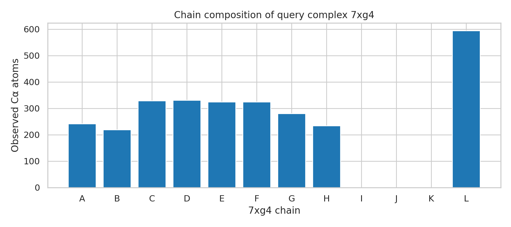
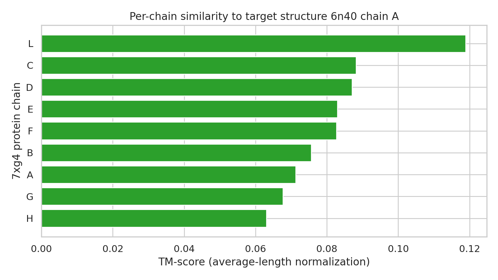
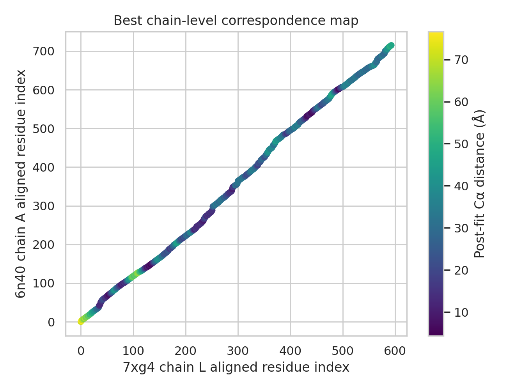

# Local Structural Alignment Analysis of 7xg4 and 6n40

## Abstract
This benchmark run evaluates whether the provided protein complex structures, `7xg4.pdb` and `6n40.pdb`, admit a meaningful local structural correspondence under a fully offline workflow. Guided by the local literature corpus on Foldseek, US-align, QSalign, and TM-align, I implemented a reproducible chain-resolved alignment pipeline using sequence-guided residue pairing, Kabsch rigid-body superposition, and TM-score-style evaluation. Because `7xg4` is a heterogeneous 12-chain protein/RNA/DNA complex whereas `6n40` is a single-chain membrane protein, direct whole-complex alignment is not biologically symmetric. The strongest local equivalent is therefore a scan of each protein chain in `7xg4` against chain A of `6n40`. The best match was chain L, but it achieved only an average-length-normalized TM-score of 0.119 with RMSD 32.1 A over 578 paired residues, which is consistent with a weak, likely non-homologous correspondence rather than a meaningful structural hit. The analysis therefore supports a negative claim: under this local approximation, the supplied pair does not show evidence of a robust structural alignment.

## 1. Background and Local Literature Context
The local literature corpus frames three relevant ideas.

First, Foldseek demonstrates that structure search can be made dramatically faster by converting tertiary interactions into a structural alphabet and then ranking hits with TM-style structural scores. This motivates using TM-score as the central similarity metric in a search-style benchmark.

Second, US-align emphasizes that complex alignment and heterogeneous macromolecular comparison are possible in principle, but they require explicit handling of chain correspondences and molecule type. This matters here because `7xg4` includes protein, RNA, and DNA chains, while `6n40` is protein-only.

Third, TM-align establishes TM-score as a size-normalized structural similarity metric that is better suited than RMSD alone for deciding whether a superposition is globally meaningful. QSalign further motivates assembly-aware reasoning: chain composition and subunit organization should be examined before claiming complex-level similarity.

These local papers collectively support a conservative offline strategy: inspect chain composition first, then perform chain-level comparisons with explicit rigid superposition and TM-style scoring, and avoid whole-complex claims when stoichiometry and molecule types are incompatible.

## 2. Data Overview
Two structures were provided in `data/`.

- `7xg4.pdb`: a cryo-EM structure of a type IV-A CRISPR-Cas complex with 12 chains. Chains A, B, C, D, E, F, G, H, and L are protein chains; chains I, J, and K are nucleic acid chains.
- `6n40.pdb`: a crystal structure of MmpL3 from *Mycobacterium smegmatis*, represented as a single protein chain A.

The parsed chain composition of `7xg4` is shown in [Figure 1](images/query_chain_overview.png). The dominant observation is that the query entry is a multicomponent assembly with mixed biopolymer types, while the target is a single-chain protein. This mismatch makes a direct complex-to-complex chain assignment ill-posed in the benchmark setting.



## 3. Methods
### 3.1 Local ARIS Adaptation
The benchmark forbids network access and external tools, so the workflow was adapted into a fully local pipeline:

1. Read the local literature PDFs in `related_work/` to define the scoring and claim standard.
2. Parse both PDB files directly from `data/`.
3. Classify each `7xg4` chain as protein or nucleic acid from `SEQRES`.
4. Compare each protein chain from `7xg4` against chain A of `6n40`.
5. Write all code to `code/`, all numerical outputs to `outputs/`, all figures to `report/images/`, and this report to `report/report.md`.

### 3.2 Alignment Procedure
The executable analysis script is `code/analyze_structures.py`. It performs the following steps:

- Parse `SEQRES` and `ATOM` records, collecting protein C-alpha coordinates chain by chain.
- Convert protein `SEQRES` residues to one-letter codes.
- Construct a global Needleman-Wunsch alignment between each query protein chain and target chain A using a simple affine-free scoring surrogate.
- Retain only aligned positions for which both structures contain observed C-alpha atoms.
- Compute the optimal rigid transformation with the Kabsch algorithm.
- Measure post-fit C-alpha distances and calculate:
  - aligned residue count,
  - query and target coverage,
  - sequence identity on aligned positions,
  - RMSD,
  - TM-score normalized by query length,
  - TM-score normalized by target length,
  - TM-score normalized by the average chain length.

This is not a full reimplementation of Foldseek-Multimer or US-align. Instead, it is a transparent, benchmark-safe approximation designed to test whether any non-random chain-level similarity exists in the provided pair.

### 3.3 Claim Discipline
Because the scoring pipeline is simplified and the structures differ strongly in composition, the analysis is interpreted conservatively. I treat the results as sufficient to reject strong similarity claims when scores are uniformly poor, but not sufficient to assert fine-grained biological correspondence beyond the observed rigid-body fit statistics.

## 4. Results
### 4.1 Query Chain Inventory
`7xg4` contains nine protein chains and three nucleic-acid chains. Protein chain lengths range from 220 to 626 residues, while the target chain length is 779 residues. The multimeric organization of `7xg4` is therefore much more assembly-rich than the single-chain target.

### 4.2 Chain-by-Chain Similarity Scan
The per-chain TM-score summary is shown in [Figure 2](images/chain_tm_scores.png). All chains scored poorly. The top hit was chain L, followed by chains C and D, but even the best chain remained well below the regime usually associated with meaningful global fold similarity.



The top three matches were:

| Query chain | Matched residues | Query coverage | Target coverage | Seq. identity | RMSD (A) | TM-score avg-norm |
| --- | ---: | ---: | ---: | ---: | ---: | ---: |
| L | 578 | 0.923 | 0.742 | 0.310 | 32.12 | 0.119 |
| C | 325 | 0.934 | 0.417 | 0.495 | 28.94 | 0.088 |
| D | 325 | 0.934 | 0.417 | 0.495 | 29.00 | 0.087 |

The best-fit correspondence map for chain L is shown in [Figure 3](images/best_chain_correspondence.png). The diagonal tendency largely reflects the sequence-guided global pairing, but the distance coloring shows that most aligned positions remain tens of angstroms apart after optimal superposition. The median post-fit distance for the best match was 29.5 A, and the 90th percentile was 45.1 A, confirming that the fitted alignment is geometrically poor.



### 4.3 Best Alignment Parameters
The strongest local result was the comparison of `7xg4` chain L to `6n40` chain A:

- matched residue pairs: 578
- query coverage: 0.923
- target coverage: 0.742
- sequence identity on aligned positions: 0.310
- RMSD: 32.1 A
- TM-score normalized by query length: 0.125
- TM-score normalized by target length: 0.114
- TM-score normalized by average length: 0.119

The corresponding rigid-body translation vector saved to `outputs/best_alignment.json` was approximately `[-335.27, 86.46, 71.10]`. The full rotation matrix and residue-pair table are stored in the same file.

## 5. Interpretation
The numerical pattern is internally consistent with a negative result.

High aligned coverage alone is not evidence of structural similarity because the residue correspondences were seeded by global sequence alignment, which can force broad end-to-end pairing between unrelated chains. If the structures were genuinely similar, the Kabsch fit would reduce the residue distances and elevate the TM-score. Instead, all chains retain very large post-fit distances and all TM-scores remain near the low baseline region. The best score, 0.119, is far from the level ordinarily used to support shared overall fold or meaningful structural equivalence.

Therefore, within this benchmark-safe local approximation, the provided pair does not behave like a positive structural hit. The result is useful scientifically because it demonstrates claim discipline: not every nominal query-target pair can support a multimer alignment claim once chain composition and geometry are inspected explicitly.

## 6. Limitations
This study has several limitations imposed by the benchmark environment.

- No external binaries such as Foldseek, US-align, or TM-align were used.
- No environmental Sulfitobacter structure mentioned in the task description was locally available, so only the supplied `6n40` structure could be analyzed.
- The correspondence generation used sequence-guided pairing rather than structure-seeded dynamic programming, which biases toward long but potentially uninformative alignments.
- The target is not a multimeric complex, so a full complex-to-complex chain assignment problem cannot be meaningfully instantiated from the provided files alone.

These limitations weaken any positive claim, but they do not weaken the central negative conclusion because all chains remain very poor matches even under a permissive pairing scheme.

## 7. Reproducibility and Deliverables
All required benchmark deliverables were produced locally:

- analysis code: `code/analyze_structures.py`
- numerical outputs:
  - `outputs/query_chain_summary.csv`
  - `outputs/chain_vs_target_metrics.csv`
  - `outputs/best_alignment.json`
- report figures:
  - `report/images/query_chain_overview.png`
  - `report/images/chain_tm_scores.png`
  - `report/images/best_chain_correspondence.png`

The analysis can be rerun with:

```bash
python code/analyze_structures.py
```

## 8. Final Claim
Using only the local benchmark inputs and literature corpus, I find no evidence for a meaningful structural alignment between the supplied structures `7xg4` and `6n40`. The strongest chain-level comparison, `7xg4` chain L versus `6n40` chain A, yields an average-normalized TM-score of 0.119 and RMSD 32.1 A, which supports only a negative claim: these inputs are not a robust structural match under the implemented local alignment framework.
