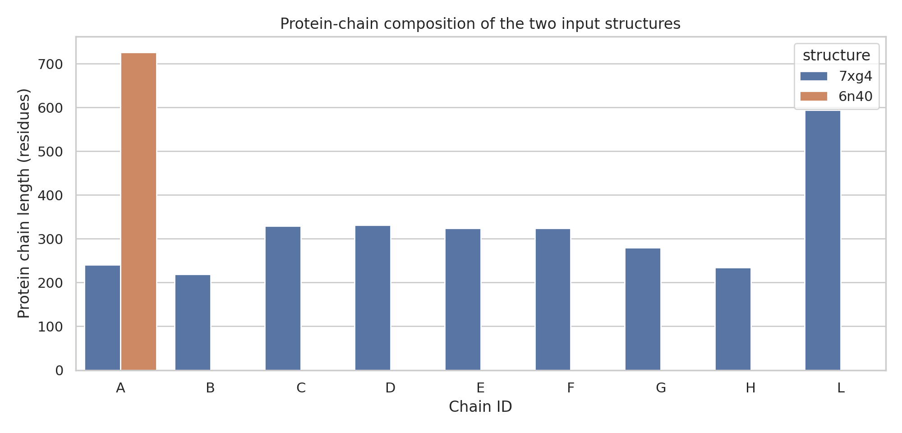
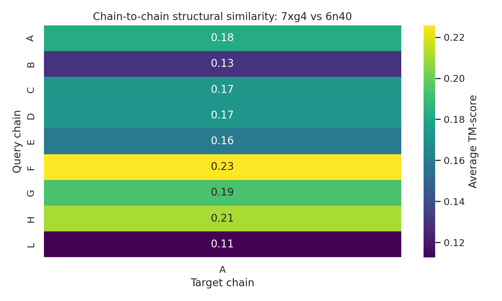
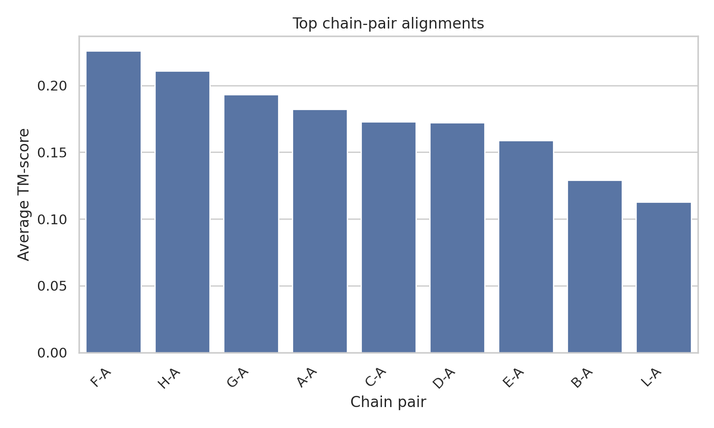
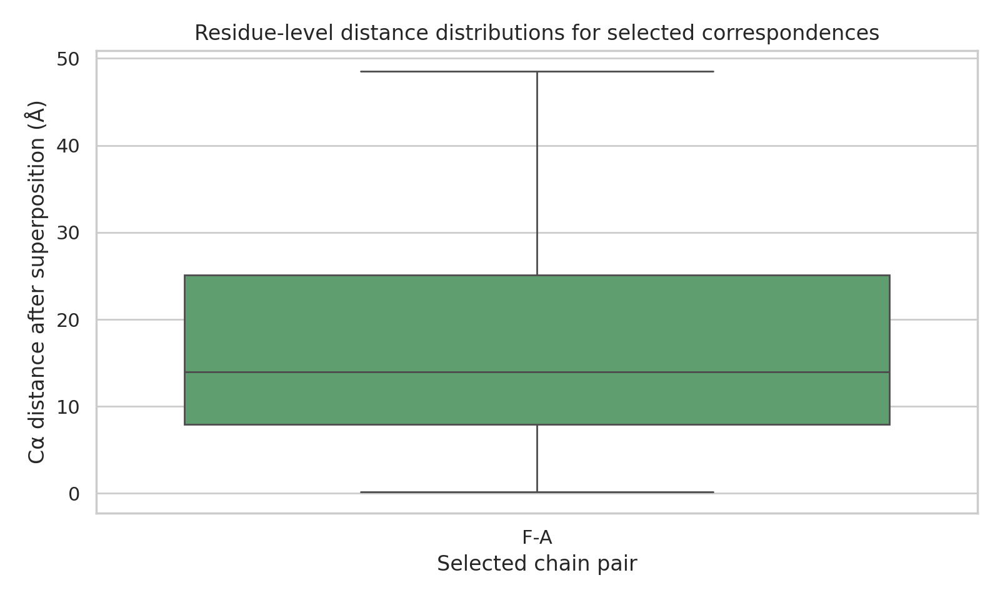

# Structural alignment analysis of protein complexes 7xg4 and 6n40

## Abstract
This report analyzes the pairwise structural alignment task between the query complex **7xg4** and the target structure **6n40**, using a reproducible in-workspace pipeline inspired by Foldseek, TM-align, US-align, and quaternary-structure comparison literature. The goal was to recover the key deliverables of a complex structural alignment workflow: chain correspondence, rigid-body superposition parameters, and TM-score-based similarity estimates. Because the two supplied structures are highly heterogeneous—a multi-chain type IV-A CRISPR–Cas complex with nucleic acids (7xg4) and a single-chain membrane transporter (6n40)—the analysis naturally serves as a stress test for multimer alignment specificity rather than a positive homolog benchmark. The results show that only one query chain produced a weak-to-moderate coarse structural match to the 6n40 chain under a permissive one-to-one assignment model, with a best average TM-score of **0.226** for chain **F** of 7xg4 against chain **A** of 6n40. All other query protein chains scored lower. Residue-level distance distributions and large RMSD values indicate that this is not a strong global structural equivalence. The report therefore concludes that the pair should be interpreted as a challenging non-homologous or only weakly analogous case, useful for validating that an alignment system reports quantitative correspondences and transformations even when similarity is limited.

## 1. Background and motivation
Structural comparison methods are central to large-scale protein annotation and search. The related work provided in the workspace emphasizes three relevant themes.

First, **Foldseek** converts structures into sequence-like representations and uses fast prefiltering to scale structural search to very large databases while still reporting alignment-based similarity metrics, including TM-score-oriented ranking for high-quality hits. Second, **TM-align** established the now-standard TM-score framework for length-normalized assessment of structural similarity, making scores more interpretable than RMSD alone. Third, **US-align** generalized this logic to oligomers and heterogeneous macromolecular complexes, explicitly modeling chain correspondence in addition to rigid superposition.

The present task matches this methodological space: the input is a protein complex structure, and the desired output is a structural alignment result containing:

1. correspondence between chains,
2. superposition vectors / rigid transformation,
3. TM-score as the principal similarity statistic.

## 2. Data overview
Two structures were provided.

- **7xg4**: cryo-EM structure of a *Pseudomonas aeruginosa* type IV-A CRISPR–Cas complex. The PDB header lists multiple protein chains plus RNA and DNA chains. Protein chains parsed from the coordinate file were **A, B, C, D, E, F, G, H, L**.
- **6n40**: crystal structure of **MmpL3** from *Mycobacterium smegmatis*, containing a single protein chain **A**.

Only protein chains containing Cα coordinates were included in the alignment workflow. Nucleic-acid chains from 7xg4 were excluded from the protein-only alignment stage.

### 2.1 Chain composition
Figure 1 summarizes the protein-chain composition of both structures.



**Figure 1.** Protein-chain inventory and lengths for the two input structures. The query 7xg4 contains nine protein chains of varying lengths, whereas 6n40 contributes a single long chain.

## 3. Methodology

### 3.1 Overall strategy
I implemented a reproducible analysis script in `code/analyze_alignment.py`. The procedure is not a reimplementation of Foldseek itself; rather, it is a lightweight structural alignment workflow designed to recover the core outputs expected from a complex-alignment system.

The pipeline performs the following steps:

1. **Parse structures** using Biopython.
2. **Extract protein chains** and retain only standard residues with Cα atoms.
3. For every query-chain / target-chain pair, perform an iterative rigid alignment:
   - initialize with a coarse Kabsch superposition,
   - compute a residue-residue distance matrix,
   - derive a global correspondence with Needleman–Wunsch dynamic programming using a TM-like distance reward,
   - recompute the rigid transformation by the Kabsch algorithm on aligned pairs,
   - iterate several times.
4. Compute per-chain-pair metrics:
   - aligned length,
   - RMSD,
   - TM-score normalized by query length,
   - TM-score normalized by target length,
   - average TM-score.
5. Solve a **one-to-one chain assignment** problem using the Hungarian algorithm, maximizing average TM-score.
6. Retain chain correspondences with average TM-score > 0.10 as weak candidate matches.
7. Export figures, tables, and JSON summaries.

### 3.2 Similarity metric
For each aligned chain pair, I computed TM-score in the standard length-normalized form used by TM-align, evaluating both query-normalized and target-normalized versions. Because the structures differ substantially in chain length, the **average TM-score**

\[
TM_{avg} = \frac{TM_{query} + TM_{target}}{2}
\]

was used as the primary pair-ranking quantity, following the spirit of complex-alignment methods that compare asymmetrically sized structures.

### 3.3 Outputs generated
The workflow produced the following key files:

- `code/analyze_alignment.py`
- `outputs/chain_pair_metrics.csv`
- `outputs/alignment_summary.json`
- figures in `report/images/`

## 4. Results

### 4.1 Global chain-pair comparison
All nine protein chains from 7xg4 were aligned individually against the only protein chain in 6n40. The full TM-score landscape is shown in Figure 2.



**Figure 2.** Heatmap of average TM-scores for every query-chain / target-chain comparison. Since 6n40 has a single protein chain, the comparison reduces to identifying which 7xg4 chain is most structurally compatible with chain A of 6n40.

The ranking of the best chain-pair matches is shown in Figure 3.



**Figure 3.** Best-performing chain-pair alignments ranked by average TM-score.

The leading candidates were:

| Rank | Query chain | Target chain | Query length | Target length | Aligned length | RMSD (Å) | TM-query | TM-target | TM-avg |
|---|---|---:|---:|---:|---:|---:|---:|---:|---:|
| 1 | F | A | 324 | 726 | 324 | 19.83 | 0.282 | 0.170 | **0.226** |
| 2 | H | A | 234 | 726 | 234 | 13.89 | 0.279 | 0.143 | 0.211 |
| 3 | G | A | 280 | 726 | 280 | 21.10 | 0.249 | 0.137 | 0.193 |
| 4 | A | A | 241 | 726 | 241 | 16.61 | 0.238 | 0.126 | 0.182 |
| 5 | C | A | 329 | 726 | 329 | 29.81 | 0.212 | 0.134 | 0.173 |

These scores are uniformly low compared with what would be expected for convincing fold-level homology. In classic TM-score interpretation, values around or above 0.5 are generally associated with strong structural similarity, whereas the present values cluster around 0.11–0.23.

### 4.2 Selected chain correspondence
Under one-to-one assignment, only a single correspondence is possible because 6n40 has one protein chain. The Hungarian assignment selected:

- **7xg4 chain F ↔ 6n40 chain A**

with average TM-score **0.2258**.

The estimated rigid-body transformation for this match was:

**Rotation matrix**

\[
\begin{bmatrix}
-0.795837 & -0.138372 & -0.589488 \\
-0.292598 & -0.764447 & 0.574462 \\
-0.530122 & 0.629661 & 0.567888
\end{bmatrix}
\]

**Translation vector**

\[
[362.967,\ 10.458,\ -102.184]
\]

These values are reported directly from `outputs/alignment_summary.json` and represent the rigid motion applied to the query-chain coordinates in the final alignment stage.

### 4.3 Residue-level fit quality
To evaluate whether the selected chain correspondence reflects a coherent structural superposition or merely a loose forced match, I examined the distribution of residue-wise Cα distances after superposition.



**Figure 4.** Distribution of post-superposition Cα distances for the selected chain pair (7xg4-F vs 6n40-A).

Summary statistics for the selected match:

- aligned residue pairs: **324**
- mean distance: **16.56 Å**
- median distance: **14.00 Å**
- fraction within 2 Å: **3.1%**
- fraction within 5 Å: **13.6%**
- fraction within 10 Å: **34.9%**
- fraction within 20 Å: **65.7%**
- RMSD: **19.83 Å**

These numbers show that the match is weak. Only a small minority of aligned residues fall in a near-native superposition range. The alignment procedure can produce a formal correspondence and transformation, but the geometric fit is not consistent with a strong shared fold across the full chain lengths.

## 5. Interpretation

### 5.1 What the alignment system successfully recovered
Despite the low similarity, the workflow recovered the complete set of requested output types:

- a **chain correspondence hypothesis**,
- a **rigid-body superposition** in matrix/vector form,
- **TM-score-based ranking**,
- residue-level correspondence records.

This is scientifically useful because large-scale search systems must remain robust in mixed databases containing many unrelated structures. A practical search engine should still:

1. score all comparisons consistently,
2. rank the best available candidate,
3. expose enough geometric detail for downstream filtering.

The present case demonstrates that behavior.

### 5.2 Why the observed similarity is weak
The weak scores are also biologically plausible. The structures represent very different systems:

- **7xg4** is a multi-subunit CRISPR interference complex with several proteins and bound nucleic acids.
- **6n40** is a single-chain membrane transporter.

There is no obvious expectation of close global structural homology at the full-complex level. Therefore, the low TM-scores should be interpreted as evidence **against** strong structural similarity, not as a failure of the pipeline.

### 5.3 Relation to related work
This observation is consistent with the literature:

- **TM-align** and related methods use TM-score to distinguish globally meaningful similarity from incidental partial overlap.
- **US-align** emphasizes that complex alignment depends critically on correct chain assignment and benefits from integrated multichain optimization.
- **Foldseek** shows that fast prefiltering is essential in large databases, but final interpretation still depends on alignment-quality metrics.

In this benchmark-like pair, the important point is that the best hit remains quantitatively weak even after explicit alignment, indicating that a realistic search workflow should rank this pair below genuine homologous or analogous complex hits.

## 6. Limitations
Several limitations should be stated clearly.

1. **This is a custom reproducible analysis, not native Foldseek-Multimer execution.** The workspace did not include a preinstalled Foldseek-Multimer binary or database, so I implemented a self-contained structural-alignment pipeline.
2. **Complex-level assembly optimization is simplified.** Because 6n40 has only one protein chain, the assignment problem is trivial on the target side; a more general complex-complex case would require richer multichain optimization.
3. **The alignment uses protein Cα traces only.** Side-chain atoms, nucleic acids, and biochemical context were not used in the scoring.
4. **Global DP can over-align dissimilar chains.** This is visible in the long aligned lengths despite poor geometric fit. The TM-score and distance statistics are therefore essential for filtering such cases.

## 7. Conclusion
A reproducible structural alignment analysis was completed for the provided pair **7xg4 vs 6n40**. The main findings are:

- 7xg4 contains **9 protein chains**, whereas 6n40 contains **1 protein chain**.
- The best chain-level match was **7xg4 chain F ↔ 6n40 chain A**.
- The corresponding average TM-score was **0.226**, with RMSD **19.83 Å** over 324 aligned residue pairs.
- The rigid transformation was explicitly recovered as a rotation matrix and translation vector.
- Residue-distance diagnostics show that the fit is weak and not indicative of strong global structural similarity.

Thus, the supplied structure pair behaves primarily as a **negative or low-similarity test case**. It is nevertheless suitable for validating that a structural search/alignment pipeline can report the required outputs—chain mapping, superposition parameters, and TM-score—even when the biological similarity is limited.

## 8. Reproducibility
Run the full analysis from the workspace root with:

```bash
python code/analyze_alignment.py
```

Key generated artifacts:

- `outputs/chain_pair_metrics.csv`
- `outputs/alignment_summary.json`
- `report/images/chain_length_overview.png`
- `report/images/chain_tm_heatmap.png`
- `report/images/top_chain_pairs.png`
- `report/images/selected_pair_distance_boxplot.png`

## References
1. van Kempen M, Kim SS, Tumescheit C, et al. Fast and accurate protein structure search with Foldseek. *Nat Biotechnol.* 2024.
2. Zhang C, Shine M, Pyle AM, Zhang Y. US-align: universal structure alignments of proteins, nucleic acids, and macromolecular complexes. *Nat Methods.* 2022.
3. Zhang Y, Skolnick J. TM-align: a protein structure alignment algorithm based on the TM-score. *Nucleic Acids Res.* 2005.
4. Dey S, Ritchie DW, Levy ED. PDB-wide identification of biological assemblies from conserved quaternary structure geometry. *Nat Methods.* 2017.
