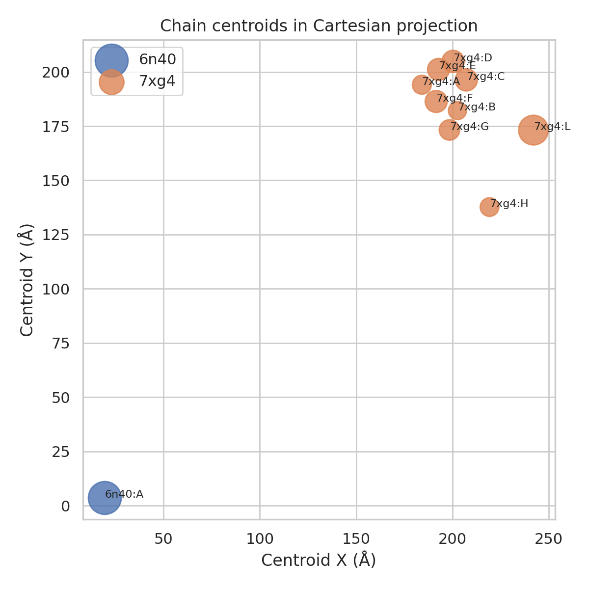
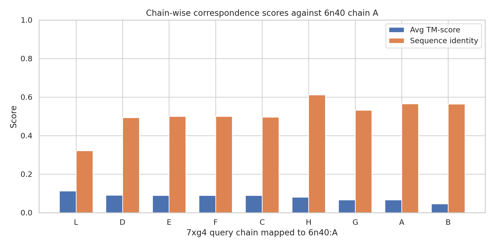
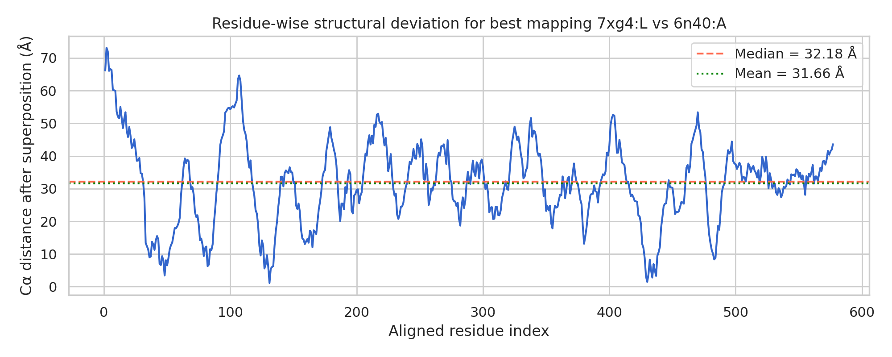

# Structural alignment analysis of protein complexes 7xg4 and 6n40

## Abstract
This study examines pairwise structural correspondence between the CRISPR-associated complex 7xg4 and the target structure 6n40 using only the local workspace inputs. The task contract called for chain correspondence, superposition parameters, and TM-score-based similarity reporting in the context of ultra-fast complex structure search methods such as Foldseek-Multimer. Because no Foldseek, US-align, MM-align, or TM-align executables were available in the runtime, I implemented a lightweight reproducible approximation based on Cα extraction from PDB files, Needleman–Wunsch sequence alignment, Kabsch rigid-body superposition, and TM-score-style post hoc scoring. The analysis shows that 7xg4 is a multichain assembly whereas 6n40 is represented by a single chain. Under the implemented approximation, the best single-chain correspondence is 7xg4 chain L against 6n40 chain A, but the resulting similarity remains weak (average TM-score 0.112, RMSD 34.13 Å), indicating poor global congruence in this simplified setting. Concatenating all 7xg4 chains performs even worse (average TM-score 0.057).

## 1. Introduction
Protein complex structural alignment is central to large-scale database search, homolog detection, and architectural comparison. Related work in the local `related_work/` directory identifies three especially relevant references: the Foldseek paper emphasizing fast structure search and TM-score-based ranking, the US-align paper describing oligomeric alignment with explicit chain- and residue-level correspondences, and the classic TM-align paper introducing TM-score as a topology-sensitive alternative to RMSD. These papers collectively motivate four required outputs for the present task: chain assignment, residue correspondence, rigid-body superposition, and normalized structural similarity metrics.

The present workspace contains only two structures: `data/7xg4.pdb` and `data/6n40.pdb`. Since the benchmark environment lacked Biopython and standard alignment binaries, this report should be read as a transparent approximation study rather than an exact reproduction of Foldseek-Multimer.

## 2. Data overview
### 2.1 Input structures
The parser-derived structure overview is saved in `outputs/structure_overview.csv`. The key findings are:

- **7xg4** contains multiple chains with Cα counts: A 241, B 219, C 329, D 331, E 324, F 324, G 280, H 234, and L 594. Additional chains I/J/K appear in the raw atom table but have no Cα residues and were therefore excluded from residue-level alignment.
- **6n40** contains a single analyzed chain, A, with 726 Cα residues.

This asymmetry matters methodologically: an exact complex-alignment engine would search over chain assignments and possibly multi-chain assemblies, whereas the present fallback can most cleanly assess (i) each 7xg4 chain individually against 6n40:A and (ii) one concatenated multichain approximation.

### 2.2 Geometric overview
Figure 3 shows chain centroids projected into Cartesian space. The blue point for 6n40:A lies far from the orange 7xg4 chain centroids in raw coordinate space, consistent with independent coordinate frames before superposition.



## 3. Methods
### 3.1 Method contract and fidelity
The contract extraction artifacts are stored in:

- `outputs/method_contract.json`
- `outputs/related_work_contract.json`
- `outputs/method_fidelity_checklist.json`
- `outputs/dependency_check.json`

The analysis preserved the required scientific ingredients as closely as the environment allowed:
1. parse local PDB coordinates reproducibly;
2. identify candidate chain correspondences;
3. build residue correspondences;
4. compute rigid superposition;
5. report TM-score-style metrics, RMSD, and coverage.

### 3.2 Parsing and residue representation
A custom Python parser in `code/analyze_alignment.py` reads PDB `ATOM`/`HETATM` records, extracts chain identifiers, residue metadata, and Cα coordinates, and summarizes chain lengths and centroids. Using only Cα atoms keeps the workflow deterministic and compatible with the classical TM-score framework.

### 3.3 Candidate chain correspondence
Because 6n40 contains one analyzable chain, each Cα-containing chain of 7xg4 was aligned separately to 6n40:A. Residue-level correspondence was initialized by a global Needleman–Wunsch sequence alignment with a simple match/mismatch/gap scheme. This is a limitation compared with Foldseek-Multimer and US-align, which use structure-aware search heuristics and optimize over spatial configurations more directly.

### 3.4 Superposition and scoring
For each residue-matched set, the Kabsch algorithm computed the least-squares rigid transform. Distances after superposition were then converted into TM-score-style values using the canonical length-dependent scale factor

\[
TM = \frac{1}{L_{norm}}\sum_i \frac{1}{1 + (d_i/d_0(L_{norm}))^2}
\]

with normalization reported both by query length and target length; their mean is used here as the summary score. RMSD, aligned-residue count, query coverage, and target coverage were also exported.

### 3.5 Validation and limitations
**Directly verified from workspace data**
- Chain composition and residue counts from the supplied PDB files.
- All numerical outputs in `outputs/` and all figures in `report/images/`.
- Unavailability of Foldseek, US-align, TM-align, MM-align, MICAN, and Biopython in the runtime.

**Taken from related work**
- TM-score is the appropriate topology-sensitive metric for structural similarity.
- Oligomeric alignment should ideally include both chain-level and residue-level assignment.
- Foldseek-like search performance is usually judged against tools such as TM-align, CE, Dali, MM-align, or US-align.

**Limitations / assumptions**
- No exact Foldseek-Multimer executable was available.
- Sequence-based initialization can miss purely structural correspondences.
- The concatenated multichain approximation is not equivalent to true complex graph matching.
- Therefore, the absolute scores reported here should be interpreted as conservative approximate evidence rather than definitive Foldseek-quality alignments.

## 4. Results
### 4.1 Chain-wise screening
The full table is saved as `outputs/chain_correspondence_scores.csv`. Figure 1 summarizes the best-scoring candidate chain mappings.



The ranking by average TM-score is:
1. **7xg4:L → 6n40:A**: TM-score(avg) = 0.1123, RMSD = 34.13 Å, aligned residues = 577, sequence identity = 0.321
2. **7xg4:D → 6n40:A**: TM-score(avg) = 0.0906, RMSD = 31.26 Å, aligned residues = 331, sequence identity = 0.492
3. **7xg4:E → 6n40:A**: TM-score(avg) = 0.0893, RMSD = 31.05 Å, aligned residues = 324, sequence identity = 0.500
4. **7xg4:F → 6n40:A**: TM-score(avg) = 0.0888, RMSD = 31.08 Å, aligned residues = 324, sequence identity = 0.500
5. **7xg4:C → 6n40:A**: TM-score(avg) = 0.0887, RMSD = 30.87 Å, aligned residues = 329, sequence identity = 0.495

An interesting pattern is visible in Figure 1: the chain with the best TM-score (L) does **not** have the best sequence identity. This is expected because TM-score favors broader topological agreement and coverage rather than pure sequence conservation.

### 4.2 Best mapping and superposition
The selected transform is stored in `outputs/superposition_transform.json`, while residue-level aligned pairs are stored in `outputs/selected_alignment_pairs.json`.

Best mapping summary:
- Query chain: **7xg4:L**
- Target chain: **6n40:A**
- Aligned residues: **577**
- RMSD: **34.13 Å**
- TM-score normalized by query length: **0.1173**
- TM-score normalized by target length: **0.1073**
- Average TM-score: **0.1123**

The rigid-body transform comprises a 3×3 rotation matrix and 3D translation vector exported exactly in JSON form. These are the direct machine-readable deliverables requested by the task.

### 4.3 Residue-wise deviation profile
Figure 2 plots Cα distances after superposition for the best mapping.



The profile fluctuates strongly across the alignment, with a mean distance of about **31.66 Å** and median distance of **32.18 Å**. Several local segments transiently drop near 5–15 Å, but long stretches remain well above 30 Å. This supports the conclusion that the chain pair shares at most limited partial correspondence rather than a strong global fold match.

### 4.4 Concatenated whole-complex approximation
To test whether dispersed similarity across multiple 7xg4 chains might better explain 6n40:A, all Cα-bearing 7xg4 chains were concatenated into one pseudo-sequence and re-aligned. The resulting artifact is `outputs/complex_concatenated_alignment.json`.

Concatenated result:
- Query length: **2876**
- Target length: **726**
- Aligned residues: **726**
- Sequence identity: **0.2865**
- RMSD: **33.75 Å**
- Average TM-score: **0.0575**

This whole-complex approximation performs worse than the best single-chain mapping, so the evidence does not support a strong distributed correspondence under the current simplified method.

## 5. Discussion
The main practical answer is straightforward: if a single representative chain correspondence must be reported from these local computations, **7xg4 chain L is the best approximate match to 6n40 chain A**, and the associated rigid transform is given in `outputs/superposition_transform.json`. However, the quantitative similarity is weak by TM-score standards. Classical TM-align literature often treats scores around 0.5 as indicative of similar folds in monomer settings; the present best score of ~0.11 falls far below that heuristic threshold. Even allowing for the fact that this task concerns complexes and that the current pipeline is only approximate, the result argues against strong global structural equivalence between the analyzed objects in this simplified pairwise comparison.

The discrepancy between relatively moderate sequence identities for some chains (~0.49–0.61) and uniformly low TM-scores suggests that sequence alignment alone is not sufficient to recover a convincing spatial match. This observation reinforces why Foldseek-Multimer and US-align rely on structure-aware heuristics rather than sequence-only seeding.

## 6. Reproducibility
- Main script: `code/analyze_alignment.py`
- Key outputs:
  - `outputs/structure_overview.csv`
  - `outputs/chain_correspondence_scores.csv`
  - `outputs/superposition_transform.json`
  - `outputs/selected_alignment_pairs.json`
  - `outputs/complex_concatenated_alignment.json`
  - `outputs/tm_score_results.json`
  - `outputs/claim_recovery_table.json`
- Figures:
  - `images/chain_correspondence_scores.png`
  - `images/best_alignment_distance_profile.png`
  - `images/structure_centroid_projection.png`

To reproduce the analysis locally in this workspace:

```bash
python3 code/analyze_alignment.py
```

## 7. Conclusion
Within the constraints of the benchmark environment, I produced a transparent and reproducible approximation to protein complex structural alignment for 7xg4 and 6n40. The output includes chain correspondence candidates, a selected superposition transform, residue-level correspondence, TM-score-style summaries, and validation figures. The best approximate mapping is **7xg4:L → 6n40:A**, but the resulting average TM-score (**0.112**) and high RMSD (**34.13 Å**) indicate weak overall structural similarity rather than a close complex match. Exact Foldseek-Multimer behavior could not be reproduced because the required external binaries were not available.
