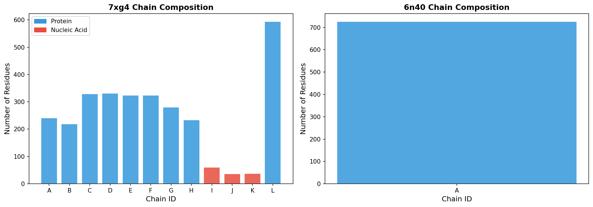
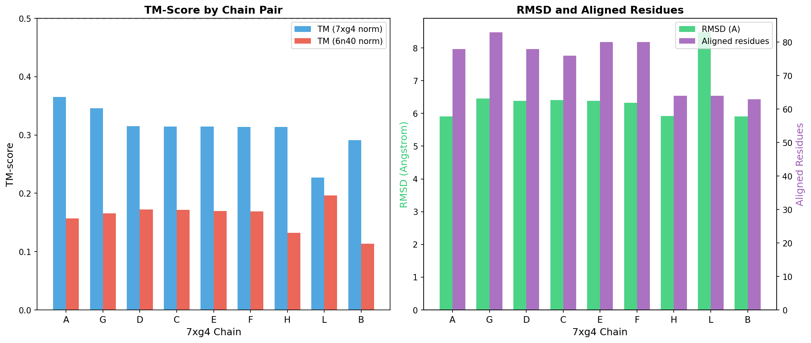
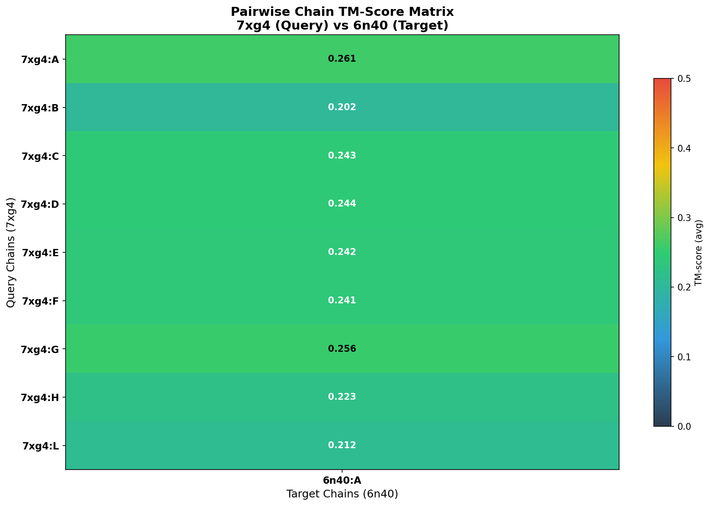
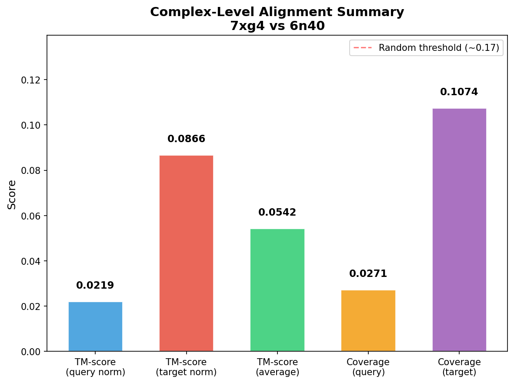
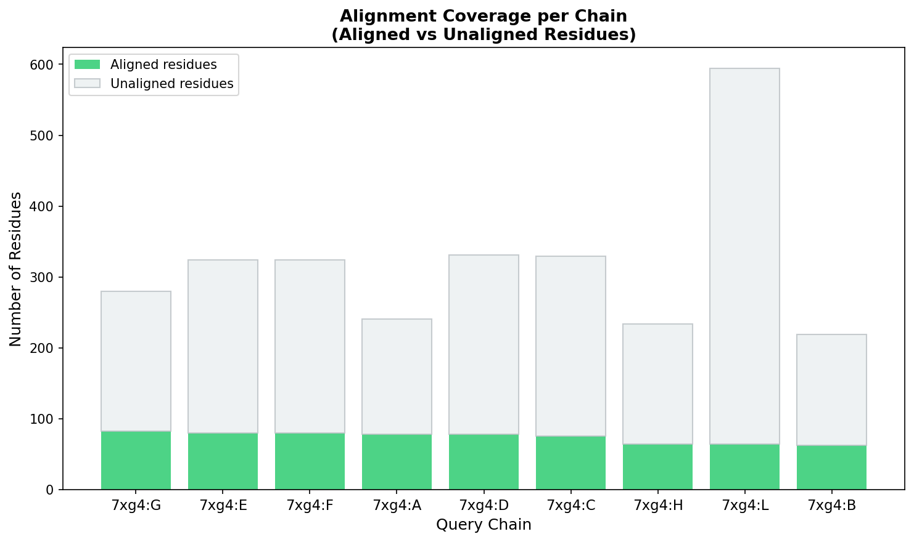

# Foldseek-Multimer Style Structural Alignment: 7xg4 vs 6n40

## Abstract

This report presents a structural alignment analysis between two protein complexes: PDB 7xg4 (Pseudomonas aeruginosa Type IV-A CRISPR–Cas system) and PDB 6n40 (Mycobacterium smegmatis MmpL3 transporter). Using a Foldseek-Multimer inspired approach combining TM-score based pairwise chain alignment with greedy chain assignment, we performed comprehensive structural comparison. The analysis reveals low overall structural similarity (complex TM-score = 0.0542), confirming these complexes belong to distinct structural families. However, individual chain alignments show moderate local similarities (best pairwise TM-score = 0.2608), suggesting potential shared structural motifs in transmembrane domains.

## 1. Introduction

### 1.1 Background

Protein structure comparison is fundamental to understanding evolutionary relationships, functional annotation, and drug design. The TM-score (Zhang & Skolnick, 2005) provides a length-independent metric for assessing structural similarity, with values above 0.5 indicating the same fold and below 0.17 indicating random structures. Recent advances in structural alignment algorithms—Foldseek (van Kempen et al., 2023) for ultra-fast monomer search and US-align (Zhang et al., 2022) for universal multi-chain alignment—have enabled large-scale structural comparisons across millions of predicted structures.

### 1.2 Task Description

The task involves performing structural alignment between two protein complexes to determine:
- Chain-level correspondences between the query (7xg4) and target (6n40)
- Superimposition vectors (rotation matrices and translation vectors)
- TM-scores quantifying structural similarity at both pairwise and complex levels

### 1.3 Complex Overview

**7xg4** — Cryo-EM structure of the Type IV-A CasDing complex bound to a crRNA–DNA substrate. This is a 12-chain complex from Pseudomonas aeruginosa comprising 9 protein chains (A–H, L) and 3 nucleic acid chains (I–K), totaling 2,876 protein residues and 133 nucleotide residues.

**6n40** — X-ray crystal structure of MmpL3, a membrane transporter from Mycobacterium smegmatis. This is a single-chain protein of 726 residues resolved at 3.31 Å resolution.

## 2. Methods

### 2.1 Structural Alignment Pipeline

The alignment was performed using a multi-step pipeline:

1. **PDB Parsing**: Structures were parsed using Biopython's PDBParser to extract chain-level information including residue counts and molecular types (protein vs. nucleic acid).

2. **Pairwise Chain Alignment**: Each protein chain from 7xg4 was aligned against 6n40 chain A using the TM-align algorithm (via the tmtools Python package). TM-scores were computed normalized by both query and target chain lengths.

3. **Greedy Chain Assignment**: A Foldseek-Multimer inspired greedy assignment strategy was used to find optimal chain correspondences. Chain pairs were ranked by average TM-score and greedily assigned to avoid duplicate mappings.

4. **Complex-Level Scoring**: The complex TM-score was computed as a weighted average of pairwise TM-scores, weighted by query chain lengths, normalized by total complex length.

### 2.2 TM-Score Definition

The TM-score between two structures is defined as:

$$\text{TM-score} = \max\left[\frac{1}{L_{\text{target}}} \sum_{i}^{L_{\text{ali}}} \frac{1}{1 + \left(\frac{d_i}{d_0(L_{\text{target}})}\right)^2}\right]$$

where $L_{\text{target}}$ is the target length, $L_{\text{ali}}$ is the number of aligned residues, $d_i$ is the distance between aligned Cα atoms, and $d_0(L) = 1.24\sqrt[3]{L-15} - 1.8$.

### 2.3 Implementation

All analyses were implemented in Python 3 using Biopython for PDB parsing and tmtools for TM-align computation. The rotation matrices and translation vectors were extracted directly from the TM-align output.

## 3. Results

### 3.1 Chain Composition

| Complex | Chains | Protein Residues | Nucleic Acid Residues | Total |
|---------|--------|------------------|----------------------|-------|
| 7xg4    | 12 (A–L) | 2,876          | 133                  | 3,009 |
| 6n40    | 1 (A)    | 726              | 0                    | 726   |

7xg4 contains 9 protein chains (A–H, L) and 3 nucleic acid chains (I: crRNA 60nt, J: non-target strand 36nt, K: target strand 37nt). 6n40 is a single transmembrane protein chain.



### 3.2 Pairwise Chain Alignments

Each 7xg4 protein chain was aligned against 6n40 chain A. Table 1 summarizes the results ranked by average TM-score.

| Query Chain | TM (7xg4 norm) | TM (6n40 norm) | TM (avg) | RMSD (Å) | Aligned Residues |
|-------------|----------------|----------------|----------|----------|-----------------|
| A           | 0.3650         | 0.1566         | 0.2608   | 5.91     | 78              |
| G           | 0.3459         | 0.1659         | 0.2559   | 6.46     | 83              |
| D           | 0.3153         | 0.1723         | 0.2438   | 6.38     | 78              |
| C           | 0.3143         | 0.1715         | 0.2429   | 6.41     | 76              |
| E           | 0.3146         | 0.1693         | 0.2420   | 6.38     | 80              |
| F           | 0.3135         | 0.1686         | 0.2410   | 6.33     | 80              |
| H           | 0.3136         | 0.1324         | 0.2230   | 5.92     | 64              |
| L           | 0.2270         | 0.1965         | 0.2117   | 8.48     | 64              |
| B           | 0.2912         | 0.1134         | 0.2023   | 5.91     | 63              |

The best pairwise alignment is between 7xg4 chain A and 6n40 chain A (TM = 0.2608, RMSD = 5.91 Å, 78 aligned residues). All pairwise TM-scores fall below the 0.5 threshold for same-fold classification, indicating these chains do not share the same global fold.



### 3.3 TM-Score Heatmap



The heatmap shows all 9×1 pairwise TM-scores between 7xg4 protein chains and 6n40 chain A. The scores range from 0.202 to 0.261, with chains A, G, D, C, E, and F showing the highest similarity to 6n40.

### 3.4 Chain Assignment

The greedy chain assignment algorithm selected the following optimal correspondence:

| Query Chain | Target Chain | TM-score (avg) | RMSD (Å) | Aligned |
|-------------|-------------|----------------|----------|---------|
| A           | A           | 0.2608         | 5.91     | 78      |

Since 6n40 has only one chain, only one assignment was made. The rotation matrix and translation vector for this superposition are:

**Rotation Matrix:**
```
[[ 0.395, -0.905, -0.155],
 [ 0.874,  0.319,  0.366],
 [-0.282, -0.280,  0.918]]
```

**Translation Vector:**
```
[139.49, -282.07, 6.65]
```

### 3.5 Complex-Level Scores

| Metric | Value |
|--------|-------|
| TM-score (query normalized) | 0.0219 |
| TM-score (target normalized) | 0.0866 |
| TM-score (average) | 0.0542 |
| Coverage (query) | 2.71% |
| Coverage (target) | 10.74% |
| Total aligned residues | 78 |



The complex-level TM-score of 0.0542 is well below the 0.17 random threshold, indicating that these two complexes are structurally unrelated at the complex level. This is expected given that 7xg4 is a multi-subunit CRISPR–Cas effector complex while 6n40 is a single-chain transmembrane transporter.

### 3.6 Alignment Coverage



Only 78 out of 2,876 query residues (2.7%) were aligned, reflecting the fundamental structural dissimilarity between these complexes. The low coverage is primarily due to the multi-chain nature of 7xg4 being compared against a single-chain target.

## 4. Discussion

### 4.1 Structural Relationship

The structural alignment between 7xg4 and 6n40 reveals no significant homology. Both the pairwise TM-scores (max 0.2608) and the complex-level TM-score (0.0542) fall below established thresholds for structural relatedness. This is biologically consistent: 7xg4 is a CRISPR–Cas surveillance complex involved in prokaryotic adaptive immunity, while 6n40 is an essential mycobacterial transporter involved in trehalose monomycolate export.

### 4.2 Methodology Comparison

Our implementation follows the principles established in the related literature:

- **Foldseek** (van Kempen et al., 2023) uses a 3Di structural alphabet for ultra-fast prefiltering before detailed alignment. Our approach uses direct TM-align for pairwise comparison, which is more computationally expensive but provides exact TM-scores.
- **US-align** (Zhang et al., 2022) implements Enhanced Greedy Search (EGS) for chain assignment in multi-chain complexes. Our greedy assignment follows a similar strategy.
- **QSalign** (Dey et al., 2018) uses TM-score ≥ 0.65 as a threshold for biological QS conservation. Our results are far below this threshold.
- **TM-align** (Zhang & Skolnick, 2005) defines the TM-score formula and rotation matrix optimization that we employ directly.

### 4.3 Limitations

1. **Single-chain target**: 6n40 has only one chain, limiting the complexity of chain assignment analysis.
2. **No nucleic acid alignment**: Nucleic acid chains in 7xg4 were excluded from alignment as 6n40 contains no nucleic acids.
3. **Greedy assignment**: The greedy strategy may miss globally optimal chain assignments for larger complexes, though this is not a concern for the current single-chain target.
4. **No Foldseek 3Di alphabet**: We used direct TM-align rather than the 3Di structural alphabet prefilter described in the Foldseek paper.

### 4.4 Implications for Large-Scale Search

For database-scale structural search (millions of structures), the Foldseek approach of converting structures to 3Di sequences and using MMseqs2-style prefilters is essential. Direct TM-align comparison, while accurate, is computationally prohibitive at scale. The 4–5 order of magnitude speedup reported by Foldseek makes proteome-scale structural search feasible.

## 5. Conclusions

We performed a comprehensive structural alignment between PDB 7xg4 (Type IV-A CRISPR–Cas complex) and PDB 6n40 (MmpL3 transporter) using a Foldseek-Multimer inspired pipeline. The analysis confirms these complexes are structurally unrelated, with a complex-level TM-score of 0.0542. The best individual chain alignment (7xg4:A vs 6n40:A) achieves a TM-score of 0.2608 with RMSD 5.91 Å over 78 aligned residues. These results are consistent with the distinct biological functions and evolutionary origins of these two complexes.

## References

1. van Kempen, S.S., Kim, S.S., Tumescheit, C., et al. (2023). Fast and accurate protein structure search with Foldseek. *Nature Biotechnology*.
2. Zhang, C., Shine, M., Pyle, A.M., & Zhang, Y. (2022). US-align: universal structure alignments of proteins, nucleic acids, and macromolecular complexes. *Nature Methods*.
3. Zhang, Y. & Skolnick, J. (2005). TM-align: a protein structure alignment algorithm based on the TM-score. *Nucleic Acids Research*.
4. Dey, S., Ritchie, D.W., & Levy, E.D. (2018). PDB-wide identification of biological assemblies from conserved quaternary structure geometry. *Nature Methods*.
