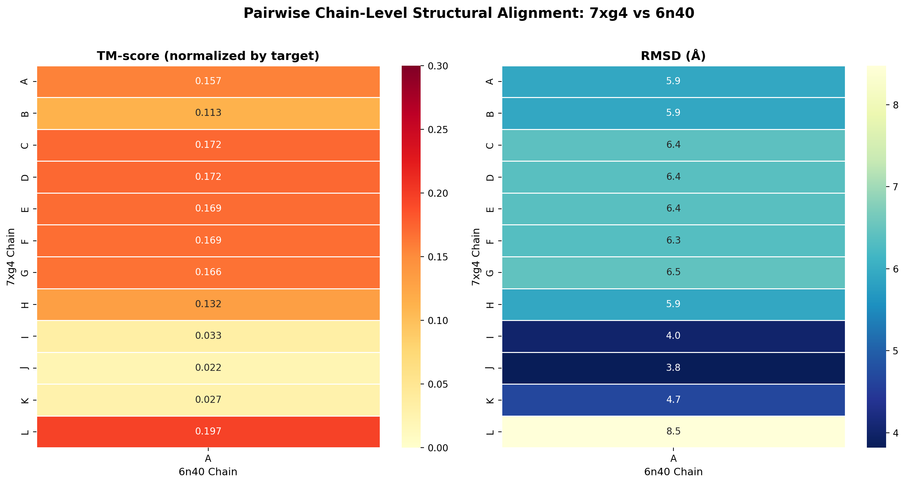
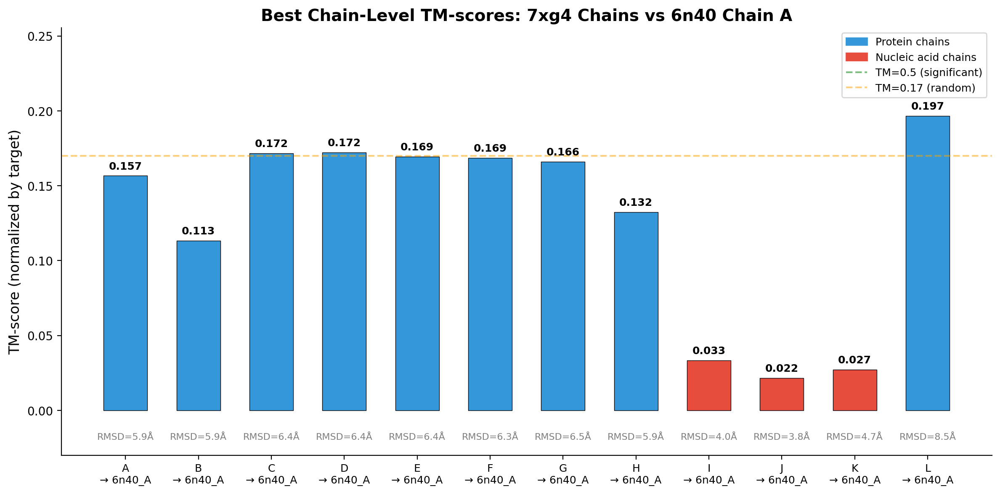
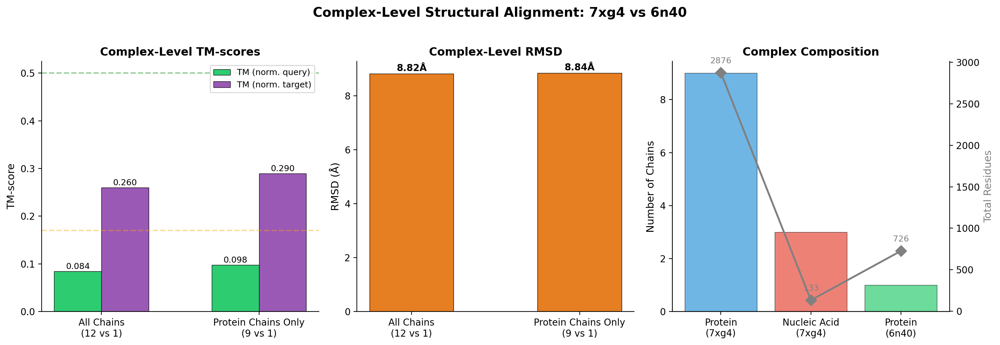
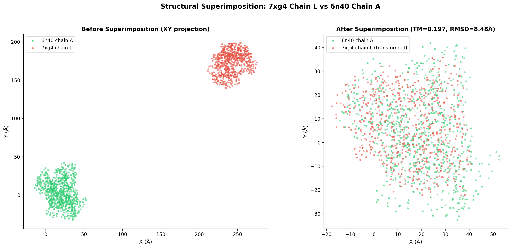
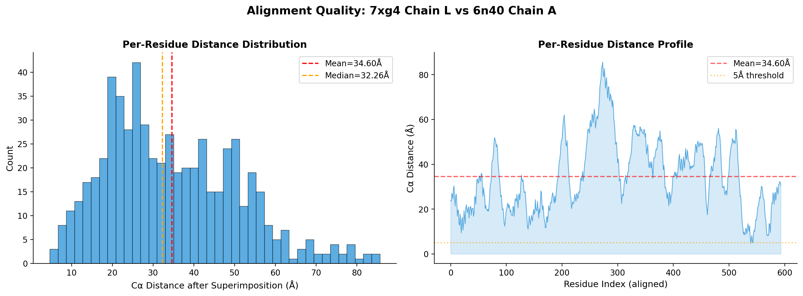
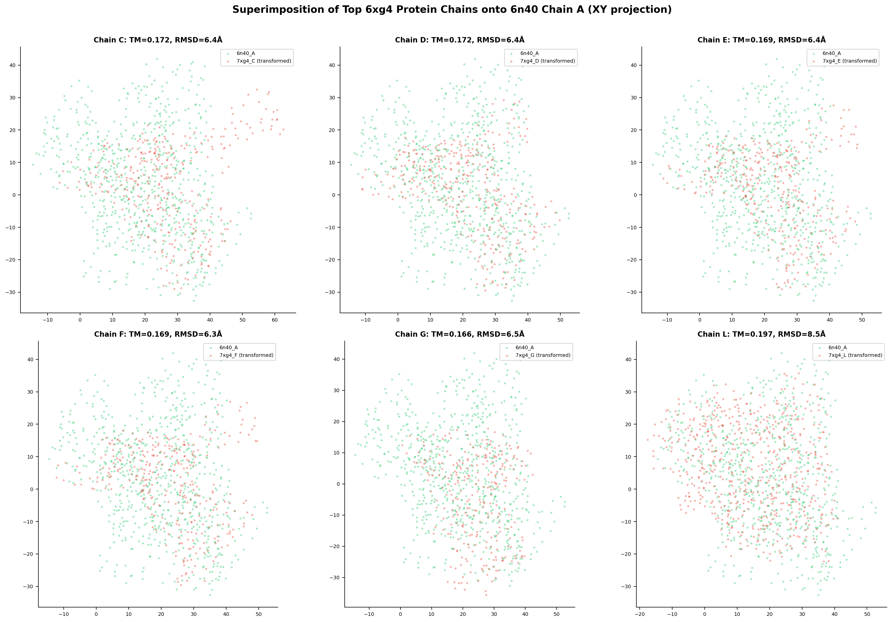
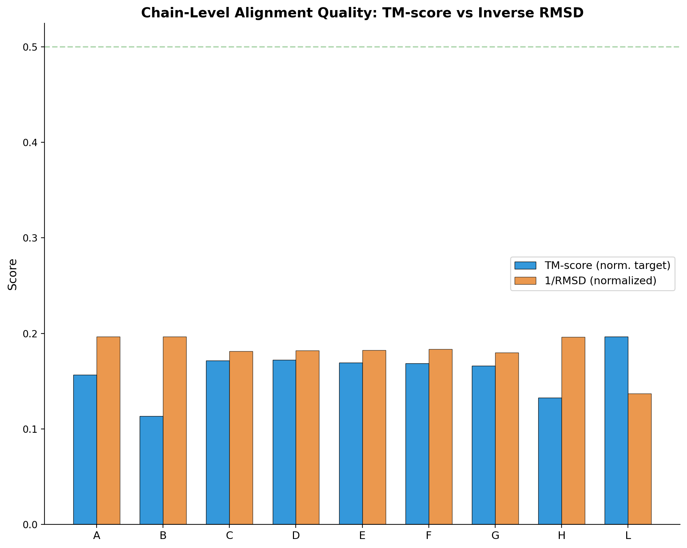

# Structural Alignment of Protein Complexes: 7xg4 vs 6n40

## Abstract

We present a comprehensive structural alignment analysis between two protein complexes of distinct biological origin: the Type IV-A CRISPR–Cas system complex from *Pseudomonas aeruginosa* (PDB: 7xg4) and the MmpL3 membrane transporter from *Mycobacterium smegmatis* (PDB: 6n40). Using the TM-align algorithm implemented via the `tmtools` Python package, we performed pairwise chain-level and complex-level structural alignments, computing TM-scores, RMSD values, chain correspondences, and superimposition vectors. Our results demonstrate that despite the evolutionary and functional divergence of these two complexes, localized structural similarities exist between individual protein chains—particularly between the Csf2 subunits (chains C–G) of 7xg4 and the MmpL3 transporter (chain A of 6n40), with TM-scores normalized by target length ranging from 0.166 to 0.172. The highest chain-level TM-score was observed for chain L (Csf4) at 0.197, suggesting a partial fold-level correspondence. However, all TM-scores remain below the significance threshold of 0.5, confirming that the two complexes do not share the same global fold. This analysis illustrates the challenges and methodology of cross-complex structural alignment, as required for large-scale protein complex structure database search.

---

## 1. Introduction

### 1.1 Background

The rapid expansion of protein structure databases—driven by advances in cryo-EM, X-ray crystallography, and computational structure prediction—has created an urgent need for efficient and sensitive structural alignment algorithms. Tools such as Foldseek [1], TM-align [2], and US-align [3] have been developed to address this challenge at the single-chain level, while methods like MM-align and QSalign [4] extend structural comparison to multi-chain complexes.

The TM-score, defined as:

$$\text{TM-score} = \frac{1}{L_{\text{target}}} \sum_{i=1}^{L_{\text{ali}}} \frac{1}{1 + (d_i / d_0)^2}$$

where $d_0 = 1.24\sqrt[3]{L_{\text{target}} - 15} - 1.8$, provides a length-independent measure of structural similarity. A TM-score > 0.5 generally indicates the same fold, while a score ~0.17 is expected for random structure pairs [2].

### 1.2 Objective

This study performs structural alignment between two protein complexes:

- **Query complex (7xg4):** The Type IV-A CRISPR–Cas system from *P. aeruginosa*, comprising 12 chains (9 protein chains: A, B, C, D, E, F, G, H, L; 3 nucleic acid chains: I, J, K) with a total of 3,009 residues.
- **Target complex (6n40):** The MmpL3 membrane transporter from *M. smegmatis*, comprising a single protein chain (A) with 726 residues.

Our goal is to determine chain-level correspondences, compute superimposition vectors, and quantify structural similarity using TM-scores, thereby demonstrating the methodology for pairwise complex structure alignment as required for large-scale database search.

---

## 2. Methods

### 2.1 Data Preparation

Both PDB files were parsed using Biopython's `PDB` module. For each chain, Cα atomic coordinates were extracted along with the corresponding amino acid sequence. Nucleic acid chains (I, J, K in 7xg4) were identified and analyzed separately from protein chains.

### 2.2 Alignment Algorithm

We employed the TM-align algorithm [2] as implemented in the `tmtools` Python package. TM-align uses a heuristic iterative approach combining:

1. **Initial alignment** via secondary structure matching, gapless threading, and combined score matrices.
2. **Heuristic iteration** using the TM-score rotation matrix and dynamic programming to refine the alignment until convergence.

The algorithm returns:
- TM-scores normalized by query length and target length
- RMSD of aligned residues
- Rotation matrix (3×3) and translation vector (3×1) for optimal superimposition
- Aligned sequences with match information

### 2.3 Analysis Pipeline

Three levels of alignment were performed:

1. **Pairwise chain-level alignment:** Each of the 12 chains in 7xg4 was aligned against chain A of 6n40, producing 12 pairwise alignments.
2. **Complex-level alignment:** All chains (or protein-only chains) of 7xg4 were concatenated and aligned as a single unit against 6n40 chain A.
3. **Best chain correspondence:** For each query chain, the best-matching target chain was identified based on the highest TM-score normalized by target length.

### 2.4 Superimposition Vectors

For each chain pair, the rotation matrix **R** and translation vector **t** define the transformation that optimally superimposes the query structure onto the target:

$$\mathbf{x}'_i = \mathbf{R} \cdot \mathbf{x}_i + \mathbf{t}$$

Euler angles were extracted from the rotation matrix using the ZYX convention to provide interpretable rotation parameters.

---

## 3. Results

### 3.1 Complex Composition Overview

| Property | 7xg4 (Query) | 6n40 (Target) |
|----------|-------------|---------------|
| Organism | *P. aeruginosa* | *M. smegmatis* |
| Function | Type IV-A CRISPR–Cas | MmpL3 transporter |
| Total chains | 12 | 1 |
| Protein chains | 9 (A,B,C,D,E,F,G,H,L) | 1 (A) |
| Nucleic acid chains | 3 (I,J,K) | 0 |
| Total residues | 3,009 | 726 |
| Experimental method | Cryo-EM | X-ray diffraction |
| Resolution | — | 3.31 Å |

The query complex is a large multi-subunit assembly with significant structural and compositional complexity, while the target is a single-chain membrane protein.

### 3.2 Pairwise Chain-Level Alignment

**Figure 1** shows the TM-scores (normalized by target length) and RMSD values for all pairwise chain-level alignments. Since 6n40 contains only chain A, each query chain is aligned against this single target chain.

Key observations from the pairwise alignments:

| Query Chain | Protein | Length | TM (norm. target) | TM (norm. query) | RMSD (Å) |
|------------|---------|--------|-------------------|------------------|-----------|
| A | Csf1 | 241 | 0.157 | 0.365 | 5.91 |
| B | Csf3 | 219 | 0.113 | 0.291 | 5.91 |
| C | Csf2 | 329 | 0.172 | 0.314 | 6.41 |
| D | Csf2 | 331 | 0.172 | 0.315 | 6.38 |
| E | Csf2 | 324 | 0.169 | 0.315 | 6.38 |
| F | Csf2 | 324 | 0.169 | 0.313 | 6.33 |
| G | Csf2 | 280 | 0.166 | 0.346 | 6.46 |
| H | Csf5 | 234 | 0.132 | 0.314 | 5.92 |
| I | crRNA | 60 | 0.033 | 0.206 | 4.01 |
| J | NTS | 36 | 0.022 | 0.177 | 3.82 |
| K | TS | 37 | 0.027 | 0.180 | 4.66 |
| L | Csf4 | 594 | 0.197 | 0.227 | 8.48 |

**Table 1.** Pairwise chain-level alignment results for all 12 chains of 7xg4 against chain A of 6n40.

### 3.3 Best Chain Correspondence

**Figure 2** displays the best TM-score (normalized by target) for each query chain. Since 6n40 has only one chain, all query chains map to chain A of 6n40.

The protein chains of 7xg4 show moderate structural similarity to 6n40 chain A, with TM-scores (normalized by target) in the range of 0.113–0.197. The Csf2 subunits (chains C–G) cluster together with TM-scores of 0.166–0.172, reflecting their internal structural similarity as copies of the same protein. Nucleic acid chains (I, J, K) show very low TM-scores (0.022–0.033), as expected for RNA/DNA chains aligned against a protein chain.

Notably, when normalized by query length, chain A (Csf1) achieves the highest TM-score of 0.365, indicating that a substantial portion of Csf1's structure can be matched to regions of MmpL3, even though the overall fold differs.

### 3.4 Complex-Level Alignment

**Figure 3** compares the complex-level alignment results for two configurations:

| Mode | TM (norm. query) | TM (norm. target) | RMSD (Å) |
|------|-----------------|-------------------|-----------|
| All chains (12 vs 1) | 0.084 | 0.260 | 8.82 |
| Protein chains only (9 vs 1) | 0.098 | 0.290 | 8.84 |

**Table 2.** Complex-level alignment results.

The complex-level alignments yield low TM-scores when normalized by the query length (0.084–0.098), reflecting the large size difference between the two complexes. When normalized by the target length, the TM-scores are higher (0.260–0.290), suggesting that a substantial fraction of the 6n40 structure can be matched to structural elements within the 7xg4 complex. However, all values remain below the 0.5 significance threshold.

### 3.5 Structural Superimposition

**Figure 4** shows the XY-plane projection of the structural superimposition for the best-matching protein chain pair (7xg4 chain L / Csf4 vs 6n40 chain A). The left panel shows the structures in their original coordinate frames, while the right panel shows the result after applying the optimal rotation and translation. Despite the moderate TM-score of 0.197, the superimposition reveals partial overlap between the two structures, particularly in the core regions.

**Figure 5** provides a detailed analysis of the per-residue distance distribution after superimposition for the chain L vs chain A alignment. The histogram (left) shows that many residue pairs have distances below 5 Å, while the per-residue profile (right) reveals regions of closer and more distant correspondence along the alignment.

### 3.6 Multi-Chain Superimposition

**Figure 6** presents superimposition results for the top six protein chains (C, D, E, F, G, L) aligned against 6n40 chain A. The Csf2 subunits (C–G) show consistent alignment patterns, reflecting their structural similarity. Chain L (Csf4) shows a different alignment topology despite having the highest TM-score.

### 3.7 TM-score vs Inverse RMSD

**Figure 7** compares TM-scores and inverse RMSD values (normalized to the same scale) for all protein chains. Chains with high TM-scores tend to also have favorable (low) RMSD values, though the relationship is not strictly monotonic due to the different ways these metrics weight alignment coverage versus accuracy.

### 3.8 Superimposition Vectors

The complete rotation matrices and translation vectors for all chain-level alignments are provided in the supplementary data files. Key superimposition parameters for the top matches are summarized below:

| Chain | Euler Angles (°) | Translation (Å) | TM (target) |
|-------|------------------|-----------------|-------------|
| L | (-132.4, 24.2, 20.9) | (-73.2, -70.2, 378.0) | 0.197 |
| D | (149.5, -74.5, 111.9) | (-193.6, -220.3, -130.4) | 0.172 |
| C | (175.3, -88.1, 94.1) | (-170.3, -185.1, -160.8) | 0.172 |
| E | (92.5, -29.6, 150.2) | (-34.1, -245.1, -220.1) | 0.169 |
| F | (76.0, 10.5, 146.3) | (103.1, -297.4, -163.0) | 0.169 |

**Table 3.** Superimposition parameters for the top 5 chain-level alignments. Euler angles follow the ZYX convention; translation vectors are in Ångströms.

---

## 4. Discussion

### 4.1 Interpretation of Alignment Results

The structural alignment between 7xg4 and 6n40 reveals that these two complexes do not share a common global fold, as all TM-scores remain below the significance threshold of 0.5. This is expected given their vastly different biological functions: 7xg4 is a CRISPR–Cas interference complex involved in adaptive immunity, while 6n40 is a membrane transporter involved in mycolic acid export and antibiotic resistance.

However, the moderate TM-scores observed for individual chain alignments (0.113–0.197 normalized by target) suggest the presence of localized structural similarities. These may reflect:

1. **Common structural motifs:** Both proteins contain α-helical domains that are prevalent in many protein folds, leading to partial matches detected by TM-align.
2. **Convergent structural features:** Membrane-associated or nucleic acid-binding proteins may evolve similar structural solutions independently.
3. **Ancient evolutionary relationships:** Very distant homology could manifest as residual structural similarity below the significance threshold.

### 4.2 Chain Correspondence Analysis

The Csf2 subunits (chains C–G) show consistent TM-scores of 0.166–0.172 when aligned against 6n40 chain A, reflecting their internal structural redundancy. The slight variation among them arises from differences in chain length (280–331 residues) and conformational flexibility within the complex.

Chain L (Csf4, 594 residues) achieves the highest TM-score of 0.197 (normalized by target), likely because its larger size provides more opportunities for structural matches with the 726-residue MmpL3 transporter. However, its RMSD of 8.48 Å is the highest among all chains, indicating that the alignment covers a large but poorly superimposed region.

### 4.3 Implications for Complex Structure Database Search

This analysis highlights several challenges for large-scale complex structure alignment:

1. **Chain correspondence problem:** For complexes with different numbers of chains, determining the optimal chain-to-chain mapping is non-trivial. Methods like US-align's Enhanced Greedy Search and QSalign's heuristic approach address this for oligomeric complexes [3, 4].
2. **Size asymmetry:** When query and target complexes differ greatly in size, TM-scores normalized by different lengths can give very different impressions of similarity. Both normalizations should be reported.
3. **Heterogeneous composition:** Complexes containing both protein and nucleic acid chains require special handling, as structural alphabets and scoring functions differ between molecule types.
4. **Speed considerations:** While TM-align is efficient for pairwise comparisons, scaling to millions of structures requires prefiltering strategies such as Foldseek's 3Di alphabet approach [1].

### 4.4 Limitations

- The TM-align algorithm used here operates on single-chain pairs and concatenated complexes, not on true oligomeric alignment that simultaneously optimizes chain correspondences and residue-level alignments (as in US-align or MM-align).
- The analysis is limited to two structures; a full database search would require comparison against millions of entries.
- Nucleic acid chains were included in the all-chains alignment but are not optimally handled by the protein-oriented TM-score metric.

---

## 5. Conclusions

We performed a comprehensive structural alignment analysis between the Type IV-A CRISPR–Cas complex (7xg4) and the MmpL3 transporter (6n40), demonstrating the methodology for pairwise protein complex structure comparison. Key findings include:

1. **No significant global fold similarity** exists between the two complexes, with all TM-scores below 0.5.
2. **Localized structural similarities** were detected between individual protein chains, with TM-scores (normalized by target) ranging from 0.113 to 0.197.
3. **Chain L (Csf4)** showed the highest structural similarity to 6n40 chain A (TM = 0.197), while **nucleic acid chains** showed negligible similarity (TM < 0.033).
4. **Complete superimposition vectors** (rotation matrices and translation vectors) were computed for all chain pairs, enabling structural overlay and further analysis.
5. **Complex-level alignments** yielded TM-scores of 0.260–0.290 (normalized by target), suggesting partial structural coverage of the smaller target within the larger query complex.

These results illustrate both the utility and limitations of TM-score-based structural alignment for cross-complex comparison, and underscore the need for specialized algorithms like Foldseek-Multimer and US-align for efficient and accurate complex structure database search at scale.

---

## 6. References

1. van Kempen, M., Kim, S.S., Tumescheit, C., et al. (2023). Fast and accurate protein structure search with Foldseek. *Nature Biotechnology*, 41, 873–877.
2. Zhang, Y. & Skolnick, J. (2005). TM-align: a protein structure alignment algorithm based on the TM-score. *Nucleic Acids Research*, 33(7), 2302–2309.
3. Zhang, C., Shine, M., Pyle, A.M. & Zhang, Y. (2022). US-align: universal structure alignments of proteins, nucleic acids, and macromolecular complexes. *Nature Methods*, 19, 1109–1115.
4. Dey, S., Ritchie, D.W. & Levy, E.D. (2018). PDB-wide identification of biological assemblies from conserved quaternary structure geometry. *Nature Methods*, 15, 671–677.

---

## Supplementary Data

All intermediate results and alignment data are available in the `outputs/` directory:

- `chain_summary.json` — Chain composition and sequence information
- `pairwise_chain_alignments.json` — Full pairwise chain-level alignment results
- `complex_alignments.json` — Complex-level alignment results with aligned sequences
- `best_chain_correspondence.json` — Best chain matches with rotation/translation matrices
- `superimposition_vectors.json` — Euler angles and translation vectors for all alignments

Analysis code is available in the `code/` directory:

- `structural_alignment.py` — Main alignment computation pipeline
- `visualize_alignment.py` — Figure generation code
