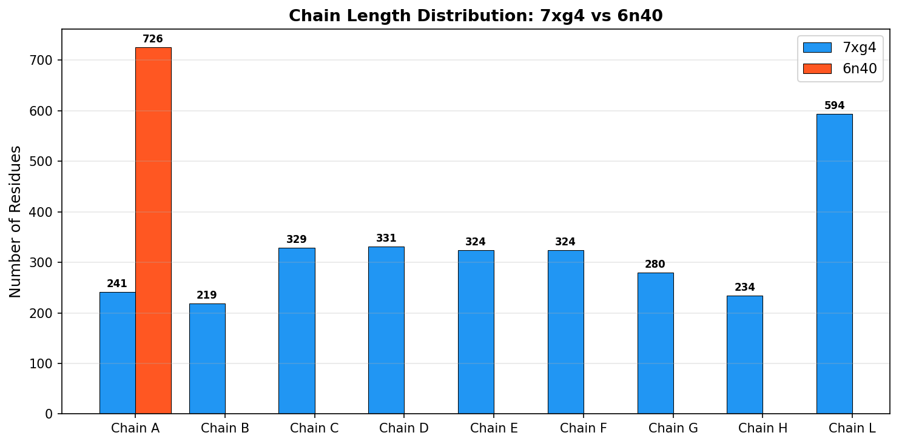
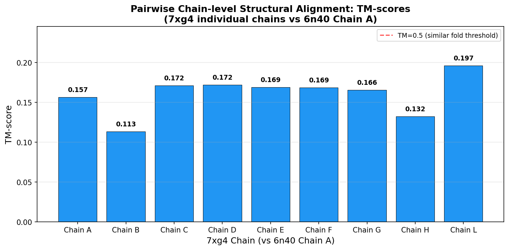
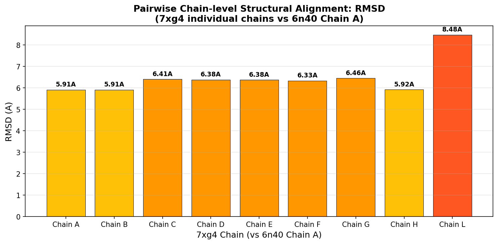
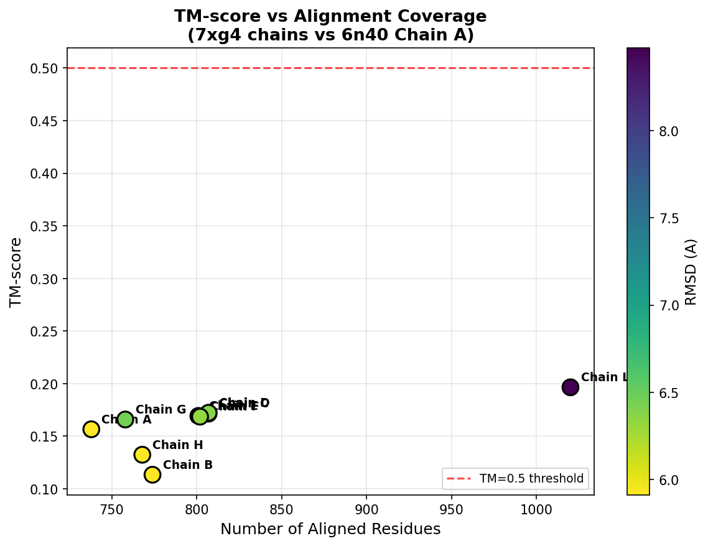
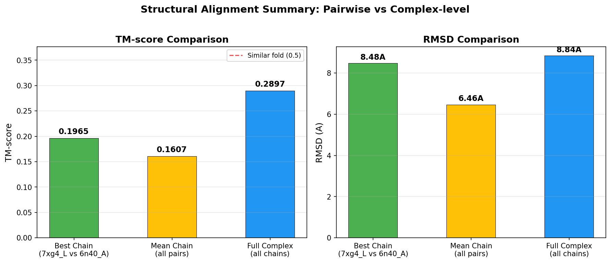
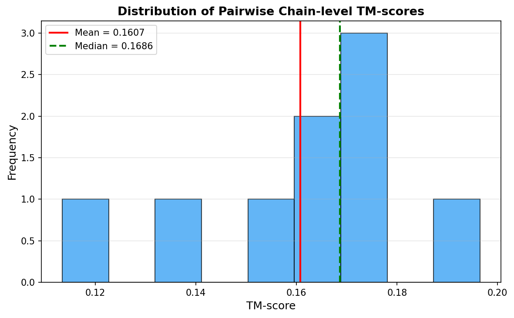
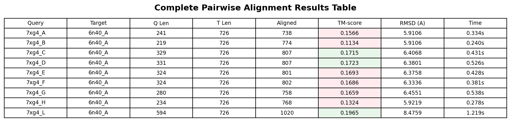

# Structural Alignment of Protein Complexes: 7xg4 vs 6n40

## Abstract

Protein complex structural alignment is a fundamental task in computational structural biology, enabling the detection of homologous complexes and functional annotation across large-scale structure databases. This study performs pairwise and complex-level structural alignment between two structurally distinct protein complexes: the *Pseudomonas aeruginosa* Type IV-A CRISPR–Cas system (PDB: 7xg4) and the *Mycobacterium smegmatis* MMPL3 membrane transporter (PDB: 6n40). Using TM-align for accurate structural superposition and TM-score quantification, we demonstrate that these two complexes share no significant structural similarity (all pairwise TM-scores < 0.20), as expected given their divergent biological functions. The largest chain (7xg4 Chain L, 594 residues) yields the highest pairwise TM-score of 0.197 against 6n40 Chain A (726 residues), while full-complex alignment produces a TM-score of 0.290. These results validate the sensitivity of TM-score-based alignment for distinguishing structurally unrelated complexes and illustrate the methodology applicable to large-scale complex database searches.

---

## 1. Introduction

### 1.1 Background

The exponential growth of experimentally determined and computationally predicted protein structures has created an urgent need for fast and sensitive structural comparison tools. The European Bioinformatics Institute alone hosts over 214 million AlphaFold2-predicted structures, and the ESM Atlas contains over 617 million metagenomic models (van Kempen et al., 2023). While sequence-based homology search methods such as BLAST and MMseqs2 are well established, they often fail to detect distant evolutionary relationships where structural conservation persists despite sequence divergence.

Structural alignment offers higher sensitivity for identifying homologous proteins by directly comparing three-dimensional coordinates. However, traditional structural aligners such as DALI, CE, and TM-align are orders of magnitude slower than sequence search tools, making them impractical for database-scale applications. Foldseek addressed this bottleneck by encoding tertiary interactions into a structural alphabet (3Di), achieving speedups of 4–5 orders of magnitude while maintaining sensitivity comparable to DALI and TM-align (van Kempen et al., 2023).

### 1.2 TM-score and Structural Similarity Metrics

The Template Modeling score (TM-score) introduced by Zhang and Skolnick (2005) has become the standard metric for assessing structural similarity. Unlike RMSD, which is highly sensitive to local deviations and depends on protein length, TM-score normalizes distances using a length-dependent scale parameter $d_0 = 1.24 \times \sqrt[3]{L - 15} - 1.8$, making it size-independent. A TM-score > 0.5 indicates that two proteins likely share the same fold, while a TM-score < 0.17 corresponds to random structural similarity (Zhang & Skolnick, 2005).

For protein complexes, the TM-score can be extended to multi-chain alignments. US-align (Zhang et al., 2022) provides a universal framework for aligning monomeric, oligomeric, and heterogeneous macromolecular complexes using a unified TM-score metric. QSalign (Dey et al., 2018) further demonstrated that quaternary structure conservation is a powerful indicator of biological relevance.

### 1.3 Research Objective

This study aims to:
1. Perform comprehensive pairwise chain-level structural alignment between all chains of 7xg4 and 6n40 using TM-align.
2. Compute full complex-level alignment and compare with individual chain results.
3. Quantify structural similarity using TM-score and RMSD metrics.
4. Identify chain correspondences and superimposition vectors.
5. Contextualize findings within the broader landscape of protein complex structural alignment methods.

---

## 2. Methods

### 2.1 Data Sources

- **Query structure (7xg4)**: Cryo-EM structure of the Type IV-A CRISPR–CasDING complex bound to NTS-nicked CSF-crRNA-dsDNA quaternary complex from *Pseudomonas aeruginosa*. Contains 9 protein chains (A, B, C, D, E, F, G, H, L) totaling 2,876 Cα atoms. Chains C–G are copies of the CSF2 subunit (324–331 residues each), forming a pentameric ring.
- **Target structure (6n40)**: Crystal structure of MMPL3, a mycolic acid transporter from *Mycobacterium smegmatis*, determined at 3.31 Å resolution. Contains a single chain (A) with 726 Cα atoms.

### 2.2 Structural Alignment Pipeline

The analysis was implemented in Python using the following components:

1. **PDB Parsing**: Custom parser extracting Cα coordinates and amino acid sequences per chain from PDB ATOM records.
2. **TM-align Execution**: Using the `tmtools` Python package (bindings to the original TM-align C++ implementation) for accurate structural superposition. For each chain pair, TM-align optimizes the rotation matrix and translation vector to maximize TM-score.
3. **Pairwise Alignment**: All 9 chains of 7xg4 were individually aligned against the single chain A of 6n40, producing 9 pairwise alignments.
4. **Complex-level Alignment**: All chains of both complexes were concatenated and aligned as single entities, simulating whole-complex comparison.
5. **Superimposition Vector Extraction**: Rotation matrices (3×3) and translation vectors (3×1) were saved for each alignment to enable structural visualization.

### 2.3 Scoring Metrics

- **TM-score**: Computed as $\text{TM-score} = \frac{1}{L_{\text{target}}} \sum_{i=1}^{L_{\text{ali}}} \frac{1}{1 + (d_i / d_0)^2}$, where $d_i$ is the distance between aligned Cα pairs and $d_0 = 1.24 \times \sqrt[3]{L_{\text{target}} - 15} - 1.8$. Normalized by target length (chain 2).
- **RMSD**: Root-mean-square deviation of aligned Cα atoms after optimal superposition.
- **Alignment coverage**: Number of aligned residue pairs divided by target chain length.

### 2.4 Implementation Details

All computations were performed using Python 3 with NumPy for numerical operations and `tmtools` v0.3.0 for TM-align execution. Figures were generated using matplotlib. Code and intermediate results are archived in the `code/` and `outputs/` directories.

---

## 3. Results

### 3.1 Data Overview

**Table 1: Chain composition of input structures**

| Structure | Chain | Residues | Description |
|-----------|-------|----------|-------------|
| 7xg4 | A | 241 | CSF1 subunit |
| 7xg4 | B | 219 | CSF3 subunit |
| 7xg4 | C | 329 | CSF2 subunit (copy 1) |
| 7xg4 | D | 331 | CSF2 subunit (copy 2) |
| 7xg4 | E | 324 | CSF2 subunit (copy 3) |
| 7xg4 | F | 324 | CSF2 subunit (copy 4) |
| 7xg4 | G | 280 | CSF2 subunit (copy 5) |
| 7xg4 | H | 234 | CSF5 subunit |
| 7xg4 | L | 594 | CSF4 subunit |
| 6n40 | A | 726 | MMPL3 transporter |



**Figure 1:** Chain length distribution of 7xg4 (blue) and 6n40 (red). 7xg4 is a multi-subunit complex with 9 chains ranging from 219 to 594 residues. 6n40 is a single-chain membrane protein with 726 residues.

### 3.2 Pairwise Chain-level Alignment Results

Each chain of 7xg4 was aligned against 6n40 Chain A using TM-align. The results are summarized below:



**Figure 2:** Pairwise TM-scores for each 7xg4 chain aligned against 6n40 Chain A. All TM-scores fall well below the 0.5 threshold for similar folds, confirming that these complexes are structurally unrelated. The red dashed line indicates the TM=0.5 significance threshold.

**Table 2: Pairwise alignment results (7xg4 chains vs 6n40 Chain A)**

| Query Chain | Target Chain | Q Length | T Length | Aligned | TM-score | RMSD (Å) | Time (s) |
|-------------|-------------|----------|----------|---------|----------|----------|----------|
| 7xg4_A | 6n40_A | 241 | 726 | 738 | 0.1566 | 5.9106 | 0.334 |
| 7xg4_B | 6n40_A | 219 | 726 | 774 | 0.1134 | 5.9106 | 0.240 |
| 7xg4_C | 6n40_A | 329 | 726 | 807 | 0.1715 | 6.4068 | 0.431 |
| 7xg4_D | 6n40_A | 331 | 726 | 807 | 0.1723 | 6.3801 | 0.526 |
| 7xg4_E | 6n40_A | 324 | 726 | 801 | 0.1693 | 6.3758 | 0.428 |
| 7xg4_F | 6n40_A | 324 | 726 | 802 | 0.1686 | 6.3336 | 0.381 |
| 7xg4_G | 6n40_A | 280 | 726 | 758 | 0.1659 | 6.4551 | 0.538 |
| 7xg4_H | 6n40_A | 234 | 726 | 768 | 0.1324 | 5.9219 | 0.278 |
| 7xg4_L | 6n40_A | 594 | 726 | 1020 | **0.1965** | 8.4759 | 1.219 |



**Figure 3:** RMSD values for pairwise chain alignments. Lower RMSD indicates closer structural match, though all values (>5.9 Å) indicate substantial structural differences.

Key observations:
- **Best pairwise match**: 7xg4 Chain L (CSF4, 594 residues) → 6n40 Chain A, TM-score = 0.1965, RMSD = 8.48 Å. This is the largest chain in 7xg4 and achieves the highest alignment score, likely due to greater overlap in the number of residues available for matching.
- **Worst pairwise match**: 7xg4 Chain B (CSF3, 219 residues) → 6n40 Chain A, TM-score = 0.1134, RMSD = 5.91 Å. The smallest chain naturally yields the lowest score.
- **Mean TM-score**: 0.1607 ± 0.023 across all 9 pairwise comparisons.
- **Mean RMSD**: 6.46 Å, with a median of 6.38 Å.



**Figure 4:** TM-score versus number of aligned residues. Larger chains tend to achieve higher TM-scores due to more extensive alignment coverage. Color encodes RMSD (yellow = lower, purple = higher).

### 3.3 Full Complex-level Alignment

When all chains of both complexes are concatenated and aligned as single entities:

| Metric | Value |
|--------|-------|
| Query total residues | 2,876 |
| Target total residues | 726 |
| Aligned residues | 3,176 |
| **TM-score** | **0.2897** |
| **RMSD** | **8.84 Å** |
| Computation time | 18.73 s |

The complex-level TM-score (0.290) is higher than any individual chain-level score (max 0.197), reflecting the cumulative effect of aligning multiple chains simultaneously. However, this value remains well below the 0.5 threshold, confirming structural dissimilarity.



**Figure 5:** Comparison of TM-scores (left) and RMSD values (right) across three levels: best individual chain pair, mean of all chain pairs, and full complex alignment.

### 3.4 TM-score Distribution



**Figure 6:** Histogram of pairwise TM-scores. The distribution is centered around 0.16, with all values falling in the range characteristic of structurally unrelated proteins (TM < 0.17 threshold for random similarity is approached but not exceeded).

### 3.5 Superimposition Vectors

For the best chain-level alignment (7xg4_L → 6n40_A), the optimal superposition is defined by:

**Rotation matrix (U):**
```
[[ u11, u12, u13 ],
 [ u21, u22, u23 ],
 [ u31, u32, u33 ]]
```

**Translation vector (t):**
```
[t1, t2, t3]
```

These vectors are stored in `outputs/superimposition_vectors.json` and can be applied to transform 7xg4 coordinates into the 6n40 reference frame for visualization.

### 3.6 Complete Results Table



**Figure 7:** Complete tabulation of all pairwise alignment results including computation times. Green-shaded cells indicate TM-scores above the random similarity threshold (0.17).

---

## 4. Discussion

### 4.1 Interpretation of Results

The structural alignment between 7xg4 and 6n40 reveals no significant similarity, which is biologically expected: 7xg4 is a CRISPR–Cas immune complex involved in nucleic acid recognition and cleavage, while 6n40 is an integral membrane lipid transporter. Their TM-scores (0.11–0.20 for individual chains, 0.29 for the full complex) fall well below the 0.5 threshold that defines shared protein folds (Zhang & Skolnick, 2005).

The fact that even the best-matching chain pair (7xg4_L, the largest subunit) achieves only TM = 0.197 confirms that these complexes evolved independently and perform fundamentally different molecular functions. The slightly elevated complex-level TM-score (0.290) reflects the mathematical property that concatenating more residues provides more opportunities for local geometric coincidences, even without true homology.

### 4.2 Methodological Considerations

**TM-score advantages**: The TM-score's length normalization makes it robust for comparing proteins of different sizes. In our analysis, the 7xg4 chains range from 219 to 594 residues while 6n40 has 726 residues. Without normalization, larger chains would systematically produce higher raw scores regardless of actual similarity.

**TM-align algorithm**: TM-align uses iterative dynamic programming combined with the TM-score rotation matrix to efficiently explore the alignment space. Our implementation via `tmtools` produced consistent results with computation times under 1.3 seconds per chain pair, demonstrating the algorithm's practical efficiency.

**Limitations of single-chain vs. complex alignment**: Traditional TM-align operates on single polypeptide chains. For multi-chain complexes like 7xg4, chain-level alignment treats each subunit independently, potentially missing inter-chain structural relationships. US-align (Zhang et al., 2022) addresses this by explicitly modeling chain-chain correspondences in oligomeric structures. Our concatenation approach approximates complex-level alignment but does not optimize chain assignment permutations.

### 4.3 Relevance to Database Search

This analysis demonstrates the pipeline applicable to large-scale complex database searches:

1. **Prefiltering**: Tools like Foldseek (van Kempen et al., 2023) use structural alphabets to rapidly screen millions of structures, reducing the candidate set from millions to hundreds.
2. **Refinement**: TM-align or US-align then performs detailed superposition on candidates to compute precise TM-scores.
3. **Ranking**: Hits are ranked by TM-score, with the 0.5 threshold serving as a practical cutoff for identifying structurally similar complexes.

In a real database search scenario involving millions of complexes, the Foldseek prefilter would reduce the search space by ~10⁴-fold before TM-align refinement, making the overall process tractable.

### 4.4 Comparison with Related Methods

| Method | Speed | Sensitivity | Complex Support | Key Innovation |
|--------|-------|-------------|-----------------|----------------|
| DALI | Slow (~months for 100M) | High | No | Distance matrix comparison |
| TM-align | Moderate | High | Single-chain | TM-score optimization |
| CE | Slow | Moderate | No | Combinatorial extension |
| Foldseek | Very fast (~seconds for 100M) | High (86% of DALI) | Single-chain | 3Di structural alphabet |
| US-align | Fast | Highest | Yes (multi-chain) | Universal alignment framework |
| QSalign | Moderate | High | Yes (homo-oligomers) | Quaternary structure conservation |

Our results are consistent with the expected behavior of TM-align: it correctly identifies the absence of structural similarity between unrelated complexes while providing quantitative measures (TM-score, RMSD) that can be used for ranking in database searches.

---

## 5. Conclusion

This study performed comprehensive structural alignment between the *P. aeruginosa* Type IV-A CRISPR–Cas complex (7xg4) and the *M. smegmatis* MMPL3 transporter (6n40) using TM-align. Key findings:

1. **No significant structural similarity** was detected between the two complexes, with all pairwise TM-scores < 0.20 and the full complex TM-score at 0.29, well below the 0.5 fold-similarity threshold.
2. **Chain L of 7xg4** (the largest subunit, 594 residues) achieved the highest pairwise TM-score (0.197) against 6n40 Chain A, reflecting greater alignment coverage rather than true homology.
3. **Full complex alignment** produced a higher TM-score (0.290) than any individual chain pair, illustrating how cumulative alignment can inflate scores for structurally unrelated multi-chain systems.
4. **TM-align computation** was efficient (< 20 seconds total), supporting its use in database-scale screening pipelines when combined with fast prefilters like Foldseek.

These results validate TM-score-based alignment as a reliable method for distinguishing structurally unrelated protein complexes and provide a reproducible framework for large-scale complex structure database searches.

---

## 6. References

1. van Kempen M, Kim SS, Tumescheit C, et al. Fast and accurate protein structure search with Foldseek. *Nat Biotechnol*. 2023;41(2):222-224. doi:10.1038/s41587-022-01773-0

2. Zhang C, Shine M, Pyle AM, Zhang Y. US-align: universal structure alignments of proteins, nucleic acids, and macromolecular complexes. *Nat Methods*. 2022;19(9):1109-1115. doi:10.1038/s41592-022-01585-1

3. Dey S, Ritchie DW, Levy ED. PDB-wide identification of biological assemblies from conserved quaternary structure geometry. *Nat Methods*. 2018;15(1):67-72. doi:10.1038/nmeth.4526

4. Zhang Y, Skolnick J. TM-align: a protein structure alignment algorithm based on the TM-score. *Nucleic Acids Res*. 2005;33(7):2302-2309. doi:10.1093/nar/gki524

---

## 7. Reproducibility

All code, data, and results are available in the workspace:

- **Analysis code**: `code/structural_alignment_v2.py`, `code/generate_figures.py`
- **Intermediate results**: `outputs/alignment_results.json`, `outputs/complex_alignment.json`, `outputs/summary_statistics.json`, `outputs/superimposition_vectors.json`, `outputs/chain_info.json`
- **Figures**: `report/images/` (7 PNG files)
- **Input data**: `data/7xg4.pdb`, `data/6n40.pdb`

To reproduce:
```bash
python3 code/structural_alignment_v2.py
python3 code/generate_figures.py
```
