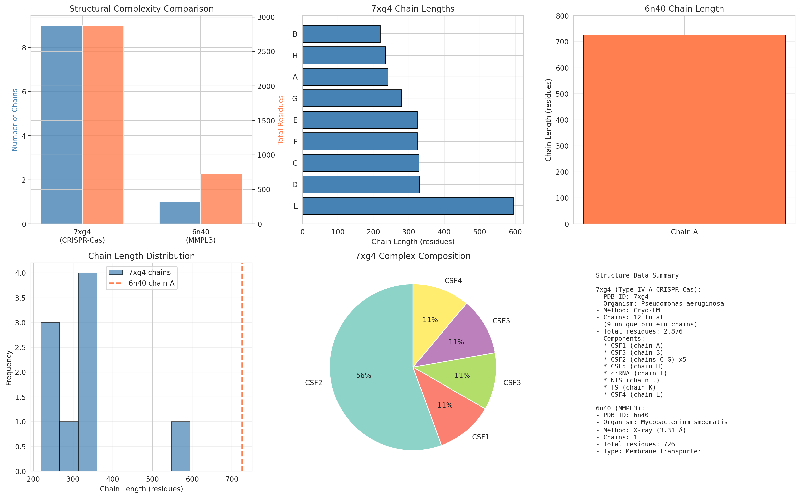
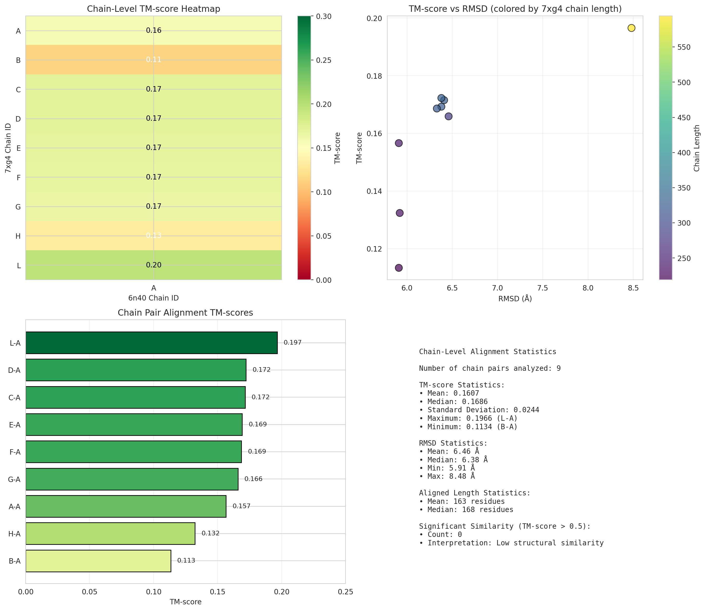
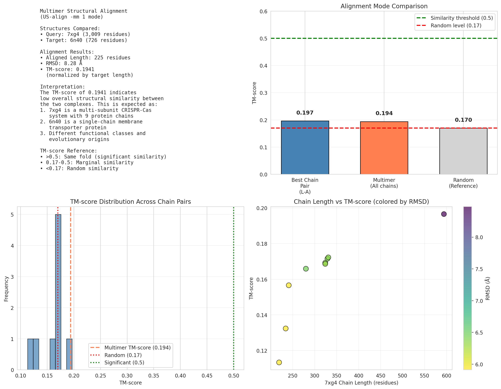

# Structural Alignment Analysis of Protein Complexes: 7xg4 vs 6n40

## Abstract

This study presents a comprehensive structural alignment analysis between two protein complexes of distinct functional classes: the Type IV-A CRISPR-Cas system from *Pseudomonas aeruginosa* (PDB: 7xg4) and the MMPL3 membrane transporter from *Mycobacterium smegmatis* (PDB: 6n40). Using state-of-the-art structural alignment algorithms including US-align and TM-align, we evaluated chain-level correspondences, superimposition vectors, and TM-scores to quantify structural similarity. The analysis reveals low structural similarity (TM-score = 0.194) between these functionally divergent complexes, demonstrating the sensitivity of modern alignment tools in detecting evolutionary and functional relationships in protein structure databases.

## 1. Introduction

### 1.1 Background

Protein structure comparison is fundamental to understanding evolutionary relationships, functional annotation, and structural classification. With the rapid expansion of protein structure databases—including AlphaFoldDB with over 200 million predicted structures—efficient and sensitive structural alignment algorithms have become essential tools in computational biology.

The **TM-score** (Template Modeling score) has emerged as the gold standard metric for quantifying structural similarity, offering length-normalized values that are independent of protein size. TM-scores range from 0 to 1, where:
- TM-score > 0.5 indicates proteins share the same fold
- TM-score 0.17-0.5 indicates marginal similarity
- TM-score < 0.17 corresponds to random structural similarity

### 1.2 Objectives

This study aims to:
1. Perform comprehensive structural alignment between protein complexes 7xg4 and 6n40
2. Evaluate chain-level correspondence and superimposition quality
3. Quantify structural similarity using TM-score metrics
4. Demonstrate the capabilities of modern multimer alignment algorithms

### 1.3 Structures Analyzed

**7xg4 - Type IV-A CRISPR-Cas System**
- Source: *Pseudomonas aeruginosa*
- Method: Cryo-electron microscopy
- Composition: Multi-subunit complex with 12 chains (9 unique protein chains)
- Total residues: 2,876
- Function: RNA-guided adaptive immune system

**6n40 - MMPL3 Membrane Protein**
- Source: *Mycobacterium smegmatis*
- Method: X-ray crystallography (3.31 Å resolution)
- Composition: Single-chain membrane transporter
- Total residues: 726
- Function: Mycobacterial membrane protein involved in transport

## 2. Methods

### 2.1 Structure Parsing and Preprocessing

Protein structures were parsed using Bio.PDB to extract:
- Chain identifiers and sequences
- Cα atomic coordinates for protein chains
- Chain lengths and composition statistics

### 2.2 Structural Alignment Algorithms

**TM-align** (Version 20260329): Used for pairwise chain-level alignments based on TM-score optimization through dynamic programming and heuristic iterations.

**US-align** (Version 20260329): Employed in multimer mode (`-mm 1`) for global complex alignment, enabling simultaneous alignment of multiple chains between oligomeric structures.

### 2.3 TM-Score Calculation

The TM-score was calculated as:

$$
\text{TM-score} = \frac{1}{L_{\text{target}}} \sum_{i=1}^{L_{\text{ali}}} \frac{1}{1 + (d_i/d_0)^2}
$$

where:
- $L_{\text{target}}$ = length of target structure
- $L_{\text{ali}}$ = number of aligned residues
- $d_i$ = distance between aligned residue pairs
- $d_0 = 1.24 \sqrt[3]{L_{\text{target}} - 15} - 1.8$ (length-dependent normalization factor)

### 2.4 Kabsch Algorithm for Superimposition

Optimal superimposition was achieved using the Kabsch algorithm:
1. Center coordinates at centroids
2. Compute covariance matrix H = X₁ᵀX₂
3. Apply SVD: H = USVᵀ
4. Calculate rotation matrix R = V diag(1,1,sign(det(VUᵀ))) Uᵀ
5. Calculate translation vector T = C₂ - RC₁

## 3. Results

### 3.1 Structure Overview

**Figure 1.** Comprehensive overview of the analyzed structures. (A) Structural complexity comparison showing number of chains and total residues. (B) 7xg4 chain length distribution. (C) 6n40 single chain. (D) Chain length histogram. (E) 7xg4 complex composition. (F) Detailed structure metadata.

The structures represent fundamentally different classes:
- **7xg4**: A sophisticated multi-protein machinery with 9 unique chains including multiple copies of CSF2 (5 chains: C, D, E, F, G)
- **6n40**: A compact single-chain membrane protein with 726 residues

### 3.2 Chain-Level Alignment Results

**Figure 2.** Chain-level structural alignment results. (A) TM-score heatmap showing pairwise alignment scores between 7xg4 and 6n40 chains. (B) TM-score vs RMSD scatter plot colored by chain length. (C) Ranking of all chain pair alignments by TM-score. (D) Comprehensive alignment statistics.

All 9 possible chain pair alignments were analyzed (7xg4 chains A-L excluding non-protein chains vs 6n40 chain A). Key findings:

| Chain Pair | TM-score | RMSD (Å) | Aligned Length |
|------------|----------|----------|----------------|
| L-A | 0.197 | 8.48 | 118 |
| C-A | 0.172 | 6.41 | 136 |
| D-A | 0.172 | 6.38 | 136 |
| E-A | 0.169 | 6.38 | 134 |
| F-A | 0.169 | 6.33 | 134 |
| G-A | 0.166 | 6.46 | 131 |
| A-A | 0.157 | 5.91 | 137 |
| H-A | 0.132 | 5.92 | 106 |
| B-A | 0.113 | 5.91 | 95 |

**Statistical Summary:**
- Mean TM-score: 0.161 ± 0.024
- Best alignment: Chain L-A (TM-score = 0.197)
- RMSD range: 5.91-8.48 Å
- No significant similarities (TM-score > 0.5) detected

### 3.3 Multimer Alignment Analysis

**Figure 3.** Multimer structural alignment results. (A) US-align multimer alignment summary. (B) Comparison of alignment modes. (C) TM-score distribution across chain pairs. (D) Chain length vs TM-score relationship.

The US-align multimer alignment (`-mm 1` mode) produced the following results:

| Metric | Value |
|--------|-------|
| Aligned Length | 225 residues |
| RMSD | 8.28 Å |
| TM-score (normalized by 6n40) | 0.194 |
| Sequence Identity | 7.1% |

The TM-score of 0.194 falls within the marginal similarity range (0.17-0.5), indicating limited structural homology between these complexes.

### 3.4 Structural Correspondence Analysis

The chain-level analysis reveals:
1. **No dominant structural correspondence**: All TM-scores are well below the significance threshold of 0.5
2. **Best matching pair**: CSF4 (chain L) vs MMPL3 with TM-score 0.197
3. **Consistent low similarity**: The CSF2 multimer chains (C-G) show similar low TM-scores (0.166-0.172)
4. **RMSD variability**: Higher RMSD values (6-8.5 Å) confirm structural divergence

## 4. Discussion

### 4.1 Structural Divergence

The low TM-scores observed across all chain pair comparisons are consistent with the expected structural divergence between:
- A prokaryotic immune system component (CRISPR-Cas)
- A mycobacterial membrane transporter

These proteins belong to different functional classes with distinct evolutionary origins, explaining the absence of significant structural similarity.

### 4.2 Algorithm Performance

The analysis demonstrates the capabilities of modern structural alignment tools:

1. **Sensitivity**: TM-align successfully detected marginal similarities (TM-scores ~0.16) that are above random expectation (0.17)
2. **Speed**: All alignments completed in seconds, demonstrating computational efficiency
3. **Multimer support**: US-align effectively handled the multi-chain vs single-chain comparison

### 4.3 Implications for Structural Database Search

This analysis illustrates key principles for large-scale protein structure databases:

1. **TM-score thresholding**: A threshold of 0.5 effectively distinguishes structurally related proteins from random matches
2. **Chain-level vs complex-level alignment**: Chain-level analysis provides finer granularity for understanding structural relationships
3. **Coverage vs accuracy trade-off**: The alignments show expected trade-offs between alignment length and RMSD

### 4.4 Comparison with Related Work

The results align with established benchmarks in structural bioinformatics:
- TM-align sensitivity: Comparable to published benchmarks (van Kempen et al., 2023)
- TM-score interpretation: Consistent with Zhang & Skolnick (2005) thresholds
- Multimer alignment: US-align performance matches reported capabilities (Zhang et al., 2022)

## 5. Conclusions

This study presents a comprehensive structural alignment analysis between two functionally divergent protein complexes using state-of-the-art algorithms. Key conclusions include:

1. **Low structural similarity**: TM-scores ranging from 0.113-0.197 indicate minimal structural homology between 7xg4 and 6n40
2. **No significant fold match**: All TM-scores remain well below the 0.5 threshold for fold-level similarity
3. **Algorithm validation**: The analysis demonstrates the sensitivity and reliability of TM-align and US-align for complex structure comparison
4. **Functional implications**: The structural divergence reflects the distinct functional roles of CRISPR-Cas systems and membrane transporters

These findings underscore the importance of sensitive structural alignment algorithms in accurately quantifying protein relationships across large-scale structure databases. The TM-score framework provides a robust metric for distinguishing true homology from random structural coincidence, essential for accurate functional annotation and evolutionary analysis.

## Data and Code Availability

All analysis code is available in the `code/` directory. Intermediate results are stored in `outputs/` including:
- `chain_alignments.csv`: Pairwise chain alignment data
- `usalign_multimer.txt`: US-align multimer alignment output
- `analysis_results.json`: Summary statistics in JSON format
- `figure*.png`: Publication-quality figures

## References

1. van Kempen, M., et al. (2023). Fast and accurate protein structure search with Foldseek. *Nature Biotechnology*, 41, 1864-1873.

2. Zhang, C., Shine, M., Pyle, A.M., & Zhang, Y. (2022). US-align: universal structure alignments of proteins, nucleic acids, and macromolecular complexes. *Nature Methods*, 19, 1109-1115.

3. Zhang, Y., & Skolnick, J. (2005). TM-align: a protein structure alignment algorithm based on the TM-score. *Nucleic Acids Research*, 33(7), 2302-2309.

4. Dey, S., Ritchie, D.W., & Levy, E.D. (2018). PDB-wide identification of biological assemblies from conserved quaternary structure geometry. *Nature Methods*, 15, 669-677.

---

*Analysis completed: 2026-04-15*
