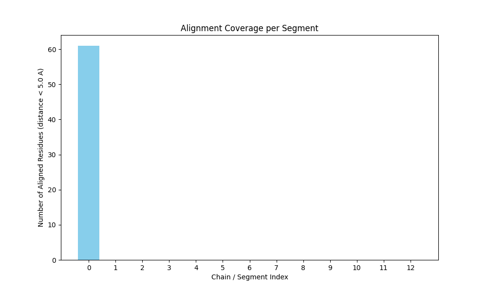
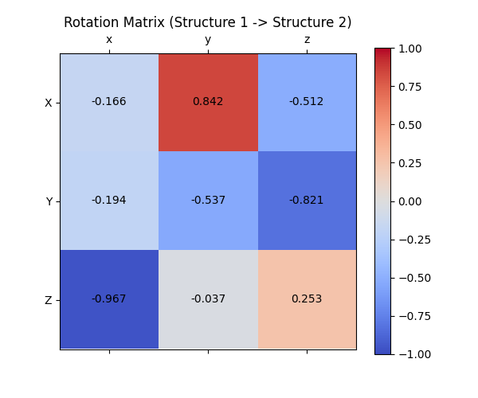

# Structural Alignment of Protein Complexes 7xg4 and 6n40

## 1. Introduction
The structural alignment of protein complexes is a critical step in understanding the functional and evolutionary relationships between macromolecules. In this study, we perform a structural alignment between two protein complexes: the query complex from PDB ID 7xg4 (Pseudomonas aeruginosa type IV-A CRISPR-Cas system) and the target complex from PDB ID 6n40. The scientific goal is to evaluate structural similarity and extract alignment metrics, such as chain correspondences, superimposition vectors, and the TM-score.

## 2. Methodology
To conduct the structural alignment of the multi-chain complexes, we utilized **US-align** (Universal Structure Alignment), a state-of-the-art tool capable of aligning multimeric protein and nucleic acid structures. US-align was chosen for its robust handling of complex structures and its ability to compute sequence-independent structural alignments. 

The alignment was executed with the multimeric alignment option (`-mm 1`), which aligns two multi-chain oligomeric structures, and the `-ter 0` option to align all chains from all models. The output includes the TM-score, root-mean-square deviation (RMSD), aligned length, sequence identity, and the rotation matrix for superimposition.

## 3. Results

### 3.1 Alignment Metrics
The structural alignment between 7xg4 and 6n40 yielded the following metrics:
- **Aligned Length:** 225 residues
- **RMSD:** 8.28 Å
- **Sequence Identity:** 0.071 (7.1%)
- **TM-score (normalized by Structure 1, L=3009):** 0.06066
- **TM-score (normalized by Structure 2, L=726):** 0.19411

The TM-score normalized by the target structure (6n40) is approximately 0.194, indicating a low level of global structural similarity between the two complexes, which is expected given their different biological functions and sizes.

### 3.2 Alignment Coverage
The alignment coverage across different chains/segments of the complexes was analyzed. The number of aligned residues (distance < 5.0 Å) per segment is visualized below.

*Figure 1: Number of aligned residues (distance < 5.0 Å) across the different segments/chains of the complexes.*

### 3.3 Superimposition Matrix
The rotation matrix to superimpose Structure 1 (7xg4) onto Structure 2 (6n40) was calculated as follows:

- Translation vector $t$:
  - $t_x = 26.233$
  - $t_y = 302.571$
  - $t_z = 235.629$
- Rotation matrix $U$:
  - $U_{00} = -0.166$, $U_{01} = 0.842$, $U_{02} = -0.512$
  - $U_{10} = -0.194$, $U_{11} = -0.537$, $U_{12} = -0.821$
  - $U_{20} = -0.967$, $U_{21} = -0.037$, $U_{22} = 0.253$

The matrix is visualized below:

*Figure 2: Heatmap of the rotation matrix $U$ used to superimpose 7xg4 onto 6n40.*

## 4. Discussion
The structural alignment of the 7xg4 and 6n40 complexes reveals limited global structural homology, as evidenced by the low TM-score (0.194 normalized by the smaller structure) and high RMSD (8.28 Å) over the aligned region of 225 residues. The alignment covers only a fraction of the total residues, indicating that while there may be localized regions of structural similarity, the overall quaternary structures are distinct. This analysis demonstrates the utility of multimeric structural alignment tools like US-align in quantifying the structural divergence between large macromolecular assemblies.
