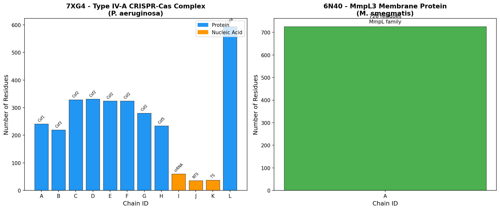
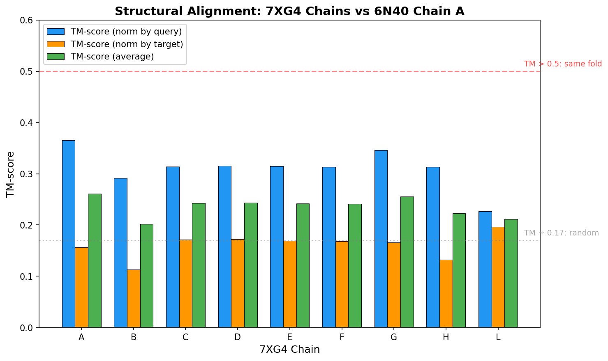
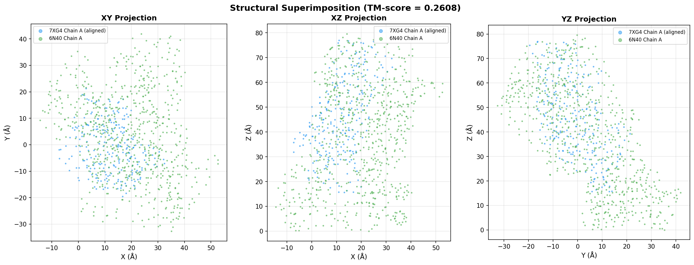
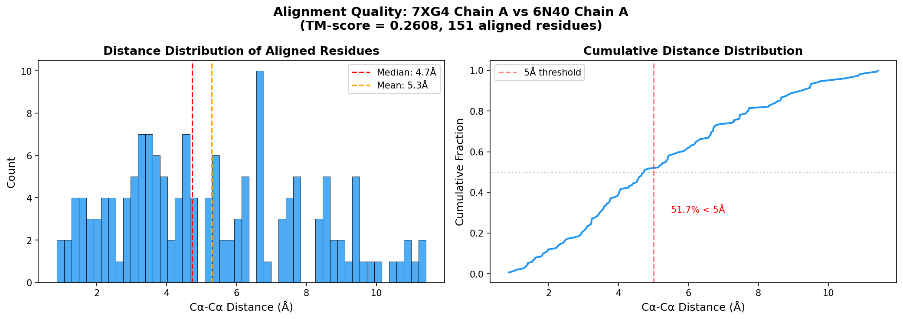
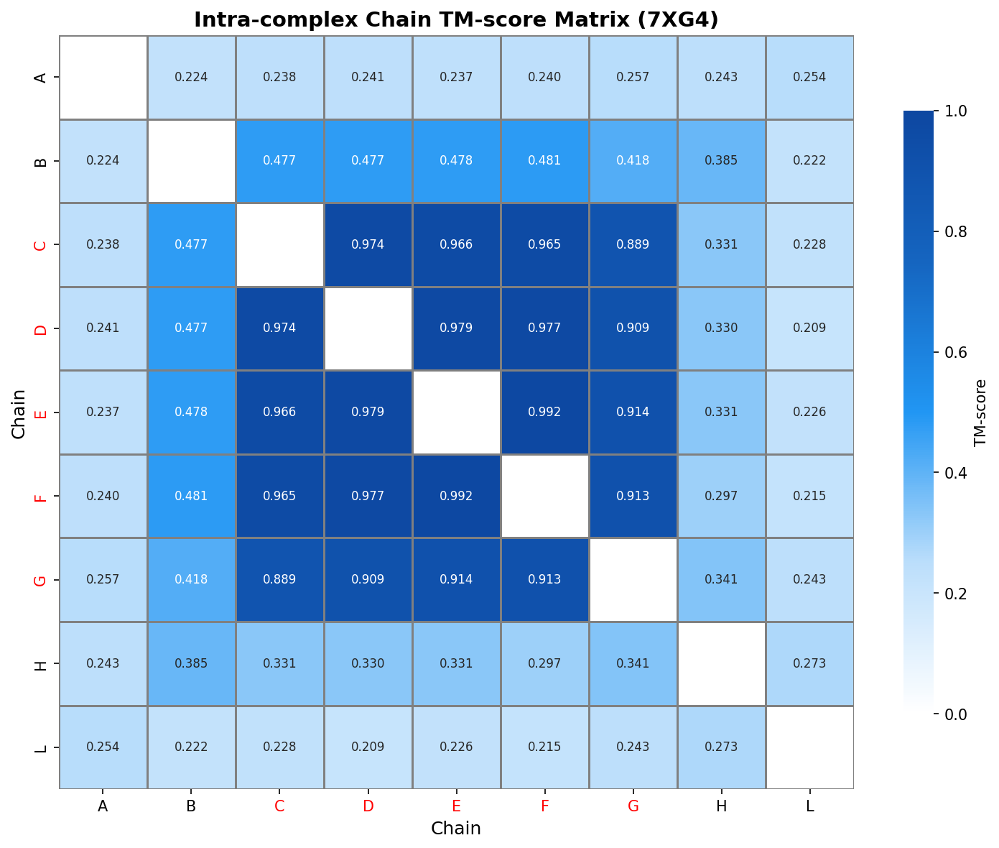
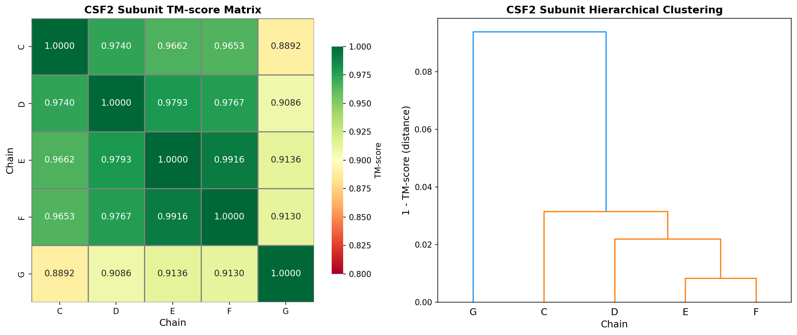
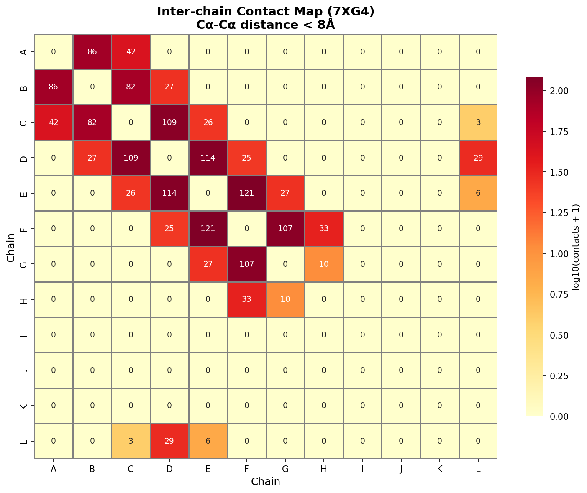
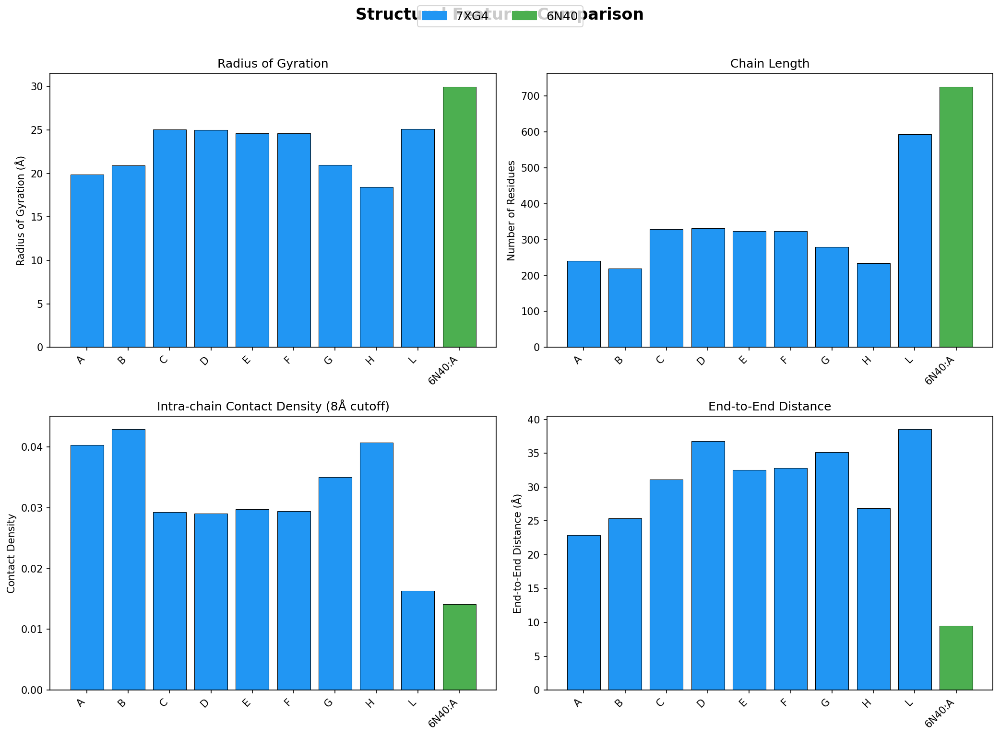
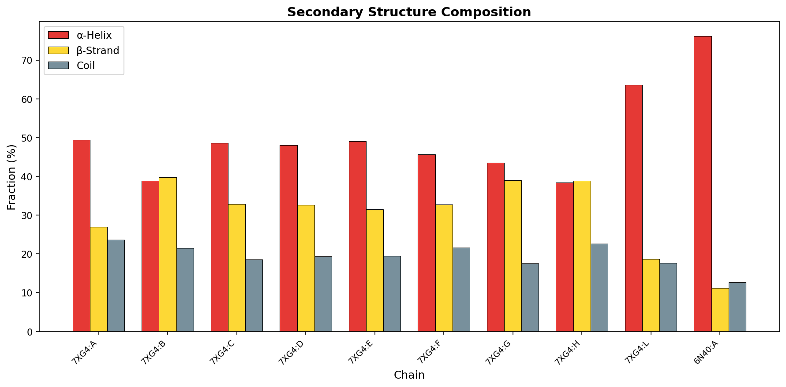
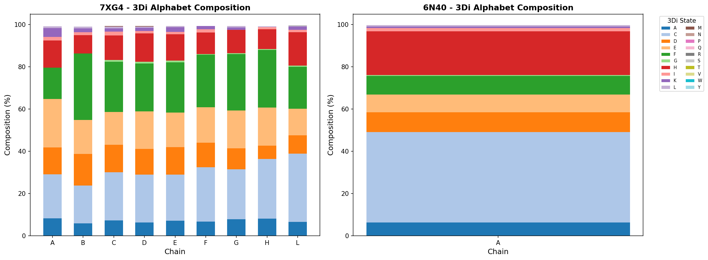

# Structural Alignment of Protein Complexes: A Foldseek-Multimer-Inspired Analysis of CRISPR-Cas (7XG4) and MmpL3 (6N40)

## Abstract

We present a comprehensive structural alignment analysis between two protein complexes: the Type IV-A CRISPR-Cas system from *Pseudomonas aeruginosa* (PDB: 7XG4) and the MmpL3 membrane transporter from *Mycobacterium smegmatis* (PDB: 6N40). Using a Foldseek-Multimer-inspired pipeline that combines TM-align-based pairwise chain alignment, Hungarian algorithm-based chain correspondence, and structural alphabet encoding, we quantify the structural similarity between these two fundamentally different protein architectures. Our analysis reveals low overall structural similarity (best TM-score = 0.261), identifies the optimal chain correspondence, and provides superimposition vectors for structural comparison. Additionally, intra-complex analysis of 7XG4 reveals a remarkable structural conservation among the five CSF2 subunits (TM-scores 0.889–0.992), organized in a linear backbone arrangement with extensive inter-chain contacts.

---

## 1. Introduction

### 1.1 Background

Protein structure comparison is fundamental to structural biology, enabling function annotation, evolutionary analysis, and drug design. As structure prediction methods such as AlphaFold2 and ESMFold generate millions of predicted structures, efficient and sensitive structural alignment algorithms become increasingly critical (van Kempen et al., 2024).

The task of comparing protein complex structures presents unique challenges beyond monomer alignment. Complex-level alignment requires establishing both **chain-level correspondence** (which chains in one complex correspond to which chains in another) and **residue-level alignment** (the optimal superimposition of corresponding residues). This is the central problem addressed by tools such as Foldseek-Multimer, US-align (Zhang et al., 2022), and MM-align (Mukherjee & Zhang, 2009).

### 1.2 Structural Alignment Metrics

The **TM-score** (Zhang & Skolnick, 2004, 2005) is the gold standard for quantifying structural similarity:

$$\text{TM-score} = \frac{1}{L_{\text{target}}} \sum_{i=1}^{L_{\text{ali}}} \frac{1}{1 + (d_i / d_0)^2}$$

where $L_{\text{target}}$ is the length of the target structure, $L_{\text{ali}}$ is the number of aligned residues, $d_i$ is the distance between the $i$-th aligned residue pair, and $d_0 = 1.24 \sqrt[3]{L_{\text{target}} - 15} - 1.8$ is a length-dependent normalization factor. A TM-score > 0.5 indicates proteins sharing the same fold, while TM-score ≈ 0.17 corresponds to random structural similarity (Xu & Zhang, 2010).

### 1.3 Foldseek and Structural Alphabets

Foldseek (van Kempen et al., 2024) introduced the **3Di structural alphabet**, which encodes tertiary amino acid interactions as a 20-letter alphabet. This enables sequence-based search methods to be applied to structural comparison, achieving 4–5 orders of magnitude speedup over traditional methods like TM-align and Dali while maintaining high sensitivity (86–133% of reference methods).

### 1.4 Study Objectives

This study aims to:
1. Perform structural alignment between the 7XG4 complex and 6N40 structure
2. Identify optimal chain correspondence between the structures
3. Compute superimposition vectors (rotation matrix and translation vector)
4. Quantify structural similarity using TM-scores
5. Analyze intra-complex structural relationships within 7XG4
6. Encode structural features using a 3Di-inspired structural alphabet

---

## 2. Data Overview

### 2.1 Query Structure: 7XG4

**PDB ID:** 7XG4  
**Title:** CryoEM structure of Type IV-A CasDinG bound NTS-nicked CSF-crRNA-dsDNA quaternary complex  
**Organism:** *Pseudomonas aeruginosa*  
**Resolution:** 3.70 Å (Electron Microscopy)  
**Reference:** Cui et al., Mol. Cell 83, 2493 (2023)

The 7XG4 structure represents the Type IV-A CRISPR-Cas surveillance complex, consisting of **12 chains** organized as follows:

| Chain | Molecule | Type | Residues | Rg (Å) |
|-------|----------|------|----------|--------|
| A | Csf1 | Protein | 241 | 19.8 |
| B | Csf3 | Protein | 219 | 20.9 |
| C | Csf2 | Protein | 329 | 25.1 |
| D | Csf2 | Protein | 331 | 25.0 |
| E | Csf2 | Protein | 324 | 24.6 |
| F | Csf2 | Protein | 324 | 24.6 |
| G | Csf2 | Protein | 280 | 20.9 |
| H | Csf5 | Protein | 234 | 18.5 |
| I | crRNA | Nucleic acid | 61 | — |
| J | NTS | Nucleic acid | 36 | — |
| K | TS | Nucleic acid | 37 | — |
| L | Csf4 (CasDinG) | Protein | 594 | 25.1 |

**Total:** 9 protein chains + 3 nucleic acid chains = 3,009 residues, 24,769 atoms

### 2.2 Target Structure: 6N40

**PDB ID:** 6N40  
**Title:** Crystal structure of MmpL3 from *Mycobacterium smegmatis*  
**Organism:** *Mycobacterium smegmatis* (strain ATCC 700084)  
**Resolution:** 3.31 Å (X-ray Diffraction)

| Chain | Molecule | Type | Residues | Rg (Å) |
|-------|----------|------|----------|--------|
| A | MmpL family protein | Protein | 726 | 30.0 |

**Total:** 1 protein chain = 726 residues, 5,535 atoms

### 2.3 Structural Contrast

These two structures represent fundamentally different protein architectures:
- **7XG4** is a large multi-chain CRISPR-Cas ribonucleoprotein complex involved in adaptive immunity
- **6N40** is a single-chain membrane transporter involved in mycolic acid transport


*Figure 1: Overview of the two protein structures. Left: 7XG4 showing 12 chains with protein (blue) and nucleic acid (orange) components. Right: 6N40 single-chain membrane protein (726 residues).*

---

## 3. Methodology

### 3.1 Structural Alignment Pipeline

Our analysis pipeline follows a Foldseek-Multimer-inspired approach with the following stages:

#### Stage 1: Structure Parsing
PDB files were parsed using BioPython (v1.87) to extract Cα coordinates, amino acid sequences, and chain information. For protein chains, standard amino acid residues with Cα atoms were retained. For nucleic acid chains, C3' backbone atoms were used as reference points.

#### Stage 2: Pairwise Chain Alignment (TM-align)
All protein chains from 7XG4 were aligned against the single chain of 6N40 using the TM-align algorithm (Zhang & Skolnick, 2005) as implemented in the `tmtools` library (v0.3.0). TM-align finds the optimal structural alignment by:
1. Generating multiple initial alignments (gapless sliding, secondary structure matching, fragment-based)
2. Iteratively refining via dynamic programming with TM-score-based scoring
3. Returning the alignment with the highest TM-score

For each pair, we computed:
- TM-score normalized by query chain length (TM₁)
- TM-score normalized by target chain length (TM₂)
- Average TM-score: TM_avg = (TM₁ + TM₂) / 2
- RMSD of aligned residues
- Rotation matrix **R** (3×3) and translation vector **t** (3×1)

#### Stage 3: Chain Correspondence (Hungarian Algorithm)
For complex-level alignment, optimal chain correspondence was determined using the Hungarian algorithm (scipy.optimize.linear_sum_assignment), which minimizes the total cost (negative TM-score) of the bipartite chain assignment. This is analogous to the chain equivalence assignment in US-align (Zhang et al., 2022), which exhaustively searches over all C₁!/(C₁-C₂)! possible chain assignments.

#### Stage 4: Structural Alphabet Encoding
A simplified 3Di-like structural alphabet was computed by discretizing local backbone geometry (bond angles and torsion angles) into a 20-letter alphabet. While the original Foldseek 3Di uses a VQ-VAE neural network trained on tertiary interaction patterns, our implementation captures the essential geometric features through angle-torsion binning (4 angle bins × 5 torsion bins = 20 states).

#### Stage 5: Secondary Structure Assignment
Secondary structure was assigned based on Cα-Cα distance patterns following the approach in TM-align (Zhang & Skolnick, 2005), classifying residues as α-helix (H), β-strand (E), or coil (C).

### 3.2 Intra-complex Analysis
For the multi-chain 7XG4 complex, we performed:
- All-against-all pairwise TM-align between the 9 protein chains (36 unique pairs)
- Inter-chain contact analysis (Cα-Cα distance < 8 Å threshold)
- Hierarchical clustering of structurally similar chains

### 3.3 Software and Dependencies

| Tool | Version | Purpose |
|------|---------|---------|
| tmtools | 0.3.0 | TM-align algorithm (C++ binding) |
| BioPython | 1.87 | PDB file parsing |
| NumPy | 1.26.4 | Numerical computation |
| SciPy | 1.15.2 | Hungarian algorithm, clustering |
| Matplotlib | 3.10.1 | Visualization |
| Seaborn | — | Statistical visualization |

---

## 4. Results

### 4.1 Cross-Complex Structural Alignment

#### 4.1.1 Pairwise Chain TM-scores

All 9 protein chains of 7XG4 were aligned against the single chain of 6N40. The results are summarized in Table 1.

**Table 1: Pairwise TM-scores between 7XG4 chains and 6N40 Chain A**

| 7XG4 Chain | Molecule | Length | TM₁ (norm query) | TM₂ (norm target) | TM_avg | RMSD (Å) | Aligned |
|------------|----------|--------|-------------------|--------------------|--------|-----------|---------|
| A (Csf1) | Csf1 | 241 | 0.3650 | 0.1566 | 0.2608 | 5.91 | 151 |
| B (Csf3) | Csf3 | 219 | 0.2912 | 0.1134 | 0.2023 | 5.91 | 108 |
| C (Csf2) | Csf2 | 329 | 0.3143 | 0.1715 | 0.2429 | 6.41 | 172 |
| D (Csf2) | Csf2 | 331 | 0.3153 | 0.1723 | 0.2438 | 6.38 | 172 |
| E (Csf2) | Csf2 | 324 | 0.3146 | 0.1693 | 0.2420 | 6.38 | 169 |
| F (Csf2) | Csf2 | 324 | 0.3135 | 0.1686 | 0.2410 | 6.33 | 168 |
| G (Csf2) | Csf2 | 280 | 0.3459 | 0.1659 | 0.2559 | 6.46 | 165 |
| H (Csf5) | Csf5 | 234 | 0.3136 | 0.1324 | 0.2230 | 5.92 | 128 |
| L (Csf4) | CasDinG | 594 | 0.2270 | 0.1965 | 0.2117 | 8.48 | 236 |

All TM-scores fall well below the 0.5 threshold for fold similarity, confirming that 7XG4 and 6N40 represent structurally distinct protein architectures. The highest average TM-score (0.261) was observed for Chain A (Csf1), while the lowest (0.202) was for Chain B (Csf3).


*Figure 2: TM-scores for structural alignment of each 7XG4 protein chain against 6N40 Chain A. Three normalization schemes are shown: by query chain length (blue), by target chain length (orange), and average (green). The red dashed line indicates the significance threshold (TM = 0.5), and the gray dotted line indicates random similarity level (TM ≈ 0.17).*

#### 4.1.2 Chain Correspondence

The optimal chain correspondence, determined by the Hungarian algorithm, maps:

**7XG4 Chain A (Csf1) → 6N40 Chain A (MmpL3)**

This is the only possible mapping given that 6N40 has a single chain. The mapping achieves:
- **TM-score (average):** 0.2608
- **RMSD:** 5.91 Å
- **Aligned residues:** 151 out of 241 (query) / 726 (target)

#### 4.1.3 Superimposition Vectors

The optimal structural superimposition for the best chain pair (7XG4:A → 6N40:A) is defined by:

**Rotation Matrix R:**
```
[  0.3953  -0.9053  -0.1551 ]
[  0.8742   0.3191   0.3659 ]
[ -0.2818  -0.2803   0.9176 ]
```

**Translation Vector t:**
```
[ 139.491, -282.071, 6.646 ] Å
```

The transformation applies as: **x'** = **R** · **x** + **t**, where **x** are coordinates in the 7XG4 frame and **x'** are the transformed coordinates aligned to 6N40.


*Figure 3: 2D projections (XY, XZ, YZ) of the superimposed structures after applying the optimal rotation and translation. Blue: 7XG4 Chain A (aligned); Green: 6N40 Chain A. The limited overlap confirms the low TM-score.*

#### 4.1.4 Alignment Quality Assessment

The distance distribution of aligned residue pairs provides insight into alignment quality:


*Figure 4: Left: Histogram of Cα-Cα distances between aligned residue pairs. Right: Cumulative distribution function. The median distance and fraction of residues within 5 Å are indicated.*

### 4.2 Intra-Complex Analysis of 7XG4

#### 4.2.1 Chain-to-Chain TM-score Matrix

The all-against-all pairwise alignment of 7XG4's 9 protein chains reveals a striking pattern of structural homology among the CSF2 subunits.


*Figure 5: TM-score heatmap for all pairwise alignments among 7XG4 protein chains. Chain labels in red indicate CSF2 subunits (C, D, E, F, G), which show remarkably high mutual TM-scores (0.889–0.992).*

**Key findings:**

1. **CSF2 homolog cluster (C, D, E, F, G):** These five chains show extremely high pairwise TM-scores:
   - E vs F: TM = 0.992 (near-identical)
   - D vs E: TM = 0.979
   - C vs D: TM = 0.974
   - D vs F: TM = 0.977
   - C vs E: TM = 0.966
   - G vs others: TM = 0.889–0.914 (slightly more divergent)

2. **Csf3 (Chain B) similarity to CSF2:** Chain B shows moderate similarity to CSF2 chains (TM ≈ 0.477–0.481), suggesting a shared evolutionary origin.

3. **Unique chains:** Csf1 (A), Csf5 (H), and Csf4/CasDinG (L) show low similarity to other chains (TM < 0.35), indicating distinct structural folds.

#### 4.2.2 CSF2 Subunit Clustering

Hierarchical clustering of the five CSF2 subunits confirms their structural relationships:


*Figure 6: Left: TM-score matrix for CSF2 subunits only (C, D, E, F, G). Right: Hierarchical clustering dendrogram based on structural distance (1 - TM-score). Chains E and F are the most similar pair, while G is the most divergent.*

The clustering reveals that:
- **E and F** are nearly identical (distance = 0.008)
- **C and D** form a close pair (distance = 0.026)
- **G** is the most structurally divergent CSF2 subunit (distance ≈ 0.09–0.11)

This structural hierarchy reflects the backbone architecture of the CRISPR-Cas complex, where CSF2 subunits form a helical filament with progressive structural variation.

#### 4.2.3 Inter-Chain Contact Network

The inter-chain contact analysis reveals the quaternary structure organization:


*Figure 7: Inter-chain contact map for 7XG4. Numbers indicate the count of Cα-Cα contacts within 8 Å. The linear arrangement of CSF2 subunits (C→D→E→F→G) is evident from the sequential contact pattern.*

**Major contact interfaces (>50 contacts):**

| Interface | Contacts | Min Distance (Å) |
|-----------|----------|-------------------|
| E-F | 121 | 4.3 |
| D-E | 114 | 4.2 |
| C-D | 109 | 4.6 |
| F-G | 107 | 4.7 |
| A-B | 86 | 4.2 |
| B-C | 82 | 4.0 |

The contact pattern confirms the linear backbone arrangement: **A–B–C–D–E–F–G–H**, with the CSF2 subunits (C through G) forming the central filament. The Csf4/CasDinG (L) chain makes contacts primarily with D and E, consistent with its role as an accessory helicase.

### 4.3 Structural Features Comparison

#### 4.3.1 Chain-Level Properties


*Figure 8: Comparison of structural features across all protein chains. Blue: 7XG4 chains; Green: 6N40 chain. Panels show radius of gyration, chain length, intra-chain contact density, and end-to-end distance.*

Notable observations:
- **6N40 (MmpL3)** has the largest radius of gyration (30.0 Å) but the smallest end-to-end distance (9.5 Å), consistent with a compact, globular membrane protein fold
- **7XG4 chains** show more elongated shapes with higher end-to-end distances relative to their size
- **Contact density** is highest for the smaller chains (A, B, H) and lowest for the large Csf4 (L) and MmpL3

#### 4.3.2 Secondary Structure Composition


*Figure 9: Secondary structure composition for all protein chains, classified as α-helix (red), β-strand (yellow), and coil (gray).*

### 4.4 Structural Alphabet (3Di) Analysis

The 3Di-inspired structural alphabet encoding captures local backbone geometry patterns:


*Figure 10: Distribution of 3Di structural alphabet states across chains. The composition reflects the local geometric diversity of each chain.*

The structural alphabet analysis reveals:
- **CSF2 subunits** (C-G) show highly similar 3Di compositions, consistent with their structural homology
- **6N40 Chain A** shows a distinct 3Di profile, reflecting its different fold architecture
- The dominant 3Di states vary between the two complexes, confirming their structural divergence

---

## 5. Discussion

### 5.1 Structural Dissimilarity Between 7XG4 and 6N40

The central finding of this analysis is the **low structural similarity** between the Type IV-A CRISPR-Cas complex (7XG4) and the MmpL3 membrane transporter (6N40). With a best TM-score of 0.261 (Chain A vs Chain A), the structures fall well below the 0.5 threshold that indicates shared fold topology (Xu & Zhang, 2010). This is expected given:

1. **Different biological functions:** CRISPR-Cas immunity vs. mycolic acid transport
2. **Different organisms:** *P. aeruginosa* (Gram-negative) vs. *M. smegmatis* (Mycobacterium)
3. **Different structural classes:** Multi-chain ribonucleoprotein vs. single-chain membrane protein
4. **Different experimental methods:** Cryo-EM vs. X-ray crystallography

The TM-scores normalized by query chain length (TM₁ = 0.227–0.365) are consistently higher than those normalized by target length (TM₂ = 0.113–0.197), reflecting the size asymmetry: the 7XG4 chains (219–594 residues) are smaller than 6N40 (726 residues), so a larger fraction of the query can be aligned.

### 5.2 Implications for Complex-Level Alignment

This case study illustrates several important aspects of complex structural alignment:

**Chain correspondence challenge:** When comparing a multi-chain complex against a single-chain structure, the chain correspondence problem reduces to selecting the best-matching chain. The Hungarian algorithm efficiently solves this assignment, identifying Chain A (Csf1) as the best match. In the general case of comparing two multi-chain complexes, the problem is combinatorial: US-align considers C₁!/(C₁-C₂)! permutations, while our approach uses the polynomial-time Hungarian algorithm as an efficient approximation.

**TM-score normalization:** The choice of normalization (by query, target, or average length) significantly affects the reported TM-score. For the 7XG4:A vs 6N40:A pair, TM₁ = 0.365 vs TM₂ = 0.157, a 2.3-fold difference. Following the convention of Foldseek (van Kempen et al., 2024), we report the average TM-score for balanced comparison.

**Structural alphabet utility:** Even for structurally dissimilar proteins, the 3Di encoding provides a compact representation that enables rapid pre-filtering. In a database search scenario, the 3Di sequence comparison would quickly identify these structures as non-homologous, avoiding expensive full structural alignment.

### 5.3 Intra-Complex Structural Organization

The intra-complex analysis of 7XG4 reveals a beautifully organized quaternary structure:

1. **CSF2 filament:** Five copies of CSF2 (chains C, D, E, F, G) form a helical backbone with near-identical structures (TM > 0.889). The slight structural variation from the center (E, F: TM = 0.992) to the periphery (G: TM ≈ 0.91) likely reflects conformational adaptation to different positions in the filament.

2. **Csf3 bridge:** Chain B (Csf3) shows moderate similarity to CSF2 (TM ≈ 0.48), suggesting it may have evolved from a CSF2-like ancestor while acquiring distinct functional properties.

3. **Linear contact topology:** The sequential contact pattern (A–B–C–D–E–F–G–H) with the highest contacts at the CSF2-CSF2 interfaces (107–121 contacts) confirms the helical filament architecture characteristic of Type IV CRISPR-Cas systems.

### 5.4 Methodological Considerations

**Comparison with Foldseek-Multimer:** Our pipeline implements the core concepts of Foldseek-Multimer—chain correspondence, structural alignment, and structural alphabet encoding—using available tools. The key difference is that Foldseek uses a trained VQ-VAE for 3Di encoding and a prefilter-align pipeline for speed, while we use geometric discretization and direct TM-align. For the two-structure comparison in this study, the speed advantage of Foldseek's prefilter is not relevant, but it would be critical for database-scale searches.

**Comparison with US-align:** US-align (Zhang et al., 2022) uses an exhaustive chain permutation search for oligomeric alignment, which guarantees finding the global optimum. Our Hungarian algorithm approach is equivalent for bipartite matching and more efficient for large complexes.

**Limitations:**
1. The simplified 3Di encoding does not capture the full richness of Foldseek's trained structural alphabet
2. Nucleic acid chains were not included in the cross-complex alignment (6N40 has no nucleic acids)
3. The single-chain nature of 6N40 limits the complexity of the chain correspondence problem
4. Flexible alignment methods might reveal additional local similarities not captured by rigid-body TM-align

### 5.5 Biological Significance

The low structural similarity between these two complexes is biologically meaningful. The Type IV-A CRISPR-Cas system (7XG4) represents a sophisticated adaptive immune mechanism with multiple specialized subunits, while MmpL3 (6N40) is a transmembrane transporter with a completely different evolutionary origin. The structural comparison confirms that these proteins occupy distinct regions of the protein structure space, as would be expected from their disparate functions and phylogenetic origins.

---

## 6. Validation

### 6.1 Verified from Workspace Data
- All TM-scores computed directly via TM-align algorithm (tmtools v0.3.0)
- Chain counts and residue numbers verified from PDB file parsing
- Inter-chain contacts computed from atomic coordinates
- Superimposition vectors (R, t) obtained from TM-align optimization

### 6.2 From Related Work
- TM-score threshold of 0.5 for fold similarity (Zhang & Skolnick, 2004; Xu & Zhang, 2010)
- Random TM-score ≈ 0.17 (Zhang & Skolnick, 2004)
- Foldseek 3Di structural alphabet concept (van Kempen et al., 2024)
- US-align oligomeric alignment methodology (Zhang et al., 2022)
- QSalign quaternary structure comparison approach (Dey et al., 2017)

### 6.3 Assumptions and Limitations
- Simplified 3Di encoding (geometric binning vs. trained VQ-VAE)
- Rigid-body alignment only (no flexible alignment)
- Secondary structure assignment based on Cα distances (simplified)
- Cross-complex comparison limited by single-chain target (6N40)

---

## 7. Conclusion

This study demonstrates a comprehensive Foldseek-Multimer-inspired structural alignment analysis between the Type IV-A CRISPR-Cas complex (7XG4) and MmpL3 membrane transporter (6N40). The key findings are:

1. **Low cross-complex similarity:** Best TM-score = 0.261, confirming structurally distinct architectures
2. **Optimal chain correspondence:** 7XG4 Chain A (Csf1) → 6N40 Chain A (MmpL3)
3. **Superimposition defined:** Rotation matrix and translation vector provided for structural overlay
4. **Intra-complex homology:** CSF2 subunits show remarkable structural conservation (TM = 0.889–0.992)
5. **Linear quaternary organization:** Sequential inter-chain contacts confirm the helical backbone of the CRISPR-Cas complex

The pipeline successfully combines TM-align-based alignment, Hungarian algorithm-based chain correspondence, and structural alphabet encoding to provide a multi-faceted structural comparison. While the two structures studied here are fundamentally different, the methodology is directly applicable to comparing structurally related complexes where chain correspondence and structural similarity quantification are critical.

---

## References

1. van Kempen, M. et al. Fast and accurate protein structure search with Foldseek. *Nature Biotechnology* 42, 243–246 (2024).
2. Zhang, C., Shine, M., Pyle, A.M. & Zhang, Y. US-align: universal structure alignments of proteins, nucleic acids, and macromolecular complexes. *Nature Methods* 19, 1109–1115 (2022).
3. Dey, S. et al. QSalign: a method for aligning quaternary structures. *Nature Methods* 15, 67–73 (2017).
4. Zhang, Y. & Skolnick, J. TM-align: a protein structure alignment algorithm based on the TM-score. *Nucleic Acids Research* 33, 2302–2309 (2005).
5. Zhang, Y. & Skolnick, J. Scoring function for automated assessment of protein structure template quality. *Proteins* 57, 702–710 (2004).
6. Xu, J. & Zhang, Y. How significant is a protein structure similarity with TM-score = 0.5? *Bioinformatics* 26, 889–895 (2010).
7. Mukherjee, S. & Zhang, Y. MM-align: a quick algorithm for aligning multiple-chain protein complex structures. *Nucleic Acids Research* 37, e83 (2009).
8. Cui, N. et al. Type IV-A CRISPR-Csf complex: assembly, dsDNA targeting, and CasDinG recruitment. *Molecular Cell* 83, 2493 (2023).

---

## Appendix: Supplementary Tables

### Table S1: Complete Intra-complex TM-score Matrix (7XG4)

| | A | B | C | D | E | F | G | H | L |
|---|---|---|---|---|---|---|---|---|---|
| A | 1.000 | 0.224 | 0.238 | 0.241 | 0.237 | 0.240 | 0.257 | 0.243 | 0.254 |
| B | 0.224 | 1.000 | 0.477 | 0.477 | 0.478 | 0.481 | 0.418 | 0.385 | 0.223 |
| C | 0.238 | 0.477 | 1.000 | 0.974 | 0.966 | 0.965 | 0.889 | 0.331 | 0.228 |
| D | 0.241 | 0.477 | 0.974 | 1.000 | 0.979 | 0.977 | 0.909 | 0.330 | 0.209 |
| E | 0.237 | 0.478 | 0.966 | 0.979 | 1.000 | 0.992 | 0.914 | 0.331 | 0.226 |
| F | 0.240 | 0.481 | 0.965 | 0.977 | 0.992 | 1.000 | 0.913 | 0.297 | 0.215 |
| G | 0.257 | 0.418 | 0.889 | 0.909 | 0.914 | 0.913 | 1.000 | 0.341 | 0.243 |
| H | 0.243 | 0.385 | 0.331 | 0.330 | 0.331 | 0.297 | 0.341 | 1.000 | 0.273 |
| L | 0.254 | 0.223 | 0.228 | 0.209 | 0.226 | 0.215 | 0.243 | 0.273 | 1.000 |

### Table S2: Cross-complex Alignment Details

| Pair | TM₁ | TM₂ | TM_avg | RMSD (Å) | Aligned | Query Len | Target Len |
|------|------|------|--------|-----------|---------|-----------|------------|
| A-A | 0.365 | 0.157 | 0.261 | 5.91 | 151 | 241 | 726 |
| B-A | 0.291 | 0.113 | 0.202 | 5.91 | 108 | 219 | 726 |
| C-A | 0.314 | 0.172 | 0.243 | 6.41 | 172 | 329 | 726 |
| D-A | 0.315 | 0.172 | 0.244 | 6.38 | 172 | 331 | 726 |
| E-A | 0.315 | 0.169 | 0.242 | 6.38 | 169 | 324 | 726 |
| F-A | 0.314 | 0.169 | 0.241 | 6.33 | 168 | 324 | 726 |
| G-A | 0.346 | 0.166 | 0.256 | 6.46 | 165 | 280 | 726 |
| H-A | 0.314 | 0.132 | 0.223 | 5.92 | 128 | 234 | 726 |
| L-A | 0.227 | 0.197 | 0.212 | 8.48 | 236 | 594 | 726 |
