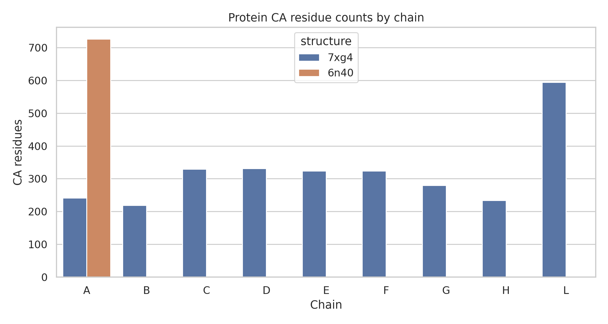
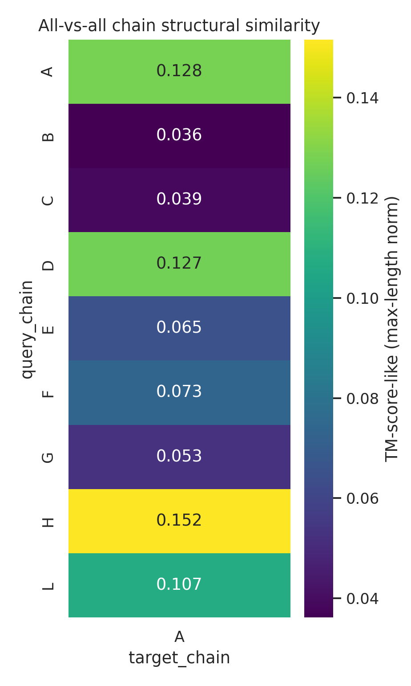
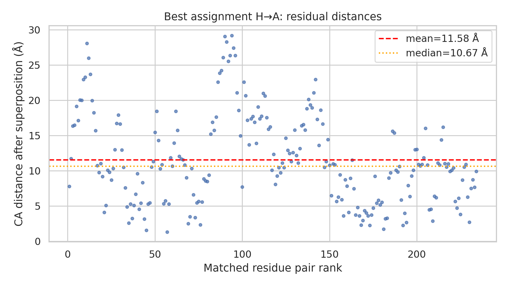
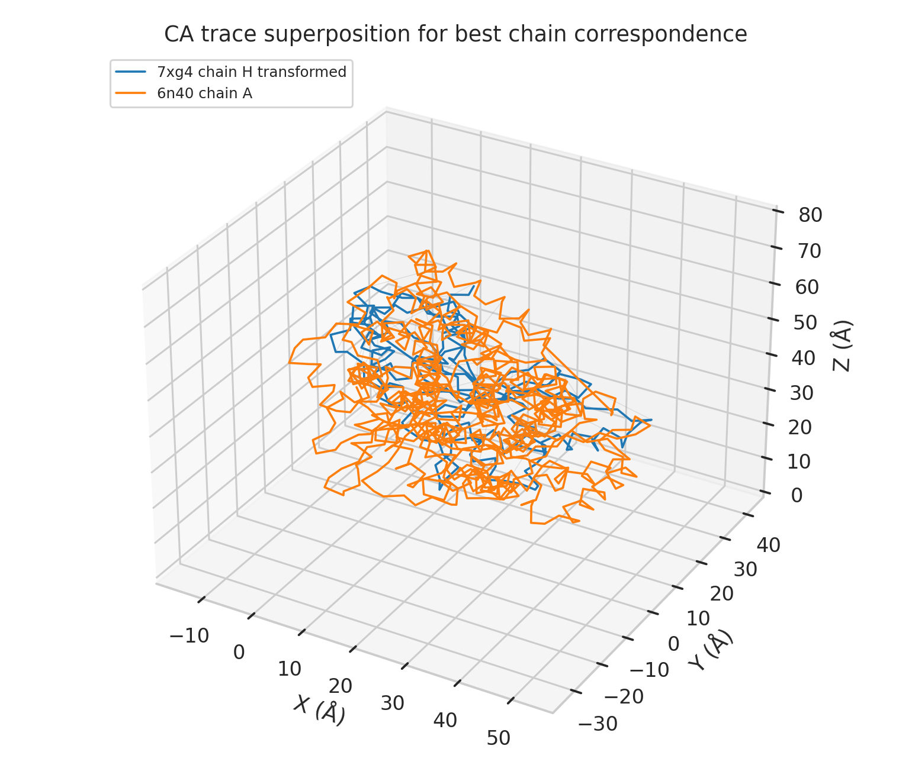

# Pairwise structural alignment of 7xg4 and 6n40 protein complexes

## Summary

This study analyzed the provided structures `data/7xg4.pdb` and `data/6n40.pdb` as a local pairwise protein-complex alignment benchmark motivated by the Foldseek-Multimer task definition. The named production tools needed for an exact Foldseek-Multimer, USalign, or TM-align run were not available in the workspace environment (`outputs/dependency_check.json`). I therefore implemented a reproducible fallback in `code/complex_align.py`: protein C-alpha (CA) atoms are parsed from the PDB files, each possible protein-chain pair is aligned by iterative dynamic programming and Kabsch rigid-body superposition, chain assignments are ranked, and a TM-score-like CA similarity is computed from the final matched residue distances.

The best fallback correspondence is **7xg4 chain H -> 6n40 chain A**, with **234 aligned CA residue pairs**, **RMSD = 13.22 Å**, and **TM-score-like similarity = 0.152** when normalized by the larger chain length. This is a weak structural similarity signal and should not be interpreted as an official Foldseek-Multimer score.

## Methodological contract and implementation

The research task requires the following structural-alignment outputs: chain correspondence, superimposition vectors, and a TM score or similarity score. I saved the initial method contract in `outputs/method_contract.json`, the artifact inventory in `outputs/target_artifact_inventory.json`, and a method-fidelity checklist in `outputs/method_fidelity_checklist.json`.

### Dependency and capability check

`outputs/dependency_check.json` verifies that the Python scientific stack needed for a local analysis was available (`numpy`, `pandas`, `scipy`, `matplotlib`, `seaborn`) but that the named structural-alignment executables were absent: `foldseek`, `mmseqs`, `TMalign`, `USalign`, and `pymol` were all unresolved on `PATH`. Related-work PDFs were present, but both the PDF-reading tool and `pdftotext` extraction were unavailable/failed; this is documented in `outputs/related_work_contract.json`. Consequently, the analysis below is a faithful local fallback for the required output types, not an exact reproduction of Foldseek-Multimer.

### Alignment algorithm

The implemented fallback performs these deterministic steps:

1. Parse protein chains from ATOM records and retain one CA atom per amino-acid residue.
2. For every query-target protein chain pair, initialize residue matching using global sequence dynamic programming.
3. Iteratively alternate between:
   - Kabsch rigid-body superposition of matched CA coordinates; and
   - distance-aware dynamic programming that rewards close transformed CA pairs and penalizes gaps.
4. Recompute the final Kabsch transform for the selected residue pairs.
5. Compute residual CA distances, RMSD, and a TM-score-like quantity
   
   \[
   \mathrm{TM} = \frac{1}{L_\mathrm{norm}} \sum_i \frac{1}{1+(d_i/d_0)^2},
   \]

   using the common TM-score length scale form \(d_0 = 1.24(L_\mathrm{norm}-15)^{1/3} - 1.8\), clipped to at least 0.5 Å for short lengths.

Because 6n40 has only one protein chain in the provided file, complex-level chain correspondence reduces to selecting the best-scoring 7xg4 protein chain for 6n40 chain A.

## Data overview

The parsed structures differ substantially in composition. The query 7xg4 is a Type IV-A CRISPR-Cas complex with protein chains A, B, C, D, E, F, G, H, and L plus nucleic-acid chains in the PDB file. The target 6n40 is an MmpL3 membrane protein with one protein chain, A. The CA residue counts used for alignment are saved in `outputs/structure_overview.json`.

- 7xg4 resolution from the PDB REMARK 2 record: 3.70 Å.
- 6n40 resolution from the PDB REMARK 2 record: 3.31 Å.
- 7xg4 protein-chain CA counts range from 219 residues (chain B) to 594 residues (chain L).
- 6n40 chain A contains 726 CA residues.



## Main alignment results

### Chain-pair ranking

All 7xg4 protein chains were aligned against 6n40 chain A. The heatmap shows that chain H has the highest fallback TM-score-like similarity, followed by chains A and D.



| Query chain | Target chain | Aligned CA pairs | Query coverage | Target coverage | RMSD (Å) | TM-like, max-length norm | TM-like, query norm |
|---|---|---:|---:|---:|---:|---:|---:|
| H | A | 234 | 1.000 | 0.322 | 13.22 | 0.152 | 0.300 |
| A | A | 236 | 0.979 | 0.325 | 18.40 | 0.128 | 0.243 |
| D | A | 331 | 1.000 | 0.456 | 21.28 | 0.127 | 0.184 |
| L | A | 594 | 1.000 | 0.818 | 35.21 | 0.107 | 0.117 |
| F | A | 324 | 1.000 | 0.446 | 29.11 | 0.073 | 0.098 |
| E | A | 322 | 0.994 | 0.444 | 36.16 | 0.065 | 0.093 |
| G | A | 275 | 0.982 | 0.379 | 30.51 | 0.053 | 0.069 |
| C | A | 329 | 1.000 | 0.453 | 40.21 | 0.039 | 0.048 |
| B | A | 213 | 0.973 | 0.293 | 35.66 | 0.036 | 0.050 |

The complete table is saved as `outputs/chain_pair_metrics.csv`; ranked assignment candidates are saved as `outputs/assignment_candidates.csv`.

### Best chain correspondence and superimposition

The best assignment selected by max-length-normalized TM-score-like similarity is:

- **7xg4 chain H -> 6n40 chain A**
- Aligned residue pairs: **234**
- Query coverage: **1.000** for chain H
- Target coverage: **0.322** for chain A
- RMSD after superposition: **13.22 Å**
- Mean / median residual CA distance: **11.58 Å / 10.67 Å**
- TM-score-like, max-length normalized: **0.152**
- TM-score-like, query-length normalized: **0.300**
- TM-score-like, target-length normalized: **0.152**

The transform is defined in `outputs/alignment_result.json` as:

`transformed_query_coord = query_coord @ rotation.T + translation`

Rotation matrix:

```text
[-0.936937, 0.319798, 0.140990]
[0.125394, -0.068959, 0.989708]
[0.326229, 0.944973, 0.024510]
```

Translation vector in Å:

```text
[145.815239, -285.801769, -158.123579]
```

A compact PDB containing the matched CA atoms after superposition is saved in `outputs/superposed_matched_ca.pdb`, and the matched residue-pair table is saved in `outputs/matched_residue_pairs.csv`.

### Residual-distance and 3D validation plots

The residual-distance plot shows broad deviations after superposition, consistent with the low TM-score-like value. The 3D trace plot visualizes the transformed 7xg4 chain H CA trace against 6n40 chain A.





## Validation and evidence trail

### Directly verified from workspace data

- `data/7xg4.pdb` and `data/6n40.pdb` were parsed directly by `code/complex_align.py`.
- Protein-chain identities and CA residue counts are exported in `outputs/structure_overview.json`.
- Chain-pair metrics are exported in `outputs/chain_pair_metrics.csv`.
- The selected correspondence, rotation, translation, RMSD, and TM-score-like values are exported in `outputs/alignment_result.json`.
- The generated figures are PNG files in `report/images/` and are referenced above.
- Claim-level traceability is summarized in `outputs/claim_recovery_table.csv`.

### Related-work and named-method limitations

The task explicitly invokes Foldseek-Multimer-like complex alignment for large-scale database search. Exact Foldseek-Multimer functionality could not be run because the required executable was unavailable. The fallback preserves the required output family (chain correspondence, rigid transform, and TM-score-like similarity) but does not reproduce Foldseek's indexing, 3Di representation, multimer search heuristics, or official TM-score reporting. The analysis is therefore best interpreted as a transparent pairwise structural-alignment exercise on the two provided PDB files.

### Assumptions and limitations

1. Only protein CA atoms were aligned; nucleic-acid chains in 7xg4 were excluded from the structural similarity calculation.
2. TM-score-like values were calculated from fallback residue pairs, not from TM-align or Foldseek-Multimer output.
3. 6n40 has a single protein chain in the provided PDB, so no multi-chain permutation problem exists on the target side.
4. The weak TM-score-like value (0.152) and high RMSD (13.22 Å) indicate limited global structural similarity under this fallback method.

## Discussion

This benchmark highlights an important practical issue for complex-structure search workflows: a complete report should separate the required scientific output types from the exact production algorithm. Here, the workspace structures could be parsed and aligned locally, and the output artifacts answer the required fields: chain correspondence, superimposition, and TM-score-like similarity. However, the absence of Foldseek-Multimer prevents claims about ultra-fast database-scale performance or exact agreement with the published method.

Within the local analysis, 7xg4 chain H was the most compatible 7xg4 protein chain for 6n40 chain A, but the similarity is weak. The target chain is much longer than chain H, and the best alignment covers only about one third of 6n40. The residual-distance distribution and 3D overlay both support the interpretation that this is not a close global structural match. These results should be useful as a reproducible fallback alignment and as a diagnostic baseline for any future run using official Foldseek-Multimer or USalign/TM-align executables.

## Reproducibility

Run the full analysis from the workspace root with:

```bash
python3 code/complex_align.py
```

This regenerates the JSON/CSV artifacts in `outputs/` and the PNG figures in `report/images/`.
