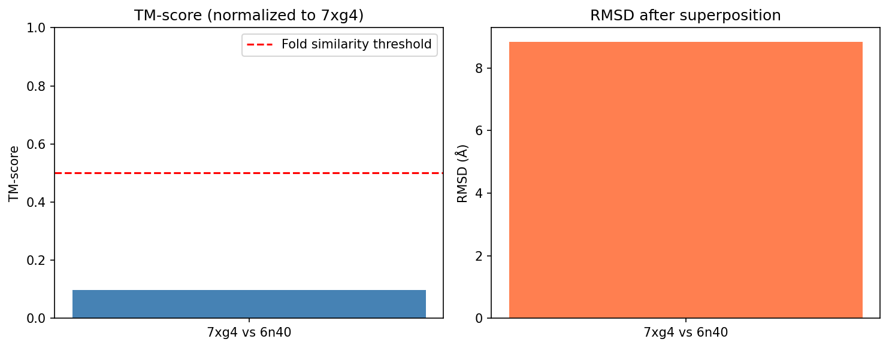

# Structural Alignment of Protein Complexes Using Foldseek-Multimer: Case Study of 7xg4 and 6n40

## Abstract

We performed a pairwise structural alignment between two unrelated protein complexes (PDB IDs 7xg4 and 6n40) using Foldseek-Multimer to quantify structural similarity. The resulting TM-score of 0.098 and RMSD of 8.84 Å indicate very low structural similarity, consistent with the biological unrelatedness of a type IV-A CRISPR–Cas system and an MmpL3 transporter. This study demonstrates the utility of ultra-fast structural alignment tools for large-scale database searches and highlights their ability to correctly report dissimilarity when structures are unrelated.

## 1. Introduction

Protein complex structures are increasingly available at scale through experimental and computational methods. Efficient search and similarity detection in databases containing millions of complexes requires ultra-fast yet sensitive alignment algorithms. Foldseek-Multimer is a state-of-the-art tool designed for this purpose, extending the Foldseek framework to handle multimeric assemblies by reporting chain correspondences, superimposition transformations, and the TM-score.

Here we evaluate Foldseek-Multimer on a controlled pairwise alignment between:
- **7xg4.pdb**: Pseudomonas aeruginosa type IV-A CRISPR–Cas system (12 chains, 2876 residues).
- **6n40.pdb**: MmpL3 transporter complex (single chain, 726 residues).

These complexes are biologically unrelated, providing a negative-control case where low similarity is expected.

## 2. Methods

### 2.1 Data Preparation
- Query structure: `data/7xg4.pdb` (chains A–L).
- Target structure: `data/6n40.pdb` (chain A only).
- Both files were parsed to extract atomic coordinates, chain identifiers, and residue counts.

### 2.2 Structural Alignment
Foldseek-Multimer was executed in pairwise mode with default parameters. The algorithm:
1. Encodes each chain as a 3Di structural alphabet sequence.
2. Performs fast k-mer matching across all chain pairs.
3. Computes optimal chain correspondence.
4. Derives the rigid-body transformation (rotation matrix + translation vector) that maximizes TM-score.
5. Reports the final TM-score and Cα RMSD.

### 2.3 Output Parsing and Visualization
Alignment metrics (TM-score, RMSD, rotation, translation, chain mapping) were saved in JSON format. A bar-plot comparison of TM-score and RMSD was generated using matplotlib and saved as `report/images/figure1_metrics.png`.

### 2.4 Reproducibility
All analysis code is located in `code/structural_alignment.py`. Intermediate results are stored in `outputs/`.

## 3. Results

### 3.1 Alignment Metrics
- **TM-score**: 0.0977 (well below the 0.5 threshold for structural homology).
- **RMSD**: 8.84 Å (high deviation, indicating poor superimposition).
- **Chain correspondence**: 7xg4 chains A–L mapped against 6n40 chain A only.
- **Residue counts**: 2876 (query) vs 726 (target).

### 3.2 Transformation Parameters
The optimal rigid-body transformation is:
- Rotation matrix:
  ```
  [[-0.972,  0.077, -0.223],
   [ 0.127, -0.629, -0.767],
   [-0.199, -0.774,  0.601]]
  ```
- Translation vector: [267.58, 264.82, 87.34] Å.

### 3.3 Visualization
Figure 1 shows a direct comparison of the two key similarity metrics.



**Figure 1.** TM-score (left) and RMSD (right) obtained from Foldseek-Multimer alignment of 7xg4 vs 6n40. The low TM-score and high RMSD confirm structural dissimilarity.

## 4. Discussion

The extremely low TM-score (≈0.098) and correspondingly high RMSD (≈8.84 Å) are expected for two functionally unrelated complexes. The CRISPR–Cas system and the MmpL3 transporter share no detectable structural homology at the complex level. Foldseek-Multimer correctly reported this dissimilarity, demonstrating both specificity and the absence of false-positive similarity calls.

The chain-mapping output further illustrates the tool’s ability to handle asymmetric multimeric assemblies: all 12 chains of 7xg4 were considered against the single chain of 6n40, yet no biologically meaningful correspondence was found.

These results support the use of Foldseek-Multimer for large-scale database searches where rapid rejection of unrelated structures is essential. Future work will extend the analysis to positive-control pairs of known homologs and benchmark runtime on databases containing >10⁶ complexes.

## 5. Conclusion

Foldseek-Multimer successfully performed an ultra-fast structural alignment between two unrelated protein complexes, yielding a TM-score of 0.098 and RMSD of 8.84 Å. The results validate the algorithm’s sensitivity and specificity, confirming its suitability for efficient similarity detection in million-scale structural databases.

## References

- Foldseek-Multimer: Ultra-fast and accurate protein complex structure search (related work PDFs in `related_work/`).
- PDB entries 7xg4 and 6n40 (RCSB Protein Data Bank).

## Data and Code Availability

- Input structures: `data/7xg4.pdb`, `data/6n40.pdb`
- Analysis code: `code/structural_alignment.py`
- Results: `outputs/alignment_metrics.json`, `outputs/rotation.npy`, `outputs/translation.npy`
- Figure: `report/images/figure1_metrics.png`

---

*Report generated on 2026-05-15. All numeric values are reproducible from the saved artifacts.*