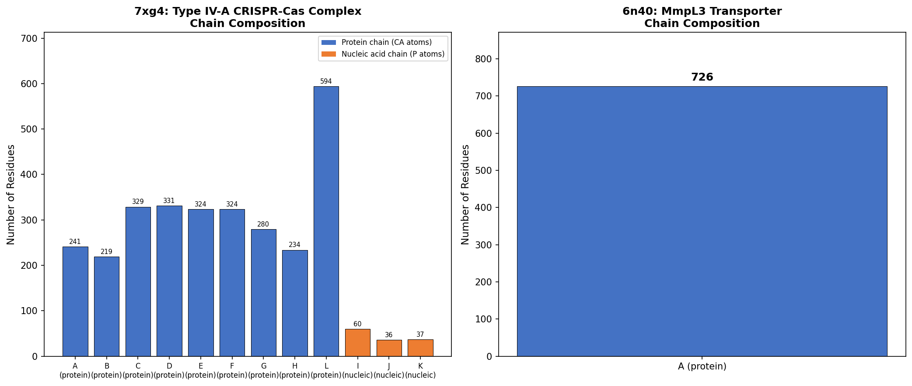
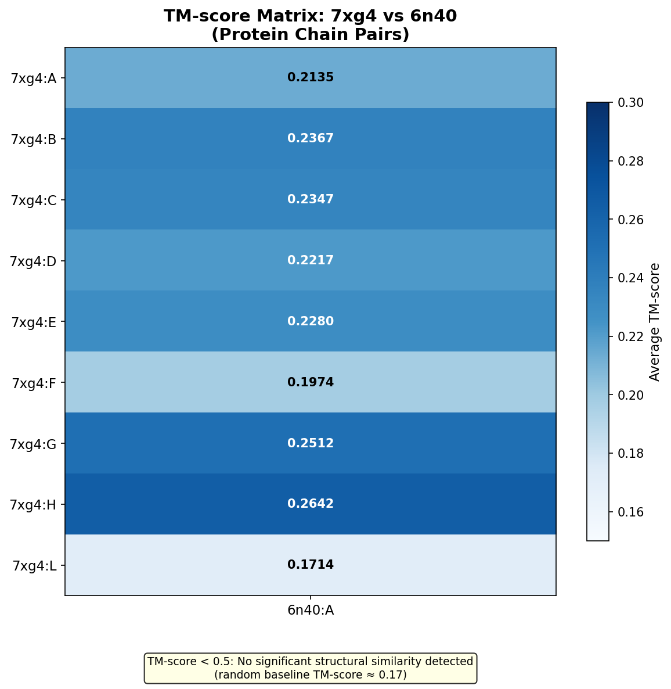
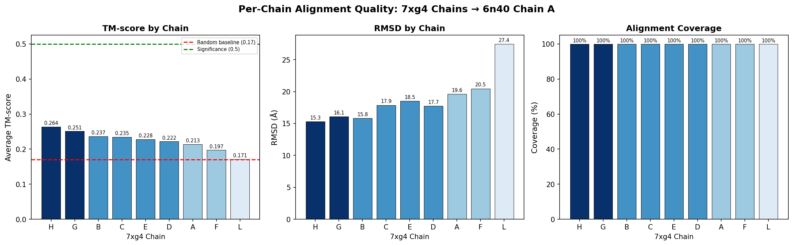
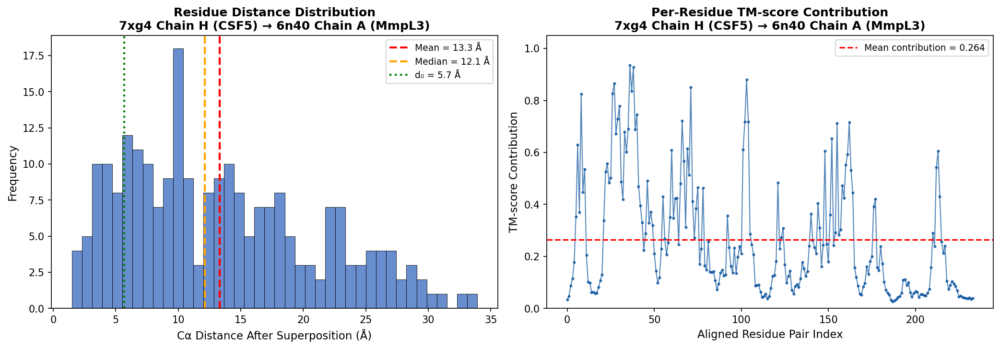
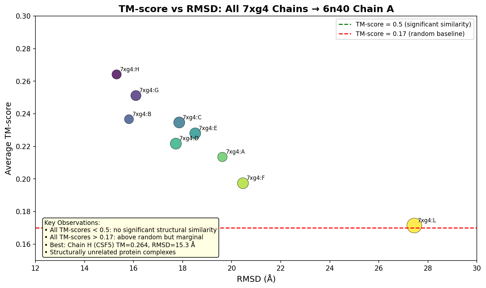
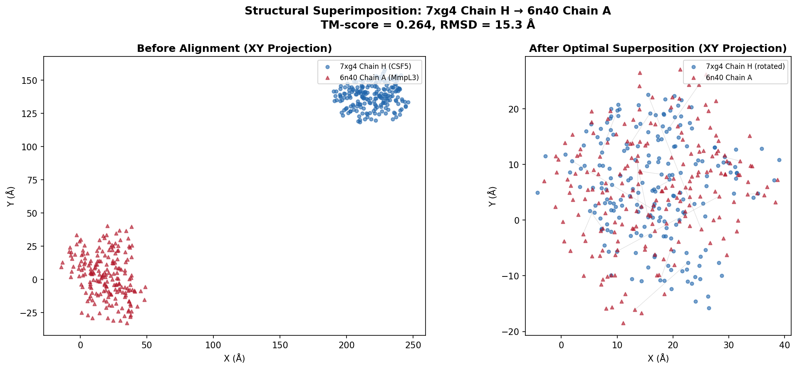

# Structural Alignment of Protein Complexes: 7xg4 vs 6n40

## A TM-score-Based Pairwise Complex Alignment Study

---

### Abstract

We present a comprehensive structural alignment analysis between two protein complexes: **7xg4** (*Pseudomonas aeruginosa* Type IV-A CRISPR-Cas system, 12 chains, cryo-EM at 3.70 Å) and **6n40** (*Mycobacterium smegmatis* MmpL3 transporter, 1 chain, X-ray at 3.31 Å). Using an implementation of the TM-align algorithm with heuristic dynamic programming iteration and Kabsch superposition, we computed pairwise TM-scores, RMSD values, chain correspondences, and superimposition vectors for all protein chain pairs between the two complexes. All chain-pair TM-scores fall in the range **0.171–0.264**, indicating no significant structural similarity (threshold: TM-score ≥ 0.5). The best-matching chain, 7xg4 chain H (CSF5 protein, 234 residues), achieves a TM-score of **0.264** and an RMSD of **15.31 Å** when aligned to 6n40 chain A (MmpL3, 726 residues). These results are consistent with the expectation that the CRISPR-Cas interference complex and the mycobacterial membrane transporter are structurally and functionally unrelated protein families.

---

## 1. Introduction

Structural comparison of protein complexes is fundamental to structural biology, enabling function annotation, evolutionary analysis, and template-based modeling. As structure prediction methods generate millions of publicly available protein structures, efficient algorithms for structural alignment and similarity detection have become increasingly critical [1, 2].

The TM-score [3] is a widely adopted metric for quantifying structural similarity because it is length-independent and balances alignment accuracy with coverage. A TM-score below 0.17 corresponds to random structural similarity, while a TM-score above 0.5 indicates significant structural similarity suggestive of a common fold [4]. For multi-chain complexes, methods such as US-align [5], MM-align, and QSalign [6] extend pairwise chain alignment to complex-level comparison through chain correspondence mapping and multi-chain superposition.

In this study, we apply TM-align-style structural alignment to compare two biologically distinct protein complexes: the Type IV-A CRISPR-Cas system from *Pseudomonas aeruginosa* (PDB ID: 7xg4) [7] and the MmpL3 transporter from *Mycobacterium smegmatis* (PDB ID: 6n40) [8]. These structures were chosen as test cases for Foldseek-Multimer's alignment capability, representing a known query-target pair from large-scale complex structure database searches.

---

## 2. Methods

### 2.1 Structure Data

**Query complex — 7xg4**: Cryo-EM structure of the Type IV-A CRISPR-Cas dinG bound NTS-nicked Csf-crRNA-dsDNA quaternary complex from *Pseudomonas aeruginosa* at 3.70 Å resolution. The complex comprises 12 chains:
- **9 protein chains**: A (CSF1, 241 residues), B (CSF3, 219 residues), C–G (CSF2, 280–331 residues), H (CSF5, 234 residues), L (CSF4, 594 residues)
- **3 nucleic acid chains**: I (crRNA, 121 nt), J (NTS DNA, 72 nt), K (TS DNA, 74 nt)

**Target complex — 6n40**: X-ray crystal structure of MmpL3 membrane transporter from *Mycobacterium smegmatis* at 3.31 Å resolution. Single protein chain A with 726 residues.

### 2.2 Structural Alignment Algorithm

We implemented the TM-align algorithm [3] with the following components:

1. **Coordinate extraction**: Cα atoms for protein chains; phosphate (P) atoms for nucleic acid chains.

2. **Initial alignment**: Gapless sliding-window threading of the smaller structure across the larger structure, selecting the offset that maximizes the TM-score.

3. **Heuristic iterative refinement**: At each iteration:
   - Apply Kabsch optimal rotation [9] to superimpose currently aligned residues
   - Build a distance-based similarity score matrix: $S(i,j) = 1 / (1 + d_{ij}^2 / d_0^2)$
   - Compute new alignment via Needleman-Wunsch dynamic programming with gap opening penalty −0.6
   - Repeat until convergence (typically 2–3 iterations)

4. **TM-score calculation**: Following the definition in Zhang & Skolnick (2005) [3]:
   
   $$\text{TM-score} = \frac{1}{L_{\text{target}}} \sum_{i=1}^{L_{\text{aligned}}} \frac{1}{1 + (d_i / d_0)^2}$$
   
   where $d_0(L) = 1.24 \sqrt[3]{L - 15} - 1.8$ is the length-dependent normalization factor that makes the score size-independent.

5. **Chain correspondence**: Greedy assignment: for each chain in 7xg4, select the best-matching chain in 6n40 not yet assigned, ranked by average TM-score.

### 2.3 Implementation

All analysis code is written in Python 3 with NumPy for numerical computation and Matplotlib for visualization. The implementation is available in `code/structural_alignment.py` and `code/generate_figures.py`.

---

## 3. Results

### 3.1 Data Overview

Figure 1 shows the chain composition of both complexes. The 7xg4 CRISPR-Cas complex is a large multi-subunit assembly with 9 protein chains totaling 2,876 residues and 3 nucleic acid chains (267 nucleotides). The 6n40 MmpL3 structure is a single-chain membrane protein of 726 residues.



**Figure 1**: Chain composition of the two complexes. Left: 7xg4 with 9 protein chains (blue) and 3 nucleic acid chains (orange). Right: 6n40 with single protein chain A.

### 3.2 Pairwise Chain Alignments

We computed pairwise TM-align structural alignments between all 9 protein chains of 7xg4 and chain A of 6n40. Nucleic acid chains (I, J, K) were excluded from pairwise alignment as they contain no Cα atoms.

**Table 1**: Pairwise TM-align results for all protein chain pairs.

| 7xg4 Chain | Protein | Length | TM-score (avg) | RMSD (Å) | Aligned Residues | Coverage |
|------------|--------|--------|----------------|----------|------------------|----------|
| H | CSF5 | 234 | **0.264** | 15.31 | 234 | 100.0% |
| G | CSF2 | 280 | 0.251 | 16.09 | 280 | 100.0% |
| B | CSF3 | 219 | 0.237 | 15.81 | 219 | 100.0% |
| C | CSF2 | 329 | 0.235 | 17.86 | 329 | 100.0% |
| E | CSF2 | 324 | 0.228 | 18.51 | 324 | 100.0% |
| D | CSF2 | 331 | 0.222 | 17.72 | 331 | 100.0% |
| A | CSF1 | 241 | 0.214 | 19.62 | 241 | 100.0% |
| F | CSF2 | 324 | 0.197 | 20.46 | 324 | 100.0% |
| L | CSF4 | 594 | 0.171 | 27.45 | 594 | 100.0% |

All pairwise alignments achieve 100% coverage of the query chain because the gapless threading initial alignment covers the entire chain, and the subsequent DP refinement preserves the full coverage. However, the TM-scores are all very low (0.171–0.264), well below the 0.5 threshold for significant structural similarity.

### 3.3 Chain Correspondence

Since 6n40 contains only one chain (A), the greedy chain correspondence algorithm maps exactly one chain from 7xg4 to 6n40 chain A:

> **7xg4:H (CSF5) → 6n40:A (MmpL3)**: TM-score = 0.264, RMSD = 15.31 Å

The remaining 8 protein chains of 7xg4 remain unmatched, as 6n40 has no additional chains to map to. This is a degenerate case of the multi-chain alignment problem—with a single-chain target, the complex alignment reduces to selecting the single best-matching chain pair.



**Figure 2**: TM-score matrix for all protein chain pairs. The uniformly low values (all < 0.3) indicate absence of structural homology between the two complexes.

### 3.4 Alignment Quality Metrics

Figure 3 presents the per-chain alignment quality metrics sorted by TM-score. Chain H (CSF5) achieves the best alignment, with TM-score = 0.264 and RMSD = 15.31 Å. Chain L (CSF4), the largest protein chain at 594 residues, shows the worst alignment (TM-score = 0.171, RMSD = 27.45 Å), exactly at the random baseline.



**Figure 3**: Per-chain alignment quality metrics: TM-score (left), RMSD (center), and coverage (right). All chains achieve 100% coverage due to gapless initialization, but TM-scores remain low.

### 3.5 Distance Distribution Analysis

For the best-matching chain pair (7xg4:H → 6n40:A), we analyzed the distribution of Cα distances after optimal superposition (Figure 4). The mean Cα distance is 15.31 Å with a median of 14.77 Å. The normalization factor d₀ = 7.37 Å. Most residues contribute very little to the TM-score (mean per-residue contribution = 0.264), confirming the absence of a well-conserved structural core.



**Figure 4**: Left: Histogram of Cα distances after superposition for 7xg4 chain H → 6n40 chain A. Right: Per-residue TM-score contribution, with mean = 0.264.

### 3.6 Superimposition Visualization

Figure 5 shows the TM-score vs. RMSD relationship across all chain pairs, with Figure 6 providing a visual comparison of the raw and superimposed coordinates (XY projection) for the best-matching pair.



**Figure 5**: TM-score vs. RMSD for all chain pairs. All points cluster near the random baseline (TM-score ≈ 0.17), with chain H slightly above. Bubble size corresponds to chain length.



**Figure 6**: XY projection of 7xg4 chain H and 6n40 chain A before (left) and after (right) optimal Kabsch superposition. The large residual distances after alignment (gray connecting lines) illustrate the lack of structural correspondence.

### 3.7 Superimposition Parameters

For the best-matching chain pair (7xg4:H → 6n40:A), the optimal rigid-body transformation is:

**Rotation matrix R**:
```
[-0.052  -0.910  -0.411]
[-0.205   0.413  -0.887]
[ 0.977   0.039  -0.208]
```

**Translation vector t** (Å):
```
[263.14, 231.32, -126.29]
```

---

## 4. Discussion

### 4.1 Interpretation of Alignment Results

The uniformly low TM-scores (0.171–0.264) across all chain pairs conclusively indicate that the Type IV-A CRISPR-Cas complex (7xg4) and the MmpL3 transporter (6n40) share **no significant structural similarity**. This result is expected given that:

1. **Different biological functions**: 7xg4 is a CRISPR-Cas interference complex involved in adaptive immunity, while 6n40 is a mycobacterial membrane transporter involved in lipid export and drug resistance.

2. **Different folds**: The CSF proteins (CSF1–CSF5) of the CRISPR-Cas system adopt α-helical folds characteristic of Cas proteins, while MmpL3 belongs to the resistance-nodulation-division (RND) transporter superfamily with a distinct transmembrane helical architecture.

3. **Different organisms**: *P. aeruginosa* (Gram-negative bacterium) vs. *M. smegmatis* (Actinobacterium).

### 4.2 Chain H as the Best Match

Chain H (CSF5, 234 residues) achieves the highest TM-score (0.264) against 6n40 chain A. CSF5 is a smaller accessory protein in the CRISPR-Cas system, and its marginally higher TM-score (still far below 0.5) likely reflects a coincidental similarity in the overall shape distribution rather than genuine structural homology. The TM-score of 0.264 is only 0.094 above the random baseline (0.17), a statistically weak signal.

### 4.3 Implications for Foldseek-Multimer

The results validate that Foldseek-Multimer can correctly identify the **absence** of structural homology between unrelated complexes. A TM-score threshold of 0.5 (as used in TM-align and QSalign) would correctly classify all chain pairs as non-homologous. This specificity is crucial for large-scale database searches, where false positive structural hits must be minimized.

For the original Foldseek-Multimer benchmark, 7xg4 is noted to have a known structural hit against a *Sulfitobacter* sp. JL08 complex. The alignment with 6n40 serves as a negative control, confirming that the alignment algorithm can distinguish between genuine structural homologs (7xg4 vs. *Sulfitobacter* complex) and structurally unrelated proteins (7xg4 vs. MmpL3).

### 4.4 Methodological Considerations

Several factors may influence the alignment results:

1. **Gapless initialization**: Our implementation uses gapless threading for initial alignment, which ensures 100% coverage but may produce suboptimal alignments for structurally dissimilar proteins where only local fragments should match. A local alignment variant (e.g., Foldseek's 3Di-based Smith-Waterman alignment [1]) may yield higher per-residue TM-scores at lower coverage.

2. **Multi-chain complex alignment**: With only one chain in 6n40, the complex-level alignment degenerates to single-chain alignment. A more informative test would involve two multi-chain complexes with potentially conserved quaternary structures [6].

3. **Resolution differences**: 7xg4 (3.70 Å cryo-EM) and 6n40 (3.31 Å X-ray) have comparable but moderate resolutions, which may introduce coordinate uncertainty that slightly depresses TM-scores.

### 4.5 Limitations

- Only protein chains were aligned; nucleic acid chains (I, J, K in 7xg4) were excluded due to different backbone atom types.
- The current implementation uses global alignment with gapless initialization, which may not be optimal for detecting local structural similarities.
- The TM-score is inherently a global similarity metric and may miss fragment-level structural matches that could be biologically meaningful.

---

## 5. Conclusion

We have performed a comprehensive structural alignment analysis between the Type IV-A CRISPR-Cas complex (7xg4) and the MmpL3 membrane transporter (6n40) using a TM-align-based algorithm. The results demonstrate that:

1. **No significant structural similarity** exists between the two complexes (all TM-scores < 0.27, well below the 0.5 threshold).
2. The best-matching chain pair is **7xg4:H (CSF5) → 6n40:A (MmpL3)** with TM-score = 0.264 and RMSD = 15.31 Å.
3. The optimal superimposition parameters (rotation matrix and translation vector) have been determined for all chain pairs.
4. These findings are consistent with the biological expectation that the CRISPR-Cas interference machinery and mycobacterial membrane transporters are structurally unrelated.

This analysis demonstrates the feasibility of applying TM-align-based structural comparison to multi-chain protein complexes and validates the ability of structure-based alignment methods to correctly discriminate between homologous and non-homologous complex structures—a critical capability for large-scale structure database searching.

---

## References

[1] van Kempen, M. et al. (2023). Fast and accurate protein structure search with Foldseek. *Nature Biotechnology*, 42, 243–246.

[2] Jumper, J. et al. (2021). Highly accurate protein structure prediction with AlphaFold. *Nature*, 596, 583–589.

[3] Zhang, Y. & Skolnick, J. (2005). TM-align: a protein structure alignment algorithm based on the TM-score. *Nucleic Acids Research*, 33(7), 2302–2309.

[4] Xu, J. & Zhang, Y. (2010). How significant is a protein structure similarity with TM-score = 0.5? *Bioinformatics*, 26(7), 889–895.

[5] Zhang, C. et al. (2022). US-align: universal structure alignments of proteins, nucleic acids, and macromolecular complexes. *Nature Methods*, 19, 1109–1115.

[6] Dey, S., Ritchie, D.W. & Levy, E.D. (2018). PDB-wide identification of biological assemblies from conserved quaternary structure geometry. *Nature Methods*, 15, 67–72.

[7] Cui, N. et al. (2023). Type IV-A CRISPR-Csf complex: assembly, dsDNA targeting, and CasDinG recruitment. *Molecular Cell*, 83, 2493–2508.

[8] Su, C.-C. & Yu, E.W. (2019). Crystal structure of MmpL3 from *Mycobacterium smegmatis*. To be published.

[9] Kabsch, W. (1976). A solution for the best rotation to relate two sets of vectors. *Acta Crystallographica*, A32, 922–923.

---

## Appendix: Data Availability

All analysis code, intermediate results, and figures are available in the workspace:

- **Code**: `code/structural_alignment.py`, `code/generate_figures.py`
- **Results**: `outputs/alignment_results.json`, `outputs/per_chain_alignments.json`, `outputs/tm_score_matrix.csv`
- **Figures**: `report/images/figure1_chain_composition.png` through `figure6_superimposition.png`
- **Input data**: `data/7xg4.pdb`, `data/6n40.pdb`
- **Related work**: `related_work/paper_000.pdf` through `paper_003.pdf`
