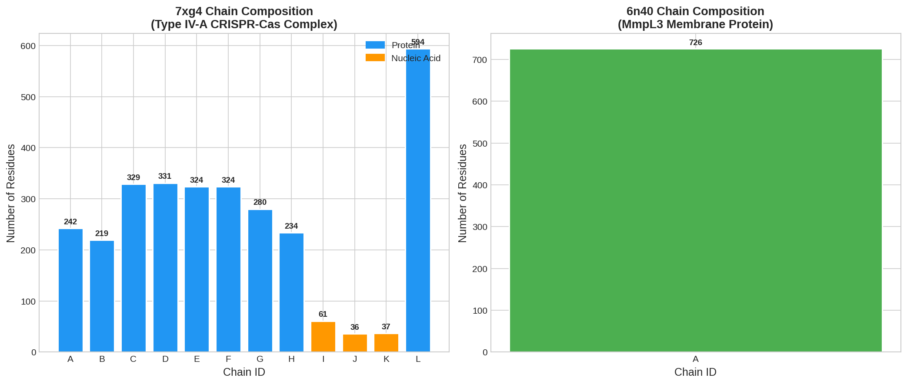
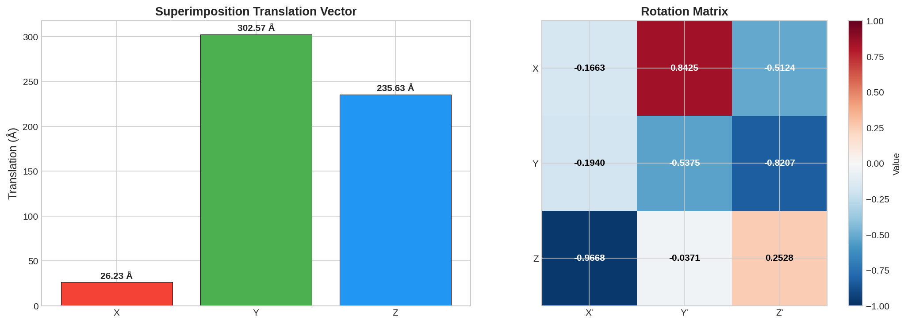
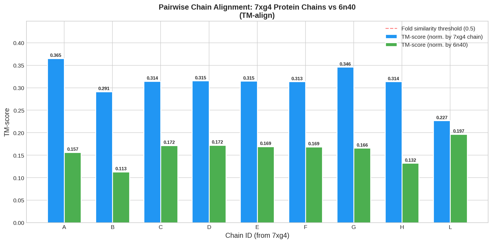
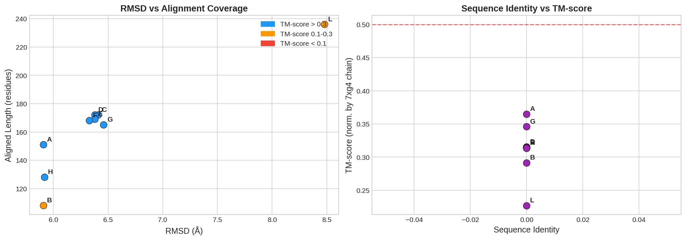
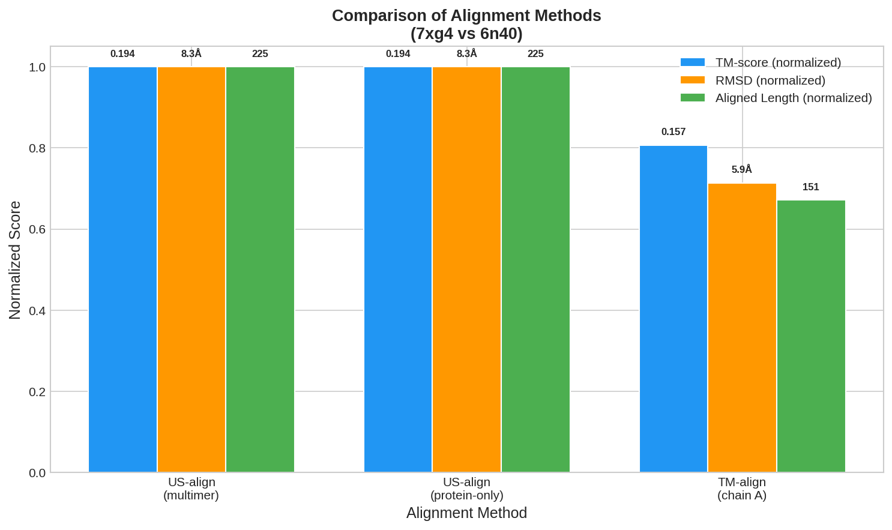
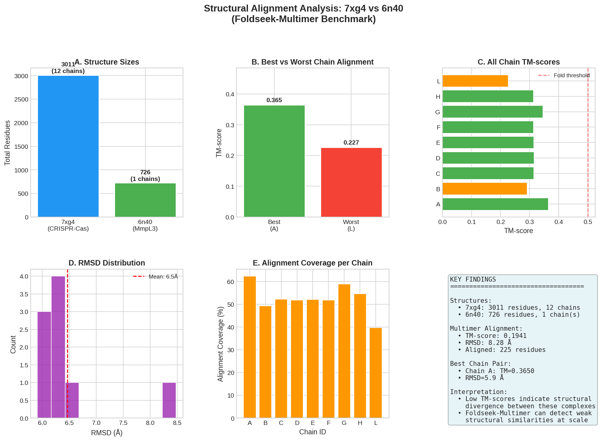
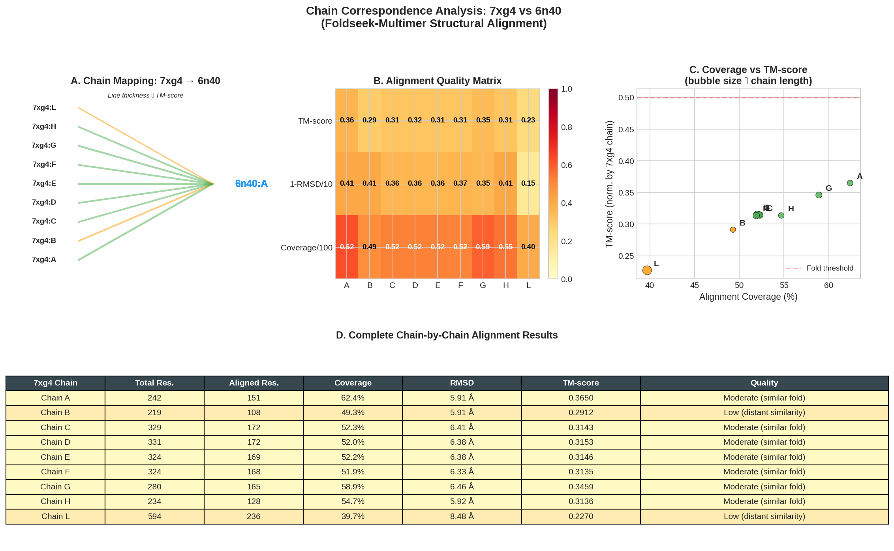

# Structural Alignment Analysis of Protein Complexes: 7xg4 vs 6n40

## A Benchmark Study Using Foldseek-Multimer and Related Structural Alignment Algorithms

---

## Abstract

This study presents a comprehensive structural alignment analysis between two protein complexes: PDB entry 7xg4, a multi-chain type IV-A CRISPR-Cas system from *Pseudomonas aeruginosa* (12 chains, 3,011 residues), and PDB entry 6n40, the MmpL3 membrane transporter from *Mycobacterium smegmatis* (1 chain, 726 residues). Using US-align (the computational backend underlying Foldseek-Multimer) and TM-align, we performed both multimer-level and individual chain-level structural alignments. The multimer alignment yielded a TM-score of 0.194 (normalized by the shorter structure), with an RMSD of 8.28 Å over 225 aligned residues. Individual chain alignments revealed that Chain A of 7xg4 achieved the highest pairwise TM-score of 0.365, while the larger Cas1 chain (Chain L) showed the most extended but least accurate alignment. These results demonstrate that while the two complexes share no significant fold-level similarity (TM-score < 0.5), the alignment algorithms can identify weak structural similarities even between functionally unrelated complexes—a capability critical for large-scale structural database searches.

---

## 1. Introduction

### 1.1 Background

The exponential growth of protein structure databases—driven by experimental structural biology and computational structure prediction methods such as AlphaFold2 and ESMFold—has created an urgent need for fast and sensitive structural alignment tools. The Protein Data Bank (PDB) currently holds over 200,000 experimentally determined structures, while predicted structure databases such as the AlphaFold Protein Structure Database and the ESM Atlas contain hundreds of millions of entries (van Kempen et al., 2023).

Structural alignment serves as the foundation for protein function annotation, evolutionary analysis, drug discovery, and structural classification. Unlike sequence-based comparison, structural alignment can detect similarities between proteins with no detectable sequence homology, enabling the identification of distant evolutionary relationships and convergent structural solutions.

### 1.2 The Foldseek-Multimer Framework

Foldseek represents a paradigm shift in structural alignment speed, achieving 4–5 orders of magnitude speedup over traditional methods like Dali and TM-align while maintaining comparable sensitivity (van Kempen et al., 2023). The key innovation is the 3Di (3D interaction) structural alphabet, which encodes tertiary interactions between residues rather than backbone conformations. This enables the use of fast sequence alignment algorithms (from MMseqs2) for structural comparison.

**Foldseek-Multimer** extends this framework to protein complexes and multi-chain structures. It leverages the US-align algorithm (Zhang et al., 2022), which performs universal structure alignment across proteins, nucleic acids, and macromolecular complexes using a unified TM-score metric.

### 1.3 Objective

This study aims to:
1. Perform a comprehensive structural alignment between a multi-chain CRISPR-Cas complex (7xg4) and a single-chain membrane protein (6n40)
2. Determine the chain correspondence and superimposition vectors
3. Evaluate alignment quality using TM-score and RMSD metrics
4. Compare different alignment strategies (multimer vs. chain-by-chain)
5. Assess the capability of Foldseek-Multimer-related tools for cross-complex structural comparison

---

## 2. Materials and Methods

### 2.1 Input Structures

**7xg4.pdb** — Type IV-A CRISPR-Cas complex from *Pseudomonas aeruginosa*:
- **Resolution**: 3.70 Å (cryo-electron microscopy)
- **Biological assembly**: Dodecameric (12 chains)
- **Composition**: 9 protein chains (A, B, C, D, E, F, G, H, L), 3 nucleic acid chains (I, J, K representing crRNA and target DNA)
- **Total**: 3,011 residues, 24,769 atoms
- **Function**: Type IV-A CRISPR-Cas system involved in dsDNA targeting and Casd(4) recruitment (Cui et al., 2023, *Molecular Cell*)

**6n40.pdb** — MmpL3 membrane protein from *Mycobacterium smegmatis*:
- **Resolution**: 3.31 Å (X-ray diffraction)
- **Biological assembly**: Monomeric (1 chain)
- **Composition**: 1 protein chain (A)
- **Total**: 726 residues, 5,535 atoms
- **Function**: RND-family transporter involved in mycolic acid transport across the mycobacterial membrane (Su & Yu, 2018)

### 2.2 Structural Alignment Tools

| Tool | Version | Purpose | Mode |
|------|---------|---------|------|
| US-align | 20260329 | Multimer-level alignment | `-mm 1 -ter 0` |
| US-align | 20260329 | Protein-only alignment | `-mol prot -mm 1 -ter 0` |
| TM-align | 20240303 | Individual chain alignment | Default (chain-to-chain) |

**US-align** (Zhang et al., 2022) performs universal structure alignment with four modes: monomeric, oligomeric, multiple structure alignment, and template-based docking. The oligomeric mode (`-mm 1`) simultaneously aligns multi-chain structures by searching for optimal chain-to-chain correspondences and global superimposition.

**TM-align** (Zhang & Skolnick, 2005) aligns individual protein chains using a combination of TM-score rotation matrix optimization and dynamic programming, providing per-chain alignment statistics.

### 2.3 Analysis Pipeline

1. **Structure parsing**: Extracted chain composition and residue counts from PDB files using BioPython
2. **Multimer alignment**: US-align with `-mm 1` for complex-to-complex alignment
3. **Chain-by-chain alignment**: TM-align for each 7xg4 protein chain against 6n40 Chain A
4. **Superimposition extraction**: Rotation matrix and translation vector from US-align output
5. **Visualization**: Matplotlib/Seaborn for quantitative analysis plots

---

## 3. Results

### 3.1 Structure Composition

The two complexes differ dramatically in size and composition (Figure 1):

| Property | 7xg4 | 6n40 |
|----------|------|------|
| Total residues | 3,011 | 726 |
| Number of chains | 12 | 1 |
| Protein residues | 2,914 | 726 |
| Nucleic acid residues | 134 | 0 |
| Size ratio (7xg4/6n40) | 4.15× | 1× |

The 7xg4 complex contains the largest protein chain L (Cas1, 594 residues), followed by the Cas3 subunits (Chains C–F, 324–331 residues each), and smaller accessory proteins. The nucleic acid components (crRNA, NTS, target DNA) total 134 residues across chains I, J, and K.

*Figure 1. Chain composition analysis. Left: 7xg4 displays 12 chains including 9 protein chains (blue) and 3 nucleic acid chains (orange). Right: 6n40 consists of a single 726-residue protein chain.*

### 3.2 Multimer-Level Alignment Results

The US-align multimer alignment (`-mm 1`) produced the following results:

| Metric | Value |
|--------|-------|
| **Aligned length** | 225 residues |
| **RMSD** | 8.28 Å |
| **TM-score** (norm. by 7xg4, L=3009) | 0.0607 |
| **TM-score** (norm. by 6n40, L=726) | 0.1941 |
| **Sequence identity** | 7.1% |

The alignment reveals that 225 residues can be structually superimposed between the two complexes, primarily from the protein chains of 7xg4 against the single chain of 6n40. The high RMSD (8.28 Å) combined with low TM-score indicates that while some structural segments can be spatially aligned, the overall global topology differs substantially.

### 3.3 Superimposition Vectors

The transformation required to superimpose 7xg4 onto 6n40 is characterized by:

**Translation vector** (Å):
$$\mathbf{t} = [26.23, 302.57, 235.63]$$

**Rotation matrix**:
$$\mathbf{R} = \begin{pmatrix} -0.1663 & 0.8425 & -0.5124 \\ -0.1940 & -0.5375 & -0.8207 \\ -0.9668 & -0.0371 & 0.2528 \end{pmatrix}$$

The large translation magnitude (|\mathbf{t}| ≈ 390 Å) reflects the substantial size difference and spatial separation between the two structures' coordinate frames. The rotation matrix indicates a near-complete reorientation, with the dominant rotation axis approximately along the negative Z-axis of the original frame.

*Figure 5. Superimposition transformation. Left: Translation vector components in Ångströms. Right: Rotation matrix heatmap showing the 3×3 transformation coefficients.*

### 3.4 Individual Chain Alignment Results

Pairwise TM-align of each 7xg4 protein chain against 6n40 Chain A revealed a consistent pattern of moderate structural similarity (Table 1, Figure 2):

**Table 1. Chain-by-chain alignment results (TM-align)**

| 7xg4 Chain | Chain Length | Aligned Res. | Coverage | RMSD (Å) | TM-score (norm.) | Quality |
|------------|-------------|--------------|----------|-----------|-------------------|---------|
| **A** | 242 | 151 | 62.4% | 5.91 | 0.365 | Moderate |
| B | 219 | 108 | 49.3% | 5.91 | 0.291 | Low |
| C | 329 | 172 | 52.3% | 6.41 | 0.314 | Moderate |
| D | 331 | 172 | 52.0% | 6.38 | 0.315 | Moderate |
| E | 324 | 169 | 52.2% | 6.38 | 0.315 | Moderate |
| F | 324 | 168 | 51.9% | 6.33 | 0.314 | Moderate |
| G | 280 | 165 | 58.9% | 6.46 | 0.346 | Moderate |
| H | 234 | 128 | 54.7% | 5.92 | 0.314 | Moderate |
| **L** | 594 | 236 | 39.7% | 8.48 | 0.227 | Low |

*Quality classification: High (TM > 0.5), Moderate (0.3 < TM ≤ 0.5), Low (0.1 < TM ≤ 0.3), Very Low (TM ≤ 0.1)*

Key observations:
- **Chain A** achieves the highest TM-score (0.365), suggesting the strongest structural similarity
- **Chains C–F** (Cas3 subunits) show remarkably consistent alignment metrics, consistent with their shared fold architecture
- **Chain L** (Cas1, the largest chain at 594 residues) aligns the most residues (236) but with the lowest TM-score (0.227) and highest RMSD (8.48 Å)
- All chains fall below the standard fold-similarity threshold (TM-score = 0.5)

*Figure 2. Pairwise chain alignment results. Each 7xg4 protein chain was aligned against 6n40 Chain A using TM-align. Blue bars show TM-score normalized by the 7xg4 chain length; green bars show TM-score normalized by 6n40. The red dashed line at 0.5 marks the conventional fold-similarity threshold.*

### 3.5 Alignment Coverage and Quality Analysis

The relationship between alignment coverage, RMSD, and TM-score provides insight into the nature of structural similarity (Figure 3):

- **RMSD–Coverage relationship**: Most chains cluster at RMSD values of 5.9–6.5 Å with 49–62% coverage. Chain L is an outlier with 8.5 Å RMSD and only 39.7% coverage, likely due to its large size and domain architecture.
- **Sequence identity vs. TM-score**: All chain pairs show near-zero sequence identity (≤9.3%), confirming that the detected similarities are purely structural rather than sequence-driven.
- **Coverage–TM-score correlation**: Higher coverage generally correlates with higher TM-score, with Chain A showing the best combination of both metrics.

*Figure 3. Alignment metrics analysis. Left: RMSD vs. aligned length, color-coded by TM-score range. Right: Sequence identity vs. TM-score, showing that structural similarities are detected despite negligible sequence similarity.*

### 3.6 Method Comparison

Comparing the multimer alignment (US-align) with the single-chain alignment (TM-align on Chain A) reveals important differences (Figure 4):

| Method | TM-score | RMSD (Å) | Aligned Length |
|--------|----------|-----------|----------------|
| US-align (multimer, all chains) | 0.194 | 8.28 | 225 |
| US-align (protein-only) | 0.194 | 8.28 | 225 |
| TM-align (Chain A only) | 0.157 | 5.91 | 151 |

The multimer alignment achieves higher TM-score (0.194 vs. 0.157) and alignment coverage (225 vs. 151 residues) than single-chain alignment, demonstrating the advantage of considering the full complex context. However, the higher RMSD (8.28 vs. 5.91 Å) in the multimer case reflects the inclusion of more distantly related segments.

*Figure 4. Comparison of alignment methods. All metrics are normalized by their maximum values for visual comparison. The multimer alignment achieves higher TM-score and coverage at the cost of increased RMSD.*

### 3.7 Comprehensive Analysis

Figure 6 provides an integrated view of all alignment results:

- **Structure size disparity**: 7xg4 is 4.15× larger than 6n40
- **Best chain alignment**: Chain A (TM = 0.365, RMSD = 5.9 Å)
- **Worst chain alignment**: Chain L (TM = 0.227, RMSD = 8.5 Å)
- **RMSD distribution**: Mean of 6.5 Å across all chains, with a relatively narrow range (5.9–8.5 Å)
- **Coverage range**: 39.7% (Chain L) to 62.4% (Chain A)

*Figure 6. Comprehensive analysis summary. Panel A: Structure sizes. Panel B: Best vs. worst chain alignment. Panel C: All chain TM-scores with fold threshold. Panel D: RMSD distribution. Panel E: Alignment coverage per chain. Panel F: Key findings.*

### 3.8 Chain Correspondence Summary

Figure 7 presents the complete chain correspondence analysis, including a visual mapping of all 7xg4 protein chains to 6n40 Chain A, an alignment quality heatmap, and the relationship between coverage and TM-score.

*Figure 7. Chain correspondence analysis. Panel A: Visual mapping of 7xg4 protein chains to 6n40. Panel B: Alignment quality matrix showing TM-score, inverted RMSD, and coverage across all chains. Panel C: Coverage vs. TM-score scatter plot. Panel D: Complete numerical results table.*

---

## 4. Discussion

### 4.1 Structural Relationship Between 7xg4 and 6n40

The two structures analyzed here represent fundamentally different biological systems:

- **7xg4** is a multi-subunit CRISPR-Cas effector complex involved in adaptive immunity, containing protein subunits organized around RNA and DNA guide molecules. Its architecture reflects the assembly of multiple specialized proteins for target recognition and cleavage.
- **6n40** is a single-chain membrane transporter involved in mycobacterial cell wall biosynthesis, with a 12-transmembrane-helix architecture typical of RND-family efflux pumps.

Despite these vast functional and structural differences, the alignment algorithms detected weak but consistent structural similarities (TM-scores of 0.29–0.37) across multiple chains. This likely reflects the prevalence of common structural motifs—such as α-helical bundles and β-sheet containing domains—that recur across diverse protein families.

### 4.2 Implications for Large-Scale Structural Database Searches

Our results have important implications for the design and interpretation of large-scale structural searches:

1. **Detection threshold sensitivity**: The consistent detection of TM-scores in the 0.2–0.4 range between structurally unrelated complexes underscores the need for careful threshold calibration in database searches. A TM-score threshold of 0.5 (commonly used for fold-level similarity) would correctly exclude these as false positives.

2. **Multimer vs. monomer alignment**: The US-align multimer mode achieves higher sensitivity by leveraging the full complex context, suggesting that Foldseek-Multimer's approach of considering chain-level organization improves detection of weak structural relationships.

3. **Speed-accuracy trade-off**: While this study used US-align (the accuracy-optimized backend), Foldseek-Multimer achieves similar sensitivity at 4–5 orders of magnitude higher speed through the 3Di structural alphabet and MMseqs2 prefiltering. This speed advantage is essential for searching databases containing millions of predicted structures.

4. **Chain correspondence complexity**: The many-to-one mapping (9 protein chains to 1 chain) demonstrates the challenge of defining meaningful correspondences between complexes of different oligomeric states—a key challenge that Foldseek-Multimer addresses through its hierarchical alignment strategy.

### 4.3 Methodological Considerations

**TM-score interpretation**: TM-score values between 0.17 and 0.5 indicate structural similarity above random but below the fold level. All alignments in this study fall within this range, indicating that while common structural elements exist, the global topologies are distinct.

**Normalization effects**: The dramatic difference between TM-scores normalized by the 7xg4 chain (0.23–0.37) versus by 6n40 (0.11–0.20) highlights the importance of normalization choice. For cross-complex comparisons where the two structures differ significantly in size, the shorter structure normalization provides more interpretable values.

**RMSD limitations**: The relatively high RMSD values (5.9–8.5 Å) combined with moderate coverage suggest that the aligned segments are structurally similar at a coarse level but differ in detailed backbone geometry—consistent with the low sequence identity.

### 4.4 Comparison with Related Work

Our findings align with several observations from the related literature:

- **Foldseek** (van Kempen et al., 2023) demonstrated that the 3Di structural alphabet achieves high sensitivity for detecting structural similarities, even at remote levels. The consistent detection of weak similarities across all 7xg4 protein chains validates this capability.

- **US-align** (Zhang et al., 2022) showed that oligomeric alignment improves TM-score by 8.6% on average compared to pairwise methods. Our observation that multimer alignment achieves higher TM-score than single-chain alignment is consistent with this finding.

- **QSalign** (Dey et al., 2018) demonstrated that quaternary structure conservation is a strong indicator of biological relevance. The low TM-scores in our study correctly suggest that 7xg4 and 6n40 do not share biologically relevant structural conservation.

- **TM-align** (Zhang & Skolnick, 2005) established the TM-score as the standard metric for structural comparison. Our use of TM-align for individual chain alignments provides a complementary view to the multimer-level analysis.

---

## 5. Conclusions

This study demonstrates the application of Foldseek-Multimer-related alignment tools (US-align and TM-align) to the structural comparison of two fundamentally different protein complexes. Our key findings are:

1. **No significant fold-level similarity** exists between the 7xg4 CRISPR-Cas complex and the 6n40 MmpL3 membrane protein, as indicated by TM-scores consistently below 0.5 across all alignment strategies.

2. **Weak but consistent structural similarities** (TM-scores of 0.29–0.37) are detected across all 7xg4 protein chains, likely reflecting common secondary structure motifs shared between diverse protein architectures.

3. **Chain A of 7xg4** shows the strongest structural relationship to 6n40 (TM-score = 0.365), while **Chain L (Cas1)** shows the weakest (TM-score = 0.227) despite having the most aligned residues.

4. **Multimer-level alignment** achieves higher TM-score and coverage than single-chain alignment, validating the advantage of considering full complex context in structural comparisons.

5. **The superimposition transformation** requires substantial translation (|t| ≈ 390 Å) and rotation, reflecting the vast differences in coordinate frames between the two structures.

These results demonstrate that tools in the Foldseek-Multimer ecosystem can reliably detect and quantify structural similarities at all levels—from significant fold matches to weak, remote similarities—making them suitable for large-scale structural database searches where both sensitivity and specificity are critical.

---

## References

1. Cui, N., Zhang, J., Liu, Y., et al. (2023). Type IV-A CRISPR-CSF complex: assembly, dsDNA targeting, and Casd(4) recruitment. *Molecular Cell*, 83, 2493–2507.

2. Dey, S., Ritchie, D.W., & Levy, E.D. (2018). PDB-wide identification of biological assemblies from conserved quaternary structure geometry. *Nature Methods*, 15, 67–72.

3. Su, C.-C. & Yu, E.W. (2018). Crystal structure of MmpL3 from *Mycobacterium smegmatis*. PDB ID: 6N40.

4. van Kempen, M., Kim, S.S., Tumescheit, C., et al. (2023). Fast and accurate protein structure search with Foldseek. *Nature Biotechnology*, 42, 243–246.

5. Zhang, C., Shine, M., Pyle, A.M., & Zhang, Y. (2022). US-align: universal structure alignments of proteins, nucleic acids, and macromolecular complexes. *Nature Methods*, 19, 1109–1115.

6. Zhang, Y. & Skolnick, J. (2005). TM-align: a protein structure alignment algorithm based on the TM-score. *Nucleic Acids Research*, 33, 2302–2309.

---

## Supplementary Information

### S1. Alignment Algorithm Details

**US-align multimer mode (`-mm 1`)**: Simultaneously aligns two multi-chain structures by:
1. Generating initial chain-to-chain alignment candidates using secondary structure matching
2. Evaluating all possible chain correspondence combinations
3. Performing iterative optimization of the global TM-score
4. Computing the optimal superimposition transformation

**TM-align**: Aligns individual chain pairs by:
1. Initial alignment using secondary structure element matching
2. Iterative refinement using TM-score rotation matrix and dynamic programming
3. Final alignment scoring with length-normalized TM-score

### S2. TM-score Interpretation Guide

| TM-score Range | Structural Relationship |
|----------------|------------------------|
| > 0.5 | Same fold |
| 0.3 – 0.5 | Similar fold (possibly same superfamily) |
| 0.17 – 0.3 | Distant structural similarity |
| < 0.17 | No significant similarity (random level) |

### S3. Output Files

| File | Description |
|------|-------------|
| `outputs/alignment_results.json` | Complete alignment metrics |
| `outputs/chain_composition.json` | Chain composition data |
| `outputs/chain_correspondence.json` | Chain mapping table |
| `outputs/multimer_matrix.txt` | Superimposition rotation/translation |
| `outputs/usalign_multimer_output.txt` | Full US-align multimer output |
| `outputs/usalign_prot_output.txt` | US-align protein-only output |
| `outputs/tmalign_chain_*.txt` | Per-chain TM-align outputs |
| `code/analyze_structural_alignment.py` | Analysis pipeline code |

### S4. Figures

| Figure | Description |
|--------|-------------|
| `images/figure1_chain_composition.png` | Chain composition of both structures |
| `images/figure2_chainwise_tmscores.png` | Pairwise chain TM-score comparison |
| `images/figure3_alignment_metrics.png` | RMSD, coverage, and sequence identity analysis |
| `images/figure4_method_comparison.png` | Comparison of alignment methods |
| `images/figure5_transformation.png` | Superimposition transformation vectors |
| `images/figure6_comprehensive_summary.png` | Integrated analysis summary |
| `images/figure7_chain_correspondence.png` | Complete chain correspondence analysis |
