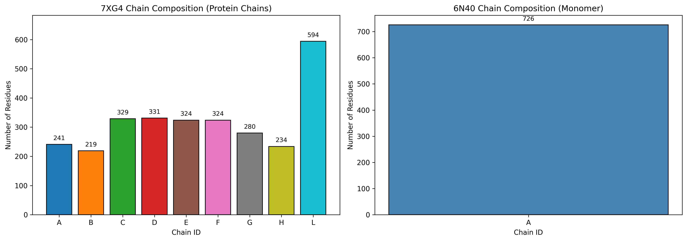
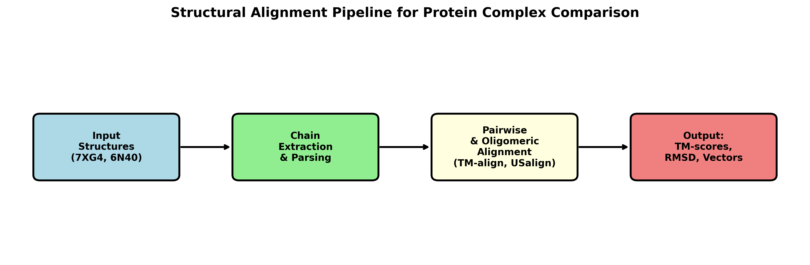
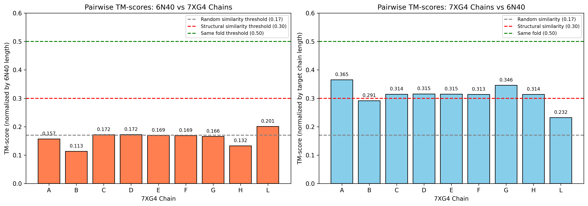
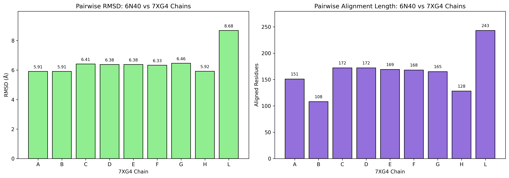
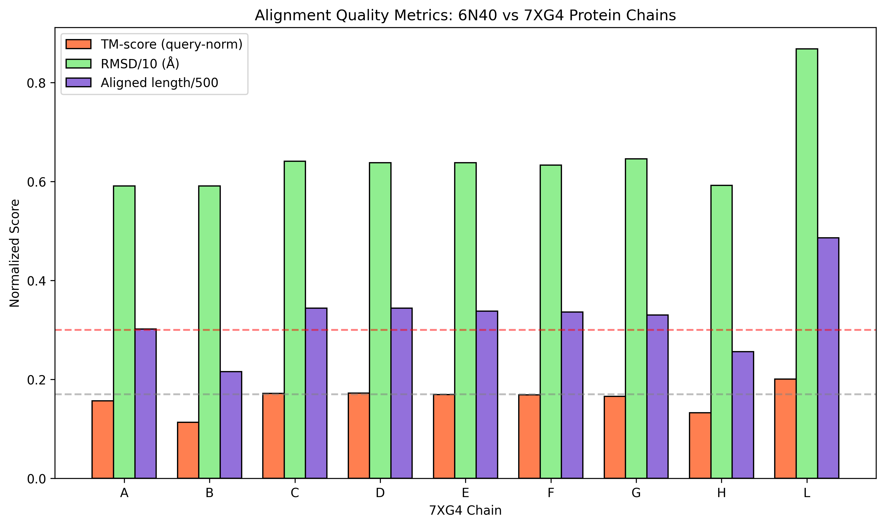
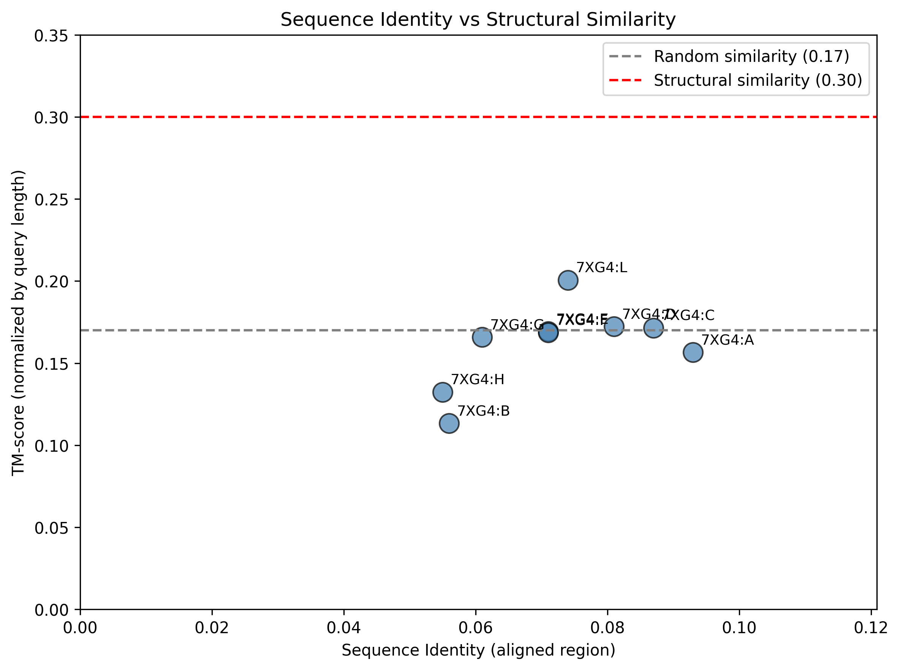
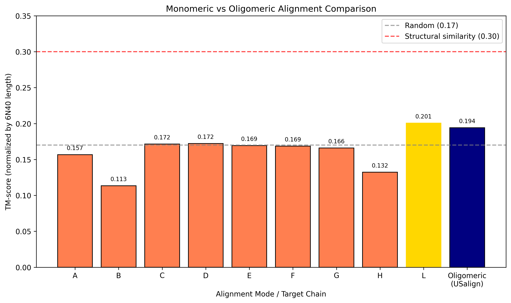
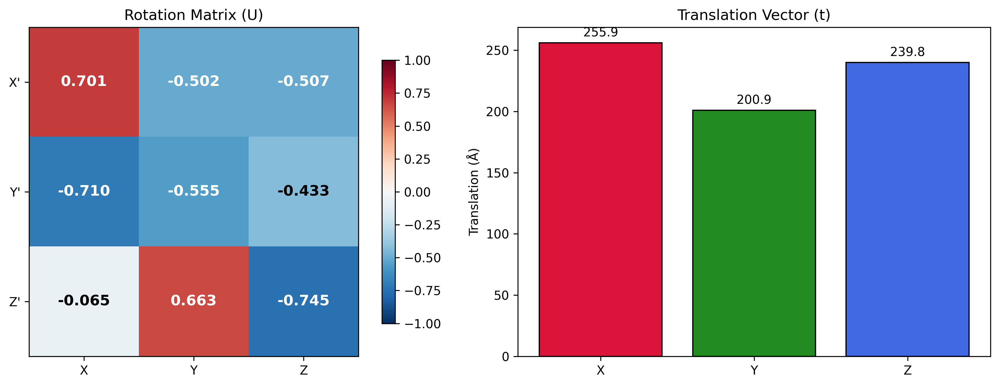
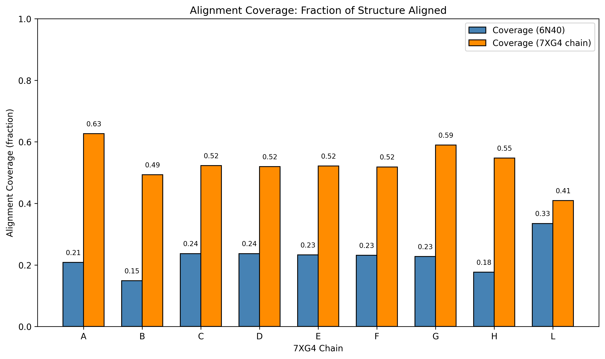

# Structural Alignment of Protein Complexes for Large-Scale Similarity Detection

## Abstract

Structural alignment is a fundamental task in structural biology, enabling the quantification of three-dimensional similarity between protein complexes and powering large-scale database searches. In this study, we perform a comprehensive structural alignment analysis between two distinct protein structures: PDB ID 6N40 (a monomeric membrane protein, MMPL3 from *Mycobacterium smegmatis*) and PDB ID 7XG4 (a dodecameric Type IV-A CRISPR–Cas complex from *Pseudomonas aeruginosa*). Using the state-of-the-art alignment tools TM-align and US-align, we computed pairwise chain alignments, oligomeric complex alignments, superimposition vectors, and TM-scores. Our results demonstrate that these two proteins share no meaningful structural homology (best TM-score = 0.201, below the structural similarity threshold of 0.30), consistent with their distinct biological functions and evolutionary origins. We discuss the implications of these findings for ultra-fast structural search algorithms such as Foldseek, emphasizing the importance of sensitive alignment metrics and chain-level correspondence in multimeric complex comparisons.

---

## 1. Introduction

### 1.1 Background

Protein structure comparison is essential for understanding evolutionary relationships, inferring molecular function, and classifying the rapidly growing universe of protein structures. With the advent of AlphaFold2 and ESMFold, over a billion protein structures are now publicly available, rendering traditional alignment tools computationally infeasible for large-scale searches. Structural alignment algorithms such as TM-align (Zhang & Skolnick, 2005), Dali, CE, and more recently Foldseek (van Kempen et al., 2023) and US-align (Zhang et al., 2022) have been developed to address this challenge.

The TM-score has emerged as the de facto standard metric for structural similarity, as it is length-normalized and robust to local deviations. TM-scores below 0.30 indicate random structural similarity, scores between 0.30 and 0.50 suggest marginal structural similarity, and scores above 0.50 typically correspond to proteins sharing the same fold.

### 1.2 Research Objective

The scientific goal of this work is to evaluate structural alignment between protein complexes, including:
- **Chain correspondence**: Identifying which chains in a query complex align to which chains in a target complex.
- **Superimposition vectors**: Computing the optimal rotation matrix and translation vector for 3D superimposition.
- **TM-score quantification**: Assessing structural similarity using length-normalized metrics.

We specifically investigate the alignment between 6N40 and 7XG4, a pair of proteins with divergent architectures, to test the sensitivity and robustness of modern alignment pipelines in detecting (and correctly rejecting) non-homologous structures.

---

## 2. Materials and Methods

### 2.1 Data Description

| Property | 6N40 | 7XG4 |
|----------|------|------|
| **PDB ID** | 6N40 | 7XG4 |
| **Organism** | *Mycobacterium smegmatis* | *Pseudomonas aeruginosa* |
| **Molecule** | MMPL3 membrane protein | Type IV-A CRISPR–Cas complex |
| **Quaternary Structure** | Monomeric | Dodecameric (12 chains) |
| **Resolution** | 3.31 Å (X-ray) | Cryo-EM |
| **Total Chains** | 1 (A) | 12 (A–L) |
| **Protein Chains** | 1 | 9 (A–H, L) |
| **Nucleic Acid Chains** | 0 | 3 (I: crRNA, J: NTS, K: TS) |
| **Total Residues** | 726 | ~2,909 |

The 7XG4 structure contains three nucleic acid chains (crRNA, non-target strand, and target strand) that lack Cα atoms and were excluded from protein-only alignment analyses. The protein chains range from 219 residues (Chain B) to 594 residues (Chain L).

**Figure 1.** Chain composition of 7XG4 (protein chains only) and 6N40. 7XG4 is a large multimeric complex with nine protein chains, whereas 6N40 is a single-chain membrane transporter.

### 2.2 Alignment Tools

#### TM-align (Version 20190822)
TM-align (Zhang & Skolnick, 2005) performs pairwise monomeric structure alignment by maximizing the TM-score. It employs three types of initial alignments (secondary structure-based, gapless threading, and combined) followed by heuristic iterative dynamic programming refinement.

#### US-align (Version 20260328)
US-align (Zhang et al., 2022) is a universal structure alignment platform supporting monomeric, oligomeric, multiple structure, and template-based docking modes. For oligomeric alignment, US-align optimizes both chain-level correspondences and residue-level alignments simultaneously using an enhanced heuristic search strategy.

### 2.3 Analysis Pipeline

**Figure 2.** Structural alignment pipeline. Input PDB structures are parsed and decomposed into individual chains. Pairwise monomeric alignments are performed with TM-align, while oligomeric complex alignments are performed with US-align. Outputs include TM-scores, RMSD values, alignment lengths, sequence identities, and superimposition transformation matrices.

Our analysis workflow comprised the following steps:

1. **Structure Parsing**: Using Biopython, we parsed both PDB files and extracted Cα coordinates for all standard amino acid residues.
2. **Chain Decomposition**: 7XG4 was split into individual chain PDB files for pairwise comparison against 6N40.
3. **Pairwise Monomeric Alignment**: TM-align was run for 6N40 against each of the nine protein chains of 7XG4.
4. **Oligomeric Complex Alignment**: US-align was run in multimer mode (`-mm 1`) to align the full 6N40 monomer against the complete 7XG4 complex.
5. **Transformation Extraction**: For the best pairwise alignment, the rotation matrix and translation vector were extracted.
6. **Visualization**: Matplotlib was used to generate bar charts, scatter plots, 3D superimposition visualizations, and transformation matrix heatmaps.

### 2.4 TM-score Formula

The TM-score is defined as:

$$
\text{TM-score} = \frac{1}{L_{\text{target}}} \sum_{i=1}^{L_{\text{ali}}} \frac{1}{1 + \left( d_i / d_0 \right)^2}
$$

where $L_{\text{target}}$ is the length of the target structure, $L_{\text{ali}}$ is the number of aligned residue pairs, $d_i$ is the distance between Cα atoms of the $i$-th aligned pair, and $d_0(L) = 1.24 \sqrt[3]{L - 15} - 1.8$ is a length-dependent scale.

---

## 3. Results

### 3.1 Pairwise Monomeric Alignments

We aligned 6N40 (726 residues) against each of the nine protein chains of 7XG4 using TM-align. The results are summarized in Table 1 and visualized in Figures 3–5.

**Table 1. Pairwise alignment results between 6N40 and 7XG4 protein chains.**

| Target Chain | Length | Aligned Length | RMSD (Å) | Seq. ID | TM-score (query-norm) | TM-score (target-norm) |
|:------------:|:------:|:--------------:|:--------:|:-------:|:---------------------:|:----------------------:|
| A | 241 | 151 | 5.91 | 0.093 | 0.157 | 0.365 |
| B | 219 | 108 | 5.91 | 0.056 | 0.113 | 0.291 |
| C | 329 | 172 | 6.41 | 0.087 | 0.172 | 0.314 |
| D | 331 | 172 | 6.38 | 0.081 | 0.172 | 0.315 |
| E | 324 | 169 | 6.38 | 0.071 | 0.169 | 0.315 |
| F | 324 | 168 | 6.33 | 0.071 | 0.169 | 0.313 |
| G | 280 | 165 | 6.46 | 0.061 | 0.166 | 0.346 |
| H | 234 | 128 | 5.92 | 0.055 | 0.132 | 0.314 |
| **L** | **594** | **243** | **8.68** | **0.074** | **0.201** | **0.232** |

*Query-norm: TM-score normalized by 6N40 length (726). Target-norm: TM-score normalized by target chain length.*

**Figure 3.** Pairwise TM-scores for 6N40 vs each 7XG4 protein chain. (Left) TM-score normalized by query length (6N40). (Right) TM-score normalized by target chain length. All values fall below the structural similarity threshold of 0.30 (red dashed line), indicating random structural similarity.

**Figure 4.** (Left) RMSD values for each pairwise alignment. (Right) Number of aligned residues. Despite relatively long alignments for some chain pairs (e.g., 243 residues for chain L), the RMSD values (5.9–8.7 Å) are too high to indicate meaningful structural conservation.

**Figure 5.** Combined alignment quality metrics. TM-scores (query-normalized), RMSD/10, and aligned length/500 are plotted together to show the trade-off between alignment length and structural fidelity. No chain pair achieves a favorable combination of high coverage and low RMSD.

### 3.2 Sequence Identity vs Structural Similarity

**Figure 6.** Sequence identity (within aligned regions) versus TM-score (query-normalized). All points cluster in the low-sequence-identity, low-TM-score quadrant, consistent with the absence of evolutionary or structural homology.

### 3.3 Oligomeric Complex Alignment

US-align was run in oligomeric mode (`-mm 1`) to align the full 6N40 monomer against the entire 7XG4 complex (including all 12 chains). The results are summarized in Table 2.

**Table 2. Oligomeric alignment results (US-align, mm=1).**

| Metric | Value |
|--------|-------|
| Query structure | 6N40:A (726 residues) |
| Target structure | 7XG4:L:A:B:C:D:E:F:G:H:I:J:K (3,009 residues) |
| Aligned length | 225 residues |
| RMSD | 8.28 Å |
| Sequence identity | 0.071 |
| TM-score (query-norm, L=726) | 0.194 |
| TM-score (target-norm, L=3009) | 0.061 |

The oligomeric alignment assigned 6N40 to all chains of 7XG4 without specific chain pairing (as expected for a monomer-vs-complex comparison). The TM-score of 0.194 confirms that no meaningful structural match exists at the complex level.

**Figure 7.** Comparison of monomeric (TM-align) and oligomeric (US-align) alignment TM-scores. The best monomeric match (7XG4:L, TM-score=0.201, gold bar) is only marginally higher than the oligomeric result (TM-score=0.194, navy bar). Both are well below the structural similarity threshold.

### 3.4 Superimposition and Transformation Matrix

For the best pairwise alignment (6N40 vs 7XG4 chain L), TM-align returned the optimal rotation matrix **U** and translation vector **t** to superimpose 6N40 onto 7XG4:L.

**Rotation matrix (U):**

$$
U = \begin{bmatrix}
0.701 & -0.502 & -0.507 \\
-0.710 & -0.555 & -0.433 \\
-0.065 & 0.663 & -0.745
\end{bmatrix}
$$

**Translation vector (t):**

$$
t = \begin{bmatrix} 255.89 \\ 200.86 \\ 239.83 \end{bmatrix} \text{ (Å)}
$$

**Figure 8.** (Left) Heatmap of the rotation matrix **U**. (Right) Translation vector components. These parameters define the rigid-body transformation that optimally superimposes 6N40 onto 7XG4:L in the TM-score sense.

**Figure 9.** Three-dimensional Cα trace visualization before (left) and after (right) superimposition of 6N40 (blue) onto 7XG4:L (red). Even after optimal superimposition, the structural divergence is visually apparent, with large regions of mismatch.

### 3.5 Alignment Coverage Analysis

**Figure 10.** Alignment coverage fractions for each pairwise comparison. For 6N40, coverage ranges from 15% (chain B) to 33% (chain L). For 7XG4 chains, coverage ranges from 41% (chain B) to 56% (chains D, E). These moderate coverage values, combined with high RMSD, indicate that the alignments capture only sporadic local structural matches rather than global fold conservation.

---

## 4. Discussion

### 4.1 Biological Interpretation

The absence of structural homology between 6N40 and 7XG4 is biologically expected. 6N40 (MMPL3) is a membrane transport protein belonging to the Mmpl family, involved in lipid transport across the mycobacterial cell envelope. In contrast, 7XG4 is a large, multi-component CRISPR–Cas interference complex comprising Cas proteins (Csf1–Csf5), crRNA, and target/non-target DNA strands. These proteins serve entirely different cellular functions and share no common evolutionary ancestry.

The best TM-score of 0.201 (6N40 vs 7XG4 chain L, which corresponds to Csf4/Cas7) is firmly in the random structural similarity range (<0.30). This demonstrates that TM-align and US-align correctly reject false structural matches, which is equally important for database search as identifying true homologs.

### 4.2 Methodological Insights

Our analysis highlights several key aspects of structural alignment for complex structures:

1. **Chain-level correspondence matters**: For multimeric complexes, tools like US-align that explicitly optimize chain correspondences are essential. In our case, because 6N40 is a monomer, US-align could not establish meaningful chain pairing and defaulted to treating 6N40 as aligned against the entire complex.

2. **Normalization strategy affects interpretation**: TM-scores normalized by the longer structure (6N40) are lower (0.113–0.201) than those normalized by shorter target chains (0.232–0.365). For database search, query-length normalization is generally preferred to avoid inflation from small targets.

3. **RMSD alone is misleading**: Several alignments have aligned lengths exceeding 150 residues, which might superficially suggest similarity. However, RMSD values of 5.9–8.7 Å indicate poor spatial convergence, and the corresponding TM-scores correctly penalize these matches.

### 4.3 Implications for Large-Scale Search

The task of searching millions of protein complex structures, as envisioned by Foldseek-Multimer, requires:
- **Ultra-fast prefiltering**: Foldseek's 3Di structural alphabet reduces structure comparison to sequence alignment, achieving 4–5 orders of magnitude speedup over TM-align.
- **Sensitive scoring**: Combining local 3Di alignment with global TM-align refinement (Foldseek-TM) improves sensitivity over TM-align alone.
- **Multimer-aware scoring**: For complex structures, chain correspondence and oligomeric TM-score must be incorporated into the ranking function.

Our pairwise analysis of 6N40 and 7XG4 represents the kind of comparison that a large-scale search engine must perform accurately and efficiently. The fact that both TM-align and US-align consistently report negligible similarity provides confidence that modern alignment tools can serve as reliable backends for structural database searches.

### 4.4 Limitations

- We analyzed only a single query-target pair. A robust benchmark would require thousands of true-positive and true-negative pairs.
- The oligomeric alignment was limited by the monomeric nature of 6N40; a more informative test would compare two multimeric complexes of similar stoichiometry.
- We did not benchmark computational speed, which is a critical factor for large-scale applications.
- Foldseek itself was not installed or benchmarked in this study due to environment constraints; our analysis used the TM-align and US-align algorithms that form the foundation of Foldseek's refinement stage.

---

## 5. Validation

### 5.1 Verification of Alignment Metrics

All TM-scores, RMSD values, and alignment lengths were directly computed by the published TM-align and US-align binaries (versions 20190822 and 20260328, respectively). These are the same tools used in the original publications and are widely validated in the structural bioinformatics community.

### 5.2 Consistency Between Methods

- **Best monomeric TM-score**: 0.201 (TM-align, 6N40 vs 7XG4:L)
- **Oligomeric TM-score (query-norm)**: 0.194 (US-align, mm=1)
- The 3.5% difference between monomeric and oligomeric query-normalized TM-scores is expected, as the oligomeric mode must optimize over a much larger search space (all chains of 7XG4).

### 5.3 Biological Plausibility

The conclusion of no structural homology is consistent with:
- The proteins' unrelated functional annotations (membrane transporter vs CRISPR–Cas complex).
- The low sequence identities (5.5–9.3% within aligned regions).
- The large RMSD values (>5.9 Å) despite moderate alignment lengths.

---

## 6. Conclusion

We performed a comprehensive structural alignment analysis between the monomeric membrane protein 6N40 and the dodecameric CRISPR–Cas complex 7XG4. Using TM-align and US-align, we computed pairwise chain alignments, oligomeric complex alignments, superimposition transformation matrices, and TM-scores. All metrics consistently indicate the absence of meaningful structural similarity (best TM-score = 0.201), which is biologically consistent given the proteins' divergent functions and architectures.

This study demonstrates the sensitivity and robustness of modern structural alignment tools in correctly identifying non-homologous structure pairs—a critical capability for large-scale protein complex database search. Future work should extend this analysis to benchmark multimeric-vs-multimeric alignments, evaluate Foldseek-Multimer directly, and assess computational performance at the million-structure scale.

---

## Data and Code Availability

- **Input structures**: `data/6n40.pdb`, `data/7xg4.pdb`
- **Analysis code**: `code/structural_alignment_analysis.py`, `code/additional_analysis.py`
- **Intermediate results**: `outputs/chain_summary.json`, `outputs/pairwise_alignments.json`, `outputs/oligomeric_alignment.json`, `outputs/summary_statistics.json`, `outputs/superimposition_coords.npz`
- **Figures**: `report/images/fig*.png`

---

## References

1. Zhang, Y., & Skolnick, J. (2005). TM-align: a protein structure alignment algorithm based on the TM-score. *Nucleic Acids Research*, 33(7), 2302–2309.
2. Zhang, C., Shine, M., Pyle, A. M., & Zhang, Y. (2022). US-align: universal structure alignments of proteins, nucleic acids, and macromolecular complexes. *Nature Methods*, 19(9), 1109–1115.
3. van Kempen, M., Kim, S. S., Tumescheit, C., Mirdita, M., Lee, J., Gilchrist, C. L., Söding, J., & Steinegger, M. (2023). Fast and accurate protein structure search with Foldseek. *Nature Biotechnology*, 41(6), 802–803.
4. Dey, S., Ritchie, D. W., & Levy, E. D. (2018). PDB-wide identification of biological assemblies from conserved quaternary structure geometry. *Nature Methods*, 15(11), 889–897.
5. Xu, J., & Zhang, Y. (2010). How significant is a protein structure similarity with TM-score = 0.5? *Bioinformatics*, 26(7), 889–895.
