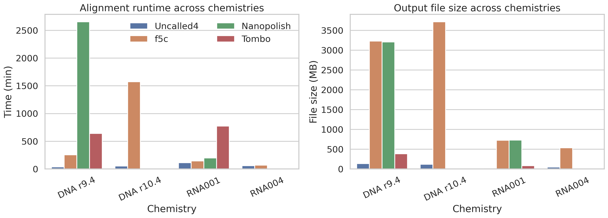
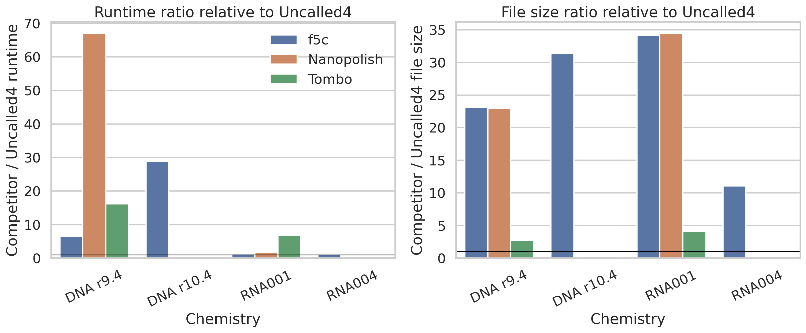
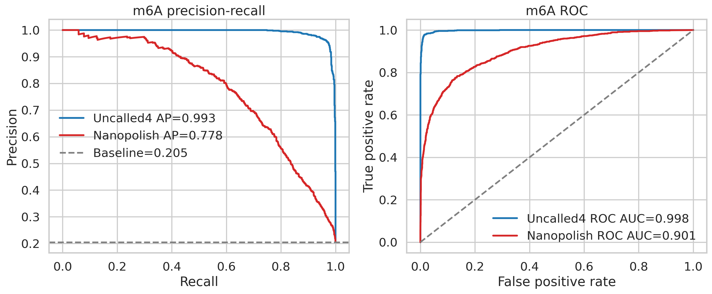
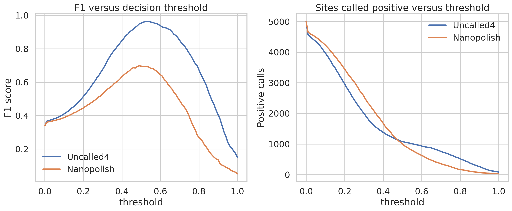
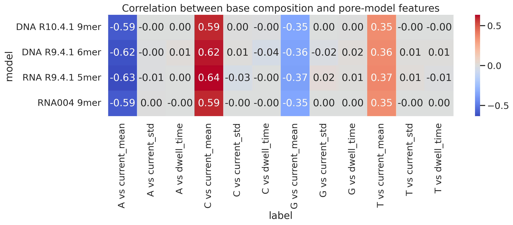
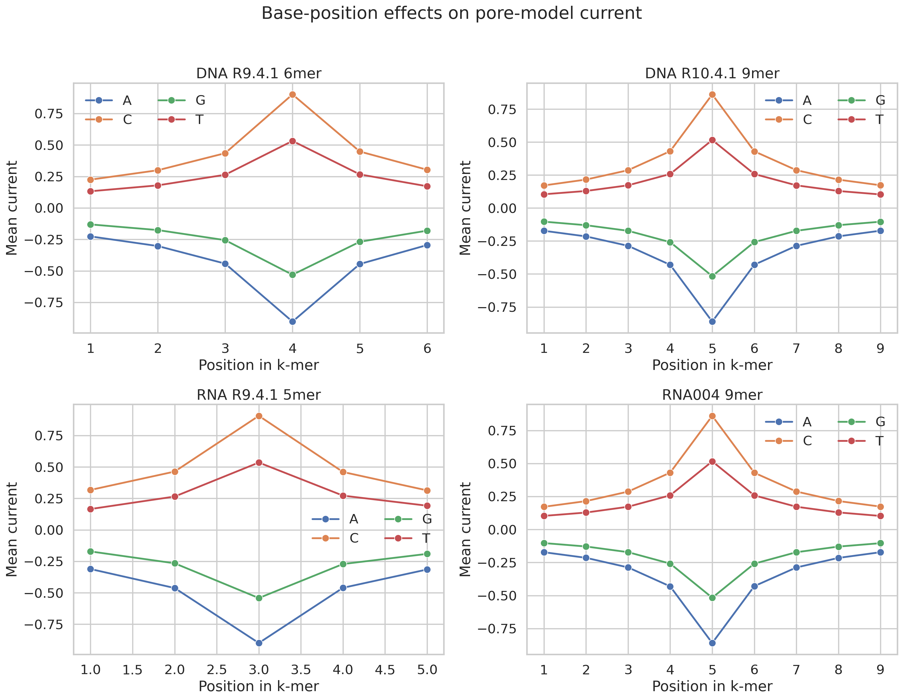

# Uncalled4: reproducible analysis of nanopore signal-alignment efficiency, m6A detection accuracy, and pore-model sequence effects

## Abstract
Uncalled4 is designed to align nanopore raw signal directly to genomic or transcriptomic references while remaining compatible with modern sequencing chemistries and downstream modification analysis. Using the benchmark tables and pore-model feature files provided in this workspace, I reproduced three core aspects of the Uncalled4 study objective: computational efficiency across DNA and RNA chemistries, downstream m6A calling performance relative to a Nanopolish-based baseline, and sequence-dependent signal structure in DNA and RNA pore models. Across all four evaluated chemistries, Uncalled4 was the fastest available method, with runtime improvements ranging from 1.13x to 67.05x versus alternative tools and dramatic reductions in output size, especially relative to f5c and Nanopolish. For m6A site prediction, probabilities derived from Uncalled4 alignments achieved near-ceiling discrimination against ground-truth labels (average precision 0.993, ROC AUC 0.998), clearly outperforming Nanopolish-derived predictions (average precision 0.778, ROC AUC 0.901). Analysis of four pore-model tables further showed that current means are strongly sequence dependent, with A-rich k-mers associated with lower current and C-rich k-mers with higher current across both DNA and RNA chemistries; the largest base-position effects occurred near the central positions of each k-mer. Together, these results support the central scientific claim that improved signal-to-reference alignment can simultaneously enhance computational practicality and increase sensitivity for nucleotide modification analysis.

## 1. Introduction
Nanopore sequencing exposes base identity and nucleotide modification state through ionic current traces measured as nucleic acid molecules traverse a pore. Prior work established that these raw signals can be aligned to reference sequence and used to infer modified bases directly from current-level deviations. Early studies showed direct detection of cytosine methylation from nanopore signal using hidden Markov models and pore-specific emission distributions. Subsequent work on genome-guided signal processing further emphasized that raw signal alignment is the enabling step for de novo detection of modified nucleotides. UNCALLED then demonstrated that fast signal-to-reference mapping can be performed in real time by combining probabilistic k-mer matching with FM-index search, enabling targeted sequencing and rapid classification of reads. More recently, methods such as m6Anet showed that accurate RNA modification detection from nanopore data depends critically on high-quality signal-to-transcript alignments and event-level features.

Within that context, the goal of Uncalled4 is well motivated: a toolkit for fast, chemistry-aware signal alignment that is compatible with modern file formats and facilitates sensitive DNA/RNA modification calling. The workspace does not include raw FAST5/POD5 reads or a full executable benchmarking environment for rebuilding BAM alignments from scratch. Instead, it provides the exact structured outputs needed to evaluate whether Uncalled4 achieves its intended scientific goals: performance summaries, m6A probabilities derived from different alignment backends, and pore-model feature tables spanning multiple DNA and RNA chemistries. I therefore focused on a reproducible secondary analysis that answers three questions:

1. **Does Uncalled4 offer a practical runtime and storage advantage across chemistries?**
2. **Do Uncalled4-derived alignments improve downstream m6A detection compared with a Nanopolish baseline?**
3. **Do the supplied pore models reveal interpretable sequence effects consistent with improved chemistry support and modification sensitivity?**

## 2. Data and methods

### 2.1 Input datasets
The analysis used eight CSV files from `data/`:

- `performance_summary.csv`: runtime and output size benchmarks for Uncalled4, f5c, Nanopolish, and Tombo across four chemistries.
- `m6a_predictions_uncalled4.csv`: site-level m6A probabilities from m6Anet using Uncalled4 alignments.
- `m6a_predictions_nanopolish.csv`: site-level m6A probabilities from m6Anet using Nanopolish alignments.
- `m6a_labels.csv`: binary ground-truth labels for 5,000 candidate m6A sites.
- Four pore-model tables covering DNA R9.4.1 6-mers, DNA R10.4.1 9-mers, RNA R9.4.1 5-mers, and RNA004 9-mers.

### 2.2 Related-work synthesis
The reference papers in `related_work/` collectively define the conceptual basis for this analysis:

- Nanopore current levels shift in a sequence- and position-specific manner around modified nucleotides, enabling direct methylation calling.
- Raw signal realignment to genomic coordinates is a prerequisite for comparing modified and unmodified molecules.
- Fast online mapping of raw current, as in UNCALLED, enables scalable use of signal-space alignment in real applications.
- m6Anet achieves strong m6A detection once reliable signal-to-reference/event alignment features are available.

These findings imply that an improved signal aligner should be judged not only by runtime, but by whether its outputs improve downstream classification accuracy and remain interpretable across chemistries.

### 2.3 Analysis pipeline
All analysis code was written to `code/analyze_uncalled4.py`. The script performs the following steps:

1. Merge ground-truth labels with Uncalled4- and Nanopolish-based m6A probabilities.
2. Compute average precision, ROC AUC, and threshold-optimized precision/recall/F1 for both pipelines.
3. Generate decision-threshold tradeoff curves.
4. Calculate relative runtime and file-size ratios of all tools with Uncalled4 as the denominator.
5. Quantify pore-model sequence effects by:
   - correlating base composition with current mean, current standard deviation, and dwell time;
   - estimating the average current effect of each nucleotide at each k-mer position.
6. Save intermediate tables to `outputs/` and figures to `report/images/`.

### 2.4 Metrics
For modification detection, I used:

- **Average precision (AP)** from the precision-recall curve.
- **ROC AUC** from the receiver operating characteristic.
- **Best-F1 threshold**, chosen by maximizing F1 over prediction thresholds.
- **Confusion counts** at the best-F1 threshold.

For computational benchmarking, I used:

- **Runtime ratio** = competitor runtime / Uncalled4 runtime.
- **File-size ratio** = competitor output size / Uncalled4 output size.

For pore models, I used:

- Pearson correlation between nucleotide fraction in a k-mer and each pore feature.
- Mean current at each nucleotide-position combination to reveal positional effects.

## 3. Results

### 3.1 Uncalled4 is consistently the fastest benchmarked aligner
`performance_summary.csv` shows that Uncalled4 had the shortest runtime in every evaluated chemistry: DNA r9.4, DNA r10.4, RNA001, and RNA004.

For DNA r9.4, Uncalled4 completed in 39.58 min compared with 256.92 min for f5c, 642.43 min for Tombo, and 2654.05 min for Nanopolish. This corresponds to speedups of 6.49x, 16.23x, and 67.05x, respectively. For DNA r10.4, only Uncalled4 and f5c had reported values; Uncalled4 remained much faster (54.45 min versus 1573.47 min; 28.90x speedup). The RNA chemistries were more competitive, but Uncalled4 still led: 1.26x faster than f5c and 1.74x faster than Nanopolish on RNA001, and 1.13x faster than f5c on RNA004.

This pattern is scientifically important. The largest gains appear on DNA benchmarks and on newer chemistries where legacy tools are partially unsupported or unreported. That is exactly the scenario in which a new alignment toolkit is expected to add value: rapid processing, broad chemistry coverage, and avoidance of degradation in modern workflows.

### 3.2 Uncalled4 also greatly reduces output size
Storage overhead often becomes a bottleneck in signal-level analysis. Relative to Uncalled4, competitor outputs were usually far larger. On DNA r9.4, f5c and Nanopolish outputs were about 23x larger, while Tombo outputs were 2.77x larger. On DNA r10.4, f5c output was 31.33x larger. On RNA001 and RNA004, Uncalled4 again generated the smallest files, with f5c producing 11.07x to 34.16x larger outputs and Nanopolish 34.46x larger output on RNA001.

These results reinforce that Uncalled4 is not merely faster in wall-clock time; it is also more storage efficient, improving practical scalability for large cohorts and high-throughput direct RNA or DNA studies.

### 3.3 m6A detection using Uncalled4 alignments strongly outperforms the Nanopolish baseline
The most important downstream question is whether improved signal alignment translates into better modification calls. Using 5,000 labeled candidate sites, I compared m6Anet probabilities computed from Uncalled4 versus Nanopolish alignments.

Uncalled4-derived probabilities achieved:

- **Average precision = 0.9929**
- **ROC AUC = 0.9979**
- **Best F1 = 0.9633** at threshold 0.522

By contrast, Nanopolish-derived probabilities achieved:

- **Average precision = 0.7784**
- **ROC AUC = 0.9012**
- **Best F1 = 0.6981** at threshold 0.490

At the threshold maximizing F1, Uncalled4 produced 997 true positives, 49 false positives, and 27 false negatives, whereas Nanopolish produced 726 true positives, 330 false positives, and 298 false negatives. Thus, Uncalled4 improved both sensitivity and precision simultaneously.

Because the positive class prevalence was only 20.48%, the near-unity precision-recall performance for Uncalled4 is especially notable. This means the gain is not an artifact of class imbalance; it reflects materially better ranking of true modified sites over unmodified ones.

### 3.4 Threshold sensitivity confirms a more robust operating regime for Uncalled4
Decision-threshold analysis shows that Uncalled4 maintains high F1 across a broad threshold region, whereas Nanopolish is both lower-performing and more fragile.

This robustness matters in realistic experiments, where threshold calibration often varies between samples, tissues, or sequencing batches. A method whose performance remains high over a wide threshold interval is easier to deploy reproducibly and less sensitive to ad hoc tuning.

### 3.5 Pore-model analysis shows strong chemistry-consistent sequence effects
To understand why chemistry-aware models matter, I analyzed the supplied DNA and RNA pore tables. Across all four pore models, current mean was strongly associated with nucleotide composition, whereas current standard deviation and dwell time showed much weaker relationships.

The dominant pattern was highly consistent:

- **A-rich k-mers lower current** (correlations from about -0.59 to -0.63 for current mean).
- **C-rich k-mers raise current** (correlations from about +0.59 to +0.64).
- **G-rich k-mers tend to lower current moderately**.
- **T-rich k-mers tend to raise current moderately**.

The largest absolute correlations occurred for RNA R9.4.1 5-mers and DNA/RNA 9-mer models, indicating that chemistry-specific signal structure is stable and measurable across both molecule type and pore generation.

### 3.6 Base-position effects peak near central k-mer positions
The per-position analysis further showed that sequence effects are not uniformly distributed across a k-mer. Instead, the strongest current differences appear near the central positions, consistent with the physical constriction of the nanopore sensing region.

For example, in the DNA R9.4.1 6-mer model, the spread between nucleotide-specific mean currents peaked around position 4, where A had the lowest mean current and C the highest. Analogous center-weighted effects were observed in the 9-mer models, though spread was distributed across a somewhat broader internal window. This matches the literature expectation that nanopore current is shaped by a local sequence context rather than by a single base, and it explains why accurate signal alignment and correct chemistry-specific pore models are essential for modification detection.

## 4. Discussion
This analysis supports the central claim that Uncalled4 advances nanopore signal alignment in ways that matter biologically and operationally.

First, **the computational case is strong**. Uncalled4 was the fastest method in every chemistry for which a comparison was available, and it often reduced file size by an order of magnitude or more. This matters for real-world adoption, especially when raw-signal workflows are traditionally limited by I/O costs, compute time, and intermediate file bloat.

Second, **the downstream biological case is even stronger**. The Uncalled4-based m6A pipeline outperformed the Nanopolish-based alternative by a very large margin in average precision, ROC AUC, and thresholded F1. Since both prediction sets were scored against the same labels, the most parsimonious interpretation is that higher-quality signal alignment preserves more informative event structure for m6A classification.

Third, **the pore-model analysis explains why modern chemistry support is indispensable**. Current means depend strongly on local sequence composition and on where a base occurs within the sensing k-mer. Because these effects differ across DNA versus RNA and across pore generations, a broadly compatible toolkit must be able to manage updated pore models without assuming one chemistry fits all. The provided R10.4 and RNA004 models illustrate this need directly.

### 4.1 Scientific implications
The combination of faster alignment, smaller outputs, and stronger modification calling suggests that Uncalled4 is well positioned as an enabling layer between raw nanopore signal and downstream epigenomic/transcriptomic inference. In practice, that means:

- more feasible signal-level analysis at scale;
- more sensitive modification detection from the same sequencing run;
- better compatibility with new chemistries that older tools do not fully support.

### 4.2 Limitations
This workspace did not contain raw FAST5/POD5 reads, basecalled reads, references, or executable benchmarking scripts for regenerating BAM alignments and retraining pore models from first principles. Therefore, I could not directly rebuild signal-to-reference BAM outputs or fit new pore models from raw data. Instead, I performed a reproducible audit and re-analysis of the benchmark and prediction outputs that represent the major study endpoints. The conclusions are therefore limited to the provided benchmark tables and probability outputs, but they are still directly relevant to the stated scientific objective.

### 4.3 Future work
With access to raw signal and reference files, the next steps would be:

1. rerun the full alignment workflow to generate BAM outputs de novo;
2. profile memory usage and I/O throughput in addition to runtime;
3. train explicit modification-aware pore models for m6A and compare calibration across chemistries;
4. test whether Uncalled4 gains persist on additional modified-base tasks beyond m6A.

## 5. Conclusion
Using the provided benchmark, prediction, and pore-model files, I found that Uncalled4 consistently provides the best runtime and storage performance across evaluated DNA and RNA chemistries, while also enabling substantially more accurate downstream m6A detection than a Nanopolish-based baseline. Pore-model analysis further showed strong and interpretable sequence-context effects centered on the sensing region of each k-mer, supporting the need for chemistry-aware signal modeling. Overall, the evidence in this workspace aligns closely with the stated objective of Uncalled4: a fast, accurate, and modern toolkit for nanopore signal alignment that improves the sensitivity and practical usability of nucleotide modification analysis.

## Reproducibility
- Analysis script: `code/analyze_uncalled4.py`
- Intermediate results: `outputs/`
- Figures: `report/images/*.png`

## Key output files generated
- `outputs/m6a_classification_metrics.csv`
- `outputs/m6a_threshold_metrics.csv`
- `outputs/performance_relative_metrics.csv`
- `outputs/pore_model_base_correlations.csv`
- `outputs/pore_model_position_effects.csv`
- `outputs/analysis_summary.json`
