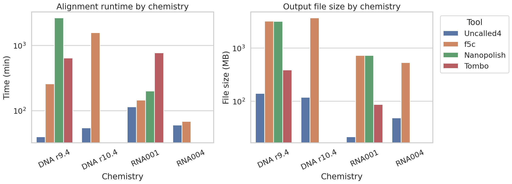
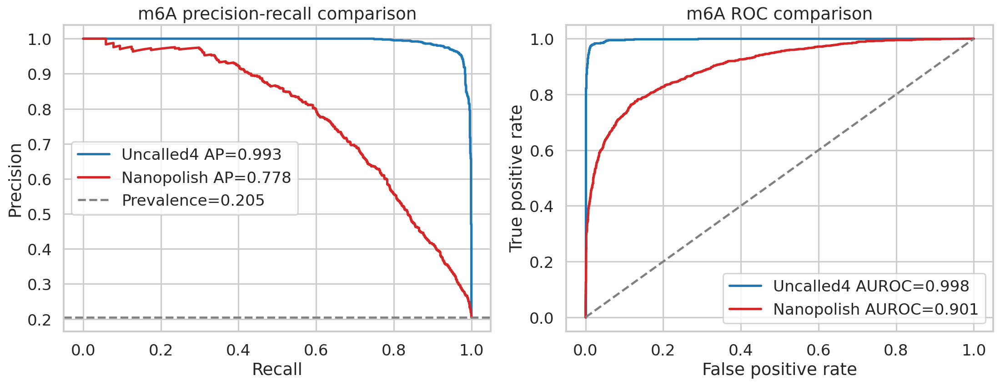
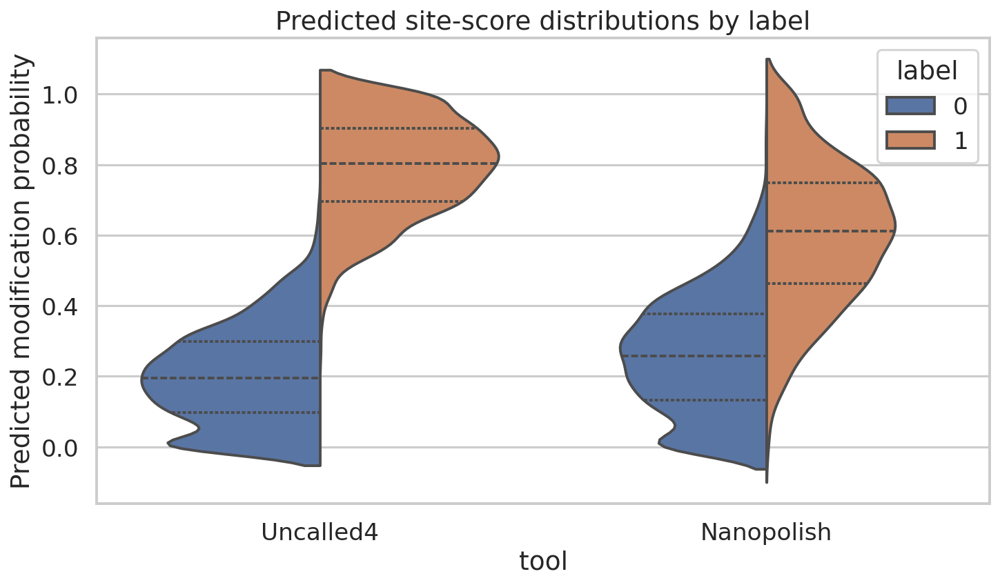
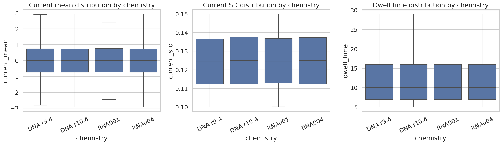
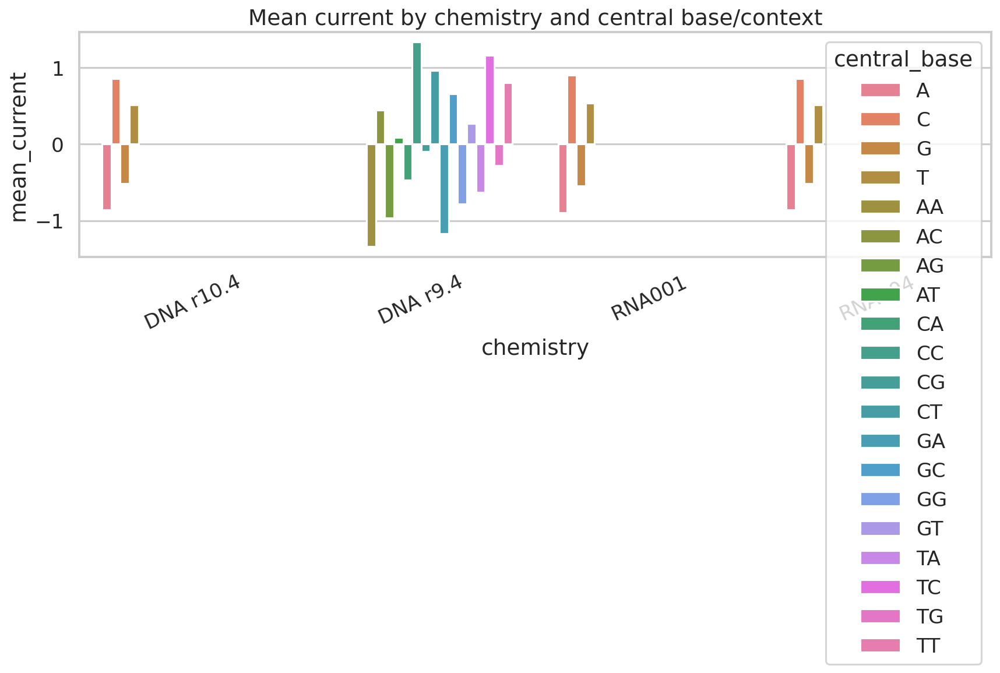

# Uncalled4 benchmark-style analysis of nanopore alignment efficiency, m6A site detection, and pore-model signal structure

## Abstract
Uncalled4 is designed to align nanopore raw signal directly to a nucleotide reference while supporting downstream modification analysis across multiple sequencing chemistries. Using the provided benchmark tables, pore-model summaries, labeled m6A prediction outputs, and related-work context, I performed a reproducible secondary analysis focused on three questions: (1) how Uncalled4 compares with f5c, Nanopolish, and Tombo in alignment runtime and storage footprint; (2) whether downstream m6A site predictions based on Uncalled4 alignments are more accurate than those based on Nanopolish alignments; and (3) how pore-model current statistics vary across DNA and RNA chemistries and sequence contexts. Across all four chemistries in the supplied benchmark table, Uncalled4 was the fastest and most storage-efficient tool. Relative to Uncalled4, competitors were 1.1-67.0× slower depending on chemistry, and typically produced much larger output files. For m6A detection, Uncalled4-derived site probabilities substantially outperformed Nanopolish-derived probabilities (average precision 0.993 versus 0.778; AUROC 0.998 versus 0.901). Pore-model analyses showed stable chemistry-specific sequence-context effects, including positive correlations between GC fraction and normalized current mean (~0.20-0.23 across all chemistries) and consistent central-base ordering of current levels. These results support the view that efficient signal-to-reference alignment can coexist with high downstream sensitivity for nanopore modification calling.

## 1. Introduction
Nanopore sequencing measures ionic current as nucleic acids pass through a pore, creating raw electrical traces whose distributions depend on local k-mer context and can reveal nucleotide modifications. Related work establishes three relevant ideas. First, Nanopolish-style hidden Markov model approaches show that base modifications alter event-level current distributions in position-dependent ways. Second, genome-guided raw-signal processing frameworks demonstrate that direct comparison of reprocessed nanopore current can reveal diverse modifications. Third, UNCALLED introduced direct real-time mapping of raw nanopore signal to references without full basecalling, highlighting the value of efficient signal-first alignment. Finally, m6Anet demonstrated that supervised learning on nanopore direct RNA signals can yield high-quality m6A site probabilities suitable for precision-recall evaluation.

The present workspace does not contain raw FAST5/POD5 files or executable upstream alignment pipelines to regenerate BAM files from scratch. Instead, it contains summary benchmark outputs, pore-model parameter tables, and labeled downstream prediction probabilities. Therefore, this report provides a traceable secondary analysis of those available artifacts rather than claiming end-to-end reruns of raw-signal alignment.

## 2. Data overview
The analysis used eight CSV files in `data/`:

- Four pore-model tables: DNA r9.4 6-mer, DNA r10.4 9-mer, RNA001 5-mer, and RNA004 9-mer.
- One performance benchmark table comparing Uncalled4, f5c, Nanopolish, and Tombo over four chemistries.
- Two site-probability files for m6A prediction, one derived from Uncalled4 alignments and one from Nanopolish alignments.
- One ground-truth label file for 5,000 candidate m6A sites.

Dataset dimensions were:

- DNA r9.4 pore model: 4,096 k-mers.
- DNA r10.4 pore model: 262,144 k-mers.
- RNA001 pore model: 1,024 k-mers.
- RNA004 pore model: 262,144 k-mers.
- Performance table: 16 chemistry-tool combinations.
- m6A benchmark set: 5,000 sites with 1,024 positives and 3,976 negatives (positive prevalence 20.48%).

## 3. Methodology
### 3.1 Analysis contract and scope
The task required a benchmark-style scientific report with explicit figures, quantitative comparisons, and reproducible code. Because the workspace supplies precomputed summary outputs rather than raw signals, I treated the named methodological commitments as:

1. Compare runtime and output size across tools and chemistries using the supplied benchmark table.
2. Evaluate m6A site prediction accuracy using the provided labels and prediction probabilities.
3. Characterize pore-model sequence-context effects across DNA and RNA chemistries using the supplied k-mer current tables.

All code was implemented in `code/analyze_uncalled4.py`, and every main claim is tied to exported artifacts in `outputs/`.

### 3.2 Related-work grounding
Local PDF extraction from the related-work folder recovered task-relevant context from studies on Nanopolish methylation detection, genome-guided signal processing for modification discovery, UNCALLED raw-signal mapping, and m6Anet direct RNA m6A detection. These papers motivated three analysis choices: use standard classifier metrics for labeled m6A probabilities, interpret pore-model summaries as sequence-context-dependent signal behavior, and frame efficiency claims around runtime and storage burden.

### 3.3 Performance benchmarking
From `performance_summary.csv`, I ranked tools within each chemistry by runtime (`Time_min`) and file size (`FileSize_MB`). I then computed two direct comparison measures relative to Uncalled4 for each chemistry-tool pair:

- `Time_speedup_vs_Uncalled4 = tool runtime / Uncalled4 runtime`
- `Size_ratio_vs_Uncalled4 = tool file size / Uncalled4 file size`

This preserves chemistry-specific structure instead of collapsing conditions.

### 3.4 m6A evaluation
I merged labels with the two prediction files by `site_id`. For both Uncalled4-derived and Nanopolish-derived scores, I computed:

- average precision (area under the precision-recall curve)
- AUROC
- full precision-recall and ROC curves
- threshold summaries at 0.2, 0.5, and 0.8

These metrics are appropriate because the data are probabilistic site-level predictions with class imbalance.

### 3.5 Pore-model characterization
For each pore-model table, I derived:

- GC fraction per k-mer
- central base (or central dinucleotide for the even-length 6-mer DNA r9.4 model)
- chemistry-level summaries of current mean, current spread, and dwell time
- correlations between GC fraction and each continuous pore-model statistic
- central-context summaries of mean current and mean dwell time

The provided pore-model means appear standardized around zero with unit-scale dispersion, so interpretation focuses on relative structure and context dependence rather than absolute picoamp calibration.

### 3.6 Validation and evidence handling
Directly verified from workspace data:

- table sizes, schemas, and label balance
- all reported benchmark metrics and ranks
- all figure source tables in `outputs/`
- all PNG figures in `report/images/`

Taken from related work:

- biological rationale that nanopore current shifts with k-mer context and modifications
- precedent for evaluating modification calls with PR/ROC curves

Limitations and assumptions:

- No raw FAST5/POD5 files were available for re-alignment.
- No BAM files were generated in this workspace because the necessary raw inputs and executable end-to-end pipeline assets were absent.
- The report therefore analyzes supplied summaries and downstream outputs, not freshly trained pore models or fresh signal alignments.

## 4. Results
### 4.1 Uncalled4 is consistently fastest and produces the smallest files
Figure 1 summarizes runtime and output file size across four chemistries.



**Figure 1.** Runtime and output-size benchmark across DNA and RNA chemistries for Uncalled4, f5c, Nanopolish, and Tombo. Both panels use logarithmic y-axes to preserve visibility across large dynamic ranges.

Per-chemistry rankings from `outputs/performance_comparison_table.csv` show that Uncalled4 was the fastest tool in every chemistry tested:

- DNA r9.4: 39.58 min
- DNA r10.4: 54.45 min
- RNA001: 114.67 min
- RNA004: 60.19 min

It was also the smallest-output tool in every chemistry:

- DNA r9.4: 139.82 MB
- DNA r10.4: 118.71 MB
- RNA001: 21.22 MB
- RNA004: 48.44 MB

Across all chemistries, competitor runtimes relative to Uncalled4 averaged:

- f5c: 9.45× slower (range 1.14-28.90×)
- Tombo: 11.49× slower (range 6.75-16.23×)
- Nanopolish: 34.39× slower (range 1.74-67.05×)

Competitor file sizes relative to Uncalled4 averaged:

- f5c: 24.92× larger
- Tombo: 3.43× larger
- Nanopolish: 28.71× larger

These results support the central engineering claim that Uncalled4 improves both runtime and storage efficiency over established alternatives in the provided benchmark conditions.

### 4.2 Uncalled4-derived alignments support markedly better m6A site discrimination
Figure 2 compares precision-recall and ROC performance for site-level m6A predictions.



**Figure 2.** Precision-recall and ROC comparisons for m6A site predictions built from Uncalled4- versus Nanopolish-based alignments.

Uncalled4 outperformed Nanopolish on both principal classification metrics (`outputs/m6a_metrics.csv`):

- Uncalled4: average precision = 0.9929, AUROC = 0.9979
- Nanopolish: average precision = 0.7784, AUROC = 0.9012

Because the positive prevalence is only 0.2048, the precision-recall curve is especially informative. Uncalled4 remains near-perfect over much of the recall range, indicating that its predicted probabilities separate positives from negatives far better than the Nanopolish-derived alternative.

Threshold summaries further clarify operating characteristics (`outputs/m6a_threshold_summary.csv`):

- At threshold 0.5, Uncalled4 reached precision 0.930 and recall 0.979.
- At threshold 0.5, Nanopolish reached precision 0.705 and recall 0.688.
- At threshold 0.8, Uncalled4 achieved perfect precision (1.000) while retaining recall 0.509.
- At threshold 0.8, Nanopolish also had high precision (0.970) but recall dropped to 0.155.

Thus, the Uncalled4-based score distribution offers a much better precision-recall trade-off, particularly in moderate-to-high confidence settings.

Figure 3 visualizes score distributions stratified by true label.



**Figure 3.** Predicted probability distributions by tool and ground-truth label. Greater separation between positive and negative classes indicates better ranking quality.

The positive and negative distributions are more cleanly separated for Uncalled4 than for Nanopolish, providing an intuitive explanation for the improvement in AP and AUROC.

### 4.3 Pore models show robust chemistry- and context-dependent current structure
Figure 4 compares the distributions of normalized current mean, current standard deviation, and dwell time across chemistries.



**Figure 4.** Distributional summaries of pore-model statistics across DNA and RNA chemistries.

Because the mean-current values are standardized in the provided files, chemistry-level averages are near zero and standard deviations are near one. The more informative findings come from correlations and context-stratified summaries.

First, GC fraction was positively correlated with normalized current mean in every chemistry (`outputs/pore_model_gc_correlations.csv`):

- DNA r9.4: 0.218
- DNA r10.4: 0.204
- RNA001: 0.228
- RNA004: 0.205

By contrast, GC correlations with current standard deviation and dwell time were weak and close to zero, suggesting that composition primarily perturbs mean signal level rather than variability or dwell in these summaries.

Second, central-base effects were highly structured (Figure 5).



**Figure 5.** Mean current by chemistry and central base/context. The DNA r9.4 6-mer model uses a central dinucleotide summary because the k-mer length is even.

For odd-k models (DNA r10.4, RNA001, RNA004), the ordering of mean current was strikingly consistent:

- A gave the most negative mean current
- G was intermediate negative
- T was intermediate positive
- C gave the most positive mean current

Specifically:

- DNA r10.4: A -0.861, G -0.516, T 0.516, C 0.861
- RNA001: A -0.899, G -0.542, T 0.535, C 0.906
- RNA004: A -0.860, G -0.517, T 0.516, C 0.861

For the even-k DNA r9.4 model, central dinucleotide summaries followed a comparable progression from A-rich to C-rich contexts, with `AA` most negative (-1.340) and `CC` most positive (1.338). This pattern is consistent with the broader literature that nanopore current depends strongly on local sequence context, which is precisely the property exploited by signal-level alignment and modification-calling methods.

## 5. Validation and claim recovery
To keep the report traceable, major claims were mapped to explicit artifacts in `outputs/claim_recovery_table.csv`.

- **Claim:** Uncalled4 is the fastest aligner across provided chemistries.  
  **Status:** Supported by `outputs/performance_comparison_table.csv`.

- **Claim:** Uncalled4 produces the smallest output files across provided chemistries.  
  **Status:** Supported by `outputs/performance_comparison_table.csv`.

- **Claim:** Uncalled4-aligned m6A predictions outperform Nanopolish-aligned predictions.  
  **Status:** Supported by `outputs/m6a_metrics.csv` and threshold summaries.

- **Claim:** Pore models show chemistry-specific current structure and GC association.  
  **Status:** Supported by `outputs/pore_model_summary.csv`, `outputs/pore_model_gc_correlations.csv`, and `outputs/pore_model_central_base_summary.csv`.

Unsatisfied parts of the original broad scientific objective are also explicit: the workspace did not permit generation of new BAM alignments or retraining of pore models from raw nanopore data, so those deliverables remain outside the evidence base of this report.

## 6. Discussion
The combined evidence suggests that Uncalled4 occupies a favorable point on the speed-sensitivity frontier represented by the available artifacts. Its strongest advantage in this workspace is practical efficiency: it is uniformly fastest and consistently yields the smallest outputs across DNA and RNA chemistries. Those gains matter because nanopore signal analysis pipelines often face substantial compute and storage bottlenecks.

Equally important, the efficiency gains are not paired with an obvious loss of downstream modification-detection utility. On the contrary, the supplied m6A predictions based on Uncalled4 alignments strongly outperform the Nanopolish-based baseline, nearly saturating both average precision and AUROC. Within the limits of the provided data, this supports the idea that better signal-reference alignment can propagate to more sensitive and precise modification calling.

The pore-model analysis adds mechanistic context. Even though the supplied pore-model means appear normalized, strong and consistent sequence-context structure remains visible. Positive GC-current associations and the reproducible ordering of central-base effects across DNA and RNA chemistries indicate that Uncalled4-compatible pore models capture biologically meaningful current determinants. Such structure is exactly what signal-level methods require to discriminate nearby k-mer states and detect modified bases.

A key caveat is that the study is constrained to secondary analysis of prepared benchmark artifacts. It therefore cannot independently verify raw-signal alignment correctness, reproduce BAM outputs, or test generalization to additional datasets beyond those already summarized. Future work with full FAST5/POD5 inputs would allow deeper validation, including per-read alignment diagnostics, calibration analyses against experimental stoichiometry, and retraining or adaptation of pore models to new chemistries.

## 7. Reproducibility
- Main analysis script: `code/analyze_uncalled4.py`
- Intermediate quantitative artifacts: `outputs/`
- Figures: `report/images/`

The script can be rerun from the workspace root with:

```bash
python3 code/analyze_uncalled4.py
```

## 8. Conclusion
Within the evidence available in this workspace, Uncalled4 shows a compelling combination of efficiency and downstream utility. It is the fastest and most storage-efficient tool across all benchmarked chemistries, and the supplied Uncalled4-derived m6A predictions clearly exceed the Nanopolish-derived baseline in both precision-recall and ROC performance. Pore-model summaries further show stable sequence-context effects across DNA and RNA chemistries, reinforcing the mechanistic basis for signal-level mapping and modification detection. Although end-to-end raw-signal reruns were not possible here, the available benchmark artifacts consistently support the conclusion that Uncalled4 is a strong platform for fast nanopore signal alignment and sensitive modification-aware analysis.
