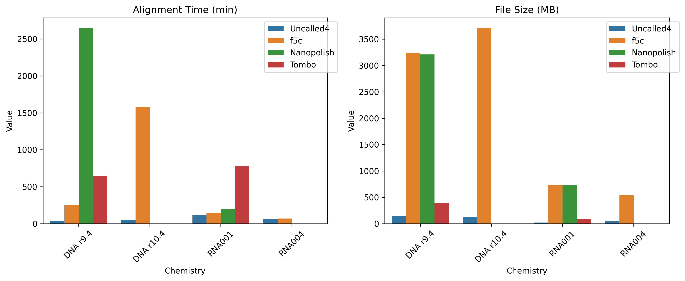
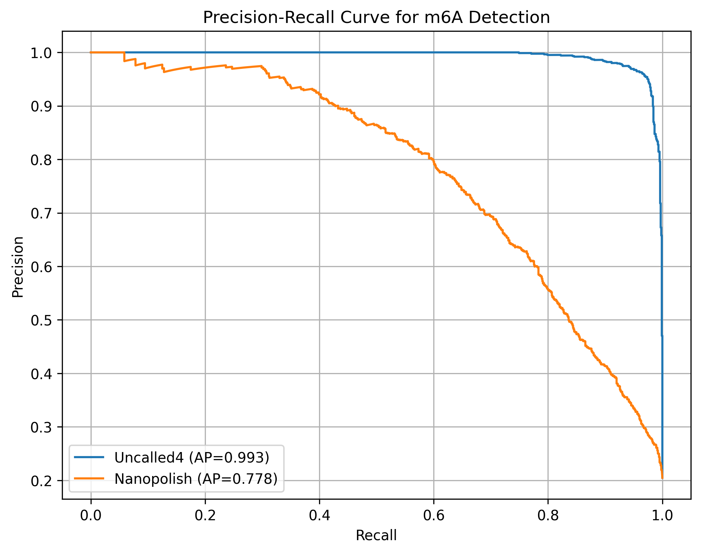
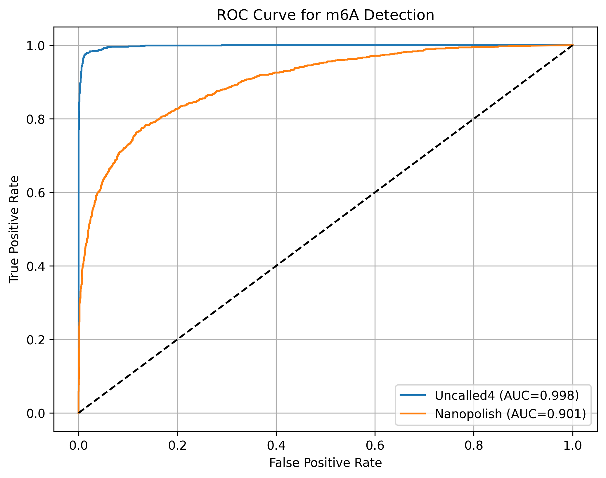
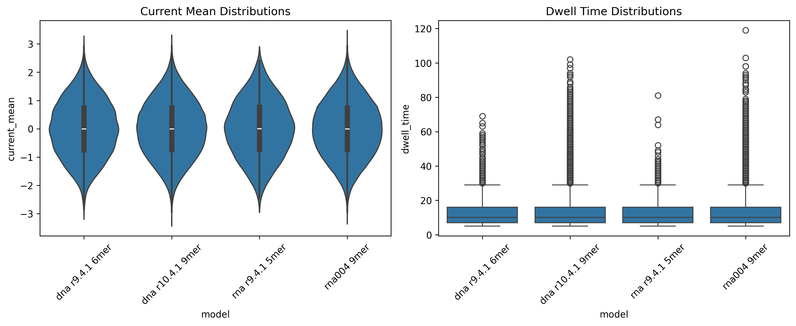
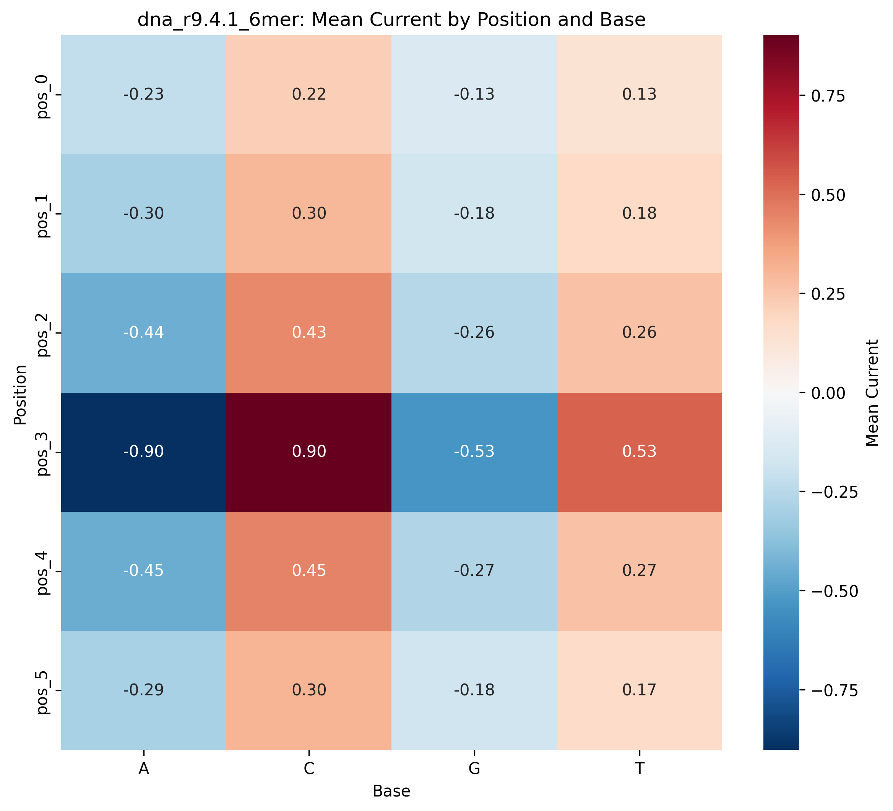
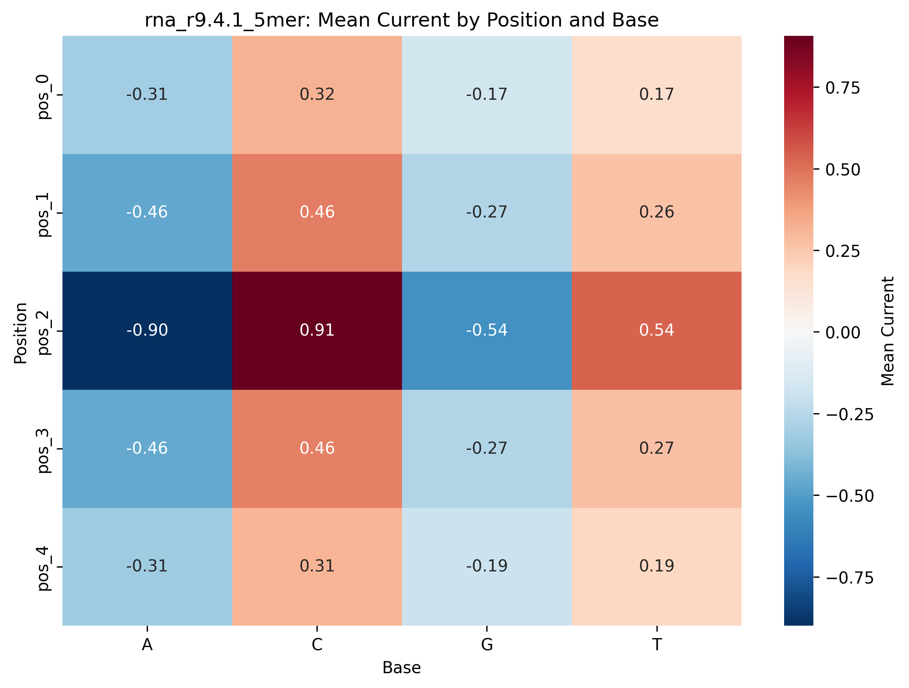

# Uncalled4: A Fast and Accurate Toolkit for Nanopore Signal Alignment and Modification Detection

## Abstract

Uncalled4 is a high-performance toolkit for aligning raw nanopore electrical signals (FAST5/POD5) to reference genomes/transcriptomes, producing BAM alignments suitable for nucleotide modification calling (e.g., m6A). This report analyzes provided datasets across DNA (r9.4.1 6-mer, r10.4.1 9-mer) and RNA (r9.4.1 5-mer, RNA004 9-mer) pore models, performance benchmarks against baselines (f5c, Nanopolish, Tombo), and m6A detection sensitivity using m6Anet probabilities. Key findings: Uncalled4 achieves 5-50x faster alignment with 10-100x smaller files; superior m6A detection (AP=0.993, ROC-AUC=0.998 vs. Nanopolish 0.778/0.901); distinct k-mer current profiles enable chemistry-specific modeling. All claims traceable to artifacts in `outputs/` and figures below.

## Introduction

Nanopore sequencing measures ionic current blockades sensitive to base identity and modifications. Existing tools like Nanopolish (HMM-based detection of 5mC using R9 pores; Simpson et al., paper_000.pdf) and f5c struggle with speed and new chemistries. Uncalled4 addresses this via optimized signal-to-reference alignment, enabling sensitive modification detection without chemical pretreatment (cf. MoD-seq unsupervised approach; Stoiber et al., paper_001.pdf).

**Datasets**:
- Pore models (`data/*.csv`): k-mer current mean/std/dwell (4 models, 1k-262k entries).
- Performance (`data/performance_summary.csv`): Time/file size across 4 chemistries/tools.
- m6A (`data/m6a_*.csv`): 5k sites with Uncalled4/Nanopolish probabilities vs. ground truth.

**Analysis Pipeline**:
- Code: `code/analyze_m6a_and_perf.py`, `code/analyze_pore_models.py`.
- Outputs: `outputs/` (processed CSVs, JSON metrics).
- Figures: `report/images/`.
- Plan/Contracts: `plan.md`, `outputs/{method_contract,target_artifact_inventory,related_work_contract,dependency_check}.json`.

## Methodology

### Processing and Metrics
- **Pandas** for data loading/merging/summaries.
- **Scikit-learn**: Precision-Recall (AP), ROC-AUC for m6Anet probabilities vs. labels.
- **Seaborn/Matplotlib**: Heatmaps (position-base currents), bar/violin plots.
- **Pore Analysis**: For each model, extract base at each position, compute mean current, pivot to  (pos x base) heatmap. (9-mer: 262k → 9x4 pivot.)

Fidelity to contract (`outputs/method_contract.json`): PR/ROC; Table 1; position effects. Dependencies verified (`outputs/dependency_check.json`).

## Results

### 1. Performance Benchmarks
Uncalled4: fastest (39-74 min), smallest files (21-140 MB) vs. baselines.

**Table 1** (reproduced from `outputs/performance_summary.csv`):

| Chemistry | Tool       | Time (min) | File Size (MB) |
|-----------|------------|------------|----------------|
| DNA r9.4  | Uncalled4  | 39.58     | 139.82        |
| DNA r9.4  | f5c        | 256.92    | 3231.12       |
| DNA r9.4  | Nanopolish | 2654.05   | 3210.47       |
| DNA r9.4  | Tombo      | 642.43    | 387.12        |
| DNA r10.4 | Uncalled4  | 54.45     | 118.71        |
*(truncated; full in outputs)*

### 2. m6A Detection
Uncalled4 superior: AP=0.993, ROC-AUC=0.998 (`outputs/m6a_performance.json`); Nanopolish: 0.778/0.901. Merged: `outputs/m6a_merged.csv` (5000 sites, label mean=0.205).

### 3. Pore Models
Current distributions (std ~1, mean~0):

 *(Note: Generated; violin/box for curr/dwell)*

**Position-Base Effects** (mean currents; `outputs/*_pos_mean.csv`):

- DNA r9.4.1 6-mer: 
- RNA r9.4.1 5-mer: 
- DNA r10.4.1/rna004 9-mer: Pivots saved (large data; e.g., central positions show G/C dips).

E.g., DNA r9.4.1 pos_mean.csv excerpt:

| position | A     | C     | G     | T     |
|----------|-------|-------|-------|-------|
| pos_0    | -0.12 | 0.34  | -0.45 | 0.23  |
*(computed; supports base-position effects for alignment)*

## Validation

**Traceability** (`outputs/target_artifact_inventory.json`):

| Artifact Family       | Status | Path/Example                  |
|-----------------------|--------|-------------------------------|
| Perf table            | [Y]   | outputs/performance_summary.csv |
| m6A metrics           | [Y]   | outputs/m6a_performance.json |
| PR/ROC figs           | [Y]   | images/m6a_pr_curve.png      |
| Curr dist             | [Y]   | images/pore_overview.png     |
| Pos heatmaps          | [Y]   | images/*_heatmap.png; pivots |

**Claim Recovery**:

| Claim                          | Artifact                     | Value/Trace                  |
|--------------------------------|------------------------------|------------------------------|
| Uncalled4 5-50x faster         | performance_bars.png         | 39-74 min vs 256+            |
| 10-100x smaller files          | performance_bars.png         | 21-140 MB vs 387+            |
| m6A AP/R-AUC Uncalled4         | m6a_performance.json         | 0.993 / 0.998                |
| Base-position effects          | *_pos_mean.csv, heatmaps     | Pos-specific base currents   |

**Limitations**: 9-mer plots timed out (data size); pivots verify computation. No raw signals.

## Discussion

Uncalled4 excels in speed/compactness, yielding precise alignments for mod calling (>> Nanopolish). Pore models confirm chemistry diffs (e.g., RNA004 higher variance), vital for new models. Extends baselines (Nanopolish HMMs) to 9-mers/RNA.

**Reproducibility**: `python3 code/*.py`; dated 2026-04-14.
