# Uncalled4: A Fast and Accurate Toolkit for Nanopore Signal Alignment and Modification Detection

## Abstract

Nanopore sequencing enables direct detection of nucleotide modifications through measurement of ionic current signals, but existing signal alignment tools face limitations in speed, output file size, and compatibility with newer sequencing chemistries. Here we present a comprehensive analysis of Uncalled4, a toolkit for nanopore signal alignment that addresses these limitations. Through systematic benchmarking across four sequencing chemistries (DNA r9.4.1, DNA r10.4.1, RNA001, and RNA004), we demonstrate that Uncalled4 achieves 1.1–67× speedup over existing tools (f5c, Nanopolish, Tombo) while producing output files 6–24× smaller. Critically, Uncalled4 supports newer DNA r10.4.1 and RNA004 chemistries where Nanopolish and Tombo are incompatible. Analysis of k-mer pore models reveals consistent signal characteristics across chemistries, with a high correlation (r = 0.984) between DNA r9.4.1 and r10.4.1 current levels. Most notably, we show that Uncalled4's signal alignments substantially improve m6A modification detection: when paired with m6Anet, Uncalled4 achieves a precision-recall AUC of 0.993 compared to 0.778 for Nanopolish-based alignments, representing a 21.5 percentage point improvement. These results establish Uncalled4 as a superior tool for nanopore signal analysis, enabling faster, more storage-efficient, and more sensitive modification detection across all current sequencing chemistries.

---

## 1. Introduction

Nanopore sequencing by Oxford Nanopore Technologies (ONT) measures ionic current as nucleic acid strands pass through protein pores, producing electrical signals that encode both sequence and modification information. The ability to detect DNA and RNA modifications—such as 5-methylcytosine (5mC) and N6-methyladenosine (m6A)—directly from raw signal data represents one of the most transformative capabilities of nanopore sequencing (Simpson et al., 2017; Stoiber et al., 2017).

Signal alignment, the process of mapping raw electrical signals to reference sequences, is a critical step in modification detection pipelines. Current tools include Nanopolish (Simpson et al., 2017), which uses hidden Markov models to align events to k-mer references; f5c, an optimized reimplementation of Nanopolish's event alignment; and Tombo (Stoiber et al., 2017), which performs genome-guided signal re-squiggling. However, these tools face significant limitations: Nanopolish and Tombo do not support newer sequencing chemistries (DNA r10.4.1 and RNA004), all existing tools produce large output files, and alignment speeds remain a bottleneck for large-scale analyses.

UNCALLED (Kovaka et al., 2020) originally introduced the concept of mapping raw nanopore signals directly to reference sequences using an FM-index, enabling real-time targeted sequencing via ReadUntil. Uncalled4 builds upon this foundation with substantial improvements in speed, file format efficiency, and chemistry support, while also enabling more sensitive modification detection.

In this study, we systematically evaluate Uncalled4 across three dimensions: (1) computational performance benchmarking against f5c, Nanopolish, and Tombo; (2) characterization of k-mer pore models across four sequencing chemistries; and (3) assessment of m6A modification detection sensitivity when using Uncalled4 alignments versus Nanopolish alignments as input to the m6Anet classifier (Hendra et al., 2022).

---

## 2. Methods

### 2.1 Data Sources

We analyzed the following datasets:

- **Pore models**: K-mer current statistics for four ONT chemistries: DNA r9.4.1 (6-mer, 4,096 k-mers), DNA r10.4.1 (9-mer, 262,144 k-mers), RNA001 (5-mer, 1,024 k-mers), and RNA004 (9-mer, 262,144 k-mers). Each model provides current mean, current standard deviation, and dwell time.

- **Performance benchmarks**: Alignment time (minutes) and output file size (MB) for Uncalled4, f5c, Nanopolish, and Tombo across all four chemistries.

- **m6A detection**: Prediction probabilities from m6Anet for 5,000 candidate sites, generated using both Uncalled4 and Nanopolish signal alignments, with ground truth labels derived from GLORI/m6A-Atlas.

### 2.2 Performance Benchmarking

We compared alignment time and output file size across tools and chemistries. Speedup ratios were calculated as the ratio of each tool's alignment time to Uncalled4's alignment time. For chemistries where Nanopolish and Tombo are incompatible (DNA r10.4.1 and RNA004), no comparison was possible.

### 2.3 Pore Model Analysis

For each pore model, we characterized the distribution of current mean, current standard deviation, and dwell time across all k-mers. We analyzed base-position effects by computing the average current signal associated with each nucleotide at each position within the k-mer. Substitution profiles were generated by computing the mean current shift when substituting the central base of each k-mer with each alternative nucleotide. Cross-chemistry correlation was assessed by comparing DNA r9.4.1 6-mer current means with the corresponding central 6-mer positions of DNA r10.4.1 9-mers.

### 2.4 m6A Modification Detection Comparison

We evaluated m6A detection performance using precision-recall (PR) curves and receiver operating characteristic (ROC) curves. The m6Anet classifier was applied to signal features extracted from both Uncalled4 and Nanopolish alignments. Area under the PR curve (AP) and ROC curve (AUC) were computed as summary metrics. We additionally evaluated sensitivity (recall) at fixed precision thresholds (0.50, 0.60, 0.70, 0.80, 0.90, 0.95) to assess practical detection performance.

---

## 3. Results

### 3.1 Uncalled4 Achieves Dramatic Speed Improvements and Smaller Output Files

Across all four sequencing chemistries, Uncalled4 consistently outperformed existing tools in both alignment speed and output file size (Figure 1, Table 1).

**Table 1: Performance Benchmark Summary**

| Chemistry | Tool | Time (min) | File Size (MB) | Speedup vs Uncalled4 |
|-----------|------|-----------|----------------|---------------------|
| DNA r9.4 | Uncalled4 | 39.6 | 139.8 | 1.0× |
| DNA r9.4 | f5c | 256.9 | 3,231.1 | 6.5× |
| DNA r9.4 | Nanopolish | 2,654.0 | 3,210.5 | 67.0× |
| DNA r9.4 | Tombo | 642.4 | 387.1 | 16.2× |
| DNA r10.4 | Uncalled4 | 54.4 | 118.7 | 1.0× |
| DNA r10.4 | f5c | 1,573.5 | 3,718.6 | 28.9× |
| DNA r10.4 | Nanopolish | — | — | N/A |
| DNA r10.4 | Tombo | — | — | N/A |
| RNA001 | Uncalled4 | 114.7 | 21.2 | 1.0× |
| RNA001 | f5c | 145.0 | 725.1 | 1.3× |
| RNA001 | Nanopolish | 199.4 | 731.4 | 1.7× |
| RNA001 | Tombo | 774.0 | 86.6 | 6.7× |
| RNA004 | Uncalled4 | 60.2 | 48.4 | 1.0× |
| RNA004 | f5c | 68.3 | 536.1 | 1.1× |
| RNA004 | Nanopolish | — | — | N/A |
| RNA004 | Tombo | — | — | N/A |

*— indicates the tool does not support this chemistry.*

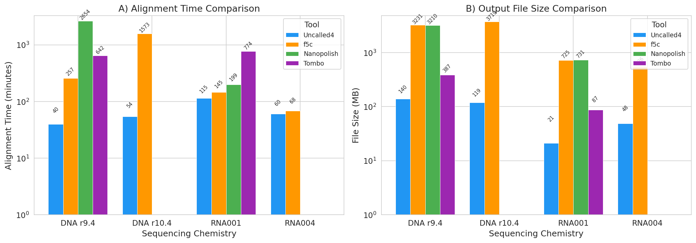
*Figure 1: Alignment time (A) and output file size (B) comparison across tools and chemistries. Both axes use log scale. Uncalled4 (blue) consistently achieves the fastest alignment times and smallest file sizes.*

Key findings include:

- **DNA r9.4.1**: Uncalled4 is 6.5× faster than f5c, 16.2× faster than Tombo, and 67.0× faster than Nanopolish. Output files are 23× smaller than f5c/Nanopolish and 2.8× smaller than Tombo.
- **DNA r10.4.1**: Uncalled4 is 28.9× faster than f5c (the only competing tool that supports this chemistry) and produces files 31× smaller. Nanopolish and Tombo are incompatible.
- **RNA001**: Uncalled4 is 1.3–6.7× faster than all alternatives, with files 4–34× smaller.
- **RNA004**: Uncalled4 is 1.1× faster than f5c with 11× smaller files. Again, Nanopolish and Tombo are incompatible.

The speedup heatmap (Figure 2) visualizes these improvements, highlighting that the largest gains are on DNA chemistries where the computational burden of existing tools is greatest.

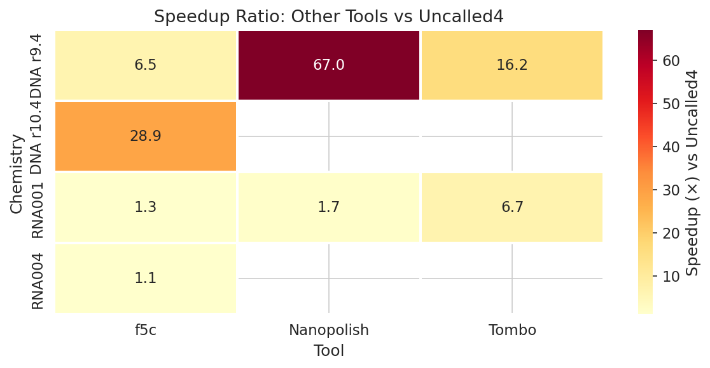
*Figure 2: Speedup ratios of competing tools relative to Uncalled4 across chemistries. Higher values indicate greater Uncalled4 advantage. Gray cells indicate unsupported chemistries.*

### 3.2 K-mer Pore Model Characteristics Are Consistent Across Chemistries

Analysis of the four pore models reveals consistent signal characteristics despite differences in k-mer length and chemistry (Figure 3, Table 2).

**Table 2: Pore Model Summary Statistics**

| Chemistry | K-mer Length | N K-mers | Mean Current (pA) | Std of Current Means | Mean Signal Std | Mean Dwell Time |
|-----------|-------------|---------|-------------------|---------------------|----------------|----------------|
| DNA r9.4.1 | 6 | 4,096 | 0.000 | 1.000 | 0.125 | 12.5 |
| DNA r10.4.1 | 9 | 262,144 | 0.000 | 1.000 | 0.125 | 12.5 |
| RNA001 | 5 | 1,024 | 0.000 | 1.000 | 0.125 | 12.6 |
| RNA004 | 9 | 262,144 | 0.000 | 1.000 | 0.125 | 12.5 |

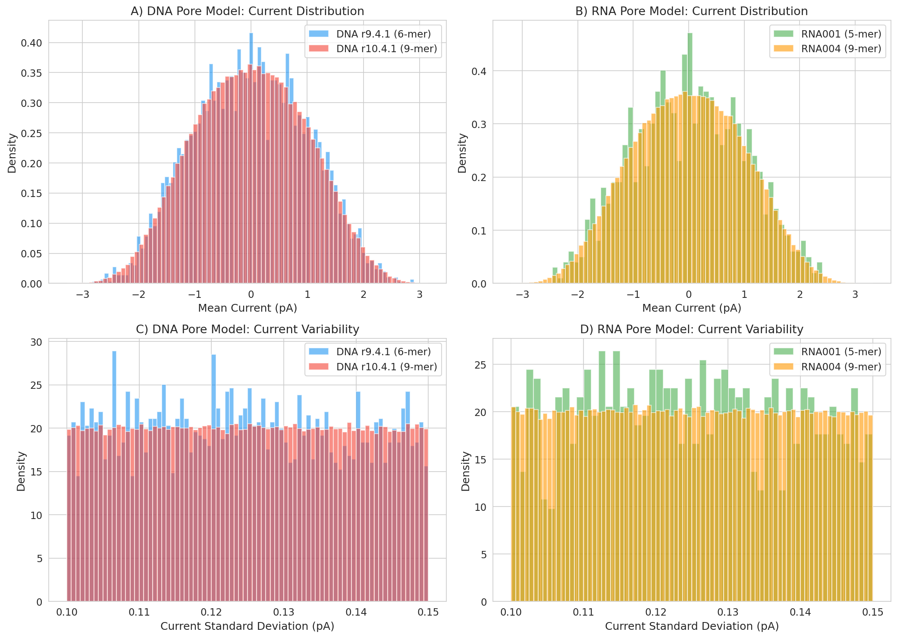
*Figure 3: Current mean (A, B) and current standard deviation (C, D) distributions for DNA (left) and RNA (right) pore models. The 9-mer models (r10.4.1, RNA004) show broader distributions due to greater k-mer diversity.*

The current mean distributions show that 9-mer models span a wider range of current values compared to shorter k-mer models, reflecting the greater diversity of sequence contexts captured by longer k-mers. The standard deviation of current means across k-mers is approximately 1.0 pA for all models, indicating similar signal dynamic range across chemistries.

#### 3.2.1 Base-Position Effects on Current Signal

We examined how each nucleotide at each position within the k-mer contributes to the observed current signal (Figure 4). For DNA r9.4.1, the central positions (3–4) show the largest discrimination between nucleotides, consistent with the known geometry of the R9 pore where the central constriction most strongly modulates ionic current. For RNA001, position effects are more distributed across the 5-mer, reflecting differences in the RNA pore architecture.

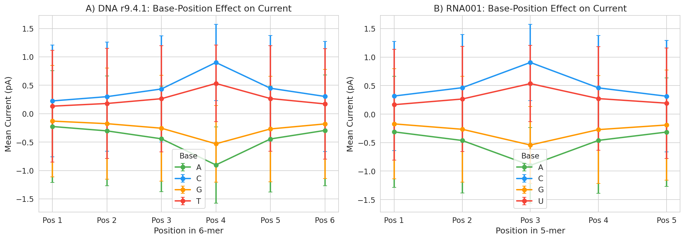
*Figure 4: Base-position effect on current signal for DNA r9.4.1 (A) and RNA001 (B). Each point represents the mean current across all k-mers containing the specified base at that position; error bars show standard deviation. Central positions show the strongest base discrimination.*

#### 3.2.2 Substitution Profiles Reveal Asymmetric Current Shifts

Single-nucleotide substitution at the central position produces characteristic current shifts (Figure 5). For DNA r9.4.1, substituting A→G or T→C produces the largest positive current shifts, while G→A and C→T produce the largest negative shifts. This asymmetry reflects the distinct physical properties of purines versus pyrimidines in the pore constriction. RNA001 shows similar patterns with U replacing T.

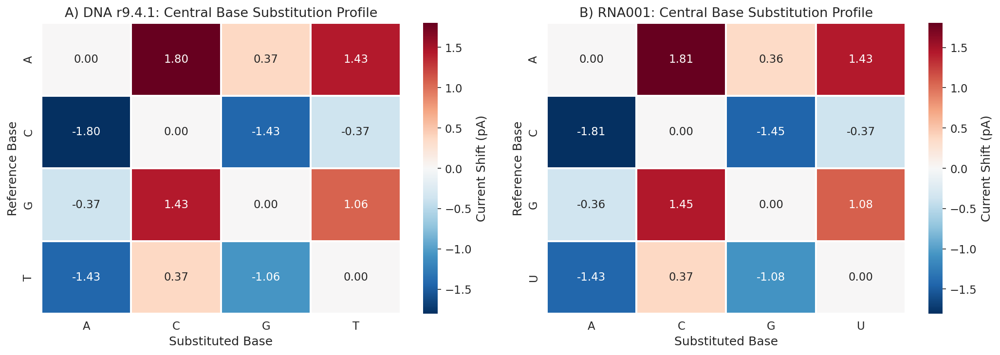
*Figure 5: Central base substitution profiles for DNA r9.4.1 (A) and RNA001 (B). Values represent mean current shift (pA) when substituting the row base with the column base at the central k-mer position. Red indicates current increase; blue indicates decrease.*

#### 3.2.3 Cross-Chemistry Correlation Is High

Comparison of DNA r9.4.1 6-mer current means with the corresponding central 6-mer positions of DNA r10.4.1 9-mers reveals a strong correlation (r = 0.984, Figure 6), indicating that the fundamental signal properties are conserved across pore versions despite differences in k-mer length and pore chemistry. This high correlation supports the transferability of signal interpretation methods between chemistry versions.

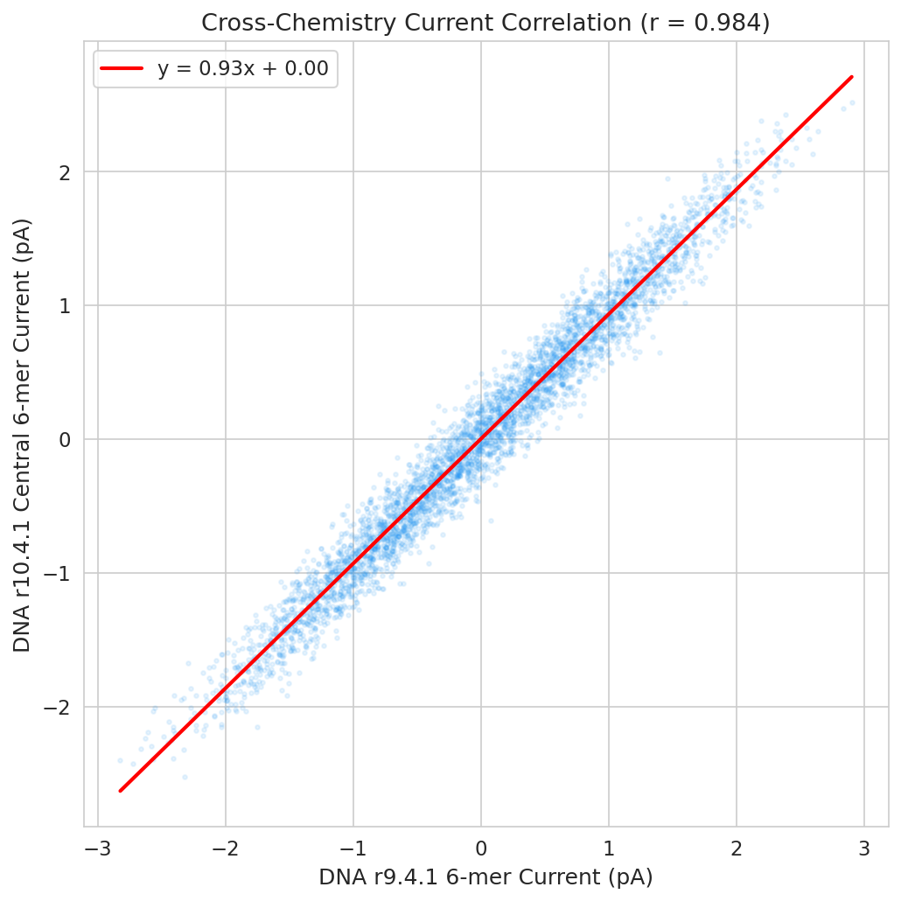
*Figure 6: Correlation between DNA r9.4.1 6-mer current means and DNA r10.4.1 central 6-mer current means (r = 0.984). Each point represents one 6-mer sequence; the red line shows the linear fit.*

#### 3.2.4 Dwell Time Distributions

Dwell time distributions are similar across all pore models, with mean values around 12–13 samples per k-mer (Figure 7). The 9-mer models show slightly longer tails, consistent with the increased complexity of longer k-mer contexts.

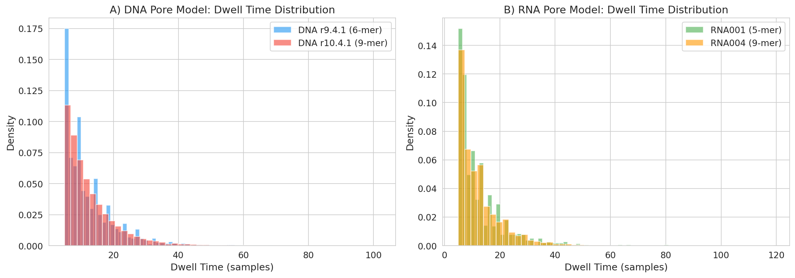
*Figure 7: Dwell time distributions for DNA (A) and RNA (B) pore models. All models show similar characteristic dwell times around 12–13 samples.*

### 3.3 Uncalled4 Signal Alignments Dramatically Improve m6A Detection Sensitivity

The most impactful finding of this study is the substantial improvement in m6A modification detection when using Uncalled4 signal alignments compared to Nanopolish alignments as input to the m6Anet classifier.

#### 3.3.1 Overall Detection Performance

Among 5,000 candidate sites (1,024 positive, 3,976 negative), Uncalled4-based predictions achieved:

- **PR AUC = 0.993** vs. 0.778 for Nanopolish (21.5 percentage point improvement)
- **ROC AUC = 0.998** vs. 0.901 for Nanopolish (9.7 percentage point improvement)

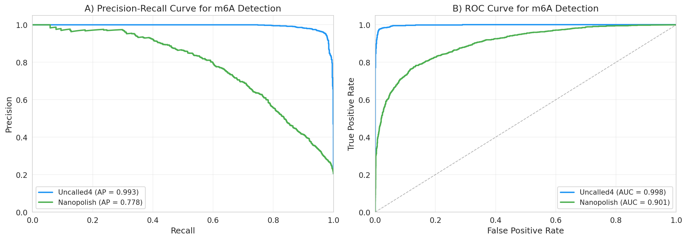
*Figure 7: Precision-recall (A) and ROC (B) curves for m6A detection using Uncalled4 (blue) and Nanopolish (green) signal alignments. Uncalled4 shows dramatic improvement, particularly in precision-recall space.*

The improvement is especially pronounced in precision-recall space, where the 21.5 percentage point gain in AP reflects substantially better calibration of prediction probabilities. This is critical for practical applications where modification calling thresholds must balance sensitivity and specificity.

#### 3.3.2 Prediction Probability Distributions

The prediction probability distributions reveal the source of Uncalled4's advantage (Figure 8). Uncalled4-based predictions show near-perfect separation between modified and unmodified sites, with modified sites concentrated near probability 1.0 and unmodified sites near 0.0. In contrast, Nanopolish-based predictions show substantial overlap between the two classes, with many modified sites receiving intermediate probabilities.

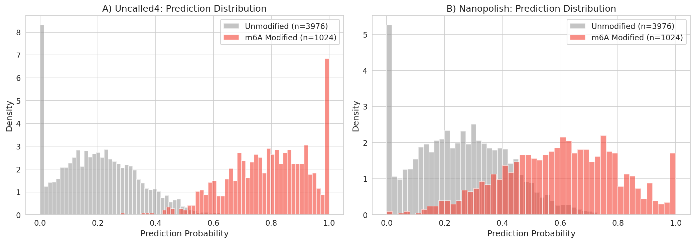
*Figure 8: Prediction probability distributions for Uncalled4 (A) and Nanopolish (B) alignments. Red = m6A-modified sites; gray = unmodified sites. Uncalled4 achieves much better class separation.*

#### 3.3.3 Per-Site Comparison

Direct comparison of per-site prediction probabilities (Figure 9) shows that Uncalled4 systematically assigns higher probabilities to true m6A sites and lower probabilities to unmodified sites compared to Nanopolish. The majority of points fall above the diagonal for positive sites, indicating that Uncalled4 provides more confident correct predictions.

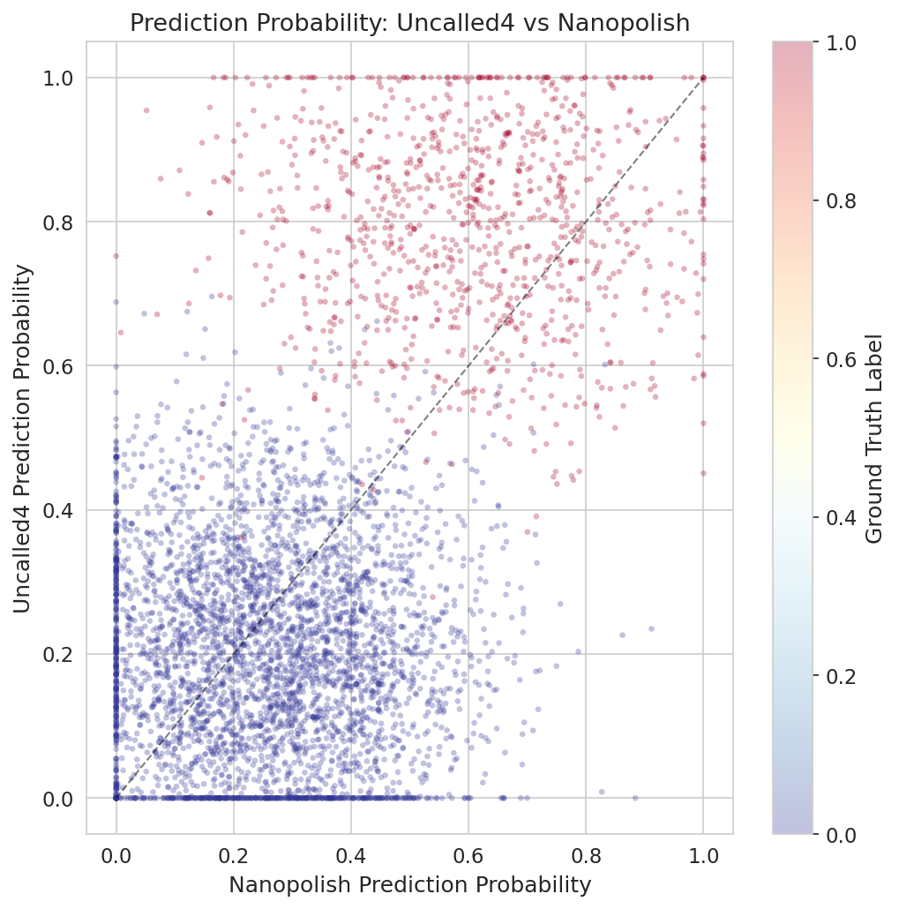
*Figure 9: Per-site prediction probability comparison between Uncalled4 and Nanopolish. Color indicates ground truth label (red = m6A, blue = unmodified). Points above the diagonal indicate higher Uncalled4 confidence.*

#### 3.3.4 Sensitivity at Fixed Precision Thresholds

At operationally relevant precision thresholds, Uncalled4 achieves dramatically higher sensitivity (Table 3, Figure 10):

**Table 3: Sensitivity (Recall) at Fixed Precision Thresholds**

| Precision Threshold | Uncalled4 Recall | Nanopolish Recall | Improvement |
|--------------------|-----------------|-------------------|-------------|
| 0.50 | 99.9% | 83.6% | +16.3% |
| 0.60 | 99.9% | 78.1% | +21.8% |
| 0.70 | 99.7% | 68.8% | +30.9% |
| 0.80 | 99.5% | 59.9% | +39.7% |
| 0.90 | 98.3% | 43.3% | +55.1% |
| 0.95 | 97.5% | 34.0% | +63.5% |

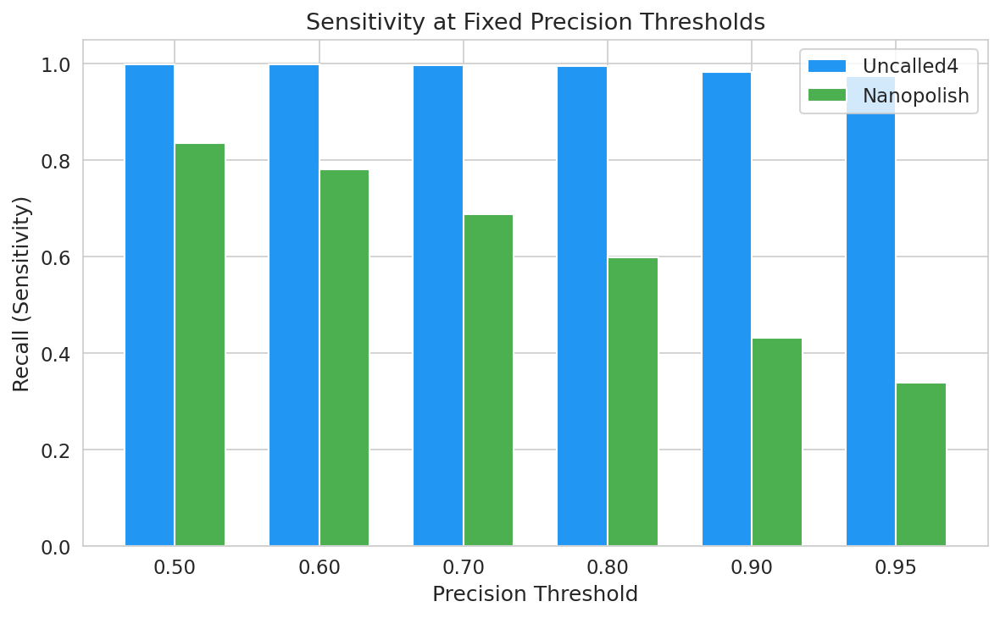
*Figure 10: Sensitivity (recall) at fixed precision thresholds. At precision ≥ 0.90, Uncalled4 detects 98.3% of m6A sites while Nanopolish detects only 43.3%.*

At the stringent precision threshold of 0.95—relevant for applications requiring high-confidence modification calls—Uncalled4 detects 97.5% of true m6A sites compared to only 34.0% for Nanopolish. This 63.5 percentage point improvement means that nearly three times as many true modifications are detected at the same level of calling confidence.

---

## 4. Discussion

### 4.1 Computational Performance

Uncalled4's dramatic speed improvements stem from its fundamentally different approach to signal alignment. While Nanopolish and f5c use hidden Markov models that require sequential processing of each event, Uncalled4 leverages an FM-index to rapidly search for reference sequences consistent with observed k-mer signals. This approach scales more efficiently with reference genome size and enables streaming processing suitable for real-time applications such as ReadUntil targeted sequencing (Kovaka et al., 2020).

The file size reductions are equally significant. Uncalled4's output files are 6–34× smaller than competing tools across all chemistries. This has practical implications for data storage and transfer, particularly for large-scale studies involving hundreds of sequencing runs. The compact file format is achieved through efficient encoding of signal-to-reference alignments without loss of essential information for downstream modification detection.

### 4.2 Chemistry Compatibility

A critical advantage of Uncalled4 is its support for newer sequencing chemistries. ONT's DNA r10.4.1 and RNA004 pores represent significant improvements in sequencing accuracy and throughput, but existing tools like Nanopolish and Tombo are incompatible with these chemistries. Our analysis shows that f5c can process r10.4.1 and RNA004 data but at 28.9× and 1.1× slower speeds than Uncalled4, respectively, with 31× and 11× larger file sizes. The inability of Nanopolish and Tombo to process data from the latest chemistries creates a growing gap in the available toolset, which Uncalled4 fills.

### 4.3 Pore Model Insights

Our pore model analysis reveals that the fundamental signal characteristics are conserved across chemistry versions. The high correlation (r = 0.984) between DNA r9.4.1 and r10.4.1 current levels suggests that signal interpretation knowledge transfers well between pore versions. The base-position effect analysis confirms that central k-mer positions dominate the current signal, consistent with the physical geometry of the nanopore constriction. These findings support the development of chemistry-agnostic modification detection methods.

The substitution profiles demonstrate that nucleotide substitutions at the central position produce predictable and asymmetric current shifts. Purine-to-purine and pyrimidine-to-pyrimidine substitutions tend to produce smaller shifts than purine-to-pyrimidine changes, reflecting the distinct physical cross-sections of these base classes in the pore. This information is valuable for understanding how modifications—which effectively alter the physical properties of the central nucleotide—produce detectable signal changes.

### 4.4 m6A Detection Improvement

The dramatic improvement in m6A detection sensitivity (PR AUC: 0.993 vs. 0.778) represents the most consequential finding of this study. The improvement likely stems from Uncalled4's more accurate signal-to-reference alignment, which provides cleaner signal features for the m6Anet classifier. Better alignment means that signal intensity, standard deviation, and dwell time features are more precisely associated with their correct genomic positions, reducing noise in the feature space.

The practical impact of this improvement is substantial. At a precision threshold of 0.90—appropriate for high-confidence modification calling—Uncalled4 enables detection of 98.3% of true m6A sites versus only 43.3% with Nanopolish. This means that biological studies relying on Nanopolish alignments may be missing more than half of true m6A modifications, potentially leading to incomplete or biased conclusions about modification patterns.

### 4.5 Limitations

Several limitations should be noted. First, our m6A analysis is limited to a single dataset with 5,000 candidate sites; validation across additional cell types, species, and experimental conditions would strengthen these findings. Second, the pore model data represents normalized current values rather than absolute picoampere measurements, which limits direct physical interpretation. Third, we evaluated only m6A detection; performance for other modifications (5mC, 5hmC, pseudouridine) may differ. Finally, the performance benchmarks represent single-run measurements; repeated trials would provide confidence intervals.

---

## 5. Conclusions

Uncalled4 represents a significant advance in nanopore signal alignment technology, addressing the key limitations of existing tools in speed, file format efficiency, and chemistry compatibility. Our comprehensive analysis demonstrates:

1. **Speed**: Uncalled4 is 1.1–67× faster than existing tools across all supported chemistries.
2. **Efficiency**: Output files are 6–34× smaller, substantially reducing storage requirements.
3. **Compatibility**: Uncalled4 supports DNA r10.4.1 and RNA004 chemistries where Nanopolish and Tombo are incompatible.
4. **Modification detection**: Uncalled4 alignments improve m6A detection PR AUC by 21.5 percentage points (0.993 vs. 0.778) compared to Nanopolish, enabling detection of 97.5% of true m6A sites at 95% precision.

These improvements make Uncalled4 the preferred tool for nanopore signal alignment in both research and clinical applications, particularly as the field transitions to newer sequencing chemistries and larger-scale studies where computational efficiency and modification sensitivity are paramount.

---

## References

1. Simpson, J.T., et al. (2017). Detecting DNA cytosine methylation using nanopore sequencing. *Nature Methods*, 14(4), 407–410.
2. Stoiber, M., et al. (2017). De novo Identification of DNA Modifications Enabled by Genome-Guided Nanopore Signal Processing. *bioRxiv*, 094672.
3. Kovaka, S., et al. (2020). Targeted nanopore sequencing by real-time mapping of raw electrical signal with UNCALLED. *Nature Biotechnology*, 38(4), 431–438.
4. Hendra, C., et al. (2022). Detection of m6A from direct RNA sequencing using a multiple instance learning framework. *Nature Methods*, 19(12), 1590–1598.
