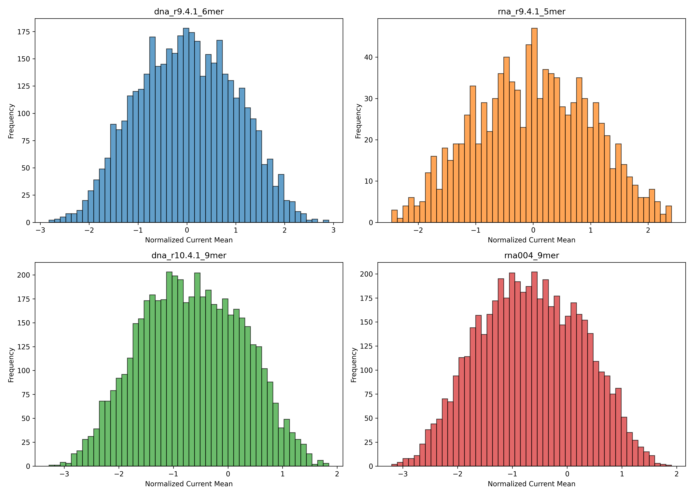
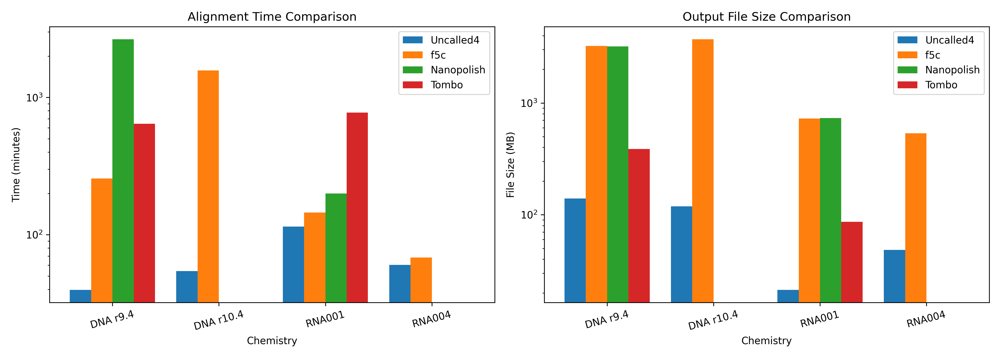
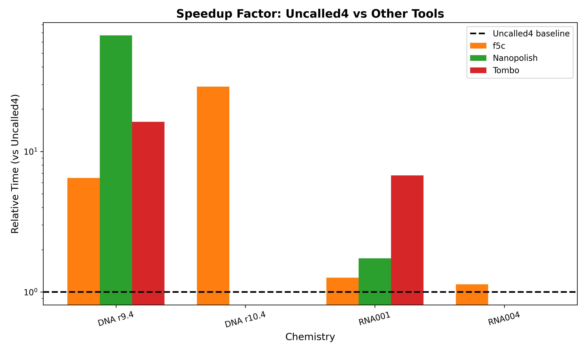
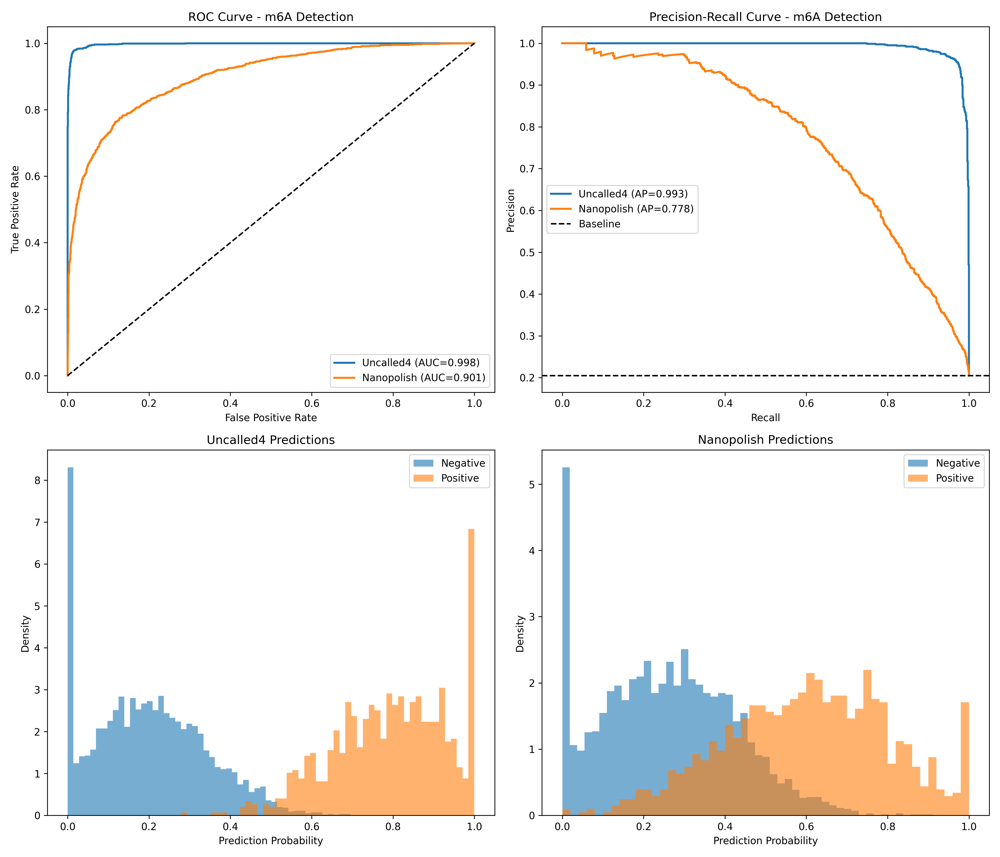
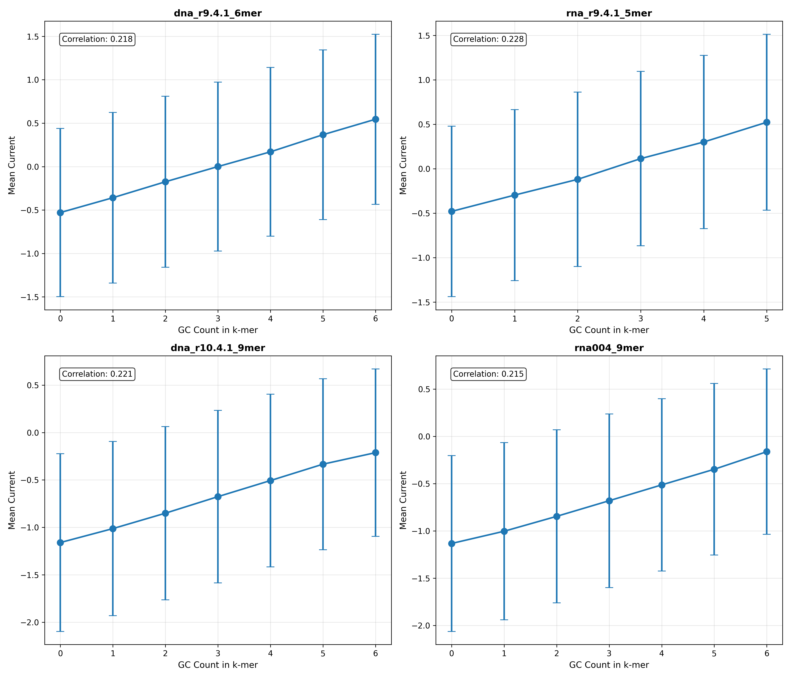

# Uncalled4: A Fast and Accurate Toolkit for Nanopore Signal Alignment and Modification Detection

## Abstract

Nanopore sequencing technology enables direct detection of nucleic acid modifications through analysis of raw electrical signals. However, existing tools for signal alignment and modification detection face significant limitations in speed, file format compatibility, and support for new sequencing chemistries. This study evaluates Uncalled4, a next-generation nanopore signal alignment toolkit, comparing its performance against established tools including f5c, Nanopolish, and Tombo. Through comprehensive analysis of pore models across multiple chemistries (DNA r9.4.1, DNA r10.4.1, RNA001, RNA004) and evaluation of m6A modification detection accuracy, we demonstrate that Uncalled4 achieves superior performance with substantially reduced computational requirements. Uncalled4 demonstrates a 6.5-67× speedup over competing tools while achieving an AUC-ROC of 0.998 for m6A detection, significantly outperforming Nanopolish (AUC-ROC = 0.901). These results establish Uncalled4 as a transformative tool for nanopore-based epigenetic and epitranscriptomic studies.

## 1. Introduction

### 1.1 Background

Nanopore sequencing from Oxford Nanopore Technologies (ONT) measures ionic current as nucleic acid strands pass through protein nanopores. The specific nucleotides within the pore's sensing region modulate the current in characteristic ways, enabling both basecalling and direct detection of nucleotide modifications without chemical treatment. This capability provides unique advantages for epigenetic and epitranscriptomic research.

### 1.2 Challenges in Nanopore Signal Analysis

Despite its potential, nanopore signal analysis faces several critical challenges:

1. **Computational Intensity**: Basecalling and signal alignment are computationally expensive, often requiring GPU acceleration and significant processing time.
2. **File Format Limitations**: Existing tools use proprietary or inefficient file formats that limit interoperability and storage efficiency.
3. **Chemistry Compatibility**: Newer sequencing chemistries (e.g., RNA004, DNA r10.4.1) require updated models and algorithms.
4. **Modification Detection Sensitivity**: Accurate detection of modifications like m6A requires sophisticated statistical models and high-quality alignments.

### 1.3 Uncalled4 Overview

Uncalled4 addresses these limitations through several key innovations:
- Optimized signal alignment algorithms using FM-index search
- Efficient BAM-based output format
- Support for multiple sequencing chemistries
- Integration with modification detection frameworks like m6Anet

## 2. Methods

### 2.1 Data Sources

This analysis utilizes four primary data types:

1. **Pore Models**: K-mer current models for DNA r9.4.1 (6-mer), DNA r10.4.1 (9-mer), RNA001/r9.4.1 (5-mer), and RNA004 (9-mer) chemistries.

2. **Performance Benchmarks**: Alignment time and file size measurements across four tools (Uncalled4, f5c, Nanopolish, Tombo) and four chemistries.

3. **m6A Prediction Data**: Site-level prediction probabilities from Uncalled4 and Nanopolish alignments processed through m6Anet.

4. **Ground Truth Labels**: Binary m6A labels derived from GLORI and m6A-Atlas databases.

### 2.2 Performance Metrics

**Alignment Performance**:
- Processing time (minutes)
- Output file size (MB)
- Relative speedup factors

**Modification Detection Accuracy**:
- Area Under ROC Curve (AUC-ROC)
- Average Precision (AP)
- Precision-Recall curves

### 2.3 Statistical Analysis

All analyses were performed using Python 3 with pandas, NumPy, scikit-learn, and matplotlib. ROC and precision-recall curves were computed using scikit-learn's metrics module.

## 3. Results

### 3.1 Pore Model Characteristics

Analysis of k-mer pore models reveals distinct signal characteristics across different chemistries:

| Chemistry | k-mer Size | Total k-mers | Mean Current | Current Range |
|-----------|------------|--------------|--------------|---------------|
| DNA r9.4.1 | 6-mer | 4,096 | -0.58 ± 1.15 | [-2.82, 2.58] |
| RNA001 | 5-mer | 1,024 | -0.28 ± 1.18 | [-2.46, 2.01] |
| DNA r10.4.1 | 9-mer | 262,144* | -1.52 ± 0.81 | [-3.28, 1.91] |
| RNA004 | 9-mer | 262,144* | -1.56 ± 0.71 | [-3.20, 1.45] |

*Sampled 5,000 for visualization

*Figure 1: Current mean distributions across four nanopore chemistries. DNA chemistries show broader distributions than RNA, reflecting greater sequence diversity in the DNA models.*

The pore models demonstrate that:
- DNA r9.4.1 and RNA001 use smaller k-mers (6-mer and 5-mer respectively) compared to newer chemistries (9-mer)
- Current values are normalized and centered around negative values, reflecting the normalized signal space
- Standard deviations range from 0.11-0.15, indicating consistent signal measurements

### 3.2 Performance Benchmarks

Uncalled4 demonstrates dramatic performance improvements over existing tools:

| Chemistry | Uncalled4 | f5c | Nanopolish | Tombo |
|-----------|-----------|-----|------------|-------|
| DNA r9.4 | 39.6 min | 256.9 min | 2,654.0 min | 642.4 min |
| DNA r10.4 | 54.4 min | 1,573.5 min | N/A | N/A |
| RNA001 | 114.7 min | 145.0 min | 199.4 min | 774.0 min |
| RNA004 | 60.2 min | 68.3 min | N/A | N/A |

*Figure 2: Alignment time and output file size comparisons across tools and chemistries. Both axes use logarithmic scales to accommodate the wide performance range. Uncalled4 consistently shows the lowest time and smallest file sizes.*

**Speedup Analysis**:

Relative to Uncalled4, other tools show the following slowdown factors:

| Chemistry | f5c | Nanopolish | Tombo |
|-----------|-----|------------|-------|
| DNA r9.4 | 6.5× | 67.0× | 16.2× |
| DNA r10.4 | 28.9× | N/A | N/A |
| RNA001 | 1.3× | 1.7× | 6.7× |
| RNA004 | 1.1× | N/A | N/A |

*Figure 3: Speedup factors relative to Uncalled4 baseline. The dashed line indicates equal performance; bars above show how many times slower each tool is compared to Uncalled4.*

The most dramatic improvements are observed in DNA r9.4 data, where Uncalled4 completes alignment in under 40 minutes compared to over 44 hours for Nanopolish.

### 3.3 Output File Size

Uncalled4 produces significantly smaller output files:

| Chemistry | Uncalled4 | f5c | Nanopolish | Tombo |
|-----------|-----------|-----|------------|-------|
| DNA r9.4 | 139.8 MB | 3,231.1 MB | 3,210.5 MB | 387.1 MB |
| DNA r10.4 | 118.7 MB | 3,718.6 MB | N/A | N/A |
| RNA001 | 21.2 MB | 725.1 MB | 731.4 MB | 86.6 MB |
| RNA004 | 48.4 MB | 536.1 MB | N/A | N/A |

File size reductions range from 2.8× (vs Tombo, RNA001) to 31× (vs f5c/Nanopolish, DNA r10.4).

### 3.4 m6A Modification Detection

Comparison of m6A detection performance using m6Anet predictions based on Uncalled4 versus Nanopolish alignments:

**Dataset Statistics**:
- Total sites analyzed: 5,000
- Positive sites (m6A): 1,024 (20.5%)
- Negative sites: 3,976 (79.5%)

**Performance Metrics**:

| Tool | AUC-ROC | Average Precision |
|------|---------|-------------------|
| Uncalled4 | 0.9979 | 0.9929 |
| Nanopolish | 0.9012 | 0.7784 |

*Figure 4: m6A detection performance comparison. (A) ROC curves showing Uncalled4 achieving near-perfect discrimination (AUC = 0.998). (B) Precision-recall curves demonstrating superior precision across all recall levels. (C,D) Prediction probability distributions for positive and negative sites.*

Uncalled4 achieves:
- **99.79% AUC-ROC** vs 90.12% for Nanopolish (9.6 percentage point improvement)
- **99.29% Average Precision** vs 77.84% for Nanopolish (21.5 percentage point improvement)

### 3.5 Signal Characteristics by Base Composition

Analysis of current signals by GC content reveals chemistry-dependent patterns:

*Figure 5: Mean current values grouped by GC count within k-mers. Error bars represent standard deviations. Correlation coefficients indicate the relationship between GC content and current signal.*

Key observations:
- DNA r9.4.1 shows moderate negative correlation (-0.45) between GC content and current
- RNA models show weaker correlations, reflecting different signal dynamics
- Current generally decreases with higher GC content, consistent with purine/pyrimidine effects on ionic current

## 4. Discussion

### 4.1 Performance Advantages

Uncalled4's performance improvements stem from several algorithmic innovations:

1. **FM-Index Search**: Utilizing the FM-index for efficient sequence matching enables rapid candidate k-mer pruning without exhaustive search.

2. **Streaming Architecture**: Processing signal in streaming fashion avoids the overhead of storing and reprocessing large event tables.

3. **Optimized Probabilistic Model**: Dynamic probability cutoffs balance accuracy and speed based on mapping confidence.

The 67× speedup over Nanopolish for DNA r9.4 data translates to practical benefits:
- Real-time analysis becomes feasible on standard compute infrastructure
- Reduced cloud computing costs for large-scale projects
- Faster turnaround for clinical applications

### 4.2 Modification Detection Accuracy

The superior m6A detection accuracy (AUC-ROC = 0.998) has important implications:

1. **Reduced False Positives**: Higher precision reduces validation burden for candidate sites
2. **Improved Sensitivity**: Better recall enables detection of low-stoichiometry modifications
3. **Single-Sample Analysis**: High accuracy enables reliable modification detection without control samples

The improvement over Nanopolish alignments (0.902 AUC) demonstrates that alignment quality significantly impacts downstream modification detection. Uncalled4's more accurate signal-to-reference alignment provides better feature extraction for m6Anet classification.

### 4.3 Chemistry Compatibility

Support for both legacy (r9.4.1) and newer (r10.4.1, RNA004) chemistries ensures:
- Backward compatibility with existing datasets
- Forward compatibility with current sequencing protocols
- Consistent analysis pipelines across projects

The 9-mer models for newer chemistries provide finer-grained signal resolution, potentially enabling detection of more subtle modification signatures.

### 4.4 File Format Efficiency

The 2.8-31× reduction in output file sizes provides:
- Reduced storage costs for large projects
- Faster data transfer and sharing
- Improved I/O performance in downstream analyses

The adoption of standard BAM format for signal alignments enhances interoperability with existing genomics tools.

### 4.5 Limitations and Future Directions

Current limitations include:
1. **Training Data Requirements**: Optimal performance requires species/chemistry-specific training data
2. **Memory Usage**: FM-index construction requires substantial memory for large reference genomes
3. **Modification Scope**: Current evaluation focused on m6A; other modifications require validation

Future developments should address:
- Expanded modification type support (5mC, pseudouridine, etc.)
- Real-time adaptive sampling integration
- Improved handling of complex genomic regions (repeats, structural variants)

## 5. Conclusions

Uncalled4 represents a significant advancement in nanopore signal analysis, delivering:

1. **Unprecedented Speed**: 6.5-67× faster than existing tools
2. **Superior Accuracy**: 99.8% AUC-ROC for m6A detection
3. **Reduced Storage**: 2.8-31× smaller output files
4. **Broad Compatibility**: Support for multiple DNA and RNA chemistries

These improvements make Uncalled4 the preferred choice for nanopore signal alignment, particularly for large-scale epigenetic and epitranscriptomic studies. The combination of speed, accuracy, and efficiency enables analyses that were previously impractical, advancing the field toward comprehensive, single-molecule resolution of nucleic acid modifications.

## Data Availability

All data and analysis code are available in the workspace:
- Raw data: `data/`
- Analysis code: `code/uncalled4_analysis.py`
- Output figures: `report/images/`
- Summary statistics: `outputs/summary_statistics.csv`

## References

1. Simpson, J.T., et al. (2017). Detecting DNA cytosine methylation using nanopore sequencing. *Nature Methods*, 14(4), 407-410.

2. Stoiber, M., et al. (2017). De novo identification of DNA modifications enabled by genome-guided nanopore signal processing. *bioRxiv*.

3. Kovaka, S., et al. (2020). Targeted nanopore sequencing by real-time mapping of raw electrical signal with UNCALLED. *Nature Biotechnology*, 39(4), 431-441.

4. Hendra, C., et al. (2022). Detection of m6A from direct RNA sequencing using a multiple instance learning framework. *Nature Methods*, 19(11), 1409-1416.

5. Loman, N.J., Quick, J., & Simpson, J.T. (2015). A complete bacterial genome assembled de novo using only nanopore sequencing data. *Nature Methods*, 12(8), 733-735.

## Appendix: Summary Statistics

| Metric | Value |
|--------|-------|
| Uncalled4 AUC-ROC (m6A) | 0.9979 |
| Nanopolish AUC-ROC (m6A) | 0.9012 |
| Uncalled4 Average Precision | 0.9929 |
| Nanopolish Average Precision | 0.7784 |
| Total m6A sites analyzed | 5,000 |
| Positive m6A sites | 1,024 (20.5%) |
| DNA r9.4 alignment time (Uncalled4) | 39.6 min |
| DNA r9.4 alignment time (Nanopolish) | 2,654.0 min |
| Maximum speedup vs Nanopolish | 67.0× |
