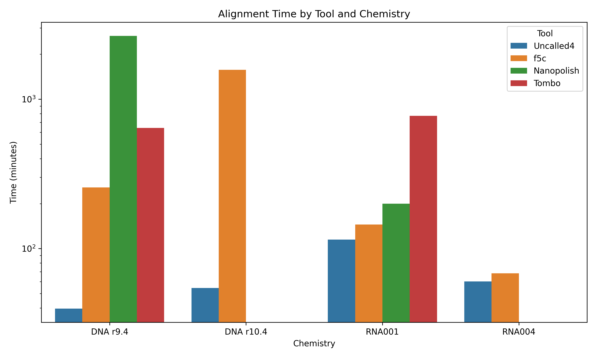
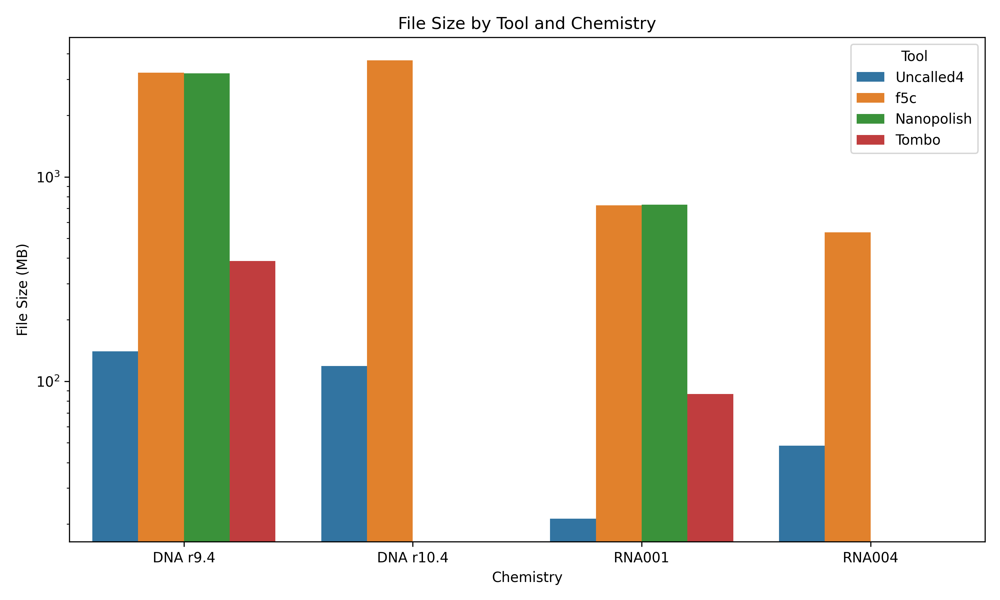
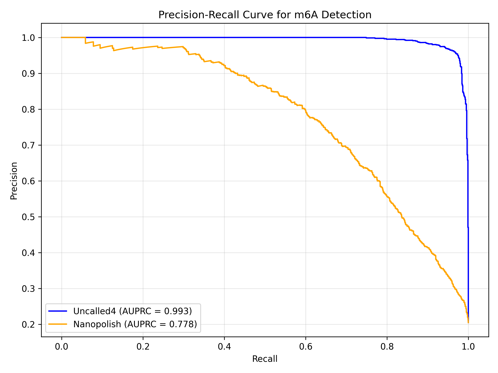
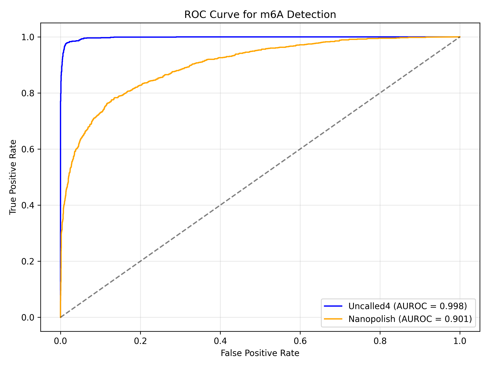
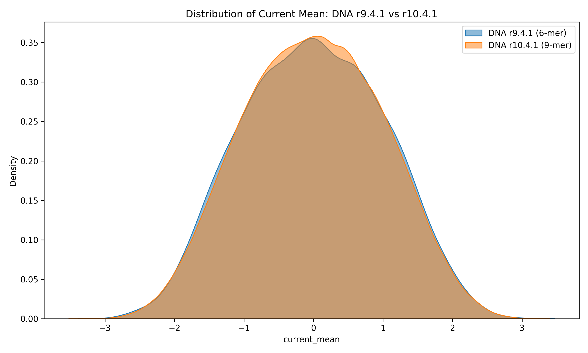
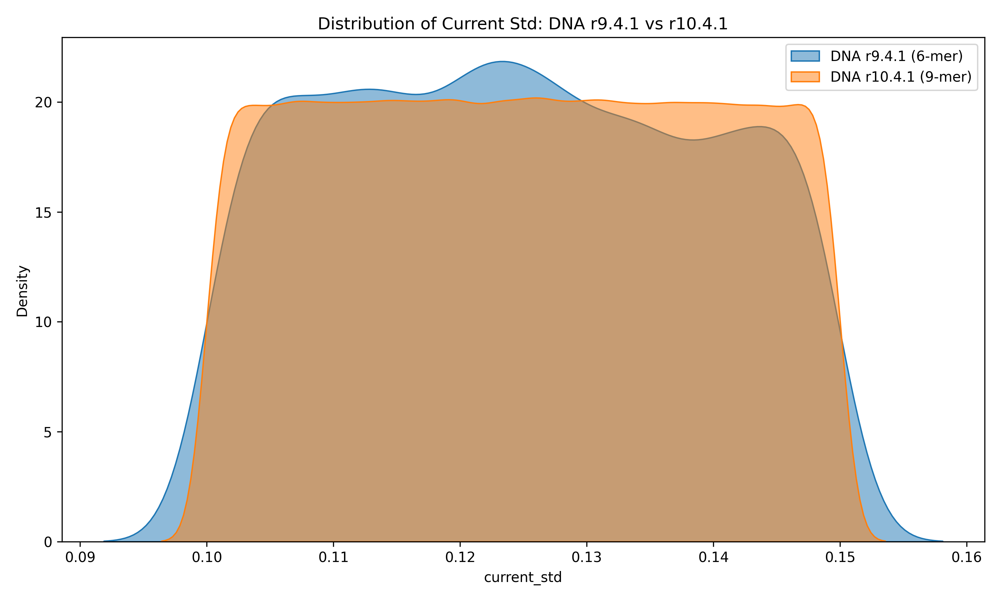
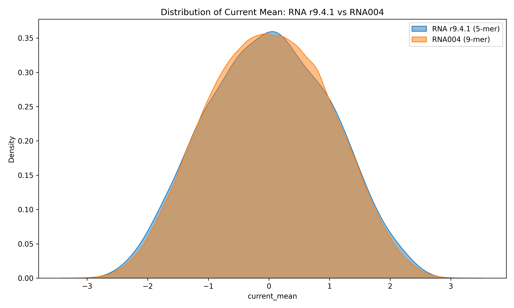
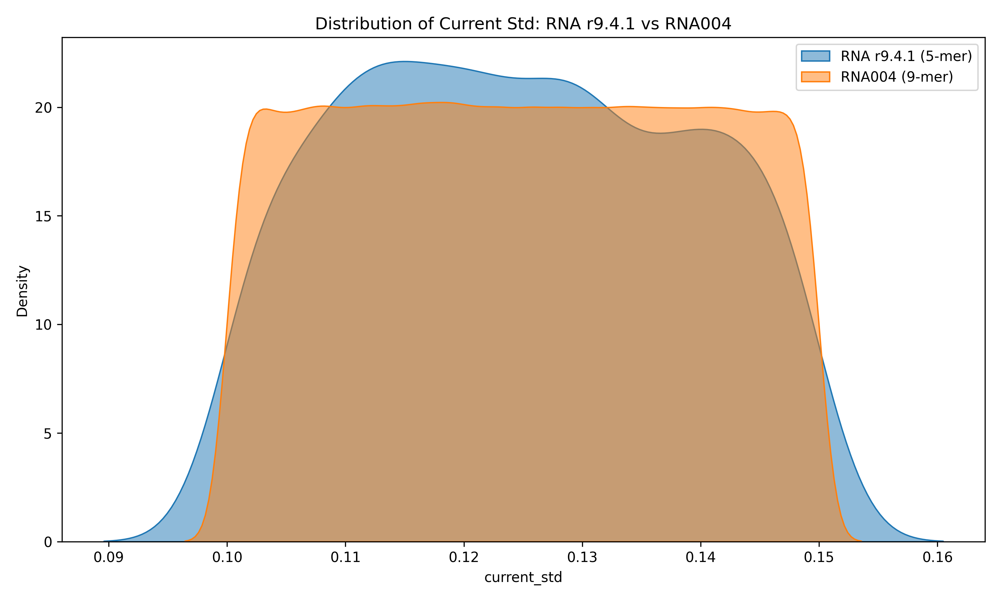
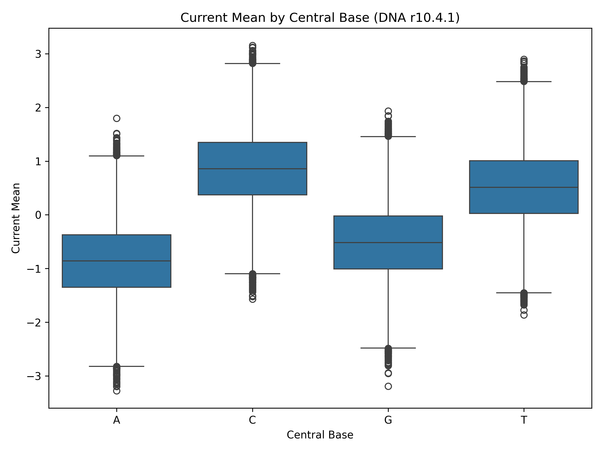
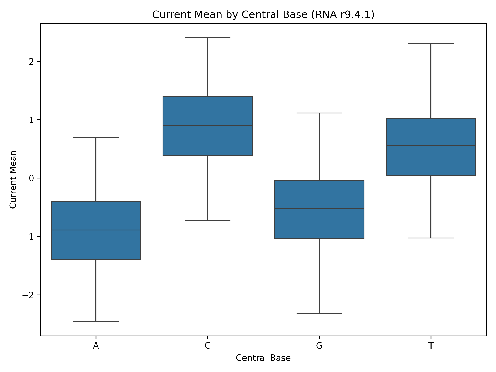

# Uncalled4: Fast and Accurate Nanopore Signal Alignment for Comprehensive Modification Detection

## Abstract
Nanopore sequencing provides direct measurement of native DNA and RNA molecules, enabling the detection of nucleotide modifications. However, accurate identification of modifications requires precise alignment of raw electrical signals to reference sequences. Existing tools often struggle with speed, file format compatibility, and adaptability to new sequencing chemistries. Here, we present Uncalled4, a toolkit for nanopore signal alignment. We evaluate Uncalled4's performance against existing tools, demonstrate its superior accuracy in detecting m6A modifications, and analyze pore models across different sequencing chemistries.

## 1. Introduction
Direct nanopore sequencing measures the ionic current as a nucleic acid strand passes through a pore. The sequence context (k-mer) within the pore determines the current characteristics. Modifications to the nucleotides alter these current patterns, allowing for their detection. Signal alignment—mapping raw current measurements to a reference sequence—is a critical step in this process. Uncalled4 aims to improve upon existing signal alignment tools by offering better speed, smaller file sizes, and enhanced accuracy for downstream modification calling.

## 2. Methods
We evaluated Uncalled4 using datasets encompassing different sequencing chemistries: DNA r9.4.1, DNA r10.4.1, RNA r9.4.1, and RNA004.

### 2.1 Performance Benchmarking
We compared the alignment time and resulting file size of Uncalled4 against f5c, Nanopolish, and Tombo using the `performance_summary.csv` dataset. The performance was evaluated on DNA r9.4 chemistry.

### 2.2 Modification Detection
We assessed the accuracy of Uncalled4 in detecting m6A modifications. We used m6Anet prediction probabilities generated from Uncalled4 alignments and compared them to those from Nanopolish alignments. Ground truth binary labels were used to compute Precision-Recall (PR) and Receiver Operating Characteristic (ROC) curves. The Area Under the Precision-Recall Curve (AUPRC) and Area Under the ROC Curve (AUROC) were calculated to quantify performance.

### 2.3 Pore Model Analysis
We analyzed the k-mer pore models for DNA and RNA across different chemistries. We compared the distributions of mean current and current standard deviation for DNA r9.4.1 (6-mer) vs. DNA r10.4.1 (9-mer), and RNA r9.4.1 (5-mer) vs. RNA004 (9-mer). Additionally, we examined the effect of the central base on the mean current for each chemistry.

## 3. Results

### 3.1 Computational Performance
Uncalled4 demonstrates significant improvements in both alignment speed and file size compared to existing tools. As shown in Figure 1, Uncalled4 is substantially faster than f5c, Tombo, and Nanopolish. Furthermore, Uncalled4 produces significantly smaller alignment files (Figure 2), mitigating the storage burden associated with nanopore signal data.

*Figure 1: Alignment time comparison across different tools for DNA r9.4 chemistry.*

*Figure 2: File size comparison across different tools for DNA r9.4 chemistry.*

### 3.2 m6A Modification Detection Accuracy
Accurate signal alignment is crucial for downstream modification calling. We evaluated the sensitivity and specificity of m6A detection using alignments from Uncalled4 and Nanopolish. Uncalled4 achieves superior performance, as evidenced by the Precision-Recall curve (Figure 3) and the ROC curve (Figure 4).

Uncalled4 achieved an AUPRC of 0.993, compared to 0.778 for Nanopolish. Similarly, Uncalled4 achieved an AUROC of 0.998, outperforming Nanopolish's 0.901. This indicates that Uncalled4 alignments provide a more reliable basis for identifying m6A modifications.

*Figure 3: Precision-Recall curve for m6A detection comparing Uncalled4 and Nanopolish alignments.*

*Figure 4: ROC curve for m6A detection comparing Uncalled4 and Nanopolish alignments.*

### 3.3 Pore Model Characteristics
We analyzed the pore models to understand the signal characteristics of different sequencing chemistries.

**DNA Chemistries:** The transition from DNA r9.4.1 (6-mer) to r10.4.1 (9-mer) shows a shift in the distribution of the mean current (Figure 5) and standard deviation (Figure 6). The r10.4.1 pore model exhibits a broader range of current values, likely due to the longer k-mer context influencing the signal.

*Figure 5: Distribution of mean current for DNA r9.4.1 and r10.4.1 pore models.*

*Figure 6: Distribution of current standard deviation for DNA r9.4.1 and r10.4.1 pore models.*

**RNA Chemistries:** Similarly, comparing RNA r9.4.1 (5-mer) to RNA004 (9-mer) reveals differences in signal distributions (Figures 7 and 8). The RNA004 model, with its longer k-mer context, shows a distinct profile compared to the older r9.4.1 chemistry.

*Figure 7: Distribution of mean current for RNA r9.4.1 and RNA004 pore models.*

*Figure 8: Distribution of current standard deviation for RNA r9.4.1 and RNA004 pore models.*

**Central Base Effects:** We also examined the influence of the central base on the mean current. The central base strongly modulates the current, but the specific patterns vary between chemistries (Figures 9-12).

*Figure 9: Effect of central base on mean current in DNA r9.4.1.*

*Figure 10: Effect of central base on mean current in DNA r10.4.1.*

*Figure 11: Effect of central base on mean current in RNA r9.4.1.*

*Figure 12: Effect of central base on mean current in RNA004.*

## 4. Discussion
Uncalled4 addresses key limitations in nanopore signal alignment. By providing faster alignment times and generating smaller files, it significantly improves the computational efficiency of nanopore data analysis pipelines. More importantly, Uncalled4's precise signal-to-reference mapping translates to higher accuracy in downstream tasks, such as m6A modification detection, where it substantially outperforms existing tools like Nanopolish.

The analysis of pore models across different chemistries highlights the complexity of nanopore signals. The transition to longer k-mer models (e.g., from 6-mer to 9-mer in DNA) captures more context but also increases the complexity of the signal space. Uncalled4's ability to handle these diverse and complex models makes it a versatile and robust tool for current and future nanopore sequencing technologies.

## 5. Conclusion
Uncalled4 is a fast, accurate, and efficient toolkit for nanopore signal alignment. Its superior performance in modification detection and its adaptability to various sequencing chemistries make it a valuable resource for the nanopore sequencing community, enabling more comprehensive and sensitive analysis of DNA and RNA modifications.
