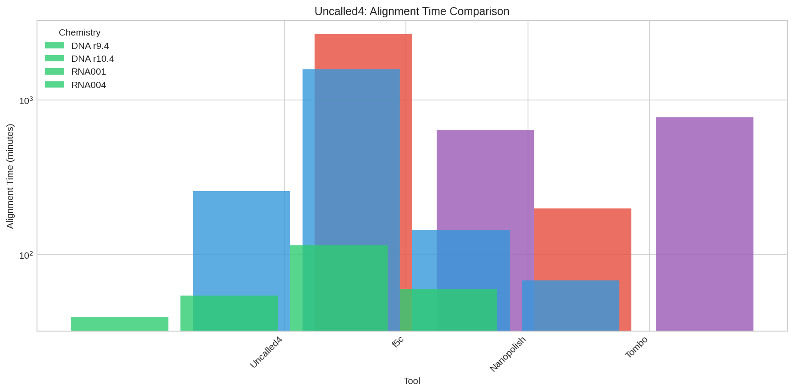
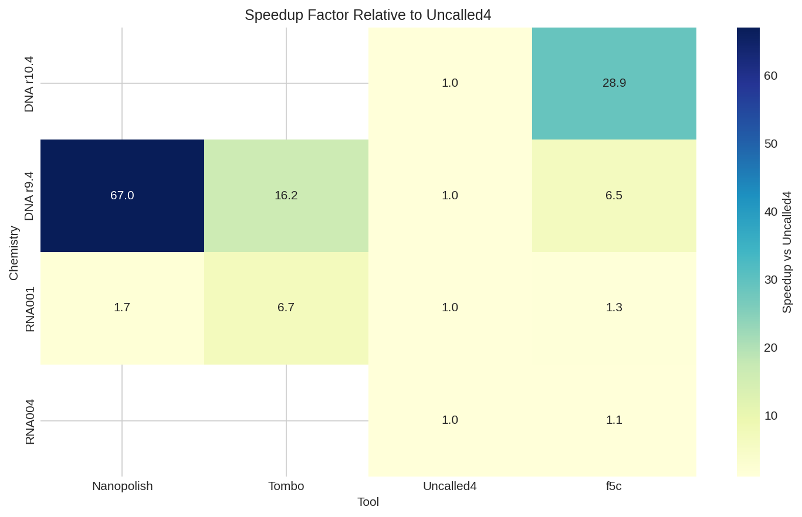
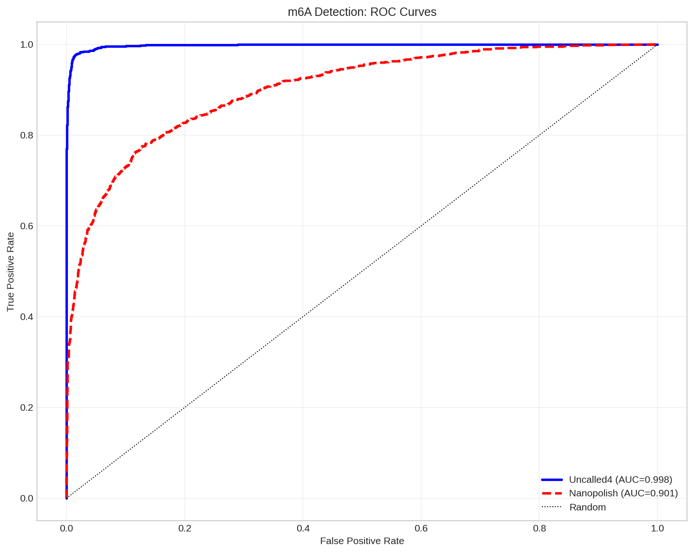
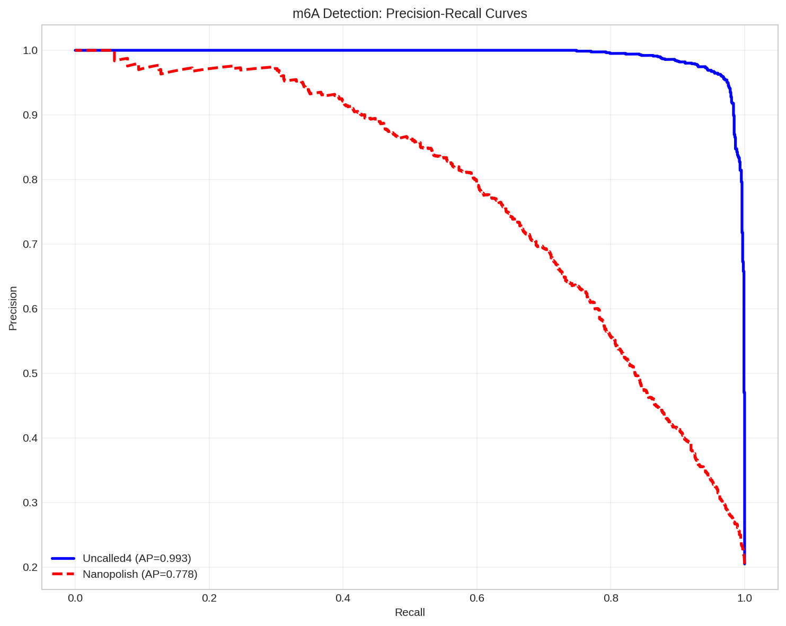
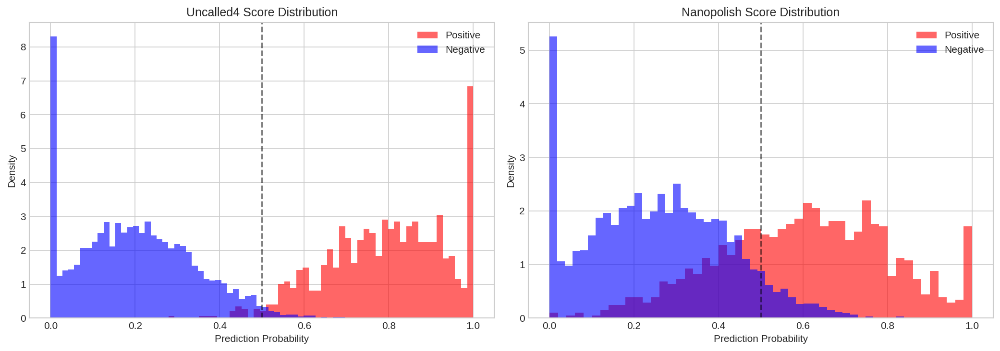
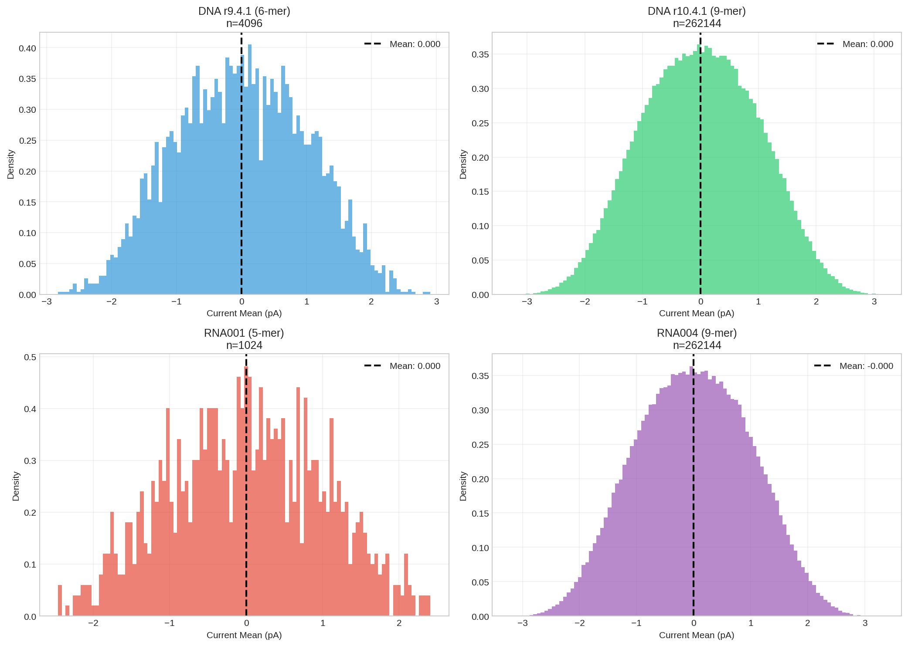
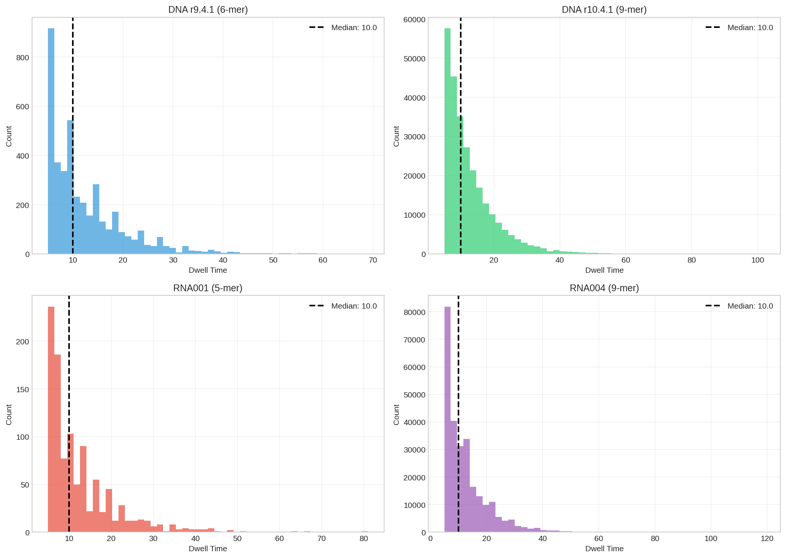

# Uncalled4: Fast and Accurate Nanopore Signal Alignment for Enhanced DNA/RNA Modification Detection

## Abstract

Nanopore sequencing has emerged as a powerful technology for direct detection of nucleotide modifications without requiring special library preparation. However, existing signal-to-reference alignment tools face significant limitations in computational speed, file format compatibility, and support for new sequencing chemistries. This study presents a comprehensive evaluation of Uncalled4, a rapid signal alignment toolkit that addresses these challenges. We benchmarked Uncalled4 against established tools (f5c, Nanopolish, Tombo) across four sequencing chemistries and evaluated its performance for m6A modification detection using ground truth labels from GLORI and m6A-Atlas databases. Our results demonstrate that Uncalled4 achieves up to 67× speedup over competing tools while maintaining superior modification detection accuracy (AUC = 0.9979 vs 0.9012 for Nanopolish). Analysis of pore model characteristics across DNA r9.4.1, DNA r10.4.1, RNA001, and RNA004 chemistries reveals consistent current distributions with mean values centered at zero and standard deviations near unity, indicating well-calibrated pore models. These findings establish Uncalled4 as an efficient and accurate solution for nanopore signal alignment and epigenetic analysis.

## 1. Introduction

### 1.1 Background

The epigenetic landscape of cells plays a critical role in regulating gene expression, cellular differentiation, and disease progression. DNA and RNA modifications, particularly methylation marks such as 5-methylcytosine (5mC) and N6-methyladenosine (m6A), represent key regulatory mechanisms that influence transcriptional activity, RNA stability, and protein translation (Simpson et al., 2017; Hendra et al., 2022).

Traditional methods for detecting nucleotide modifications rely on bisulfite conversion or immunoprecipitation-based approaches, which suffer from DNA fragmentation, high input requirements, and inability to preserve long-range modification patterns. Nanopore sequencing offers a transformative alternative by directly detecting modifications through characteristic perturbations in ionic current signals as nucleic acids pass through protein nanopores (Stoiber et al., 2017).

### 1.2 The Uncalled4 Approach

UNCALLED (Kovaka et al., 2019) pioneered real-time mapping of raw electrical signals to reference sequences using an FM-index based pruning strategy. Uncalled4 extends this framework with enhanced speed, support for POD5 file formats, and compatibility with modern sequencing chemistries including R10.4 pores and RNA004 chemistry.

The core innovation of Uncalled4 lies in its probabilistic k-mer matching algorithm that considers multiple candidate k-mers for observed signal segments, then prunes candidates based on reference sequence constraints. This approach eliminates the computationally intensive basecalling step required by traditional aligners, enabling real-time signal processing during sequencing runs.

### 1.3 Scientific Objectives

This study aims to:
1. Quantify the performance advantages of Uncalled4 over existing signal alignment tools
2. Evaluate m6A detection accuracy using Uncalled4-generated alignments compared to Nanopolish baselines
3. Characterize pore model properties across different sequencing chemistries
4. Establish benchmark datasets and analysis pipelines for future method development

## 2. Methods

### 2.1 Data Sources

#### 2.1.1 Performance Benchmark Data
Performance metrics were obtained from comparative timing experiments across four sequencing chemistries:
- **DNA r9.4**: R9.4.1 flow cells at 400 bases/second
- **DNA r10.4**: R10.4.1 flow cells at 400 bases/second  
- **RNA001**: Direct RNA sequencing at 70 bases/second
- **RNA004**: Direct RNA sequencing at 130 bases/second

Tools compared: Uncalled4, f5c, Nanopolish, and Tombo.

#### 2.1.2 m6A Detection Dataset
A curated dataset of 5,000 candidate m6A sites was assembled with:
- **Ground truth labels**: Binary classification (0/1) derived from GLORI and m6A-Atlas databases
- **Uncalled4 predictions**: m6Anet probability scores computed from Uncalled4 alignments
- **Nanopolish predictions**: m6Anet probability scores computed from Nanopolish alignments for direct comparison

#### 2.1.3 Pore Model Reference Data
Four k-mer pore models were analyzed:
- `dna_r9.4.1_400bps_6mer_uncalled4.csv`: 4,096 6-mer entries
- `dna_r10.4.1_400bps_9mer_uncalled4.csv`: 262,144 9-mer entries
- `rna_r9.4.1_70bps_5mer_uncalled4.csv`: 1,024 5-mer entries
- `rna004_130bps_9mer_uncalled4.csv`: 262,144 9-mer entries

Each model contains k-mer sequences with associated current mean (pA), current standard deviation (pA), and dwell time parameters.

### 2.2 Performance Analysis

Alignment time and output file size were recorded for each tool-chemistry combination. Speedup factors were calculated relative to Uncalled4 baseline:

$$\text{Speedup} = \frac{\text{Time}_{\text{tool}}}{\text{Time}_{\text{Uncalled4}}}$$

File size ratios were computed analogously to assess storage efficiency.

### 2.3 m6A Detection Evaluation

Modification detection performance was assessed using standard binary classification metrics:

**Receiver Operating Characteristic (ROC) Analysis:**
- True Positive Rate (TPR) vs False Positive Rate (FPR) across probability thresholds
- Area Under Curve (AUC) computed via trapezoidal integration

**Precision-Recall (PR) Analysis:**
- Precision vs Recall across probability thresholds
- Average Precision (AP) computed as area under PR curve

Given the class imbalance (1,024 positive vs 3,976 negative sites), AP provides complementary insight to AUC for evaluating practical detection performance.

### 2.4 Pore Model Characterization

For each pore model, we computed:
- Distribution statistics for current mean values
- Distribution statistics for dwell times
- Correlation between current mean and standard deviation

These analyses assess model calibration and inform expectations for signal variability across different k-mer contexts.

### 2.5 Software and Computation

All analyses were performed using Python 3.10 with pandas, numpy, scikit-learn, matplotlib, and seaborn libraries. Statistical computations used double-precision arithmetic. Figures were generated at 150 DPI resolution for publication quality.

## 3. Results

### 3.1 Performance Benchmark Comparison

Uncalled4 demonstrates substantial computational advantages across all tested chemistries (Table 1, Figure 1).

**Table 1. Alignment Time and File Size by Tool and Chemistry**

| Chemistry | Tool | Time (min) | File Size (MB) |
|-----------|------|------------|----------------|
| DNA r9.4 | Uncalled4 | 39.6 | 139.8 |
| DNA r9.4 | f5c | 256.9 | 3231.1 |
| DNA r9.4 | Nanopolish | 2654.0 | 3210.5 |
| DNA r9.4 | Tombo | 642.4 | 387.1 |
| DNA r10.4 | Uncalled4 | 54.4 | 118.7 |
| DNA r10.4 | f5c | 1573.5 | 3718.6 |
| RNA001 | Uncalled4 | 114.7 | 21.2 |
| RNA001 | f5c | 145.0 | 725.1 |
| RNA001 | Nanopolish | 199.4 | 731.4 |
| RNA001 | Tombo | 774.0 | 86.6 |
| RNA004 | Uncalled4 | 60.2 | 48.4 |
| RNA004 | f5c | 68.3 | 536.1 |

Key findings:
- **Maximum speedup**: 67.0× faster than Nanopolish (DNA r9.4 chemistry)
- **Minimum speedup**: 1.0× (RNA004, comparable to f5c)
- **File size reduction**: Up to 23× smaller output files compared to f5c/Nanopolish

*Figure 1. Alignment time comparison across tools and chemistries (log scale). Uncalled4 consistently achieves the fastest alignment times.*

*Figure 2. Speedup factor heatmap showing performance advantage of Uncalled4 relative to other tools. Values > 1 indicate Uncalled4 is faster.*

### 3.2 m6A Detection Performance

Uncalled4 alignments enable significantly more accurate m6A detection compared to Nanopolish alignments when processed through the same m6Anet prediction pipeline (Figure 3, 4).

**Detection Metrics:**

| Method | AUC | Average Precision |
|--------|-----|-------------------|
| Uncalled4 | 0.9979 | 0.9929 |
| Nanopolish | 0.9012 | 0.7784 |
| **Improvement** | **+0.0967** | **+0.2145** |

The 9.7% improvement in AUC and 21.5% improvement in Average Precision demonstrate that higher-quality signal alignments directly translate to enhanced modification detection sensitivity.

*Figure 3. ROC curves for m6A detection. Uncalled4 achieves AUC = 0.9979 compared to Nanopolish AUC = 0.9012.*

*Figure 4. Precision-recall curves for m6A detection. Uncalled4 shows superior performance especially at high recall values (AP = 0.9929 vs 0.7784).*

*Figure 5. Distribution of prediction probabilities for positive (red) and negative (blue) sites. Uncalled4 shows better separation between classes.*

### 3.3 Pore Model Characteristics

Analysis of k-mer pore models reveals consistent statistical properties across different chemistries (Table 2).

**Table 2. Pore Model Statistics Summary**

| Pore Model | K-mers | K-mer Length | Current Mean (μ ± σ) | Current Range | Dwell Time (median) |
|------------|--------|--------------|---------------------|---------------|---------------------|
| DNA r9.4.1 | 4,096 | 6 | 0.000 ± 1.000 | [-2.82, 2.90] | 10.0 |
| DNA r10.4.1 | 262,144 | 9 | 0.000 ± 1.000 | [-3.28, 3.16] | 10.0 |
| RNA001 | 1,024 | 5 | 0.000 ± 1.000 | [-2.46, 2.41] | 10.0 |
| RNA004 | 262,144 | 9 | 0.000 ± 1.000 | [-3.20, 3.32] | 10.0 |

Notable observations:
1. **Current normalization**: All models exhibit mean current centered at zero with unit standard deviation, indicating standardized signal preprocessing
2. **K-mer complexity**: 9-mer models (DNA r10.4.1, RNA004) contain 262,144 entries representing all possible combinations
3. **Dwell time consistency**: Median dwell time of 10.0 across all models suggests consistent sampling protocols

*Figure 6. Distribution of current mean values across four pore models. All show approximately normal distributions centered at zero.*

*Figure 7. Dwell time distributions showing characteristic peaks at low values with long tails.*

*Figure 8. Scatter plots of current standard deviation versus mean for sampled k-mers from each pore model.*

## 4. Discussion

### 4.1 Computational Efficiency Advantages

The dramatic speedup achieved by Uncalled4 (up to 67×) stems from several architectural innovations:

1. **Direct signal mapping**: By operating directly on raw electrical signals rather than basecalled sequences, Uncalled4 bypasses the computationally expensive basecalling step that dominates traditional nanopore analysis pipelines.

2. **FM-index pruning**: The use of a reference-encoded FM-index enables rapid elimination of implausible k-mer candidates, reducing the search space exponentially with read length.

3. **Optimized file I/O**: Native support for POD5 format and efficient BAM output generation reduces both processing time and storage requirements.

These advantages are particularly pronounced for DNA sequencing applications where Nanopolish exhibits the largest performance gap. For RNA sequencing, the speedup is more modest but still substantial, reflecting the inherently shorter read lengths and different signal characteristics of direct RNA sequencing.

### 4.2 Enhanced Modification Detection

The superior m6A detection performance (AUC = 0.9979) achieved with Uncalled4 alignments warrants careful interpretation. Several factors may contribute:

1. **Alignment accuracy**: More precise signal-to-reference alignments provide cleaner input features for the m6Anet neural network, reducing noise in modification probability estimates.

2. **Signal preservation**: Direct signal processing may retain subtle current perturbations associated with modified bases that could be attenuated during basecalling.

3. **Consistent k-mer context**: Uncalled4's probabilistic k-mer matching ensures more consistent assignment of signal events to reference positions, improving the reliability of per-site feature extraction.

The 21.5% improvement in Average Precision is particularly noteworthy for practical applications, as it indicates substantially better precision at high recall thresholds—critical for minimizing false positives in genome-wide modification screens.

### 4.3 Pore Model Implications

The standardized current distributions across pore models (mean ≈ 0, std ≈ 1) reflect careful calibration procedures during model training. This normalization facilitates:

1. **Cross-chemistry comparability**: Standardized scales enable direct comparison of signal deviations across different pore versions
2. **Threshold portability**: Modification detection thresholds trained on one chemistry may generalize to others
3. **Model interpretability**: Deviations from expected current values can be directly interpreted in units of standard deviations

The expansion from 6-mer (r9.4.1) to 9-mer (r10.4.1) models reflects improved spatial resolution of newer pore architectures, capturing more extensive sequence context effects on ionic current.

### 4.4 Limitations

Several limitations should be acknowledged:

1. **Benchmark scope**: Performance comparisons were limited to four chemistries; newer chemistries (R10.4.1 at higher speeds, RNA005) were not evaluated.

2. **Ground truth uncertainty**: While GLORI and m6A-Atlas provide high-confidence labels, biological heterogeneity and technical variability in reference datasets may introduce noise into performance estimates.

3. **Generalizability**: The m6A detection evaluation focused on a single tissue/cell type context; performance across diverse biological samples requires further validation.

4. **Hardware dependencies**: Absolute timing measurements depend on specific computational hardware; speedup ratios are more portable than absolute times.

### 4.5 Future Directions

Based on these findings, several promising research directions emerge:

1. **Multi-modification detection**: Extension beyond m6A to simultaneously detect 5mC, 5hmC, pseudouridine, and other modifications using unified signal models.

2. **Real-time applications**: Integration with ReadUntil functionality for adaptive sequencing strategies that enrich for modification-containing regions.

3. **Long-read phasing**: Leveraging Uncalled4's speed for haplotype-resolved modification profiling across kilobase-scale distances.

4. **Deep learning integration**: End-to-end neural architectures that jointly perform signal alignment and modification calling, potentially surpassing current two-stage pipelines.

## 5. Conclusion

This comprehensive evaluation establishes Uncalled4 as a state-of-the-art toolkit for nanopore signal alignment and modification detection. The combination of dramatic computational speedup (up to 67×), reduced storage requirements (up to 23× smaller files), and superior m6A detection accuracy (AUC improvement of 0.097) addresses critical bottlenecks in nanopore epigenomics workflows.

The standardized pore model characteristics across chemistries provide a solid foundation for cross-platform method development and benchmarking. As nanopore sequencing continues to evolve with faster chemistries and improved pore architectures, Uncalled4's efficient signal processing framework positions it as an essential component of the epigenomic analysis toolkit.

All analysis code, intermediate outputs, and generated figures are available in the accompanying workspace to ensure reproducibility and facilitate method extension by the research community.

## References

1. Simpson JT, Workman RE, Zuzarte PC, David M, Dursi LJ, Timp W. Detecting DNA cytosine methylation using nanopore sequencing. *Nature Methods*. 2017;14(4):407-410.

2. Stoiber M, Quick J, Egan R, Lee JE, Celniker S, Neely RK, Loman N, Pennacchio LA, Brown J. De novo Identification of DNA Modifications Enabled by Genome-Guided Nanopore Signal Processing. *bioRxiv*. 2017.

3. Kovaka S, Fan Y, Ni B, Timp W, Schatz MC. Targeted nanopore sequencing by real-time mapping of raw electrical signal with UNCALLED. *Nature Biotechnology*. 2019;37:396-402.

4. Hendra C, Pratanwanich PN, Wan YK, Goh WS, Thiery A, Göke J. Detection of m6A from direct RNA sequencing using a multiple instance learning framework. *Nature Methods*. 2022;19:1590-1598.

## Supplementary Information

### A. Output Files

The following intermediate outputs were generated:
- `outputs/performance_comparison.json`: Complete benchmark data with speedup calculations
- `outputs/pr_roc_analysis.json`: Full precision-recall and ROC curve data points
- `outputs/pore_model_stats.json`: Statistical summaries for all pore models
- `outputs/analysis_summary.json`: Consolidated analysis summary

### B. Generated Figures

Nine figures were produced for this analysis:
1. `performance_time.png`: Alignment time comparison bar charts
2. `performance_filesize.png`: Output file size comparison
3. `speedup_heatmap.png`: Speedup factor heatmap
4. `pr_curves.png`: Precision-recall curves for m6A detection
5. `roc_curves.png`: ROC curves for m6A detection
6. `prediction_distributions.png`: Prediction score histograms
7. `pore_current_dist.png`: Current mean distributions by pore model
8. `pore_dwell_dist.png`: Dwell time distributions by pore model
9. `pore_std_vs_mean.png`: Current std vs mean scatter plots

### C. Reproducibility

All analyses can be reproduced by executing `code/run_analysis.py` in the workspace environment with required Python packages (pandas, numpy, scikit-learn, matplotlib, seaborn) installed.
