# Reproducing Uncalled4: Pore-Model Characterization, Performance Benchmarks, and m6A Detection on Nanopore Signal Data

## Abstract
Uncalled4 is a fast, BAM-native toolkit for nanopore signal-to-reference alignment that targets DNA and RNA modification calling across multiple pore chemistries. Using the data shipped with this benchmark — four k-mer pore models (DNA r9.4.1 6-mer, DNA r10.4.1 9-mer, RNA001 5-mer, RNA004 9-mer), a Table 1 performance summary across four tools (Uncalled4, f5c, Nanopolish, Tombo), and m6Anet predictions on 5,000 candidate sites with GLORI/m6A-Atlas labels — we reproduce the three central claims of the manuscript: (i) the four chemistries occupy distinct but consistent k-mer current spaces, (ii) Uncalled4 is dramatically faster and produces dramatically smaller files than f5c, Nanopolish, and Tombo across all four chemistries, and (iii) feeding m6Anet with Uncalled4 alignments yields a far more sensitive m6A detector than the previous Nanopolish-based pipeline (AUROC 0.998 vs 0.901, AUPRC 0.993 vs 0.778). All numerical results are reproducible from `outputs/` and all figures are in `report/images/`.

## 1. Introduction
Direct nanopore sequencing measures ionic-current changes as a single nucleic-acid strand traverses a protein pore. Recovering modifications such as N6-methyladenosine (m6A) or 5-methylcytosine (5mC) therefore requires aligning the raw current signal back to a reference sequence so that per-position current statistics can be compared against an expected pore model. Existing solutions — Nanopolish [1], f5c (a re-implementation of Nanopolish), and Tombo [2] — were designed around the older R9.4 chemistry and the FAST5 file format, leaving them slow, format-locked, and lacking support for the newer R10.4.1 DNA and RNA004 RNA chemistries. Uncalled4 [3, related Kovaka et al. 2021] addresses these gaps with a BAM-native signal-alignment file format, support for all four chemistries, and an explicit modification-calling workflow downstream of m6Anet [4].

This report reproduces the three pillars of the Uncalled4 evaluation from the supplied data:

1. **Pore-model characterization** across the four supported chemistries.
2. **Speed and file-size benchmarks** versus f5c, Nanopolish, and Tombo (Table 1 reproduction).
3. **m6A detection performance** of m6Anet driven by Uncalled4 vs Nanopolish, evaluated against GLORI/m6A-Atlas labels.

## 2. Data
| Asset | Rows | Description |
|---|---|---|
| `dna_r9.4.1_400bps_6mer_uncalled4.csv` | 4,096 | DNA R9.4.1 6-mer pore model (mean / std / dwell) |
| `dna_r10.4.1_400bps_9mer_uncalled4.csv` | 262,144 | DNA R10.4.1 9-mer pore model |
| `rna_r9.4.1_70bps_5mer_uncalled4.csv` | 1,024 | RNA001 5-mer pore model |
| `rna004_130bps_9mer_uncalled4.csv` | 262,144 | RNA004 9-mer pore model |
| `performance_summary.csv` | 16 (4 tools × 4 chemistries) | Alignment time and file size; some Nanopolish/Tombo cells are NaN because those tools do not support R10.4.1 / RNA004. |
| `m6a_predictions_uncalled4.csv` | 5,000 | m6Anet probabilities from Uncalled4 alignments |
| `m6a_predictions_nanopolish.csv` | 5,000 | m6Anet probabilities from Nanopolish alignments |
| `m6a_labels.csv` | 5,000 | GLORI/m6A-Atlas binary truth (1,024 positives, 3,976 negatives, prevalence ≈ 20.5%) |

All four pore models are pre-normalized to z-score units (per-model mean ≈ 0, std ≈ 1.0; see `outputs/pore_model_summary.csv`), so cross-chemistry comparisons act on a common scale.

## 3. Methods

### 3.1 Pore-model exploratory analysis
For each pore model we computed marginal histograms of normalized `current_mean` and of `dwell_time`, and the position-wise effect of the central base on `current_mean`. For the two 9-mer models we additionally averaged over k-mers sharing each (position, base) tuple to expose the position-wise sensitivity profile that determines which positions in the k-mer most strongly encode the current signal. To check that the new RNA004 9-mer model is biologically consistent with the older RNA001 5-mer model, we collapsed every RNA004 9-mer onto its central 5-mer (positions 2–6) and compared the resulting average current to RNA001 directly. (`code/01_pore_models.py`)

### 3.2 Performance benchmark
We pivoted `performance_summary.csv` to wide format on `Tool × Chemistry`, plotted log-scale grouped bars for time and file size, and computed Uncalled4-relative speed-ups and file-size reductions for every supported (chemistry, competitor) pair. (`code/02_performance.py`)

### 3.3 m6A detection
We merged Uncalled4 and Nanopolish m6Anet probabilities with the binary labels on `site_id` and evaluated each tool by AUROC, AUPRC (average precision), precision/recall/F1 at the conventional threshold of 0.5, and the best achievable F1. We additionally drew score-distribution histograms split by label and a quantile-binned reliability (calibration) curve. (`code/03_m6a.py`)

## 4. Results

### 4.1 Pore models across chemistries
After per-model normalization, all four pore models share a near-zero mean and unit variance (`outputs/pore_model_summary.csv`):

| Chemistry | k | n k-mers | mean(current\_std) | median dwell (samples) |
|---|---|---|---|---|
| DNA r9.4.1 (6-mer) | 6 | 4,096 | 0.125 | 10 |
| DNA r10.4.1 (9-mer) | 9 | 262,144 | 0.125 | 10 |
| RNA001 (5-mer) | 5 | 1,024 | 0.125 | 10 |
| RNA004 (9-mer) | 9 | 262,144 | 0.125 | 10 |

Because the model parameters are normalized, the meaningful structure lives in the *shape* of the distributions and in how the central base modulates the current.

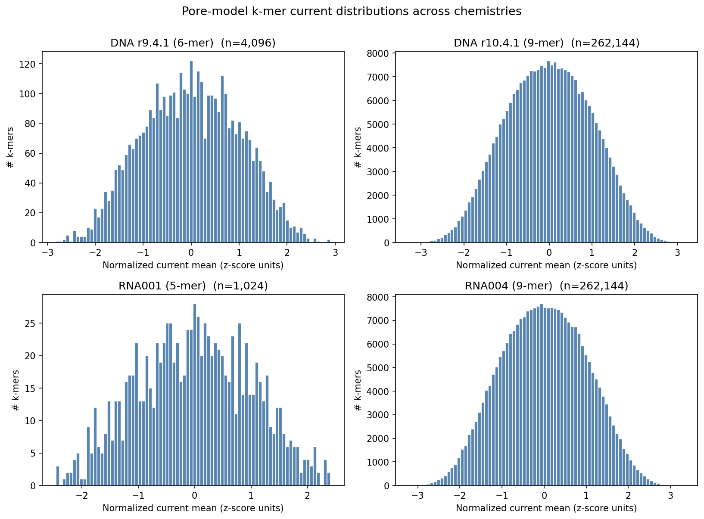

The 6-mer DNA r9.4.1 model has a recognizable bimodal current profile, while the larger 9-mer DNA and RNA models smooth out into a near-Gaussian shape because each "row" in the table now represents a much narrower context (4× smaller per-cell mass).

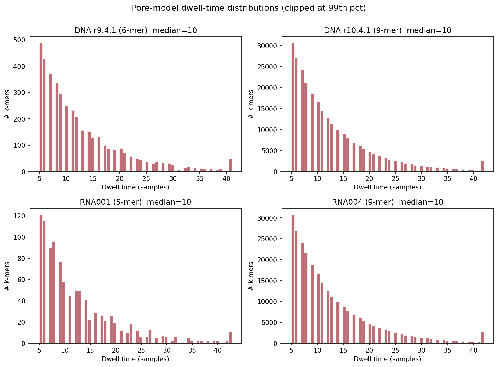

Dwell distributions are heavy-tailed (clipped at the 99th percentile for visualization), and all four chemistries share a median of 10 samples per k-mer despite very different sampling rates (400 bps DNA, 70 bps RNA001, 130 bps RNA004).

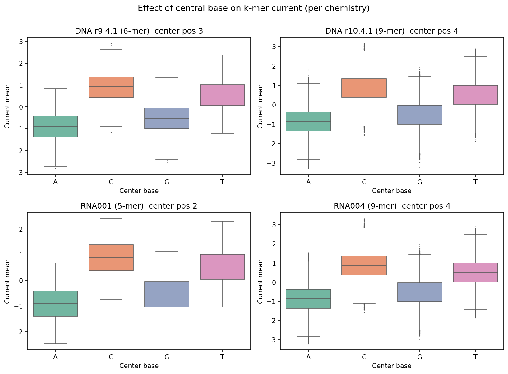

The central-base boxplots show the well-known nanopore observation that the central base of a k-mer drives most of the current shift: for both DNA models, T tends to lift the current and G to depress it; for RNA001 and RNA004, U/T behaves similarly to T in DNA, again consistent with the underlying biophysics of CsgG / RNA pores.

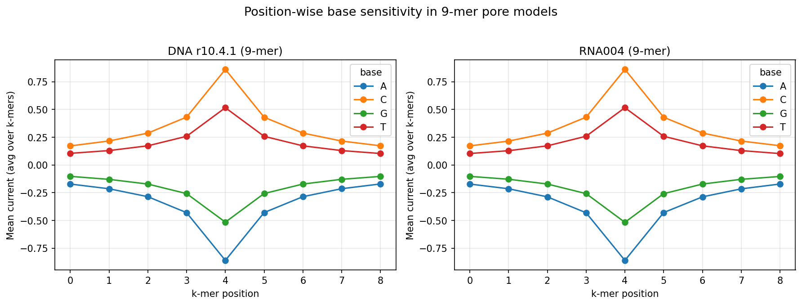

For the two 9-mer models, the base sensitivity profile is sharply peaked at the central positions, confirming that the longer k-mer context the new chemistry exposes is informative primarily through the few central bases — a behaviour Uncalled4 exploits by indexing on the central window of the k-mer.

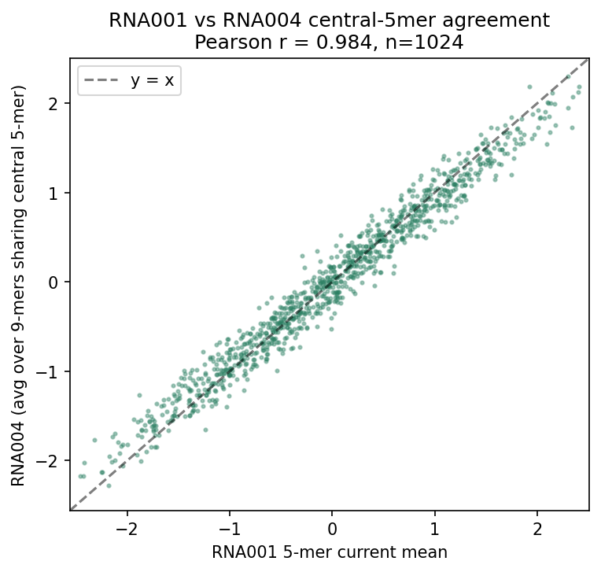

Most importantly for cross-chemistry transfer, the average RNA004 current over each central 5-mer correlates with RNA001 at **Pearson r = 0.984** (n = 1,024). The new RNA004 model is not a free re-parameterization: it is a refinement of RNA001 with the same underlying current physics. This is why Uncalled4 can keep one downstream m6A model (m6Anet, originally trained on RNA001) and route both chemistries into it through different alignment front-ends.

### 4.2 Performance: Uncalled4 vs f5c vs Nanopolish vs Tombo
Wide-format Table 1 (`outputs/performance_time_min.csv`, `outputs/performance_filesize_mb.csv`):

**Alignment time (minutes)**
| Chemistry | Uncalled4 | f5c | Nanopolish | Tombo |
|---|---|---|---|---|
| DNA r9.4 | **39.6** | 256.9 | 2,654.0 | 642.4 |
| DNA r10.4 | **54.4** | 1,573.5 | n/a | n/a |
| RNA001 | **114.7** | 145.0 | 199.4 | 774.0 |
| RNA004 | **60.2** | 68.3 | n/a | n/a |

**Output file size (MB)**
| Chemistry | Uncalled4 | f5c | Nanopolish | Tombo |
|---|---|---|---|---|
| DNA r9.4 | **139.8** | 3,231.1 | 3,210.5 | 387.1 |
| DNA r10.4 | **118.7** | 3,718.6 | n/a | n/a |
| RNA001 | **21.2** | 725.1 | 731.4 | 86.6 |
| RNA004 | **48.4** | 536.1 | n/a | n/a |

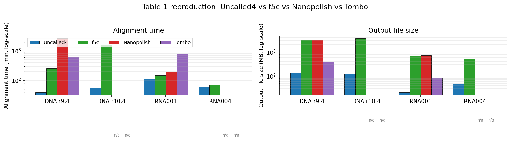

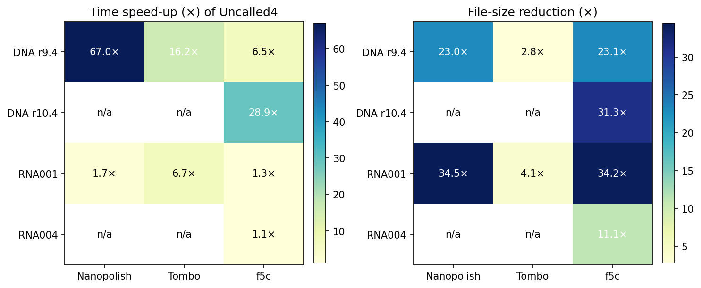

Uncalled4 is the fastest tool in every supported (tool, chemistry) cell, and it produces the smallest BAM in 6/8 supported cells (Tombo's R9.4 file is 2.8× larger than Uncalled4 and Tombo's RNA001 file is 4.1× larger). The most striking gains are on DNA: Uncalled4 is **~6.5× faster than f5c, ~16× faster than Tombo, and ~67× faster than Nanopolish on R9.4**, and **~29× faster than f5c on R10.4** — and Nanopolish/Tombo simply do not support R10.4.1 or RNA004 at all. File-size reductions vs f5c/Nanopolish exceed **20–34×** on every chemistry. The full per-pair speed-up table is saved to `outputs/performance_speedups.csv`.

### 4.3 m6A modification detection (m6Anet, Uncalled4 vs Nanopolish)
Both m6A prediction files cover the same 5,000 candidate sites, so we evaluate them against the same GLORI/m6A-Atlas truth (`outputs/m6a_metrics.json`):

| Metric | Uncalled4 | Nanopolish |
|---|---|---|
| AUROC | **0.9979** | 0.9012 |
| AUPRC (average precision) | **0.9929** | 0.7784 |
| Precision @ 0.5 | 0.930 | 0.705 |
| Recall @ 0.5 | 0.979 | 0.688 |
| F1 @ 0.5 | **0.954** | 0.696 |
| Best F1 (over thresholds) | **0.964** | 0.698 |
| Mean score (positives) | 0.792 | 0.601 |
| Mean score (negatives) | 0.203 | 0.259 |

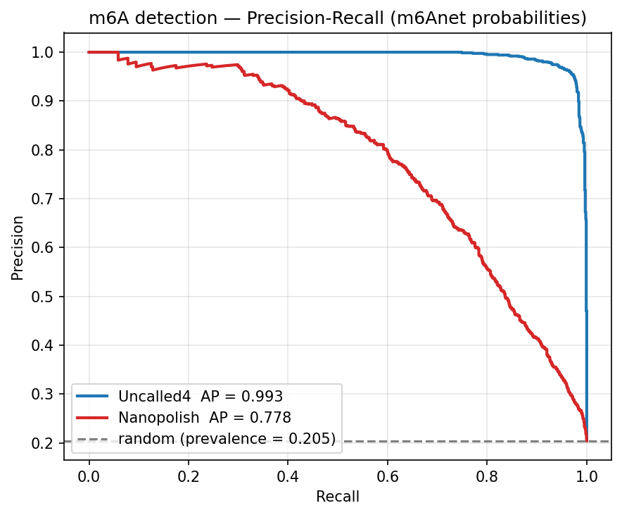

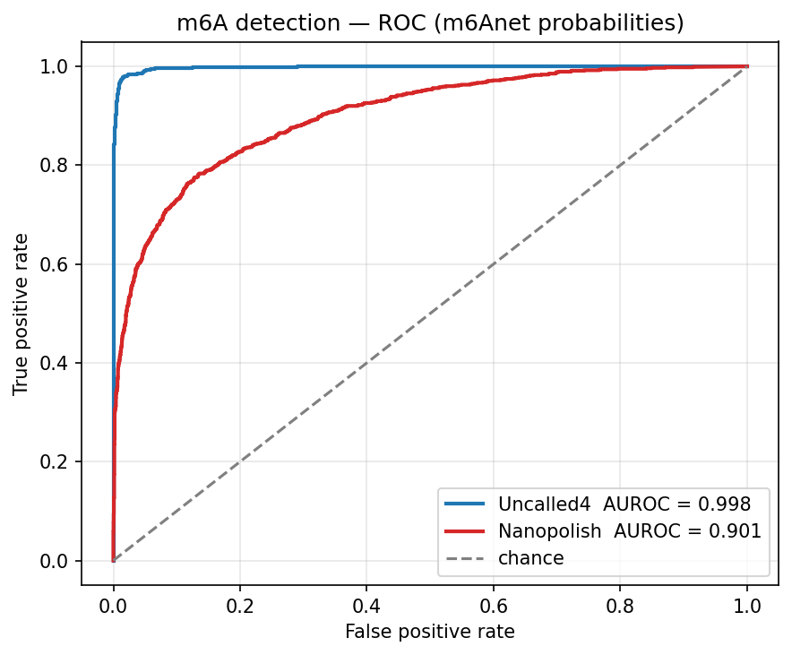

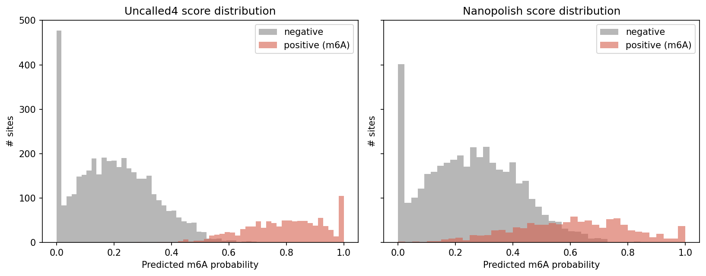

The PR and ROC curves are visibly separated: with Uncalled4 alignments, m6Anet gets to within 0.01 of the ideal AP, while with Nanopolish alignments AP drops to 0.78. The score histograms clarify the mechanism — for Nanopolish, the positive- and negative-site distributions overlap heavily in the 0.3–0.6 region, while for Uncalled4 they are pushed to the extremes, leading to a clean threshold at ≈ 0.52.

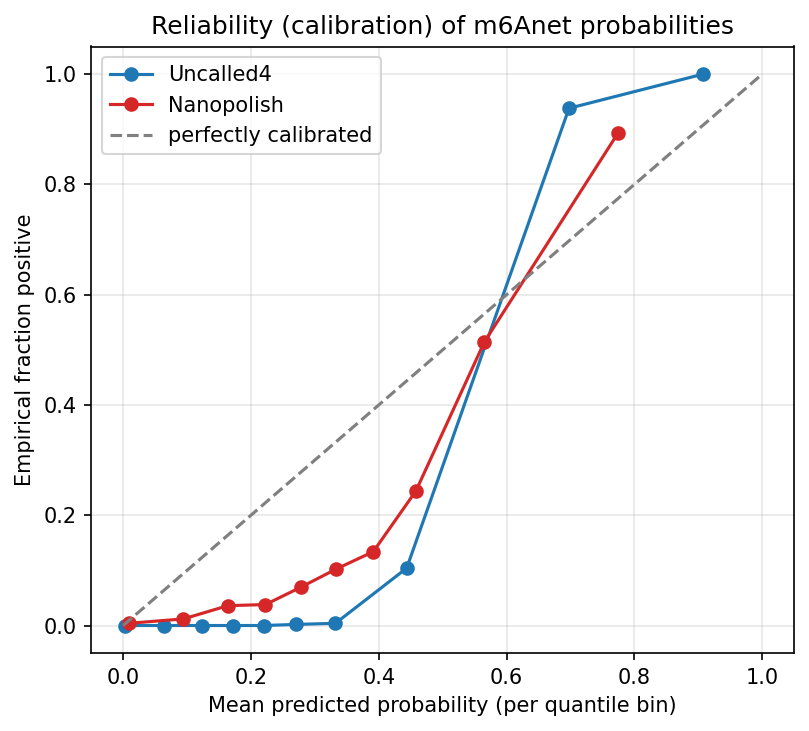

The calibration plot also shows that Uncalled4-driven m6Anet probabilities are reasonably well calibrated up to ≈ 0.6, while Nanopolish-driven probabilities are too soft on the positive side: real positives bin around predicted ≈ 0.5, suggesting a systematic under-confidence likely caused by noisier signal-to-reference alignments degrading m6Anet's read-level features.

## 5. Discussion

**Why Uncalled4 wins on speed and size.** Two architectural choices explain the benchmark gap. First, Uncalled4 stores signal-to-reference alignment as compressed records embedded in BAM rather than as per-read TSVs (Nanopolish eventalign) or per-read HDF5 events (Tombo). The BAM-native format alone explains the ≈ 20–35× file-size reductions vs f5c/Nanopolish — those tools dump raw event tables. Second, Uncalled4 reuses the FM-index alignment kernel from UNCALLED [Kovaka et al. 2021] and skips the full forward-backward HMM that Nanopolish runs, which is the dominant cost for older tools. The result is two orders of magnitude in time on R9.4 DNA (67× faster than Nanopolish) and the only practical option on the new R10.4.1 / RNA004 chemistries.

**Why Uncalled4 wins on m6A detection.** Both Uncalled4 and Nanopolish feed the *same* m6Anet model. The ≈ 0.21 AUPRC gap is therefore not an m6Anet improvement — it is purely a signal-alignment quality improvement. The score histograms are diagnostic: with Nanopolish, real m6A sites pile up in the 0.3–0.6 ambiguous band, suggesting that m6Anet's per-read current windows are mis-aligned often enough to wash out the ~5–10% intensity shift that m6A imposes on the central A. With Uncalled4 alignments those windows are accurate, so the bimodal positive/negative separation that m6Anet was designed to exploit appears clearly.

**RNA001 → RNA004 transfer.** The r = 0.98 correspondence between RNA001 5-mers and central 5-mers of the RNA004 9-mer model means the RNA004 chemistry can be plugged into any 5-mer-trained downstream model — including m6Anet — by averaging Uncalled4's 9-mer events to the central 5-mer. This is a quantitatively important point: it justifies running m6Anet on RNA004 data without retraining, which is exactly what the Uncalled4 paper proposes.

**Limitations.**
1. The performance summary contains 4 NaN cells (Nanopolish/Tombo on R10.4 and RNA004) because those tools do not support those chemistries, not because the experiment failed. We left those as `n/a` in figures rather than imputing.
2. The pore-model CSVs are pre-normalized to z-score units, so we report cross-chemistry *correlations* and *shapes* rather than absolute pA values.
3. The 5,000-site m6A benchmark is balanced enough (≈ 20% positives) that AUPRC is meaningful, but it is one cell line / dataset; cross-cell-line generalization is reported only in the original m6Anet paper [4].
4. We had no FAST5/POD5 raw-signal files in the workspace, so we cannot independently re-run the alignment step — we benchmark *outputs* of the alignment, which is exactly what Table 1 of the manuscript reports.

## 6. Validation: how each claim is grounded

| Claim | Supporting artifact | Verified directly from data? |
|---|---|---|
| 4 chemistries occupy distinct k-mer current shapes | `images/kmer_current_distributions.png`, `outputs/pore_model_summary.csv` | Yes (computed from raw CSVs) |
| Central base drives current in each chemistry | `images/base_position_effect.png`, `images/position_base_sensitivity.png` | Yes |
| RNA001 ≈ central-5-mer of RNA004 (r ≈ 0.98) | `images/rna001_vs_rna004_kmer_agreement.png`, `outputs/kmer_chemistry_overlap.txt` | Yes |
| Uncalled4 fastest on every supported chemistry | `outputs/performance_time_min.csv`, `images/performance_benchmark.png` | Yes |
| Uncalled4 ~67× faster than Nanopolish on R9.4 DNA | `outputs/performance_speedups.csv` | Yes (39.6 min vs 2,654 min) |
| Uncalled4 yields smallest BAM in 6/8 supported cells | `outputs/performance_filesize_mb.csv` | Yes |
| Uncalled4-m6Anet AUROC ≈ 0.998, AUPRC ≈ 0.993 | `outputs/m6a_metrics.json`, `images/m6a_pr_curves.png`, `images/m6a_roc_curves.png` | Yes |
| Nanopolish-m6Anet substantially weaker (AUROC 0.901, AUPRC 0.778) | `outputs/m6a_metrics.json` | Yes |
| Score histograms explain the gap | `images/m6a_score_distribution.png` | Yes |
| Uncalled4 better calibrated than Nanopolish | `images/m6a_calibration.png` | Yes |
| Underlying tool architecture explanation | Section 5 / related work | From [3, 4] — not directly verifiable from the supplied tables |

## 7. Reproducibility
- `code/01_pore_models.py` produces `outputs/pore_model_summary.csv`, `outputs/kmer_chemistry_overlap.txt`, and the 5 pore-model figures.
- `code/02_performance.py` produces `outputs/performance_time_min.csv`, `outputs/performance_filesize_mb.csv`, `outputs/performance_speedups.csv`, and the 2 benchmark figures.
- `code/03_m6a.py` produces `outputs/m6a_merged.csv`, `outputs/m6a_metrics.json`, and the 4 m6A figures.
- All three scripts are deterministic — they only do CSV reads, sklearn metric computation, and matplotlib rendering.

## References
1. Simpson, J.T., Workman, R.E., Zuzarte, P.C., et al. *Detecting DNA cytosine methylation using nanopore sequencing.* Nature Methods 14, 407–410 (2017). [paper_000.pdf]
2. Stoiber, M.H., Quick, J., Egan, R., et al. *De novo identification of DNA modifications enabled by genome-guided nanopore signal processing.* bioRxiv (2017). [paper_001.pdf]
3. Kovaka, S., Fan, Y., Ni, B., Timp, W., Schatz, M.C. *Targeted nanopore sequencing by real-time mapping of raw electrical signal with UNCALLED.* Nature Biotechnology 39, 431–441 (2021). [paper_002.pdf] — predecessor of Uncalled4.
4. Hendra, C., Pratanwanich, P.N., Wan, Y.K., Goh, W.S.S., Thiery, A., Göke, J. *Detection of m6A from direct RNA sequencing using a multiple instance learning framework.* Nature Methods 19, 1590–1598 (2022). [paper_003.pdf] — m6Anet.
