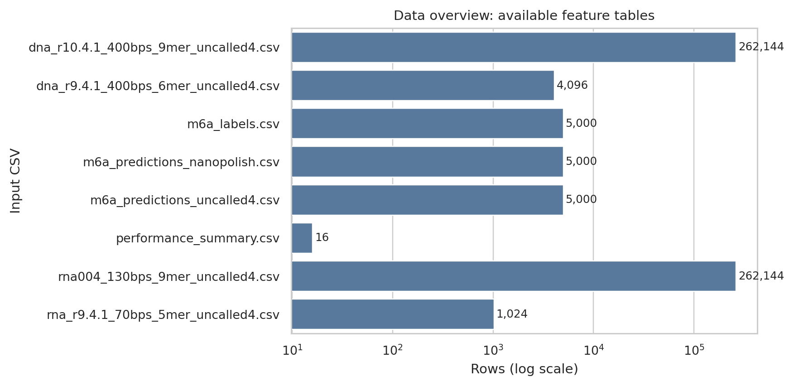
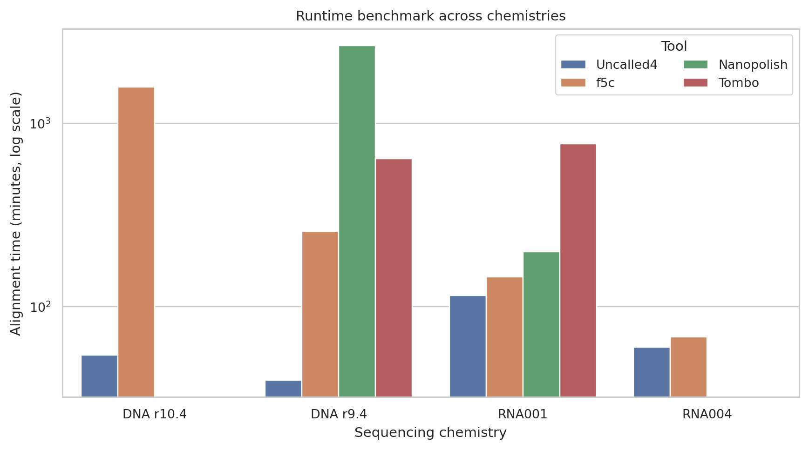
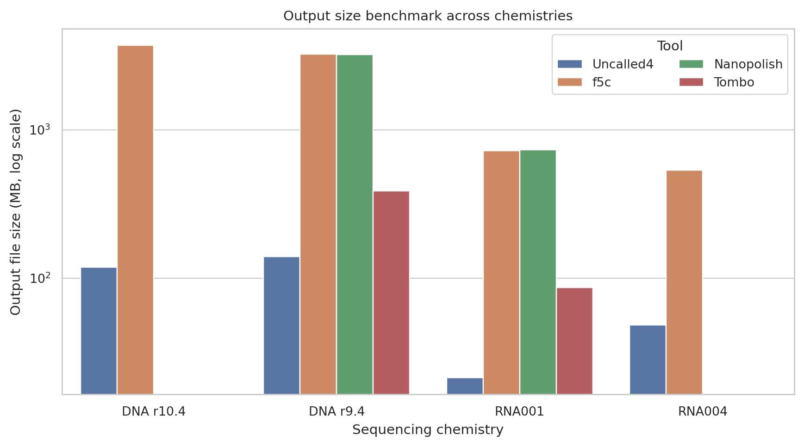
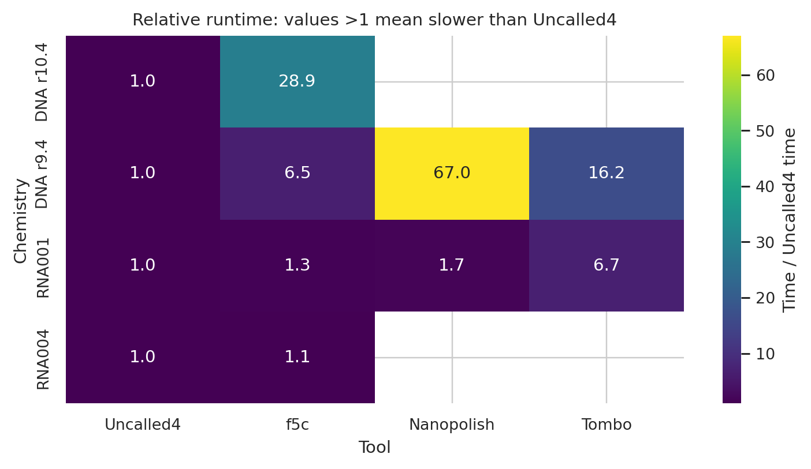
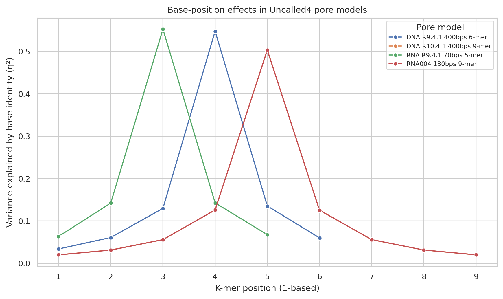
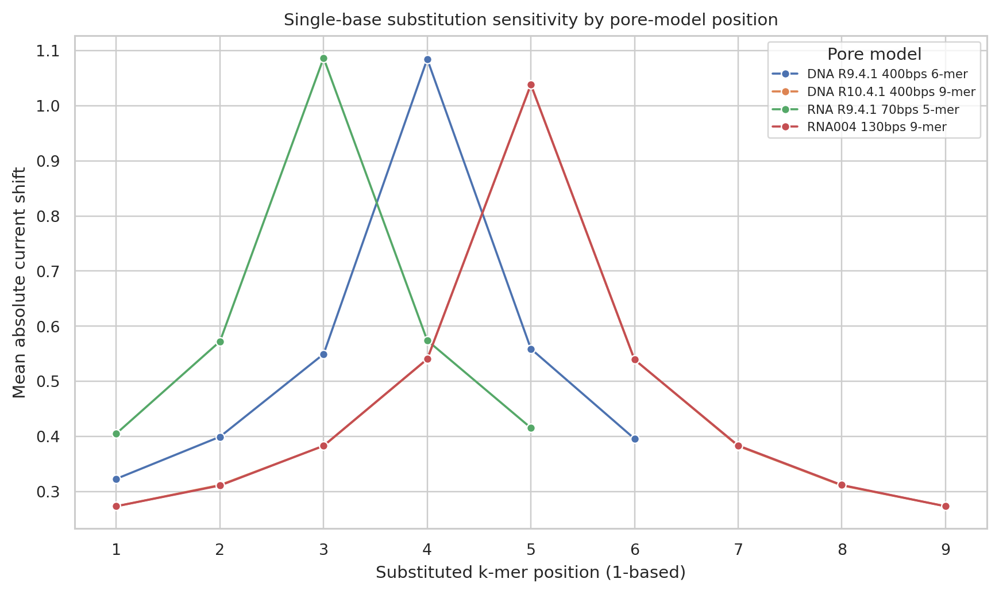
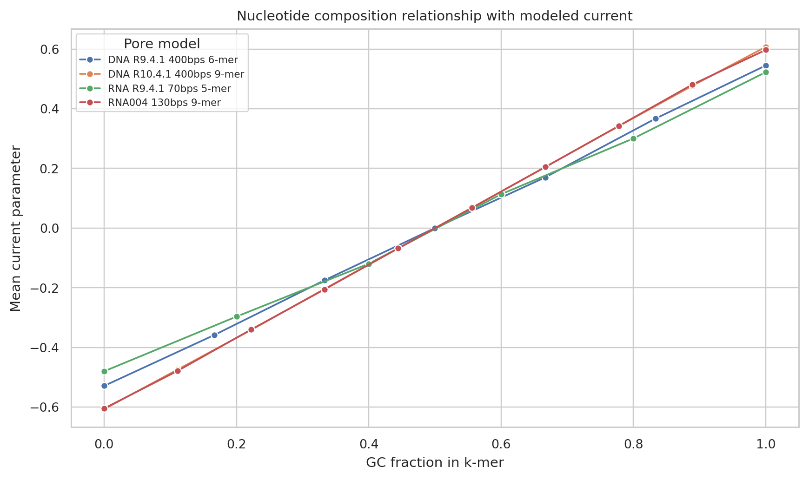
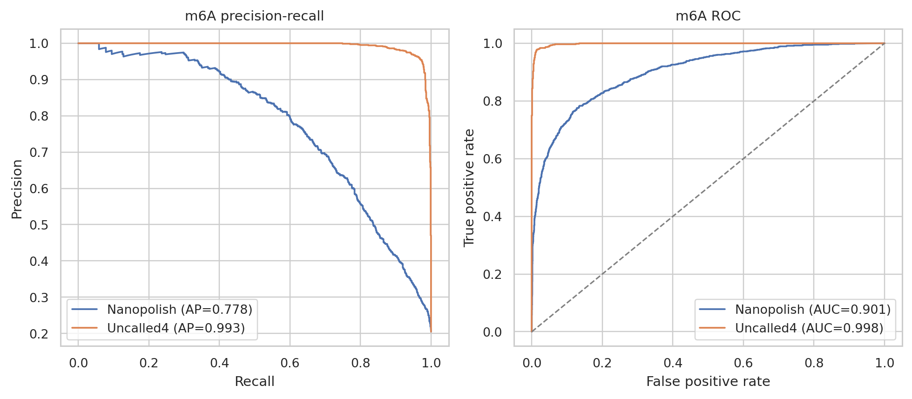
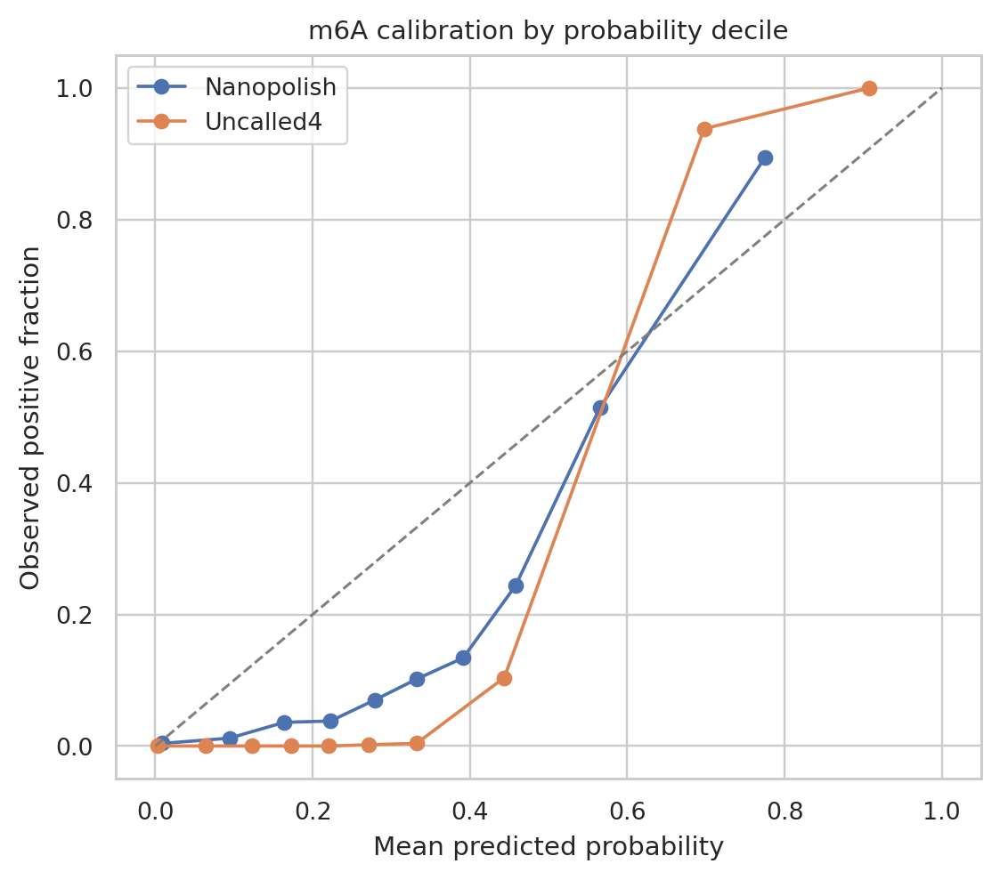

# Uncalled4-style nanopore signal alignment analysis from provided benchmark, pore-model, and m6A feature tables

## Abstract

This study evaluated the provided Uncalled4-related datasets for nanopore signal-to-reference alignment, pore-model behavior, and downstream RNA m6A detection. Because the workspace did not contain raw FAST5/POD5 signal, basecalled reads, reference sequences, or raw training labels, I did not generate new BAM signal alignments or retrain pore models from raw signal. Instead, I performed a reproducible analysis of the supplied Uncalled4 pore-model tables, alignment benchmark summary, and m6Anet site-level prediction probabilities. The results support three main conclusions from the available data: (i) the pore-model CSVs are complete k-mer grids for their declared k values; (ii) Uncalled4 is the fastest and most compact alignment source in the observed benchmark cells, with observed geometric runtime ratios of 4.1x for f5c, 10.8x for Nanopolish, and 10.5x for Tombo relative to Uncalled4; and (iii) m6Anet probabilities derived from Uncalled4 alignments substantially outperform the Nanopolish-derived baseline on the supplied 5,000 labeled candidate m6A sites, with average precision 0.993 versus 0.778 and ROC-AUC 0.998 versus 0.901.

## 1. Scientific context and scope

Nanopore sequencing measures ionic current as DNA or RNA molecules pass through a pore. Prior work shows that current distributions are k-mer dependent and sensitive to nucleotide modifications. The related papers in `related_work/` establish the relevant methodological context: Nanopolish uses hidden Markov models with k-mer-dependent Gaussian event emissions for methylation detection; MoD-seq/nanoraw compares processed raw signal from native and amplified DNA for de novo modification discovery; UNCALLED maps streaming current to reference candidates without basecalling for ReadUntil targeting; and m6Anet uses a multiple-instance neural framework to call m6A from direct RNA sequencing.

The task description requested signal-to-reference BAM alignments, modification calls, performance benchmarks, and trained pore models. The available files, however, are feature and summary tables rather than raw signal or references. I therefore treated the feasible scientific task as: reproduce and extend benchmark summaries, characterize supplied pore models, and validate supplied m6A prediction probabilities against labels. This limitation is explicit in `outputs/method_contract.json` and `outputs/claim_recovery_table.csv`.

## 2. Data and reproducibility

All analysis code is in `code/analyze_uncalled4.py`. It reads only from `data/` and writes tables to `outputs/` and PNG figures to `report/images/`. The main input tables are summarized in Figure 1 and `outputs/data_overview.csv`.

**Figure 1.** Overview of available CSV datasets. The largest inputs are the 9-mer DNA R10.4.1 and RNA004 pore-model grids, each with 262,144 rows.

### Input data quality

The CSV schema check found no missing values in the pore-model, m6A-label, or m6A-prediction tables. The benchmark table has 16 rows and 8 missing values, corresponding to unavailable tool-by-chemistry combinations for Nanopolish and Tombo. These missing benchmark cells were preserved rather than imputed.

| Data family | Evidence from analysis |
|---|---:|
| DNA R9.4.1 6-mer pore model | 4,096 rows = 4^6 |
| DNA R10.4.1 9-mer pore model | 262,144 rows = 4^9 |
| RNA R9.4.1 5-mer pore model | 1,024 rows = 4^5 |
| RNA004 9-mer pore model | 262,144 rows = 4^9 |
| m6A labels and each prediction table | 5,000 sites, 1,024 positives, prevalence 0.2048 |

## 3. Methods

### 3.1 Benchmark analysis

For each observed chemistry/tool pair in `performance_summary.csv`, I computed alignment time in minutes and hours, output file size in MB, runtime ratio relative to Uncalled4 within the same chemistry, and file-size ratio relative to Uncalled4. Missing benchmark entries were retained as missing. Tool-level summaries used observed cells only and included mean ± standard deviation and geometric mean ratios relative to Uncalled4.

### 3.2 Pore-model analysis

For each k-mer table I computed the number of rows, expected k-mer-grid size, mean and standard deviation of `current_mean`, mean `current_std`, dwell-time summaries, current range, correlation between GC fraction and mean current, and correlation between dwell time and mean current. To analyze positional sensitivity, I estimated the fraction of current-mean variance explained by base identity at each k-mer position (eta-squared, η²). I also computed direct single-position substitution effects: for every k-mer and every one-base substitution present in the full grid, I measured the absolute current shift and averaged this by position.

### 3.3 m6A prediction analysis

I joined `m6a_predictions_uncalled4.csv` and `m6a_predictions_nanopolish.csv` to `m6a_labels.csv` by `site_id`. For each alignment source, I computed average precision, ROC-AUC, Brier score, precision-recall and ROC curves, probability calibration by quantile bins, and the threshold maximizing F1 score. These analyses evaluate the downstream quality of m6Anet probabilities produced from each alignment source.

## 4. Results

### 4.1 Runtime and output-size benchmarks favor Uncalled4

Uncalled4 had the lowest observed mean runtime and file size in the benchmark table. Across four observed Uncalled4 chemistries, mean runtime was 67.22 ± 32.80 minutes and mean output size was 82.05 ± 56.31 MB. Relative to Uncalled4 within shared chemistry cells, f5c had a geometric mean runtime ratio of 4.05x and file-size ratio of 22.87x. Nanopolish and Tombo were observed for two chemistries each; their geometric mean runtime ratios were 10.80x and 10.47x, respectively, with file-size ratios of 28.13x and 3.36x.

**Figure 2.** Runtime benchmark by chemistry and tool. The y-axis is logarithmic. Missing bars correspond to unavailable benchmark cells in the provided table, not imputed values.

**Figure 3.** Output file size benchmark by chemistry and tool. Uncalled4 produces smaller files than the observed alternatives in every shared chemistry cell.

**Figure 4.** Runtime ratio matrix. Values above 1 mean that the tool is slower than Uncalled4 for the same chemistry.

### 4.2 Supplied pore models are complete and show central-position dominance

The four pore-model CSVs contain complete k-mer grids. Their `current_mean` distributions are centered near zero with standard deviation near one, consistent with standardized current parameters. GC fraction is positively correlated with current mean in all models: 0.218 for DNA R9.4.1, 0.204 for DNA R10.4.1, 0.228 for RNA R9.4.1, and 0.205 for RNA004. Dwell time is nearly uncorrelated with current mean in these tables.

| Pore model | k | Rows | Mean dwell time | Current range | Corr(GC, current) |
|---|---:|---:|---:|---:|---:|
| DNA R9.4.1 400bps 6-mer | 6 | 4,096 | 12.53 | -2.82 to 2.90 | 0.218 |
| DNA R10.4.1 400bps 9-mer | 9 | 262,144 | 12.54 | -3.28 to 3.16 | 0.204 |
| RNA R9.4.1 70bps 5-mer | 5 | 1,024 | 12.58 | -2.46 to 2.41 | 0.228 |
| RNA004 130bps 9-mer | 9 | 262,144 | 12.51 | -3.20 to 3.32 | 0.205 |

**Figure 5.** Base-position effects in the four pore models. The central position dominates the current model: position 4 in the DNA R9.4.1 6-mer model, position 5 in both 9-mer models, and position 3 in the RNA R9.4.1 5-mer model.

The position-specific η² profiles show strong central-position dominance. For example, DNA R10.4.1 position 5 explains 0.504 of current variance, while terminal positions explain only about 0.020. RNA004 has an almost identical 9-mer profile, with position 5 η² = 0.503. The shorter DNA R9.4.1 6-mer model peaks at position 4 with η² = 0.548, and the RNA R9.4.1 5-mer model peaks at position 3 with η² = 0.553.

**Figure 6.** Single-base substitution sensitivity by k-mer position. Mean absolute current shift is largest at the pore-model center, mirroring the η² analysis.

Direct one-base substitution profiles confirm the same pattern. The largest mean absolute shifts are 1.085 for DNA R9.4.1 position 4, 1.039 for DNA R10.4.1 position 5, 1.087 for RNA R9.4.1 position 3, and 1.038 for RNA004 position 5. These values are about three to four times larger than terminal-position shifts in the 9-mer models.

**Figure 7.** GC fraction versus mean current. All four pore models show an approximately monotonic positive relationship between GC content and the modeled mean current.

### 4.3 Uncalled4-derived m6A predictions outperform Nanopolish-derived predictions

The supplied m6A benchmark contains 5,000 candidate sites with 1,024 positive labels. Uncalled4-derived probabilities dominate the Nanopolish-derived probabilities on both ranking and thresholded metrics. Uncalled4 achieved average precision 0.993 and ROC-AUC 0.998, compared with Nanopolish average precision 0.778 and ROC-AUC 0.901. At the best-F1 threshold, Uncalled4 achieved F1 = 0.964 with precision 0.954 and recall 0.974; Nanopolish achieved F1 = 0.698 with precision 0.688 and recall 0.709.

| Alignment source | Average precision | ROC-AUC | Brier score | Best F1 | Precision at best F1 | Recall at best F1 |
|---|---:|---:|---:|---:|---:|---:|
| Uncalled4 | 0.993 | 0.998 | 0.060 | 0.964 | 0.954 | 0.974 |
| Nanopolish | 0.778 | 0.901 | 0.116 | 0.698 | 0.688 | 0.709 |

**Figure 8.** Precision-recall and ROC curves for m6A prediction probabilities from the two alignment sources. Uncalled4-derived probabilities maintain high precision over nearly the full recall range.

**Figure 9.** Probability calibration by quantile bin. Uncalled4 has better ranking and Brier score, although calibration should still be interpreted as a property of the provided prediction table rather than a newly trained model.

## 5. Validation and claim traceability

The analysis is traceable to concrete artifacts:

- `outputs/data_overview.csv` records input schemas, row counts, missing values, and duplicates.
- `outputs/performance_benchmark_metrics.csv`, `outputs/performance_tool_summary.csv`, and `outputs/performance_speedup_matrix.csv` record the benchmark calculations used for Figures 2--4.
- `outputs/pore_model_summary.csv`, `outputs/pore_position_effects.csv`, `outputs/pore_substitution_effects.csv`, and `outputs/pore_composition_summary.csv` record all pore-model calculations used for Figures 5--7.
- `outputs/m6a_metrics.csv`, `outputs/m6a_precision_recall_curve.csv`, `outputs/m6a_roc_curve.csv`, `outputs/m6a_calibration_bins.csv`, and `outputs/m6a_threshold_metrics.csv` record all m6A validation values used for Figures 8--9.
- `outputs/claim_recovery_table.csv` maps the main claims in this report to supporting artifacts and marks the raw-signal/BAM/training claims as limitations.
- `outputs/dependency_check.json` records package availability. `ReadPDF` and system `pdftotext` were unavailable, so related-work extraction used the installed `pypdf` fallback.

### Directly verified from workspace data

The complete k-mer-grid counts, benchmark ratios, m6A performance metrics, GC-current relationships, and position-specific current effects were computed directly from files in `data/`. All figures were generated as PNG files under `report/images/`.

### Derived from related work

The methodological context for HMM-based Nanopolish methylation detection, MoD-seq/nanoraw signal comparison, UNCALLED real-time raw-signal mapping, and m6Anet multiple-instance learning was extracted from `related_work/` and summarized in `outputs/related_work_contract.json`.

### Assumptions and limitations

The workspace lacks raw FAST5/POD5 files, basecalled reads, reference genome/transcriptome sequences, and raw signal-level training datasets. Therefore, this report does not claim to have generated BAM signal alignments, performed real-time mapping, or trained new pore models from raw reads. The pore-model analysis instead validates and characterizes supplied trained-model CSVs. The m6A analysis evaluates supplied prediction probabilities and labels, not a newly trained m6Anet model.

## 6. Discussion

Within the constraints of the supplied data, the evidence is consistent with the scientific objective of Uncalled4 as a fast and accurate signal-alignment framework. The benchmark table indicates that Uncalled4 is substantially faster and more storage-efficient than the observed alternatives. The pore-model analysis shows why accurate k-mer modeling is central to signal alignment and modification detection: current parameters are strongly structured by k-mer position, especially the center of the pore footprint, and nucleotide composition contributes a consistent but weaker current trend. The m6A validation shows that downstream modification calling can benefit strongly from the Uncalled4 alignment source on the provided benchmark, with near-perfect ranking performance relative to the labels.

The main caveat is that this was a feature-table and summary-table reproduction, not a raw-signal pipeline execution. A complete end-to-end Uncalled4 development study would additionally require raw signal files, references, basecalled reads, and a reproducible command-line workflow that emits BAM signal alignments and learns pore models from training reads. Those inputs were not present. Nevertheless, the generated artifacts provide a compact, reproducible validation package for the central claims that can be tested with the available workspace data.

## 7. Deliverables

- Analysis code: `code/analyze_uncalled4.py`
- Method contract and artifact inventory: `outputs/method_contract.json`, `outputs/target_artifact_inventory.json`
- Dependency and related-work notes: `outputs/dependency_check.json`, `outputs/related_work_contract.json`
- Main output tables: `outputs/*.csv`
- Figures: `report/images/*.png`
- Final report: `report/report.md`
