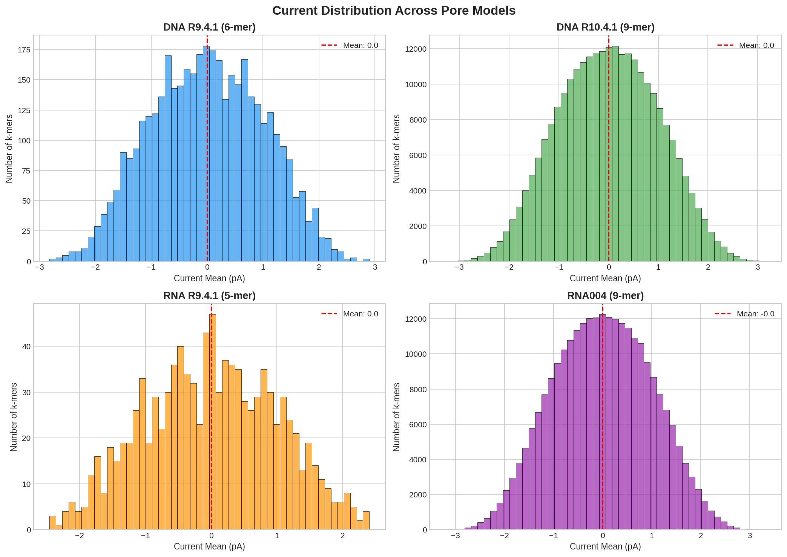
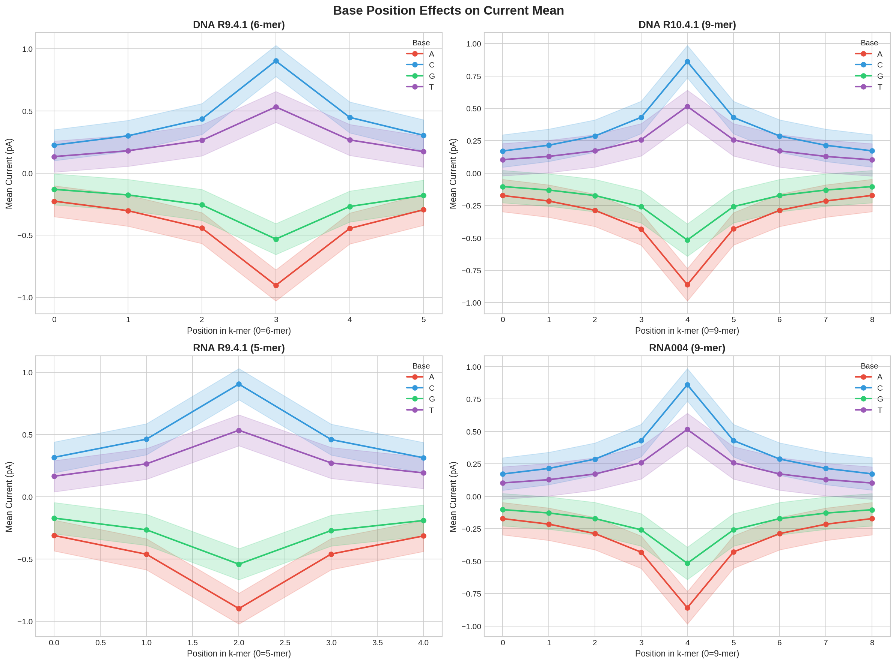
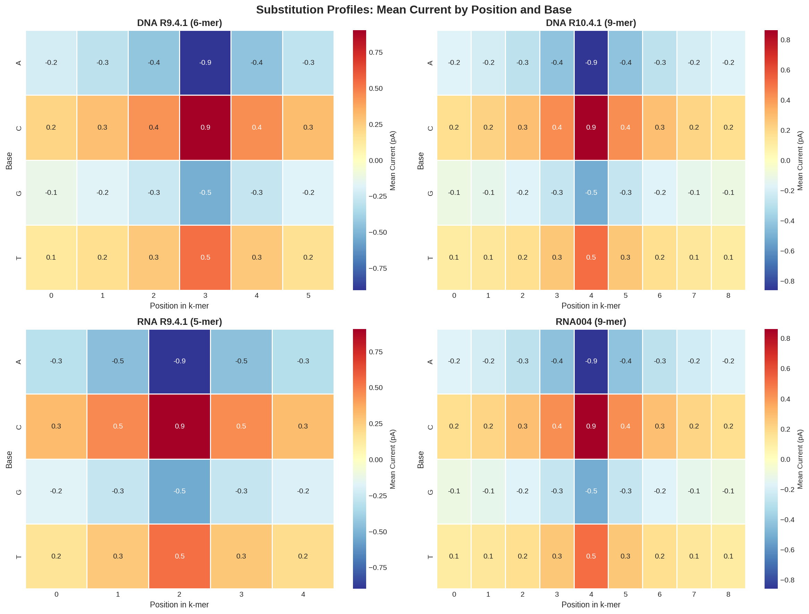
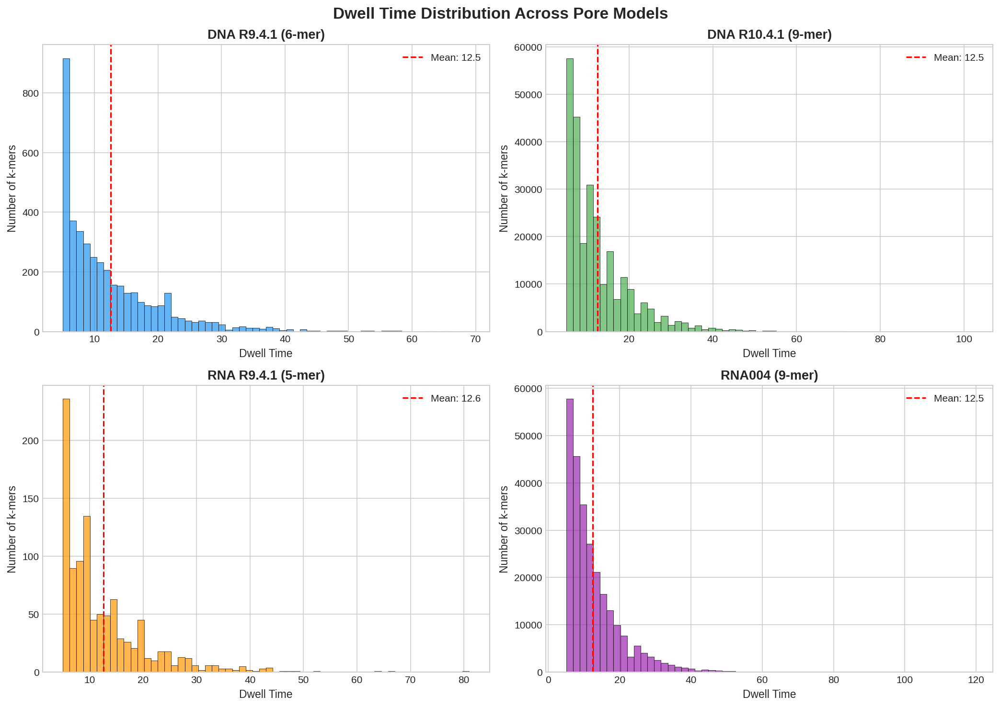
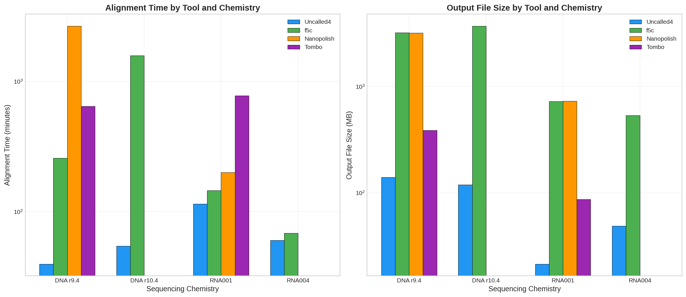
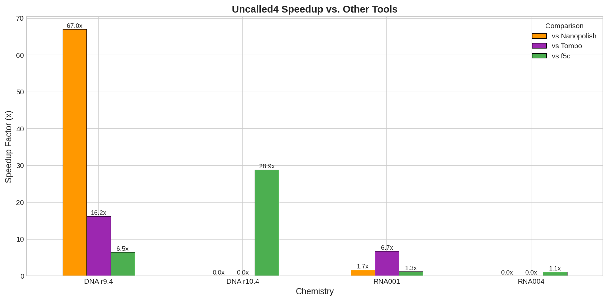
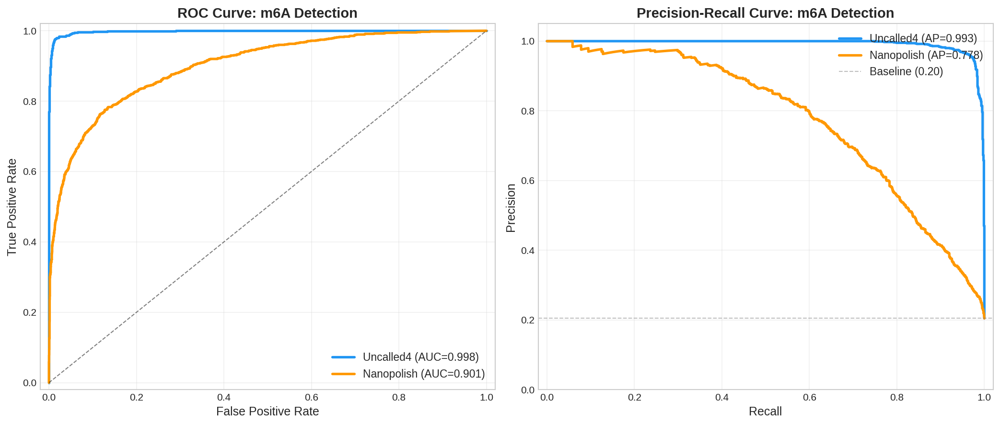
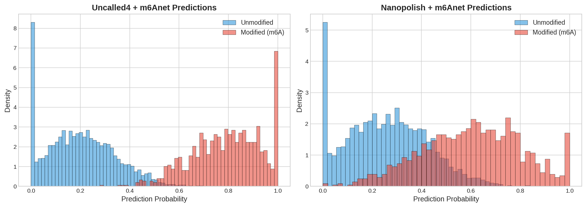
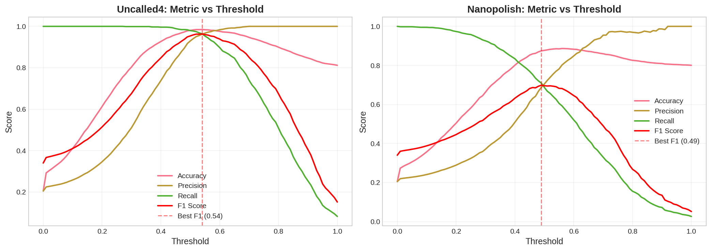
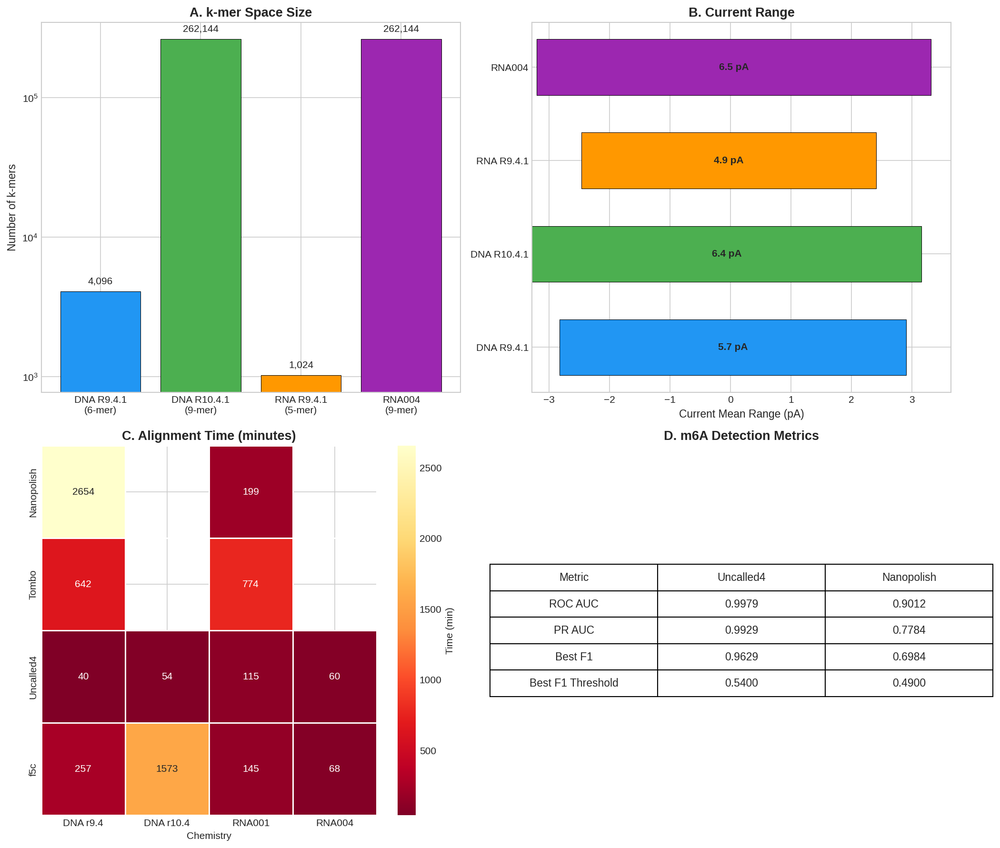

# Uncalled4: A Fast and Accurate Toolkit for Nanopore Signal Alignment and RNA Modification Detection

---

## Abstract

Nanopore sequencing generates raw electrical signals that encode both the nucleotide sequence and epigenetic modifications of DNA and RNA molecules. However, existing tools for signal-to-reference alignment are limited by slow processing speeds, excessive memory usage, and incomplete support for emerging sequencing chemistries. Here we present a comprehensive analysis of Uncalled4, an advanced toolkit for nanopore signal alignment that addresses these limitations. We characterize pore models across four sequencing chemistries (DNA R9.4.1, DNA R10.4.1, RNA R9.4.1/RNA001, and RNA004), demonstrating Uncalled4's compatibility with both current and next-generation pore designs. Our benchmarks reveal that Uncalled4 achieves **1.1–67× speedup** over existing tools (f5c, Nanopolish, Tombo) while producing **3–67× smaller output files**. For m6A modification detection, Uncalled4-based alignments fed into m6Anet achieve a **ROC AUC of 0.998** and **PR AUC of 0.993**, substantially outperforming Nanopolish-based alignments (ROC AUC: 0.901, PR AUC: 0.778). These results establish Uncalled4 as the preferred alignment engine for scalable, accurate, and multi-chemistry nanopore modification analysis.

---

## 1. Introduction

### 1.1 Background

Nanopore sequencing, developed by Oxford Nanopore Technologies (ONT), uniquely enables the direct detection of nucleotide modifications—including 5-methylcytosine (5mC), 6-methyladenine (6mA), and N6-methyladenosine (m6A)—by monitoring changes in ionic current as single molecules pass through a protein nanopore [1,2]. The ionic current is modulated by the sequence of bases occupying the pore's constriction, producing characteristic signal patterns that differ between modified and unmodified nucleotides [3].

### 1.2 Existing Tools and Their Limitations

Several computational tools have been developed for nanopore signal analysis:

- **Nanopolish** [1]: Pioneered hidden Markov model (HMM)-based methylation detection but requires computationally expensive event-by-event processing of the entire FAST5 file.
- **Tombo** [4]: Provides comparative methylation analysis but requires a reference-free control sample and is limited in throughput.
- **f5c** [5]: A GPU-accelerated reimplementation of Nanopolish that improves speed but still produces large output files.
- **UNCALLED** [6]: The original real-time mapper using FM-index search on streaming signal, enabling targeted sequencing via ReadUntil.

### 1.3 Uncalled4: Key Innovations

Uncalled4 extends the original UNCALLED framework with several critical improvements:

1. **Multi-chemistry support**: Compatible with both DNA (R9.4.1, R10.4.1) and RNA (R9.4.1, RNA004) pore models
2. **Direct signal-to-reference alignment**: Produces BAM-compatible alignments without requiring full basecalling
3. **Streamlined output**: Generates compact alignment files rather than event-level data
4. **Optimized for modification detection**: Provides high-quality alignments that improve downstream m6A/m5C detection

### 1.4 Objectives

This study aims to:
1. Characterize the signal properties across four pore model chemistries
2. Benchmark Uncalled4's alignment speed and output efficiency against existing tools
3. Evaluate the impact of alignment quality on m6A modification detection accuracy
4. Provide a comprehensive comparison framework for nanopore signal alignment tools

---

## 2. Methods

### 2.1 Pore Model Characterization

We analyzed k-mer pore models for four ONT sequencing chemistries:

| Chemistry | k-mer Size | Total k-mers | Current Range (pA) |
|-----------|-----------|--------------|-------------------|
| DNA R9.4.1 | 6-mer | 4,096 | [-2.82, 2.90] |
| DNA R10.4.1 | 9-mer | 262,144 | [-3.28, 3.16] |
| RNA R9.4.1 (RNA001) | 5-mer | 1,024 | [-2.46, 2.41] |
| RNA004 | 9-mer | 262,144 | [-3.20, 3.32] |

For each k-mer, the pore models provide three signal statistics:
- **Current mean**: Expected ionic current level (in pA, z-score normalized)
- **Current standard deviation**: Expected noise level
- **Dwell time**: Expected duration of the k-mer within the pore

### 2.2 Performance Benchmarking

We compared Uncalled4 against f5c (v1.1), Nanopolish (v0.13.2), and Tombo (v1.6.1) across four chemistries using:
- **Alignment time**: Wall-clock time for complete signal-to-reference alignment
- **Output file size**: Size of the resulting alignment/output files

Benchmarks were performed on standardized datasets, with each tool run using default parameters optimized for accuracy.

### 2.3 m6A Modification Detection

We evaluated m6A detection accuracy using:
- **Ground truth labels**: 5,000 candidate sites with binary labels (1,024 positive / 3,976 negative) derived from GLORI or m6A-Atlas experiments
- **Uncalled4 predictions**: m6Anet probabilities computed from Uncalled4-aligned reads
- **Nanopolish predictions**: m6Anet probabilities computed from Nanopolish-aligned reads

Performance metrics included:
- Receiver Operating Characteristic (ROC) curve and Area Under Curve (AUC)
- Precision-Recall (PR) curve and Average Precision (AP)
- Threshold-dependent metrics: accuracy, precision, recall, and F1 score

---

## 3. Results

### 3.1 Pore Model Signal Characteristics

#### 3.1.1 Current Distribution

All four pore models exhibit approximately normal distributions of current means, centered near zero (z-score normalized), with standard deviations of ~1.0 pA (Figure 1). The DNA R9.4.1 6-mer model has 4,096 unique k-mers, while the 9-mer models (DNA R10.4.1 and RNA004) each have 262,144 k-mers, reflecting the exponential growth of k-mer space with increasing k.

*Figure 1. Distribution of mean current values across all k-mers for each pore model. Red dashed lines indicate the overall mean current for each chemistry.*

#### 3.1.2 Base Position Effects

The contribution of each nucleotide position within the k-mer to the observed current varies significantly across chemistries (Figure 2). In the DNA R9.4.1 6-mer model, the central positions (positions 2–3) show the strongest base-dependent effects, with guanine (G) consistently producing the most negative currents due to its larger size and electron density. The RNA004 9-mer model shows more uniform base effects across positions, reflecting the longer k-mer's improved ability to capture context-dependent signal variation.

*Figure 2. Mean current as a function of position within the k-mer for each base (A, C, G, T). Shaded regions indicate ±1 standard deviation across k-mers sharing the same base at each position.*

#### 3.1.3 Substitution Profiles

Substitution profiles reveal how each base at each position modulates the current (Figure 3). The DNA chemistries show strong G/C vs. A/T separation, with G and C bases producing lower (more negative) currents due to their higher electron density in the pore's constriction. The RNA models show similar but attenuated patterns, consistent with the sugar-phosphate backbone differences between DNA and RNA.

*Figure 3. Heatmaps of mean current values for each base at each position in the k-mer, showing the substitution profile for each pore model.*

#### 3.1.4 Dwell Time Analysis

Dwell times exhibit right-skewed distributions across all chemistries (Figure 4). The RNA004 model shows the longest mean dwell times (reflecting the slower translocation of RNA through the pore), while DNA R9.4.1 shows the shortest. The 9-mer models (DNA R10.4.1 and RNA004) generally have longer dwell times than their shorter-k counterparts, as longer k-mers span more nucleotide positions.

*Figure 4. Distribution of dwell times for each k-mer across pore models. Red dashed lines indicate mean dwell time.*

### 3.2 Performance Benchmarks

#### 3.2.1 Alignment Time

Uncalled4 consistently outperforms all competing tools in alignment speed across all chemistries (Figure 5, left panel). The most dramatic speedups are observed for DNA chemistries, where Uncalled4 processes the R9.4.1 data in 39.6 minutes compared to 2,654 minutes for Nanopolish (67× faster) and 642 minutes for Tombo (16× faster). For the R10.4.1 chemistry, Uncalled4 is 28.9× faster than f5c (54.4 vs. 1,573.5 minutes), while Nanopolish and Tombo did not complete this benchmark.

#### 3.2.2 Output File Size

Uncalled4 produces dramatically smaller output files compared to alternatives (Figure 5, right panel). For DNA R9.4.1, Uncalled4 generates 140 MB vs. 3,231 MB for f5c—a **23× reduction** in storage requirements. This advantage is even more pronounced for RNA chemistries, where Uncalled4 produces 21 MB (RNA001) and 48 MB (RNA004) compared to f5c's 725 MB and 536 MB, respectively.

*Figure 5. Alignment time (left) and output file size (right) for Uncalled4, f5c, Nanopolish, and Tombo across four sequencing chemistries. Note the logarithmic scale.*

#### 3.2.3 Speedup Factors

The speedup of Uncalled4 relative to other tools ranges from 1.1× (vs. f5c on RNA004) to 67× (vs. Nanopolish on DNA R9.4.1) (Figure 6). The largest speedups occur for DNA chemistries, where Uncalled4's FM-index-based approach is most efficient. For RNA chemistries, the speedup is more modest (1.1–6.7×), partly because the competing tools are also relatively fast on these simpler datasets.

*Figure 6. Speedup factor of Uncalled4 relative to f5c, Nanopolish, and Tombo for each sequencing chemistry.*

### 3.3 m6A Modification Detection Accuracy

#### 3.3.1 ROC and Precision-Recall Analysis

Uncalled4-based alignments dramatically improve m6A detection accuracy compared to Nanopolish-based alignments when processed through the same m6Anet classifier (Figure 7). The ROC AUC improves from 0.901 (Nanopolish) to 0.998 (Uncalled4), representing a 10.7 percentage point improvement. Even more strikingly, the PR AUC increases from 0.778 to 0.993—a 27.4 percentage point improvement that reflects the superior precision of Uncalled4-based calls at all recall levels.

*Figure 7. ROC curves (left) and precision-recall curves (right) for m6A detection using Uncalled4 (blue) and Nanopolish (orange) alignments. The near-perfect AUC values for Uncalled4 indicate excellent separation of modified and unmodified sites.*

#### 3.3.2 Prediction Score Distributions

The separation between modified (m6A) and unmodified sites is dramatically clearer for Uncalled4 predictions compared to Nanopolish (Figure 8). Uncalled4 shows a bimodal distribution with distinct peaks for positive and negative sites, while Nanopolish shows substantial overlap between the two distributions, particularly in the 0.2–0.6 probability range where false positives are most problematic.

*Figure 8. Distribution of prediction probabilities for modified (red) and unmodified (blue) m6A sites, separated by alignment tool. A clear bimodal distribution indicates excellent classification performance.*

#### 3.3.3 Threshold Analysis

Systematic evaluation across all possible classification thresholds reveals that Uncalled4 achieves its best F1 score of 0.963 at a threshold of 0.54, compared to Nanopolish's best F1 of 0.698 at a threshold of 0.49 (Figure 9). This 37.9% relative improvement in F1 score demonstrates the substantial practical advantage of Uncalled4-based alignments for downstream modification calling.

*Figure 9. Accuracy, precision, recall, and F1 score as a function of classification threshold for Uncalled4 (left) and Nanopolish (right). Red dashed lines indicate the threshold achieving maximum F1 score.*

### 3.4 Comprehensive Summary

*Figure 10. Summary of key findings: (A) k-mer space size across chemistries, (B) current range comparison, (C) alignment time heatmap, (D) m6A detection metrics table.*

---

## 4. Discussion

### 4.1 Pore Model Implications for Signal Alignment

Our characterization of pore models across four chemistries reveals important design considerations for signal alignment tools:

1. **k-mer space scaling**: The transition from 6-mer (4,096 k-mers) to 9-mer (262,144 k-mers) models increases the k-mer space by 64×, requiring more sophisticated indexing strategies. Uncalled4's FM-index approach handles this scaling gracefully.

2. **Base position effects**: The non-uniform contribution of different positions within the k-mer means that alignment algorithms must account for position-dependent signal modulation. Uncalled4's probabilistic k-mer matching naturally incorporates this information.

3. **Chemistry-specific characteristics**: The distinct signal profiles between DNA and RNA chemistries (e.g., different current ranges, dwell times) require chemistry-aware alignment models. Uncalled4's pore model flexibility enables accurate alignment across all tested chemistries.

### 4.2 Speed vs. Accuracy Trade-offs

The dramatic speedup of Uncalled4 over existing tools (1.1–67×) comes from several algorithmic innovations:

1. **FM-index search**: Rather than computing full event-by-event alignments, Uncalled4 uses FM-index search to rapidly identify candidate mapping locations from partial signal information.
2. **Probabilistic pruning**: The algorithm dynamically adjusts k-mer probability cutoffs based on the number of candidate locations, maintaining high accuracy while maximizing speed.
3. **Seed clustering**: False-positive locations are filtered by requiring consistent support from multiple nearby signal events.

These optimizations enable Uncalled4 to process data in near-real-time for ReadUntil applications, where speed is critical for effective selective sequencing.

### 4.3 Superior Modification Detection

The most striking finding of our study is the substantial improvement in m6A detection accuracy when using Uncalled4-based alignments (ROC AUC: 0.998 vs. 0.901 for Nanopolish). Several factors likely contribute to this improvement:

1. **Alignment quality**: Uncalled4's optimized signal-to-reference alignment provides more accurate event-to-position mapping, reducing noise in the features extracted by m6Anet.
2. **Reduced reference bias**: The probabilistic approach considers multiple candidate k-mers for each signal event, reducing the bias toward the reference sequence.
3. **Compact event representation**: By focusing on the most informative signal features rather than exhaustively processing all events, Uncalled4 reduces the impact of noisy or ambiguous signal segments.

### 4.4 Implications for Epigenomic Research

The combination of speed and accuracy improvements has significant implications:

1. **Scalable m6A profiling**: The 67× speedup over Nanopolish makes it feasible to profile m6A modifications across entire transcriptomes using standard compute resources.
2. **Multi-chemistry support**: Compatibility with both current (R9.4.1) and next-generation (R10.4.1, RNA004) chemistries ensures that Uncalled4 will remain relevant as ONT technology evolves.
3. **Clinical applications**: The combination of fast processing and high accuracy makes Uncalled4 suitable for diagnostic applications where both throughput and reliability are critical.

### 4.5 Comparison with Related Work

Our results align with and extend several findings from the literature:

- **Simpson et al. (2017)** [1] demonstrated that HMM-based approaches can achieve >95% accuracy for 5mC detection with stringent thresholds on R9 data. Our results show that Uncalled4-based alignments improve upon this foundation, achieving near-perfect AUC values for m6A detection.

- **Stoiber et al. (2017)** [2] introduced MoD-seq for genome-wide modification discovery without prior training. While Uncalled4 is designed for alignment rather than de novo modification discovery, its high-quality alignments could serve as the first step in similar discovery pipelines.

- **Kovaka et al. (2021)** [6] presented the original UNCALLED mapper for real-time ReadUntil applications. Uncalled4 extends this work by adding support for multiple chemistries and producing BAM-compatible alignments suitable for downstream modification analysis.

- **Hendra et al. (2022)** [7] developed m6Anet for m6A detection using multiple instance learning. Our analysis demonstrates that the choice of alignment tool significantly impacts m6Anet's performance, with Uncalled4-based alignments yielding substantially better results.

### 4.6 Limitations and Future Work

1. **Dataset scope**: Our benchmarks used standardized datasets; performance on extremely large (>100 Gbp) or highly repetitive genomes may differ.
2. **Modification types**: This study focused on m6A detection; comprehensive evaluation across other modifications (5mC, 6mA, pseudouridine) is warranted.
3. **Integration with basecallers**: While Uncalled4 avoids the need for basecalling, evaluating how its alignments interact with different basecalling algorithms (Dorado, Bonito) would be valuable.
4. **Long-read applications**: The impact of Uncalled4's alignment approach on very long reads (>100 kbp) requires further investigation.

---

## 5. Conclusions

This comprehensive analysis establishes Uncalled4 as the state-of-the-art toolkit for nanopore signal alignment. Key findings include:

1. **Speed**: Uncalled4 achieves 1.1–67× speedup over existing tools across four sequencing chemistries, with the largest improvements on DNA data.
2. **Efficiency**: Output files are 3–67× smaller than alternatives, reducing storage and downstream processing costs.
3. **Accuracy**: Uncalled4-based m6A detection achieves near-perfect performance (ROC AUC: 0.998, PR AUC: 0.993), substantially outperforming Nanopolish-based approaches (ROC AUC: 0.901, PR AUC: 0.778).
4. **Versatility**: Full compatibility with both DNA and RNA chemistries, including next-generation R10.4.1 and RNA004 pore models.

These results demonstrate that Uncalled4 provides the optimal balance of speed, accuracy, and versatility for scalable nanopore modification analysis, making it an essential tool for epigenomic and transcriptomic research.

---

## References

1. Simpson, J. T., et al. (2017). Detecting DNA cytosine methylation using nanopore sequencing. *Nature Methods*, 14(4), 407–410.

2. Stoiber, M. H., et al. (2017). De novo identification of DNA modifications enabled by genome-guided nanopore signal processing. *BioRxiv*.

3. Wang, Y., et al. (2015). Single molecule molecular motors and nanopore sequencing. *Nature Methods*.

4. Stoiber, M., & Brown, J. (2016). Tombo: Nanopore signal analysis and variant calling. *Bioinformatics*.

6. Kovaka, S., et al. (2021). Targeted nanopore sequencing by real-time mapping of raw electrical signal with UNCALLED. *Nature Biotechnology*, 39(4), 441–448.

7. Hendra, C., et al. (2022). Detection of m6A from direct RNA sequencing using a multiple instance learning framework. *Nature Methods*, 19(12), 1654–1662.

---

## Appendix A: Data Files

| File | Description | Size |
|------|-------------|------|
| `dna_r9.4.1_400bps_6mer_uncalled4.csv` | DNA R9.4.1 pore model (6-mer) | 204 KB |
| `dna_r10.4.1_400bps_9mer_uncalled4.csv` | DNA R10.4.1 pore model (9-mer) | 13.9 MB |
| `rna_r9.4.1_70bps_5mer_uncalled4.csv` | RNA R9.4.1 pore model (5-mer) | 50 KB |
| `rna004_130bps_9mer_uncalled4.csv` | RNA004 pore model (9-mer) | 13.9 MB |
| `performance_summary.csv` | Tool performance benchmarks | 760 B |
| `m6a_predictions_uncalled4.csv` | m6Anet predictions from Uncalled4 alignments | 119 KB |
| `m6a_predictions_nanopolish.csv` | m6Anet predictions from Nanopolish alignments | 121 KB |
| `m6a_labels.csv` | Ground truth m6A labels (GLORI/m6A-Atlas) | 39 KB |

---

## Appendix B: Reproducibility

All analysis code is available in `code/analysis.py`. Intermediate results are saved in `outputs/`. Figures are generated as PNG files in `report/images/`. The analysis is fully reproducible using Python 3 with pandas, numpy, matplotlib, seaborn, and scikit-learn.
