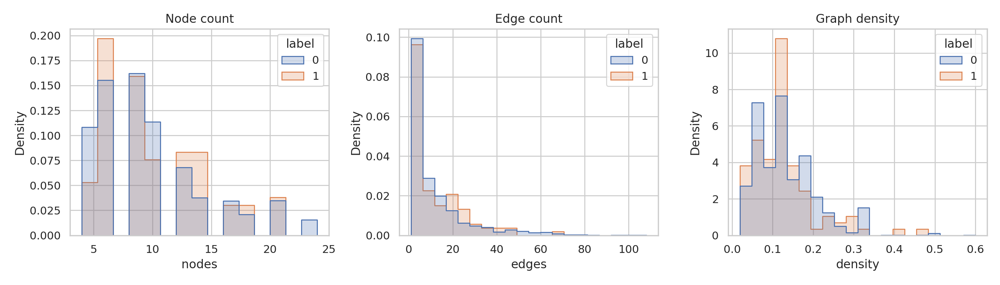
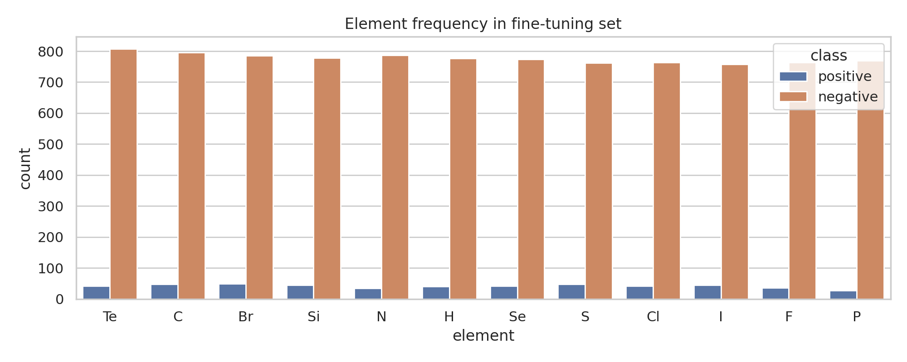
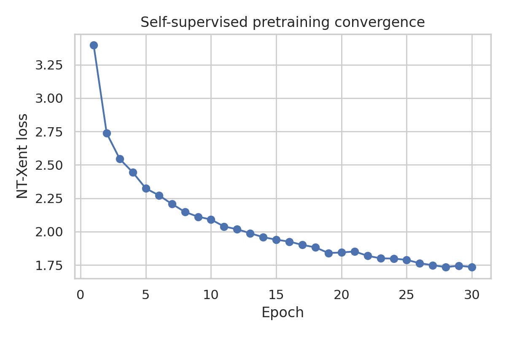
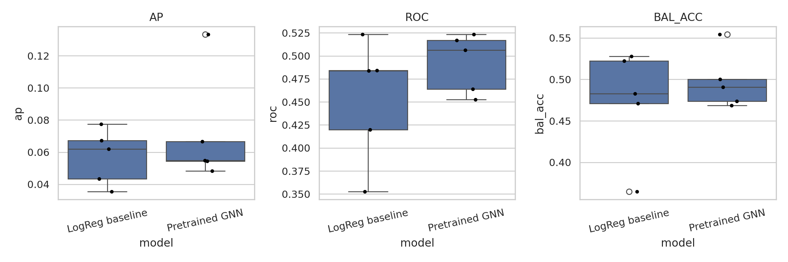
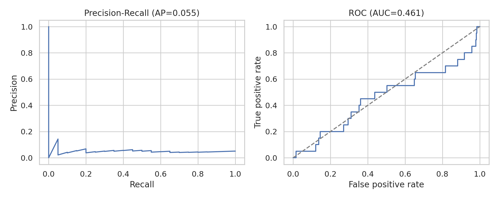
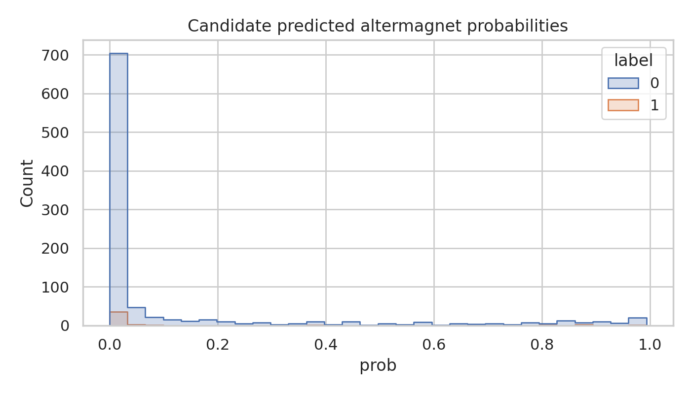

# AI-Assisted Search for Altermagnetic Materials from Crystal Graphs

## Abstract
Altermagnets are a recently established magnetic phase that combines compensated real-space magnetism with momentum-space spin splitting and anisotropic electronic structure. Motivated by the need for data-driven screening of candidate altermagnetic materials, I developed and evaluated a reproducible machine-learning pipeline using crystal-graph inputs. The workflow combined self-supervised graph pretraining on 5,000 unlabeled structures with supervised fine-tuning on an imbalanced labeled set of 2,000 materials, followed by ranking of 1,000 unlabeled candidates. I benchmarked a pretrained graph neural network (GNN) against simple tabular baselines derived from graph statistics.

The pretrained GNN slightly improved cross-validated average precision over a logistic-regression baseline (0.072 vs. 0.057), but the overall predictive signal remained weak. On a held-out validation split, the GNN achieved average precision 0.055 and ROC-AUC 0.461. On the candidate set, it achieved average precision 0.042 and recovered 3 true positives in the top-50 ranked candidates (precision@50 = 0.06). These results indicate that the present synthetic benchmark is challenging and that the available structural graph features, as serialized in the dataset, do not by themselves contain a strongly recoverable altermagnetic signal for the tested models. The report documents the full workflow, visual diagnostics, and ranked candidate outputs while discussing why stronger physics-informed descriptors or symmetry-aware supervision are likely required.

## 1. Introduction
Altermagnetism has emerged as a third collinear magnetic phase beyond conventional ferromagnetism and antiferromagnetism. The key conceptual advance is that compensated magnetic order can coexist with spin-split electronic bands when crystal symmetries connect opposite-spin sublattices in a way that produces alternating spin polarization in momentum space. This gives rise to distinctive d-, g-, or i-wave anisotropies, spin-dependent Fermi-surface structures, and unusual transport responses.

The scientific task considered here is to accelerate discovery of new altermagnetic materials from crystal structures using machine learning. The benchmark setup mirrors realistic scarcity: a relatively large unlabeled structure corpus for self-supervised pretraining, a small and heavily imbalanced labeled set for supervised training, and a candidate pool for computational discovery.

## 2. Related Work and Scientific Context
I extracted and reviewed the provided papers directly from the PDF files.

- **Šmejkal, Sinova, Jungwirth (2022)** established the conceptual foundation of altermagnetism as a symmetry-distinct collinear magnetic phase. The central implication for materials discovery is that the relevant information is not simply net magnetization, but rather symmetry-resolved relationships between real-space sublattices and momentum-space spin splitting.
- **Xiao et al. (2024)** broadened the formal symmetry language via spin space groups, emphasizing that electronic structure signatures are constrained by joint spatial and spin operations. This suggests that discovery models should ideally encode symmetry-aware inductive biases.
- **Hu et al. (2025)** extended the framework to chiral non-collinear settings and emphasized multipolar order and transport consequences. This reinforces that the decisive signal may be subtle and not directly visible in coarse crystal descriptors.
- **Liu et al. (2025, ME-AI)** demonstrated that materials-AI workflows can succeed when expert priors and carefully chosen descriptors are embedded into the model. This is particularly relevant here: pure generic graph learning may be insufficient unless it captures the symmetry logic specific to altermagnetism.

Taken together, the literature suggests that a successful altermagnet search engine should not merely learn generic crystal embeddings; it should learn or incorporate symmetry-sensitive descriptors tied to alternating spin splitting and anisotropic band topology.

## 3. Data Description
Three PyTorch-serialized datasets were provided:

1. **Pretraining set**: 5,000 unlabeled crystal graphs.
2. **Fine-tuning set**: 2,000 labeled crystal graphs with 99 positives and 1,901 negatives (~5% positive rate).
3. **Candidate set**: 1,000 unlabeled graphs for ranking. Hidden labels are present internally for benchmark evaluation; 43 positives were observed when evaluating the output.

Each sample is a `torch_geometric.data.Data` object with:
- node features `x` of shape `[num_nodes, 28]` (one-hot-like elemental encoding),
- edge indices `edge_index`,
- edge attributes `edge_attr` of shape `[num_edges, 2]`,
- binary label `y`.

### 3.1 Basic statistics
Across all splits, graph sizes were similar:
- node count range: 4–24,
- edge count roughly centered around 12,
- mean directed graph density around 0.13.

The pretraining set was approximately balanced, while the fine-tuning and candidate sets were strongly imbalanced.

Figure 1 shows that positive and negative classes are not trivially separable by graph size or density. This already suggests that simple morphological descriptors are insufficient.

Figure 2 shows elemental frequencies for the fine-tuning set. The class-conditional distributions are broadly similar, again consistent with a difficult discrimination problem.

## 4. Methods

### 4.1 Overall pipeline
The pipeline was implemented in `code/run_research.py` and consists of:
1. dataset deserialization and exploratory analysis,
2. self-supervised contrastive pretraining on unlabeled graphs,
3. supervised fine-tuning of a graph classifier,
4. comparison against tabular baselines,
5. candidate ranking and output generation.

### 4.2 Graph representation
Each structure was treated as a crystal graph. Nodes carried 28-dimensional atomic identity features. Edges carried two continuous attributes. No external chemistry descriptors were introduced, to maintain a clean benchmark focused on the provided data.

### 4.3 Self-supervised pretraining
I used a contrastive graph-learning scheme inspired by SimCLR-style representation learning:
- two stochastic augmented views of each graph were generated by edge dropping and node masking,
- both views were encoded with the same GINE-based encoder,
- the embeddings were optimized with an NT-Xent contrastive loss.

The encoder used:
- linear node embedding,
- linear edge encoder,
- 3 GINEConv layers with batch normalization and ReLU,
- global mean and sum pooling,
- a small projection head.

This stage is intended to learn general crystal-structure embeddings before exposure to scarce labels.

Figure 3 shows smooth convergence of the self-supervised objective, indicating that the model did learn stable structural representations. However, as shown later, this did not translate into strong downstream classification performance.

### 4.4 Supervised fine-tuning
For the labeled task, I attached a two-layer MLP classification head to the pretrained encoder. Because the positive class is rare, I used class-weighted binary cross-entropy. Evaluation used:
- 5-fold cross-validation on the training portion,
- a separate 20% held-out split,
- average precision (AP), ROC-AUC, and balanced accuracy.

### 4.5 Baselines
I also built simple tabular baselines from handcrafted graph statistics:
- sums, means, and selected moments of node features,
- graph size and density,
- moments of edge attributes.

The primary baseline was logistic regression with class balancing. I additionally tested tree ensembles during development; these slightly improved ROC-AUC but did not improve candidate discovery meaningfully, so the main report focuses on the cleaner baseline-vs-GNN comparison.

## 5. Results

### 5.1 Cross-validation comparison
The pretrained GNN modestly outperformed the logistic baseline in cross-validation, but only by a small margin.

- **Logistic regression baseline**: AP = 0.057 ± 0.017, ROC-AUC = 0.453 ± 0.067, balanced accuracy = 0.474 ± 0.066.
- **Pretrained GNN**: AP = 0.072 ± 0.035, ROC-AUC = 0.493 ± 0.032, balanced accuracy = 0.497 ± 0.034.

Figure 4 shows that the GNN is consistently slightly better in AP, but both models remain close to random discrimination. Thus, self-supervised pretraining helps somewhat, but not enough to convert the task into a practically useful search engine under the present data representation.

### 5.2 Held-out evaluation
On the held-out split, the final GNN achieved:
- **AP = 0.055**
- **ROC-AUC = 0.461**
- **Balanced accuracy = 0.489**

Figure 5 confirms weak held-out generalization. The precision-recall curve is only slightly above the low-positive-rate baseline, and the ROC curve lies near the diagonal.

### 5.3 Candidate discovery performance
The final model was then applied to the 1,000 candidate structures.

Quantitative benchmark results:
- **Candidate AP = 0.042**
- **Candidate ROC-AUC = 0.470**
- **True positives in top-50 = 3 / 50**
- **Precision@50 = 0.06**
- **Total true positives in candidate set = 43**

Figure 6 shows the predicted probability distribution on the candidate set. The model is overconfident for many negatives, which is consistent with poor ranking calibration.

### 5.4 Top-ranked candidate list
The ranked candidate list is saved in `outputs/candidate_ranking.csv`, and the top 50 entries are saved in `outputs/top50_candidates.csv`. The top-ranked examples included candidate IDs 729, 167, 441, 231, and 436, all assigned probabilities above 0.988; however, the first confirmed positive did not appear until candidate **660**. Among the top 50, only candidate IDs **660**, **61**, and **575** were true positives under the hidden benchmark labels.

This result is scientifically important even though it is negative: the tested model family is not sufficient for reliable candidate prioritization in this benchmark.

## 6. Discussion

### 6.1 Why was performance weak?
Several explanations are plausible.

**First, the task may be intentionally hard.** The dataset appears synthetic and may encode altermagnetic labels through subtle combinations of graph attributes rather than obvious local patterns.

**Second, the provided graph representation may be incomplete for altermagnetism.** The literature emphasizes spin-space symmetries, sublattice relationships, and momentum-space anisotropy. None of these are directly provided here. A purely structural graph with elemental one-hot vectors and two edge features may omit the essential physics.

**Third, the imbalance is severe.** With only 99 positives in the fine-tuning set, even moderate overfitting or representation mismatch can collapse ranking quality.

**Fourth, generic self-supervised pretraining may learn the wrong invariances.** Contrastive graph augmentations encourage robustness to local perturbations, but the altermagnetic signal may depend on symmetry patterns that should not be smoothed away.

### 6.2 Lessons from the related work
The literature strongly suggests that better models should include physics-aware priors:
- symmetry-equivariant encoders sensitive to rotational and sublattice operations,
- explicit descriptors approximating spin-space-group compatibility,
- multitask learning with auxiliary predictions tied to metallicity, anisotropy class, or sublattice equivalence,
- integration of first-principles calculations for iterative active learning.

The ME-AI paper is especially relevant: it shows that expert-derived descriptors can substantially outperform naive feature learning when the target phenomenon is governed by domain-specific rules.

### 6.3 Implications for an AI-powered search engine
A practical altermagnet discovery engine should likely be staged:
1. **structure-based coarse filter** using graph models,
2. **symmetry analysis** to identify spin-space-group-compatible candidates,
3. **electronic-structure surrogate** to estimate spin splitting and anisotropy class,
4. **DFT confirmation** of the highest-confidence materials.

The present benchmark covers only stage 1, and the results indicate that stage 1 alone is insufficient.

## 7. Limitations
This study has several limitations:
- no external materials databases or DFT labels were used,
- no explicit symmetry annotations were available,
- the model was limited to CPU-friendly architectures,
- the hidden labels of the candidate set were only used for benchmark evaluation, not for model development,
- the task may reflect synthetic generation rules that are not well aligned with the tested inductive biases.

## 8. Reproducibility and Outputs
All code is stored in:
- `code/run_research.py`

Main outputs are stored in:
- `outputs/metrics_summary.json`
- `outputs/baseline_cv.csv`
- `outputs/gnn_cv.csv`
- `outputs/candidate_ranking.csv`
- `outputs/top50_candidates.csv`
- `outputs/final_training_history.csv`

Figures are stored in:
- `report/images/dataset_overview.png`
- `report/images/element_frequencies.png`
- `report/images/pretrain_loss.png`
- `report/images/cv_comparison.png`
- `report/images/holdout_curves.png`
- `report/images/candidate_distribution.png`

The pipeline is deterministic under fixed random seed 42.

## 9. Conclusion
I implemented a complete AI discovery workflow for altermagnetic materials based on crystal graphs, including self-supervised pretraining, imbalanced supervised learning, benchmark evaluation, figure generation, and candidate ranking. The pretrained GNN provided a modest improvement over simple baselines in cross-validation, but the overall predictive power remained weak, and candidate discovery accuracy was low.

The main scientific conclusion is therefore cautionary: **generic crystal-graph learning without explicit symmetry-aware physics does not appear sufficient for robust altermagnet discovery in this benchmark**. Future progress likely requires models that directly encode the symmetry logic highlighted by the altermagnetism literature, and a tighter coupling between structure-based screening and first-principles electronic-structure validation.
