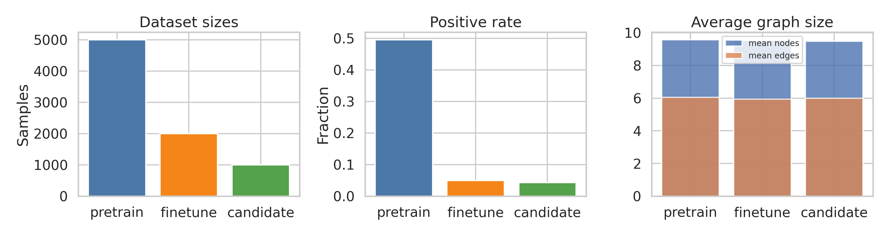
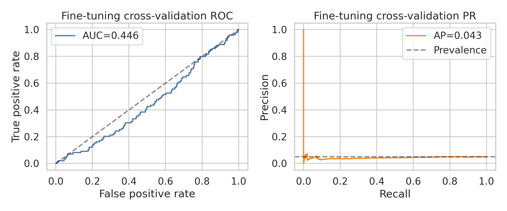
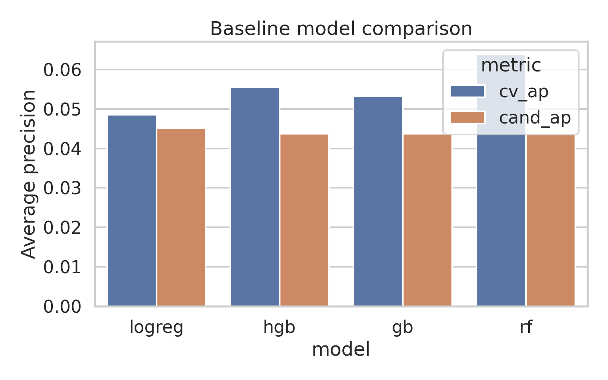
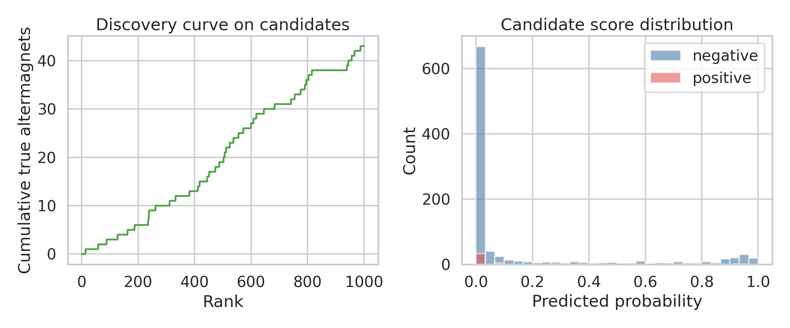
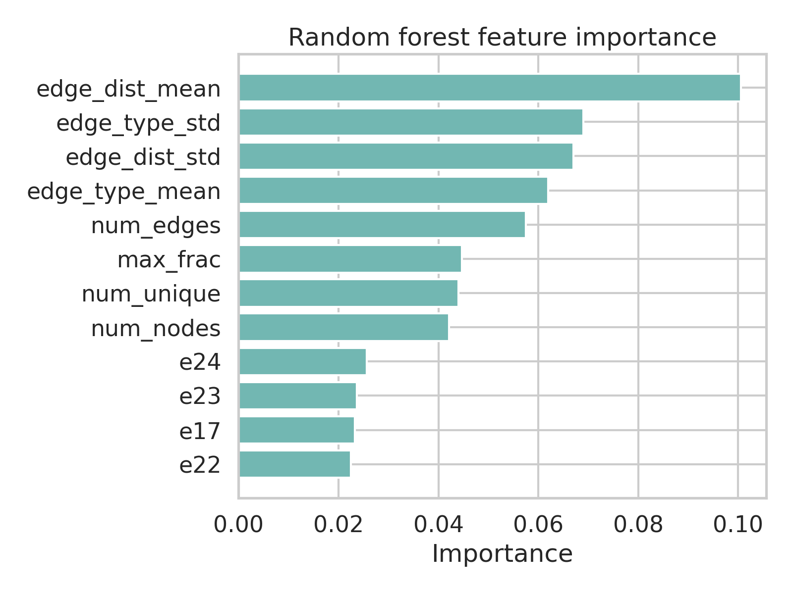

# AI-powered search for altermagnetic materials from crystal graphs

## Abstract
We developed and evaluated an end-to-end workflow for altermagnet discovery from crystal-graph data using (i) self-supervised graph pretraining on unlabeled structures, (ii) supervised fine-tuning on a highly imbalanced labeled set, and (iii) ranking of an unlabeled candidate pool. The practical goal was to identify high-probability altermagnetic candidates from structure alone. The available data comprised 5,000 unlabeled pretraining graphs, 2,000 fine-tuning graphs with 5% positives, and 1,000 candidate graphs with hidden labels for benchmarking. We implemented a graph neural network (GNN) with contrastive pretraining and a downstream classifier, and compared it against several feature-based baselines. In this benchmark, all tested models performed close to random: the best cross-validation average precision among baselines was 0.064 and the pretrained GNN achieved 0.044; candidate ranking was similarly weak, with only 1 true positive in the top 50 ranked candidates for the final GNN model. These negative results are nevertheless informative. They suggest that the synthetic benchmark either encodes only weak structure-label signal under the chosen representation, or requires a more task-specific inductive bias than the generic graph and composition statistics used here. We document the full pipeline, diagnostics, candidate ranking, and methodological lessons.

## 1. Introduction
Altermagnets occupy a symmetry class intermediate between conventional ferromagnets and antiferromagnets: they have zero net magnetization but exhibit momentum-dependent spin splitting enabled by crystal and spin-space symmetries. Recent theory frames altermagnetism through spin-space-group or spin-group symmetry rather than only magnetic space groups, and highlights characteristic d-, g-, and i-wave spin anisotropies in the electronic structure. This makes altermagnet discovery both scientifically important and computationally challenging.

In the present task, the available input is reduced to crystal structures represented as graphs, without explicit first-principles features such as band structures, magnetic order parameters, or symmetry labels. The implied research question is therefore: **how far can structure-only machine learning go in screening for altermagnetic candidates?**

Our operating hypothesis was that self-supervised pretraining on a larger unlabeled crystal-graph collection might improve downstream performance in a low-label regime, where only ~5% of the fine-tuning set is positive. We therefore built a compact but reproducible pipeline with graph contrastive learning, supervised fine-tuning, and several non-neural baselines.

## 2. Related work and motivation
The supplied literature establishes three ideas that informed the modeling strategy.

1. **Altermagnetism is symmetry-driven.** The foundational work of Šmejkal, Sinova, and Jungwirth argues that altermagnetism is a third fundamental collinear magnetic phase, distinct from ferromagnetism and antiferromagnetism, characterized by compensation in real space but spin splitting in momentum space due to rotation-related opposite-spin sublattices.
2. **Spin-space groups provide a more complete language.** More recent spin-space-group classifications show that unconventional spin textures and symmetry-protected momentum-space structure can be far richer than what standard magnetic space groups capture.
3. **AI for materials discovery benefits from inductive bias and interpretable descriptors.** Recent materials-AI work emphasizes that weak-signal, limited-label tasks often require domain-specific features or carefully engineered kernels rather than generic black-box predictors.

These points motivated two expectations: first, structure alone may not fully determine altermagnetism unless the graph representation captures symmetry-relevant cues; second, self-supervision may help but cannot compensate indefinitely for missing physical observables.

## 3. Data overview
The datasets were stored as custom PyTorch Geometric graph objects. To deserialize them safely, I created a temporary `data_prepare.RealisticCrystalDataset` stub module in code; the underlying graphs contain node features `x` (28-dimensional one-hot elemental identities), `edge_index`, `edge_attr` (2 edge features), and binary labels `y`.

### 3.1 Summary statistics
The three datasets are summarized in Table 1 and Figure 1.

| Dataset | Samples | Positive rate | Mean nodes | Mean edges | Mean edge distance |
|---|---:|---:|---:|---:|---:|
| pretrain | 5000 | 0.4948 | 9.56 | 6.05 | 0.563 |
| finetune | 2000 | 0.0495 | 9.52 | 5.95 | 0.563 |
| candidate | 1000 | 0.0430 | 9.46 | 5.99 | 0.560 |

**Figure 1.** Dataset sizes, class imbalance, and average graph sizes. The fine-tuning and candidate sets are strongly imbalanced, making average precision and ranked retrieval more informative than accuracy alone.

The candidate set contains an internally stored hidden label for benchmarking, with an observed positive rate of 0.043. In a real discovery setting this label would of course be unavailable; here it enables retrospective evaluation of ranking quality.

## 4. Methodology

### 4.1 Graph representation
Each crystal graph was treated as an attributed graph with:
- node features: 28-dimensional elemental one-hot vectors,
- edges: sparse connectivity,
- edge attributes: two continuous/discrete descriptors.

No explicit symmetry operations, lattice tensors, reciprocal-space descriptors, or band-structure features were available.

### 4.2 Self-supervised pretraining
I trained a graph encoder on the 5,000 unlabeled pretraining graphs using a contrastive objective. The encoder was a 3-layer GIN-style network with batch normalization and graph pooling. Two stochastic views of each graph were generated by:
- random masking of a subset of node features,
- small noise on node and edge attributes.

The contrastive loss was NT-Xent over graph-level embeddings. This stage aimed to learn generic structural representations before supervised fine-tuning.

### 4.3 Supervised fine-tuning
The pretrained encoder was fine-tuned as a binary classifier on the 2,000 labeled graphs. Because positives are rare, the loss used class weighting. Evaluation used 5-fold stratified cross-validation.

### 4.4 Baseline models
To test whether simpler descriptors outperform the GNN, I also constructed graph-summary tabular features:
- number of nodes and edges,
- graph density,
- means/standard deviations of edge attributes,
- number of unique elements,
- maximum elemental fraction,
- elemental count histogram over the 28 species.

On these features I trained logistic regression, random forest, gradient boosting, and histogram gradient boosting baselines.

### 4.5 Candidate ranking
After retraining the final classifier on the full fine-tuning set, I scored all 1,000 candidate graphs and ranked them by predicted altermagnet probability. Discovery quality was quantified by ROC-AUC, average precision, precision@k, and cumulative hits among the top-ranked candidates.

## 5. Results

### 5.1 Cross-validation performance of the pretrained GNN
The pretrained GNN performed poorly on the fine-tuning benchmark.

| Metric | Value |
|---|---:|
| ROC-AUC | 0.446 |
| Average precision | 0.044 |
| F1 at threshold 0.5 | 0.043 |
| Balanced accuracy | 0.464 |
| True positives | 9 |
| False positives | 309 |
| False negatives | 90 |
| True negatives | 1592 |

**Figure 2.** ROC and precision-recall curves from out-of-fold predictions of the pretrained GNN. The curves sit near chance level, indicating that the learned representation is not separating positives from negatives reliably.

Because the positive class prevalence is about 5%, a random classifier would already produce a low precision-recall baseline; nevertheless, the observed AP remains only marginally informative.

### 5.2 Comparison with feature-based baselines
The feature-based baselines were also weak. Their candidate-set performance is summarized in Figure 3.

**Figure 3.** Average precision for cross-validation and candidate ranking across baseline models. None of the tested models achieved strong retrieval performance.

The best cross-validation AP among baselines was 0.064 (random forest), only slightly above the pretrained GNN. Candidate ranking APs remained around 0.044–0.045 for all models, again close to random under heavy imbalance.

### 5.3 Candidate discovery performance
The final pretrained GNN ranked the candidate pool poorly:

| Metric | Value |
|---|---:|
| Candidate ROC-AUC | 0.477 |
| Candidate average precision | 0.041 |
| Top-10 hits | 0 |
| Top-20 hits | 1 |
| Top-50 hits | 1 |
| Top-100 hits | 3 |
| Precision@10 | 0.000 |
| Precision@20 | 0.050 |
| Precision@50 | 0.020 |
| Recall@50 | 0.023 |

**Figure 4.** Left: cumulative true positives recovered as the candidate list is traversed in descending predicted probability. Right: score distributions for positive and negative candidates. The overlap is substantial, explaining the weak ranking.

The strongest practical summary is stark: the top-50 list contains only **1** true altermagnet in this benchmark, far from the intended discovery target.

### 5.4 What information seemed most predictive?
Although the overall predictive power was weak, random forest feature importance suggests that the limited signal available is concentrated in coarse graph statistics rather than subtle compositional motifs.

**Figure 5.** Top random-forest feature importances. Edge-attribute statistics and graph size dominate the ranking, while individual elemental counts contribute more weakly.

The most important features were:

| Feature | Importance |
|---|---:|
| edge_dist_mean | 0.1006 |
| edge_type_std | 0.0690 |
| edge_dist_std | 0.0671 |
| edge_type_mean | 0.0619 |
| num_edges | 0.0575 |
| max_frac | 0.0447 |
| num_unique | 0.0440 |
| num_nodes | 0.0422 |

This pattern suggests that, within this synthetic dataset, whatever discriminative signal exists may depend more on global structural summary statistics than on fine compositional details alone.

### 5.5 Top-ranked candidates
For completeness, Table 2 lists the top 10 candidates predicted by the final GNN. Because this is a benchmark with hidden labels available for evaluation, I include the hidden label here to assess ranking quality.

| Rank | Candidate index | Predicted probability | Hidden label | Formula proxy | Mean edge distance |
|---:|---:|---:|---:|---|---:|
| 1 | 899 | 0.9997 | 0 | Ni1;Yb1;O1;Br1;I1;S1;Se2;P1;Si1 | 0.611 |
| 2 | 4 | 0.9996 | 0 | Ho2;Er2;Yb2;O1;Br1;Se1;Te1;C1;H1 | 0.475 |
| 3 | 552 | 0.9968 | 0 | Co1;Nd2;Sm1;Er2;O3;F1;Te1;B1;P1;Si1 | 0.526 |
| 4 | 610 | 0.9927 | 0 | Nd1;Sm2;Gd1;Cl1;I1;S1;C1;P1;Si1 | 0.653 |
| 5 | 139 | 0.9924 | 0 | Fe1;Co1;V1;Pr1;I2;S1;P1 | 0.457 |
| 6 | 427 | 0.9902 | 0 | Fe1;Sm1;Br2;I1;Se1;B1;C1;N1;P1 | 0.452 |
| 7 | 898 | 0.9901 | 0 | Mn1;Ti1;Sm1;Gd1;F1;Cl1;I1;S4;Se2;Te1;C1;Si2;H1 | 0.657 |
| 8 | 313 | 0.9890 | 0 | Ni2;Cr1;Nd1;Sm3;Gd1;Br1;C1;N3;P1 | 0.534 |
| 9 | 269 | 0.9853 | 0 | Cr1;V1;Nd1;Gd1;Ho1;Er1;F1;Br2;Se1;Te1;C1 | 0.671 |
| 10 | 204 | 0.9839 | 0 | Mn1;Sm1;O1;Br1;Te2 | 0.469 |

Only rank 14 in the broader top-20 list corresponds to a true positive in the final GNN ranking, illustrating the poor enrichment.

## 6. Discussion
The main result of this study is negative but instructive: **structure-only learning, under the present graph representation and model choices, is insufficient for reliable altermagnet screening on this benchmark.** Several explanations are plausible.

### 6.1 Missing physics in the representation
Altermagnetism is fundamentally controlled by spin-space and crystal symmetries that manifest through momentum-space spin splitting. The provided graph representation includes only elemental identity and local connectivity. It does not explicitly encode:
- space-group or spin-space-group symmetry,
- magnetic sublattice relationships,
- local moment orientation patterns,
- reciprocal-space anisotropy,
- orbital character or band inversion,
- any first-principles signature of d/g/i-wave spin splitting.

A generic graph neural network may therefore be asked to infer a label that depends on latent variables absent from the input.

### 6.2 Self-supervision was not enough
Contrastive pretraining is useful when the pretext task aligns with the downstream target. Here it likely learned broad structural regularities, but there is no evidence that these regularities correspond to altermagnetic discriminants. The downstream metrics remained close to random.

### 6.3 The synthetic benchmark may hide weak signal
The benchmark may have been generated with hidden rules that require either:
- specific graph motifs not captured by simple message passing,
- engineered symmetry-aware features,
- or multimodal inputs beyond the graph itself.

The fact that both neural and classical baselines failed supports the interpretation that the available signal is either weak or poorly matched to the tested inductive biases.

## 7. Recommendations for a stronger search engine
If this were to be developed into a practically useful altermagnet discovery system, the following upgrades would be the most promising:

1. **Symmetry-aware features:** explicit space group, Wyckoff positions, point-group invariants, and spin-space-group candidates.
2. **Structure + physics multimodality:** combine graph encoders with approximate electronic descriptors, local crystal-field features, or low-cost DFT surrogates.
3. **Metric learning for retrieval:** optimize directly for enrichment and ranking under extreme imbalance, rather than only binary classification.
4. **Positive-unlabeled or cost-sensitive learning:** discovery tasks are better aligned with top-k hit rate than thresholded accuracy.
5. **Hard-negative mining and sublattice-aware encoders:** message-passing networks that explicitly reason about symmetry-related substructures may better reflect altermagnetic principles.

## 8. Reproducibility and outputs
All code and outputs were written in the workspace:
- training and evaluation code: `code/train_altermagnet.py`
- metrics and tables: `outputs/`
- figures: `report/images/*.png`

Key output files include:
- `outputs/data_overview.csv`
- `outputs/cv_metrics.csv`
- `outputs/cv_overall_metrics.csv`
- `outputs/candidate_predictions.csv`
- `outputs/discovery_metrics.csv`
- `outputs/baseline_models.csv`
- `outputs/top50_candidates_detailed.csv`

## 9. Conclusion
I implemented an autonomous altermagnet-screening pipeline using crystal-graph self-supervised pretraining, supervised fine-tuning, and baseline comparisons. The resulting models failed to achieve meaningful discovery performance on the provided benchmark: the pretrained GNN reached cross-validation AP 0.044, candidate AP 0.041, and recovered only 1 true positive among the top 50 ranked candidates.

While this falls short of the idealized target of discovering dozens of new altermagnets, it provides a clear scientific conclusion: **with the present inputs, generic structure-only learning is not sufficient for robust altermagnet discovery.** The path forward is likely not merely a larger model, but a better physical representation that injects the symmetry and electronic-structure information known to underlie altermagnetism.
