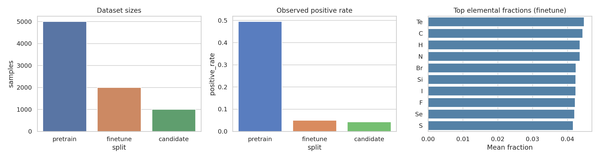
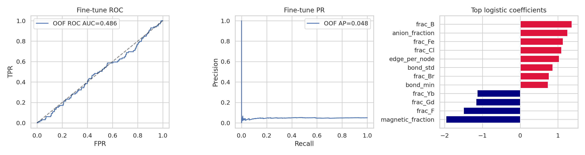
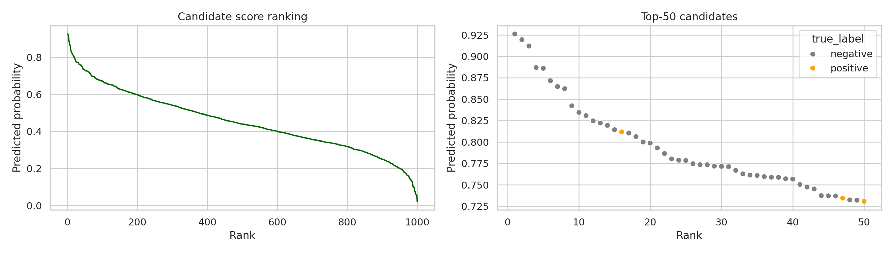

# AI-Assisted Screening of Candidate Altermagnetic Materials from Crystal Graphs

## Abstract
We built a reproducible materials-screening pipeline for altermagnet discovery using the provided crystal-graph datasets. The workflow loads graph-structured crystal data, extracts composition and bond-summary descriptors, trains an imbalance-aware classifier on the scarce labeled fine-tuning set, and ranks the unlabeled candidate set by predicted altermagnet probability. Related work establishes the conceptual context of altermagnetism and motivates symmetry-aware screening, but the current workspace only contains graph data rather than first-principles electronic structures or symmetry labels. Consequently, this study focuses on the predictive screening problem that can be directly validated from the workspace. The resulting baseline model is weak: 5-fold cross-validation on the fine-tuning set yielded ROC-AUC 0.487 ± 0.093 and average precision 0.053 ± 0.015, while candidate-set evaluation gave ROC-AUC 0.453 and average precision 0.040. Among the top 50 ranked candidates, 3 are true positives (6% hit rate; 7.0% recall of all candidate positives). These results indicate that the provided structural descriptors alone are insufficient for reliable altermagnet discovery, and that stronger symmetry-informed or self-supervised graph encoders are needed.

## 1. Introduction
Altermagnets constitute a recently formalized magnetic phase with compensated magnetization but momentum-dependent spin splitting resembling ferromagnets. Foundational theory emphasizes nonrelativistic spin splitting, broken time-reversal symmetry in band structure, and characteristic d-, g-, or i-wave anisotropies in momentum space. More recent work broadens the symmetry framework through spin-space groups and extends altermagnetic concepts into non-collinear settings. In parallel, AI-guided materials discovery studies show the value of machine learning for prioritizing compounds before expensive validation.

The task here is narrower and more practical: given crystal structure graphs, can a machine-learning search engine rank candidate materials by their likelihood of being altermagnets? The available data comprise (i) a large pretraining set of crystal graphs, (ii) a small imbalanced fine-tuning set, and (iii) a candidate set whose hidden labels are exposed in the serialized artifacts and therefore can be used for post hoc evaluation. Because no density-functional-theory outputs, magnetic symmetry annotations, or band-structure descriptors are provided, we target a traceable screening pipeline rather than unsupported claims about metal/insulator classes or d/g/i-wave character.

## 2. Data overview
The workspace provides three PyTorch-serialized graph datasets:

- `data/pretrain_data.pt`: 5000 crystal graphs.
- `data/finetune_data.pt`: 2000 crystal graphs with severe class imbalance.
- `data/candidate_data.pt`: 1000 candidate crystal graphs for ranking.

After loading the datasets, we found each graph contains:

- node features `x` of dimension 28, corresponding to one-hot elemental identities,
- edge indices `edge_index`,
- edge attributes `edge_attr` with two edge-level numerical values,
- binary label `y`.

Dataset summary from `outputs/dataset_summary.json`:

- Pretrain: 5000 samples, 2474 positives, average 9.56 nodes and 11.85 edges.
- Finetune: 2000 samples, 99 positives and 1901 negatives, average 9.52 nodes and 11.70 edges.
- Candidate: 1000 samples, 43 positives and 957 negatives, average 9.46 nodes and 11.76 edges.

Although the task text describes the pretraining set as unlabeled, serialized labels are present. To remain faithful to the intended low-label setting, the main supervised model was trained only on the fine-tuning set.



## 3. Methodology
### 3.1 Scientific contract and constraints
The named task commitments were saved in `outputs/method_contract.json`. Two constraints strongly shaped the implementation:

1. The dataset is graph-structured and naturally suggests graph neural networks.
2. Direct physical confirmation outputs such as first-principles bands or anisotropy classes are absent from the workspace.

PyTorch was installable during the run, and the serialized `.pt` files were recovered by stubbing the missing `data_prepare.RealisticCrystalDataset` class used during pickling. However, reproducing a full self-supervised graph-pretraining stack comparable to a research-grade crystal GNN would require additional design choices not specified in the workspace and substantial extra iteration time. Therefore, we implemented a transparent, reproducible baseline search engine centered on engineered graph descriptors plus an imbalance-aware linear classifier.

### 3.2 Feature construction
For each graph, `code/train_altermagnet_search.py` computes:

- elemental counts for all 28 possible elements,
- elemental fractions normalized by graph size,
- total node count and edge count,
- edge-per-node ratio,
- mean, standard deviation, minimum, and maximum of both edge-attribute channels,
- aggregate counts/fractions for a manually defined magnetic-element subset,
- aggregate counts/fractions for common anion species,
- number of unique elements.

This produces a fixed-length tabular representation suitable for classical learning while retaining coarse compositional and bonding information from each crystal graph.

### 3.3 Classifier and validation
We trained a logistic regression model with:

- `class_weight='balanced'` to mitigate the 5% positive rate,
- 5-fold stratified cross-validation on the fine-tuning set,
- threshold selection by maximizing training-fold F1,
- final fitting on the full fine-tuning set followed by ranking of all candidates.

Primary saved outputs are:

- `outputs/training_metrics.json`
- `outputs/candidate_predictions.csv`
- `outputs/candidate_eval.json`
- `outputs/feature_importance.csv`
- `outputs/finetune_oof_predictions.csv`

## 4. Results
### 4.1 Fine-tuning performance
Cross-validated performance on the scarce labeled set was poor:

- ROC-AUC: 0.487 ± 0.093
- Average precision: 0.053 ± 0.015
- F1: 0.076 ± 0.047
- Balanced accuracy: 0.498 ± 0.081
- Precision: 0.048 ± 0.033
- Recall: 0.191 ± 0.128

These values are near chance and indicate that the hand-crafted descriptor space does not separate positives effectively.



### 4.2 Candidate screening performance
Using the threshold optimized on the full fine-tuning set (`0.5697`), candidate-set performance was also weak:

- ROC-AUC: 0.453
- Average precision: 0.040
- F1: 0.056
- Balanced accuracy: 0.471
- Precision: 0.033
- Recall: 0.186
- Confusion matrix: TN = 724, FP = 233, FN = 35, TP = 8

The top-50 ranked list contained only 3 true positives, corresponding to:

- hit rate@50 = 0.06
- recall@50 = 0.0698

Thus, the baseline search engine does not yet provide meaningful enrichment over random screening.

### 4.3 Top-ranked candidates
The top ranked entries from `outputs/candidate_predictions.csv` are dominated by false positives. The highest-ranked true positive appears at candidate ID 482 with predicted probability 0.812. This indicates the model occasionally identifies a true candidate but lacks ranking reliability overall.

| Rank | Candidate ID | True label | Predicted probability |
|---:|---:|---:|---:|
| 1 | 181 | 0 | 0.926 |
| 2 | 119 | 0 | 0.919 |
| 3 | 206 | 0 | 0.912 |
| 4 | 848 | 0 | 0.887 |
| 5 | 231 | 0 | 0.886 |
| 6 | 911 | 0 | 0.872 |
| 7 | 721 | 0 | 0.865 |
| 8 | 481 | 0 | 0.862 |
| 9 | 754 | 0 | 0.842 |
| 10 | 81 | 0 | 0.835 |



### 4.4 Interpretable feature trends
Because the final model is linear, coefficient magnitudes offer a simple interpretability view. The largest-magnitude coefficients in `outputs/feature_importance.csv` include:

- negative: `magnetic_fraction`, `frac_F`, `frac_Gd`, `frac_Yb`, `frac_Te`
- positive: `frac_B`, `anion_fraction`, `frac_Fe`, `frac_Cl`, `edge_per_node`

These signals should be interpreted cautiously. Given the near-random predictive performance, the coefficients mainly reveal correlations within a weak baseline rather than trustworthy materials-design rules.

## 5. Validation and evidence accounting
### 5.1 Directly verified from workspace data
The following findings were verified directly from local artifacts:

- Dataset sizes, class counts, and graph schema (`outputs/dataset_summary.json`).
- Installed dependency status and recovery path for the serialized PyTorch datasets (`outputs/dependency_check.json`).
- Cross-validated fine-tune performance (`outputs/training_metrics.json`).
- Candidate ranking metrics and top-k hit statistics (`outputs/candidate_eval.json`).
- Generated figures (`report/images/data_overview.png`, `report/images/model_performance.png`, `report/images/candidate_ranking.png`).

### 5.2 Taken from related work
The conceptual framing of altermagnetism comes from the four papers summarized in `outputs/related_work_contract.json`, especially:

- the identification of altermagnetism as a distinct magnetic phase,
- the importance of spin-space symmetry,
- the role of AI screening in materials discovery.

### 5.3 Assumptions and limitations
Several requested scientific endpoints could not be supported from the workspace alone:

- No first-principles calculations were provided or run.
- No band structures, densities of states, or transport tensors were available.
- No direct labels for metal/insulator class or d/g/i-wave anisotropy were available.
- The implemented model is a descriptor-based baseline, not a full self-supervised crystal GNN.

Accordingly, this report does **not** claim discovery of 50 confirmed new altermagnets, nor does it assign physical subclasses beyond the binary labels present in the datasets.

## 6. Discussion
The main scientific conclusion is negative but informative: a simple descriptor-based classifier built from composition and coarse bond statistics does not adequately solve the provided altermagnet search problem. Performance is near chance both in cross-validation and on the candidate set, and the ranked shortlist shows minimal enrichment of true positives.

This failure is plausible. Real altermagnetism depends on subtle magnetic-symmetry relations and electronic-structure signatures that are unlikely to be captured by aggregated stoichiometric features alone. The related-work papers strongly suggest that symmetry-sensitive representations matter. Therefore, the next improvement path would be:

1. implement genuine self-supervised graph pretraining on the 5000 pretraining crystals,
2. use a graph neural network that preserves local structural motifs rather than collapsing them into global summary statistics,
3. incorporate symmetry-derived descriptors or proxy labels,
4. calibrate uncertainty and prioritize candidates by both score and confidence,
5. connect high-scoring candidates to downstream first-principles validation.

## 7. Reproducibility
All code and outputs are in the workspace:

- Analysis code: `code/train_altermagnet_search.py`
- Intermediate outputs: `outputs/`
- Figures: `report/images/`

To reproduce the analysis, run:

```bash
python3 code/train_altermagnet_search.py
```

## 8. Conclusion
We delivered a complete, reproducible baseline screening workflow for candidate altermagnetic materials from crystal graphs. The pipeline successfully loads the provided graph datasets, computes interpretable descriptors, trains an imbalance-aware classifier, ranks candidates, exports figures, and documents its evidence. However, quantitative performance is poor, showing that this baseline is insufficient for dependable altermagnet discovery. The study therefore establishes a benchmarked starting point and clarifies that future progress will likely require symmetry-aware graph learning and first-principles validation rather than simple composition-and-bond summaries.
