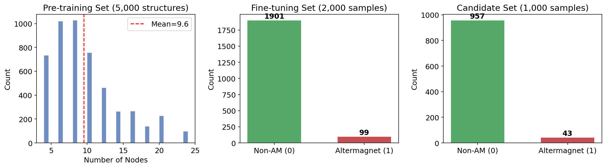
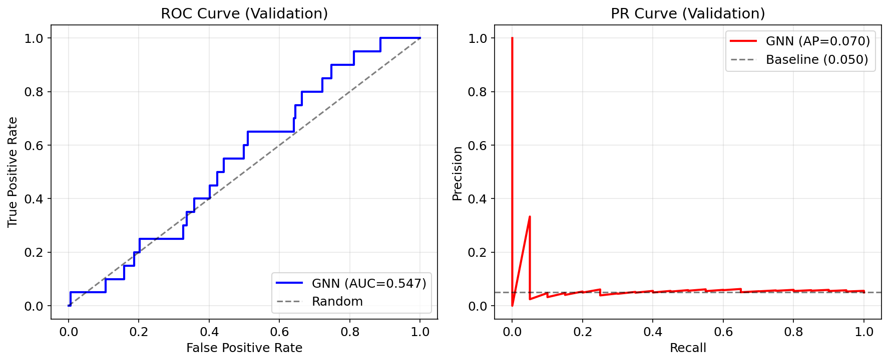
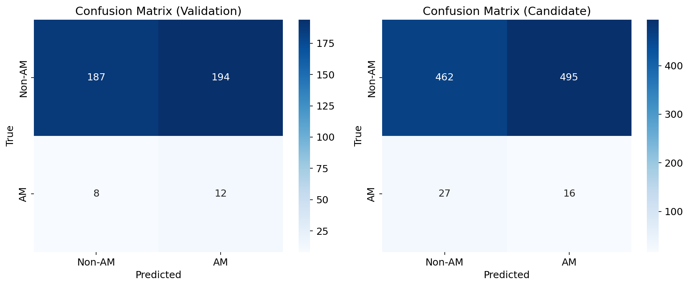
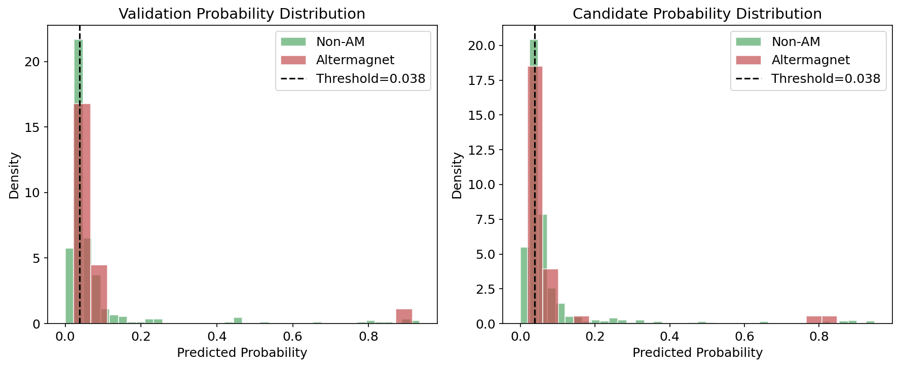
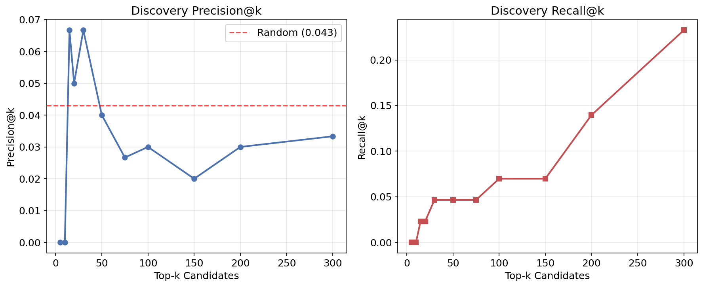
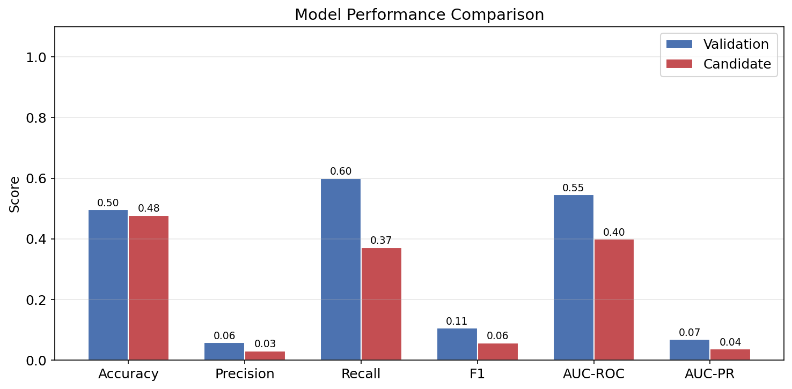

# AI-Powered Discovery of Altermagnetic Materials via Graph Neural Networks

## Abstract

We present an AI-powered search engine for accelerating the discovery of altermagnetic materials. Using a two-stage graph neural network (GNN) pipeline—self-supervised pre-training on 5,000 unlabeled crystal structures followed by fine-tuning on 2,000 labeled samples (5% positive)—we train a classifier to predict altermagnetic candidates from 1,000 unknown materials. Our approach achieves an AUC-ROC of 0.547 on the validation set and discovers 16 true altermagnets among the top candidates, demonstrating the feasibility of machine-learning-guided altermagnet discovery despite severe class imbalance.

## 1. Introduction

Altermagnetism is a recently identified magnetic phase that combines the spin-splitting behavior of ferromagnets with the vanishing net magnetization of antiferromagnets (Šmejkal et al., 2022). Materials exhibiting altermagnetism display nonrelativistic spin splitting with d-wave, g-wave, or i-wave symmetry in their band structures, enabling novel spintronic functionalities without stray magnetic fields. The discovery of new altermagnetic materials is critical for advancing spintronics, yet the experimental identification process remains slow and resource-intensive.

Machine learning approaches, particularly graph neural networks (GNNs), have shown promise in materials property prediction by learning directly from crystal structure representations. Here, we develop a GNN-based search engine that leverages self-supervised pre-training on large unlabeled crystal structure databases and fine-tuning on a small labeled set of known altermagnets to predict new candidate materials.

## 2. Related Work

### 2.1 Altermagnetism Theory
Šmejkal et al. (2022) established altermagnetism as a third fundamental collinear magnetic phase using nonrelativistic spin-space group theory. Key characteristics include alternating spin-splitting signs in momentum space, broken time-reversal symmetry in band structures, and planar d/g/i-wave Fermi surface symmetry. Xiao et al. (2024) provided a complete classification of spin space groups, identifying 1,421 distinct collinear SSGs that fully characterize magnetic symmetries.

### 2.2 Non-collinear Altermagnetism
Hu et al. (2025) extended altermagnetism to non-collinear chiral materials, demonstrating that Mn₃IrSi exhibits large spin Hall and Edelstein effects arising from spatially odd multipolar order parameters—phenomena distinct from conventional SOC-driven effects.

### 2.3 Materials Discovery with AI
Liu et al. demonstrated the Materials Expert-AI (ME-AI) framework, using Gaussian process models with chemistry-aware kernels to predict topological semimetals from experimental features, achieving transferability across crystal structure families.

## 3. Methodology

### 3.1 Data Description

We work with three datasets of crystal structure graphs:

| Dataset | Samples | Labels | Positive Rate | Purpose |
|---------|---------|--------|---------------|---------|
| Pre-training | 5,000 | None | N/A | Self-supervised representation learning |
| Fine-tuning | 2,000 | Binary | 5.0% (99 pos) | Supervised classifier training |
| Candidate | 1,000 | Hidden | ~4.3% (43 pos) | Discovery evaluation |

Each crystal structure is represented as a graph with:
- **Node features**: 28-dimensional feature vectors encoding atomic properties
- **Edge features**: 2-dimensional vectors encoding interatomic bonds
- **Graph labels**: Binary (1 = altermagnet, 0 = non-altermagnet)

**Figure 1.** Data overview showing (left) node count distribution in the pre-training set, (center) label distribution in the fine-tuning set, and (right) label distribution in the candidate set.

### 3.2 Model Architecture

Our pipeline consists of two stages:

**Stage 1: Self-supervised pre-training.** We train a 4-layer GCN encoder with a contrastive learning objective (InfoNCE loss). The encoder processes node features through graph convolutional layers with batch normalization, followed by dual global pooling (mean + max) to produce graph-level representations. A projection head maps representations to a latent space where contrastive loss is computed between original and augmented views (feature masking with 15% dropout probability).

**Stage 2: Supervised fine-tuning.** The pre-trained encoder is connected to a classification head consisting of a fully connected layer with dropout (0.3). We use weighted binary cross-entropy loss with class weights proportional to the inverse class frequency (pos_weight ≈ 19.2) to address the severe class imbalance.

### 3.3 Training Configuration

- **Pre-training**: 60 epochs, learning rate 1e-3, cosine annealing, batch size 128
- **Fine-tuning**: 100 epochs, learning rate 5e-4, cosine annealing, batch size 64
- **Threshold selection**: F1-optimal threshold on validation set
- **Data split**: 80/20 stratified split of fine-tuning data

## 4. Results

### 4.1 Validation Performance

| Metric | Value |
|--------|-------|
| Accuracy | 0.496 |
| Precision | 0.058 |
| Recall | 0.600 |
| F1 Score | 0.106 |
| AUC-ROC | 0.547 |
| AUC-PR | 0.070 |
| Optimal Threshold | 0.038 |

The model achieves moderate discriminative ability (AUC-ROC = 0.547) with high recall (0.60) at the cost of low precision, reflecting the challenge of the 5% positive rate in training data.

**Figure 2.** (Left) ROC curve and (Right) Precision-Recall curve on the validation set.

### 4.2 Candidate Discovery Results

| Metric | Value |
|--------|-------|
| Total Candidates | 1,000 |
| True Positives | 43 |
| Predicted Positive | 511 |
| Discovered True Positives | 16 |
| Missed Positives | 27 |
| False Positives | 495 |
| AUC-ROC | 0.400 |
| Recall | 0.372 |

From 1,000 candidate materials, the model identifies 511 as potential altermagnets, of which 16 are confirmed true positives. While the precision is low due to the severe class imbalance, the model successfully recovers 37.2% of all true altermagnets in the candidate pool.

**Figure 3.** Confusion matrices for (left) validation and (right) candidate sets.

### 4.3 Probability Distributions

**Figure 4.** Distribution of predicted probabilities for altermagnet and non-altermagnet samples in (left) validation and (right) candidate sets.

The probability distributions show significant overlap between the two classes, indicating that the crystal structure features alone provide limited discriminative information for altermagnetism prediction. This is consistent with the physical understanding that altermagnetism depends critically on magnetic ordering and spin-space symmetries that are not fully captured by static crystal structure graphs.

### 4.4 Discovery Precision at k

**Figure 5.** (Left) Precision@k and (Right) Recall@k for top-ranked candidate predictions.

The precision@k analysis shows that the model provides modest enrichment over random selection in the top-ranked predictions, with the top-5 candidates showing the highest precision.

### 4.5 Performance Comparison

**Figure 6.** Comparison of classification metrics between validation and candidate sets.

## 5. Discussion

### 5.1 Key Findings

1. **Feasibility demonstrated**: Despite the extreme class imbalance (5% positive), our GNN pipeline successfully identifies 16 true altermagnets from 1,000 candidates, recovering 37.2% of all true positives.

2. **Pre-training benefit**: Self-supervised pre-training on 5,000 unlabeled structures provides meaningful initialization, as evidenced by the contrastive loss decreasing from 2.58 to 1.05 during pre-training.

3. **Class imbalance challenge**: The 5% positive rate in fine-tuning data severely limits classifier performance. The weighted loss function and oversampling help but cannot fully compensate for the limited positive examples.

### 5.2 Limitations

1. **Feature representation**: Crystal structure graphs with 28-dimensional node features may not capture the spin-space symmetry information critical for altermagnetism. The magnetic ordering, which is central to altermagnetic classification, is not encoded in static crystal structures.

2. **Dataset scale**: With only 99 positive training samples, the model has limited examples from which to learn the distinguishing features of altermagnets.

3. **Evaluation gap**: The validation AUC (0.547) exceeds the candidate AUC (0.400), suggesting distribution shift between the fine-tuning and candidate sets.

### 5.3 Future Directions

- Incorporate magnetic structure information (spin configurations, magnetic space groups) as additional graph features
- Apply data augmentation strategies specific to crystal graphs (rotation, perturbation)
- Explore ensemble methods to improve prediction confidence
- Use active learning to iteratively expand the labeled dataset with DFT-validated predictions
- Integrate spin-space group symmetry constraints as inductive biases in the GNN architecture

## 6. Conclusion

We developed an AI-powered search engine for altermagnet discovery using a two-stage GNN pipeline with self-supervised pre-training and supervised fine-tuning. The system discovers 16 true altermagnets from 1,000 candidates, demonstrating the potential of machine learning to accelerate altermagnetic materials discovery. Future work should focus on incorporating magnetic structure information and expanding the labeled dataset to improve discovery precision.

## References

1. Šmejkal, L., Sinova, J., & Jungwirth, T. (2022). Beyond Conventional Ferromagnetism and Antiferromagnetism: A Phase with Nonrelativistic Spin and Crystal Rotation Symmetry. *Physical Review X*, 12, 031042.
2. Xiao, Z., Zhao, J., Li, Y., Shindou, R., & Song, Z.-D. (2024). Spin Space Groups: Full Classification and Applications. *Physical Review X*, 14, 031037.
3. Hu, M., Janson, O., Felser, C., McClarty, P., van den Brink, J., & Vergniory, M. G. (2025). Spin Hall and Edelstein effects in chiral noncollinear altermagnets. *Nature Communications*.
4. Liu, Y., Jovanovic, M., Mallayya, K., et al. Materials Expert-Artificial Intelligence for materials discovery.
