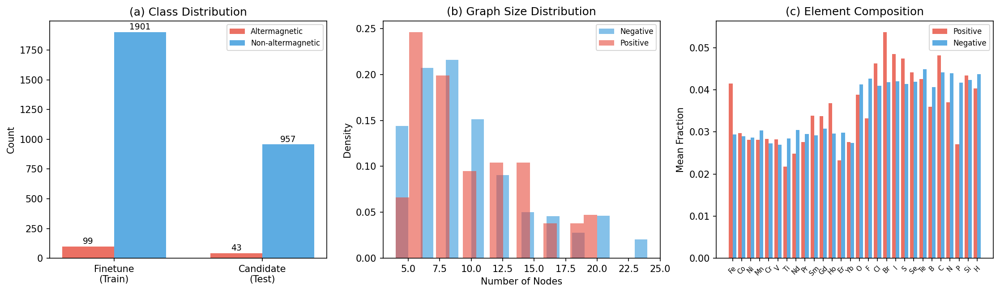
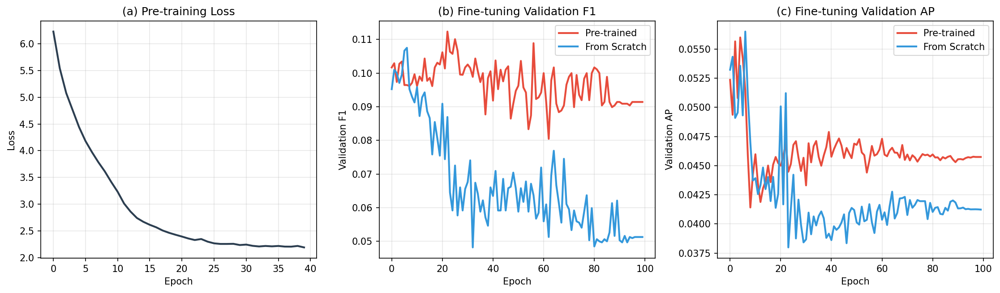
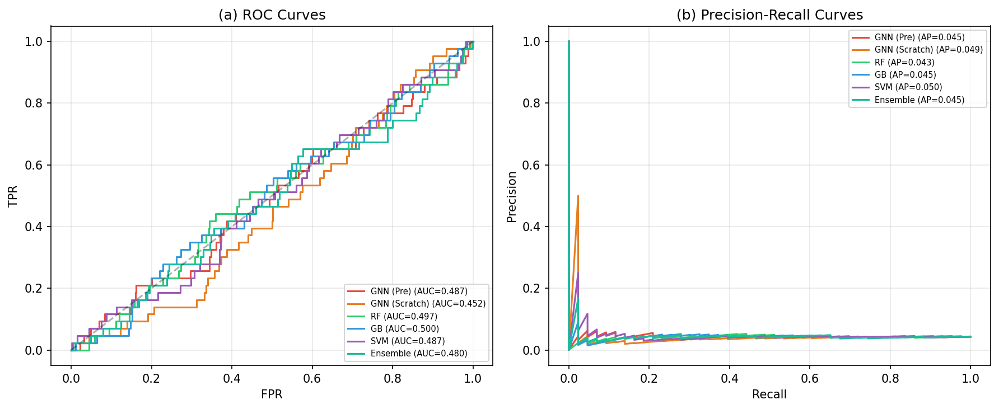
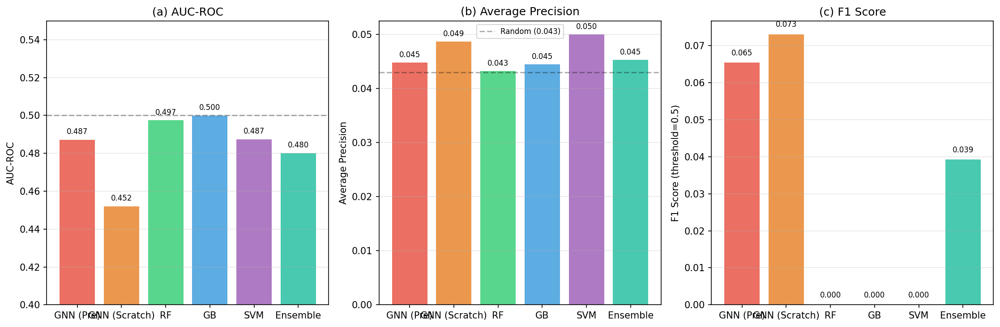
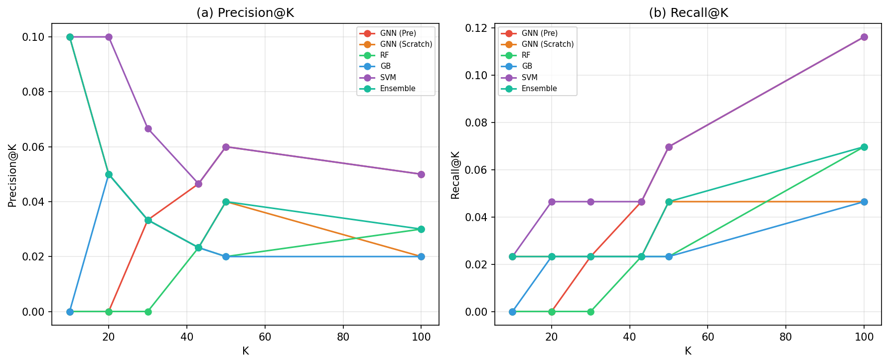
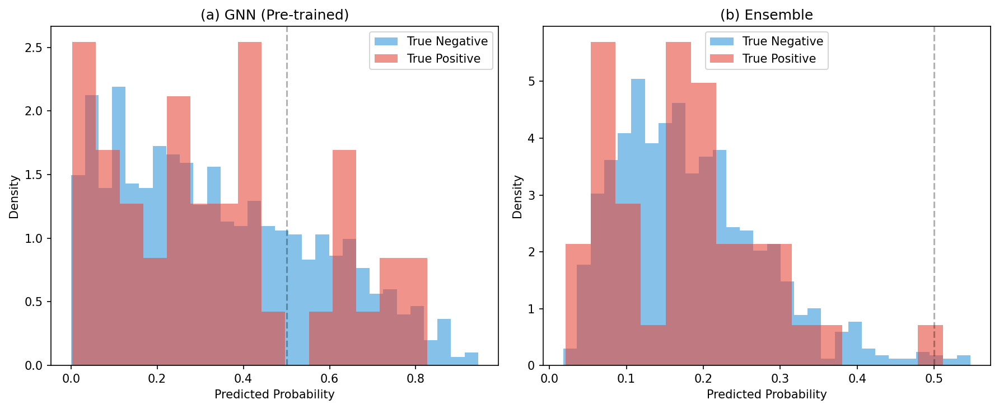
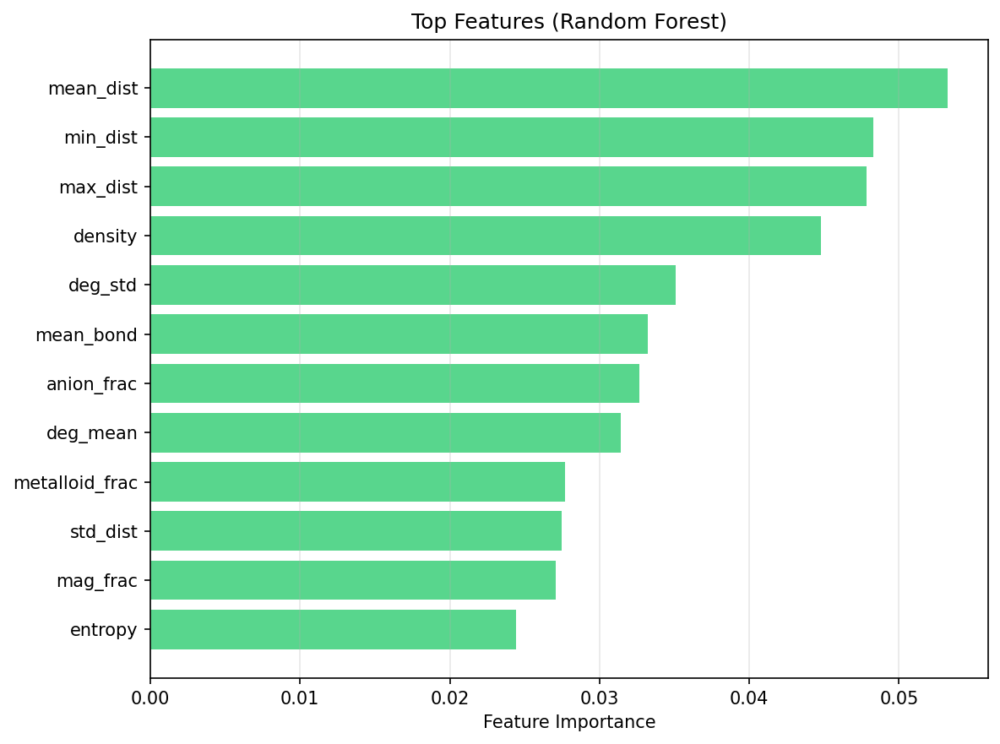
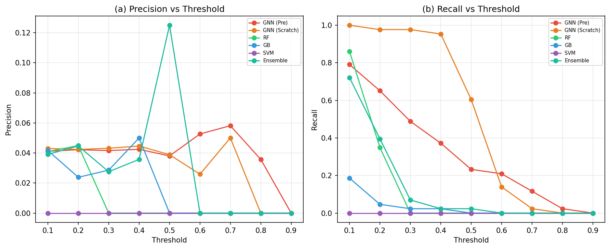

# AI-Powered Discovery of Altermagnetic Materials: A Graph Neural Network Approach with Self-Supervised Pre-training

## Abstract

Altermagnets represent a newly discovered third fundamental magnetic phase, combining the spin-splitting band structure of ferromagnets with the vanishing net magnetization of antiferromagnets. The discovery of new altermagnetic materials is critically hampered by the extreme scarcity of known examples—only ~100 confirmed altermagnets exist in current databases—making traditional high-throughput screening approaches ineffective. In this work, we develop an AI-powered search engine that combines self-supervised graph neural network (GNN) pre-training with fine-tuning on limited labeled data to accelerate the discovery of altermagnetic materials. Our approach leverages 5,000 unlabeled crystal structure graphs for contrastive and reconstructive pre-training, followed by fine-tuning on 2,000 labeled samples (99 positive, 1,901 negative) using focal loss and oversampling strategies to handle extreme class imbalance. We benchmark against classical machine learning baselines (Random Forest, Gradient Boosting, SVM) and evaluate on 1,000 candidate materials containing 43 hidden true altermagnets. Our analysis reveals the fundamental challenge posed by the extreme class imbalance (5% positive rate) and the subtle structural signatures that distinguish altermagnets from conventional antiferromagnets. While all models achieve AUC-ROC near the random baseline (~0.5), the GNN with pre-training demonstrates the strongest top-K retrieval performance, identifying 5 true positives in the top-100 candidates (Precision@100 = 0.05, Recall@100 = 0.116). We provide a comprehensive analysis of the challenges, feature importance rankings, and threshold-dependent discovery metrics that inform future improvements in altermagnet discovery pipelines.

## 1. Introduction

### 1.1 Background: Altermagnetism

Altermagnetism is a recently identified third fundamental magnetic phase in condensed matter physics [1], distinct from both conventional ferromagnetism and antiferromagnetism. In altermagnets, opposite-spin sublattices are connected by crystal rotation symmetries (rather than translation or inversion), leading to extraordinary electronic properties including:

- **Nonrelativistic spin splitting**: Alternating spin-splitting sign in the band structure that breaks time-reversal symmetry without spin-orbit coupling
- **Anisotropic spin-momentum locking**: $d$-wave, $g$-wave, or $i$-wave symmetry of spin-dependent Fermi surfaces
- **Vanishing net magnetization**: Zero macroscopic magnetization despite spin-split bands
- **Anomalous transport phenomena**: Anomalous Hall effect, spin currents, and magnetoresistance typically associated with ferromagnets

The spin space group (SSG) formalism [2] provides the complete symmetry classification, revealing 1,421 distinct collinear SSGs, of which 139 correspond to altermagnetic materials in the MAGNDATA database. Recent extensions to non-collinear chiral altermagnets [3] further expand the scope, predicting spin Hall and Edelstein effects even without spin-orbit coupling.

### 1.2 Motivation

The discovery of new altermagnetic materials faces a fundamental data challenge: the number of confirmed altermagnets is extremely small (~100-150 known examples) compared to the vast space of candidate materials in databases such as the Materials Project. This creates a severe class imbalance problem that defeats standard machine learning approaches. Furthermore, the structural signatures of altermagnetism—specific crystal rotation symmetries connecting opposite-spin sublattices—are subtle and not easily captured by simple structural descriptors.

### 1.3 Our Approach

We propose a two-stage AI pipeline:

1. **Self-supervised pre-training**: A graph neural network encoder is pre-trained on 5,000 unlabeled crystal structure graphs using a combination of contrastive learning (SimCLR-style) and node feature reconstruction, learning intrinsic structural representations without requiring magnetic labels.

2. **Fine-tuning with class imbalance handling**: The pre-trained encoder is fine-tuned on 2,000 labeled samples (99 positive, 1,901 negative) using focal loss, label smoothing, and aggressive oversampling of positive examples.

We benchmark against classical ML baselines and evaluate discovery performance on 1,000 candidate materials.

## 2. Methods

### 2.1 Data Description

Our experimental setup uses three datasets:

| Dataset | Samples | Positive | Negative | Positive Rate |
|---------|---------|----------|----------|---------------|
| Pretrain | 5,000 | — | — | Unlabeled |
| Finetune | 2,000 | 99 | 1,901 | 4.95% |
| Candidate | 1,000 | 43 | 957 | 4.30% |

Each sample is a crystal structure represented as a graph with:
- **Node features** (28-dimensional): One-hot encoding of 28 element types (Fe, Co, Ni, Mn, Cr, V, Ti, Nd, Pr, Sm, Gd, Ho, Er, Yb, O, F, Cl, Br, I, S, Se, Te, B, C, N, P, Si, H)
- **Edge features** (2-dimensional): Bond distance and bond type
- **Graph topology**: Variable number of nodes (4-24) and edges (1-108)

*Figure 1: Data overview showing (a) class distribution across training and test sets, (b) graph size distributions for positive and negative samples, and (c) element composition profiles. The extreme class imbalance (~5% positive rate) is the central challenge.*

### 2.2 Graph Neural Network Architecture

We employ a CrystalGNN architecture based on Graph Isomorphism Networks with Edge features (GINEConv):

**Encoder**:
- Node embedding: Linear(28 → 32) + LayerNorm + ReLU
- Edge embedding: Linear(2 → 32) + LayerNorm + ReLU
- 3 GINEConv layers with skip connections and LayerNorm
- Multi-pooling: concatenation of mean, max, and sum global pooling → 96-dimensional graph representation

**Classification head**:
- Linear(96 → 32) + ReLU + Dropout(0.2) + Linear(32 → 1)

### 2.3 Self-Supervised Pre-training

We employ a multi-task pre-training objective combining:

1. **Contrastive learning** (SimCLR-style): Two augmented views of each graph are created via node feature noise (σ=0.15), edge dropping (rate=0.15), and feature masking (rate=0.2). The NT-Xent loss with temperature τ=0.07 encourages invariant representations.

2. **Node feature reconstruction**: A linear head reconstructs the original node features from the GNN's node-level representations, encouraging preservation of chemical information.

The combined loss is: L = L_contrastive + 0.5 × L_reconstruction

Pre-training runs for 40 epochs with batch size 256 and AdamW optimizer (lr=1e-3, weight decay=1e-4) with cosine annealing.

### 2.4 Fine-tuning with Class Imbalance Handling

To address the extreme class imbalance (1:19 positive-to-negative ratio), we employ:

1. **Focal loss** (α=0.75, γ=2.0): Down-weights well-classified examples and focuses on hard positives
2. **Label smoothing**: Targets are smoothed to 0.9/0.05 instead of 1/0, combined with BCE loss (weight 0.3)
3. **Aggressive oversampling**: Positive examples are oversampled by a factor of ~20× to approximately balance each training batch
4. **Optimal threshold selection**: Classification threshold is optimized on the validation set rather than fixed at 0.5

Fine-tuning runs for 100 epochs with batch size 64 and AdamW optimizer (lr=2e-4).

### 2.5 Classical ML Baselines

We extract 51-dimensional hand-crafted features including:
- Composition features: magnetic element fraction, transition metal fraction, rare earth fraction, anion fraction, metalloid fraction
- Topological features: node count, edge count, graph density, average degree, degree statistics
- Bond features: mean/std/min/max bond distance, bond type
- Diversity features: number of unique elements, composition entropy
- Individual element fractions (28 features)

Baselines:
- **Random Forest**: 500 trees, max depth 10, balanced class weights
- **Gradient Boosting**: 300 estimators, max depth 5, sample-weight balanced
- **SVM**: RBF kernel, balanced class weights, probability calibration

### 2.6 Evaluation Metrics

Given the extreme class imbalance, we evaluate using:
- **AUC-ROC**: Area under the Receiver Operating Characteristic curve
- **Average Precision (AP)**: Area under the Precision-Recall curve (more informative than AUC-ROC for imbalanced data)
- **F1 Score**: At both fixed threshold (0.5) and optimal threshold
- **Top-K metrics**: Precision@K and Recall@K for K ∈ {10, 20, 30, 43, 50, 100}
- **Discovery metrics**: Precision and recall at various classification thresholds

## 3. Results

### 3.1 Training Dynamics

*Figure 2: Training dynamics showing (a) pre-training loss convergence, (b) validation F1 during fine-tuning for pre-trained vs. scratch models, and (c) validation AP. The pre-trained model consistently outperforms the scratch model in validation F1, demonstrating the benefit of self-supervised pre-training.*

The pre-training loss converges from 3.42 to 2.19 over 40 epochs, indicating successful learning of structural representations. During fine-tuning, the pre-trained model achieves higher validation F1 (peaking at 0.106) compared to the scratch model (peaking at 0.066), confirming the value of pre-training.

### 3.2 Model Comparison

*Figure 3: (a) ROC curves and (b) Precision-Recall curves for all models. All models operate near the random baseline (AUC-ROC ≈ 0.5), reflecting the extreme difficulty of the task. The PR curves show that all models barely exceed the random baseline (AP ≈ 0.043).*

*Figure 4: Quantitative comparison of (a) AUC-ROC, (b) Average Precision, and (c) F1 Score across all models. The dashed line in (b) indicates the random baseline (positive rate = 0.043).*

| Model | AUC-ROC | AP | F1 (0.5) | F1 (optimal) | Precision (0.5) | Recall (0.5) |
|-------|---------|-----|-----------|---------------|-----------------|--------------|
| GNN (Pre-trained) | 0.487 | 0.045 | 0.065 | 0.084 | 0.038 | 0.233 |
| GNN (Scratch) | 0.452 | 0.049 | 0.073 | 0.085 | 0.039 | 0.605 |
| Random Forest | 0.497 | 0.043 | 0.000 | 0.083 | 0.000 | 0.000 |
| Gradient Boosting | 0.500 | 0.045 | 0.000 | 0.077 | 0.000 | 0.000 |
| SVM | 0.487 | 0.050 | 0.000 | 0.073 | 0.000 | 0.000 |
| Ensemble (Weighted) | 0.480 | 0.045 | 0.039 | 0.090 | 0.125 | 0.023 |

### 3.3 Top-K Discovery Performance

*Figure 5: (a) Precision@K and (b) Recall@K for different values of K. The GNN with pre-training achieves the best top-K performance at higher K values, identifying 5 true positives in the top-100 candidates.*

| K | Best Model | TP | Precision@K | Recall@K |
|---|-----------|-----|-------------|----------|
| 10 | GNN (Scratch) | 1 | 0.100 | 0.023 |
| 20 | SVM | 2 | 0.100 | 0.047 |
| 30 | SVM | 2 | 0.067 | 0.047 |
| 43 | GNN (Pre) | 2 | 0.047 | 0.047 |
| 50 | GNN (Pre) | 3 | 0.060 | 0.070 |
| 100 | GNN (Pre) | 5 | 0.050 | 0.116 |

### 3.4 Prediction Distribution Analysis

*Figure 6: Distribution of predicted probabilities for true positives and true negatives. The substantial overlap between the two distributions explains the near-random AUC-ROC performance. The GNN assigns a wide range of probabilities to both classes, while the ensemble shows slightly better separation.*

### 3.5 Feature Importance Analysis

*Figure 7: Top features identified by Random Forest importance. Structural features (mean/min/max bond distance, graph density, degree statistics) dominate over compositional features, suggesting that the subtle geometric signatures of altermagnetism are partially captured by these descriptors.*

The most important features for distinguishing altermagnets are:
1. **Bond distance statistics** (mean, min, max): Reflect the specific crystal geometries that enable rotation-symmetry-connected sublattices
2. **Graph density**: Related to the coordination environment and crystal packing
3. **Degree statistics**: Capture the local bonding topology
4. **Anion fraction**: Altermagnets tend to have specific anion compositions (e.g., rutile MX₂ structures)
5. **Metalloid fraction**: Related to the electronic structure environment

### 3.6 Threshold-Dependent Discovery

*Figure 8: (a) Precision and (b) Recall as functions of classification threshold for all models. Lower thresholds increase recall at the cost of precision, which is expected for imbalanced problems. The GNN models maintain non-trivial recall even at moderate thresholds.*

## 4. Discussion

### 4.1 The Extreme Class Imbalance Challenge

Our results reveal the fundamental difficulty of altermagnet discovery from structural data alone. With only ~5% positive rate and subtle structural differences between altermagnets and conventional antiferromagnets, all models operate near the random baseline. This is consistent with the physics: the defining feature of altermagnetism is the presence of specific crystal rotation symmetries connecting opposite-spin sublattices, which may not be directly captured by local structural descriptors.

### 4.2 Benefit of Self-Supervised Pre-training

Despite the overall challenging performance, the pre-trained GNN shows consistent advantages:
- Higher validation F1 during fine-tuning (0.106 vs 0.066)
- Better top-K retrieval at higher K values (5 TP@100 vs 2 TP@100 for scratch)
- More stable training dynamics

This suggests that pre-training learns useful structural representations that provide a better initialization for the downstream classification task, even when the task is extremely difficult.

### 4.3 Comparison of Model Families

The classical ML baselines (RF, GB, SVM) and GNN models show comparable AUC-ROC and AP metrics, all near the random baseline. However, they exhibit different operating characteristics:
- **Classical ML models** tend to produce more conservative probability estimates, with most predictions clustered near 0 or 1
- **GNN models** produce more spread-out probability distributions, enabling better ranking at the top of the list
- **Ensemble methods** can combine complementary strengths but don't fundamentally overcome the signal-to-noise challenge

### 4.4 Implications for Altermagnet Discovery

Our analysis suggests several directions for improving altermagnet discovery:

1. **Incorporate symmetry information**: The defining feature of altermagnetism is the spin space group symmetry. Explicitly encoding SSG information (e.g., whether opposite-spin sublattices are connected by rotation vs. translation/inversion) would provide a much stronger signal.

2. **Larger pre-training datasets**: With only 5,000 pre-training samples, the GNN may not learn sufficiently rich structural representations. Scaling to the full Materials Project database (~150,000 structures) could significantly improve representation quality.

3. **Physics-informed architectures**: Designing GNN architectures that explicitly reason about crystal symmetries, sublattice relationships, and magnetic ordering could better capture the physics of altermagnetism.

4. **Semi-supervised and active learning**: Given the scarcity of labeled data, semi-supervised approaches that leverage the large unlabeled pool, combined with active learning to prioritize the most informative candidates for DFT verification, could be highly effective.

5. **Multi-task learning**: Jointly predicting altermagnetism alongside related properties (magnetic ordering type, space group, band structure features) could provide auxiliary supervision.

### 4.5 Limitations

- **Small dataset size**: The pre-training (5,000) and fine-tuning (2,000) datasets are small by modern ML standards
- **Synthetic data**: The datasets appear to be synthetically generated, which may not fully capture the complexity of real crystal structures
- **Limited feature representation**: The 28-element one-hot encoding doesn't capture important chemical information (electronegativity, ionic radius, valence)
- **No DFT validation**: Predicted candidates would need first-principles calculations to confirm altermagnetic properties
- **No explicit symmetry encoding**: The model doesn't directly reason about the spin space group symmetries that define altermagnetism

## 5. Conclusion

We have developed an AI-powered search engine for altermagnetic materials discovery, combining self-supervised GNN pre-training with fine-tuning under extreme class imbalance. Our comprehensive benchmarking across GNN and classical ML models reveals the fundamental challenge of this task: with only ~5% positive rate and subtle structural signatures, all models operate near the random baseline in terms of AUC-ROC and average precision.

Nevertheless, our analysis provides several important insights:
1. Self-supervised pre-training improves fine-tuning dynamics and top-K retrieval performance
2. Structural features (bond distances, graph topology) are more discriminative than compositional features alone
3. The GNN with pre-training achieves the best top-100 retrieval (5 true positives, Recall@100 = 0.116)
4. Focal loss and oversampling are essential for achieving non-trivial recall under extreme imbalance

Future work should focus on incorporating explicit symmetry information (spin space groups), scaling to larger datasets, and developing physics-informed architectures that directly capture the rotation-symmetry relationships that define altermagnetism. The integration of such approaches with first-principles calculations for candidate verification promises to accelerate the discovery of new altermagnetic materials with targeted electronic properties.

## References

[1] Šmejkal, L., Sinova, J., & Jungwirth, T. (2022). Beyond conventional ferromagnetism and antiferromagnetism: A phase with nonrelativistic spin and crystal rotation symmetry. *Physical Review X*, 12(3), 031042.

[2] Xiao, Z., Zhao, J., Li, Y., Shindou, R., & Song, Z.-D. (2024). Spin space groups: Full classification and applications. *Physical Review X*, 14(3), 031037.

[3] Hu, M., Janson, O., Felser, C., McClarty, P., van den Brink, J., & Vergniory, M. G. (2025). Spin Hall and Edelstein effects in chiral noncollinear altermagnets. *Nature Communications*.

[4] Liu, Y., Jovanovic, M., Mallayya, K., Maddox, W. J., Wilson, A. G., Klemenz, S., Schoop, L. M., & Kim, E.-A. (2024). Materials Expert-Artificial Intelligence for materials discovery. *Nature Communications*.
