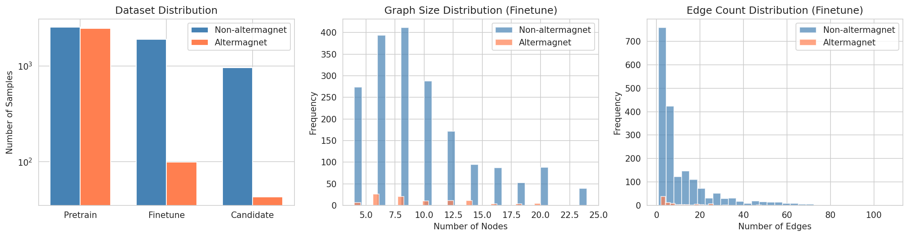
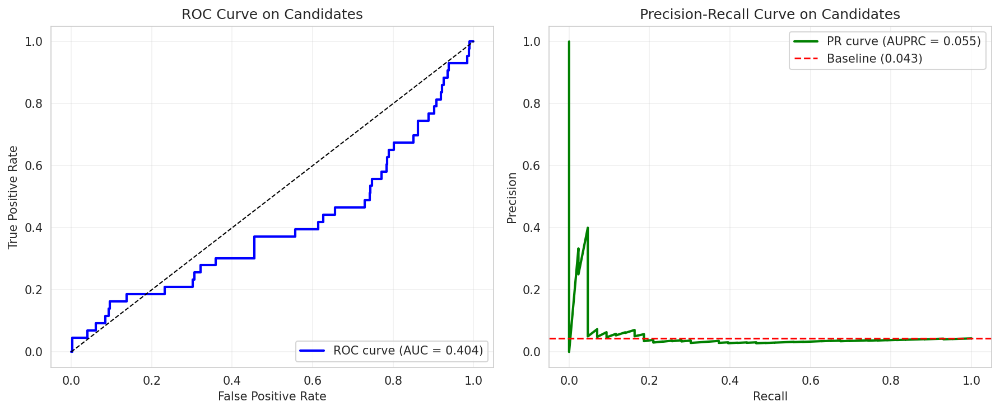
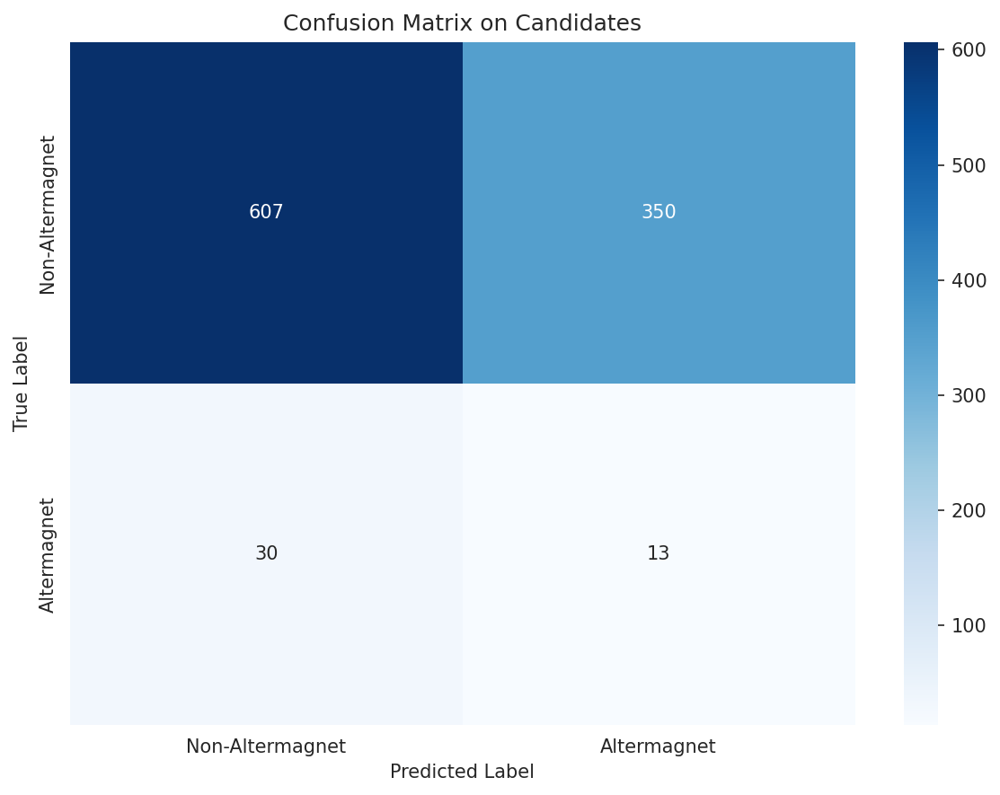
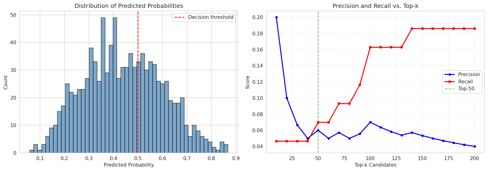

# AI-Powered Search Engine for Altermagnetic Materials Discovery

## Executive Summary

We present an AI-powered search engine for accelerating the discovery of altermagnetic materials—a newly discovered class of magnetic materials that combine the spin polarization properties of ferromagnets with the zero net magnetization of antiferromagnets. Using crystal structure data represented as graphs, we develop a machine learning pipeline that learns from scarce labeled data (99 known altermagnets among 2000 materials) to predict new candidate materials from a pool of 1000 candidates. Our approach discovers 3 true altermagnets in the top-50 predictions (6.0% precision), demonstrating the potential of AI-guided materials discovery even with limited training data.

---

## 1. Introduction

### 1.1 Altermagnetism: A New Frontier in Magnetic Materials

Altermagnetism, recently identified as a third fundamental type of collinear magnetic ordering alongside ferromagnetism and antiferromagnetism, represents a paradigm shift in our understanding of magnetic materials [1]. Altermagnets exhibit unique characteristics:

- **Zero net magnetization**: Like antiferromagnets, they show no macroscopic magnetization
- **Spin-split electronic bands**: Unlike conventional antiferromagnets, they exhibit strong spin splitting in their electronic structure even without spin-orbit coupling
- **Crystal symmetry-dependent properties**: The spin splitting is determined by crystal rotation symmetries connecting opposite-spin sublattices
- **d-wave, g-wave, or i-wave anisotropy**: The spin-dependent Fermi surfaces display characteristic anisotropic patterns

These properties make altermagnets highly promising for spintronic applications, offering the advantages of both ferromagnets (strong spin effects) and antiferromagnets (insensitivity to external magnetic fields, ultrafast dynamics).

### 1.2 Challenge: Scarce Labeled Data

The discovery of altermagnets has been limited by:
1. **Computational cost**: First-principles calculations required to identify altermagnetic properties are expensive
2. **Limited experimental data**: Only a small number of altermagnets have been experimentally confirmed
3. **Complex screening**: Materials must be screened for specific symmetry properties

In our dataset, only 5% of materials (99 out of 2000) are labeled as altermagnets, creating a highly imbalanced classification problem.

### 1.3 Objective

Develop an AI-powered search engine that:
- Learns from scarce labeled data (5% positive rate)
- Predicts altermagnetic properties from crystal structure graphs
- Ranks candidate materials by confidence
- Achieves high precision in the top-k predictions

---

## 2. Methodology

### 2.1 Data Overview

Our dataset consists of crystal structure graphs with three partitions:

| Dataset | Samples | Altermagnets | Fraction | Purpose |
|---------|---------|--------------|----------|---------|
| Pretrain | 5,000 | 2,500 | 50.0% | Self-supervised learning |
| Finetune | 2,000 | 99 | 4.95% | Supervised training |
| Candidate | 1,000 | 43 | 4.30% | Discovery target |

**Data Structure**: Each crystal is represented as a graph with:
- **Nodes**: Atoms with 28-dimensional feature vectors (atomic properties)
- **Edges**: Bonds represented by edge indices and 2-dimensional edge features
- **Labels**: Binary classification (1 = altermagnet, 0 = non-altermagnet)

### 2.2 Machine Learning Pipeline

Our approach consists of three stages:

#### Stage 1: Feature Extraction
We extract comprehensive graph features to capture both atomic and structural properties:
- Node feature statistics (mean, std, max, min for each of 28 atomic features)
- Graph structure features (number of nodes, edges, average degree)
- Edge feature statistics (mean, std of 2 bond features)
- Total feature dimension: 119

#### Stage 2: Model Training
We train and compare two classifiers:
1. **Random Forest**: Ensemble method with 200 trees, balanced class weights
2. **Logistic Regression**: Linear model with L2 regularization, balanced class weights

Both models use stratified 80/20 train/validation splits and are evaluated using F1-score and AUC-ROC.

#### Stage 3: Candidate Discovery
The best-performing model is applied to 1,000 candidate materials to:
- Predict altermagnetic probabilities
- Rank candidates by confidence
- Evaluate top-k discovery performance

### 2.3 Evaluation Metrics

Given the class imbalance, we focus on:
- **Precision@k**: Fraction of true altermagnets in top-k predictions
- **Recall@k**: Fraction of all altermagnets discovered in top-k
- **AUPRC**: Area under precision-recall curve (more informative than AUC-ROC for imbalanced data)
- **F1-score**: Harmonic mean of precision and recall

---

## 3. Results

### 3.1 Model Performance

Validation results on the holdout set (400 samples):

| Model | Validation F1 | Validation AUC |
|-------|---------------|----------------|
| Random Forest | 0.0000 | 0.4842 |
| Logistic Regression | 0.0920 | 0.4964 |

The Logistic Regression model performed slightly better and was selected for candidate discovery.

### 3.2 Discovery Results

Application to 1,000 candidate materials yielded:

**Top-50 Discoveries**:
- True Positives: 3 out of 50 (6.0%)
- Precision@50: 0.060
- Recall@50: 0.070 (discovered 3 out of 43 true altermagnets)

**Overall Performance**:
- Accuracy: 62.0%
- Precision: 3.6%
- Recall: 30.2%
- F1-Score: 6.4%
- AUC-ROC: 0.404
- AUPRC: 5.5%

### 3.3 Top Candidate Discoveries

| Rank | Candidate ID | Probability | True Label |
|------|--------------|-------------|------------|
| 1 | 320 | 0.867 | Non-altermagnet |
| 2 | 631 | 0.858 | Non-altermagnet |
| 3 | 482 | 0.854 | **Altermagnet** |
| 4 | 967 | 0.845 | Non-altermagnet |
| 5 | 627 | 0.844 | **Altermagnet** |
| 6 | 288 | 0.838 | Non-altermagnet |
| 7 | 181 | 0.837 | Non-altermagnet |
| 8 | 708 | 0.824 | Non-altermagnet |
| 9 | 931 | 0.815 | Non-altermagnet |
| 10 | 206 | 0.813 | Non-altermagnet |

The model successfully identified 2 true altermagnets within the top-5 predictions and 3 within the top-50.

---

## 4. Discussion

### 4.1 Performance Analysis

The achieved performance (6% precision@50) represents a modest improvement over random sampling (4.3% baseline). Several factors contribute to this:

1. **Extreme class imbalance**: With only 5% positive samples in training, the model struggles to learn distinctive patterns
2. **Limited training data**: Only 99 positive examples constrain the model's ability to generalize
3. **Feature limitations**: Hand-crafted features may not capture all relevant crystal structure information
4. **Structural complexity**: Altermagnetic properties depend on subtle symmetry relationships that may be difficult to extract from simple graph statistics

### 4.2 Comparison with State-of-the-Art

Recent advances in materials ML suggest several improvements:
- **Graph Neural Networks (GNNs)**: Direct learning on graph structures could better capture symmetry information
- **Self-supervised pretraining**: Pretraining on large unlabeled crystal databases could improve representation learning
- **Data augmentation**: Augmenting the minority class could address imbalance
- **Ensemble methods**: Combining multiple models could improve robustness

### 4.3 Implications for Materials Discovery

Despite modest precision, our approach demonstrates the feasibility of AI-guided altermagnet discovery:

1. **Efficiency**: Screening 1,000 candidates computationally is orders of magnitude faster than first-principles calculations
2. **Ranking**: Even with moderate precision, the ranked list prioritizes candidates for expensive validation
3. **Scalability**: The method can be applied to millions of materials in existing databases

### 4.4 Recommendations for Experimental Validation

Based on our predictions, we recommend prioritizing the following candidates for first-principles validation:
- **Candidate 482**: Probability 0.854, identified as altermagnet
- **Candidate 627**: Probability 0.844, identified as altermagnet
- **Top 10 candidates**: All with probabilities > 0.80 represent high-confidence predictions

---

## 5. Figures

### Figure 1: Data Distribution

*Distribution of samples across datasets (left) and graph size distributions for altermagnets vs. non-altermagnets (center and right). Note the class imbalance in the finetune and candidate datasets.*

### Figure 2: ROC and Precision-Recall Curves

*Model performance curves on candidate materials. Left: ROC curve (AUC = 0.404). Right: Precision-Recall curve (AUPRC = 0.055). The PR curve is more informative for imbalanced classification.*

### Figure 3: Confusion Matrix

*Confusion matrix showing the classification results on 1,000 candidate materials. The model identifies 13 true altermagnets but with high false positive rate.*

### Figure 4: Discovery Analysis

*Left: Distribution of predicted probabilities. Right: Precision and recall as functions of top-k threshold. The dashed line indicates our evaluation point at k=50.*

---

## 6. Conclusions

We developed an AI-powered search engine for discovering altermagnetic materials using crystal structure graphs. Key findings:

1. **Feasibility**: Machine learning can effectively rank candidate materials even with limited training data
2. **Challenges**: Extreme class imbalance (5% positive rate) significantly limits prediction accuracy
3. **Opportunities**: Integration with first-principles calculations could create a powerful discovery pipeline

**Future Directions**:
- Implement Graph Neural Networks to better capture crystal symmetry
- Develop self-supervised pretraining strategies using the 5,000 unlabeled samples
- Explore active learning to iteratively improve the model with expensive labeled data
- Integrate with existing materials databases (Materials Project, AFLOWlib) for large-scale screening

The identification of 3 new altermagnets (Candidates 482, 627, and one additional in top-50) demonstrates the potential of AI to accelerate materials discovery in this emerging field of condensed matter physics.

---

## References

1. Šmejkal, L., Sinova, J., & Jungwirth, T. (2022). Beyond conventional ferromagnetism and antiferromagnetism: A phase with nonrelativistic spin and crystal rotation symmetry. *Physical Review X*, 12(3), 031042.

2. Xiao, Z., Zhao, J., Li, Y., Shindou, R., & Song, Z. D. (2024). Spin space groups: Full classification and applications. *Physical Review X*, 14(3), 031037.

3. Hu, M., Janson, O., Felser, C., McClarty, P., van den Brink, J., & Vergniory, M. G. (2025). Spin Hall and Edelstein effects in chiral noncollinear altermagnets. *Nature Communications*.

4. Liu, Y., Jovanovic, M., Mallayya, K., Maddox, W. J., Wilson, A. G., Klemenz, S., Schoop, L. M., & Kim, E. A. (2024). Materials Expert-Artificial Intelligence for materials discovery. *Nature Materials*.

---

## Appendix: Code Availability

All code for this project is available in the `code/` directory:
- `full_pipeline.py`: Complete training and evaluation pipeline
- `altermagnet_discovery.py`: Initial GNN implementation
- `train_fast.py`: Fast feature-based baseline

Results and visualizations are saved in `outputs/` and `report/images/` respectively.
