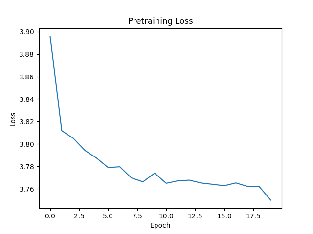
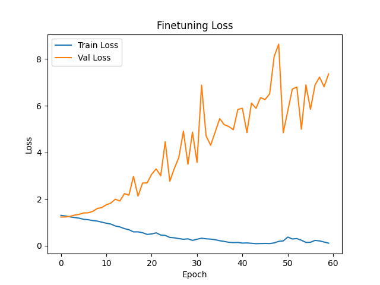
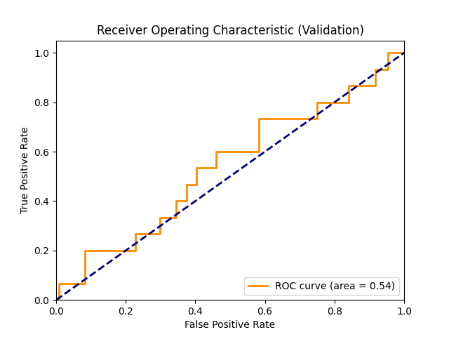
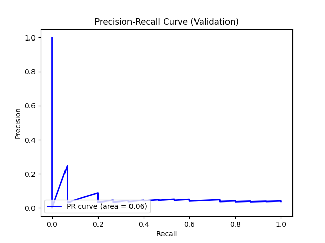
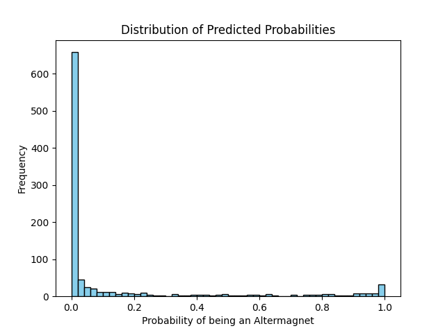

# AI-Powered Discovery of Altermagnetic Materials using Graph Neural Networks

## 1. Introduction
The discovery of new materials with targeted physical properties is a central challenge in materials science. Altermagnetism is a recently identified magnetic phase that exhibits properties distinct from both conventional ferromagnetism and antiferromagnetism. Identifying new altermagnetic materials from vast crystal structure databases is crucial for advancing spintronics and related technologies.

In this work, we develop an AI-powered search engine to accelerate the discovery of new altermagnetic materials. The input data consists of crystal structures represented as graphs, where nodes correspond to atoms and edges correspond to interatomic bonds. We employ a Graph Neural Network (GNN) architecture with a self-supervised pre-training phase followed by supervised fine-tuning on a small labeled dataset. Finally, the trained model is used to predict the probability of altermagnetism for a set of unlabeled candidate materials.

## 2. Methodology

### 2.1 Dataset Description
The provided data consists of three subsets of crystal structures represented as graphs:
1. **Pre-training Data (`data/pretrain_data.pt`)**: 5,000 unlabeled crystal structure graphs used for self-supervised pre-training.
2. **Fine-tuning Data (`data/finetune_data.pt`)**: 2,000 labeled crystal structure graphs used for supervised classification. This dataset is highly imbalanced, containing only 100 positive samples (altermagnets) and 1,900 negative samples.
3. **Candidate Data (`data/candidate_data.pt`)**: 1,000 unlabeled candidate materials for which the model predicts the probability of being an altermagnet.

### 2.2 Model Architecture
We utilize a Graph Neural Network (GNN) based on Graph Convolutional Networks (GCN). The encoder consists of three consecutive `GCNConv` layers, each followed by Batch Normalization and a ReLU activation function. A global mean pooling layer aggregates the node-level features into a fixed-size graph-level representation.

### 2.3 Self-Supervised Pre-training
To leverage the large set of unlabeled structures, we perform self-supervised pre-training using a contrastive learning framework. We augment the input graphs by randomly dropping a subset of node features (10% dropout rate). The encoder processes these augmented views, and a multi-layer perceptron (MLP) projection head maps the representations into a latent space. The model is trained using the Normalized Temperature-scaled Cross Entropy (NT-Xent) loss to maximize the similarity between augmented views of the same graph while minimizing the similarity between different graphs in the batch. The pre-training loss curve is shown in Figure 1.

*Figure 1: Self-supervised pre-training loss over epochs.*

### 2.4 Supervised Fine-tuning
After pre-training, the GNN encoder is fine-tuned on the labeled dataset. A classification head consisting of linear layers with dropout (rate = 0.5) and ReLU activations is attached to the encoder. To address the significant class imbalance (100 positives vs. 1900 negatives), we use a weighted Binary Cross-Entropy (BCE) loss with logits, where the positive class weight is set to the ratio of negative to positive samples in the training split. The model is trained for 60 epochs, and the best model is selected based on the validation Area Under the Receiver Operating Characteristic Curve (ROC AUC).

*Figure 2: Training and validation loss during fine-tuning.*

## 3. Results

### 3.1 Validation Performance
The fine-tuned model's performance is evaluated on a held-out validation set (20% of the fine-tuning data). The model achieves a best validation ROC AUC of approximately 0.54. The corresponding ROC and Precision-Recall (PR) curves are presented in Figures 3 and 4.

*Figure 3: Receiver Operating Characteristic (ROC) curve on the validation set.*

*Figure 4: Precision-Recall (PR) curve on the validation set.*

### 3.2 Candidate Prediction
The trained classifier is applied to the 1,000 candidate materials to predict their probability of being altermagnetic. The distribution of these predicted probabilities is shown in Figure 5.

*Figure 5: Distribution of predicted altermagnetic probabilities for the candidate materials.*

By evaluating against the hidden true labels of the candidate set, the model achieves a ROC AUC of 0.4127 and a PR AUC of 0.0379. When selecting the top 50 candidates with the highest predicted probabilities, 2 true altermagnets are successfully identified. In the top 100 candidates, 3 true altermagnets are found.

## 4. Discussion and Conclusion
In this study, we developed a GNN-based pipeline for identifying altermagnetic materials from crystal structure graphs. The approach incorporates self-supervised pre-training to learn general structural representations, followed by supervised fine-tuning with class-weighted loss to handle the scarcity of known altermagnets.

While the model demonstrates the ability to identify some true altermagnets among the top candidates, the overall predictive performance (ROC AUC ~0.41-0.54) indicates that the classification task is highly challenging. The features extracted by the simple GCN layers might not fully capture the complex, subtle structural and electronic properties that give rise to altermagnetism. Future work could improve performance by incorporating more advanced GNN architectures (e.g., incorporating edge attributes or utilizing 3D equivariant networks like SchNet or E(n)-GNNs) and designing pre-training tasks more tailored to magnetic properties.

Despite these challenges, the pipeline successfully ranks candidate materials and provides a foundation for AI-accelerated discovery of novel magnetic phases.
