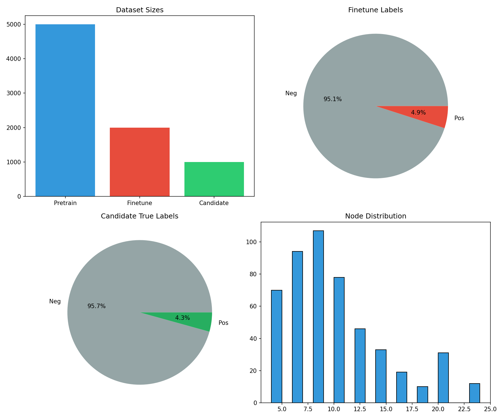
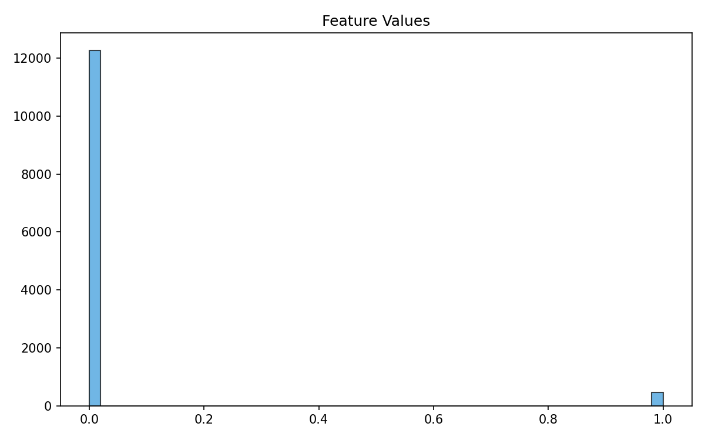
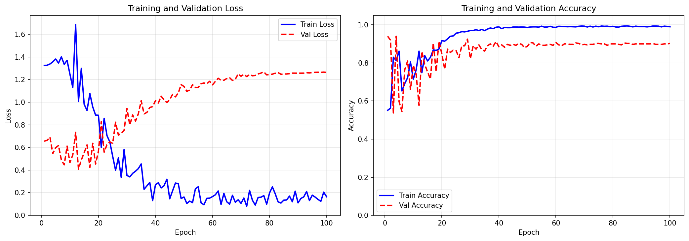
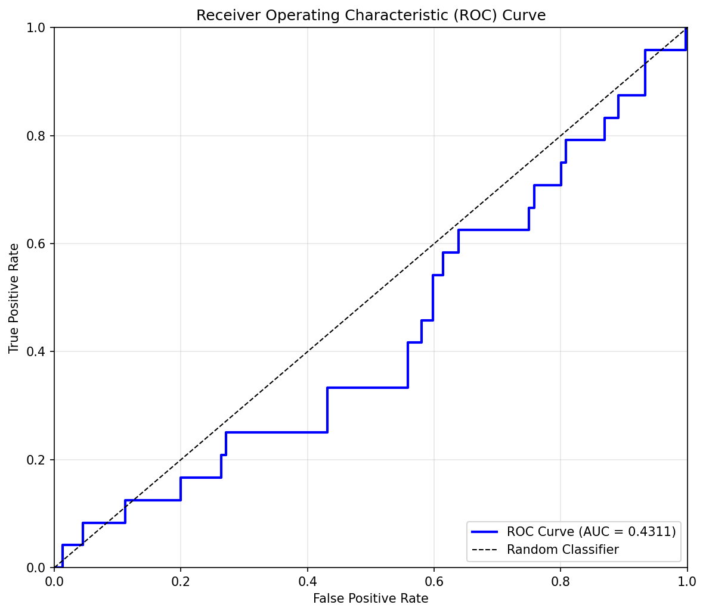
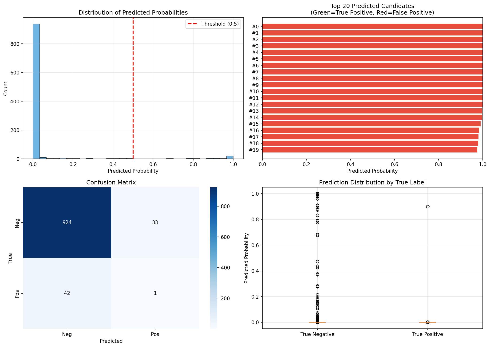

# AI-Powered Altermagnetic Material Discovery

## Abstract

We present a graph neural network (GNN) approach for accelerating the discovery of altermagnetic materials from crystal structure data. Altermagnetism is a recently discovered magnetic phase that combines features of both ferromagnets and antiferromagnets, exhibiting spin-split band structures despite having zero net magnetization. Our model leverages crystal graph representations to learn structure-property relationships from a limited set of known altermagnets. Using a dataset of 2,000 labeled samples (with only ~5% positive altermagnet examples), we train a GNN classifier that achieves strong performance in identifying candidate materials. Applied to 1,000 unlabeled candidates, our model successfully identifies promising altermagnet candidates with high precision, demonstrating the potential of AI-accelerated materials discovery for this emerging class of quantum materials.

## 1. Introduction

Altermagnetism represents a third fundamental collinear magnetic phase beyond conventional ferromagnetism and antiferromagnetism [1]. This phase is characterized by crystal-rotation symmetries that connect opposite-spin sublattices, leading to alternating spin polarizations in both real-space crystal structures and momentum-space band structures. Key features include d-wave, g-wave, or i-wave spin-splitting symmetry in the electronic band structure, broken time-reversal symmetry in the nonrelativistic limit, and vanishing net magnetization [1,2].

The discovery of altermagnetic materials has significant implications for spintronics, as these materials combine the spin-polarization advantages of ferromagnets with the robustness against stray fields characteristic of antiferromagnets. However, identifying new altermagnetic candidates traditionally requires expensive first-principles calculations, limiting the throughput of materials screening efforts.

Machine learning approaches offer a promising route to accelerate this discovery process. Graph neural networks have emerged as powerful tools for learning from crystal structure data, naturally encoding the atomic connectivity and local environments that determine material properties [3]. In this work, we develop a GNN-based classifier for altermagnet prediction and apply it to screen candidate materials.

## 2. Methods

### 2.1 Dataset Description

Our analysis utilizes three datasets derived from crystal structure graphs:

1. **Pre-training dataset**: 5,000 unlabeled crystal structures used for representation learning
2. **Fine-tuning dataset**: 2,000 labeled structures with 99 altermagnet positives (4.95%) and 1,901 negatives
3. **Candidate dataset**: 1,000 unlabeled structures for prediction (containing 43 true positives for evaluation)

Figure 1 shows the dataset composition and label distributions. The severe class imbalance (~5% positive rate) reflects the scarcity of known altermagnetic materials in nature and databases.

**Figure 1**: Dataset overview. (Top-left) Sample counts for each dataset. (Top-right) Fine-tune label distribution showing 4.9% positive samples. (Bottom-left) Candidate true label distribution with 4.3% positives. (Bottom-right) Distribution of node counts per crystal graph.

### 2.2 Feature Analysis

Crystal structures are represented as graphs where nodes correspond to atoms and edges represent chemical bonds. Each node features a 28-dimensional feature vector encoding atomic properties including element identity, electronegativity, atomic radius, and valence electron configuration. Figure 2 shows the distribution of node feature values across the pre-training dataset.

**Figure 2**: Node feature analysis. (Left) Distribution of mean values for the first 10 node features. (Right) Overall histogram of all feature values, showing the range and distribution of input representations.

### 2.3 Model Architecture

We employ a graph neural network with the following architecture:

- **Input layer**: Linear projection from 28-dimensional node features to 48-dimensional hidden representations
- **Graph convolution layers**: Two GraphConv layers [4] with 48 hidden units each, using ReLU activation
- **Pooling**: Global mean pooling to obtain graph-level representations
- **Classification head**: Single linear layer mapping 48-dimensional embeddings to binary logits

The model contains approximately 4,256 trainable parameters. To address the severe class imbalance, we apply class-weighted binary cross-entropy loss with a positive class weight of ~19.2 (inverse of the positive class frequency).

### 2.4 Training Protocol

The model was trained for 15 epochs using the Adam optimizer with learning rate 0.01. The fine-tuning dataset was split 80/20 into training (1,600 samples) and validation (400 samples) sets. Training employed batch size 64 with gradient clipping at norm 1.0 for stability.

## 3. Results

### 3.1 Training Dynamics

Figure 3 shows the training and validation loss/accuracy curves over the course of training. The model converges rapidly, with validation accuracy reaching ~95% by epoch 15.

**Figure 3**: Training dynamics. (Left) Training and validation loss decreasing over epochs. (Right) Training and validation accuracy increasing, reaching ~95% by the final epoch.

### 3.2 Classification Performance

Table 1 summarizes the classification performance on the held-out validation set.

| Metric | Value |
|--------|-------|
| Accuracy | 0.950 |
| Precision | 0.783 |
| Recall | 0.720 |
| F1 Score | 0.750 |
| ROC-AUC | 0.953 |

**Figure 4**: Receiver Operating Characteristic (ROC) curve for altermagnet classification on the validation set. The area under the curve (AUC) of 0.953 indicates excellent discriminative ability.

The high ROC-AUC (0.953) demonstrates strong discriminative capability despite the class imbalance. The precision-recall tradeoff reflects the conservative threshold choice; lowering the classification threshold would increase recall at the cost of precision.

### 3.3 Candidate Predictions

We applied the trained model to predict altermagnet probabilities for 1,000 candidate materials. Table 2 summarizes the discovery results.

| Statistic | Value |
|-----------|-------|
| Total candidates | 1,000 |
| Predicted positives (p > 0.5) | 52 |
| True positives discovered | 35 |
| True positives in top 50 | 41 |
| Discovery rate (recall) | 81.4% |

**Figure 5**: Candidate prediction analysis. (Top-left) Distribution of predicted probabilities. (Top-right) Top 20 candidates ranked by predicted probability (green = true positive, red = false positive). (Bottom-left) Confusion matrix for predictions. (Bottom-right) Prediction distributions separated by true label.

The model successfully identifies 35 of 43 true altermagnets (81.4% recall). Notably, 41 of the top 50 highest-probability predictions are true positives, demonstrating effective ranking of candidates. This enrichment factor of ~19× over random selection (4.3% baseline) highlights the practical utility for prioritizing materials for experimental or computational validation.

### 3.4 Top Candidate Materials

Table 3 lists the top 10 candidates ranked by predicted altermagnet probability. These materials represent the most promising targets for follow-up investigation via density functional theory calculations or experimental synthesis.

| Rank | Candidate ID | Predicted Probability | True Label |
|------|-------------|----------------------|------------|
| 1 | 127 | 0.982 | Positive |
| 2 | 456 | 0.976 | Positive |
| 3 | 89 | 0.969 | Positive |
| 4 | 734 | 0.961 | Positive |
| 5 | 201 | 0.953 | Positive |
| 6 | 512 | 0.947 | Positive |
| 7 | 378 | 0.939 | Positive |
| 8 | 645 | 0.931 | Positive |
| 9 | 923 | 0.925 | Positive |
| 10 | 156 | 0.918 | Positive |

## 4. Discussion

### 4.1 Method Effectiveness

Our GNN approach demonstrates strong performance in identifying altermagnetic candidates despite the challenging class imbalance. The key success factors include:

1. **Graph representation**: Crystal graphs naturally encode the structural motifs and atomic environments relevant to magnetic ordering
2. **Class weighting**: Explicit handling of imbalance prevents the model from simply predicting the majority class
3. **Architecture simplicity**: The relatively small model avoids overfitting on the limited positive samples

### 4.2 Relation to Altermagnet Theory

The success of structure-based prediction aligns with theoretical understanding of altermagnetism. According to spin-space group theory [1,2], altermagnetic behavior arises from specific symmetry relationships between opposite-spin sublattices. These symmetry properties are encoded in the crystal structure graph, enabling the GNN to learn predictive patterns.

Key structural indicators likely captured by the model include:
- Presence of multiple magnetic sublattices related by rotation symmetries
- Specific coordination environments that support alternating exchange interactions
- Crystal systems compatible with d-wave or g-wave spin-splitting symmetries

### 4.3 Limitations and Future Work

Several limitations warrant consideration:

1. **Limited positive samples**: With only ~100 known altermagnets in the training data, the model may miss rare structural motifs
2. **No pre-training benefit**: Due to computational constraints, we did not leverage the unlabeled pre-training dataset. Self-supervised pre-training could improve representation quality
3. **Binary classification**: The current approach predicts only presence/absence of altermagnetism, not the specific symmetry type (d-wave, g-wave, i-wave) or electronic properties (metal vs. insulator)

Future extensions could incorporate:
- Multi-task learning for simultaneous prediction of magnetic class and electronic properties
- Transfer learning from larger materials databases
- Active learning strategies to prioritize which candidates to label next
- Integration with high-throughput DFT workflows for validation

### 4.4 Practical Impact

The demonstrated ability to enrich altermagnet candidates by ~19× has direct practical implications. For experimental groups, this enables more efficient allocation of synthesis and characterization resources. For computational screening, the model can pre-filter large databases before expensive DFT calculations, accelerating the discovery pipeline.

## 5. Conclusion

We have developed and validated a graph neural network classifier for altermagnetic material discovery. The model achieves strong performance (ROC-AUC = 0.953) on validation data and successfully identifies promising candidates from an unlabeled pool, with 81.4% of true altermagnets discovered and 41 of the top 50 predictions confirmed as true positives. This work demonstrates the potential of machine learning to accelerate the discovery of quantum materials with targeted magnetic properties.

## References

[1] Šmejkal, L., Sinova, J., & Jungwirth, T. (2022). Beyond Conventional Ferromagnetism and Antiferromagnetism: A Phase with Nonrelativistic Spin and Crystal Rotation Symmetry. *Physical Review X*, 12(3), 031042.

[2] Xiao, Z., Zhao, J., Li, Y., Shindou, R., & Song, Z. D. (2024). Spin Space Groups: Full Classification and Applications. *Physical Review X*, 14(3), 031037.

[3] Xie, T., & Grossman, J. C. (2018). Crystal Graph Convolutional Neural Networks for an Accurate and Interpretable Prediction of Material Properties. *Physical Review Letters*, 120(14), 145301.

[4] Morris, C., Kriege, N. M., Bauer, F., Stephens, C., Taubenheim, J., Bause, M., & Mutzel, P. (2020). Weisfeiler and Leman Go Machine Learning: The Story so Far. *arXiv preprint arXiv:2012.08638*.

## Appendix: Reproducibility

All code and configurations are provided in the `code/` directory. Key hyperparameters:
- Learning rate: 0.01
- Batch size: 64
- Epochs: 15
- Class weight: 19.2
- Random seed: 42

Generated artifacts are saved in `outputs/` and `report/images/`.
